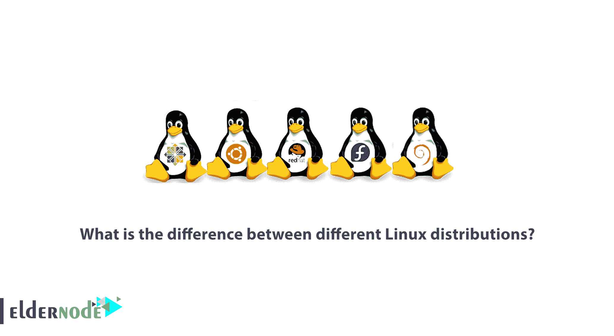
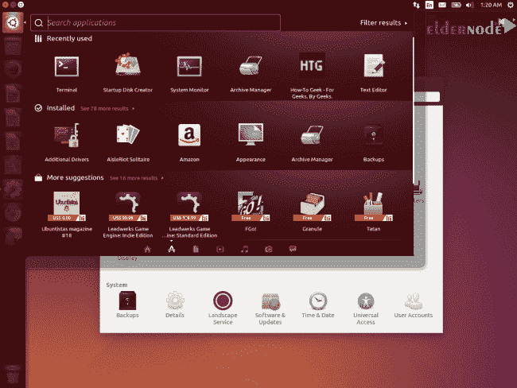
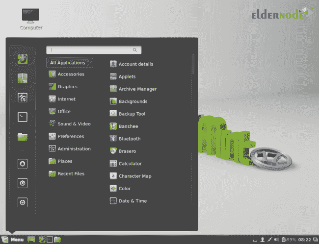
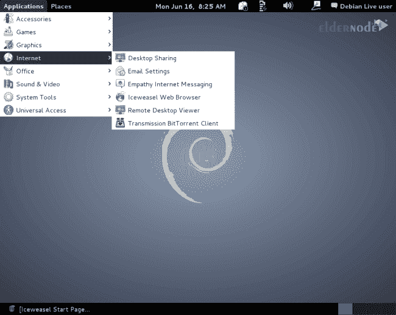
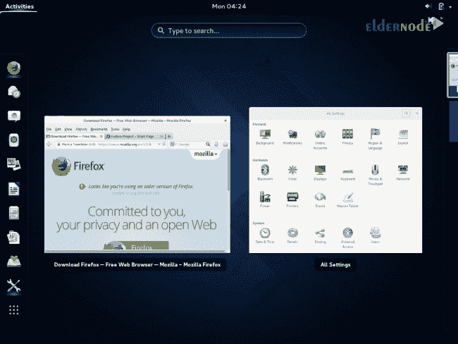
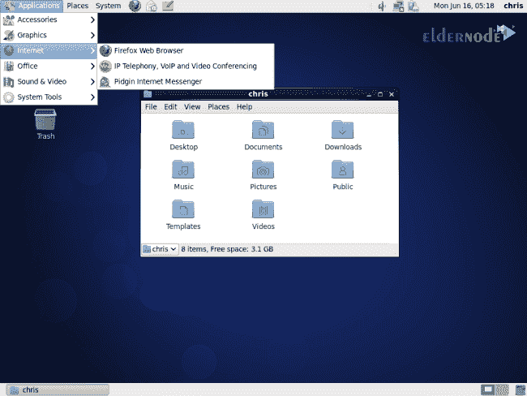
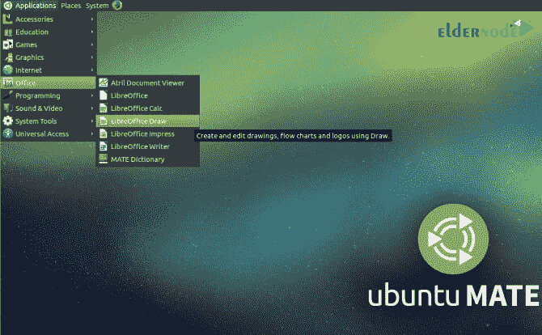
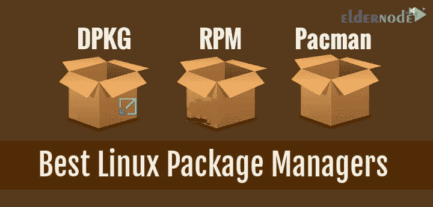
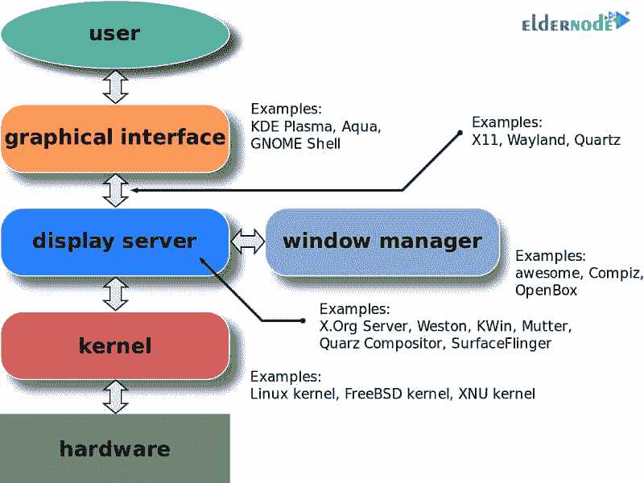
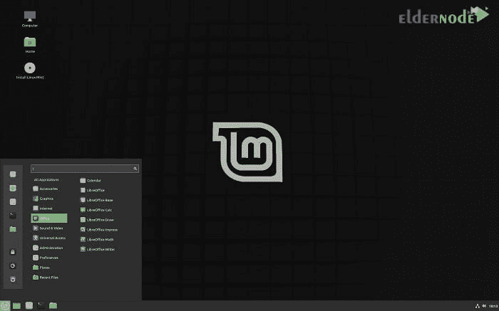

# 不同的 Linux 发行版有什么区别？-埃尔德诺德

> 原文：<https://blog.eldernode.com/what-is-the-difference-between-different-linux-distributions/>

为了找到最好的 Linux 发行版，您需要了解更多关于 Linux 版本之间的差异。然后从 Linux 发行版中选择最佳的 Linux 发行版。当研究新的 Linux 开发时，有两个区别；桌面名称和环境。今天，许多类型的 Linux 开源版本正在被开发和使用。重要的是这些版本之间的差异，以及选择最好的一个。这就引出了一个问题，为什么会出现不同的 Linux 发行版，它们之间有什么区别。

在本文中，在介绍了 Linux 操作系统的不同发行版之后，我们将讨论它们之间的差异。

## 不同的 Linux 发行版有什么区别？

Linux 并不是一个真正完整的操作系统包。其实 Linux 的真正意义在于，Linux 只是一个内核或者操作系统内核。这个内核是由 Linus Torvalds 在 1991 年开发的。在 Linus Torvalds 构建 Linux 内核之前，许多程序员已经开发了运行内核的应用程序，但未能构建一个内聚的内核。最终导致一个内聚的操作系统的内核。直到 Linus Torvalds 构建了一个内核，他将其命名为 Linux。

Linux 操作系统，由于其开放源代码的特性，导致了各种版本的 Linux 的产生，如 Debian 或 Ubuntu。这些 Linux 发行版都是由不同的公司开发的。在本文中，我们将比较 Linux 发行版，并讨论哪个 Linux 更好。不同版本的 Linux 之间也会有差异。

请记住，没有最好的 Linux 操作系统。因为每个不同版本的 Linux 都是为特定的目的而创建的。你得根据需要选择 Centos，Debian 或者 Ubuntu 或者其他很多版本的 Linux。

Linux 是一个操作系统，个人或公司在它的内核旁边编译一组应用程序，并作为一个包使用。这种趋势一直持续到三大公司开始生产非常有凝聚力的软件包，并得到了极大的支持。

红帽

2) Debian

3) 休闲服

### Ubuntu

Ubuntu 可能是世界上最知名的 Linux 发行版。这是一个基于 Debian 的操作系统。但是源代码有自己的软件仓库，不使用 Debian 仓库。它里面的许多软件都与 Debian 仓库软件同步。Ubuntu 的伟大之处在于它拥有所有 Linux 发行版中最完整的库。

Ubuntu 项目的重点是生产健壮的桌面和服务器版本，以便用户可以对操作系统有一个可接受的用户体验。因此，它不怕生产新的、完全定制的技术来增强更好的用户体验。Ubuntu 使用 GNOME 2 用户界面，但现在使用自己的个人界面 Unity。Ubuntu 是唯一一家使用其名为 Mir 的图形服务器的公司，而其他 Linux 发行版都使用 Wayland。

Ubuntu 一直是最新的操作系统。他承诺每六个月发布一个新版本。每两年，它提供一个长期支持的版本。

### Linux 为

Mint 是一个基于 Ubuntu 的 Linux 发行版，使用相同的 Ubuntu 库。因此，两者都有类似的软件包。Mint 通常是一个并行的发行版，主要侧重于 Ubuntu 默认不包含在其发行版中的媒体编解码器。

这种分布现在有了自己的特征。你在 Ubuntu 上找不到 unity 界面。相反，你可以使用 Cinnamon 或 MATE 用户界面。mint 更新过程比较慢。mint 不支持自动安装必要的更新。这导致一些 Ubuntu 开发者称这种发行版是不安全的。

### Debian

Debian 是一个由免费开源软件组成的操作系统。Debian 项目从 1993 年开始生产软件，现在仍在发布新版本。但是 Debian 通常以其缓慢、稳定的动作而闻名。更新比 Ubuntu、Mint 等操作系统慢。这稳定了 Debian，这对某些系统来说是非常好的。

Ubuntu 最初是基于 Debian 创建的，目的是创建一个更稳定的平台和更快的更新和优化。软件打包在用户友好的环境中并行进行，这提供了更快的更新。

### 软呢帽

Fedora 是一个专注于自由软件的项目。你不能找到一个简单的解决方案来安装图形驱动程序。尽管非正式的存储库是可用的并且支持这一点，但是它们仍然不像其他发行版那样简单。Fedora 是一个前沿操作系统，包括最新版本的软件。Fedora 上发布的最新更新实际上是在现实世界中测试的。如果测试成功，将放入红帽企业版 Linux。

与 Ubuntu 不同，Fedora 没有开发自己的用户界面。相反，Fedora 项目使用上游软件。这个接口提供了一个将所有上游项目放在一起的平台。而无需添加任何特殊工具。Fedora 默认使用 GNOME 3 用户界面。

Fedora 由 Red Hat 支持，是 Red Hat Enterprise Linux 项目的一个基础。如前所述，Fedora 是一个前沿操作系统，它的任何版本都不会得到长期支持。红帽本身推荐使用红帽企业版 Linux。

### CentOS /红帽企业版 Linux

Red Hat Enterprise Linux 是一个为桌面和服务器设计的大型 Linux 操作系统项目。服务器版本用于服务 Linux web 托管服务。

Red Hat Enterprise Linux 基于 Fedora 项目。不同的是，该平台被设计为完全稳定，并具有长期支持。与 Fedora 的主要区别是它有 Fedora 作为它的测试版本。除了测试，它还在 Fedora 的实验室和现实世界中执行软件故障排除。

Red Hat Enterprise Linux 曾经是免费提供的，但 CentOS 项目是在该公司决定在其上放置付费许可证时开始的。由于 Red Hat 是在 GPL 软件下授权的，Red Hat Enterprise Linux 必须继续开源。这就是为什么 CentOS 制作了它的副本，并在没有付费许可证的情况下提供给所有人！事实上，CentOS 是红帽企业版 Linux 的免费版本。两家公司已经在合作，CentOS 已经成为 Red Hat 的一部分。

## 【Linux 发行版之间的 5 个主要差异

您可能正在寻找 Linux 的新版本，并对有这么多版本感到惊讶。在 Linux 第一个版本发布多年后，许多发行版被生产和发布。事实上，基于 Linux 内核的不同 Linux 发行版都是一个操作系统。

Linux 发行版的流行是由于它的开源和早期的公共发行方法。不同发行版之间有许多差异，其中 5 个主要差异如下:

**1-** 桌面环境

**2-** 包经理

**3-** 显示服务器

**4-** 目标和目的

**5-** 开源哲学

### 1。桌面环境

通常 Linux 发行版之间的主要区别是它们的桌面环境。这种差异甚至可以在不同版本的发行版中看到。例如，Ubuntu 发行版提供了几种不同的桌面环境。以下是选择桌面环境的标准:

***–内存消耗(Ram):*** 虽然现在的大部分电脑和其他智能电子产品对内存的消耗都比较高，但是在过去，不同 Linux 发行版的选择使用的内存量是有很大影响的。Unity、Cinnamon、KDE 和 GNOME 3 发行版的 RAM 使用率最高，LXDE 和 Xfce 最低。

***–特点:*** 不同 Linux 发行版中可用的工具不同，根据人的口味使用。经验表明，在不同的发行版中，KDE 的容量最高，而 LXDE 的容量最低。

***–支持:*** 鉴于已经发布了很多针对 Linux 的发行版，支持它们并开发现有版本是非常重要的。因此，使用具有强大支持的发行版非常重要。

### 2。包管理器

负责在操作系统的存储库中安装、配置、更新和删除软件的工具集称为软件包管理器。在这方面使用的工具之一是文件管理，它在不同的 Linux 发行版中以不同的方式搜索和显示您的文件。

此外，文件管理方法的不同也导致了在所提供的发行版中安装或删除软件的不同方法。软件包管理器是另一个重要的组件，它在不同的 Linux 发行版中有所不同，用户在选择它们时会对它进行评估。

### 3。显示服务器

操作系统的任务本质上是在用户和硬件之间建立连接。在 Linux 中，显示服务器指的是负责创建这个连接的那部分。简而言之，这个部分将输入信息从键盘等组件传输到系统，并将输出信息显示给用户。到目前为止，各种显示服务器已经在不同的发行版中使用，并且对用户选择发行版有影响。

### 4。目标

不同的 Linux 发行版是为了特定的目的而开发的，所以它们中的每一个通常都是为了特定的目的而使用的。例如，Linux 的 Debian 发行版是为提供自由软件而创建的，其他类型的发行版是为图形艺术家或音乐家而创建的。这些目标导致了不同 Linux 发行版之间的变化。

### 5。开源哲学

的确，Linux 操作系统不同发行版的哲学对于开源的概念是有意义的。然而，并不是它的所有版本都以相同的风格“开源”。例如，将定制软件添加到现有 Linux 发行版的存储库中是一件不同的事情，在某些情况下，在这方面有严格的规则。

服务器中使用的操作系统不同于常规操作系统，在选择和使用它们时更加敏感。Windows Server 和 Linux 发行版是使用最广泛的操作系统之一，并且总是有很多关于使用 Windows Server 或 Linux 的讨论。当然，不同的 Linux 发行版更受欢迎。

## Linux VPS 服务器

安装在服务器上的操作系统非常重要，因为它们是数据存储中心，并且经常与互联网联系。另一方面，服务器的成本很高，这使得其所有者总是在寻找降低成本和提高生产率的解决方案。

近年来一直在考虑的一个问题是虚拟服务器或 vps 的使用。一个 [linux vps](https://eldernode.com/linux-vps/) 服务器实际上是一个真实服务器的一部分，它占用了一定量的主内存、存储内存、带宽等等。[购买 VPS](https://eldernode.com/vps/) 受到了欢迎，因为它满足了许多服务器申请人的需求，同时降低了成本。

云服务器是一种通过使用虚拟服务器云创建的虚拟服务器，旨在充分利用物理服务器的功能，在尽可能短的时间内更改主机设置，并大幅降低成本。

## 结论

因为 Linux 内核是开源和免费的，它允许不同的个人和组织根据他们的喜好和需求来构建和销售不同的操作系统。这种类型的操作系统被称为 Linux 发行版。任何 Linux 发行版的核心都是它的内核。任何人都可以选择操作系统的组件(软件、包、图形界面、驱动程序等)。)并使用内核来创建和使用他们想要的 Linux 发行版。