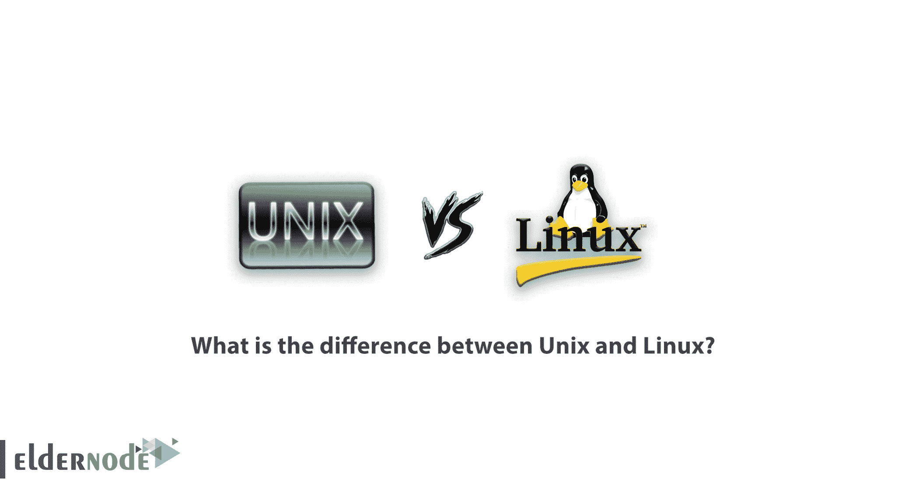

# Unix 和 Linux 有什么区别？[已更新]

> 原文：<https://blog.eldernode.com/what-is-the-difference-between-unix-and-linux/>

【更新】Linux 是一个免费的开源操作系统。Unix 是一种商业产品，由不同的公司以不同的版本出售，并且通常随其自己的硬件一起提供。尽管 Linux 和 Unix 很相似，但它们并不完全相同。在本文中，您将回顾【Unix 和 Linux 的区别？要选择一个完美的 Linux 虚拟服务器包，请访问 [Eldernode](https://eldernode.com/) ，联系我们的技术团队并购买您自己的 [Linux VPS](https://eldernode.com/linux-vps/) 主机。

## **Linux VS Unix**

你可能认为 Linux 和 Unix 是同义词，但这不是真的。Unix 和类 Unix 操作系统是一系列计算机操作系统。Linux 只是一个内核，也是最流行的版本，有许多不同的发行版本。可以研究 Linux 和 Unix 之间的差异。架构、安全性、价格、文本模式界面、发行版、默认用户界面和源代码模式是主要的不同特性。首先，让我们进一步了解他们两人，回顾他们的创作历史。

### **Unix 的起源和历史**

Unix 是由 Digital Equipment Corporation 使用汇编编程语言和 DEC PDP / 7 计算机开发的，实际上是贝尔实验室的一个非正式项目，当时贝尔实验室归 AT&T 所有。该操作系统很快被移植到 PDP / 11/20 计算机上，然后继续部署在贝尔实验室的其他计算机上。基于 C 编程语言的重写导致了 1973 年第四版 Unix 的诞生。这是一个巨大的变化，因为 C 编程语言的特性和编译器使得 Unix 端口在新的计算机体系结构上相对简单。

1973 年，Ken Thompson 和 Dennis Ritchie 在一次会议上提交了一篇关于 Unix 的论文。结果，对 Unix 的大量需求来到了贝尔实验室。但由于操作系统的销售超出了美国电话电报公司授权的经营范围，该公司无法将 Unix 作为一种商业产品对待。这导致 Unix 以源代码的形式发布，并得到认证。Unix 的低价可以覆盖运输和包装成本，并为该产品提供合理的特许经营权。Unix 当时没有技术支持(就像今天一样),它的错误也没有得到修复。

1975 年，肯·汤普森获得了加州大学伯克利分校贝尔实验室的一个研究机会。他和几个研究生一起开始改进 Unix 的本地版本。加州大学的努力导致了第一版伯克利软件发行版(Unix 操作系统的衍生物)的发布。此集合包括与此 Unix 相关的程序和系统修改。这个版本实际上不是一个独立的操作系统，但是用户可以把它添加到一个版本的 Linux 中。BSD 的所有后续版本都完全适用于 Unix 系统。

### Linux 的起源和历史

设计这个操作系统的目的是复制 Unix 的功能，而不使用它的任何源代码。斯托曼将他的操作系统命名为 GNU，并于 1983 年创建了 GNU 项目来开发该软件。1985 年，他创建了自由软件基金会来促进、资助和支持 GNU 项目。

1987 年，Andrew Stuart Tanenbaum 发布了名为 MINIX 或 mini-Unix 的操作系统。这个操作系统实际上是一个向学生教授操作系统设计的工具。MINIX 是一个类似 Unix 的操作系统(就性能而言)，但它有其局限性，包括文件系统。毕竟，这个软件的源代码必须足够短，才能在一个学期内教授完，所以必须牺牲一些性能。

为了更好地理解 Intel 80386 微处理器的内部事务，一位名叫 Linus Torvalds 的计算机科学学生编写了几个简单的任务更改代码作为学习练习。最终，这段代码成为了第一个 Linux 内核。托沃兹熟悉米尼克斯。事实上，他使用 Stallman 的 GCC 编译器在 MINIX 上开发了第一个内核。

托瓦尔兹决定设计一种能够克服 MINIX 训练局限性的操作系统。1991 年，他在 MINIX group(新闻组计算机网络)上分享了他的著名声明，并要求其他用户对他的项目进行评论。

Linux 并不是 Unix 的真实模拟。否则，该名称应该保持与 Unix 相同。其实 Linux 和 Unix 差不多。术语“克隆”实际上意味着原始文件的一小部分被逐个单元地复制。Linux 经过了重新设计，看起来与 Unix 相似，当然也满足了同样的需求。这个操作系统更少模拟，更多的是一个更强大的副本。

## **Linux 和 Unix，哪个会发展？**

Linux 版本实际上是从不同位置组装的不同组件的集合。Linux 内核、一组 GNU 核心工具和用户应用程序(那些独立于操作系统内核运行的程序)结合在一起创造了持久的体验。自然，必须有人负责集成、维护和管理这些东西，就像必须有人开发核心、应用程序和核心工具一样。Linux 维护者，以及每个版本的虚拟和物理社区，必须在不同版本 Linux 的诞生中发挥作用，在这方面，他们的作用与内核开发人员的作用一样重要。

Linux 是志愿者贡献的结果；非工薪阶层包括 Canonical 和 Red Hat 等组织，以及行业支持的组织。Unix 的每个商业版本都是由内部或外部(受控的)开发人员作为一个内聚的产品来设计和创建的。每个版本通常都有自己的核心，并且是专门为特定的硬件平台生产的。

FreeBSD、OpenBSD 和 DragonBSD 等免费和开源的 BSD Unix 衍生物使用新旧 BSD 代码的组合。今天，这样的版本得到了各种社区的支持，并像 Linux 发行版一样得到管理。

一般来说，Linux 不受单一 Unix 规范或 POSIX 的约束。这个操作系统试图在不奴役任何一方的情况下让双方都满意。只有一两个例外。其中之一是中国的 Linux 浪潮 K-UX，这是根据 POSIX 标准。

Linux 和 Unix 的区别之一是兼容性。一个真正的 Unix(像商业选项)，兼容的操作系统。一些 BSD 衍生产品，包括所有版本的 macOS(除了一个版本)，都遵循 POSIX 标准。AIX、HP-UX 和 Solaris 等字母都是其各自组织的商标。

### **Linux 的局限性**

在这一节中，让我们回顾一下 Linux 的主要局限性:

Linux 没有标准版本或发行版。

2- Linux 没有对硬件驱动程序的标准支持，这可能导致系统范围的故障。

3- Linux 对于想学习学习 Windows 的新手来说并不容易。

4-许多常见的软件程序与 Windows 兼容，只有其中一些程序(如 Microsoft Office)可以用仿真器运行，应遵循仿真器指南。

5- Linux 适合企业用户，家庭用户可能很难熟悉它，但有不同的发行版，如 Ubuntu，许多用户使用它，有很多培训和适当的支持。

### **Unix 的局限性**

在这里，回顾一下 Unix 的主要限制，以帮助您更好地进行比较:

1-不利的、简洁的、矛盾的用户界面。

2-专为速度较慢的计算机系统而设计，因此您无法期待快速的性能。

3- Unix shell 界面只要一个错误就可以破坏文件。

4-没有不兼容性，因为不同系统上不同版本的 Unix 略有不同。

5-不支持具有实时响应时间的系统，因为它不能为硬件停机提供可靠的响应时间。

## 【Unix 和 Linux 的区别

在本节中，我们将解释 Linux 和 Unix 之间的差异，以便您可以更好地理解这两种操作系统:

### **1。**定义

**Linux:**

它是一个开源的操作系统，每个人都可以免费使用。

**Unix:**

该操作系统只能由其版权所有者使用。

### **2。例子**

**Linux:**

各种[发行版](https://blog.eldernode.com/what-is-the-difference-between-different-linux-distributions/)如 [Ubuntu](https://blog.eldernode.com/tag/ubuntu/) 、Redhat、 [Fedora](https://blog.eldernode.com/tag/fedora/)

**Unix:**

IBM AIX、惠普 UX、Sun Solaris、AIS、BSD

### **3。用户**

**Linux:**

今天它有很多粉丝和用户，任何人都可以使用 Linux，无论是家庭用户、程序员还是学生。

**Unix:**

主要用于服务器、工作站和超级计算机。

### 4。应用程序

**Linux:**

从服务器、个人电脑、智能手机、平板电脑到主存和超级计算机，它无处不在。

**Unix:**

在服务器、超级计算机和个人电脑上。

### **5。成本**

**Linux:**

下载和分发杂志都是免费的，甚至商业版的 Linux 都比 [Windows](https://blog.eldernode.com/tag/windows/) 便宜。

**Unix:**

Unix 版权供应商以不同的价格出售相关的 Unix 操作系统。

### **6。发展**T3

**Linux:**

因为它是开源的，来自世界各地的开发者正在合作和共享他们的代码。

**Unix:**

Unix 是由美国电话电报公司实验室、各种商业供应商和非盈利组织开发的。

### **7。制造商**

**Linux:**

Linux 内核是由世界各地的开发者协会开发的。Linux 的父亲 Linus Torvalds 也负责这项工作。

**Unix:**

Unix 有三个发行版:IBM AIX、HP-UX 和 Sun Solaris。苹果也使用 Unix 来构建 OSX。

### **8。GUI 或图形用户界面**

**Linux:**

Linux 运行在[命令](https://blog.eldernode.com/useful-linux-commands/)上，但是一些 Linux 发行版也提供 GUI，Gnome 和 KDE 是最流行的 GUI。

**Unix:**

它是用来处理命令的，但是后来开发了像 Gnome 这样的桌面环境。

### **9。连接器**

**Linux:**

默认接口是 BASH(又是 Bourne Shell)，但是一些 Linux 发行版开发了自己的接口。

**Unix:**

SH (Bourne SHell)正在使用并兼容其他 GUI。

### **10。文件系统**

**Linux:**

Linux 比 Unix 支持更多的文件系统，比如 xfs、nfs、ext 1 到 ext 4、ufs、devpts 和 NTFS。

**Unix:**

它支持的文件系统比 Linux 少，比如 zfs、hfx、GPS、xfs 和 vxfs。

### **11。编码**

**Linux:**

Linux 类似于 Unix，它的行为类似于 Unix，但是没有代码。

**Unix:**

Unix 编码完全不同，是在美国电话电报公司实验室开发的。

### **12。操作系统**

**Linux:**

Linux 只是一个[内核](https://blog.eldernode.com/check-linux-kernel-version-on-vps/)。

**Unix:**

Unix 是一个完整的操作系统包。

### **13。安全**

**Linux:**

它提供了高度的安全性，迄今为止，已有 60 到 100 种病毒被列为病毒。

**Unix:**

Unix 也非常安全，迄今为止已有 85 到 120 种病毒被列为 UNIX 病毒。

### **14。错误检测与解决**

**Linux:**

由于 Linux 的开源特性，每当用户发布关于看到任何类型的错误的帖子时，来自世界各地的开发人员都在使用它。因此，提供了最快的解决方案。

**Unix:**

用户必须等待更长时间才能解决问题。

### **15。建筑**

**Linux:**

它最初是为英特尔的 x86 处理器开发的。现在可以在 20 多种不同的处理器上使用 Linux，包括 ARM 类型的处理器。

**Unix:**

目前为 PA-RISC 和安腾处理器开发。

### **16。便携性**

**Linux:**

Linux 是可移植的，可以通过 USB 启动。

**Unix:**

Unix 是不可移植的。

## 结论

在本文中，您回顾了 Linux 和 Unix 之间的区别。如果你能用上面的一个选项工作，那么你用另一个就不会有太大的麻烦，尽管你一开始可能没有心理体验。除了价格，哲学、认证、开发模式、社区组织和监督类型的差异比命令盒符号的差异更重要。如果您有兴趣了解更多信息，请参考[BSD、Unix 和 Linux 有何不同？](https://blog.eldernode.com/how-are-bsd-unix-and-linux-different/)