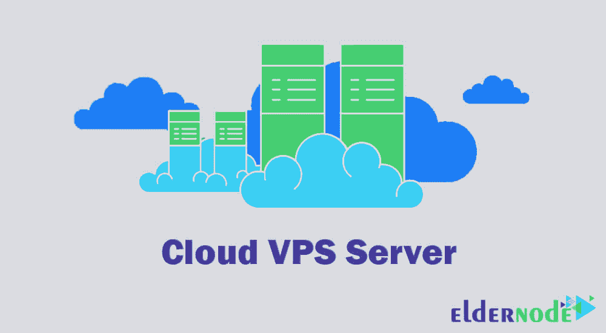

# 什么是 VPS[完全指南] - Eldernode 博客

> 原文：<https://blog.eldernode.com/what-is-vps-complete-guide/>

如果我们想回答这个问题，VPS 是什么？我们不得不说，VPS 实际上是一种虚拟服务器服务，这个词代表虚拟专用服务器。为了熟悉 VPS 的应用，我们决定提供一个完整的 VPS 服务描述。您可以购买并使用 [Eldernode](https://eldernode.com/) 中提供的 VPS 服务，无论是 [Windows VPS](https://eldernode.com/windows-vps/) 还是 [Linux VPS](https://eldernode.com/linux-vps/) ，视您的需求而定。

## 什么是虚拟专用服务器(VPS)

虚拟服务器是专用服务器的一部分，它被软件划分成更小的部分。每个虚拟服务器都被分配给一个订户，每个虚拟服务器都有自己的专用资源(如磁盘、内存、CPU 等。).在虚拟服务器中，没有一台服务器可以访问另一台服务器，并且与其他服务器完全分离。

例如，当您租赁一个业务单元时，该单元中的所有空间都是私有的，但走廊或电梯是共享的，以访问该单元。它们也可以被一些资源共享，例如水或电。“虚拟私人服务器”是服务器的一小部分，就像建筑物的一个单元。当您设置一个 VPS 虚拟服务器时，您就拥有了所有专用的虚拟服务器空间。但是网络和服务器访问是共享的，就像访问虚拟服务器的走廊或电梯一样。

## VPS 用于什么

5 虚拟专用服务器的应用包括:

***1。**网页服务器:*为热门网站

VPS 最常用于在线商店等网站，这些网站需要比共享服务更高的月流量、更多的存储空间和更强大的处理器。虚拟专用服务器或 VDS 将是一个方便实用的解决方案。

***2。邮件服务器:*** 用于邮件服务器，与共享服务相比，不限制每天发送的邮件数量。

在共享服务中，一天和一周内发送的电子邮件数量是有限的，因此您可以选择一个 VPS 来摆脱这一限制。此外，通过访问服务器，您可以在服务器上安装您最喜欢的电子邮件软件。

***3。服务器应用:*** 用专用资源启动特定的应用

由于无法访问共享服务中的服务器管理，因此无法在其上安装用户软件。如果你能支付比租用或购买专用服务器少得多的费用，你可以在服务器上安装你喜欢的应用程序，并享受专用服务的功能。

***4。**数据库服务器:*在 vps 的使用中对数据库卷的使用没有限制

在一些共享服务中，数据库存储空间的量将与共享计划容量的百分比成比例，或者最终与共享服务的容量成比例，而与共享服务相比，没有这种限制的虚拟专用服务器将向网站提供更多的存储空间。

***5。提高网站性能:*** 通过在较小的虚拟机上托管网站的不同部分

通过将网站的不同部分(如网站、数据库和电子邮件)放在每个创建的 VDS 上，可以轻松地排除网站中断的原因。如果其中一台机器出现问题，站点的其他部分将继续工作而不会中断。VDS 的另一个解决方案是使用多个虚拟机来提高站点不同部分的最佳性能。

### 什么是用于的 VPS 服务器

正如个人电脑有许多功能一样，VPS 服务器也有许多功能，每个人都根据自己的需要使用它。VPS 服务器的一些应用如下所述:

**–**跑步网站

**–**用作下载主机

**–**从一台服务器下载大文件并上传到另一台服务器

**–**设置 VPN 和隧道系统

**–**需要让计算机系统一直运行特定的软件

**–**使用互联网速度

**–**针对各种网站和服务器的黑客攻击

**–**启动并运行需要服务器的应用程序或软件

**–**减少网络游戏中的 ping

**–**设置游戏服务器

**–**更改 IP

### VPS 主机用于什么

使用共享和专用主机之间的中介，VPS 可以为您提供许多好处。以下是网站所有者决定升级 VPS 主机的一些常见原因:

***1-高水平的表现***

如果你已经有了一个加载缓慢的网站，那么对于网站访问者来说就有问题了。如果你使用过共享主机并注意到性能下降，你首先会注意到的是加载速度和网站整体性能的提高。

VPS 主机设备用于控制大门上方的交通流量。此外，如果您的需求随时间而扩展，您将能够扩展您的服务器资源。

***2-治安改善***

随着您的网站越来越受欢迎，您可能会遇到更多的安全威胁。即使你尽一切努力保护你的网站，你仍然会遇到问题。在这种情况下，是时候升级你的主机了。

VPS 主机为您提供非常高的安全性。您不仅不能保护使用相同物理服务器的其他站点，还可以实现其他安全加强协议。

***3-优价***

VPS 托管可能不是每个人的预算，但它确实为您提供了巨大的资源价值。基本上，你只需支付一小部分费用就可以使用专用服务器。

此外，通过 VPS 托管，您可以获得更高水平的性能，并增强您站点周围的安全协议。与共享主机相比，你可以在不大幅涨价的情况下获得高质量的主机服务。

***4-访问和定制更大的服务器***

VPS 虚拟主机通常给你一个更高层次的服务器访问。它还允许您定制服务器环境。有些，比如 WordPress VPS 主机，对插件的使用和一般配置有一定的限制。

请记住，有些主机还提供托管服务器，这意味着管理您的服务器所需的大部分技术工作由其团队提供支持。此选项有助于节省您的时间，并确保您的服务器根据您网站的规格得到充分优化。

### 什么是 VPS 以及如何使用它

您不需要安装任何特殊的软件来连接到 Windows 虚拟服务器，连接是通过远程桌面软件与服务器建立的，默认情况下，所有 Windows 中都有远程桌面软件。

要开始，你需要先打开**远程桌面**软件。要打开远程桌面，只需在 Windows“开始”菜单中搜索其名称。

点击远程桌面程序并打开它连接到您的 Windows vps 后，只需在计算机字段中输入 IP 服务器，然后点击连接。

在下一阶段，远程桌面将要求您的服务器用户名和密码。所有 Windows 服务器的默认用户名是 administrator。

在相关字段中输入您的虚拟服务器的用户名和密码后，如果您愿意，您可以选中“记住我”,以便程序保存服务器的登录详细信息，下次您就不需要手动输入您的用户名和密码了。

最后，按 OK 按钮进入下一步。在这一部分，远程桌面给出一个错误，指出证书无效。这个错误在技术上并不重要。选中不要再询问我与这台计算机的连接，这样下次它就不会显示这个窗口。

此时单击“是”按钮就完成了！如果没有错误，您将连接到您的服务器。

## 什么是 VPS 服务器

服务器是一台功能强大的计算机，所有关于你的网站的文件和信息都可以在上面上传。每当有人将您的域名地址输入 web 浏览器时，这台功能强大的计算机(同一个服务器)就会向浏览器发送必要的信息，从而向用户显示您的站点。

虚拟专用服务器使用虚拟化技术。虚拟化是创建某个东西的虚拟版本(而不是真实版本)；在虚拟服务器中，它们不是为每台服务器分配几个独立的硬件，而是使用软件为多台服务器模拟一个强大的硬件。

在本节的继续部分，我们将提供关于云 vps 服务器、windows vps 服务器和虚拟专用服务器的完整解释。

### 什么是云 VPS 服务器

云 VPS 是一种典型的虚拟服务器，在云基础设施和云计算环境中提供。通常，虚拟服务器只在有相关硬件的物理服务器上实现，在这种情况下，随着每个相关硬件组件的故障，其上的所有虚拟服务器也面临问题；但是在云环境中，创建的 VPS 具有运行所需的所有软件要求，并且绝不依赖于集中式软件或只有一个硬件的物理服务器。这使得在任何时候都可以在任何现有的物理服务器上运行相关的机器，只需自动地在线迁移它们。

云托管是目前网站(或网络应用)可用的最佳托管模式。这项技术在相对较短的时间内已经达到了被接受和使用的显著水平。托管在云服务器上的网站可以随时随地访问。这意味着每个网站的托管资源在云服务器的每个集群上都是重复的。

例如，如果一个云服务器正在使用它的最大流量，那么它会自动将对特定站点的请求重定向到一个具有较少集群流量的空闲云服务器。换句话说，云在多个服务器上同时运行 web 托管服务，如 SSH、FTP、SFTP 和电子邮件服务(如 SMTP)。在集群中的云服务器上同时分配相等的资源提供了高可靠性。例如，如果其中一个设备存在缺陷或故障，该问题不会导致整个托管服务出现故障或中断。

### 什么是 windows VPS 服务器

购买 VPS 服务器时，会遇到 [Windows VPS](https://eldernode.com/windows-vps/) 服务器、 [Linux VPS](https://eldernode.com/linux-vps/) 服务器、 [Mikrotik VPS](https://eldernode.com/mikrotik-vps-server/) 服务器等不同的操作系统。

使用 Windows 服务器作为虚拟主机有很多好处，除了虚拟主机之外，它还可以用来托管电子邮件或外汇交易。

大多数人在启动网站时使用 Windows 或 Linux 主机，过一段时间后，随着业务的繁荣以及网站访问量的增加，他们会购买 VPS 服务器。除了 web 托管和电子邮件之外，用户还可以每天使用 Windows VPS 服务器上的大多数可用应用程序。

通过选择 Windows 服务器，您可以对设置进行更多的管理，因为大多数提供商向用户提供完全访问权限，这允许您有更多的控制和灵活性，并且更新可以轻松完成。此外，用户可以首先在他的 Windows 上运行更新，如果他满意，就在他的服务器上运行。

Windows VPS VPS 服务器的应用之一是将其用作 Forex VPS 服务器，这将在本文的后面进行解释。Windows VPS 服务器的另一个优势是它的云托管。这意味着你可以从任何地方访问你的信息。

### 什么是虚拟专用服务器(VDS)

术语 VDS 源自术语虚拟专用服务器。该服务器由虚拟化软件构建而成，该软件将一台物理服务器划分为多个单独的服务器。作为一个用户，你将有机会获得一个强大的平台和更专用的服务器安全，价格不会远离共享服务器托管价格。

在从服务器创建了几个独立的部分之后，每个 VDS 将被分配一个空间用于数据存储和传输，这是为了稳定性。现在，每个 VDS 都将拥有自己的操作系统，以及其他专用的 web 服务器、电子邮件服务器和安装定制软件的 root 访问权限。这项技术的工作方式是，如果一个 VDS 发生任何问题，其他 VDS 将安全完整地保留在共享服务器上。

## VPS 和专用服务器的区别是什么

在讨论虚拟服务器和专用服务器的区别之前，我们先来提一下选择专用服务器的好处。

专用服务器最突出的特点之一是其强大的功能和高性能。专用服务器是世界上最重要的主机服务。专用服务器上缺乏资源是没有意义的，如果需要可以升级。如果良好的性能是您的重中之重，专用服务器是一个不错的选择。

可以在专用服务器上创建多个虚拟机，这就是为什么一些用户更喜欢在高安全性的私有环境中托管他们的网站，在这种情况下，建议提供专用服务器。

虚拟服务器和专用服务器的区别之一是虚拟服务器比专用服务器便宜。

**–**与虚拟服务器相比，专用服务器拥有非常高的资源。最后，虚拟服务器与其他机器共享一些资源，比如电源或网卡。它与专用服务器没有任何共同之处。

**–**在虚拟服务器上安装定制操作系统取决于它们在主机服务器上的映像。如果有可能在专用服务器上安装所有版本的操作系统。

**–**如前所述，一台专用服务器可以分成多个较小的虚拟机，每个虚拟机可以用于一项功能。如果这在虚拟服务器上是不可能的。

**–**在需要和任何中断的情况下，传输到虚拟服务器中的另一个服务器将比专用服务器快得多。虚拟服务器在这方面有更大的灵活性，可以很容易地转移到另一台服务器上。

**–**由于缺乏订阅以及 CPU、主内存和数据存储空间等资源有限，专用服务器上的硬件功耗更高。

**–**当其他用户无法访问专用服务器时，其信息的安全性更高。
虚拟服务器和专用服务器最重要的区别之一就是带宽，在专用服务器上提供更多的专用带宽。

## 什么是外汇交易中的 VPS

通过 VPS 进行外汇交易最近在小额交易者中非常流行。外汇虚拟服务器是一个虚拟服务器，安装在 Windows 操作系统与 MetaTrader 软件。外汇是一个全球货币交易市场，是自动完成的。Forex 这个词代表外汇。这个市场一天 24 小时，一周 5 天工作。有了这些外汇虚拟服务器，您的平台一周 7 天、一天 24 小时在线，VPS 专为您激活。外汇 VPS 操作系统是 Windows。也可以用 Android 和 iOS 手机远程到服务器。

当你签约一家经纪公司时，你实际上是在雇人帮你买股票。现在，如果你的经纪人不知道你打算在什么时候买什么股票，比如由于互联网中断，速度慢，那么你在市场上的交易就会面临很多问题。

因此，互联网连接的稳定性和速度对于虚拟市场中的交易者来说非常重要，因为他们的利润取决于市场的变化。外汇 VPS 系统为用户提供最好的速度和最少的 ping，特别是如果你选择一个靠近你的虚拟服务器经纪人的位置。这些服务器确保如果您的互联网连接失败，您的平台的虚拟版本仍将正常运行。

[Forex VPS](https://blog.eldernode.com/install-and-run-mt4-on-forex-vps/) 的其他功能和优势包括:

**–**外汇虚拟服务器的资源是完全私有的，您不会与任何人共享这些资源。

**–**在这些 VPS 中，你有一个专门的面板，你可以指定自己的带宽和流量消耗。这些虚拟处理器配有一个网络面板，用于重启、打开和关闭服务器。

**–**这些 VP 使用的硬件是英特尔和超微最好的型号。

**–**您对这些虚拟服务器的访问是根的，因此这种访问是无限制的，如果需要，您可以对其进行更改。

**–**在这些虚拟服务器中，可以提供不同的操作系统。

## 结论

如今，随着使用互联网作为提供产品和服务的平台的趋势日益增长，提供这些服务的方式、稳定性和持续可用性已经成为其所有者关注的问题之一。在当今竞争激烈的市场中，一个商店网站几分钟的距离就可能导致该网站失去与其他竞争对手相比的地位。现在，如果您最终准备开始一项大业务或扩展您当前的业务，您应该已经得出结论，共享服务器不能满足您的需求。因此，您需要考虑将您的服务升级到虚拟服务器。

在本文中，我们试图为您提供有关虚拟专用服务器(vps)、vps 服务器使用、虚拟服务器托管、云 VPS 服务器、windows vps 服务器、虚拟专用服务器(VDS)和 forex 虚拟服务器的更多信息。