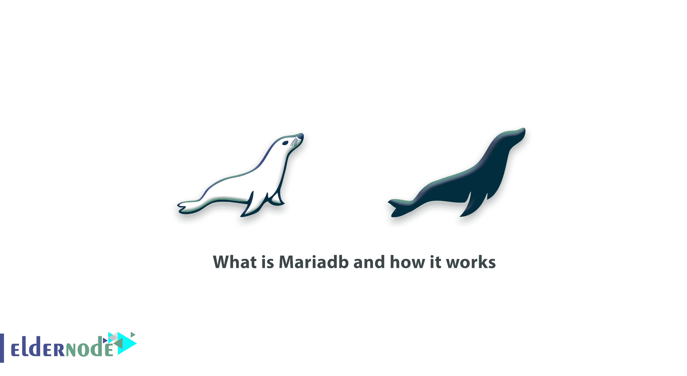

# 什么是 Mariadb 及其工作原理-介绍 Mariadb

> 原文：<https://blog.eldernode.com/whats-mariadb-how-it-works/>

在本文中，我们将解释 Mariadb，所以请加入我们，了解更多关于什么是 Mariadb 以及它如何工作的信息。

## 什么是 Mariadb 及其工作原理

1994 年，Michael“Monty”wide nius 与 David Aksmark 和 Alan Larson 一起发布了 MySQL 的第一个版本。他们开始工作，但不久后，由于在甲骨文公司的分歧，迈克尔·维德纽斯离开了公司，并成立了马里亚 DB 公司。2009 年 1 月 22 日，该公司董事总经理 Vidnius 发布了 MariaDB 数据库的第一个版本。

### 什么是 Mariadb 及其历史？

[MariaDB](https://eldernode.com/mariadb-10-3-23-on-cpanel-breaks-the-mysql/) 是一个使用 MySQL 分支，使用 MariaDB 存储引擎作为存储引擎的数据库系统。
在数据库进入市场之初，专家和程序员并不欢迎它，认为它不具备与 MySQL 竞争的力量，但没过多久程序员就开始使用这个数据库

因为他们发现，MariaDB 数据库的中央核心类似于 MySQL，所以它与这个数据库一起工作没有任何问题。

最后，MariaDB 数据库的其他新好处，以及它在某些类型的数据上比 MySQL 更好的性能，使这个数据库成为一个好地方。

### Maria db 官方支持哪些应用

不到十年后的今天，主要公司都正式宣布支持该数据库，包括 PHPMyAdmin Kajona、MediaWiki、Plone、WordPress 和 Zend Firm work。

[MariaDB](https://eldernode.com/tag/mariadb-on-centos-8/) 数据库吸引了维基百科、Fedora、Open SUSE、Mozilla 等重要用户。，而且由于它的支持，可能很快就会成为 Linux 甚至 Windows 中数据库的第一张脸。

亲爱的用户，我们希望你会喜欢什么是 Mariadb 及其工作原理教程，你可以在评论区提出关于本次培训的问题，或者解决 [Eldernode 培训](https://eldernode.com/blog/)领域的其他问题，请参考[提问页面](https://eldernode.com/ask)部分，并尽快提出你的问题。腾出时间给其他用户和专家来回答你的问题。