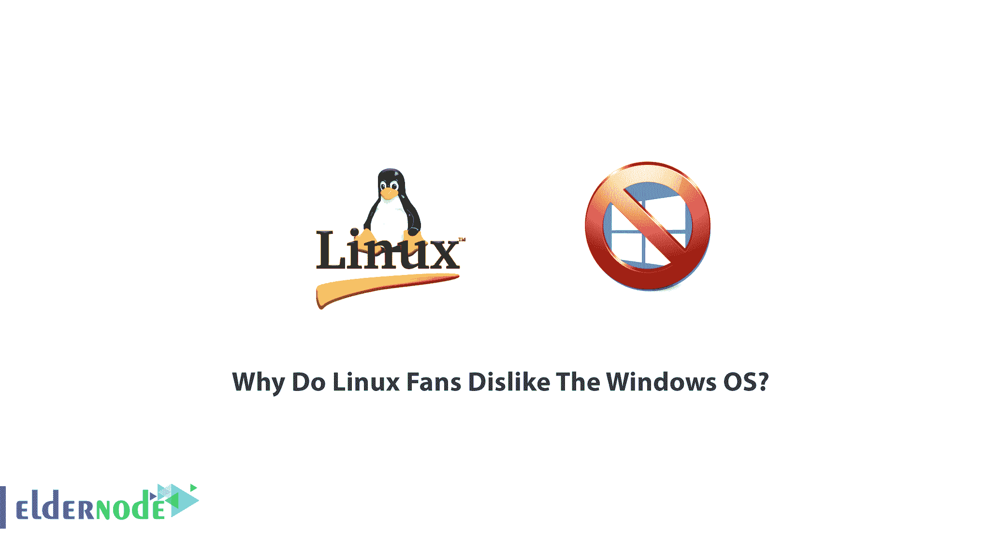

# 为什么 Linux 粉丝不喜欢 Windows OS？- Eldernode 博客

> 原文：<https://blog.eldernode.com/why-do-linux-fans-dislike-the-windows-os/>

【更新】百事可乐&可口可乐，iOS & Android，当然还有 Linux 和 Windows 的粉丝之间有一个永恒的挑战！哪个更好？根据需求、目标和系统类型，用户选择操作系统，这两个群体都能够证明他们自己的决定是最好的！没有办法停止这些争论，但在本文中，我们将讨论**为什么 Linux 粉丝不喜欢 Windows 操作系统**，以了解为什么 Linux 粉丝不喜欢切换到 Windows。所以，它会帮助你选择购买 [Linux VPS](https://eldernode.com/linux-vps/) 还是 [Windows VPS](https://eldernode.com/windows-vps/) 。

## **为什么 Linux 粉丝不喜欢 Windows OS？**

和我们一起寻找这个重复问题的明确答案。一些用户认为这不是 Linux 和 Windows 的问题，重要的是使用最好的工具来完成工作。另一方面，有很多 Linux 的忠实粉丝却不这么认为。所以让我们看看谁是对的？！

## **Linux 还是 Windows？**

在这篇文章中，我将快速比较 Linux 和 Windows 操作系统的一些最重要的关键特性，看看为什么用户不仅选择 Linux，而且还容易说我们讨厌 Windows！

我们将探讨使用 Linux 相对于 Windows 的优势，这将帮助您为编程或 web 开发等目的选择正确的操作系统。首先，如果你想从 Windows 迁移到 Linux，换一个更好但类似 Windows 的操作系统，那就不要去做！一个东西比另一个好但没有不同，这在逻辑上是不可能的；因此，如果你期待一个更好的操作系统，那么也期待一个不同的操作系统。然而，如果你正在考虑编程或 web 开发，像 Ubuntu、 [CentOS](https://blog.eldernode.com/tag/centos/) 和 [Debian](https://blog.eldernode.com/tag/debian/) 这样的 Linux 发行版可能是让你入门的最佳操作系统。有 Ubuntu，Fedora，‌拱门等发行版。有了不同的桌面，根据工作类型你可以选择其中的一个。

**开源**

不像 Windows 是一个**商业**操作系统，Linux 是一个开源的操作系统，可以免费下载。有数百个 Linux 发行版可用，大约有 500 个正在开发的发行版。最流行的 Linux 发行版之一是 [Ubuntu](https://blog.eldernode.com/tag/ubuntu/) 。

**安全性**
Linux 比 Windows**更安全**。显然，Linux 比 Windows 更安全，尽管世界上有成千上万的程序员可以快速修复错误和问题。当然，并不意味着 Linux 密不透风；Windows 现在被用户更广泛地使用，因此黑客们正试图产生针对更多系统的恶意软件或病毒。Linux 中存在的另一个特性是 **root 访问**；在 Linux 中，在运行或安装任何程序或文件之前，您需要 root 访问权限，但在 Windows 中不需要。

**快速软件更新**
在 Linux 中，你将获得更快的软件更新。如果有人发现了这个 bug，用户可以立即**更新它**，你不必再等很久。**免费**也有开发工具和库。

**功能**
Linux 比 Windows 更加**强大**和多功能。操作系统是轻量级的，这使得 Linux **比 Windows**快。当您开始使用这个操作系统时，您将会看到系统速度的显著提高。

### 家用转 Linux 的原因

几乎所有的用户都为 Windows 付费了。我们真的可以说，大多数在电脑上安装了 Linux 的人已经为 Windows 付费了，如果他们没有在电脑上保留 Windows 并删除它，他们就有意识地决定吃掉 Windows 的成本并放弃它。还有，你装 Linux，也不是为了逃避 Windows 的成本。而 Linux 容易**使用**和**升级**、**免费**、**灵活**、**可靠**、**人性化**很容易说值得转用 Linux。根据用户的报告，下面列出了离开 Windows 转而使用 Linux 的一些原因。

1- Windows updated 可以让一台非常好，但旧电脑**无法使用**。

2-升级 Windows 已经**搞坏了**一台不错的旧电脑。

3-虽然 Windows **变慢**并且从损坏的恢复镜像重新安装不工作，但是 Linux **没有这些问题。**

4-工厂重置**内置工厂重置的问题**。

5-在工厂重置后重新安装所有东西，在 Linux 中要容易得多。

6- Windows 激活无缘无故损坏。切换到 Linux 省去了给微软打一个**支持**电话。

7- Linux 在没有**监视**的情况下正常工作，并且不需要**遥测**。

8-没有广告挂钩。Linux 是严肃的东西，不需要广告。

9- **从一开始就选择加入位置**。Windows 有这个，但不是 100%。所以，你还是要在设置后进一步配置 Windows 10。

虽然对 Linux 最大的指责是没有一个 office，但我们可以说大多数人不需要高级的 Office 功能，LibreOffice 也很好。创建文档并将其导出为 PDF。

11- Linux 给了你对电脑最大的控制权。

12- Linux **不会**用通知之类的东西打断你。

如果你有创造力，Linux 可以删除界限，让你**进步**。

你可以很容易地在 Linux 中找到**众多的**图形、照片编辑和有趣的工具，它们都是干净的、没有恶意软件的。

**15-** 如果用多了，**视频编辑**带快捷方式免费，**音频编辑**带胆识，在 Linux 上查看、整理、编辑照片非常简单。

如果你想要的只是简单的、**干净的**、**准备好的**，那么 Linux 要好得多。

17-对用户来说最大的问题之一是**设置**和**配置**，一旦你习惯了，这在 Linux 中真的很简单。因为你在 Windows 10 中有两个控制面板，这使得事情变得更加复杂，而在大多数 Linux 设置中，你只需要面对一个配置系统。

18-升级总是免费的**，新的安装没有任何附加条件。**

**19-你**不需要**每次插上电脑 USB 设备就安装驱动。**

**20-没有文件**每次插入新磁盘时自动运行**。**

**就是这样！您回顾了人们在使用 Linux 后所经历的事情的总结。看起来他们已经发现了很多在 Linux 中更好的重要技巧，所以他们大声说我们讨厌 Windows 是合乎逻辑的。**

## **结论**

**在本文中，您了解了为什么 Linux 爱好者不喜欢 Windows 操作系统？现在，您学习了 Linux 和 Windows 爱好者之间最具挑战性的课题之一。我们试图回顾 Linux 粉丝关于他们声称为什么 Linux 更好的理由的评论。如果你有兴趣阅读更多关于这个问题的内容，可以找到我们关于如何从 windows 访问 Linux VPS 的文章。**