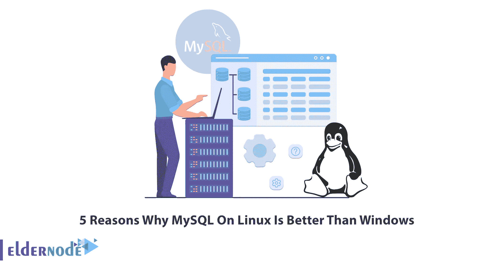

# Linux 上的 MySQL 优于 Windows 的 5 个原因

> 原文：<https://blog.eldernode.com/why-mysql-on-linux-is-better-than-windows/>

MySQL 是最流行的开源数据库管理系统。如今，数据库被认为是信息技术领域的基本概念之一，并被用于各个领域，尤其是 web 和应用程序开发。在数据库中，信息按照一定的规则保存和存储。存储在数据库中的信息的管理是通过数据库管理系统(DBMS)完成的。MySQL 是流行的数据库管理系统之一。在本文中，我们将提到 Linux 上的 MySQL 优于 Windows 的 5 个原因。你可以访问 [Eldernode](https://eldernode.com/) 网站上提供的购买 [Linux VPS](https://eldernode.com/linux-vps/) 服务器的计划。

## **为什么 Linux 上的 MySQL 比 Windows 好？**

### **1。操作系统免费**

因为 [Linux](https://blog.eldernode.com/tag/linux/) 是开源的，可以免费提供给其他人，所以它有一个非常特殊的优势，可以安装在其他操作系统上。因为对用户来说没有成本。此外，用于创建 Linux 的代码是免费的，可以查看、编辑等。有知识的用户可以修改它。这意味着他们可以轻松地在其中进行必要的更改。

### **2。软件更新不需要付费**

与 Windows 操作系统不同，Windows 操作系统是在许可证的基础上提供的，需要付费，Linux 不需要任何成本，而且它的更新更容易一些。所以你可以很容易地在 Linux 上免费更新 MySQL。

### **3。你可以同时运行多个 MySQL 实例**

有时，您可能需要在同一台服务器上运行多个 MySQL 实例。例如，您可能需要测试不同的 MySQL 实例，用于登台、测试和生产。Windows 上不会同时执行多个 MySQL 实例。而这项工作在 Linux 操作系统上很容易完成。

### **4。你不用安装任何第三方软件**

第三方应用程序是由不同于设备和/或其操作系统制造商的供应商(公司或个人)创建的应用程序。第三方应用有时被称为开发者应用，因为它们中的许多是由独立开发者或应用开发公司创建的。众所周知，第三方应用程序可以提高工作效率，实现远程和混合工作，并且通常对于构建和扩展公司的工作流程至关重要。但是如果你想在 Linux 上安装 MySQL，你不必安装任何第三方软件，这将使你的工作非常简单。

### **5。你可以很容易地从一个版本升级到另一个**

每个计算机用户应该做的最重要的任务之一是更新和升级操作系统和软件。也许有些用户不知道更新操作系统和软件的重要性，但通常情况下，如果发布了程序或操作系统的更新，则该更新不具有外观方面。因此，发布更新是为了解决操作系统和程序的问题，或者提高和增加效率。要更新 Linux 操作系统及其软件，您必须首先注意您的 Linux 发行版的类型。因此，你将很容易在 Linux 操作系统中升级新版本的 [MySQL。](https://blog.eldernode.com/install-mysql-on-linux-ubuntu-20-04/)

## 结论

MySQL 服务器数据库是世界上最流行的数据库服务器之一。像脸书和谷歌这样的大品牌已经使用它。此外，维基百科的大量重要收藏也使用这个数据库服务器作为其数据库基础设施。在本文中，我们试图向您解释 Linux 上的 MySQL 优于 Windows 的 5 个原因。如果你有任何与本文相关的问题，你可以在评论区与我们分享。