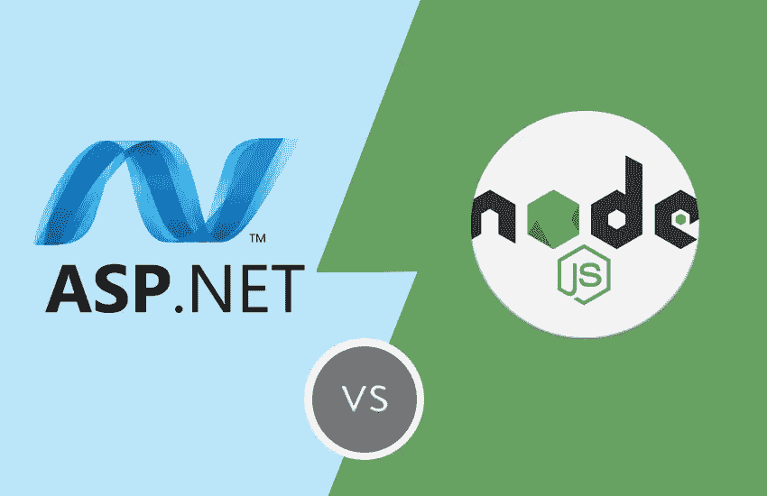

# Node.js 优于 ASP.NET 的 6 个理由

> 原文：<https://blog.eldernode.com/why-node-js-is-better-than-asp-net/>

Node.js 和 ASP.NET 是服务器端开发的两个现代平台。Node.js 是一种运行在服务器端的服务器端编程语言。但是 ASP.NET 是一个服务器端的 web 应用框架，能够生成动态网页。本文将解释 Node.js 优于 ASP.NET 的 6 个原因。如果你打算购买一台 [Linux VPS](https://eldernode.com/linux-vps/) 服务器，你可以查看 [Eldernode](https://eldernode.com/) 网站上提供的软件包。

## **为什么 Node.js 比 ASP.NET 好？**

[Node.js](https://blog.eldernode.com/install-node-js-on-windows/) 是一个开源的 JavaScript 运行时环境，用于开发网站和移动应用。它允许您为您的异步和事件驱动模型开发数据密集型应用程序。ASP.NET 是一个用于服务器端编程的开源框架。它由微软开发，使用 C#进行编码。这个框架是为使用 HTML、CSS 和 JavaSript 的新一代网站和 web 应用程序选择的。

### **1- Node.js 编程语言好用**

Node.js 编程语言是 JavaScript，这是一种简单易学的语言。你可以很容易地使用它，这也是它在开发者中流行的原因。它被用于客户端编程，Node.js 出现后，它也被用于开发服务器端应用。但是 ASP.NET 的编程语言是 C#，是用 C++和 Java 开发的。这种语言比 JavaScript 更复杂，也相对难以使用。

### **2- Node.js 有社区支持**

Node.js 在 GitHub 上有一个友好的社区，可以帮助你解答疑问。许多开发人员一直在努力改进这个平台。它允许您与 Node.js 开发人员社区分享您的知识。这是因为 ASP.NET 在 GitHub 上没有大的社区支持。

### **3- Node.js 性能更好**

Node.js 可以高效地处理多个任务，性能优于 ASP.NET。从其他技术转向 Node.js 的开发人员报告了更好的性能。它有单线程异步模型和高速 Chrome V8 引擎，这使它更适合其他平台。

### **4- Node.js 简单易用**

可学性是开发者的一个重要因素。由于 Node.js 本质上是动态的，所以对于初学者来说是个不错的选择。你只需要对 JavaScript 有很好的理解，就能轻松地使用它。另一方面，掌握 ASP.NET 比 Node.js 要花更多的时间，要知道 C#要用 ASP.NET，这是通用编程语言，不好学。

### **5- Node.js 扩展性强，执行速度快**

Node.js 是高度可伸缩的，因为它的单线程机制允许服务器快速响应。您可以水平和垂直扩展应用程序。它允许您在项目中使用大量的模块。该平台可以处理并发请求，并具有高效的 Google Chrome V8 引擎和异步请求处理。这使得代码的执行花费更少的时间，并且没有延迟地处理请求。

### **6- Node.js 速度很快，因此可以处理多个回调**

Node.js 可以利用其异步特性处理多个回调。当使用 [Node.js](https://blog.eldernode.com/install-and-config-node-js-on-ubuntu-20-04/) 时，你不会遇到很多抽象概念。此外，它允许您集成小组件，而不是一个庞大的参数集，它还允许开发人员在他们的 web 开发项目中访问本地和第三方库。但是，从 ASP.NET 的任何配置转移都会导致手动配置，这将耗费更多的时间。

## 结论

Node.js 是一个 JavaScript 运行时环境，有助于形成实时 web 应用程序。在本文中，我们解释了 Node.js 优于 ASP.NET 的 6 个原因。我希望这篇教程能帮助你找到 Node.js 优于 ASP.NET 的原因。如果您有任何问题或建议，可以在评论区联系我们。