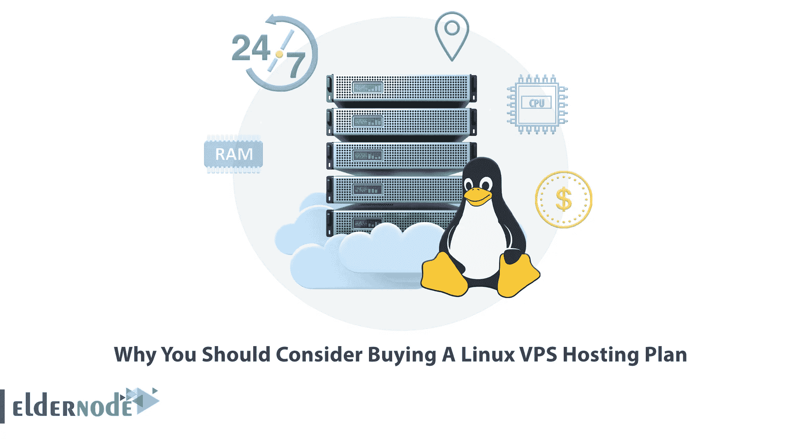
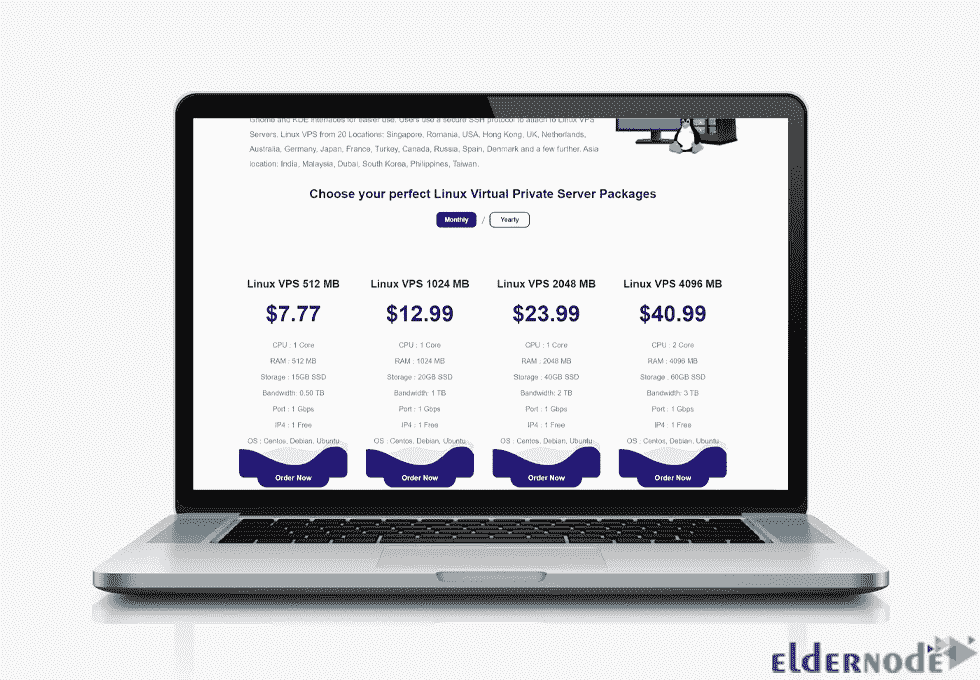

# 为什么你应该考虑购买 Linux VPS 托管计划

> 原文：<https://blog.eldernode.com/why-you-should-consider-buying-a-linux-vps/>

购买虚拟专用服务器(VPS)是拥有一个不断增长的网站，并且随着用户数量的增加而面临正常运行时间减少和网站运行缓慢的人的最佳选择。此外，如果你是一个网上商店的老板，需要一个安全的空间来管理客户交易，你可以考虑购买一个虚拟服务器。这篇文章将解释为什么你应该考虑购买一个 Linux VPS 托管计划。如果你打算购买自己的 [**Linux VPS**](https://eldernode.com/linux-vps/) 服务器，你可以查看 [Eldernode](https://eldernode.com/) 网站上提供的软件包。

## **为什么要考虑在 2022 年购买 Linux VPS 主机计划**

Linux VPS 托管是在基于 Linux 的虚拟专用服务器上托管网站的过程。此外，它也是运行在 Linux 系统上的主机上的服务器。这个 VPS 主机与其他网站共享一个服务器，减少了运行费用，使它成为每个人的理想选择。如果你想增加网站流量，又不想买专用服务器，那就买个 Linux VPS 吧。

有许多主机公司声称为企业提供最便宜和最有效的 Linux 主机方案。Eldernode 网站是提供最便宜的 Linux VPS 主机的网站之一。可以通过研究自己的需求来选择合适的方案。

这里我们将列出 Linux VPS 主机的主要特性:

–低成本

–易于使用

–提高安全性

–灵活性

–有独立的环境

–提高可靠性

在本文的后续部分，我们将讨论迫使您购买 Linux VPS 托管计划的原因。

### 随着时间的推移，这将为您节省资金，因为您不必为每个网站购买单独的服务器

Linux VPS 集成了强大的应用程序和其他功能，因此更加稳定。最适合刚创业，不想花太多钱做托管的人。随着时间的推移，这将为您节省资金，因为您不必为每个网站购买单独的服务器:

如果你的高管网站处理高度机密的客户数据库，如信用卡信息，它应该更安全。你选择的服务器应该是稳定的，因为如果服务器崩溃，你将失去你的销售。

### 这意味着您不必担心管理单独的服务器或支付额外的带宽

如果你觉得你应该对你的网站管理有更多的控制权，那么是时候选择一个 VPS 来接管你的网站的管理了。带宽是互联网连接服务器上一个月上传到您的服务器或从您的服务器下载的数据量。

Linux VPS 服务器运行在虚拟 CPU 上，比普通计算机轻。CPU 执行负载因系统而异，您应该为您的业务选择合适的 CPU，以便更快地做出响应。例如，在线游戏服务器和聊天框服务器给服务器的 CPU 带来了沉重的负担。但是 web 服务器消耗更多的 CPU 空间。所以，所需的 CPU 是可以让你考虑购买 Linux VPS 主机的因素之一。

可伸缩性因素以一种深刻的方式影响着企业，并使其成长和成功。您的企业网站流量在提高销售业绩和增加客户方面起着关键作用。为此，你的网站流量要多一些；要做到这一点，你应该买一个 Linux VPS 主机，并根据你的服务器在可用资源上更加努力。

随着你网站的成长，你提供的内容增加，你网站的加载时间也会增加。这表明您需要增加内存。RAM 的大小决定了你的网站将如何运行，也影响了你的页面速度。您应该根据您的需求选择您网站的 RAM，并[购买一个 Linux VPS](https://blog.eldernode.com/how-to-buy-linux-vps-bitcoin/) 。

### 我们提供无限的磁盘空间和带宽

在这一步中，我们将向您介绍 Eldernode 网站上提供的 Linux VPS 托管计划。Eldernode 提供适合个人使用和专用 Web 托管的 Linux VPS 服务器。可用的 Linux VPS 配备了最新的技术、硬件资源以及 Ubuntu、Debian 和 CentOS 操作系统，具体取决于您的需求以及最新的更新。我们对虚拟主机方案中提供的磁盘空间或带宽没有限制。你将有足够的磁盘空间和[带宽](https://blog.eldernode.com/the-best-bandwidth-plan-for-dedicated-server/)来满足你的需求。我们为所有带有 1 Gbps 端口的 Linux 虚拟服务器计划提供无限带宽。

### **我们的计划起价仅为每月 7 美元**

廉价的虚拟主机服务是一种降低成本的方式，同时还能拓展你的业务。如果你有一个中等规模的网站，看看我们列出的最便宜的主机服务来帮助你决定哪种主机方案最适合你。我们的计划起价仅为每月 7 美元。您可以从 20 个不同的地方购买 Linux VPS，包括印度、马来西亚、迪拜、韩国、菲律宾、台湾、新加坡、罗马尼亚、美国、香港、英国、荷兰、澳大利亚、德国、日本、法国、土耳其、加拿大、俄罗斯、西班牙、丹麦和其他一些地方。

### **我们提供全天候支持**

我们的售票系统和实时聊天热线一年 365 天、一周 7 天、一天 24 小时提供快速响应。全天候支持包括对需要无中断运行和停机的服务的支持。

## 结论

Linux VPS 帮助许多企业不间断地运行他们的网站。您可以使用它体验卓越的服务器性能。在本文中，我们解释了您应该考虑购买 Linux VPS 托管计划的原因。我希望这篇文章对你有用。如果你面临任何问题或者有任何建议，可以在评论区联系我们。