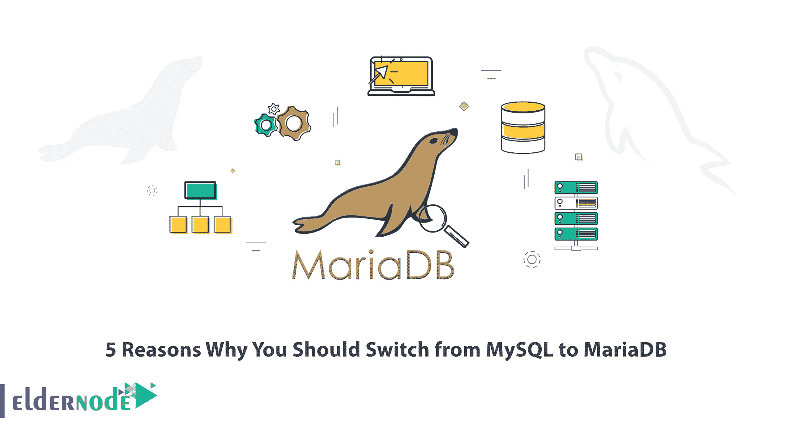
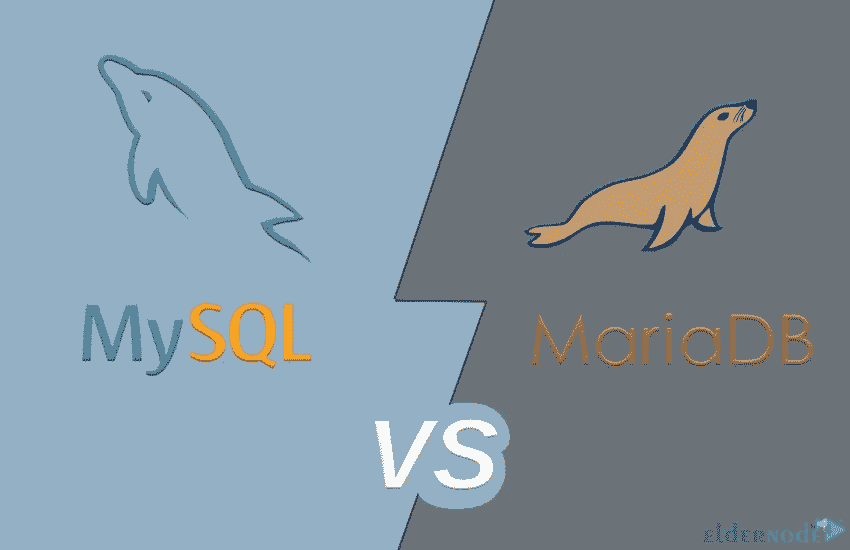
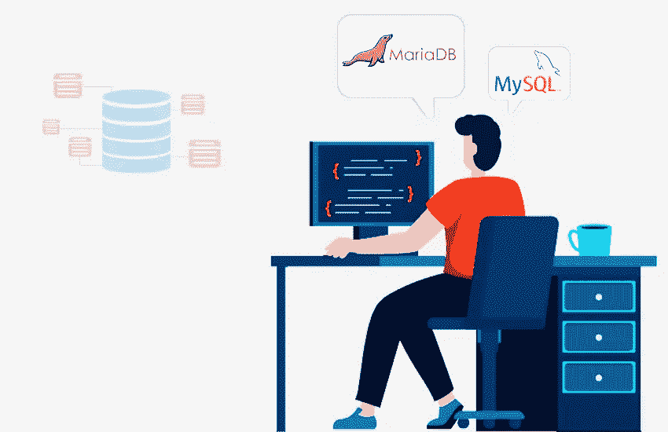

# 你应该从 MySQL 转换到 MariaDB 的 5 个理由

> 原文：<https://blog.eldernode.com/why-you-should-switch-from-mysql-to-mariadb/>

数据库是 web 应用程序的主要部分之一，因为所有重要的信息都存储在其中。开发人员花费大量时间构建和测试数据库功能，以确保其正常工作。MySQL 和 MariaDB 都是在 web 应用程序中广泛使用的著名和流行的数据库。这篇文章将解释为什么你应该从 MySQL 转换到 MariaDB 的 5 个原因。如果你打算购买一台 [Linux VPS](https://eldernode.com/linux-vps/) 服务器，你可以查看 [Eldernode](https://eldernode.com/) 网站上提供的软件包。

## **为什么要从 MySQL 转到 MariaDB？**

MySQL 是 Oracle 开发的免费开源关系数据库管理系统(RDBMS)。它使用 SQL 查询来管理、保存和操作数据，并使用结构化查询语言来管理数据。您可以克服最新的 web、云和通信应用程序的数据库问题。MariaDB 是 MySQL 关系数据库管理系统的开源、社区开发的分支。它是 MySQL 的改进版本，具有强大的功能和许多可用性改进。

### **1- MariaDB 比 MySQL** 存在的时间更长

MariaDB 最初是为 MariaDB Linux 发行版设计的，名为“Maria”。2007 年，由于对 MySQL 的开发方式不满，Monty Widenius 开始开发 MariaDB。他想让 MariaDB 更稳定，更容易维护。

### **2- MariaDB 比 MySQL**T3 更安全

对于任何网站所有者来说，安全性都是一个主要问题。黑客攻击每年都在增加，一次入侵可能会造成严重后果。通常，确保您的数据库管理软件得到适当的保护是很重要的。MariaDB 比 MySQL 更安全，其所有数据库产品都符合严格的安全标准。它提供了广泛的附加安全措施，包括内置安全性、PAM、LDAP 认证、用户角色和数据库加密。

### **3- MariaDB 支持交易**

事务是作为单独的工作单元执行的一组连续的数据库操作操作。如果事务中的任何操作失败，整个事务都会失败。MariaDB 支持事务，其事务包括保存点和锁表等选项。锁定表允许您在会话期间控制对表的访问，以防止在特定时间间隔发生更改。保存点设置用于回滚的还原点。

### **4- MariaDB 比 MySQL** 快 

你的网站的性能和速度是非常重要的。尤其是当网站加载速度下降的时候。这部分是因为有大量可供选择的数据库引擎。换句话说，MariaDB 在优化查询时会考虑独立于引擎的表统计信息。基于 MariaDB 的网站还提供了一系列关于如何进一步优化性能的有用资源，以及各种数据表示的性能策略。

### **5- MariaDB 比 MySQL** 更容易安装

MariaDB 易于使用，是新手的最佳选择。最好是利用分发包进行安装。这个数据库设计很简单，支持多种引擎。与 [MariaDB](https://blog.eldernode.com/mariadb-installation-on-ubuntu/) 兼容的操作系统有 Windows、Linux、AIX、BSD、FreeBSD、Solaris、Android。

## 结论

MariaDB 是一个关系数据库管理系统，具有很多特性。在这篇文章中，我们解释了你应该从 [MySQL](https://blog.eldernode.com/install-mysql-on-windows-server/) 转换到 MariaDB 的 5 个原因。我希望这个教程对你有用。如果您有任何问题或建议，可以在评论区联系我们。