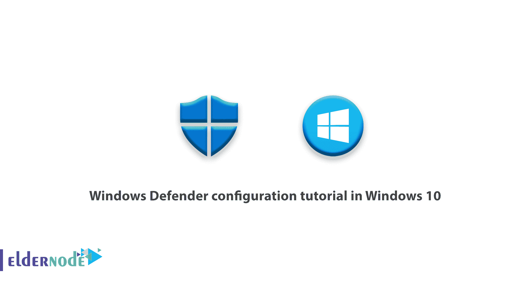
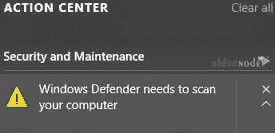
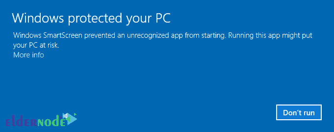
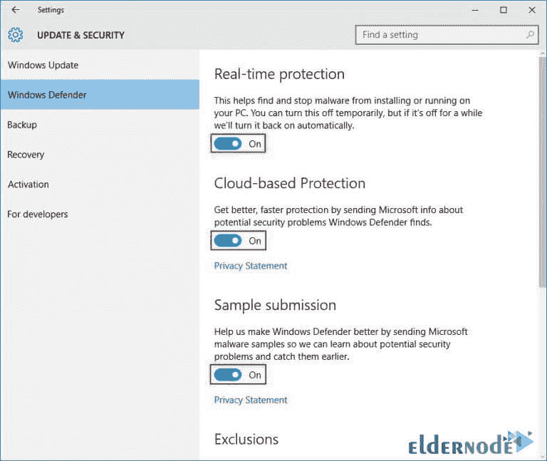
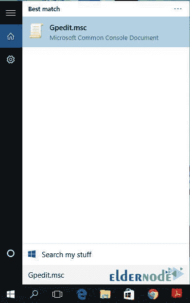
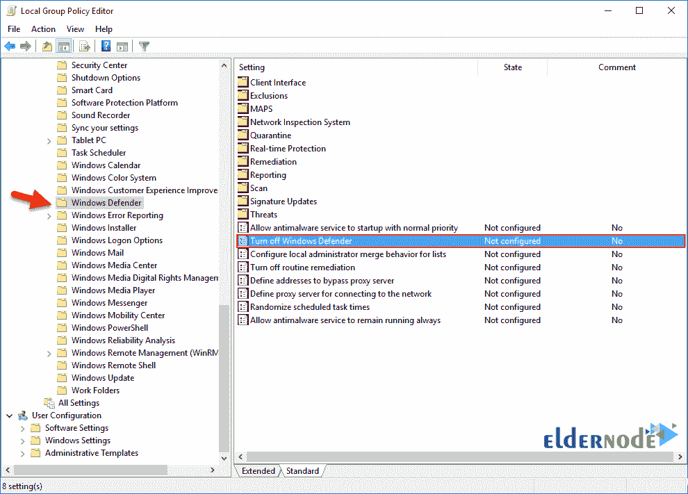
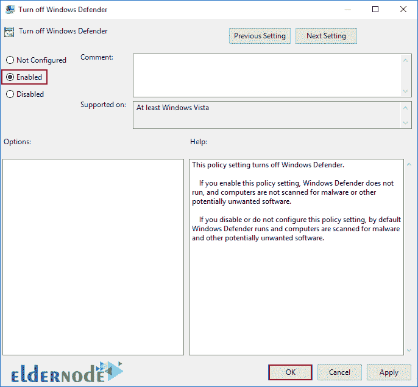

# Windows 10 中的 Windows Defender 配置教程- Eldernode

> 原文：<https://blog.eldernode.com/windows-defender-configuration-tutorial/>

Windows 操作系统，尤其是 Windows 10 的安全性一直是最大的问题之一。但不用担心，面对非常强大的恶意软件威胁，新版本的 Windows Defender 今天已经出现。如您所知，Windows Defender 保护您的计算机免受恶意软件和间谍软件导致的弹出窗口、安全威胁和低性能的影响。本文将看看 Windows 10 和 8 中的 Windows Defender 配置教程。如何禁用 Windows Defender 也包括在本教程的其余部分。

## Windows 10 中的 Windows Defender 配置教程

由于 Windows Defender 一直在 Windows 的旧版本中，因此在这段时间内进行了更新，并修复了许多弱点。Windows Defender 是一种安全解决方案，可以检测各种恶意软件病毒，发现恶意软件时会自动删除。

此外，它还可以防止感染第三方驱动程序的 rootkits。Windows Defender 会自动更新，并在必要时向用户显示消息，如下图所示。

### 智能屏幕功能

这个功能在 Windows 10 中是有的，对于执行恶意代码是必不可少的。SmartScreen 在运行时检查可执行文件。如果软件来自在线来源，它会根据 Microsoft 应用程序信誉数据库检查软件。检查后，允许或阻止该软件。

如果你遇到类似上面的消息，你应该彻底检查这个应用程序，确保它没有恶意软件或病毒。当 **Windows 智能屏幕**运行时，点击**更多信息**然后继续运行。

### 如何配置 Windows Defender 以防御恶意软件

现在你已经知道了 **Windows Defender** 和 **SmartScreen** ，我们打开 Windows Defender 并启动它。

点击**开始菜单**，然后点击**设置**，或者按 **Windows + I** ，然后点击**更新&安全** 。

现在点击 **Windows Defender** ，开启**实时防护**，云端防护，样本提交如下图。当这些选项打开时，Windows Defender 会正常工作并从您的系统中删除恶意软件。另外，问题发送到[微软](https://support.microsoft.com/)，安全性会更好更快。

注意，Windows Defender 不扫描已删除的文件，要解决这个问题，在**排除**部分，点击**添加一个排除**，选择**排除文件**。

### 如何关闭或禁用 Windows Defender

如果要在计算机上安装防病毒软件，必须禁用 Windows Defender。但是，安装防病毒软件会自动禁用 Windows Defender。您可以使用组策略禁用 windows defender。
点击**开始菜单**，输入 **Gpedit.msc** 。

打开组策略，进入**计算机管理>** **管理模板>** **Windows 组件> Windows Defender** ，找到关闭 Windows Defender 策略，其值为**未配置** 。

在这里点击**关闭 Windows Defender** ，然后**启用**，点击 **OK** 。

Windows Defender 现已成功禁用，如果要将其打开，请先将“关闭 Windows Defender”值更改为“未配置”,然后再将其打开。我们已经完成了 windows defender 配置。你可以在不同版本的 Windows 10 或 8 中做到这一点。

## 结论

首先，解释了 SmartScreen 功能。然后你会学到如何在 windows 10 中配置 Windows Defender 来抵御恶意软件，以及如何关闭或禁用 Windows Defender。