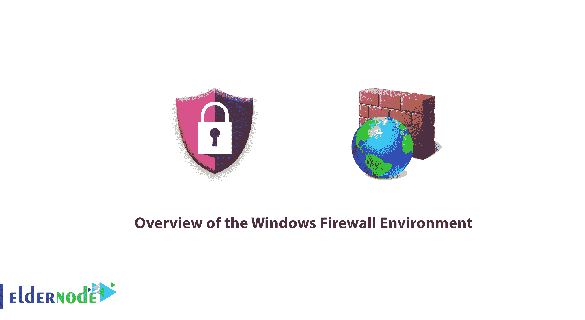
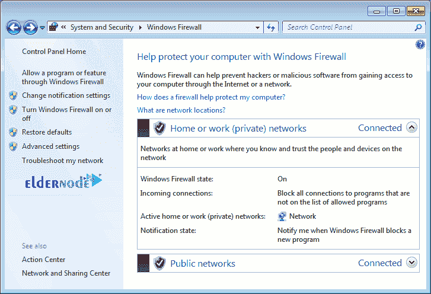

# Windows 防火墙环境概述- ElderNode 博客

> 原文：<https://blog.eldernode.com/windows-firewall-environment/>

Windows 防火墙环境概述。一个[防火墙](https://en.wikipedia.org/wiki/Firewall_(computing)#:~:text=In%20computing%2C%20a%20firewall%20is,network%2C%20such%20as%20the%20Internet.)是一个允许数据包到**进入**和退出网络的守卫，每个**操作系统**都有。在本文中，我们将向您介绍 Windows 防火墙环境，以便那些还不熟悉它的用户能够完全熟悉它。

如你所知，在 Windows 的最新版本中，[微软](https://www.microsoft.com/)使用了一种相对先进的防火墙，它具有许多功能，其使用对于提高操作系统的安全性至关重要。

[**在 Eldernode**](https://eldernode.com/windows-vps/) 选择您的完美 Windows 虚拟专用服务器包

## Windows 防火墙简介

在本文中，我们将向您介绍 Windows 防火墙环境。请继续关注我们的这篇文章:

### 打开 Windows 防火墙

选择以下方法之一打开 Windows 防火墙:

**1。** 进入控制面板，选择系统和安全选项，在打开的窗口中点击 Windows 防火墙。

**2。** **打开**运行窗口( Winkey + R )，键入“ firewall.cpl ”。

在 Windows 防火墙中，一些设置位于**左边**，在窗口的**中间**你会看到两个部分，[私网](https://en.wikipedia.org/wiki/Private_network#:~:text=In%20IP%20networking%2C%20a%20private,%2C%20office%2C%20and%20enterprise%20environments.)和[客网或公网](https://www.techopedia.com/definition/26424/public-network#:~:text=A%20public%20network%20is%20a,access%20to%20a%20select%20few.)。

**–专网 :** 一般情况下，不与互联网相连的内部网络或组织外部的网络称为专网。

**–访客或公共网络 :** 将您连接到互联网或您组织外部网络的网络称为公共网络。

### 打开或关闭 Windows 防火墙

从**左侧菜单**，点击打开或关闭 Windows 防火墙。

正如你在上方的**图中看到的，你将能够在想要的页面上关闭或打开防火墙。**

该部分还有 **2 个其他选项**，工作原理如下:

**A)** 阻止所有传入的连接，包括那些在允许的应用列表中的:

这个选项意味着[防火墙](https://support.microsoft.com/en-us/help/4028544/windows-turn-windows-firewall-on-or-off)打开，但是所有进入系统的数据包都被阻止，甚至是允许的软件。

**B)** 当 Windows 防火墙阻止新应用时通知我:

此选项意味着，如果防火墙自动阻止应用程序的数据包，它会通知您。

**注意:** 要关闭防火墙，选择关闭 Windows 防火墙选项。

### Windows 防火墙高级设置

从左侧菜单中，点击高级设置进入高级设置。

在窗口的左侧，您会看到 Windows 防火墙的**主选项**:

**–入站规则 :** 输入数据包的规则在此部分。

**–出站规则 :** 输出包的规则在这一节。

**–连接安全规则 :** 与隧道、认证等各种通信相关的规则。都在这一区。

**—监控 :** 本节顾名思义，是关于监控端口和活动规则的。

**亦作，见:**

[了解如何在 Windows 防火墙上打开端口](https://eldernode.com/open-a-port-on-a-windows-firewall/)

[MikroTik 防火墙](https://eldernode.com/mikrotik-firewall/)

[教程在 Ubuntu 20.04 上用 UFW 设置防火墙](https://eldernode.com/setup-firewall-ufw-ubuntu-20/)

**尊敬的用户**，我们希望您能喜欢这个[教程](https://eldernode.com/category/tutorial/)，您可以在评论区提出关于本次培训的问题，或者想解决[老年人节点培训](https://eldernode.com/blog/)领域的其他问题，请参考[提问页面](https://eldernode.com/ask)部分，并尽快提出您的问题。腾出时间给其他用户和专家来回答你的问题。

好运。