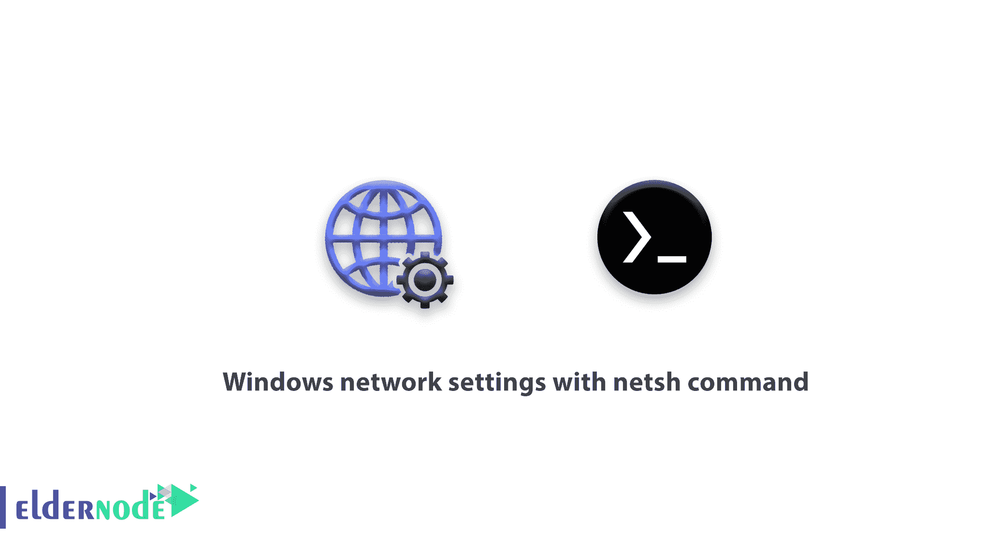

# 使用 netsh 命令的 Windows 网络设置- CMD 命令

> 原文：<https://blog.eldernode.com/windows-network-settings-with-netsh-command/>



由于我们的大多数客户都是 windows 网络管理员，在本文中，我们将使用 [netsh](https://docs.microsoft.com/en-us/windows-server/networking/technologies/netsh/netsh) 命令来了解 windows 网络设置，因为这是他们的先决条件之一。命令提示符由许多命令组成，您可以对每个 Windows 设置使用这些命令。作为网络管理员，您必须熟悉 Windows Server core 操作系统，并且您知道这种类型的 Windows 中的所有设置都是通过命令提示符命令完成的。因此，我们打算教授一些 CMD 命令，这是使用服务器的先决条件。netsh 命令是一个具有许多功能的外部命令。

## 使用 netsh 命令的 Windows 网络设置

netsh 命令是一个具有许多功能的外部命令。

**1**–Windows 网络设置
**2**–Windows 防火墙设置
**3**–branch cache 设置
**4**–无线设置
**5**–DHCP 设置

提到的功能只是其中的一部分，在本文中，我们将解释更多关于 netsh 命令的网络设置，因此在本教程中，说明是结构化的，您可以根据可用的标题来使用它们。

你需要自己的副总裁吗？加入我们[这里](https://eldernode.com/vps/)

### 服务器的必备 CMD 命令

1-用 netsh 查看所有网卡

```
netsh interface show interface
```

2-查看所有系统网卡的设置

```
netsh interface ip show config
```

3-使用 netsh 命令设置静态 IP

命令结构:

```
[netsh interface ip set address "Connection name" static [IP addres] [Subnet Mask] [Default Gateway  An example: netsh interface ip set address "ethernet" static 192.168.0.101 255.255.255.0 192.168.0.1
```

4-使用 netsh 命令设置静态 DNS

命令结构:

```
netsh interface ip add dns "connection name" [IP DNS]
```

在第一个示例中，我们将主 DNS 设置为 8.8.8.8。

```
netsh interface ip add dns "ethernet" 8.8.4.4 index=2
```

5-禁用和激活网卡

```
netsh interface set interface "ethernet" disabled  netsh interface set interface "ethernet" enabled
```

**注:** 第一行禁用以太网卡，第二行激活以太网卡。

6-将 IP 置于 DHCP 模式

```
netsh interface ip set address "ethernet" dhcp
```

**注意** : 以上所有命令都已准备好，并已使用 **netsh 命令配置了 Windows 网络设置，并且**我们将尽快了解有关 netsh 命令特性的更多信息。

亲爱的用户，我们希望你能喜欢这个使用 netsh 命令的 Windows 网络设置教程，你可以在评论区提出关于这个培训的问题，或者要解决 [Eldernode 培训](https://eldernode.com/blog/)领域的其他问题，请参考[提问页面](https://eldernode.com/ask)部分并在里面提出你的问题。