# Windows Server 2019 安装和配置教程- Eldernode

> 原文：<https://blog.eldernode.com/windows-server-2019-install-and-config/>

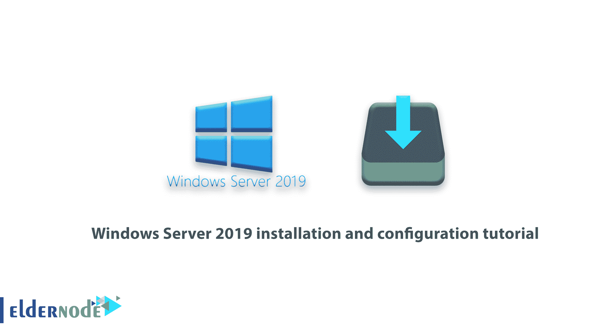

随着 Windows Server 2019 最新技术预览版的发布，我们决定学习如何安装和配置 Windows Server 2019。檀香山项目已经作为 Windows 管理中心正式发布。微软还发布了檀香山项目，这是一个新的 Windows Server 管理平台。在本教程中，我们将了解一下 **Windows Server 2019 安装和配置**以及 Henololo 项目。你可以访问 [Eldernode](https://eldernode.com/) 提供的包来购买 [Windows VPS](https://eldernode.com/windows-vps/) 服务器。

## **教程安装配置 Windows Server 2019**

第一步，你要[下载最新版本](https://www.microsoft.com/en-us/windows-server)。在本文的后续部分，请加入我们，了解如何安装和配置 Windows Server 2019。

### **安装配置 Windows Server 2019**

Windows Server 是特定于服务器的操作系统之一，用户在购买 [VPS 服务器](https://eldernode.com/vps/)或[专用服务器](https://eldernode.com/dedicated-server/)时，会根据自己的需求将其安装在服务器上。在 Windows Server 的不同版本中，最新的版本是 Windows Server 2019，它的性能比以前的版本更好。应该注意的是，尽管这个版本已经被微软推出了一段时间，但它仍然没有被认为是一个完全稳定的版本，而且它的新更新也在不断发布。跟随我们继续本教程。

### **如何在 VMware 中通过 ISO 文件安装 Windows Server 2019**

为了在 **VMware** 上安装 Windows Server 2019，我们使用了以下虚拟机:

**–Windows Server 2019 x64 位**

**–VMware ESXi 6.5 版**

在下图中，您可以看到 Windows Server 2019 安装页面，其 ISO 文件位于 VMware 虚拟机中:

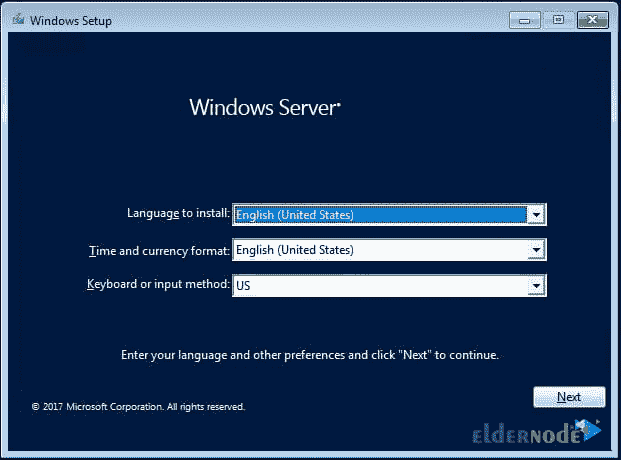

在上图中，指定**语言和键盘**，然后点击**下一步**。

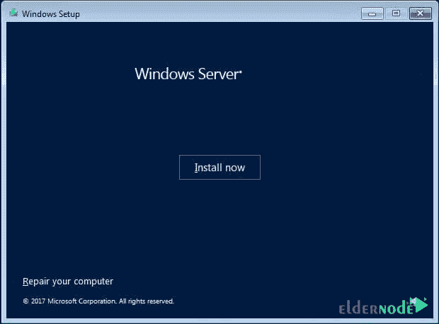

点击**安装**开始安装过程。

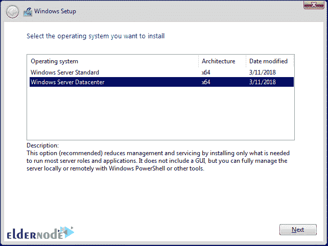

选择 **Windows Server 版本**，点击**下一步**。

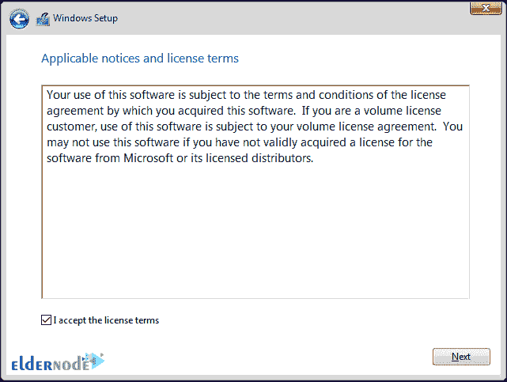

确认协议(选中我接受许可条款)。

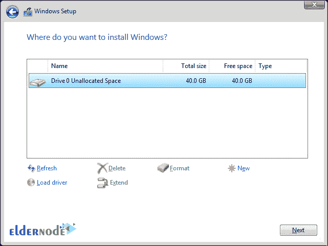

选择安装 Windows 的驱动器。

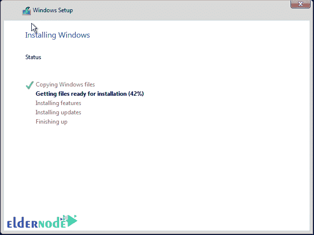

如您所见，安装过程非常简单。

### **如何在 Hyper-V 2016** 上安装 Windows Server 2019

使用 [Hyper-V](https://blog.eldernode.com/install-and-configure-hyper-v-on-windows/) ，您所要做的就是下载 VHDX 文件，并将其复制到您想要运行 Hyper-V 虚拟机的数据存储中。Hyper-V 环境的详细信息如下:

**–Windows Server 2016 Hyper-V**

**–Windows Server 2016 安装在 VMware ESXi 6.5 上。**

使用下载的 VHDX 文件的过程类似于创建其他 Hyper-V 虚拟机。但是这里我们把磁盘连接到下载的微软内幕文件。

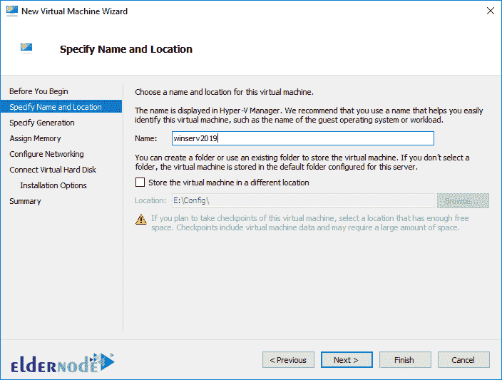

在上图中，我们指定了虚拟机存储的名称和路径。

然后选择**第二代**作为世代版本:

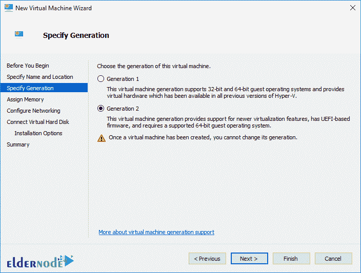

在下图中，我们只为该虚拟机分配了 2 GB 的内存。

***注意:*** 如果在操作环境中这样做，要注意高 RAM 要分配给虚拟机，否则高加载会面临很多问题。

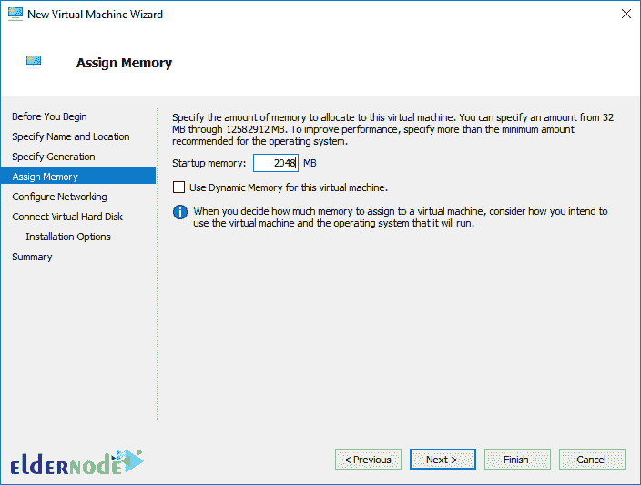

然后为 Windows Server 2019 中的 Hyper-V 虚拟机选择**网卡配置**。

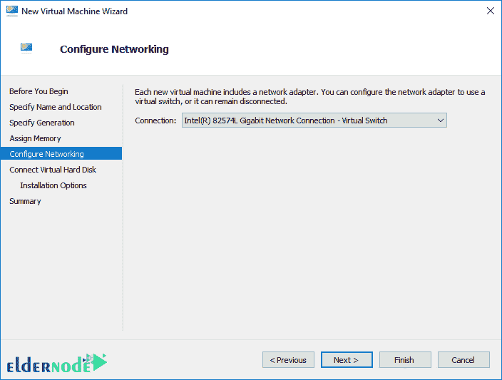

在**连接虚拟硬盘**部分，选择使用现有虚拟硬盘。下面是连接到虚拟机的已下载 VHDX 文件的路径。

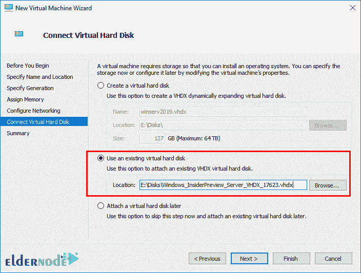

在最后一页，您将看到您配置的虚拟机的状态摘要。点击**完成**创建该机器。

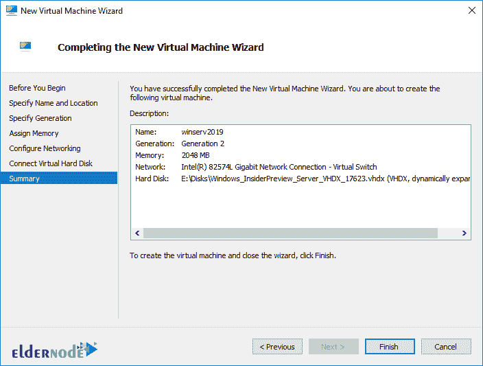

打开 Hyper-V 后会看到技术预告是**服务器核心**。

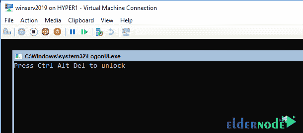

### **如何在 Windows Server 2019 上安装檀香山项目**

檀香山是一个基于浏览器的本地工具，允许你管理 [Windows](https://blog.eldernode.com/tag/windows/) 服务器，而不需要 Azure 或云。檀香山允许 IT 管理员完全控制所有服务器的结构特性。它通常适用于未连接到 Internet 的专用网络上的管理。

檀香山是机箱内管理工具的现代进化工具，如服务器管理器或 MMC。事实上，该项目是对 System Center 和 Operations Management Suite 的补充，但并不是用来替代这些产品和服务的。

可以在 Windows Server 2019 核心版上本地安装檀香山项目。为此，我们需要使用 CMD 运行并安装 MSI 包。

```
C:\Users\administrator.CLOUD\Downloads>msiexec /i honolulu_install.msi /qn /L*v log2.txt SME_port=6513 SSL_CERTIFICATE_OPTION=generate
```

***注:*** 在 Windows Server 2019 上安装檀香山项目的说明可以在 **[微软官方页面](https://docs.microsoft.com/en-us/windows-server/manage/honolulu/deployment-guide)** 找到。

```
msiexec /i <HonoluluInstallerName>.msi /qn /L*v log.txt SME_PORT=6513 SSL_CERTIFICATE_OPTION=generate
```

正如您在上面的命令中看到的，我们还指定了**日志文件。**使用日志文件查看安装状态并在安装过程中排除故障是合适的。起初檀香山的安装有故障，但重置服务器并重新安装后，问题得到了解决。

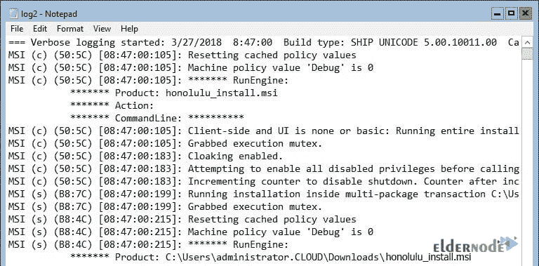

### **檀香山项目及其在 Windows Server 2019 上的实现**

乍一看，Windows Server 2019 上的檀香山项目非常吸引我们。微软做了一项有趣的设计工作，并为其增添了魅力。此外，仪表板有一个有趣的搜索功能，允许您轻松地找到不同的项目。您可以在其中键入字母，以便檀香山项目快速显示您正在寻找的项目。当然，搜索功能仍然需要改进，我希望在未来的版本中会有所改进。

下面你可以看到 Windows Server 2019 上檀香山项目的图片。

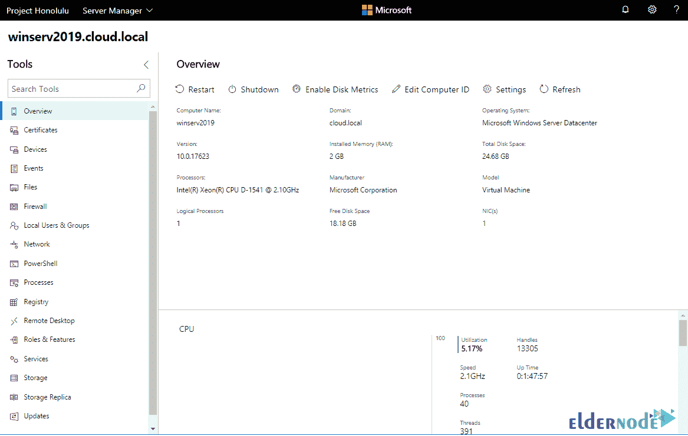

*

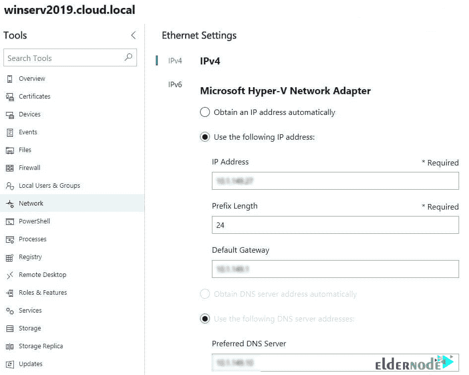

**

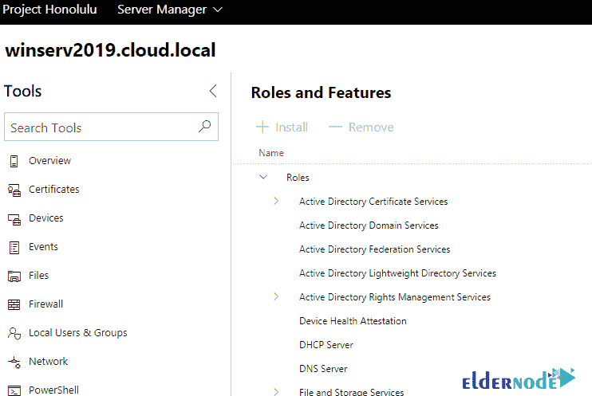

***

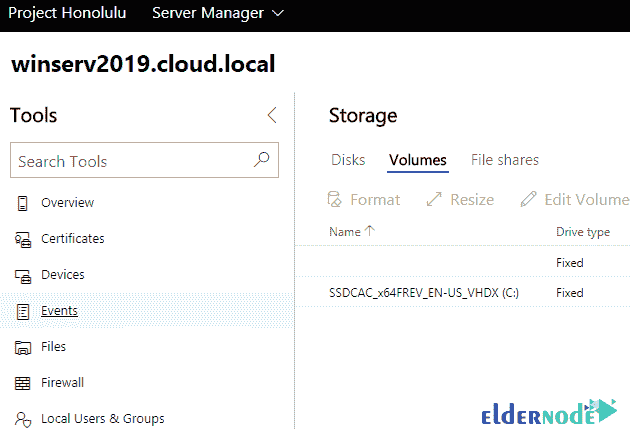

****

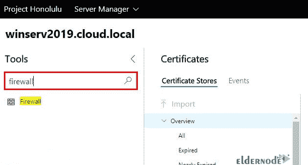

## 结论

本文是最完整的 Windows Server 2019 安装和配置培训参考资料之一。在本教程中，我们试图完整地教你如何在 VMware 和 Hyper-V 2016 中通过 ISO 文件安装 Windows Server 2019。您还将学习如何在 Windows Server 2019 上安装檀香山项目。