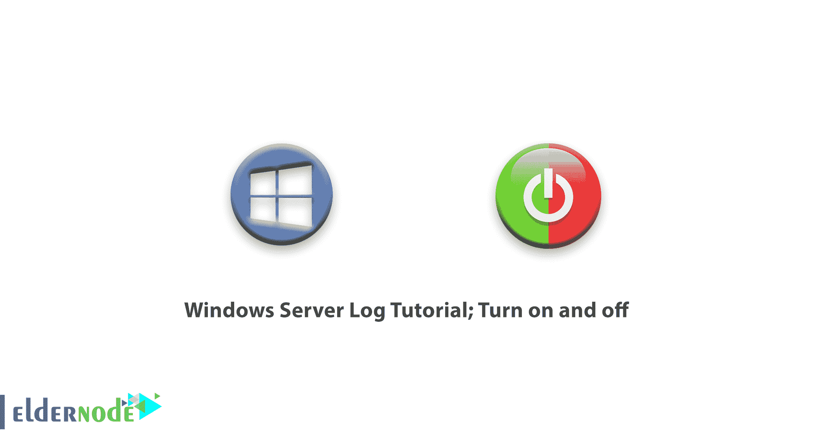
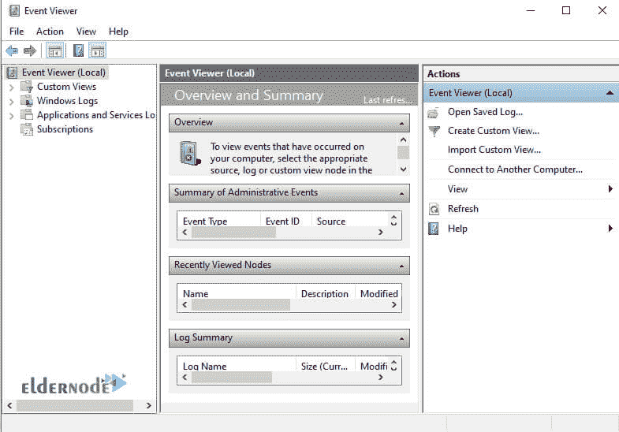
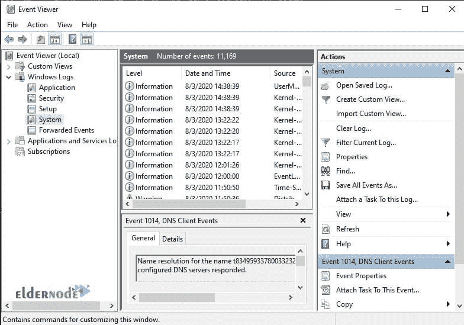
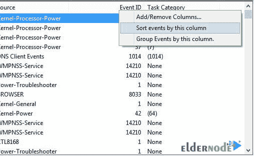
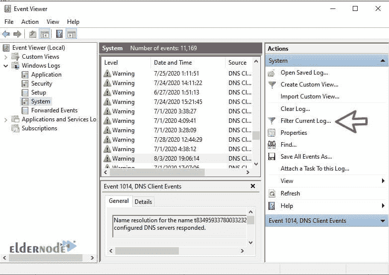
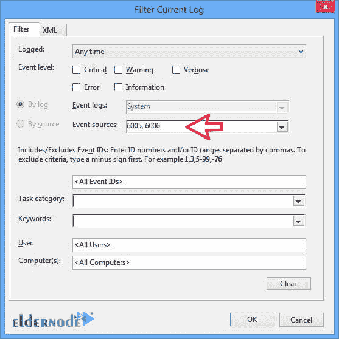
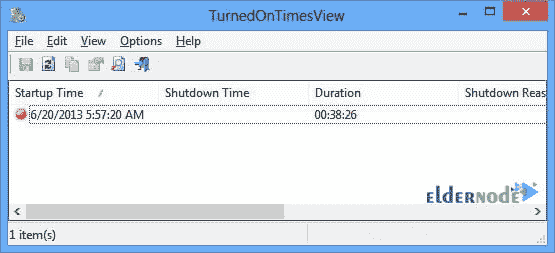
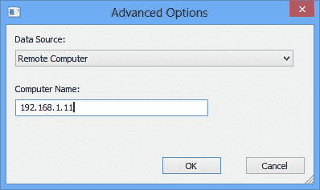

# Windows Server 日志教程；打开和关闭- Windows VPS 服务器

> 原文：<https://blog.eldernode.com/windows-server-log-tutorial/>

Windows Server 日志教程；打开和关闭。有时用户想知道计算机的启动和关闭 **日期**。通常，系统管理员需要了解历史以进行故障诊断。

如果多个用户正在使用同一台电脑，那么检查电脑何时运行和关闭以确保电脑被合法使用可能是一个很好的安全措施。

在本文中，我们将提供两种方法来跟踪**关闭和打开**电脑的历史。

[**购买 Windows 虚拟专用服务器**](https://eldernode.com/windows-vps/)

## 1-使用事件日志提取开启和关闭时间

事件查看器是一个很好的工具，可以存储计算机上发生的所有事情。在**每个**事件中事件查看器开始工作。

[**事件查看器**](https://en.wikipedia.org/wiki/Event_Viewer) 由事件日志服务运行，该服务是 Windows 内核的核心服务，不能手动停止或禁用。它还进入事件日志服务的**开始和停止时间**。你可以利用这段时间打开或关闭电脑。

事件日志服务输入的事件有两个事件代码。**事件 ID 6005** 表示事件日志服务已经开始，而事件 ID 6006 表示事件日志服务已经**结束**。

**按照以下步骤检查这些事件:**

**首先，打开**事件查看器**。(在 **Windows 8** 中用 Windows 键+ X + V 可以找到，在 **Windows 10** 中搜索事件查看器字样。)**

****

****b.** 从左侧菜单打开 Windows 日志，点击系统。**

****

****c.** 从**右边的面板**你会看到一个列表，里面列出了运行 Windows 时发生的事件。有三个事件与我们有关，我们必须首先对事件 ID 进行分类。**

**点击事件 ID 标签，对**事件 ID 列的信息进行**排序。**

****

****d.** 如果你的事件日志是**大**，则类别不起作用。您也可以从右侧的**动作**菜单中创建一个过滤器。**

****

****即** 输入号码 6005 和 6006 ，如**事件标识字段**所示。您也可以指定登录时间。**

****

**更多事件 id**

### **事件 **ID 6005** 表示“事件登录服务开始”。这意味着系统在开启。**

**事件 **ID 6006** 表示“事件登录服务结束”。这意味着系统被关闭。**

**如果你想检查更多的事件日志，你可以通过事件 ID 6013 ，它显示**计算机更新**，和事件 ID 6009 ，它显示引导时检测到的**处理器信息**。**

**事件 ID 6008 让您知道系统何时没有完全关闭然后启动。**

**2.使用 TurnedOnTimesView**

**turnedontimeview是一个用于**分析开关时间**的便携式示例工具。该工具可用于查看本地计算机或任何连接到网络的远程计算机的关机列表和启动时间。**

## **由于这是一个便携工具，你只需要解压它并运行turnedontimeview。**

**exe 文件立即列出**开始时间**、**关机时间**、每次开机和关机之间的正常运行时间、**关机原因**和**关机代码**。**

****

**关机的原因通常与 Windows server 机器有关。**

****–**进入选项查看远程电脑何时开启和关闭。**

****–**然后从**高级** **选项**部分选择数据源作为远程计算机。**

****–**在**计算机名**字段中指定的 IP 地址或计算机名。**

****–**点击确定按钮。**

**现在显示远程计算机的详细列表。**

****

**虽然您可以随时使用事件查看器来**准确地分析启动和关闭时间**，turnedontimeview也可以用于同样的目的，只不过用户界面要简单得多。**

****尊敬的用户**，我们希望您能喜欢这个[教程](https://eldernode.com/category/tutorial/)，您可以在评论区提出关于本次培训的问题，或者解决[老年人节点培训](https://eldernode.com/blog/)领域的其他问题，请参考[提问页面](https://eldernode.com/ask)部分，并尽快提出您的问题。腾出时间给其他用户和专家来回答你的问题。**

**Windows Server 日志教程；打开和关闭。**

**好运。**

**Windows Server Log Tutorial; Turn on and off.**

**Goodluck.**