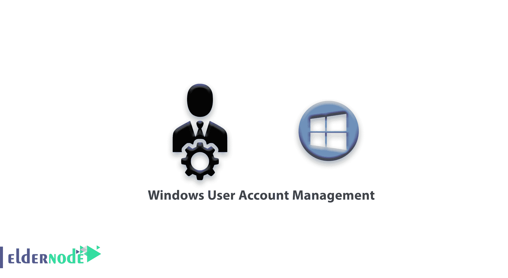
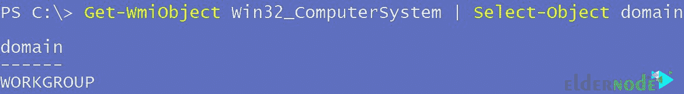
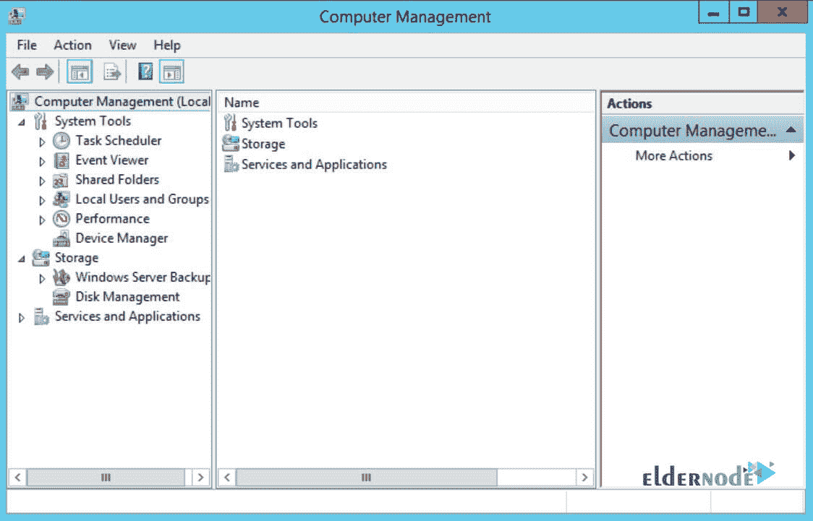
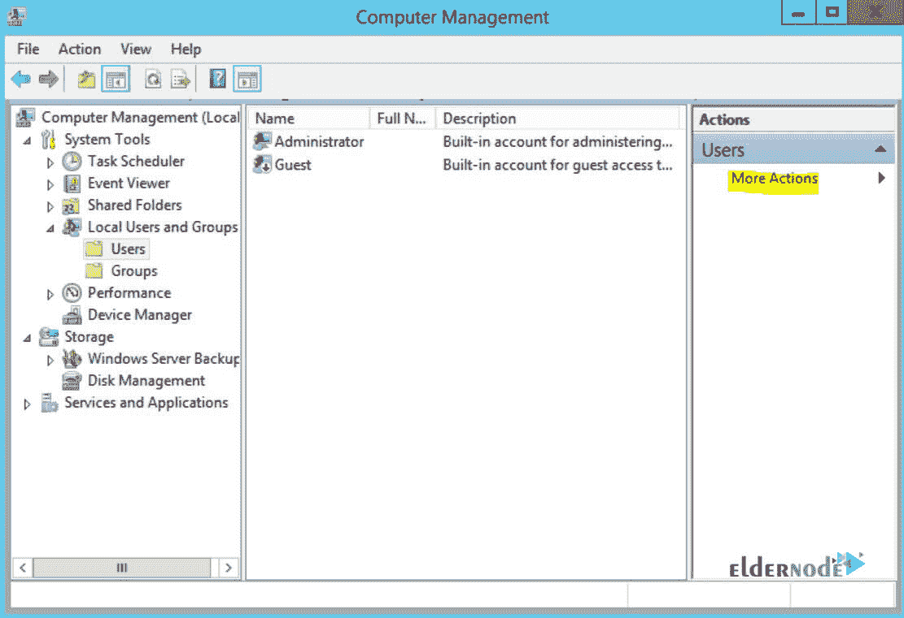
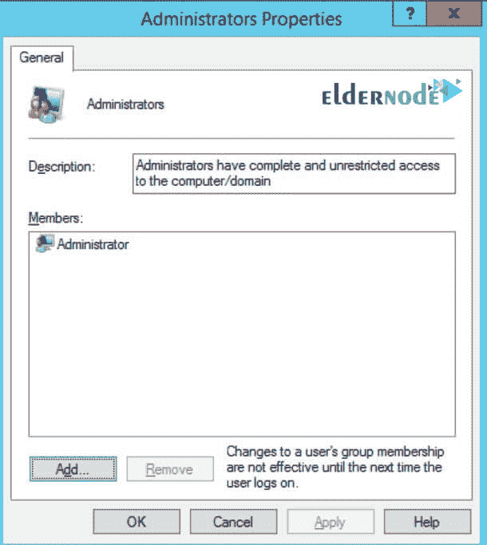
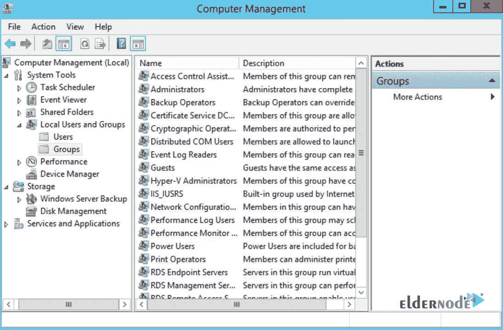
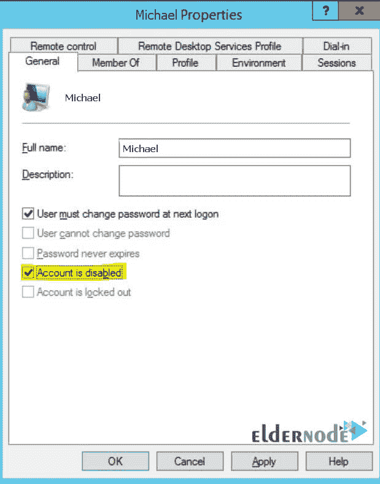

# 教程 Windows 用户帐户管理-

> 原文：<https://blog.eldernode.com/windows-user-account-management/>



教程 Windows 用户帐户管理。管理谁可以访问你的服务器，以及这个人的访问类型是服务器管理的重要部分。它假设您的 Windows 服务器在一个工作站上，而不是活动目录域的一部分。重置 Active Directory 用户帐户的过程是不同的，超出了本文的范围。本文将阐述 Windows 操作系统上与用户账户相关的多个领域。

**[购买 Windows 虚拟专用服务器](https://eldernode.com/windows-vps/)**

要确定您的服务器是在工作站上，还是在活动的目录域上，请启动 [**PowerShell**](https://docs.microsoft.com/en-us/powershell/) 并运行以下命令:

```
Get-WmiObject Win32_ComputerSystem | Select-Object domain
```

上述命令的输出如下所示:



## 计算机管理工具

你将使用电脑管理工具**创建**和**管理** Windows 账户。

**注:** 我们将从这个工具中执行我们所有的用户管理。

要打开计算机管理工具，在**命令提示符**中，或者在 **PowerShell** 控制台中，键入以下内容，然后按回车:

```
compmgmt.msc
```

也可以**右键**点击开始按钮，选择电脑管理。

您将看到一个类似于以下内容的工具:



## 如何创建账户

在使用电脑管理工具的同时，**展开** 本地用户和组，点击用户文件夹。

你现在可以在**右侧窗格**上查看服务器上所有**现有用户账户**。

要创建一个新用户，请执行以下步骤:

**1。T3 选择右侧动作窗格下的更多动作。**

**2。**T3 选择新用户。



新用户窗口将弹出**窗口**，您可以填写以下信息:

*   **–用户名:(必填)**
*   **–全名:(可选描述符)**
*   **–描述:(可选描述符)**
*   **–密码:(可选)**

创建新用户帐户时，以下选项可用:

**A)** 如果为自己以外的人创建账户，您可以选择以下选项中的:

**用户必须在登录时更改密码。**

**B)** 以下选项是可选的，用于特殊场合:

**用户不能更改密码。**

**C)** 以下选项常用于服务账户:

**密码永不过期。**

**D)** 以下选项是可选的，用于特殊场合:

**账号被禁用。**

当你准备好了，点击创建，你的新用户账户就会出现。

## 如何重置用户账户密码

在窗口管理工具中，这是一项简单的任务。您可以执行以下操作来重置帐户密码:

**1。在窗口管理 **中的**** 展开 本地用户和组，点击用户容器。

**2。在中间窗格找到**你想要编辑的用户账号，右键点击账号。

**3。**T3 选择设置密码。

**4。**T3 阅读通知弹出，选择继续。

**5。**T3 设置密码点击 OK 。

### 密码要求

密码要求可在您的服务器上定制，但默认值如下，以供参考:

**–**长度至少为六个字符。

**–**包含以下四类中的三类角色:

**–**英文大写字符(A 到 Z)

**–**英文小写字符(a 到 z)

**–**基数 10 位数字(0 到 9)

**–**非字母字符(例如！, $, #, %)

**–**不包含用户的帐户名或用户全名中超过两个连续字符的部分。

**–**更改或创建密码时会强制执行复杂性要求。

## 如何将用户添加到群组中

组允许您一次为多个用户管理权限和权限分配。

安装 windows 时，默认情况下会创建许多系统组。将用户分配到这些系统组将赋予用户特定的权限，例如备份操作员。

如果您希望用户拥有**远程桌面权限**，但不是**管理员**，您可以将他们分配到远程桌面用户组。

将一个用户分配到管理员组，默认情况下会赋予该帐户远程桌面用户权限。

**要将用户帐户分配给本地组，请执行以下步骤:**

**1。在 Windows 管理中**展开本地用户和组。

**2。** 点击组容器。

**3。** 找到想要添加用户的群组，**右键**选择添加到群组。

**4。** 在新的窗口中，你会看到当前群组的成员。

**5。** 选择在底部添加。

**6。** 会弹出一个新窗口选择用户。

**7。** 输入帐户名到**添加**，点击检查户名。

**8。** 点击确定将账号添加到群组。



## 如何创建群组

要在**窗口管理**中创建一个新组，执行以下操作:

**1。中的**进入**窗口管理**展开本地用户和组。

**2。** 点击组容器。

**3。T3 选择右侧动作窗格下的更多动作。**

**4。**T3 选择新建组。将弹出新组窗口。

**5。** 分配一个组名。

**注:** 描述可选。

**6。** 创建后，点击添加即可将账号添加到群组中。

**7。** 选择创建。



教程 Windows 用户帐户管理。

## 如何删除和停用账户

当用户不再需要访问您的服务器时，您可能想要通过删除或禁用他们的帐户来撤销他们的访问。

通常情况下，您会希望在删除 账户之前，将其禁用一小段时间。这使您可以从删除帐户可能引起的问题中恢复。 **要在**窗口管理**工具中禁用** 账户，请执行以下步骤:

**1。** 在窗口管理 **展开** 本地用户和组。

**2。** 点击用户容器。

**3。在中间窗格找到**你想要编辑的用户账号，右键**该账号**。

**4。T3 选择属性弹出账户属性窗口。**

**5。在通用选项卡下的**T3，选择账户禁用框，点击 OK 。



**在窗口管理工具中删除** 账户执行以下步骤:

**1。** 在窗口管理 **展开** 本地用户和组。

**2。** 点击用户容器。

**3。在中间窗格找到**你想要编辑的用户账号，右键**该账号**。

**4。选择**选择删除。

**5。** 阅读**通知**，准备好后选择是。

**尊敬的用户**，我们希望您能喜欢这个[教程](https://eldernode.com/category/tutorial/)，您可以在评论区提出关于本次培训的问题，或者解决[老年人节点培训](https://eldernode.com/blog/)领域的其他问题，请参考[提问页面](https://eldernode.com/ask)部分，并尽快提出您的问题。腾出时间给其他用户和专家来回答你的问题。

教程 Windows 用户帐户管理。

好运。