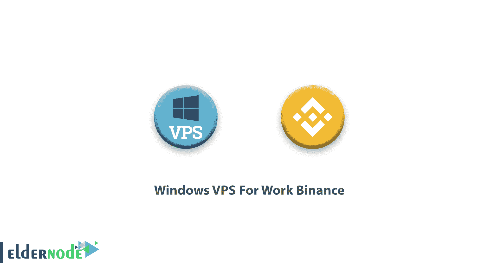

# 如何购买 Windows VPS 的工作币安和贸易- ElderNode 博客

> 原文：<https://blog.eldernode.com/windows-vps-for-work-binance/>

【更新于:2021/01/02】使用加密货币作为买卖的货币非常有吸引力。当然，并不是所有的加密货币，尤其是比特币，都具备电子支付的能力，都可以作为赚钱的手段。今天，许多人进入加密货币的世界，以获得更多更好的收入。币安是一家中国交易所的名字，通过订阅其网站，你可以买卖加密货币并成为交易者。此外，币安支持的货币种类繁多，你可以有很多选择。在这篇文章中，我们将了解在币安工作中使用 [Windows VPS](https://eldernode.com/windows-vps/) 的原因。我们还将引入一个 Windows [VPS 服务器](https://eldernode.com/vps/)，用于币安账户。

## **适用于币安工作的 Windows VPS**

**币安**是目前世界上最大的数字货币交易所，世界各地的用户可以在这里交易或交易数字货币。

重要的是不要带着多个 IP 进入币安面板。为币安帐户使用仅使用此 IP 的 IP，这样您就不会遇到帐户限制或身份验证请求的问题。请注意，免费破解者拥有被数百个其他用户使用的共享 IP，并且多个帐户可以使用该 IP。还有，短时间内 IP 的变化非常大，这就产生了问题。

通过购买 VPS 服务器，你可以很容易地高速运行账户[币安](https://www.binance.com/)。

工作帐户币安所需的 VPS 服务器配置:

工作币安帐户的最低系统要求是配备 1 GB 内存的 [Windows Server](https://blog.eldernode.com/tag/windows/) 2012 r2。你可以在 elder node to order[Windows VPS](https://eldernode.com/windows-vps/)服务器和 [RDP Admin](https://eldernode.com/admin-rdp-server/) 服务器中看到提供的包。

## 结论

使用 VPS 服务器登录币安和其他数字交易所是一种经济高效的解决方案，在过去的一年中已经有无数的消费者参与其中，这也是一种合理的解决方案。在本文中，我们试图向您解释使用 VPS 服务器与币安合作的原因。