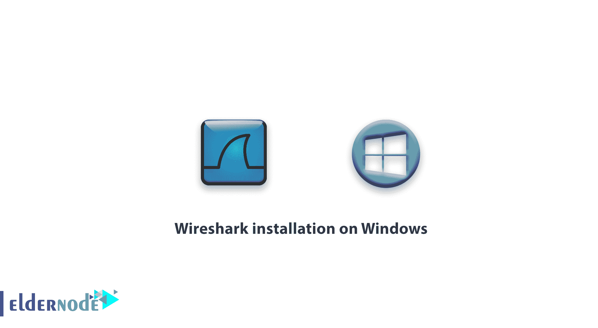
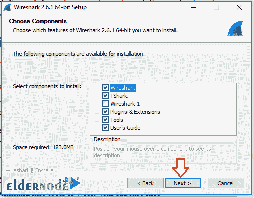
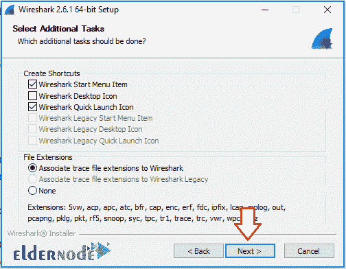
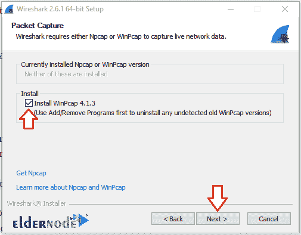
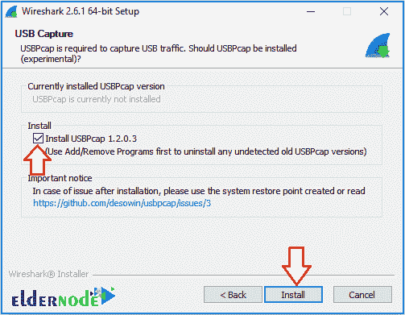

# Windows 上的 Wireshark 安装教程- Eldernode

> 原文：<https://blog.eldernode.com/wireshark-installation-on-windows/>

教程 [Wireshark 在 Windows 上的安装](https://eldernode.com/introducing-wireshark-software/)。Wireshark 是一款点对点网络分析软件，可帮助网络管理员全面分析所有传入和传出的数据包。

Wirehark 软件免费提供，非常受欢迎。

在 Windows 上安装 wirehark 软件与在任何其他 Windows 软件上安装一样简单，但是安装 wire hark 软件的步骤与其他软件不同，需要进一步解释。

##### 选择您最理想的 [Windows VPS](https://eldernode.com/windows-vps/) 服务器包

## Windows 中的 Wireshark 安装指南

*首先，从以下链接下载 wireshark 软件。([下载 wireshark](https://www.wireshark.org/download.html) )

*下载完成后，点击下一个的，进入**组件页面**。

*在此页面上，您可以选择 **Wirehark 组件**。

要完全运行该软件，请安装所有组件。

*在该窗口中，选择程序的快捷方式和输入/输出扩展的位置。

输入/输出扩展用于保存 wirehark 软件分析结果。

*按照安装步骤，您将被带到 WinPcap 工具安装页面。

WinPcap 是工作在网络链路层的标准辅助工具。该工具允许访问其他软件来访问和分析数据包。

*此时，如果需要，您可以安装 USBPcap 工具。

USBPcap 是一个轻量级的非常简单的工具，用于分析来自 USB 端口的数据包。像网络端口的 WinPcap 一样，这个工具允许 wirehark 访问 USB 端口。

在安装 wireshark 的以下步骤中，您将看到一个安装 WinPcap 和 USBPcap 的窗口。

**最后**，重启您的系统以启用所有 wireshark 功能。

**尊敬的用户**，我们希望您能喜欢这个[教程](https://eldernode.com/category/tutorial/)，您可以在评论区提出关于本次培训的问题，或者解决[老年人节点培训](https://eldernode.com/blog/)领域的其他问题，请参考[提问页面](https://eldernode.com/ask)部分，并尽快提出您的问题。腾出时间给其他用户和专家来回答你的问题。

好运。