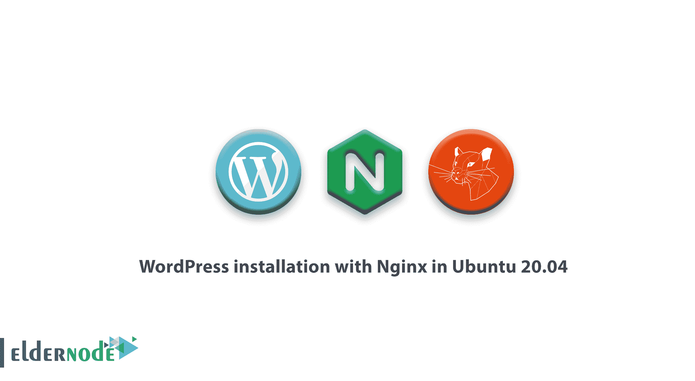
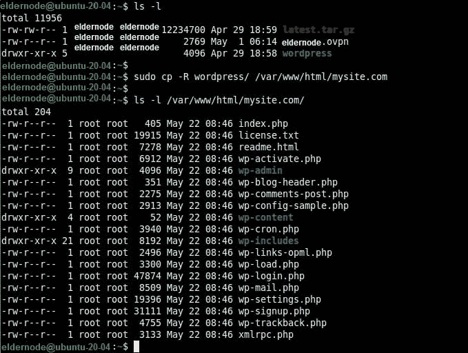

# 在 Ubuntu 20.04 中使用 Nginx 安装 WordPress 教程- Eldernode

> 原文：<https://blog.eldernode.com/wordpress-installation-nginx-ubuntu20/>



最近你在 Ubuntu 20.04 上了解了 [Nginx。关注我们的**教程，在 Ubuntu 20.04** 中用 Nginx 安装 WordPress。由于 **WordPress** 平台是一个开源的内容管理系统，在本文中我们将让你更加熟悉这个广泛使用的软件，使用它强大的功能、漂亮的设计，最重要的是，它可以自由地创建你想要的任何东西。](https://eldernode.com/install-nginx-on-ubuntu-20-04-lts/)

## 教程 Ubuntu 20.04 中用 Nginx 安装 WordPress

要安装 WordPress，你必须在你的 Ubuntu 20.04 服务器上安装 LEMP 堆栈。

### 在 Ubuntu 20.04 中安装 WordPress

**1-**

当您的服务器上有一个 LEMP 堆栈时，您需要使用

[wget command](https://linuxize.com/post/wget-command-examples/)

从 WordPress 的官方网站下载并设置它。

http://wordpress.org/latest.tar.gz

**同样，参见**

**3-** 此时，将 WordPress 文件夹中的内容复制到你网站的文件夹中(如mysite.com)，该文件夹应存储在 web 服务器的 web 文档根目录下( /var/www/html/ )。

**请注意** :使用 **cp 命令**时，mysite.com目录不一定要存在，会自动创建。

**2- **When you passed the previous step, extract the archived file using the [tar command](https://eldernode.com/using-tar-command-on-linux/).

**4-** 作为 webserver 用户和组 www-data 应该拥有它的读、写、执行权限，在网站目录/var/www/html/my site . com 上设置正确的权限

为网站创建 WordPress 数据库

**5-**现在，WordPress 需要一个数据库来进行网站数据存储。要提供它，为您的站点创建一个，使用 MySQL 命令登录到 **MariaDB** shell，使用 -u 选项提供用户名和 -p 作为密码，如果您作为根数据库用户 访问，也可以使用 **sudo**

```
ls -l  sudo cp -R wordpress/ /var/www/html/mysite.com  ls -l /var/www/html/mysite.com/    
```

**4-** As the webserver user and group www-data should own it with reading, write, and execute permissions, set correct permissions on the website directory /var/www/html/mysite.com.

```
sudo chown -R www-data:www-data /var/www/html/mysite.com  sudo chmod -R 775 /var/www/html/mysite.com
```

**6-** 要创建你网站的数据库，在你访问数据库 shell 时使用以下命令。D 数据库用户和密码。

### **7-** 为你的新 WordPress 安装创建一个【wp-config.php】文件。在这里，您将定义数据库连接和一些其他参数。然后，进入网站的文档根目录 /var/www/html/mysite.com 并从默认提供的示例文件创建一个wp-config.php文件。

**同样，参见**

```
sudo mysql -u root -p   OR  sudo mysql -u root		#this also works for root database user 
```

**8-** 创建后打开文件 a 。

现在，你需要你的 WordPress 站点连接到你为它创建的数据库。因此，请修改数据库连接设置。

**6-** To create your website’s database, use the following commands when you accessed the database shell. Database user and a password.

```
MariaDB [(none)]> CREATE DATABASE mysite;  MariaDB [(none)]> GRANT ALL PRIVILEGES ON **mysite**.* TO '**mysiteadmin**'@'localhost' IDENTIFIED BY  '**[[email protected]](/cdn-cgi/l/email-protection)!**';  MariaDB [(none)]> FLUSH PRIVILEGES;  MariaDB [(none)]> EXIT;
```

为 WordPress 网站 创建一个 NGINX 虚拟服务器块(VirtualHost)

```
cd /var/www/html/mysite.com  sudo mv wp-config-sample.php wp-config.php
```

**9-** 此时，要在 **NGINX** 配置中为你的站点配置一个虚拟服务器块，让 **NGINX** 使用你的域名为客户提供你的网站服务。所以，在 **/etc/nginx/conf.d/** 目录下创建一个名为my site . com . conf的文件。

因此，将以下配置复制并粘贴到文件中。不要忘记

用你的域名替换mysite.com和www.mysite.com。

**8- ** Open the wp-config.php file after creating.

**Now,** you need your WordPress site to connect to the database you created for it. So, modify the database connection settings.

**除了上述配置的**:

### 根据**/etc/PHP/7.4/fpm/pool . d/www . conf**池配置文件中 listen 参数的值的定义， fastcgi_pass 参数的值应该指向 **PHP-FPM** 正在监听的套接字。默认是一个 UNIX 套接字 **/run/php/php7.4-fpm.sock** 。

**9-** At this point, to configure a virtual server block for your site in the **NGINX** configuration, for **NGINX** to serve your website to clients using your domain name. So, Create a file called mysite.com.conf under the **/etc/nginx/conf.d/** directory.

```
sudo vim /etc/nginx/conf.d/mysite.com.conf
```

Therefore, copy and paste the following configuration in the file. Do not forget to

**10-** 你应该考虑到 NGINX 通常会将所有请求路由到默认服务器，所以为了使你的新站点和你打算在同一服务器上建立的其他站点能够很好地加载，请删除**默认**服务器块文件。

```
server {          listen 80;          listen [::]:80;          root /var/www/html/**mysite.com**;          index  index.php index.html index.htm;          server_name **mysite.com www.mysite.com**;            error_log /var/log/nginx/mysite.com_error.log;          access_log /var/log/nginx/mysite.com_access.log;                    client_max_body_size 100M;          location / {                  try_files $uri $uri/ /index.php?$args;          }          location ~ \.php$ {                  include snippets/fastcgi-php.conf;                  fastcgi_pass unix:/run/php/php7.4-fpm.sock;                  fastcgi_param   SCRIPT_FILENAME $document_root$fastcgi_script_name;          }  }
```

**11-** 在重启 Nginx 服务以应用上述更改之前，请检查 **NGINX** 配置语法是否有任何错误

**In addition** to the above configuration:

通过网络安装程序完成 WordPress 的安装

**12-** 打开网页浏览器，用你的域名导航。使用 web 安装程序完成 WordPress 的安装。

为安装过程选择您喜欢的**语言**，并在 web 安装程序加载后点击**继续**。

**10-** You should consider that NGINX normally routes all requests to the default server, so to enable your new site and other sites you intend to set up on the same server to load well, remove the **default** server block file.

```
sudo rm /etc/nginx/sites-enabled/default  sudo rm /etc/nginx/sites-available/default
```

**13-** 如下图所示，是时候填写你的新网站所需的信息了。然后点击安装 WordPress。请注意，您随时可以在以后编辑这些信息。

```
sudo nginx -t  sudo systemctl restart nginx 
```

### Completing the WordPress Installation via the Web Installer

成功安装 WordPress 后， **14-** 点击登录按钮进入网站管理员的仪表板。

```
http://mysite.com/  OR  http://SERVER_IP/
```

Choose the **language** you prefer for the installation process and click **Continue **after the web installer loads.

**15-** 要访问您网站的管理仪表板，请在网站管理员的登录页面提供您在上面创建的用户名和密码，然后单击登录。

**13-** As you see below, it is time to fill in the required information about your new website. Then click Install WordPress. Note that you can always edit this information later on.

就是这样！您已经在 **Ubuntu 20.04** 中成功安装了最新版本的 **WordPress** 和 **NGINX** ，开始构建您的新网站或博客。

**14-** Proceed to access the website administrator’s dashboard by clicking on the login button, after WordPress is successfully installed.

亲爱的用户，我们希望这篇教程能对你有所帮助，如果你有任何问题或想查看我们的用户关于这篇文章的对话，请访问[提问页面](https://eldernode.com/ask)。也为了提高你的知识，有这么多有用的教程为[老年节点培训](https://eldernode.com/blog/)准备。

**15-** To access your site’s admin dashboard, at the website admin’s login page, provide your username and password created above and click login.

That’s it! You have successfully installed the latest version of **WordPress** with **NGINX** in **Ubuntu 20.04**, to start building your new website or blog.

Dear user, we wish this tutorial would be helpful for you, to ask any question or review the conversation of our users about this article, please visit [Ask page](https://eldernode.com/ask). Also to improve your knowledge, there are so many useful tutorials ready for [Eldernode training](https://eldernode.com/blog/).