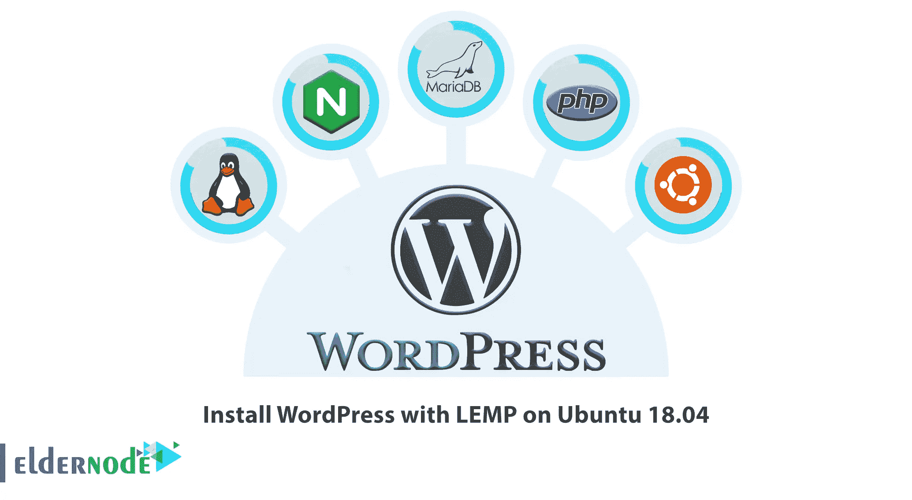
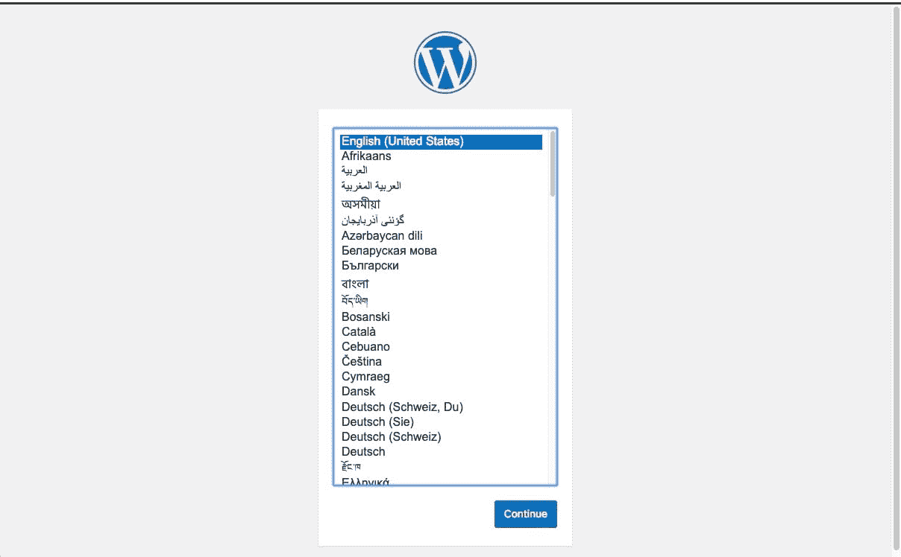
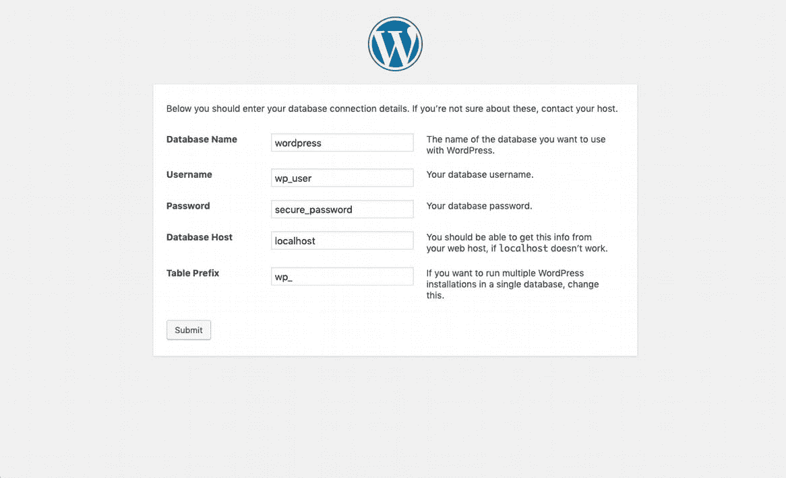
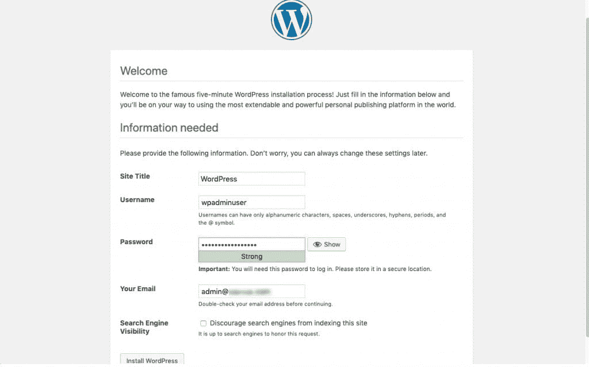

# 在 Ubuntu 18.04 上安装带有 LEMP 的 WordPress

> 原文：<https://blog.eldernode.com/wordpress-nginx-mariadb-php-ubuntu/>



继 [WordPress](https://eldernode.com/wordpress-installation-nginx-ubuntu20/) 和 [Ubuntu](https://eldernode.com/tag/how-to-install-laravel-with-nginx-on-ubuntu/) 系列教程之后，在本文中，我们将**在 Ubuntu 18.04 上安装带有 LEMP 的 WordPress。由于我们的许多读者可能想在他们自己的服务器上测试它，今天我们介绍如何在 **Ubuntu 18.04** 上用 **LEMP** 设置 **WordPress** 。而且你知道 **LEMP** 是 **Linux** 、 **Nginx** 、 **MySQL/MariaDB、**和 **PHP** 的流行组合。如果你想购买一台 [**Ubuntu VPS**](https://eldernode.com/ubuntu-vps/) 服务器，你可以查看 [Eldernode](https://eldernode.com/) 网站上提供的套装。**

在这篇来自 Ubuntu 培训的文章的续篇中，我们将教你如何在 Ubuntu 18.04 上安装带有 LEMP 的 WordPress。

#### 要求

–专用服务器或 **VPS** ( **虚拟专用服务器**)以及 [**Ubuntu 18.04**](https://eldernode.com/initial-setup-ubuntu-18/) 最小安装

## 在 Ubuntu 18.04 上安装带有 LEMP 的 WordPress】

让我们一起去看看如何在 Ubuntu 18.04 上安装带有 LEMP 的 WordPress。浏览本指南，查看所有必需软件包的安装，创建自己的数据库，准备一个 [虚拟主机](https://en.wikipedia.org/wiki/Virtual_hosting) ，并通过浏览器完成 **WordPress** 的安装。

### 在 Ubuntu 18.04 上安装 Nginx Web 服务器

你需要设置 Nginx 网络服务器，在 Ubuntu 18.04 上安装带有 LEMP 的 WordPress。首先，使用以下命令更新您的系统软件包:

```
sudo apt update   sudo apt upgrade
```

现在使用以下命令安装 Nginx:

```
sudo apt install nginx
```

现在用下面的命令启动 Nginx:

```
sudo systemctl start nginx
```

您可以使用以下命令启用它:

```
sudo systemctl enable nginx
```

### 在 Ubuntu 18.05 上安装 PHP

现在你应该安装 PHP 和所需的 PHP 包来在 Ubuntu 18.04 上安装带有 LEMP 的 WordPress，因为 **WordPress** 是用 **PHP:** 编写的应用

```
sudo apt install php php-mysql php-fpm php-curl php-gd php-intl php-mbstring php-soap php-xml php-xmlrpc php-zip mariadb-server mariadb-client 
```

安装完成后，启动 **php-fpm** 服务并启用它:

```
sudo systemctl start php7.2-fpm
```

然后通过输入以下命令来启用它:

```
sudo systemctl enable php7.2-fpm
```

### 在 Ubuntu 18.04 上安装 MariaDB

是时候安装 MariaDB 了。在 Ubuntu 18.04 上安装带有 LEMP 的 WordPress 需要这一步。为此，请输入以下命令:

```
sudo apt install mariadb-server 
```

您可以使用以下命令启动并确保 MariaDB 正在运行:

```
sudo systemctl start mariadb.service
```

然后使用以下命令启用 MariaDB:

```
sudo systemctl enable mariadb.service
```

然后，使用以下命令来保护您的 MariaDB 安装。

```
sudo mysql_secure_installation 
```

最后，回答问题以完成任务。要做题，输入 **Y** 。

### 为网站创建 WordPress 数据库

在 Ubuntu 18.04 上安装带有 LEMP 的 WordPress 之前，是时候准备好数据库了。WordPress 应用程序将使用数据库用户和密码，这样它就可以连接到 MySQL 服务器。

```
sudo mysql -u root -p
```

使用下面的命令创建一个数据库，然后创建一个数据库用户及其密码。您将授予用户访问该数据库的权限。

```
CREATE DATABASE **wordpress**;  GRANT ALL ON **wordpress**.* TO '**wp_user**'@'localhost' ;  FLUSH PRIVILEGES;  EXIT;
```

### C 在 NginxT5 上为 WordPress 网站创建虚拟主机

在这一步，你应该为你的 WordPress 网站创建一个虚拟主机，在 Ubuntu 18.04 上安装带有 LEMP 的 WordPress。首先，用下面的命令下载 WordPress 文档:

```
sudo mkdir -p /var/www/html/wordpress.conf  wget http://wordpress.org/latest.tar.gz
```

现在用下面的命令提取它:

```
tar xfvz latest.tar.gz
```

至此，您将创建您的文档根目录，我们已经在虚拟主机中设置了该根目录，即 **/var/www/html/wordpress** 。接下来，您需要使用以下命令更改该目录中文件和文件夹的所有权:

```
sudo chown -R www-data: /var/www/html/wordpress/  sudo chmod -R 755 /var/www/html/wordpress/
```

使用您喜欢的文本编辑器，创建以下文件。

```
sudo nano /etc/nginx/sites-available/wordpress.conf 
```

增加以下内容:

```
server {      listen 80;      listen [::]:80;      root /var/www/html/wordpress;      index  index.php index.html index.htm;      server_name **example.com www.example.com**;         client_max_body_size 100M;        location / {          try_files $uri $uri/ /index.php?$args;              }        location ~ \.php$ {      include snippets/fastcgi-php.conf;      fastcgi_pass             unix:/var/run/php/php7.2-fpm.sock;      fastcgi_param   SCRIPT_FILENAME $document_root$fastcgi_script_name;      }  }
```

**注意** :不要忘记将**【example.com】**替换为您希望使用的域名。

您现在可以保存并关闭文件。然后通过以下方式启用站点:

```
sudo ln -s /etc/nginx/sites-available/wordpress.conf  sudo ln -s /etc/nginx/sites-enabled/
```

下一个，重新加载 Nginx:

```
sudo systemctl reload nginx
```

如果你使用了一个未注册/不存在的域，你可以配置你的 hosts **/etc/hosts** 文件，因为你已经准备好运行你的 WordPress 的安装了。

```
http://Server_IP/ 
```

考虑你的服务器的 IP 地址是 **192.168.1.100** ，你正在使用的域名是【example.com】T2，你的计算机也在给定的 IP 地址上解析**example.com**。

将你的域名加载到浏览器中，查看 WordPress 安装页面:



然后，您可以看到我们之前设置的数据库凭据:



如下所示，您需要提交表单，并在下一个屏幕上配置您的网站标题、管理员用户和电子邮件:



**好样的** ！你已经在 Ubuntu 18.04 上完成了 WordPress 与 LEMP 的安装过程，从现在开始你可以开始管理你的 WordPress 网站了。我们建议你从安装一些全新的主题或者通过插件扩展网站功能开始。

## 结论

在这篇文章中，我们教你如何在 Ubuntu 18.04 上安装带有 LEMP 的 WordPress。我们希望这个在 Ubuntu 18.04 上安装带有 Nginx、MariaDB 和 PHP 的 WordPress 的教程能对你有所帮助，要问任何问题或回顾我们的用户关于这篇文章的对话，请访问 [提问页面](https://eldernode.com/ask) 。也是为了提高自己的见识，准备了这么多有用的教程给 [Eldernode 培训](https://eldernode.com/blog/) 。