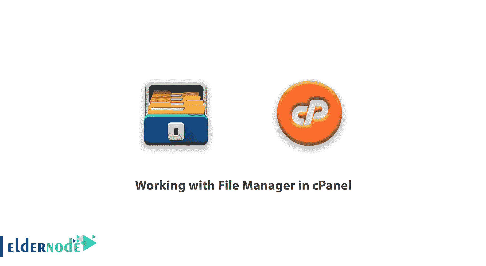
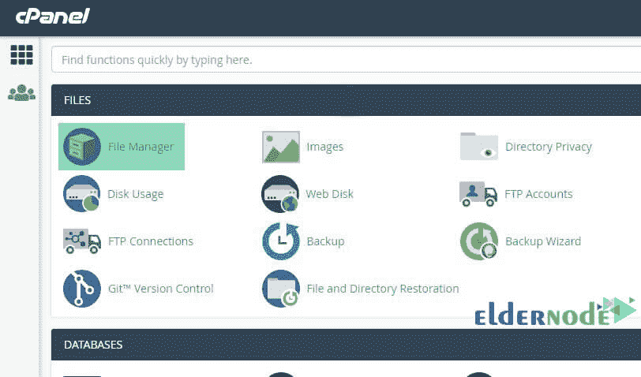
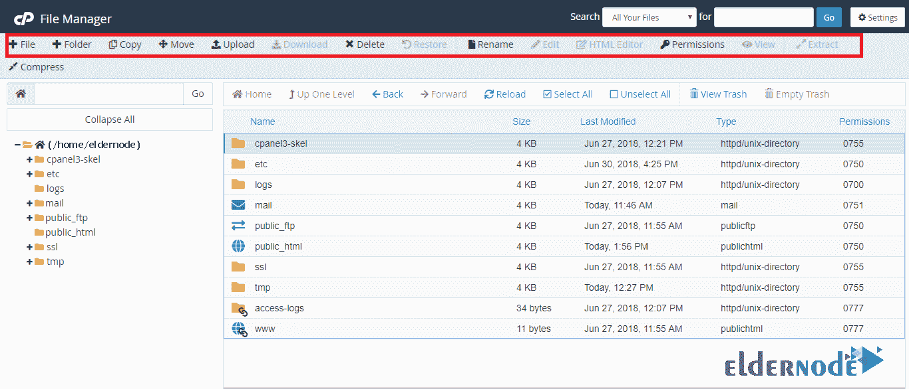

# 在 cPanel - Advance ElderNode 博客中使用文件管理器

> 原文：<https://blog.eldernode.com/working-with-file-manager-in-cpanel/>

在 [cPanel](https://blog.eldernode.com/tag/cpanel/) 中使用文件管理器；

在这一系列的[教程](https://eldernode.com/category/tutorial/)中，我们将回顾 cPanel 控制面板的使用。

cPanel 可以在文件夹中组织你所有的账户文件。您可以使用文件管理器界面来管理您的文件。

在 cPanel 中使用文件管理器

### **更改设置:**

要更改目录设置，请按照下列步骤操作:

1.  点击**设置**打开**偏好设置**窗口。
2.  选择“**public _ html”**或“**www”**，或选择其他选项打开该目录下的文件管理器界面。
3.  点击**保存**

### **新建一个文件或文件夹:**

要创建新文件或文件夹，请按照下列步骤操作:

1.  在文件管理器工具栏中，点击“ **+文件”**或“ **+文件夹”**。一个新窗口将为您打开。
2.  输入新项目的名称
3.  输入要保存项目的位置的名称。
4.  点击**新建文件**或**新建文件夹**。

### **重命名文件或文件夹:**

要重命名文件或文件夹，请单击项目名称，并在文本框中输入新名称。按下“**Return”**键保存更改。

### **文件转移到文件夹:**

要将文件移动到特定文件夹，您需要执行以下操作:

1.  在界面上方的工具栏中，点击**移动**。将出现“新建文件”窗口。
2.  在“**中输入要将文件移动到的文件路径，在“**中输入要将该文件移动到的文件路径。
3.  现在点击移动文件。

### **复制文件:**

要复制文件，请按照下列步骤操作:

1.  选择要复制的文件。
2.  点击**复制**
3.  在“复制”窗口中，输入要保存目标项目的路径。
4.  点击**复制文件**选项。

### **复制多个文件:**

考虑以下复制多个文件的步骤:

1.  为此，在选择项目时按住“**Shift”**键。
2.  现在从工具栏中选择**复制**。
3.  在弹出窗口中，输入文件路径
4.  单击**复制**文件选项。

### **修改文件或文件夹权限:**

要修改文件或文件夹的权限，请按照下列步骤操作:

1.  选择要修改“**权限”**的文件或文件夹。
2.  从**工具栏**中，点击**权限**。在这些情况下，会出现“权限更改”窗口。
3.  使用**复选框**或**文本框**更改权限。
4.  点击**更改权限**应用更改。

### **删除文件或文件夹:**

考虑以下步骤:

1.  选择要删除的文件或文件夹
2.  点击工具栏上的**删除**。
3.  点击**【垃圾文件】**确认文件或文件夹已被删除。

#### **要恢复一个被删除的文件或文件夹，请按照以下步骤:**

1.  从工具栏中，单击“**查看回收站”**
2.  选择要恢复的文件或文件夹
3.  点击**恢复**
4.  确认文件或文件夹恢复。

在 [cPanel](https://www.cpanel.net/) 中使用文件管理器；

祝您好运