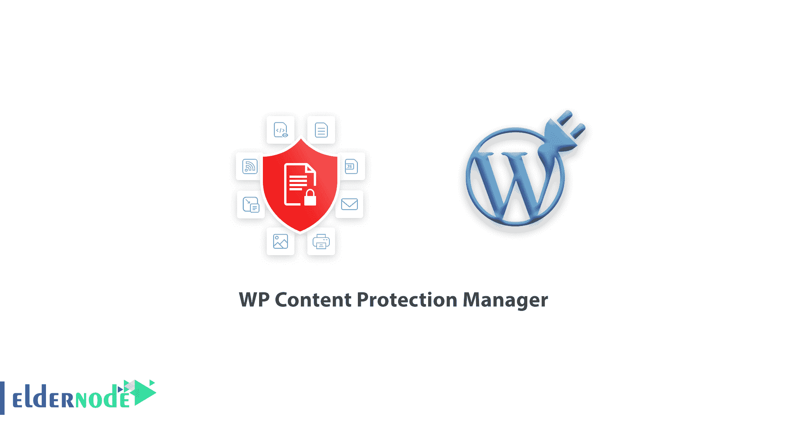
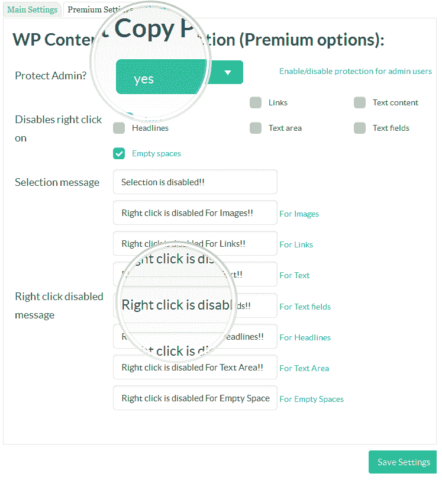

# WP 内容保护管理器插件

> 原文：<https://blog.eldernode.com/wp-content-protection-manager/>

2022 年 2 月 12 日更新。WP 内容保护管理器插件的开发是为了防止其他用户复制或窃取网站内容和图像。这个 WordPress 插件，可以被认为是一个 [WordPress](https://blog.eldernode.com/tag/wordpress/) 应用程序插件，有很多我们在评论中为你概述的特性。另外，如果你需要在[购买 VPS](https://eldernode.com/vps/) 服务器，你可以在 [Eldernode](https://eldernode.com/) 看到可用的包。

## **WP 内容保护管理员**

### **内容保护插件:**

WP 内容保护管理器插件是一个简单的，轻量级的，但功能强大，引人入胜。正如你从 WP 内容保护管理器插件名称中知道的，它是用来锁定和保护 WordPress 站点内容的。

你知道网站的内容和图像与网站的 SEO 有直接的关系，被复制的内容是非常危险的，并且会得到谷歌等搜索引擎的负面评价。

这些是初步的解释，以表明有时你不希望你的网站内容被其他人复制，或者你上传的专有图片未经你的允许被使用。我们给你的解决方案是使用一个内容保护插件。

### **内容保护插件设置:**

WP 内容保护管理器插件是轻量级和简单的，但工作良好。只需创建这个原始的 WordPress 插件，通过插件安装教程安装并激活它。之后，WP 内容保护管理器选项会出现在你的[站点设置菜单中。](https://blog.eldernode.com/tag/wordpress/)

### **本插件提供的功能:**

内容保护管理器插件功能不止于此。有了这个插件，你可以保存内容，文章的文本和图片，你可以通过显示带有标题和链接的弹出广告将你的图片转化为金钱。

还可以向试图通过插入 Html 代码来保存网站信息(如图像或内容)的用户显示广告。WordPress 内容保护插件也可以防止在你的网站上点击右键。

确定当用户右击时向他们显示什么事件！禁用右键单击并显示文本消息？给他们看图片或者 HTML 代码？用 CTRL + S 组合键禁用页面缓存是这个插件的另一个特性。

### **内容保护管理器插件的其他特性:**

*   拷贝保护和内容选择
*   禁用从网站保存图像的功能
*   禁用网站上的右键菜单
*   保存图像时显示文本消息、图像或 HTML 代码
*   右键单击时显示文本消息、图像或 HTML 代码
*   禁用 Ctrl + S 按钮功能
*   禁用 Ctrl + A、Ctrl + C、Ctrl + X 或 Ctrl + V 键
*   能够定制警报和广告
*   良好的性能和非常简单

[下载插件](https://wordpress.org/plugins/wp-content-copy-protector/)

## 结论

在这篇文章中，我们介绍了 WordPress 内容管理系统中的 WP 内容复制保护插件，并研究了它的特性。我们希望这篇文章对你有用。