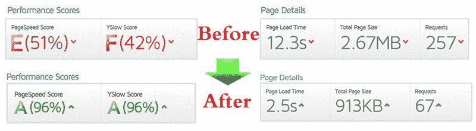
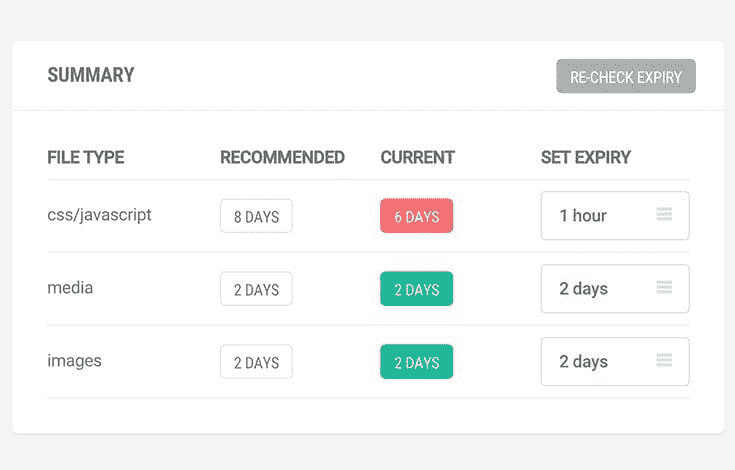
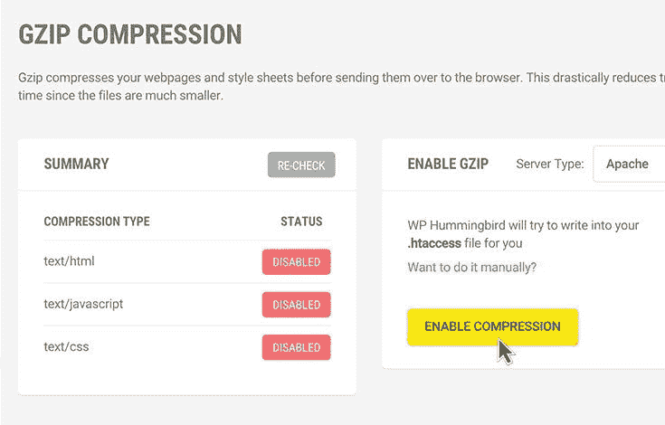

# 介绍 WP-蜂鸟插件- ElderNode 博客

> 原文：<https://blog.eldernode.com/wp-hummingbird-plugin/>

2022 年 2 月 5 日更新。WP-蜂鸟插件(Hummingbird Plugin)，蜂鸟插件是世界上最负盛名的公司之一的专业程序员永无止境的努力的结果，它可以帮助你通过几次点击将你的网站速度提高一倍。这个插件遵循一定的原则，这些原则使它成为世界上最强大的插件之一。另外，如果你需要购买 [Linux VPS](https://eldernode.com/linux-vps/) ，你可以在 [Eldernode](https://eldernode.com/) 中看到可用的软件包。

## **WP-蜂鸟 WordPress 插件**

网站在加载过程中的高速度是谷歌在众多因素中寻找的因素之一，这些因素特别关注它，并在 SEO 辩论中赋予它很多可信度。

这个插件的基本部分是压缩、浏览器缓存和 GZIP 压缩。

### **在几分钟内提高你的 WordPress 网站速度** :

你可能也有一个 [WordPress](https://blog.eldernode.com/tag/wordpress/) 网站，并担心加载缓慢！或者你想增加你的谷歌搜索结果，比以往更成功。我们通过提供蜂鸟插件来解决这个问题。无论你使用哪个 WordPress 模板，它都用蜂鸟插件进行了优化，并向你展示了最高的加载速度。

蜂鸟插件是第一个能够快速标准化网站的 WordPress 插件。

站点速度插件确实在某些方面提高了你站点的速度，但是蜂鸟最重要的特点是它以最好和最有效的方式进行压缩，因此不会给你的站点带来任何问题。这对于网站设计师来说是非常重要的。

### **蜂鸟插件如何加速你的网站？**

#### **1-压缩 Css–Js–Html 文件…**

蜂鸟插件你的 CSS，JavaScript，HTML 和其他文件使用最好和最有效的压缩方法。这个插件里连字体都是压缩的。网站速度插件是如此先进，你有许多设置，如合并，缩小，包括，位置压缩每个文件尽你所能。这个插件会自动为你做所有最好的事情。

#### **2-超专业缓存存储！**

你知道什么是网站缓存吗？

蜂鸟插件生成并存储整个网站的副本，并在用户访问网站时快速提供现成的版本，从而提高网站的速度。

缓存存储可以自动或手动设置，到期日期和时间可以设置为每小时、每天等等。

这个 WordPress 插件也支持 Cloudflare。

#### **3。发送 zip(使用 g zip 进程)**

使用 gzip 算法使您的站点能够在将 CSS 文件和网页发送到浏览器之前压缩它们，然后再发送它们。

由于这种算法使文件更小，数据传输速度提高，网页加载速度更快。

这种能力的主要原因是能够节省传输页面文件和样式表的时间。

这将最终减少页面加载时间。

[下载插件](https://wordpress.org/plugins/hummingbird-performance/)