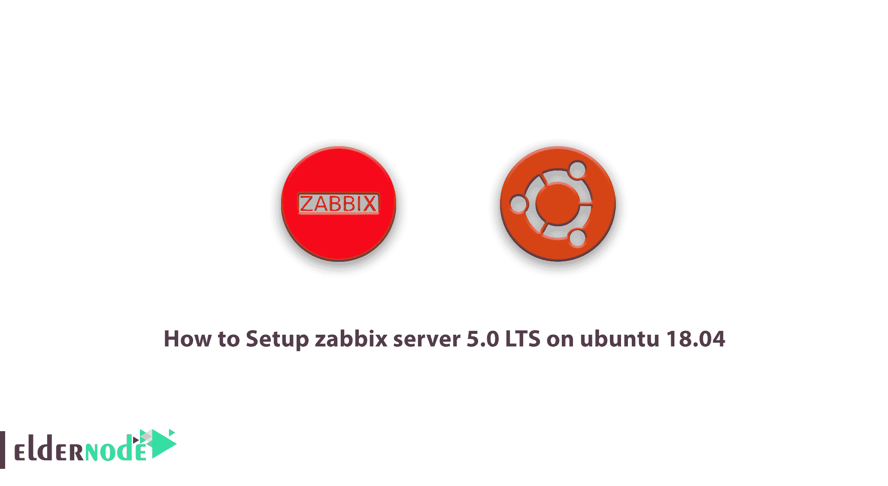

# 如何在 ubuntu 18.04 - Eldernode 上设置 zabbix server 5.0 LTS

> 原文：<https://blog.eldernode.com/zabbix-server-5-0-lts-on-ubuntu-18-04/>



了解如何在 ubuntu 18.04 上逐步安装 Zabbix server 5.0 LTS。Zabbix Server 是一款免费的开源监控工具，旨在即时监控服务器、虚拟机、网络和云服务。这个工具是由阿列克谢·弗拉季舍夫在扎比克斯 This 的积极支持下开发的。Zabbix Server 基于客户端-服务器模型，能够监控数百万个指标，如 CPU 负载、网络管理和磁盘空间消耗，以及数万台服务器。在本文中，我们试图教你如何在 ubuntu 18.04 上设置 Zabbix server 5.0 LTS。如果你想购买一台 [Ubuntu VPS](https://eldernode.com/ubuntu-vps/) 服务器，你可以访问 [Eldernode](https://eldernode.com/) 中提供的软件包。

## 教程在 ubuntu 18.04 上安装 Zabbix server 5.0 LTS

**Zabbix** 是一个完美、灵活的企业级平台，旨在实时监控来自数千台物理和虚拟服务器及网络设备的数百万个项目。该软件能够在非常大的环境中扩展。ZABBIX 网络监控系统是世界上最强大和最著名的监控系统之一。第一个版本自 2001 年发布，迄今为止，作为网络监控和软件领域的领先系统之一，已经发布了许多版本。

## 如何在 ubuntu 上配置 Zabbix server 5.0 LTS

ZABBIX 目前是世界上最好的[监控](https://blog.eldernode.com/linux-server-monitoring-commands/)系统之一，通过收集各种数据并准确分析它们，捕捉结果，并及时不间断地发送关于潜在事件的警报。您可以使用该系统来降低采购、安装和调试成本，并提高服务质量。只要选择 ZABBIX 来克服任何限制，并因此获得更多利润。

### Zabbix 服务器的应用和特点

**–**监控网络、软件和云资源的性能和效率

**–**支持从小型到大型的分布式环境

**–**物联网支持

**–**支持多种不同的架构

**–**出现问题时发送警报或执行远程命令

**–**在可视化、仪表板个性化、地图和图形领域的独特能力

**–**使用 Zabbix 代理实现分布式监控的能力

**–**对不同操作系统的可靠监控

**–**无论操作系统类型如何都能进行监控的能力

**–**丰富的个性化功能以及与各种环境的协调性

**–**模块化和灵活性

**–**大型环境的可扩展性

**–**每秒处理 50，000 多个控件的能力

**–**将规模扩大到数十万台受监控设备

**–**可靠的业务支持

**–**通过集群实现可扩展性

-通过电子邮件、短信、Whatsapp 等发送警报报告…

## 如何在 ubuntu 18.04 上设置 Zabbix server 5.0 LTS

Zabbix 需要 PHP 和 MySQL 作为数据库服务器和 web 服务器如 [Apache](https://blog.eldernode.com/apache-web-server-ubuntu-20/) 或 [Nginx](https://blog.eldernode.com/install-nginx-on-ubuntu-20-04-lts/) 来运行编程语言的程序。在本教程中，我们使用 Apache 服务器。通过[安装灯](https://blog.eldernode.com/install-lamp-stack-on-ubuntu-18-04-quick-start/)，跟随我们学习本教程。

### 灯安装教程运行 Zabbix

通过执行以下命令，可以在系统上安装所有必需的软件包:

```
sudo apt update
```

```
sudo apt install apache2 libapache2-mod-php
```

```
sudo apt install mysql-server
```

```
sudo apt install php php-mbstring php-gd php-xml php-bcmath php-ldap php-mysql
```

接下来，您需要为**根 MySQL 用户**设置一个强**密码**。运行以下命令，并按照说明进行操作。完成以下命令后，您将拥有一个 [MySQL](https://blog.eldernode.com/install-mysql-on-linux-ubuntu-20-04/) 数据库服务器 root 帐户的密码:

```
sudo mysql_secure_installation
```

下一步是更新 PHP 配置。为 apache 编辑 PHP 配置文件**etc/PHP/7.4/Apache 2/PHP . ini/**和**更新时区**以满足您的需求:

```
vim /etc/php/7.4/apache2/php.ini
```

```
memory_limit 256M  upload_max_filesize 16M  post_max_size 16M  max_execution_time 300  max_input_time 300  max_input_vars 10000  date.timezone = '**your time zone**'
```

### 如何设置 Zabbix 库

官方的 Zabbix 团队已经为 Debian 系统提供了 Apt 封闭库。您可以使用以下命令将存储库添加到 Ubuntu 系统中:

```
wget https://repo.zabbix.com/zabbix/5.0/ubuntu/pool/main/z/zabbix-release/zabbix-release_5.0-1+focal_all.deb
```

```
sudo dpkg -i zabbix-release_5.0-1 + focal_all.deb
```

## 如何在 Ubuntu 上安装 Zabbix Server 5

添加 Apt 存储库之后，使用以下命令安装 Zabbix 服务器包。这里的 zabbix-server-mysql 包包含了支持 mysql 的 zabbix 服务器。zabbix-frontend-php 包为 zabbix 服务器提供了 web 接口:

```
sudo apt install zabbix-server-mysql zabbix-frontend-php zabbix-agent zabbix-apache-conf
```

### 如何创建 Zabbix 数据库和用户

接下来，为 Zabbix 服务器创建一个数据库模式。使用 root 帐户登录 MySQL，并使用以下命令创建 MySQL 数据库和用户:

```
mysql -u root -p
```

```
CREATE DATABASE zabbixdb character set utf8 collate utf8_bin;
```

```
CREATE USER 'zabbix'@'localhost' IDENTIFIED BY 'password';
```

```
GRANT ALL PRIVILEGES ON zabbixdb.* TO 'zabbix'@'localhost' WITH GRANT OPTION;
```

```
FLUSH PRIVILEGES;
```

创建数据库后，从**数据库**加载**默认的 Zabbix 模式**:

CD/usr/share/doc/zabbix-server-MySQL

```
zcat create.sql.gz | mysql -u zabbix -p zabbixdb
```

### 如何更新 Zabbix 设置

在文本编辑器中编辑 Zabbix**etc/Zabbix/Zabbix _ server . conf/**配置文件，并更新以下数据库配置:

```
sudo vi /etc/zabbix/zabbix_server.conf
```

```
DBHost=localhost  DBName=zabbixdb  DBUser=zabbix  DBPassword=password
```

现在启用 Zabbix 服务，以便在以下情况下自动激活操作系统:

```
sudo systemctl enable zabbix-server
```

```
sudo systemctl restart zabbix-server
```

Zabbix 包还会创建自己的 apache 配置文件， **etc/zabbix/apache.conf/** ，并提供 Apache 配置文件夹的链接。您可以使用以下命令来重新启动 Apache 服务:

```
sudo systemctl restart apache2
```

您的系统现在可以安装 Zabbix 了。只需转到 Zabbix web 安装部分并完成安装。

### 安装 Zabbix 后如何设置防火墙

接下来，您需要允许 Zabbix 10050 和 10051 端口以及 HTTP 服务通过防火墙进行连接。您可以使用以下命令来允许它们:

```
sudo firewall-cmd --permanent --add-service=http    sudo firewall-cmd --permanent --add-service=https  sudo firewall-cmd --permanent --add-port=10050/tcp    sudo firewall-cmd --permanent --add-port=10051/tcp    sudo firewall-cmd --reload
```

### 了解如何运行 Zabbix Web 安装程序

要从以下地址安装 Zabbix Web Installer，您可以从 Web 环境安装并输入您创建的安装步骤和数据库规范:

```
https://your_ip_address/zabbix/
```

完成此操作后，以下详细信息是进入 Zabbix web 环境的用户名和密码:

```
Username: Admin  Password: zabbix
```

## 结论

Zabbix [监控](https://blog.eldernode.com/website-and-server-monitoring-tools/)系统是这样设计的，除了网络或小型组织，还可以覆盖大型网络或组织。在本文中，您将熟悉 Zabbix 服务器及其特性。我们也试图教你如何在 ubuntu 18.04 上设置 Zabbix server 5.0 LTS。