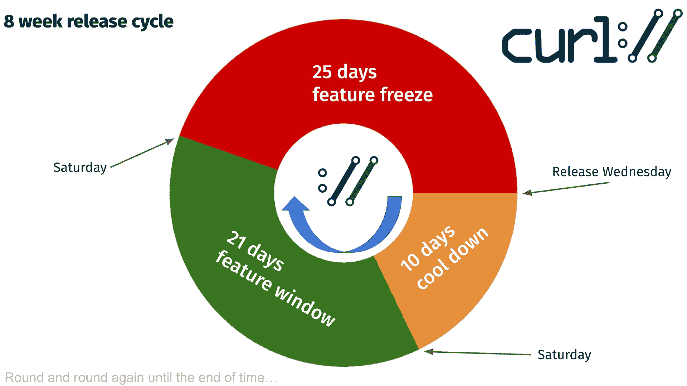

# 发布

在 curl 项目中，一个发布意味着将代码库 master 分支中的所有源代码打包，对包进行签名，标记代码库中的该点，然后将它上传到网站供全世界下载。

这是一个适用于 curl 可以在其上运行的平台的单一源代码存档。这是 curl 和 libcurl 的唯一包。

我们从未从项目中发送任何 curl 或 libcurl 的二进制文件，只有一个例外：我们托管为 Windows 用户构建的官方 curl 二进制文件。所有其他与操作系统一起提供的或在其他下载网站上提供的打包二进制文件都是由项目外的志愿者完成的。

几年前，我们努力以八周为一个周期进行发布，除非出现一些真正严重和紧急的问题，否则我们会坚持这个计划。我们每周三发布，然后八周后的又一个周三再次发布，以此类推。不间断。

对于每个版本，我们都会在代码库中将源代码标记为 curl 版本号，并更新[变更日志](https://curl.se/changes.html)。

到 2024 年 1 月，我们已经发布了 253 个版本。整个发布历史和变更日志可在我们的[curl 发布日志](https://curl.se/docs/releases.html)中找到。

## 发布周期

curl 发布周期可视化

## 每日快照

每次对源代码的更改都会提交并推送到源代码库。这个库托管在 github.com 上，目前使用 git（但并非一直如此）。从库中构建 curl 时，需要生成和设置一些东西，有时这会给人们带来一些问题或摩擦。为了帮助解决这个问题，我们提供了每日快照。

每日快照每天生成（命名很聪明，对吧？）就像在那个点发布了一个版本一样。它生成一个包含所有源代码和通常作为发布一部分的所有文件的包，并将其放入包中，上传到[这个特殊位置](https://curl.se/snapshots/)，以便有兴趣的人获取最新的代码进行测试、实验或其他用途。

快照保留大约 20 天后将被删除。
