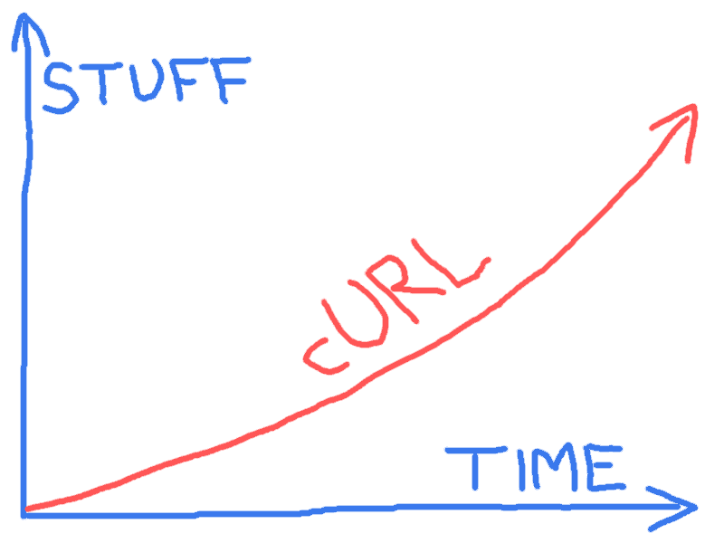

# 未来

curl 未来

在 curl 的未来发展中，看不到任何放缓的迹象，无论是已报告的 bug、开发速度，还是互联网协议的开发或更新。

我们期待着更多协议的支持，以及现有协议内更多功能的支持，还有更多更好的 API，以便 libcurl 允许用户进行更高效、更快的传输。

项目随意维护一个[待办事项](https://curl.se/docs/todo.html)文件，其中包含了一些我们未来可以工作的想法。它还保持一个[已知 bug](https://curl.se/docs/knownbugs.html)文档，列出了我们希望修复的已知问题。

存在一份[路线图](https://curl.se/dev/roadmap.html)文档，描述了一些短期计划，一些活跃的开发者认为他们会在接下来着手实施。当然，我们无法保证我们始终会遵循它。

我们高度依赖开发者加入并从事他们想要完成的工作，无论是 bug 修复还是新功能开发。
