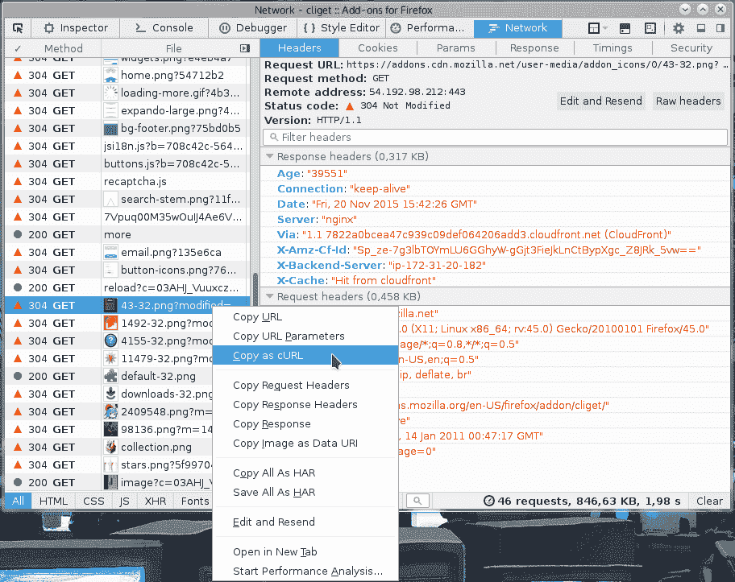
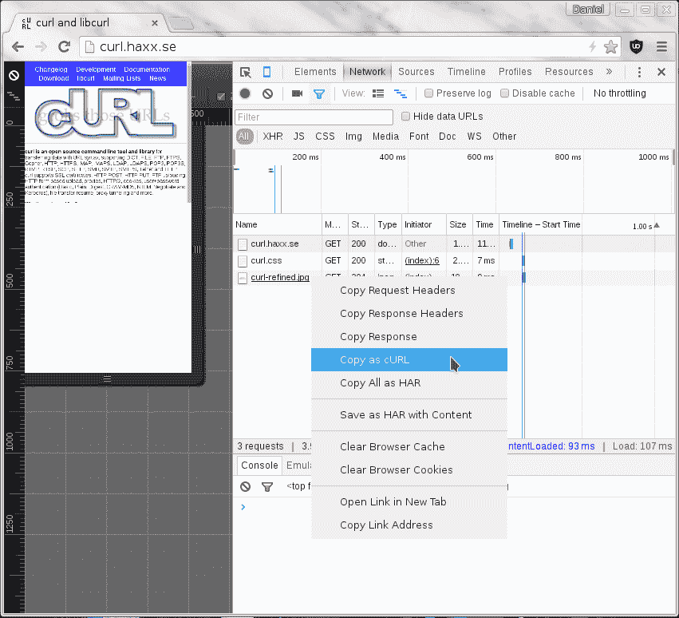
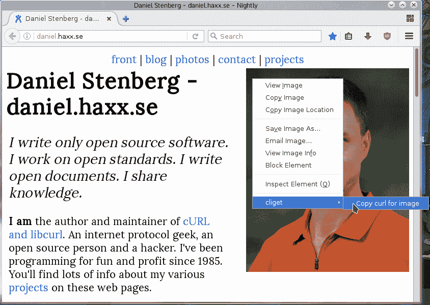

# Copy as curl

使用 curl 重新执行用户刚刚使用浏览器完成的操作是一个常见的请求和人们寻求帮助的领域。

如何获取一个 curl 命令行来获取资源，就像浏览器获取它那样，既简单又方便？Chrome、Firefox、Edge 和 Safari 都有这个功能。

## 从 Firefox

您可以使用 Firefox 的网络工具查看显示的网站。当您看到 HTTP 流量时，在“Web Developer->Network”工具中右键单击您想要重复的特定请求，然后在出现的菜单中选择“Copy as cURL”。如下面的截图所示。此操作将在您的剪贴板中生成一个 curl 命令行，然后您可以将它粘贴到您喜欢的 shell 窗口中。此功能在所有 Firefox 安装中默认可用。

使用 Firefox 的 copy as curl

## 从 Chrome 和 Edge

当您在 Chrome 或 Edge 中弹出 More tools->Developer mode 并选择网络标签页时，您可以看到用于获取网站资源的 HTTP 流量。在您感兴趣的特定资源行上，您用鼠标右键单击并选择“Copy as cURL”，它将在您的剪贴板中为您生成一个命令行。将此粘贴到 shell 中以获取一个执行传输的 curl 命令行。此功能在所有 Chrome 和 Chromium 安装中默认可用。*(注意：Windows 中的 Chromium 浏览器可能会由于 Chromium 中的一个 *[bug*](https://bugs.chromium.org/p/chromium/issues/detail?id=1242803) *而产生一个不正确的命令行，该命令行由于引号错误而出现错误)。*

使用 Chrome 的 copy as curl

## 从 Safari

在 Safari 中，直到您进入 **preferences->Advanced** 并启用它之前，“开发”菜单是不可见的。但一旦您这样做了，您可以在开发菜单中选择 **Show web inspector**，然后您可以看到一个弹出的新控制台，它与 Firefox 和 Chrome 的开发工具类似。

选择网络标签页，重新加载网页，然后您可以对您想要使用 curl 获取的特定资源右键单击，就像您在 Safari 中那样。

使用 Safari 的 copy as curl

## 在 Firefox 中，不使用开发者工具

如果您经常需要这样做，您可能会觉得使用开发者工具有点不方便，而且弹出以复制命令行有些繁琐。那么 [cliget](https://addons.mozilla.org/en-US/firefox/addon/cliget/) 就是您完美的插件，因为它在右键菜单中提供了一个新选项，这样您可以快速生成命令行，就像以下示例中我在 Firefox 中右键单击一个图片时那样：

使用 Firefox 的 cliget

## 不完美

这些方法都为你提供了一个命令行来重现它们的 HTTP 传输。它们通常不是解决你问题的完美方案。为什么？好吧，主要是因为这些工具是编写来重新运行你复制的**完全相同**的请求，而你通常想要重新运行相同的逻辑，但不需要发送完全相同的 cookie 和文件内容等。

这些工具为你提供了带有静态和固定 cookie 内容的命令行，用于发送请求，因为这就是浏览器请求中发送的 cookie 内容。你很可能会想要重写命令行，以便动态适应服务器在之前的响应中告诉你的 cookie 中的任何内容。等等。

复制为卷曲功能在处理 `-F` 参数时也常常臭名昭著，它们通常会提供手工编写的 `--data-binary` 解决方案，包括 MIME 分隔符字符串等。
