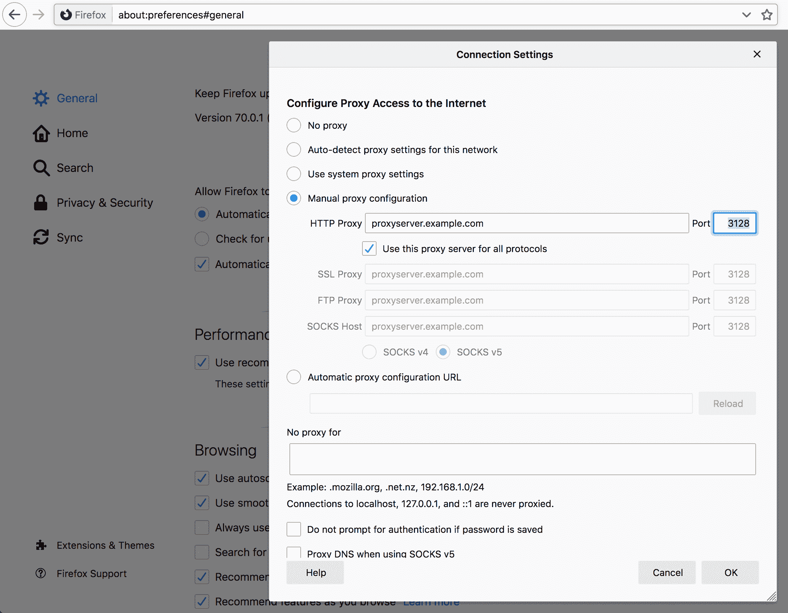

# 发现你的代理

一些网络配置了必须使用代理才能访问互联网或你可能感兴趣的特殊网络。代理的使用是由运行你的网络的人员和管理员出于政策或技术原因引入的。

在网络空间中，有一些用于自动检测代理及其连接方法的方法，但没有任何一种方法是真正通用的，curl 也不支持任何这些方法。此外，当你通过代理与外界通信时，通常意味着你必须对代理有很大的信任，因为它能够看到并修改你通过它发送或接收的所有非安全网络流量。这种信任并不容易自动假设。

如果你检查浏览器的网络设置，有时在高级设置标签页下，你可以了解你的浏览器配置了哪些代理。当你使用 curl 时，很可能你应该使用相同的代理或代理组。

例如，你可以在“首选项”>“常规”>“网络设置”中找到 Firefox 浏览器的代理设置，如下所示：

Firefox 的代理设置
