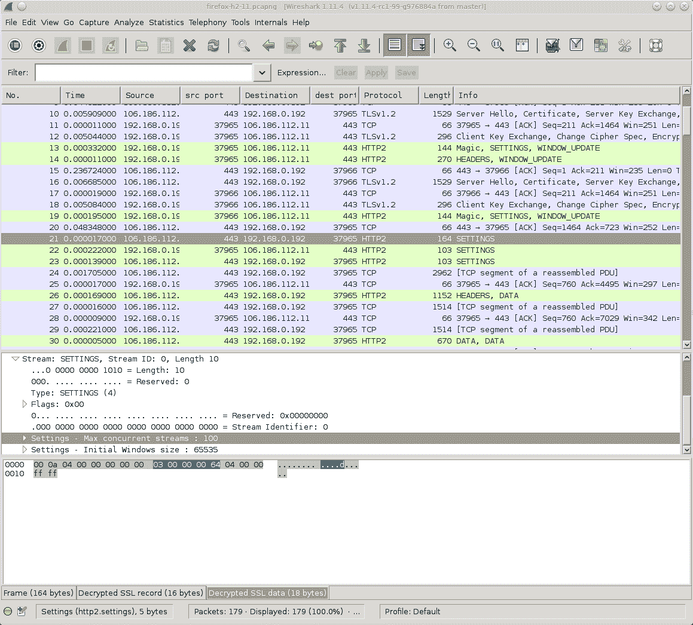
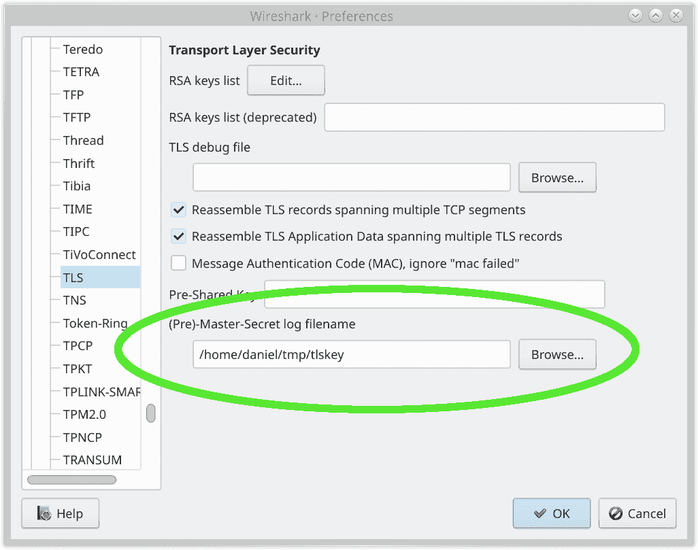

# SSLKEYLOGFILE

使用 Wireshark 查看网络流量

从很久以前开始，备受尊敬的网络分析工具 Wireshark（如上图所示）就提供了一种在 Firefox 和 Chrome 发送和接收 TLS 流量时解密和检查 TLS 流量的方法。

这同样适用于 curl。

您可以通过让浏览器或 curl 告诉 Wireshark 加密秘密，以便它可以解密它们来完成此操作：

1.  在启动浏览器或 curl 之前，将环境变量 `SSLKEYLOGFILE` 设置为您选择的文件名

1.  在 Wireshark 的 Master-secret 字段中设置相同的文件名路径。转到首选项->协议->TLS 并编辑如下截图所示的路径。

设置 ssl 密钥文件名

在完成这个简单的操作后，您现在可以在 Wireshark 中检查 curl 或您浏览器的 HTTPS 流量。非常方便且酷炫。

只需记住，如果您记录 TLS 流量并希望稍后分析，您还需要保存包含秘密的文件，这样您才能在稍后解密该流量捕获。

## 使用 libcurl 的应用程序也是如此

`SSLKEYLOGFILE` 的支持由 libcurl 本身提供——这使得您能够跟踪和检查任何使用 libcurl 构建的应用的 TLS 网络数据，而不仅仅是 curl 命令行工具。

## 限制

`SSLKEYLOGFILE` 的支持要求 curl 是使用支持此功能的 TLS 后端构建的。支持 SSLKEYLOGFILE 的后端有：OpenSSL、libressl、BoringSSL、GnuTLS 和 wolfSSL。

如果 curl 是构建为使用另一个后端，则您不能以这种方式记录您的 curl TLS 流量。
