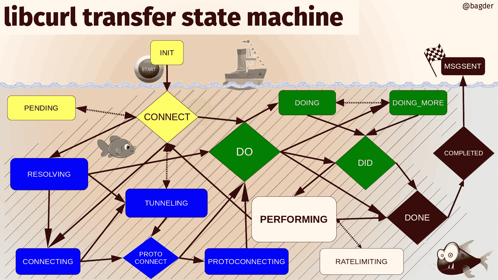

# 状态机

为了在整个过程中实现非阻塞行为，curl 源中充满了状态机。处理尽可能多的数据，并根据可用情况驱动状态机到达可以继续的位置，允许函数在之后有更多数据到达时从该点继续执行。

对于给定的传输，存在许多不同级别的状态，并且每个特定协议的代码可能都有自己的状态机集合。

## mstate

其中一个主要状态是 easy 句柄持有的主要传输“模式”，这表示当前传输是否正在解析、等待解析、连接、等待连接、发送请求、进行传输等（参见`lib/multihandle.h`中的`CURLMstate`枚举）。使用 libcurl 完成的每个传输都有一个关联的 easy 句柄，每个 easy 句柄都会执行该状态机。

下面的图像显示了所有状态和可能的状态转换。详见以下解释。

libcurl 传输状态机

所有传输都从**初始化**状态开始，并以**发送消息**状态结束。

**黄色**：初始设置状态

**蓝色**：解析名称和设置连接

**绿色**：启动和设置传输

**白色**：传输过程

**红色**：传输后

所有位于条纹区域内的状态都关联着一个连接。
