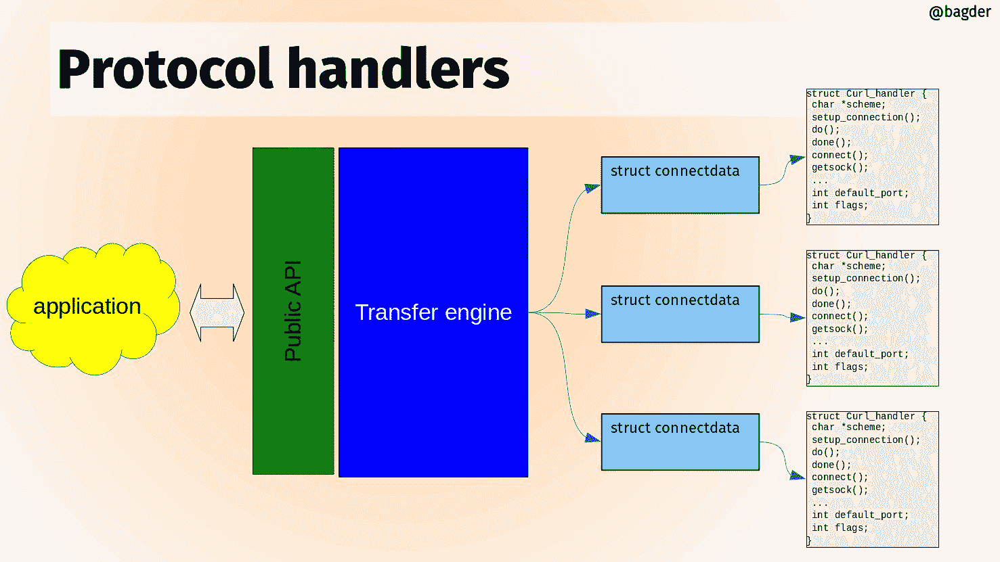

# 协议处理程序

libcurl 是一个多协议传输库。代码的核心是一组通用的函数，用于一般的传输，并且对于所有协议来说大多数情况下工作方式相同。上面描述的主要状态机就在那里，并且适用于所有协议——即使某些协议可能不会在所有传输中使用所有状态。

然而，curl 支持的每种不同协议都有其独特的特性和专长。为了避免代码中充斥着“如果协议是 XYZ，那么做……”这样的条件语句，我们引入了`Curl_handler`的概念。每个支持的协议在`lib/url.c`中定义了一个这样的处理程序，那里有一个指向这些处理程序的指针数组`protocols[]`。

当一个传输即将进行时，libcurl 会解析它即将操作的 URL，并确定要使用哪种协议。通常，这可以通过查看 URL 的方案部分来完成。对于`https://example.com`，这是`https`，对于`imaps://example.com`，它是`imaps`。使用提供的方案，libcurl 将`conn->handler`指针设置为处理该 URL 的协议的处理程序结构体。



libcurl 协议处理程序

处理程序结构体包含一组函数指针，可以是 NULL 或设置为指向特定于协议的函数，以执行该协议在传输中工作所需的事情。不是所有其他协议都需要的事情。处理程序结构体还设置了协议的名称，并使用位掩码描述其功能集。

libcurl 的传输是围绕一组不同的动作构建的，处理程序可以扩展每一个动作。以下是一些该结构体中的示例函数指针及其使用方式：

## 设置连接

如果一个连接不能用于传输，它需要设置一个连接到 URL 中给出的主机，并且当它这样做时，它也可以调用该协议处理程序的功能。如下所示：

```sh
if(conn->handler->setup_connection)
  result = conn->handler->setup_connection(data, conn);
```

## 连接

在连接建立之后，这个函数会被调用

```sh
if(conn->handler->connect_it)
  result = conn->handler->connect_it(data, &done);
```

## Do

*Do* 简单地是发出对 URL 标识的特定资源的请求的动作。所有协议都有一个 do 动作，因此必须提供这个函数：

```sh
result = conn->handler->do_it(data, &done);
```

## Done

当传输完成时，执行 *done* 动作：

```sh
result = conn->handler->done(data, status, premature);
```

## 断开连接

连接即将断开。

```sh
result = conn->handler->disconnect(data, conn, dead_connection);
```
