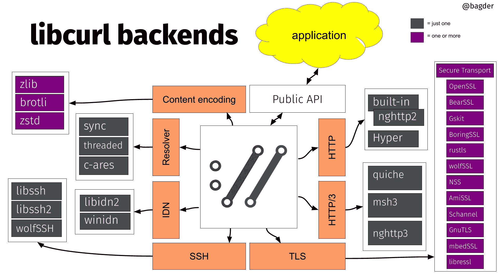

# 后端

curl 中的后端是一个**构建时可选的替代实现**。

当你构建 curl 时，你可以为几个不同的事情选择替代实现。相同功能集的不同提供者。当你构建 curl 时，你选择使用哪个后端或后端（复数）。

+   后端是可选的，也可以取消选择

+   通常与平台相关

+   功能可能不同

+   第三方许可证可能不同

+   成熟度可能不同

+   内部 API 永远不会对外暴露

## 不同的后端

在 libcurl 源代码中，存在内部 API 以提供功能。在这些不同的区域有多个不同的提供者：

1.  IDN

1.  名称解析

1.  TLS

1.  SSH

1.  HTTP/1 和 HTTP/2

1.  HTTP/3

1.  HTTP 内容编码

## 后端可视化

libcurl 后端

应用程序（在上方的黄色云中）通过公共 API 访问 libcurl。API 是固定和稳定的。

内部，libcurl 的核心使用内部 API 来完成它需要执行的不同任务。每个内部 API 都由替代实现提供动力，很多时候是由不同的第三方库提供动力。

上面的图像展示了不同第三方库为不同的内部 API 提供动力。紫色方框表示一个或多个，深灰色方框表示“这些中的一个”。
