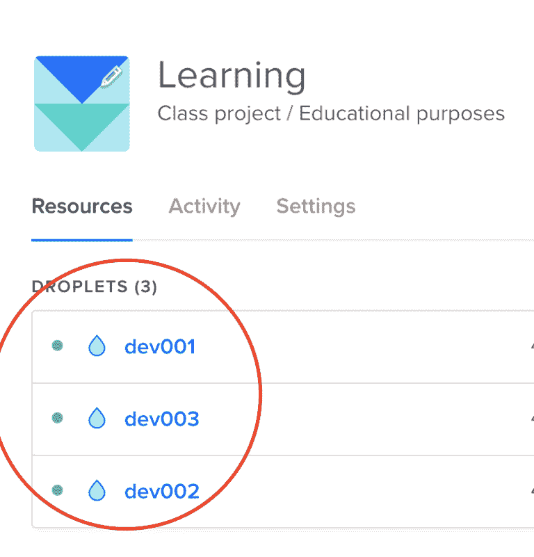
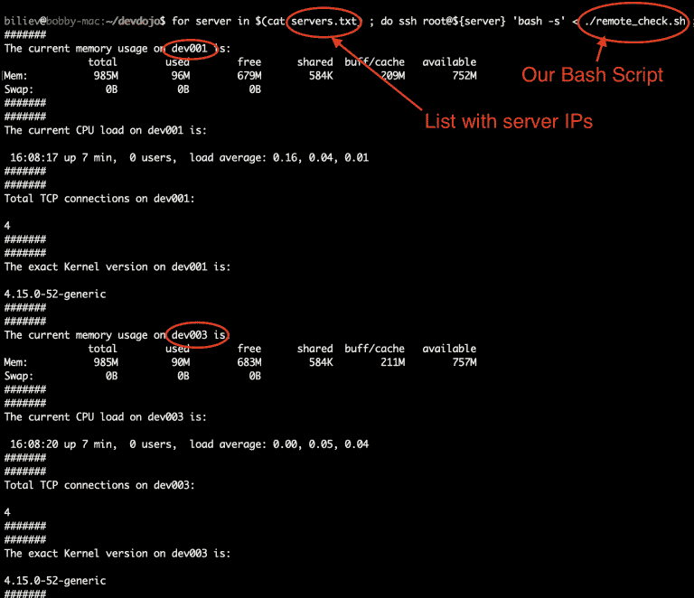

# 在多个远程服务器上执行 BASH 脚本

你可以在命令行中运行的任何命令都可以用在 bash 脚本中。脚本用于运行一系列命令。Bash 在 Linux 和 macOS 操作系统上是默认可用的。

让我们假设一个场景，你需要在一个多个远程服务器上执行 BASH 脚本，但你不想手动将脚本复制到每个服务器，然后再次登录到每个服务器单独执行脚本。

当然，你可以使用像 Ansible 这样的工具，但让我们学习如何使用 Bash 来完成这个任务！

## 前提条件

对于这个例子，我将使用 DigitalOcean 上部署的 3 个远程 Ubuntu 服务器。如果你还没有 Digital Ocean 账户，你可以通过此推荐链接注册 DigitalOcean 并获得 100 美元的免费信用额度：

[`m.do.co/c/2a9bba940f39`](https://m.do.co/c/2a9bba940f39)

一旦你的 Digital Ocean 账户准备就绪，继续部署 3 个 Droplet。

我已经创建了 3 个 Ubuntu 服务器：



我会把那些服务器的 IP 地址放入一个 `servers.txt` 文件中，我将使用这个文件来通过我们的 Bash 脚本进行循环。

如果你刚接触 DigitalOcean，可以在此处遵循创建 Droplet 的步骤：

+   [如何在 DigitalOcean 控制面板中创建 Droplet](https://www.digitalocean.com/docs/droplets/how-to/create/)

你也可以遵循此视频中的步骤来执行你的初始服务器设置：

+   [如何使用 Ubuntu 进行初始服务器设置](https://youtu.be/7NL2_4HIgKU)

或者，更好的是，你可以遵循此文章中的说明，了解如何使用 Bash 自动化你的初始服务器设置：

[使用 Bash 在 Ubuntu 18.04 上自动化初始服务器设置](https://www.digitalocean.com/community/tutorials/automating-initial-server-setup-with-ubuntu-18-04)

在放置了 3 个新服务器后，我们可以继续使用单个命令在所有服务器上运行我们的 Bash 脚本！

## BASH 脚本

我将重复使用上一章中的演示脚本，并进行一些小的修改。它简单地执行一些检查，如当前内存使用情况、当前 CPU 使用情况、TCP 连接数和内核版本。

```sh
      #!/bin/bash ### BASH script that checks the following:#   - Memory usage#   - CPU load#   - Number of TCP connections#   - Kernel version##### Memory check##
server_name=$(hostname)

function memory_check() {
    echo "#######"
	echo "The current memory usage on ${server_name} is: "
	free -h
	echo "#######"
}

function cpu_check() {
    echo "#######"
	echo "The current CPU load on ${server_name} is: "
    echo ""
	uptime
    echo "#######"
}

function tcp_check() {
    echo "#######"
	echo "Total TCP connections on ${server_name}: "
    echo ""
	cat  /proc/net/tcp | wc -l
    echo "#######"
}

function kernel_check() {
    echo "#######"
	echo "The exact Kernel version on ${server_name} is: "
	echo ""
	uname -r
    echo "#######"
}

function all_checks() {
	memory_check
	cpu_check
	tcp_check
	kernel_check
}

all_checks 

```

复制下面的代码并将其添加到名为 `remote_check.sh` 的文件中。你也可以从[这里](https://devdojo.com/bobbyiliev/executing-bash-script-on-multiple-remote-server)获取脚本。

## 在所有服务器上运行脚本

现在我们有了脚本和服务器，并且已经将那些服务器添加到我们的 servers.txt 文件中，我们可以运行以下命令来遍历所有服务器并远程执行脚本，而无需将脚本复制到每个服务器并单独连接到每个服务器。

```sh
      for server in $(cat servers.txt) ; do ssh your_user@${server} 'bash -s' < ./remote_check.sh ; done 

```

这个 for 循环的作用是，它会遍历 servers.txt 文件中的每个服务器，然后对列表中的每个项目运行以下命令：

```sh
      ssh your_user@the_server_ip 'bash -s' < ./remote_check.sh 

```

你会得到以下输出：



## 结论

这是一个非常简单的例子，说明如何在多个服务器上执行一个简单的脚本，而无需将脚本复制到每个服务器，也无需单独访问服务器。

当然，你也可以运行一个更复杂的脚本，并在更多的服务器上运行。

如果你对自动化感兴趣，我建议你查看 DigitalOcean 网站上的 Ansible 资源页面：

[Ansible 资源](https://www.digitalocean.com/community/tags/ansible)

> **注意：** 这篇内容最初发布在 [DevDojo](https://devdojo.com/bobbyiliev/bash-script-to-summarize-your-nginx-and-apache-access-logs)
