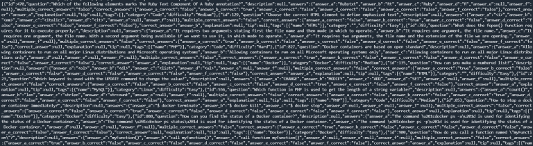
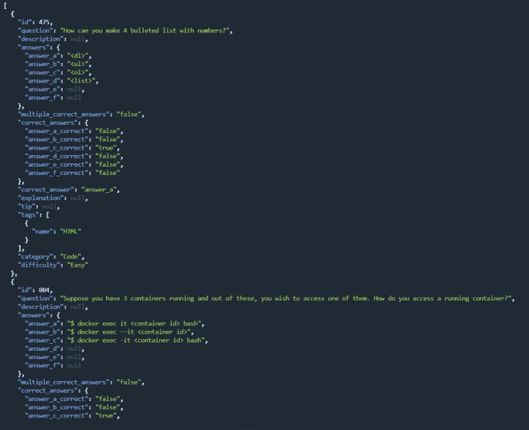
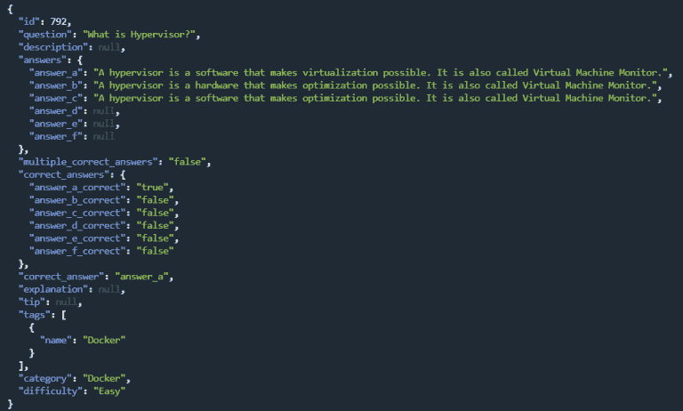
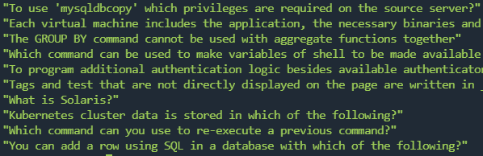
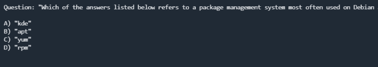

# 使用 jq 在 BASH 中处理 JSON

`jq`命令行工具是一个轻量级且灵活的命令行**JSON**处理器。它在解析 BASH 中的 JSON 输出时非常出色。

`jq`的一个优点是它是用可移植的 C 语言编写的，并且没有运行时依赖。你只需要下载一个二进制文件或使用包管理器如 apt，通过一条命令安装它。

## 编写脚本规划

在本教程的演示中，我将使用一个外部 REST API，它返回一个简单的 JSON 输出，称为[QuizAPI](https://quizapi.io/)：

> [`quizapi.io/`](https://quizapi.io/)

如果你想要跟随，请确保在这里获取一个免费的 API 密钥：

> [`quizapi.io/clientarea/settings/token`](https://quizapi.io/clientarea/settings/token)

QuizAPI 对开发者免费。

## 安装 jq

在你的系统上安装`jq`有许多方法。其中最直接的方法之一是使用基于你的操作系统的包管理器。

这里是一个根据你的操作系统需要使用的命令列表：

+   在 Ubuntu/Debian 上安装 jq：

```sh
      sudo apt-get install jq 

```

+   在 Fedora 上安装 jq：

```sh
      sudo dnf install jq 

```

+   在 openSUSE 上安装 jq：

```sh
      sudo zypper install jq 

```

+   在 Arch 上安装 jq：

```sh
      sudo pacman -S jq 

```

+   使用 Homebrew 在 Mac 上安装：

```sh
      brew install jq 

```

+   使用 MacPort 在 Mac 上安装：

```sh
      port install jq 

```

如果你使用的是其他操作系统，我建议查看这里的官方文档以获取更多信息：

> [`jqlang.org/download/`](https://jqlang.org/download/)

一旦安装了 jq，你可以通过运行此命令来检查你的当前版本：

```sh
      jq --version 

```

## 使用 jq 解析 JSON

一旦安装了`jq`和 QuizAPI API 密钥，你就可以直接在终端中解析 QuizAPI 的 JSON 输出了。

首先，创建一个变量来存储你的 API 密钥：

```sh
      API_KEY=YOUR_API_KEY_HERE 

```

为了从 QuizAPI 的一个端点获取一些输出，你可以使用 curl 命令：

```sh
      curl "https://quizapi.io/api/v1/questions?apiKey=${API_KEY}&limit=10" 

```

为了获得更具体的输出，你可以在 QuizAPI URL 生成器这里使用：

> [`quizapi.io/api-config`](https://quizapi.io/api-config)

在运行 curl 命令后，你会得到的输出看起来可能像这样：



这可能很难阅读，但多亏了 jq 命令行工具，我们只需要将 curl 命令通过 jq 管道传输，我们就会看到一个格式良好的 JSON 输出：

```sh
      curl "https://quizapi.io/api/v1/questions?apiKey=${API_KEY}&limit=10" | jq 

```

> 注意最后的`| jq`。

在这种情况下，你会得到的输出看起来可能像这样：



现在，这看起来要好看得多！jq 命令行工具为我们格式化了输出并添加了一些漂亮的颜色！

## 使用 jq 获取第一个元素

假设我们只想从 JSON 输出中获取第一个元素，为了做到这一点，我们必须指定我们想要看到的索引，使用以下语法：

```sh
      jq .[0] 

```

现在，如果我们再次运行 curl 命令并将输出通过 jq .[0]管道传输，就像这样：

```sh
      curl "https://quizapi.io/api/v1/questions?apiKey=${API_KEY}&limit=10" | jq.[0] 

```

你将只得到第一个元素，输出将看起来像这样：



## 仅获取特定键的值

有时候您可能只想获取特定键的值，比如说在我们的例子中，QuizAPI 返回了一个包含问题、答案、描述等信息的列表，但如果你只想获取问题而不想获取附加信息怎么办？

使用`jq`将会非常直接，您只需要在`jq`命令后添加键，所以它看起来会是这样：

```sh
      jq .[].question 

```

我们必须添加`.[]`，因为 QuizAPI 返回的是一个数组，通过指定`.[]`，我们告诉 jq 我们想要获取数组中所有元素的`.question`值。

您将得到的输出将看起来像这样：



如您所见，我们现在只获取问题，而没有其他值。

## 在 BASH 脚本中使用 jq

让我们创建一个小 bash 脚本，它应该输出以下信息：

+   仅从输出中获取第一个问题

+   获取该问题的所有答案

+   将答案分配给变量

+   打印问题和答案

+   为了做到这一点，我已经编写了以下脚本：

> **注意：**请确保将 API_KEY 部分替换为您的实际 QuizAPI 密钥：

```sh
      #!/bin/bash ### Make an API call to QuizAPI and store the output in a variable##
output=$(curl 'https://quizapi.io/api/v1/questions?apiKey=API_KEY&limit=10' 2>/dev/null)

##
# Get only the first question
##
output=$(echo $output | jq .[0])

##
# Get the question
##
question=$(echo $output | jq .question)

##
# Get the answers
##

answer_a=$(echo $output | jq .answers.answer_a)
answer_b=$(echo $output | jq .answers.answer_b)
answer_c=$(echo $output | jq .answers.answer_c)
answer_d=$(echo $output | jq .answers.answer_d)

##
# Output the question
##

echo "
Question: ${question}

A) ${answer_a}
B) ${answer_b}
C) ${answer_c}
D) ${answer_d}

" 

```

如果您运行脚本，您将得到以下输出：



我们甚至可以更进一步，使其具有交互性，这样我们就可以直接在我们的终端中选择答案。

已经有一个 bash 脚本通过使用 QuizAPI 和`jq`来完成这个任务：

您可以在此查看该脚本：

+   [`github.com/QuizApi/QuizAPI-BASH/blob/master/quiz.sh`](https://github.com/QuizApi/QuizAPI-BASH/blob/master/quiz.sh)

## 结论

`jq`命令行工具是一个令人惊叹的工具，它赋予您在 BASH 终端中直接处理 JSON 的能力。

这样您就可以轻松地使用 BASH 与各种不同的 REST API 进行交互。

更多信息，您可以查看以下官方文档：

+   [`stedolan.github.io/jq/manual/`](https://stedolan.github.io/jq/manual/)

关于**QuizAPI**的更多信息，您可以查看以下官方文档：

+   [`quizapi.io/docs/1.0/overview`](https://quizapi.io/docs/1.0/overview)

> **注意：**此内容最初发布在[DevDojo.com](https://devdojo.com/bobbyiliev/how-to-work-with-json-in-bash-using-jq)。
