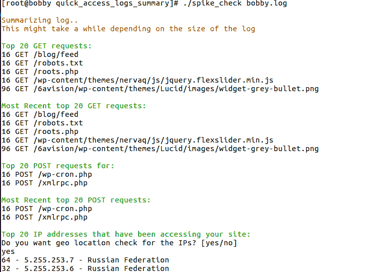

# BASH 脚本解析器以总结你的 NGINX 和 Apache 访问日志

如果我注意到我的某些 Linux 服务器上的 CPU 使用率很高，我通常会做的第一件事是使用 top 或 htop 检查进程列表，如果我发现有很多 Apache 或 Nginx 进程，我会快速检查我的访问日志，以确定是什么导致了或正在导致我的服务器 CPU 峰值，或者找出是否有任何恶意活动正在进行。

有时候阅读日志可能会相当令人畏惧，因为日志可能很大，手动查看可能需要花费大量时间。此外，原始日志格式可能对经验不足的人来说很令人困惑。

就像上一章一样，这一章将会是一个挑战！你需要编写一个简短的 bash 脚本，它会为你总结整个访问日志，而不需要安装任何额外的软件。

# 脚本要求

这个 BASH 脚本需要解析和总结你的访问日志，并提供非常有用的信息，例如：

+   最常请求的 20 个页面（POST 请求）

+   最常请求的 20 个页面

+   前 20 个 IP 地址及其地理位置

## 示例脚本

我已经准备了一个演示脚本，你可以将其作为参考。但我鼓励你先尝试自己编写脚本，然后再看看我的脚本！

为了下载脚本，你可以使用以下命令克隆存储库：

```sh
      git clone https://github.com/bobbyiliev/quick_access_logs_summary.git 

```

或者运行以下命令，它将在你的当前目录下下载脚本：

```sh
      wget https://raw.githubusercontent.com/bobbyiliev/quick_access_logs_summary/master/spike_check 

```

该脚本不会对你的系统进行任何更改，它只读取你的访问日志内容，并为你总结，然而，一旦你下载了文件，请确保自己审查内容。

## 运行脚本

下载脚本后，你需要做的就是让它可执行并运行它。

要做到这一点，请运行以下命令使脚本可执行：

```sh
      chmod +x spike_check 

```

然后运行脚本：

```sh
      ./spike_check /path/to/your/access_log 

```

确保将文件路径更改为实际的访问日志路径。例如，如果你在 Ubuntu 服务器上使用 Apache，确切的命令将如下所示：

```sh
      ./spike_check /var/log/apache2/access.log 

```

如果你使用 Nginx，确切的命令几乎相同，但需要将路径更改为 Nginx 访问日志的路径：

```sh
      ./spike_check /var/log/nginx/access.log 

```

## 理解输出

一旦运行脚本，它可能需要一段时间，具体取决于日志的大小。

你会看到的输出应该看起来像这样：



实际上，我们可以告诉你的情况是，我们已经收到了 16 次对 xmlrpc.php 文件的 POST 请求，该文件通常被攻击者用来尝试通过各种用户名和密码组合来利用 WordPress 网站。

在这个特定情况下，这并不是一次巨大的暴力攻击，但它给我们提供了早期的迹象，我们可以采取措施防止未来更大的攻击。

我们还可以看到有几个俄罗斯 IP 地址访问了我们的网站，所以如果你不期望有任何来自俄罗斯的流量，你可能也想阻止这些 IP 地址。

## 结论

这是一个简单的 BASH 脚本示例，它允许你快速总结访问日志，并确定是否有任何恶意行为正在进行。

当然，你也许还想手动检查日志，但用 Bash 自动化这个任务是一个很好的挑战！

> **注意：** 此内容最初发布在[DevDojo](https://devdojo.com/bobbyiliev/bash-script-to-summarize-your-nginx-and-apache-access-logs)
