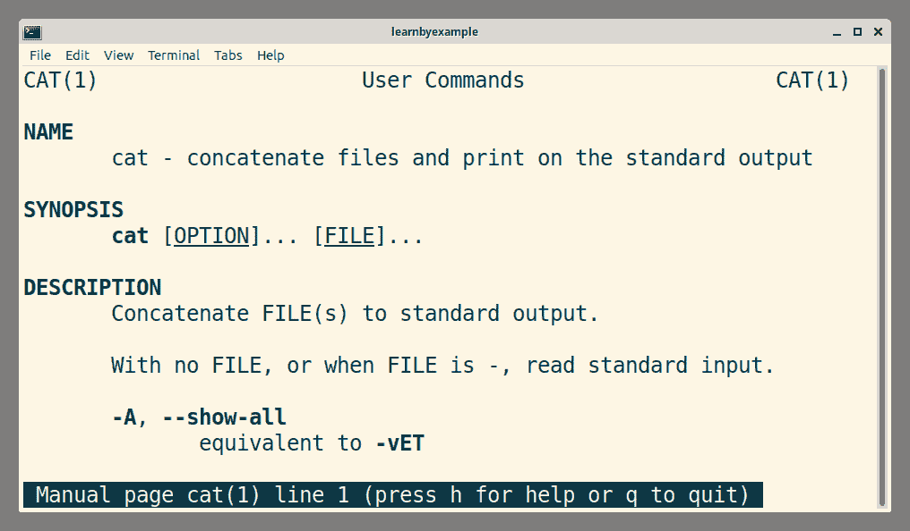
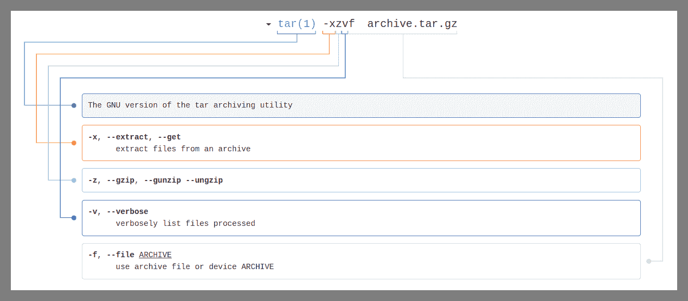

# 命令行概述

> 原文：[`learnbyexample.github.io/cli-computing/command-line-overview.html`](https://learnbyexample.github.io/cli-computing/command-line-overview.html)

本章将帮助你迈出命令行世界的第一步。除了你可以尝试的命令示例之外，你还将了解一些关于在文本环境中工作的基本知识。

对于新手来说，突然从使用文本命令与计算机交互的范式转变可能会感到不知所措，尤其是对于那些习惯于图形用户界面（GUI）的人来说。经过常规使用后，事情将开始看起来更有条理，你可能会意识到 GUI 不适合重复性任务。随着持续使用，回忆各种命令将变得更加容易。命令行历史、别名、自动补全和快捷键等功能也会有所帮助。

如果你使用过科学计算器，你会知道它很方便，因为许多功能都挤在一个小屏幕和许多多功能按钮中。命令行环境就像那样，但不仅限于计算数字。从管理文件到处理数据，从图像处理到视频工作，你可能会发现几乎任何可以想象的计算任务都有相应的工具。始终记住，命令行工具在图形工具之前就已经出现。丰富的历史证明了它在强大工具和广泛应用程序可用性方面的重量级地位。

## 你好，命令行

打开一个 [终端模拟器](https://en.wikipedia.org/wiki/Terminal_emulator) 并按照以下所示输入命令。在开始处跟随一个空格字符的 `$` 是我使用的简单命令提示符。它可能对您来说不同。实际要输入的命令是 `echo` 后跟一个空格，然后是参数 `'Hello Command Line'`，最后按 `Enter` 键执行它。你应该会得到作为命令输出的参数回显。

```sh
$ echo 'Hello Command Line'
Hello Command Line 
```

这里有一个简单的说明。这次，命令 `pwd` 是单独输入的（即没有参数）。你应该会得到 *你的* 当前位置作为输出。`/` 字符分隔位置的不同部分（更多细节将在后续章节中介绍）。

```sh
$ pwd
/home/learnbyexample 
```

接下来，输入 `exit` 命令以退出终端会话。

```sh
$ exit 
```

如果你完全不了解命令行世界，尝试多次执行上述步骤，直到你感到舒适地打开终端模拟器、执行命令并退出会话。关于命令结构、自定义命令提示符等更多细节将在稍后讨论。

## 文件系统

在 Linux 中，目录结构以 `/` 符号开始，被称为 **根** 目录。`man hier` 命令提供了文件系统层次结构的描述。以下是一些选定的示例：

+   `/` 这是根目录。这是整个树结构开始的地方。

+   `/bin` 此目录包含在单用户模式下需要以及用于启动或修复系统的可执行程序。

+   `/home` 在为用户设置家目录的机器上，这些目录通常位于此目录之下，直接或间接。此目录的结构取决于本地管理决策（可选）。

+   `/tmp` 此目录包含可能被无通知删除的临时文件，例如由常规作业或系统启动时删除。

+   `/usr` 此目录通常从单独的分区挂载。它应该只包含可共享的只读数据，这样它就可以被运行 Linux 的各种机器挂载。

+   `/usr/bin` 这是可执行程序的主要目录。大多数由普通用户执行的可执行程序，这些程序对于启动或修复系统不是必需的，并且不是本地安装的，应该放在这个目录中。

+   `/usr/share` 此目录包含具有特定应用程序数据的子目录，这些数据可以在同一操作系统的不同架构之间共享。

## 绝对和相对路径

引用 [wikipedia](https://en.wikipedia.org/wiki/Path_%28computing%29#Absolute_and_relative_paths):

> **绝对**或**完整**路径指向文件系统中相同的位置，无论当前工作目录如何。要做到这一点，它必须包含根目录。
> 
> 相比之下，一个**相对**路径从某个给定的工作目录开始，避免了提供完整绝对路径的需要。一个文件名可以被视为基于当前工作目录的相对路径。如果工作目录不是文件的父目录，如果通过文件名来引用文件，将会出现文件未找到错误。

例如，`/home/learnbyexample` 是一个绝对路径，而 `../design` 是一个相对路径。你将在接下来的章节中学习路径是如何用于执行任务的。

## Shell 和终端仿真器

这些术语通常可以互换使用，意思相同——一个提示，允许用户执行命令。然而，它们相当不同：

+   **Shell** 是一个命令行解释器。设定调用命令的语法规则，提供连接命令和重定向数据的操作符，具有循环、函数等脚本功能。

+   **终端**是一个文本输入/输出环境。负责字体大小、颜色等视觉细节。

一些流行的 Shell 有 `bash`、`zsh` 和 `fish`。本书将仅讨论 [Bash](https://en.wikipedia.org/wiki/Bash_(Unix_shell)) Shell。一些流行的终端仿真器有 [GNOME Terminal](https://en.wikipedia.org/wiki/GNOME_Terminal)、[konsole](https://en.wikipedia.org/wiki/Konsole)、[xterm](https://en.wikipedia.org/wiki/Xterm) 和 [alacritty](https://github.com/alacritty/alacritty)。

引用自 [wikipedia: Unix shell](https://en.wikipedia.org/wiki/Unix_shell):

> Unix shell 是一种命令行解释器或 shell，它为类 Unix 操作系统提供命令行用户界面。shell 既是交互式命令语言，也是脚本语言，操作系统通过 shell 脚本来控制系统的执行。
> 
> 用户通常通过终端模拟器与 Unix shell 交互；然而，对于服务器系统，通过串行硬件连接或 Secure Shell 进行直接操作是常见的。所有 Unix shell 都提供文件名通配符、管道、here 文档、命令替换、变量和控制结构，用于条件测试和迭代。

Shell 特性将在后面的章节中讨论。现在，打开终端并尝试以下命令：

```sh
$ cat /etc/shells
# /etc/shells: valid login shells
/bin/sh
/bin/dash
/bin/bash
/bin/rbash

$ echo "$SHELL"
/bin/bash 
```

在上述示例中，`cat` 命令用于显示文件内容，而 `echo` 命令用于显示变量的内容。`SHELL` 是一个环境变量，包含 shell 的完整路径。

>  以上命令的输出可能因你而异。如前所述，你的命令提示符可能与 `$` 不同。目前，你可以忽略它。或者，你可以输入 `PS1='$ '` 并按 `Enter` 键来设置当前会话的提示符。

**进一步阅读**

+   [unix.stackexchange：'终端'、'shell'、'tty' 和 '控制台' 之间的确切区别是什么？](https://unix.stackexchange.com/q/4126/109046)

+   [wikipedia：命令壳的比较](https://en.wikipedia.org/wiki/Comparison_of_command_shells)

+   [unix.stackexchange：登录 shell 和非登录 shell 的区别](https://unix.stackexchange.com/q/38175/109046)

+   [各种 shell 的功能和区别](http://www.faqs.org/faqs/unix-faq/shell/shell-differences/)

+   [不同 shell 的语法比较示例](https://hyperpolyglot.org/unix-shells)

+   [Shell，选择 shell 和更改默认 shell](https://wiki.ubuntu.com/ChangingShells)

## Unix 哲学

引自 [wikipedia：Unix 哲学](https://en.wikipedia.org/wiki/Unix_philosophy)：

> +   编写只做一件事并且做得好的程序。
> +   
> +   编写可以协同工作的程序。
> +   
> +   编写处理文本流的程序，因为这是一个通用的接口。

这些原则并不严格适用于所有命令行工具，但了解它们是好的。随着你对命令行工作的熟悉，你会更好地欣赏这些指南。

## 命令结构

不必完全理解本章中使用的命令，只需了解大致情况即可。这些示例旨在帮助你了解使用命令选项和参数的基本方法。

**无选项或参数的命令调用**：

+   `clear` 清除终端屏幕

+   `date` 显示当前日期和时间

**带选项（标志）的命令**：

+   `ls -l` 以长列表格式列出目录内容

+   `ls -la` 以长列表格式列出目录内容，包括隐藏文件

    +   这里将两个短选项 `-l` 和 `-a` 合并为 `-la`

+   `df -h` 以可读格式报告文件系统磁盘空间使用大小

+   `df --human-readable` 与 `df -h` 相同，但使用长选项

**带参数的命令**:

+   `mkdir project` 在当前工作目录中创建名为 `project` 的目录

+   `man sort` `sort` 命令的手册页面

+   `diff file1.txt file2.txt` 显示两个输入文件之间的差异

+   `wget https://s.ntnu.no/bashguide.pdf` 从互联网下载文件

    +   上例中传递给 `wget` 的链接是真实的，访问 [BashGuide](https://mywiki.wooledge.org/BashGuide) 获取详细信息

**带选项和参数的命令**:

+   `rm -r project` 递归地删除（删除）`project` 目录

+   `paste -sd, ip.txt` 使用 `,` 作为分隔符将输入文件的所有行序列化成一行

**单引号与双引号**:

+   **单引号**保留引号内每个字符的原始值

+   **双引号**保留引号内所有字符的原始值，除了 `$`、`` ` ``、`\` 以及当启用历史扩展时，`!`

```sh
# no character is special within single quotes
$ echo '$SHELL'
$SHELL

# $ is special within double quotes, used to interpolate a variable here
$ echo "Full path to the shell: $SHELL"
Full path to the shell: /bin/bash 
```

更多细节和其他类型的引号将在 Shell 特性章节中讨论。

## 命令网络

这是之前提到的 Unix 哲学中的一些命令协同工作的例子。shell 提供了多种方式来实现这一点。常用的功能之一是将一个命令的输出重定向为另一个命令的输入，保存到文件中等。

+   将输出传递给另一个命令

    +   `du -sh * | sort -h` 使用 `du` 计算文件和文件夹的大小，并以可读格式显示，然后使用专门用于此任务的工具进行排序

+   将输出保存到文件

    +   `grep 'pass' *.log > pass_list.txt` 将结果写入文件而不是在终端显示（如果文件已存在，则被覆盖）

    +   `grep 'error' *.log >> errors.txt` 将结果追加到指定的文件中（如果需要，则创建新文件）

+   将输出保存到变量

    +   `d=$(date)` 将命令输出保存到名为 `d` 的变量中

后续章节将讨论更多此类 shell 特性。

## 脚本编程

并非所有操作都可以通过终端中的一行命令完成。在这种情况下，您可以将指令保存到文本文件中，然后执行它们。打开您喜欢的文本编辑器，并写下以下三行：

```sh
$ cat cmds.sh
echo 'hello world'
echo 'how are you?'
seq 3 
```

作为使用文本编辑器的替代方案，您可以使用以下命令中的任何一个来创建此文件。

```sh
# assuming 'echo' supports '-e' option in your environment
$ echo -e "echo 'hello world'\necho 'how are you?'\nseq 3" > cmds.sh

# a more portable solution using the builtin 'printf' command
$ printf "echo 'hello world'\necho 'how are you?'\nseq 3\n" > cmds.sh 
```

脚本文件命名为 `cmds.sh`，并在三行中包含三个命令。执行此文件内容的一种方法是通过使用 `source` 命令：

```sh
$ source cmds.sh
hello world
how are you?
1
2
3 
```

>  你的 Linux 发行版可能有一个易于使用的图形文本编辑器，例如 `GNOME 文本编辑器` 和 `mousepad`。有关可选择的编辑器列表，请参阅 [wiki.archlinux: 文本编辑器](https://wiki.archlinux.org/title/List_of_applications/Documents#Text_editors)。
> 
>  《Shell 脚本编程》章节将更详细地讨论脚本。

## 命令帮助

大多数个人使用的发行版都自带了命令的文档安装。学习如何在终端使用手册很方便，并且有方法获取特定信息。

### man

`man` 命令是用于在终端本身中查看手册的界面。它使用 `pager`（通常是 `less` 命令）来显示内容。你可以将这些命令分类为终端用户界面（TUI）应用程序。例如，输入 `man cat`，你应该会看到下面的截图所示的内容：



由于文档的行数较多，可能无法完全适应终端窗口，你将只能看到手册的部分内容。你有几个选项可以导航：

+   按 `↑` 和 `↓` 光标键可以向上和向下移动一行

    +   你也可以使用 `k` 和 `j` 键（与 Vim 文本编辑器中使用的键相同）

+   按 `f` 和 `b` 键可以向前和向后移动一屏内容

    +   按 `Space` 键也可以向前移动一屏

+   鼠标滚动可以上下移动几行

+   按 `g` 或 `Home` 键跳转到手册的开始

+   按 `G` 或 `End` 键跳转到手册的末尾

+   输入 `/pattern` 后按 `Enter` 键在正向方向搜索给定的模式

+   输入 `?pattern` 后按 `Enter` 键在反向方向搜索给定的模式

+   按 `n` 键跳转到下一个匹配项

+   按 `N` 键跳转到上一个匹配项

+   按 `q` 键退出

如上图所示，你可以使用 `h` 来获取 `less` 命令的帮助。以下是一些与文档相关的有用提示：

+   `man man` 提供关于 `man` 命令本身的信息

+   `man bash` 将为你提供 `bash` shell 的手册页

    +   由于内容非常长，我建议使用 [在线 GNU Bash 手册](https://www.gnu.org/software/bash/manual/)

+   `man find | gvim -` 在你喜欢的文本编辑器中打开手册页

+   `man -k printf` 在所有手册页的简短描述中搜索字符串 `printf`

    +   你也可以使用 `apropos` 命令代替 `man -k`

+   `wc --help` 许多命令支持 `--help` 选项，以提供简洁的详细信息，如选项和语法

    +   此外，这些详细信息也会在终端本身上显示，无需处理 `pager` 界面

>  参见 [unix.stackexchange：如何使用 man 页面来学习如何使用命令？](https://unix.stackexchange.com/q/193815/109046) 和 [unix.stackexchange：man 页面中的颜色](https://unix.stackexchange.com/q/119/109046)。
> 
>    Linux 手册页通常是完整文档的简短版本。你可以使用 `info` 命令查看 GNU 工具的完整文档。`info` 也是一个 TUI 应用程序，但与 `man` 命令相比，其键配置不同。如果你更喜欢在网页浏览器中阅读，请参阅 [GNU 手册在线](https://www.gnu.org/manual/manual.html)。你也可以下载为 PDF 等格式的离线版本。

### type

对于某些操作，shell 提供了自己的命令集，这些命令被称为内置命令。`type` 命令显示有关命令的信息，例如其路径、是否为内置命令、别名、函数等。

```sh
$ type cd
cd is a shell builtin
$ type sed
sed is /bin/sed
$ type type
type is a shell builtin

# multiple commands can be given as arguments
$ type pwd awk
pwd is a shell builtin
awk is /usr/bin/awk 
```

如将在 Shell 定制 章节中讨论的，你可以创建别名来定制命令调用。你可以使用 `type` 命令来揭示此类别名的本质。以下是一些基于我使用的别名的示例：

```sh
$ type p
p is aliased to 'pwd'

$ type ls
ls is aliased to 'ls --color=auto' 
```

`type` 命令以反引号开头和单引号结尾的格式来格式化命令输出。这不利于语法高亮，因此我在上面的说明中已将反引号更改为单引号。

>  参见 [unix.stackexchange：内置命令和非内置命令之间的区别是什么？](https://unix.stackexchange.com/q/11454/109046)

### help

`help` 命令为内置命令提供文档。与 `man` 命令不同，整个文本都显示为命令输出。以下是一个默认格式的帮助页面示例。如果你想以伪 man 页面格式显示帮助内容，可以添加 `-m` 选项。

```sh
$ help pwd
pwd: pwd [-LP]
    Print the name of the current working directory.

    Options:
      -L        print the value of $PWD if it names the current working directory
      -P        print the physical directory, without any symbolic links

    By default, 'pwd' behaves as if '-L' were specified.

    Exit Status:
    Returns 0 unless an invalid option is given or the current directory
    cannot be read. 
```

你可以使用 `-d` 选项来获取命令的简短描述：

```sh
$ help -d compgen
compgen - Display possible completions depending on the options. 
```

>  使用 `help help` 命令获取关于 `help` 命令的文档。如果你不带任何参数使用 `help`，它将显示所有内部定义的 shell 命令。

### whatis 和 whereis

这里有一些获取关于命令的特定信息的方法：

+   `whatis` 显示一行手册页描述

+   `whereis` 定位命令的二进制文件、源文件和手册页文件

```sh
$ whatis grep
grep (1)             - print lines that match patterns

$ whereis awk
awk: /usr/bin/awk /usr/lib/x86_64-linux-gnu/awk /usr/share/awk
/usr/share/man/man1/awk.1.gz 
```

### ch

[explainshell](https://explainshell.com/) 是一个网络应用程序，它显示与你在应用程序中输入的每个命令参数匹配的帮助文本。例如，以下是一个 [tar -xzvf archive.tar.gz](https://explainshell.com/explain?cmd=tar+-xzvf+archive.tar.gz) 的截图：



受此应用启发，我编写了一个 [Bash 脚本 ch](https://github.com/learnbyexample/command_help) 来从 `man` 和 `help` 页面中提取信息。以下是一些示例：

```sh
$ ch ls -vX
       ls - list directory contents

       -v     natural sort of (version) numbers within text

       -X     sort alphabetically by entry extension

$ ch type -a
    type - Display information about command type.

      -a        display all locations containing an executable named NAME;
                includes aliases, builtins, and functions, if and only if
                the '-p' option is not also used 
```

### 进一步阅读

+   [Linux man 页面](https://www.mankier.com/) — 提供在线 man 页面的几个网站之一

+   [ArchWiki](https://wiki.archlinux.org/title/Table_of_contents) — Arch Linux 和其他发行版的综合文档

+   [Debian 参考](https://www.debian.org/doc/manuals/debian-reference/) — 对 Debian 系统的广泛概述，通过 shell 命令示例涵盖了系统管理的许多方面

## 快捷键和自动补全

你可以使用几个快捷键在命令行中提高效率。这些将在 Shell 自定义 章节中讨论。以下是一些示例，以提供一个大致的概念：

+   `Ctrl+u` 删除光标左侧的所有内容

+   `Ctrl+k` 从当前字符删除到行尾

+   `Ctrl+c` 中断当前输入的命令

+   `Ctrl+l` 清除终端屏幕并将提示符移动到顶部，任何作为当前命令一部分输入的字符将被保留

+   使用 `↑` 和 `↓` 光标键导航历史记录中的先前使用的命令

    +   `Ctrl+p` 和 `Ctrl+n` 也可以用来代替箭头键

    +   你可以修改历史记录中的这些行之前的命令

制表键可以帮助你根据上下文自动补全命令、别名、文件名等。如果只有一个可能的补全，它将在单次制表键按下时完成。否则，你可以按两次制表键来获取可能的匹配列表（如果有）。以下是一个在多个阶段使用多次制表键完成文件路径的示例。这不仅节省了时间，还帮助你避免输入错误，因为你同时正在验证路径。

```sh
# pressing tab after typing '/e' will autocomplete to '/etc/'
$ ls /etc/

# pressing tab after 'di' will autocomplete to 'dict'
$ ls /etc/dict
# pressing tab twice will show all possible completions
$ ls /etc/dict
dictd/               dictionaries-common/ 

# type 'i' and press tab to get 'dictionaries-common'
$ ls /etc/dictionaries-common/

# type 'w' and press tab to get 'words'
$ ls /etc/dictionaries-common/words 
```

上面的例子中，按下制表键的字符是为了说明目的而精心挑选的。如果你尝试在每个字符后按下制表键，步骤数量会增加。随着经验的积累，使用制表键进行自动补全将成为你命令行使用中自然的一部分。

>  你可以设置一个选项，将单次和双次制表键的功能合并为单次制表键。这将在 Shell 自定义 章节中讨论。

## 实际应用案例

如果命令行环境只有文件管理功能，我仍然会使用它。鉴于有各种各样的应用程序可用，我无法想象回到为每个用例使用不同的 GUI 应用程序。我的主要工作是编写电子书、博客文章和录制视频。以下是我在 CLI 中使用的几个主要工具：

+   使用`head`、`tail`、`sort`、`grep`、`sed`、`awk`等命令进行文本处理（你将在后面的章节中了解这些命令）

+   [git](https://git-scm.com/) — 版本控制

+   [pandoc](https://github.com/jgm/pandoc/) — 从 Markdown 文件生成 PDF/EPUB 书籍版本

+   [mdBook](https://github.com/rust-lang/mdBook) — 从 Markdown 文件生成的书籍的网页版本

+   [zola](https://github.com/getzola/zola) — 静态网站生成器

+   [ImageMagick](https://imagemagick.org/index.php) — 进行图像处理，如调整大小、添加边框等

+   [oxipng](https://github.com/shssoichiro/oxipng)，[pngquant](https://pngquant.org/)和[svgcleaner](https://github.com/RazrFalcon/svgcleaner) — 优化图像

+   [auto-editor](https://github.com/WyattBlue/auto-editor) — 从视频录制中移除静音部分

+   [FFmpeg](https://github.com/FFmpeg/FFmpeg) — 视频处理，例如填充（`FFmpeg`也是`auto-editor`解决方案的主要部分）

其中一些工作流程需要额外的管理，为此我编写了 shell 函数或脚本。我确实也需要 GUI 工具，例如，网页浏览器、图片查看器、PDF/EPUB 查看器、[SimpleScreenRecorder](https://github.com/MaartenBaert/ssr)等等。其中一些也可以在终端内处理，但我更倾向于在这种情况下使用 GUI。我确实从终端启动了一些工具，主要是为了提供要打开的文件或 URL。

您可能会想知道命令行在处理图像和视频方面提供了什么优势？除了更快之外，自定义参数（如边框颜色、边框大小、质量百分比等）会自动保存为我创建的脚本的一部分。之后，我只需调用一次脚本，而不是等待 GUI 应用程序打开、导航到所需文件、应用自定义参数、在所有必要的处理完成后保存它们、关闭应用程序等等。此外，那个单一的脚本可以使用所需的所有工具，而使用 GUI，您将不得不在不同的应用程序中重复这些步骤。

## 练习

>   所有练习都汇总在[exercises.md](https://github.com/learnbyexample/cli-computing/blob/master/exercises/exercises.md)的一个地方。对于解决方案，请参阅[exercise-solutions.md](https://github.com/learnbyexample/cli-computing/blob/master/exercises/exercise-solutions.md)。

**1)** 默认情况下，在您的系统中`echo`是 shell 内建命令还是外部命令？您可以使用什么命令来得到这个问题的答案？

**2)** 下面命令的输出是什么？文档是否有助于理解结果？

```sh
$ echo apple     42 'banana     100' 
```

**3)** 阅读[bash 手册：波浪号扩展](https://www.gnu.org/software/bash/manual/html_node/Tilde-Expansion.html)。`~/projects`是相对路径还是绝对路径？参见[这个 unix.stackexchange 线程](https://unix.stackexchange.com/q/221970/109046)以获取答案。

**4)** 当 `less` 命令处于活动状态时，你会使用哪个键来获取帮助？

**5)** 在查看 `man` 页面时，如何将第 50 行移动到屏幕顶部（假设 `less` 命令是分页器）？

**6)** `Ctrl+k` 快捷键的作用是什么？

**7)** 简要解释以下 shell 操作符的作用：

*a)* `|`

*b)* `>`

*c)* `>>`

**8)** `whatis` 命令显示关于命令的一行描述。但它似乎对 `whatis type` 不起作用。你应该使用什么代替？

```sh
$ whatis cat
cat (1)              - concatenate files and print on the standard output

$ whatis type
type: nothing appropriate.

# ???
type - Display information about command type. 
```

**9)** `/tmp` 目录的作用是什么？

**10)** 分别给出绝对路径和相对路径的示例。

**11)** 你会在什么情况下使用 `man -k` 命令？

**12)** `man` 页面和 `info` 页面之间有区别吗？
