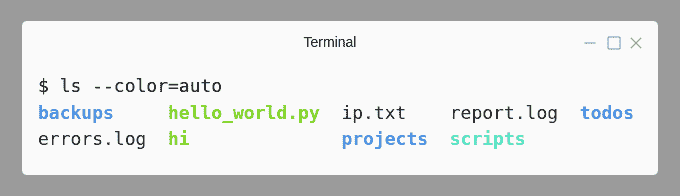
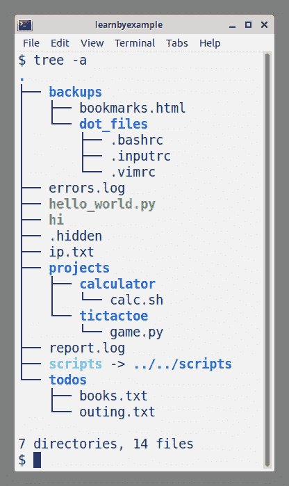

# 管理文件和目录

> 原文：[`learnbyexample.github.io/cli-computing/managing-files-directories.html`](https://learnbyexample.github.io/cli-computing/managing-files-directories.html)

本章介绍了通常由图形用户界面（GUI）中的文件管理器（也称为文件资源管理器）处理的命令。例如，查看目录内容、导航到其他目录、剪切/复制/粘贴文件、重命名文件等。一些用于这些目的的命令是由 shell 本身提供的。

作为一种良好的实践，养成习惯，查看你所遇到命令的文档。习惯于从命令行查找文档，当你遇到困难时将会非常有用。你还可以学习和尝试尚未使用的选项。

>  [example_files](https://github.com/learnbyexample/cli-computing/tree/master/example_files) 目录包含本章中使用的脚本。请参阅 设置 部分，了解创建工作环境的说明。

## 内置和外部命令

来自 [bash 手册：什么是 shell？](https://www.gnu.org/software/bash/manual/bash.html#What-is-a-shell_003f)

> Shell 还提供了一组内置命令（内置命令），这些命令通过单独的实用程序无法实现或使用不便。例如，`cd`、`break`、`continue` 和 `exec` 不能在 shell 之外实现，因为它们直接操作 shell 本身。`history`、`getopts`、`kill` 或 `pwd` 等内置命令，以及其他一些命令，虽然可以在单独的实用程序中实现，但作为内置命令使用更为方便。

许多日常使用所需的命令都是外部命令，即不是 shell 的一部分。一些内置命令，例如 `pwd`，也可能作为外部命令在你的系统中可用（这些命令在功能上也可能有所不同）。在这种情况下，默认将执行内置版本，你可以通过使用外部版本的路径来覆盖它。

你可以使用 `type` 命令来检查你正在使用的工具是内置命令还是外部命令。`type` 命令是一个 shell 内置命令，还提供了其他功能（稍后将会讨论）。你可以使用 `-a` 选项来获取给定命令的所有详细信息。

```sh
$ type -a cd
cd is a shell builtin

$ type -a ls
ls is /bin/ls

$ type -a pwd
pwd is a shell builtin
pwd is /bin/pwd 
```

>  要查找文档，请使用内置命令的 `help` 命令和外部命令的 `man` 命令（或者适用于完整文档的 `info` 命令）。使用 `help help` 和 `man man` 来查看它们的文档。
> 
>  只需输入 `help`，就会列出内置命令列表，以及命令的语法。

## pwd

`pwd`是 shell 内建命令，用于获取当前工作目录。这有助于你在文件系统中定位自己。打印的绝对路径通常很方便，可以复制粘贴到其他地方，例如脚本中。一些用户更喜欢他们的终端模拟器和/或 shell 提示符始终显示当前工作目录。

```sh
$ pwd
/home/learnbyexample 
```

## cd

`cd`是另一个 shell 内建命令。这有助于更改当前工作目录。以下是一个使用绝对路径更改当前工作目录的示例：

```sh
$ pwd
/home/learnbyexample

# specifying / at end of the path is optional
$ cd /etc
$ pwd
/etc 
```

你可以使用`-`作为参数返回到上一个工作目录。继续上一个示例：

```sh
$ cd -
/home/learnbyexample 
```

>  大多数命令会将以`-`开头的字符串视为命令选项。你可以使用`--`来告诉命令，所有随后的参数都不应被视为选项，即使它们以`-`开头。例如，如果你在当前工作目录中有一个名为`-oops`的文件夹，你可以使用`cd -- -oops`来切换到该目录。

相对路径是相对于当前工作目录的：

+   `.`代表当前目录

+   `..`代表一个目录层以上的目录（即父目录）

+   `../..`代表两个目录层以上的目录，依此类推

+   `cd ./-`将帮助你切换到当前位置名为`-`的目录

    +   你不能使用`cd -`，因为这会带你回到上一个工作目录

```sh
$ pwd
/home/learnbyexample

# go one hierarchy above
$ cd ..
$ pwd
/home

# change to 'learnbyexample' present in the current directory
# './' is optional in this case
$ cd ./learnbyexample
$ pwd
/home/learnbyexample

# go two hierarchies above
$ cd ../..
$ pwd
/ 
```

你可以使用`cd`或`cd ~`或`cd ~/`在任何文件系统位置切换到主目录。这由存储在`HOME` shell 变量中的值决定。参见[bash 手册：波浪号扩展](https://www.gnu.org/software/bash/manual/html_node/Tilde-Expansion.html)。

```sh
$ pwd
/
$ echo "$HOME"
/home/learnbyexample

$ cd
$ pwd
/home/learnbyexample 
```

## clear

你可以使用此命令清除终端屏幕。默认情况下，`clear`命令会将提示符移动到终端顶部，并尝试删除滚动缓冲区的内容。如果你想保留滚动缓冲区的内容，可以使用`-x`选项。

>  `Ctrl+l`快捷键也会将提示行移动到终端顶部。它将保留你在提示行上输入的任何文本，并且滚动缓冲区的内容不会被清除。

## ls

当你使用文件资源管理器图形用户界面应用程序时，你会自动看到目录内容。此类 GUI 应用程序通常具有显示文件大小、区分文件和文件夹等功能。`ls`是具有众多选项和与查看目录内容相关的功能的命令行工具。

>  如前所述，[example_files](https://github.com/learnbyexample/cli-computing/tree/master/example_files) 目录包含本章中使用的脚本。你可以使用 `ls.sh` 脚本来跟随本节中显示的示例。如果你尚未创建工作环境，请参阅 设置 部分。
> 
> ```sh
> # first, cd into the 'scripts' directory
> $ cd cli-computing/example_files/scripts
> 
> $ ls
> cp.sh  file.sh  globs.sh  ls.sh  rm.sh    tar.sh
> du.sh  find.sh  grep.sh   mv.sh  stat.sh  touch.sh
> 
> # 'ls.sh' script will create a directory named 'ls_examples'
> # and automatically change to that directory as well
> $ source ls.sh
> $ pwd
> /home/learnbyexample/cli-computing/example_files/scripts/ls_examples 
> ```

默认情况下，显示当前目录的内容。你可以传递一个或多个路径作为参数。以下是一些示例：

```sh
$ ls
backups     hello_world.py  ip.txt    report.log  todos
errors.log  hi              projects  scripts

# example with a single path argument
$ ls /sys
block  class  devices   fs          kernel  power
bus    dev    firmware  hypervisor  module

# multiple paths example
# directory listings will be preceded by their names
$ ls projects backups ip.txt
ip.txt

backups:
bookmarks.html  dot_files

projects:
calculator  tictactoe 
```

你可以使用 `-1` 选项（数字 `1`，不是字母 `l`，它执行其他操作）以单列形式列出内容：

```sh
$ ls -1 backups
bookmarks.html
dot_files 
```

`-F` 选项在每个文件名后附加一个字符，以指示文件类型（如果不是常规文件）：

+   `/` 目录

+   `*` 可执行文件

+   `@` 符号链接

+   `|` FIFO

+   `=` 套接字

+   `>` 门

```sh
$ ls -F
backups/    hello_world.py*  ip.txt     report.log  todos/
errors.log  hi*              projects/  scripts@ 
```

如果你只需要区分文件和目录，可以使用 `-p` 选项：

```sh
$ ls -p
backups/    hello_world.py  ip.txt     report.log  todos/
errors.log  hi              projects/  scripts 
```

你还可以使用 `--color` 选项来视觉上区分文件类型：



`-l` 选项使用长列表格式显示内容。你将获得诸如文件权限、所有者、大小、时间戳等详细信息。第一列的第一个字符区分文件类型，如 `d` 代表目录，`-` 代表常规文件，`l` 代表符号链接等。在每个目录列表下，第一行将显示条目的总大小（以 KB 计）。

```sh
$ ls -l hi
-rwxrwxr-x 1 learnbyexample learnbyexample 21 Dec  5  2019 hi

# you can add -G option to avoid the group column
$ ls -lG
total 7516
drwxrwxr-x 3 learnbyexample    4096 Feb  4 09:23 backups
-rw-rw-r-- 1 learnbyexample   12345 Jan  1 03:30 errors.log
-rwxrwxr-x 1 learnbyexample      42 Feb 29  2020 hello_world.py
-rwxrwxr-x 1 learnbyexample      21 Dec  5  2019 hi
-rw-rw-r-- 1 learnbyexample      10 Jul 21  2017 ip.txt
drwxrwxr-x 4 learnbyexample    4096 Mar  5 11:21 projects
-rw-rw-r-- 1 learnbyexample 7654321 Jan  1 01:01 report.log
lrwxrwxrwx 1 learnbyexample      13 May  7 15:17 scripts -> ../../scripts
drwxrwxr-x 2 learnbyexample    4096 Apr  6 13:19 todos 
```

>   注意，显示小时和分钟而不是年份的时间戳取决于与当前时间的相对差异。因此，例如，你可能会得到 `Feb 4 2022` 而不是 `Feb 4 09:23`。

使用 `-h` 选项以可读格式显示文件大小（默认为字节计数）。

```sh
$ ls -lG report.log
-rw-rw-r-- 1 learnbyexample 7654321 Jan  1 01:01 report.log

$ ls -lhG report.log
-rw-rw-r-- 1 learnbyexample 7.3M Jan  1 01:01 report.log 
```

如果你只需要分配的文件大小和名称，可以使用 `-s` 选项代替长列表：

```sh
$ ls -1sh errors.log report.log
 16K errors.log
7.4M report.log 
```

改变列表顺序的选项有几个：

+   `-t` 按时间戳排序

+   `-S` 按文件大小排序（不适用于目录）

+   `-v` 版本排序（适用于包含数字的文件名）

+   `-X` 按文件扩展名排序（即文件名中最后一个 `.` 之后的所有字符）

+   `-r` 逆转列表顺序

```sh
$ ls -lGhtr
total 7.4M
-rw-rw-r-- 1 learnbyexample   10 Jul 21  2017 ip.txt
-rwxrwxr-x 1 learnbyexample   21 Dec  5  2019 hi
-rwxrwxr-x 1 learnbyexample   42 Feb 29  2020 hello_world.py
-rw-rw-r-- 1 learnbyexample 7.3M Jan  1 01:01 report.log
-rw-rw-r-- 1 learnbyexample  13K Jan  1 03:30 errors.log
drwxrwxr-x 3 learnbyexample 4.0K Feb  4 09:23 backups
drwxrwxr-x 4 learnbyexample 4.0K Mar  5 11:21 projects
drwxrwxr-x 2 learnbyexample 4.0K Apr  6 13:19 todos
lrwxrwxrwx 1 learnbyexample   13 May  7 15:17 scripts -> ../../scripts 
```

以 `.` 开头的文件被视为隐藏文件，默认情况下不会显示。你可以使用 `-a` 选项来查看它们。`-A` 选项类似，但不会显示特殊的 `.` 和 `..` 条目。

```sh
# . and .. point to the current and parent directories respectively
$ ls -aF backups/dot_files/
./  ../  .bashrc  .inputrc  .vimrc

# -A will exclude the . and .. entries
$ ls -A backups/dot_files/
.bashrc  .inputrc  .vimrc 
```

`-R` 选项递归地列出子目录：

```sh
$ ls -ARF
.:
backups/    hello_world.py*  .hidden  projects/   scripts@
errors.log  hi*              ip.txt   report.log  todos/

./backups:
bookmarks.html  dot_files/

./backups/dot_files:
.bashrc  .inputrc  .vimrc

./projects:
calculator/  tictactoe/

./projects/calculator:
calc.sh

./projects/tictactoe:
game.py

./todos:
books.txt  outing.txt 
```

通常，你只想根据某些标准列出特定的文件或目录，例如文件扩展名。shell 提供了一种称为 **globs** 或 **通配符** 的匹配技术。以下是一些简单的示例（有关更多详细信息，请参阅 通配符 部分）。

`*` 是零个或多个字符的占位符：

```sh
# *.py *.log will give filenames ending with '.py' or '.log'
$ echo *.py *.log
hello_world.py errors.log report.log

# glob expansion can be prevented by using quotes
$ echo '*.py' *.log
*.py errors.log report.log

# long list only files ending with '.log'
$ ls -lG *.log
-rw-rw-r-- 1 learnbyexample   12345 Jan  1 03:30 errors.log
-rw-rw-r-- 1 learnbyexample 7654321 Jan  1 01:01 report.log 
```

`[]`帮助你指定一组要匹配一次的字符。例如，`[ad]`匹配`a`或`d`一次。`[c-i]`匹配从`c`到`i`的字符范围。

```sh
# entries starting with 'c' to 'i'
$ echo [c-i]*
errors.log hello_world.py hi ip.txt

$ ls -1sh [c-i]*
 16K errors.log
4.0K hello_world.py
4.0K hi
4.0K ip.txt 
```

>   如上述示例所示，通配符是由 shell 展开的。初学者常常将通配符与`ls`命令相关联，这就是为什么我在上述示例中故意也使用了`echo`。

你可以使用`-d`选项来**不**显示目录内容：

```sh
$ echo b*
backups
# since backups is a directory, ls will show its contents
$ ls b*
bookmarks.html  dot_files
# -d will show the directory entry instead of its contents
$ ls -d b*
backups

# a handy way to get only the directory entries
$ echo */
backups/ projects/ scripts/ todos/
$ ls -1d */
backups/
projects/
scripts/
todos/ 
```

>  我希望你已经明智地做了笔记，因为命令和功能实在太多了。例如，记下本节中讨论的所有选项。然后探索`ls --help`命令的输出。

**进一步阅读**

+   [mywiki.wooledge: avoid parsing output of ls](https://mywiki.wooledge.org/ParsingLs)

+   [unix.stackexchange: why not parse ls?](https://unix.stackexchange.com/q/128985/109046)

+   [unix.stackexchange: What are ./ and ../ directories?](https://unix.stackexchange.com/q/63081/109046)

## tree

`tree`命令以分层的方式递归显示目录内容。这是使用`tree -a`从上一节中看到的`ls_examples`示例目录的截图。`-a`选项用于显示隐藏文件。



>  你可能需要安装这个命令。`sudo apt install tree`可以用于在类似 Debian 的发行版上获取这个命令。

## mkdir

`mkdir`命令帮助你创建新的目录。你可以传递一个或多个路径以及你想要创建的目录名称。如果目录名称可能包含 shell 特殊字符，如空格、`*`等，请引用名称。

>  为本节创建一个练习目录：
> 
> ```sh
> $ mkdir practice_mkdir
> $ cd practice_mkdir 
> ```

这里有一个创建多个目录的示例：

```sh
$ mkdir reports 'low power adders'

$ ls -1
'low power adders'
reports 
```

`-p`选项将帮助你一次性创建多个目录层次结构：

```sh
# error because 'a' and 'a/b' paths do not exist yet
$ mkdir a/b/c
mkdir: cannot create directory ‘a/b/c’: No such file or directory

# -p is handy in such cases
$ mkdir -p a/b/c

$ tree
.
├── a
│   └── b
│       └── c
├── low power adders
└── reports

5 directories, 0 files 
```

`-p`选项还有另一个功能。它不会对试图创建已存在的目录进行抱怨。这在 shell 脚本中特别有用。

```sh
# 'reports' directory was already created in an earlier example
$ mkdir reports
mkdir: cannot create directory ‘reports’: File exists
# exit status will reflect that something went wrong
$ echo $?
1

# the -p option will override such errors
$ mkdir -p reports
$ echo $?
0 
```

如上述示例所示，你可以使用特殊变量`$?`检查最后执行的命令的退出状态。`0`表示一切顺利，更高的数字表示发生了某种类型的失败（你可以查阅命令的手册以获取详细信息）。

>   Linux 文件名可以使用除 `/` 和 ASCII NUL 字符之外的任何字符。如果参数包含空格、`*` 等字符，请引用它们以防止 shell 展开。Shell 将空格视为参数分隔符，`*` 是通配符，等等。作为良好习惯，除非有特定要求，否则请仅使用字母、数字和下划线作为文件名。有关更多信息，请参阅 [unix.stackexchange: Characters best avoided in filenames](https://unix.stackexchange.com/q/269093/109046)。
> 
>  如果你愿意，可以删除练习目录：
> 
> ```sh
> $ cd ..
> $ rm -r practice_mkdir 
> ```

## touch

你通常使用文本编辑器或通过将命令的输出重定向到文件来创建文件。在某些情况下，需要空文件进行测试或满足特定的构建过程。一个现实世界的用例是用于 [GitHub Pages](https://docs.github.com/en/pages/getting-started-with-github-pages/about-github-pages#static-site-generators) 的空 `.nojekyll` 文件。

`touch` 命令的主要功能是更改时间戳（将在 文件属性 章节中讨论）。如果文件不存在，`touch` 将使用当前时间戳创建一个空文件。如果需要，你也可以传递多个文件参数。

```sh
$ mkdir practice_touch
$ cd practice_touch

$ ls ip.txt
ls: cannot access 'ip.txt': No such file or directory

$ touch ip.txt

$ ls -s ip.txt
0 ip.txt 
```

>  你也可以使用 `> ip.txt` 创建一个空文件，但重定向操作符会覆盖已存在的文件。

## rm

`rm` 命令可以帮助你删除文件和目录。你可以传递一个或多个路径作为参数。

```sh
# change to the 'scripts' directory and source the 'rm.sh' script
$ source rm.sh
$ ls -F
empty_dir/  hello.py  loops.py  projects/  read_only.txt  reports/

# delete files ending with .py
$ rm *.py
$ ls -F
empty_dir/  projects/  read_only.txt  reports/ 
```

你需要添加 `-r` 选项来递归删除目录内容。你可以使用 `rm -d` 或 `rmdir` 命令来删除空目录。

```sh
# -r is needed to delete directory contents recursively
$ rm reports
rm: cannot remove 'reports': Is a directory
$ rm -r reports
$ ls -F
empty_dir/  projects/  read_only.txt

# delete empty directories, same as using the 'rmdir' command
$ rm -d empty_dir
# you'll get an error if the directory is not empty
$ rm -d projects
rm: cannot remove 'projects': Directory not empty 
```

错误如多余的空格、错误的通配符等可能会导致删除非预期删除的文件。除了备份和快照之外，你还可以采取一些缓解措施：

+   使用 `-i` 选项交互式删除每个文件

    +   你也可以使用 `-I` 选项来减少提示次数

+   使用 `echo` 作为干运行来查看通配符如何展开

+   使用垃圾命令（见下文链接）而不是 `rm`

使用 `y` 进行确认，使用 `-i` 或 `-I` 选项取消删除。以下是一个取消删除的例子：

```sh
$ rm -ri projects
rm: descend into directory 'projects'? n

$ ls -F
projects/  read_only.txt 
```

下面是一个在删除过程中每一步提供确认的例子：

```sh
$ tree projects
projects
├── calculator
│   └── calc.sh
└── tictactoe
    └── game.py

2 directories, 2 files

$ rm -ri projects
rm: descend into directory 'projects'? y
rm: descend into directory 'projects/tictactoe'? y
rm: remove regular empty file 'projects/tictactoe/game.py'? y
rm: remove directory 'projects/tictactoe'? y
rm: descend into directory 'projects/calculator'? y
rm: remove regular empty file 'projects/calculator/calc.sh'? y
rm: remove directory 'projects/calculator'? y
rm: remove directory 'projects'? y

$ ls -F
read_only.txt 
```

`-f` 选项可以用来忽略关于不存在文件的抱怨（与 `mkdir -p` 功能有些类似）。它还有助于删除写保护的文件（前提是你有适当的权限删除这些文件）。此选项对于递归删除包含写保护文件的目录特别有用，例如 `.git/objects`。

```sh
$ rm xyz.txt
rm: cannot remove 'xyz.txt': No such file or directory
$ echo $?
1
$ rm -f xyz.txt
$ echo $?
0

# example for removing write protected files
# you'll be asked for confirmation even without the -i/-I options
$ rm read_only.txt
rm: remove write-protected regular empty file 'read_only.txt'? n
# with -f, files will be deleted without asking for confirmation
$ rm -f read_only.txt 
```

**进一步阅读**

+   使用垃圾命令（例如，Ubuntu 上的 `trash-cli`）以便在需要时可以恢复已删除的文件

    +   参见 [unix.stackexchange: 创建简单的回收站命令](https://unix.stackexchange.com/q/452496/109046)

+   使用 `rm` 删除的文件仍然可以通过时间和技巧恢复

    +   [unix.stackexchange: 恢复已删除文件](https://unix.stackexchange.com/q/80270/109046)

    +   [unix.stackexchange: 恢复意外删除的文件](https://unix.stackexchange.com/q/2677/109046)

+   如果您想使已删除的文件更难恢复，请使用 `shred` 命令

    +   [wiki.archlinux: 安全擦除磁盘](https://wiki.archlinux.org/title/Securely_wipe_disk)

+   [我的精选列表](https://learnbyexample.github.io/curated_resources/git_and_github.html) 用于 `git` 及相关资源

## cp

您可以使用 `cp` 命令复制文件和目录。使用默认语法，您必须先指定源，然后指定目标。要复制多个项目，最后一个参数作为目标只能是一个目录。您还需要使用 `-r` 选项来复制目录（类似于前面看到的 `rm -r`）。

```sh
# change to the 'scripts' directory and source the 'cp.sh' script
$ source cp.sh
$ ls -F
backups/  reference/

# recall that . is a relative path referring to the current directory
$ cp /usr/share/dict/words .
$ ls -F
backups/  reference/  words

# error because -r is needed to copy directories
# other file arguments (if present) will still be copied
$ cp /usr/share/dict .
cp: -r not specified; omitting directory '/usr/share/dict'
$ cp -r /usr/share/dict .
$ ls -F
backups/  dict/  reference/  words 
```

>   默认情况下，`cp` 命令会覆盖目标目录中同名已存在的文件。您可以使用 `-i` 选项来交互式地确认或拒绝覆盖现有文件。使用 `-n` 选项将防止覆盖现有文件而不进行确认。

```sh
$ echo 'hello' > ip.txt
$ ls -F
backups/  dict/  ip.txt  reference/  words
$ ls backups
ip.txt  reports
$ cat backups/ip.txt
apple banana cherry
# file will be overwritten without asking for confirmation!
$ cp ip.txt backups/
$ cat backups/ip.txt
hello

# use -i to interactively confirm or deny overwriting
$ echo 'good morning' > ip.txt
$ cp -i ip.txt backups/
cp: overwrite 'backups/ip.txt'? n
$ cat backups/ip.txt
hello

# use -n to prevent overwriting without needing confirmation
$ cp -n ip.txt backups/
$ cat backups/ip.txt
hello 
```

如果目标路径中有一个与正在复制的文件夹同名文件夹，则内容将被合并。如果这些目录中有同名文件，则将应用上面讨论的相同规则。

```sh
$ tree backups
backups
├── ip.txt
└── reports
    └── jan.log

1 directory, 2 files

$ mkdir reports
$ touch reports/dec.log
$ cp -r reports backups/
$ tree backups
backups
├── ip.txt
└── reports
    ├── dec.log
    └── jan.log

1 directory, 3 files 
```

通常，您可能希望以不同的名称复制一个文件（或目录）。在这种情况下，您只需在指定目标时使用新名称即可。

```sh
# copy 'words' file from source as 'words_ref.txt' at destination
$ cp /usr/share/dict/words words_ref.txt

# copy 'words' file as 'words.txt' under the 'reference' directory
$ cp /usr/share/dict/words reference/words.txt

# copy 'dict' directory as 'word_lists'
$ cp -r /usr/share/dict word_lists 
```

如前所述，要复制多个文件和目录，您必须将目标目录作为最后一个参数指定。

```sh
$ cp -r ~/.bashrc /usr/share/dict backups/

$ ls -AF backups
.bashrc  dict/  ip.txt  reports/ 
```

您可以使用 `-t` 选项在指定源路径之前指定目标路径（例如，与 `find` 命令一起使用时很有帮助，稍后将讨论）。以下是一些其他值得注意的选项：

+   `-u` 仅在文件较新或不存在于目标中时从源复制文件

+   `-b` 和 `--backup` 选项将允许您创建目标中已存在的文件的备份副本

+   `--preserve` 选项将帮助您复制文件，同时保留源文件属性，如所有权、时间戳等

**进一步阅读**

+   `rsync` 是一个快速、多功能的远程（和本地）文件复制工具

    +   [rsync 教程和示例](https://www.digitalocean.com/community/tutorials/how-to-use-rsync-to-sync-local-and-remote-directories)

+   [syncthing](https://github.com/syncthing/syncthing) — 持续文件同步程序

## mv

您可以使用 `mv` 命令将一个或多个文件和目录从一个位置移动到另一个位置。与 `rm` 和 `cp` 不同，对于目录，您不需要 `-r` 选项。

指定源和目标语法与之前看到的 `cp` 命令相同。以下是将目录移动到另一个目录的示例：

```sh
# change to the 'scripts' directory and source the 'mv.sh' script
$ source mv.sh
$ ls -F
backups/  dot_files/  hello.py  ip.txt  loops.py  manuals/
$ ls -F backups
projects/

$ mv dot_files backups

$ ls -F
backups/  hello.py  ip.txt  loops.py  manuals/
$ ls -F backups
dot_files/  projects/ 
```

以下是将多个文件和目录移动到另一个目录的示例：

```sh
$ mv *.py manuals backups

$ ls -F
backups/  ip.txt
$ ls -F backups
dot_files/  hello.py  loops.py  manuals/  projects/ 
```

当您处理单个文件或目录时，您也可以**重命名**它们：

```sh
# within the same directory
$ mv ip.txt report.txt
$ ls -F
backups/  report.txt

# between different directories
$ mv backups/dot_files rc_files
$ ls -F
backups/  rc_files/  report.txt
$ ls -F backups
hello.py  loops.py  manuals/  projects/ 
```

这里有一些值得注意的选项，其中一些与 `cp` 命令中看到的选项行为相似：

+   `-i` 当目标已存在同名文件时，交互式确认或拒绝

+   `-n` 总是拒绝覆盖文件

+   `-f` 总是覆盖文件

+   `-t` 在最终参数之外指定目标位置

+   `-u` 仅在文件较新或不存在于目标位置时移动

+   `-b` 和 `--backup` 选项将允许您在目标位置创建现有文件的备份副本

+   `-v` 详细选项

## 重命名

`mv` 命令对于简单的文件重命名很有用。当您需要根据模式修改一个或多个文件名时，`rename` 命令很有帮助。`rename` 命令有不同的实现，具有截然不同的功能集。有关详细信息，请参阅 [askubuntu: 不同 "rename" 命令之间的区别是什么？](https://askubuntu.com/questions/956010/whats-the-difference-between-the-different-rename-commands)

本节将讨论 `rename` 命令的 Perl 实现。您需要了解正则表达式才能使用此命令。这里将给出基本解释，更多详细信息可以在本节末尾提到的链接中找到。以下是一个更改文件扩展名的示例：

```sh
$ mkdir practice_rename
$ cd practice_rename
# create sample files
$ touch caves.jpeg waterfall.JPEG flower.JPG

# substitution command syntax is s/search/replace/flags
# \. matches . character literally
# e? matches e optionally (? is a quantifier to match 0 or 1 times)
# $ anchors the match to the end of the input
# i flag matches the input case-insensitively
$ rename 's/\.jpe?g$/.jpg/i' *

$ ls
caves.jpg  flower.jpg  waterfall.jpg
$ rm *.jpg 
```

作为一种良好的实践，使用 `-n` 选项在实际上对文件进行重命名之前查看文件将如何被重命名。

```sh
$ touch 1.png 3.png 25.png 100.png
$ ls
100.png  1.png  25.png  3.png

# use the -n option for sanity check
# note that 100.png isn't part of the output, since it isn't affected
# \d matches a digit character
# \d+ matches 1 or more digits (+ is a quantifier to match 1 or more times)
# e flag treats the replacement string as Perl code
# $& is a backreference to the entire matched portion
$ rename -n 's/\d+/sprintf "%03d", $&/e' *.png
rename(1.png, 001.png)
rename(25.png, 025.png)
rename(3.png, 003.png)

# remove the -n option after sanity check to actually rename the files
$ rename 's/\d+/sprintf "%03d", $&/e' *.png
$ ls
001.png  003.png  025.png  100.png 
```

如果新文件名已存在，您将收到一个错误，如果您愿意，可以使用 `-f` 选项来覆盖它。如果您正在传递包含路径组件的文件名，您可以使用 `-d` 选项仅影响文件名部分。否则，您使用的逻辑可能会影响目录名。

```sh
$ mkdir projects
$ touch projects/toc.sh projects/reports.py

# aim is to uppercase the non-extension part of the filename
# [^.]+ matches 1 or more non '.' characters
# \U changes the characters that follow to uppercase
# $& is a backreference to the entire matched portion
$ rename -n -d 's/[^.]+/\U$&/' projects/*
rename(projects/reports.py, projects/REPORTS.py)
rename(projects/toc.sh, projects/TOC.sh)

# without the -d option, directory name will also be affected
$ rename -n 's/[^.]+/\U$&/' projects/*
rename(projects/reports.py, PROJECTS/REPORTS.py)
rename(projects/toc.sh, PROJECTS/TOC.sh) 
```

**进一步阅读**

+   [perldoc: 正则表达式教程](https://perldoc.perl.org/perlretut)

+   请参阅我的 [Perl 单行脚本](https://github.com/learnbyexample/learn_perl_oneliners) 电子书，其中包含示例以及有关 Perl 替换和 `rename` 命令的更多详细信息

## ln

`ln` 命令可以帮助您在同一位置或不同位置创建指向另一个文件或目录的链接。有两种类型的链接——**符号链接**和**硬链接**。符号链接可以指向文件和目录。以下是某些特性：

+   如果原始文件被删除或移动到另一个位置，则符号链接将不再工作

+   如果符号链接被移动到另一个位置，如果使用绝对路径创建链接，它仍然可以工作（对于相对路径，它将取决于该位置是否还有另一个同名文件）

+   符号链接文件有自己的 inode、权限、时间戳等

+   一些命令在原始文件或符号文件作为命令行参数时工作方式相同，而一些则需要额外的选项（例如`du -L`）

使用方法与`cp`命令类似。你必须首先指定源，然后是目的地（如果它是当前工作目录，则目的地是可选的）。

```sh
$ mkdir practice_ln
$ cd practice_ln

# destination is optional for making a link in the current directory
# -s option is needed to make symbolic links
$ ln -s /usr/share/dict/words

# you can also rename the link if needed
$ ln -s /usr/share/dict/words words.txt
$ ls -1sF
total 0
0 words@
0 words.txt@ 
```

使用`ls -l`进行长列表显示将显示链接的路径。你也可以使用`readlink`命令，它具有递归解析到规范文件等特性。

```sh
# to know which file the link points to
$ ls -lG words
lrwxrwxrwx 1 learnbyexample 21 Jul  9 13:41 words -> /usr/share/dict/words
$ readlink words
/usr/share/dict/words

# the linked file may be another link
# use -f option to get the original file
$ readlink -f words
/usr/share/dict/english 
```

硬链接只能指向另一个文件。你不能用它们来处理目录，并且使用也仅限于同一文件系统内。`.`和`..`目录是例外，这些特殊用途的硬链接会自动创建。以下是关于硬链接的一些更多详细信息：

+   一旦创建了硬链接，两个文件之间除了路径之外没有区别。它们有相同的 inode、权限、时间戳等。

+   即使所有其他硬链接都被删除，硬链接仍然会继续工作。

+   如果一个硬链接被移动到另一个位置，链接仍然会保持同步。任何一个链接的变化都会反映在所有其他链接上

```sh
$ touch apple.txt
$ ln apple.txt banana.txt

# the -i option gives inode
$ ls -1i apple.txt banana.txt
649140 banana.txt
649140 apple.txt 
```

>  你可以使用`unlink`或`rm`命令来删除链接。

**进一步阅读**

+   [askubuntu: 硬链接和符号链接之间有什么区别？](https://askubuntu.com/questions/108771/what-is-the-difference-between-a-hard-link-and-a-symbolic-link)

+   [unix.stackexchange: 符号链接和硬链接之间有什么区别？](https://unix.stackexchange.com/q/9575/109046)

+   [unix.stackexchange: 什么是超级块、inode、dentry 和文件？](https://unix.stackexchange.com/q/4402/109046)

## tar 和 gzip

`tar`是一个存档工具。根据实现方式，你还可以使用选项来压缩存档。

下面是一个示例，它从一个或多个输入文件和目录创建单个存档文件：

```sh
# change to the 'scripts' directory and source the 'tar.sh' script
$ source tar.sh
$ ls -F
projects/  report.log  todos/

# -c option creates a new archive, any existing archive will be overwritten
# -f option allows to specify a name for the archive being created
# rest of the arguments are the files/directories to be archived
$ tar -cf bkp.tar report.log projects

$ ls -F
bkp.tar  projects/  report.log  todos/
$ ls -sh bkp.tar
7.4M bkp.tar 
```

一旦你有了存档文件，你可以使用像`gzip`、`bzip2`、`xz`等工具对其进行压缩。在下面的示例中，命令将存档文件替换为压缩版本，并添加`.gz`后缀以表明使用了`gzip`技术。

```sh
# the input '.tar' file will be overwritten with the compressed version
$ gzip bkp.tar

$ ls -F
bkp.tar.gz  projects/  report.log  todos/
$ ls -sh bkp.tar.gz
5.6M bkp.tar.gz 
```

如果你想要检查压缩文件的目录，请使用`-t`选项。这同样适用于未压缩的`.tar`版本。

```sh
$ tar -tf bkp.tar.gz
report.log
projects/
projects/scripts/
projects/scripts/calc.sh
projects/errors.log 
```

要解压缩`.gz`文件，你可以使用`gunzip`或`gzip -d`。这将用未压缩的存档文件替换压缩版本：

```sh
# this '.gz' file will be overwritten with the uncompressed version
$ gunzip bkp.tar.gz

$ ls -F
bkp.tar  projects/  report.log  todos/
$ ls -sh bkp.tar
7.4M bkp.tar 
```

从存档中提取文件时，请使用`tar`命令并带上`-x`选项：

```sh
$ mkdir test_extract
$ mv bkp.tar test_extract
$ cd test_extract
$ ls
bkp.tar

$ tar -xf bkp.tar
$ tree
.
├── bkp.tar
├── projects
│   ├── errors.log
│   └── scripts
│       └── calc.sh
└── report.log

2 directories, 4 files

$ cd ..
$ rm -r test_extract 
```

使用`GNU tar`，你可以在`tar`命令中压缩/解压缩，而无需单独使用像`gzip`这样的工具。例如，`-z`选项将使用`gzip`，`-j`将使用`bzip2`，`-J`将使用`xz`。如果你想让`tar`根据提供的扩展名自动选择压缩技术，请使用`-a`选项。

```sh
$ ls -F
projects/  report.log  todos/

# -z option gives same compression as the gzip command
$ tar -zcf bkp.tar.gz report.log projects
$ ls -sh bkp.tar.gz
5.6M bkp.tar.gz

# extract original files from compressed file
$ mkdir test_extract
$ cd test_extract
$ tar -zxf ../bkp.tar.gz
$ tree
.
├── projects
│   ├── errors.log
│   └── scripts
│       └── calc.sh
└── report.log

2 directories, 3 files

$ cd ..
$ rm -r test_extract 
```

`tar` 有很多选项，用于满足各种需求。以下列出了一些，完整详情请参阅文档。

+   `-v` 详细选项

+   `-r` 用于将文件追加到现有归档中

+   `--exclude=` 指定要排除的文件以进行归档

同样也有以 `z` 开头的命令用于处理压缩文件，例如：

+   `zcat` 用于显示压缩文件的文件内容

+   `zless` 用于分屏显示压缩文件的文件内容

+   `zgrep` 用于搜索压缩文件

>  如果你需要处理 `.zip` 文件，请使用 `zip` 和 `unzip` 命令。

**进一步阅读**

+   [unix.stackexchange: 以排序顺序的 tar 文件](https://unix.stackexchange.com/q/178127/109046)

+   [superuser: 不使用 tar 的 gzip？为什么它们一起使用？](https://superuser.com/questions/252065/gzip-without-tar-why-are-they-used-together)

+   [unix.stackexchange: 使用 tar 以最大压缩率压缩目录](https://unix.stackexchange.com/q/28976/109046)

## 练习

>  `ls.sh` 脚本将被用于一些练习。

**1)** 哪个命令将始终显示家目录的绝对路径？

*a)* `pwd`

*b)* `echo "$PWD"`

*c)* `echo "$HOME"`

**2)** 当前工作目录有一个名为 `-dash` 的文件夹。你将如何切换到该目录？

*a)* `cd -- -dash`

*b)* `cd -dash`

*c)* `cd ./-dash`

*d)* `cd \-dash`

*e)* `cd '-dash'`

*f)* 以上所有

*g)* 只有 *a)* 和 *c)*

**3)** 给定以下目录结构，你将如何切换到 `todos` 目录？

```sh
# change to the 'scripts' directory and source the 'ls.sh' script
$ source ls.sh

$ ls -F
backups/    hello_world.py*  ip.txt     report.log  todos/
errors.log  hi*              projects/  scripts@
$ cd projects
$ pwd
/home/learnbyexample/cli-computing/example_files/scripts/ls_examples/projects

# ???
$ pwd
/home/learnbyexample/cli-computing/example_files/scripts/ls_examples/todos 
```

**4)** 根据以下场景，你将如何切换到用户家目录下的 `cli-computing` 目录？然后，你将如何返回到上一个工作目录？

```sh
$ pwd
/home/learnbyexample/all/projects/square_tictactoe

# ???
$ pwd
/home/learnbyexample/cli-computing

# ???
$ pwd
/home/learnbyexample/all/projects/square_tictactoe 
```

**5)** 你会如何列出当前目录的内容，每行一个条目，并附带以人类可读格式显示的条目大小？

```sh
# change to the 'scripts' directory and source the 'ls.sh' script
$ source ls.sh

# ???
total 7.4M
4.0K backups
 16K errors.log
4.0K hello_world.py
4.0K hi
4.0K ip.txt
4.0K projects
7.4M report.log
   0 scripts
4.0K todos 
```

**6)** 你会使用哪个 `ls` 命令选项来进行基于版本的条目排序？

**7)** 你会使用哪个 `ls` 命令选项来根据条目大小进行排序？

**8)** 你会使用哪个 `ls` 命令选项来根据文件扩展名进行排序？

**9)** `ls` 命令的 `-G` 选项做什么？

**10)** `ls` 命令的 `-i` 选项做什么？

**11)** 每行只列出目录。

```sh
# change to the 'scripts' directory and source the 'ls.sh' script
$ source ls.sh

# ???
backups/
projects/
scripts/
todos/ 
```

**12)** 假设已经存在一个名为 `notes` 的常规文件。如果你使用 `mkdir -p notes` 命令会发生什么？

```sh
$ ls -1F notes
notes

# what would happen here?
$ mkdir -p notes 
```

**13)** 使用一个或多个命令来匹配以下场景：

```sh
$ ls -1F
cost.txt

# ???

$ ls -1F
cost.txt
ghost/
quest/
toast/ 
```

**14)** 使用一个或多个命令来匹配以下场景：

```sh
# start with an empty directory
$ ls -l
total 0

# ???

$ tree -F
.
├── hobbies/
│   ├── painting/
│   │   └── waterfall.bmp
│   ├── trekking/
│   │   └── himalayas.txt
│   └── writing/
└── shopping/
    └── festival.xlsx

5 directories, 3 files 
```

>  不要删除此目录，将在后续练习中使用。

**15)** 如果要创建的目录已经存在，你会使用哪个 `mkdir` 命令选项来避免显示错误？

**16)** 使用一个或多个命令来匹配以下场景：

```sh
$ ls -1F
cost.txt
ghost/
quest/
toast/

# ???

$ ls -1F
quest/ 
```

**17)** `rm` 命令的 `-f` 选项做什么？

**18)** 你会使用哪个选项来通过 `rm` 命令交互式地删除文件？

**19)** 被 `rm` 删除的文件是否可以轻松恢复？你需要采取一些额外步骤或使用特殊命令来使文件更难恢复吗？

**20)** 你的 Linux 发行版是否提供了一个工具，可以将删除的文件发送到回收站（这有助于恢复已删除的文件）？

**21)** 你会使用哪个选项来交互式地接受/防止 `cp` 命令覆盖同名文件？以及哪个选项可以在无需手动确认的情况下防止覆盖？

**22)** `cp` 命令是否允许你重命名正在复制文件或目录？如果是，是否可以重命名正在复制的多个文件或目录？

**23)** `cp` 命令的 `-u`，`-b` 和 `-t` 选项分别做什么？

**24)** 下面两个命令之间的区别是什么？

```sh
$ cp ip.txt op.txt

$ mv ip.txt op.txt 
```

**25)** 你会使用哪个选项来交互式地接受/防止 `mv` 命令覆盖同名文件？

**26)** 使用一个或多个命令来匹配以下场景。你应该已经在之前的练习中创建了此目录结构。

```sh
$ tree -F
.
├── hobbies/
│   ├── painting/
│   │   └── waterfall.bmp
│   ├── trekking/
│   │   └── himalayas.txt
│   └── writing/
└── shopping/
    └── festival.xlsx

5 directories, 3 files

# ???

$ tree -F
.
├── hobbies/
│   ├── himalayas.txt
│   └── waterfall.bmp
└── shopping/
    └── festival.xlsx

2 directories, 3 files 
```

**27)** `mv` 命令的 `-t` 选项做什么？

**28)** 根据以下文件名和预期输出确定并实现 `rename` 逻辑。

```sh
$ touch '(2020) report part 1.txt' 'analysis part 3 (2018).log'
$ ls -1
'(2020) report part 1.txt'
'analysis part 3 (2018).log'

# ???

$ ls -1
2020_report_part_1.txt
analysis_part_3_2018.log 
```

**29)** `ln` 命令指定源和目标的方式是否与 `cp` 和 `mv` 命令相同？

**30)** 哪个 `tar` 选项有助于根据文件名扩展名压缩存档？此选项可以用作代替 `-z` 用于 `gzip`，`-j` 用于 `bzip2` 和 `-J` 用于 `xz`。
