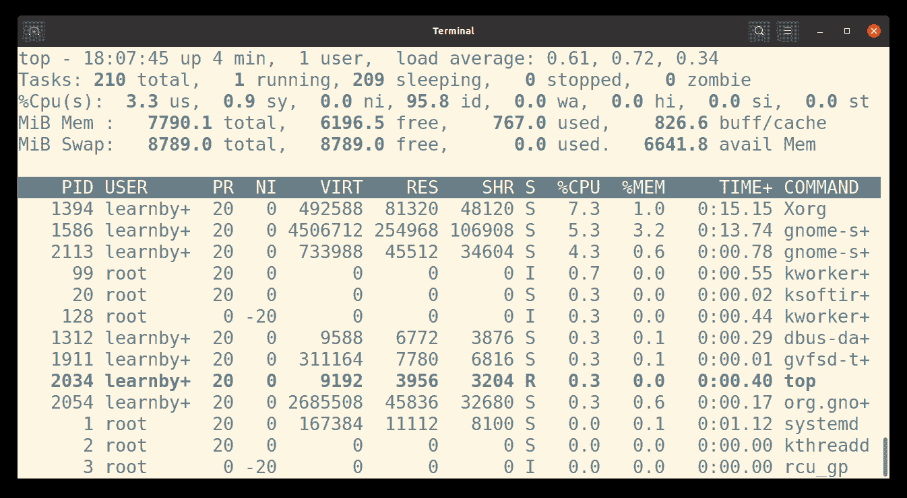

# 管理进程

> 原文：[`learnbyexample.github.io/cli-computing/managing-processes.html`](https://learnbyexample.github.io/cli-computing/managing-processes.html)

本章仅提供交互式使用的基本进程管理概述。处理其他用例（如系统管理）的进程需要更健壮的解决方案（参见[mywiki.wooledge: Process Management](https://mywiki.wooledge.org/ProcessManagement)以获取此类用例的入门信息）。

## 定义

以下是一些定义，这些定义对于本章的内容将很有用：

+   **程序**是一组编写来执行任务的指令

+   **进程**是任何正在运行的程序

+   **守护进程**是后台进程

+   **作业**是指不是守护进程的进程

    +   即作业是在用户控制下的交互程序

## 在后台运行作业

一些命令和脚本可能需要几分钟才能完成，你可能仍然需要继续使用 shell。如果你不依赖于当前的 shell 环境，你可以打开另一个 shell 实例并继续工作。

另一个选项是在命令调用时或将事实之后将作业推送到后台。确保重定向标准输出和错误，以避免干扰你的持续交互使用。在命令后添加`&`将在后台执行它。

```sh
$ tkdiff ip.txt ip.txt.bkp &
[1] 12726 
```

在上面的例子中，`[1]`指的是作业号，`12726`是 PID（进程 ID）。你可以使用`jobs`和`ps`命令来跟踪活动作业：

```sh
$ jobs
[1]+  Running                 tkdiff ip.txt ip.txt.bkp &

$ ps
    PID TTY          TIME CMD
   9657 pts/1    00:00:00 bash
  12726 pts/1    00:00:00 wish
  12730 pts/1    00:00:00 ps 
```

但如果你忘记在命令后添加`&`，你可以按照以下步骤操作：

+   `Ctrl+z` — 暂停当前正在运行的作业

+   `bg` — 将最近挂起的作业推送到后台

+   继续使用 shell

+   `fg` — 将最近推送到后台的作业带到前台

    +   你可以使用`fg %n`将第`n`个作业号带到前台

这里有一个你可以尝试的演示：

```sh
# sleep for 30 seconds (used here for illustration purposes)
# press Ctrl+z to suspend this job
# you'll get the job number, status and the command in the output
$ sleep 30
^Z
[1]+  Stopped                 sleep 30

# bg puts the job considered as the current by the shell to the background
$ bg
[1]+ sleep 30 &

# use 'jobs' or 'ps' to check list of jobs
# '+' after the job number is used to indicate the current job
$ jobs
[1]+  Running                 sleep 30 &
$ ps
    PID TTY          TIME CMD
   2380 pts/0    00:00:00 bash
   6160 pts/0    00:00:00 sleep
   6162 pts/0    00:00:00 ps

# fg brings the most recently pushed background job to the foreground
$ fg
sleep 30
$ 
```

>  `jobs`、`bg`和`fg`是 shell 内建命令。有关更多详细信息，请参阅[bash 手册：作业控制](https://www.gnu.org/software/bash/manual/bash.html#Job-Control)。另请参阅[关于作业控制的教程](https://www.digitalocean.com/community/tutorials/how-to-use-bash-s-job-control-to-manage-foreground-and-background-processes)。
> 
>  参见[我想在后台运行某些内容然后注销](https://mywiki.wooledge.org/ProcessManagement#I_want_to_run_something_in_the_background_and_then_log_out.) — `screen`、`tmux`、`nohup`、`disown`等。

## ps

`ps`命令提供了当前进程的快照。本章前面已经看到了一些例子。以下是一个使用`-f`选项（完整格式列表）的例子：

```sh
$ ps -f
UID          PID    PPID  C STIME TTY          TIME CMD
learnby+   12299   12298  0 16:39 pts/0    00:00:00 bash
learnby+   12311   12299  0 16:39 pts/0    00:00:00 ps -f 
```

上面的示例中包含的字段有有效用户 ID (UID)、进程 ID (PID)、父进程 ID (PPID)、处理器利用率 (C)、启动时间 (STIME)、控制终端 (TTY)、累计 CPU 时间 (TIME) 以及所有参数的命令 (CMD)。您可以使用 `-o` 选项自定义您想要的字段。`--sort` 选项可以帮助您根据特定字段进行排序。有关可用的完整格式列表，请参阅[ps 手册：标准格式说明符](https://www.mankier.com/1/ps#Standard_Format_Specifiers)。

`-e`（或 `-A`）选项选择所有进程。此选项通常与 `grep` 结合使用进行过滤：

```sh
$ ps -e | grep 'vim'
   6195 ?        00:03:13 gvim 
```

>  另请参阅 [linuxjourney：ps 教程](https://linuxjourney.com/lesson/monitor-processes-ps-command)。

## pgrep

`pgrep` 命令可以帮助您根据进程的名称和属性进行过滤。默认情况下，它匹配进程名称，例如：

```sh
$ ps -e | grep 'vim'
   2006 ?        00:00:27 gvim
   3992 pts/2    00:00:00 vim

$ pgrep 'vim'
2006
3992 
```

您可以使用 `-l` 选项显示进程名称（默认情况下显示 PID）。

```sh
$ pgrep -l 'vim'
2006 gvim
3992 vim 
```

要精确匹配进程名称（而不是匹配任何位置），请使用 `-x` 选项。

```sh
$ pgrep -x 'vim'
3992 
```

`-a` 选项将列出完整的命令行（之前看到的 `-l` 选项只提供名称，不提供参数）。

```sh
$ pgrep -a 'vim'
2006 gvim -p notes.txt src/managing-processes.md
3992 vim substitution.md 
```

>  有更多选项，例如根据有效 UID、PPID 等进行过滤。有关更多详细信息，请参阅[pgrep 手册](https://www.mankier.com/1/pgrep)。

## kill

有时，一个进程可能不会对您的交互尝试做出响应，可能运行时间过长，意外使用过多内存，等等。您可以使用 `kill` 命令来管理此类进程。

如本章开头所述，这些示例建议用于您启动的交互式进程（例如，shell 脚本将需要不同的策略）。在尝试向进程发送信号进行管理之前，请务必确保 100%准确。

您可以通过名称或与其关联的数字传递信号。使用 `kill -l` 获取完整的信号列表。另请参阅 [unix.stackexchange：信号列表](https://unix.stackexchange.com/q/317492/109046) 和 [unix.stackexchange：什么原因会导致发送各种信号？](https://unix.stackexchange.com/q/6332/109046)。

```sh
# first 20 signals (out of 64) listed below
$ kill -l
 1) SIGHUP       2) SIGINT       3) SIGQUIT      4) SIGILL       5) SIGTRAP
 6) SIGABRT      7) SIGBUS       8) SIGFPE       9) SIGKILL     10) SIGUSR1
11) SIGSEGV     12) SIGUSR2     13) SIGPIPE     14) SIGALRM     15) SIGTERM
16) SIGSTKFLT   17) SIGCHLD     18) SIGCONT     19) SIGSTOP     20) SIGTSTP
... 
```

您可以使用 PID 或作业号来指定要发送信号的进程。默认情况下，发送 `SIGTERM`（`15`），这是一种礼貌地请求程序终止的方式。以下是一个示例：

```sh
# 'sleep' is used here to emulate a long running process
# press Ctrl+z to suspend this command
$ sleep 100
^Z
[1]+  Stopped                 sleep 100

# terminate job number 1
# by default, SIGTERM is sent
$ kill %1
# just press Enter
$
[1]+  Terminated              sleep 100 
```

注意，在上面的示例中，按 `Ctrl+z` 实际上发送了 `SIGTSTP`（`20`）信号。程序通常会处理此类信号以找到更安全的挂起位置。按 `Ctrl+c` 发送 `SIGINT`（`2`）信号，通常用于终止进程（取决于程序如何处理它）。您可以使用 `Ctrl+\` 发送 `SIGQUIT`（`3`），通常用于请求程序退出并生成 [核心转储](https://en.wikipedia.org/wiki/Core_dump)。另请参阅 [stackoverflow：优雅地关闭进程](https://stackoverflow.com/q/690415/4082052)。

下面是一个说明如何通过名称和数值传递信号的示例：

```sh
$ sleep 100 &
[1] 10051

# suspend the above job, similar to using Ctrl+z
# -20 refers to the signal number 20, i.e. SIGTSTP
# 10051 is the PID
$ kill -20 10051

[1]+  Stopped                 sleep 100

# resume the job in background
$ bg
[1]+ sleep 100 &

# the -s option allows you to specify signal by its name
# '-s SIGTERM' is optional here, since that is the default
$ kill -s SIGTERM 10051
$ 
[1]+  Terminated              sleep 100 
```

>   如果无论如何都需要终止一个进程，你可以使用 `SIGKILL` (`9`)。这是一个程序无法阻止的信号。使用 `Ctrl+z` 暂停失控的作业，然后使用 `kill -9` 而不是尝试使用 `Ctrl+c` 来中止此类作业。另请参阅 [unix.stackexchange: why kill -9 should be avoided](https://unix.stackexchange.com/q/8916/109046)。
> 
>  注意，你的系统可能有多达几个不同的 `kill` 命令实现。本节讨论了 shell 内置版本。

## top

`top` 命令以表格形式显示进程，并附带信息如 PID、进程名称、内存使用情况等。以下是一个示例截图：



此命令打开一个交互式会话，并自动更新显示的信息。你可以按 `M`（大写）按内存使用量对进程进行排序。按 `e` 重复显示以兆/吉等术语表示的内存大小。按 `h` 获取帮助，按 `q` 退出会话。

>  按 `W`（大写）将当前设置写入 `toprc` 配置文件并退出。下次使用 `top` 命令时，它将以保存的格式显示。
> 
>  另请参阅其他实现，如 [htop](https://github.com/htop-dev/htop/) 和 [btop](https://github.com/aristocratos/btop)。

## free

`free` 命令显示有关系统内存的信息。以下是一个示例：

```sh
# -h option shows the results in human readable format
$ free -h
              total        used        free      shared  buff/cache   available
Mem:          7.6Gi       2.4Gi       2.3Gi       267Mi       2.9Gi       4.7Gi
Swap:         3.6Gi          0B       3.6Gi 
```

## 进一步阅读

+   [mywiki.wooledge: Process Management](https://mywiki.wooledge.org/ProcessManagement)

+   [ryanstutorials: Process Management](https://ryanstutorials.net/linuxtutorial/processes.php)

+   [digitalocean: Managing Linux Processes](https://www.digitalocean.com/community/tutorials/how-to-use-ps-kill-and-nice-to-manage-processes-in-linux)

+   [Linux ate my ram](https://www.linuxatemyram.com/) — Linux 正在借用未使用的内存进行磁盘缓存。这使得看起来你的内存不足，但实际上一切正常！

## 练习

**1)** 你会如何调用一个在后台执行的命令？在命令已经启动后，你该如何将其推送到后台？你可以使用哪些命令来跟踪活动作业？

**2)** 就业编号旁边的 `+` 和 `-` 符号表示什么？

**3)** 你会在什么情况下使用 `fg %n` 和 `bg %n` 而不是仅仅使用 `fg` 和 `bg` 分别？

**4)** 哪个选项可以帮助你自定义 `ps` 命令所需的输出字段？

**5)** `pgrep -a` 和 `pgrep -l` 选项之间的区别是什么？

**6)** 如果作业编号是 `2`，你会使用 `kill %2` 还是 `kill 2` 来向该进程发送 `SIGTERM`？

**7)** `Ctrl+c` 快捷键向当前运行进程发送哪个信号？

**8)** 哪个命令可以帮助你持续监控进程，包括如 PID、内存使用等详细信息？

**9)** 哪个键可以帮助你在 `top` 会话中操作结束任务？

**10)** `free` 命令的作用是什么？
