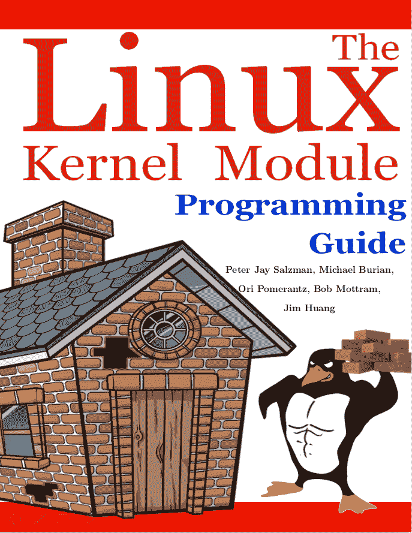

# Linux 内核模块编程指南

> 来源：[`sysprog21.github.io/lkmpg/`](https://sysprog21.github.io/lkmpg/)

Peter Jay Salzman, Michael Burian, Ori Pomerantz, Bob Mottram, Jim Huang

2025 年 9 月 28 日




### 1 简介

《Linux 内核模块编程指南》是一本免费书籍；您可以在[开放软件许可](https://opensource.org/licenses/OSL-3.0)的条款下复制或修改，版本 3.0。

本书分发是为了希望它会有用，但没有任何保证，甚至没有商销性或特定用途适用性的暗示保证。

作者鼓励广泛分发此书，无论是个人还是商业用途，只要上述版权声明保持完整，并且方法遵守[开放软件许可](https://opensource.org/licenses/OSL-3.0)的规定。总之，您可以免费或盈利地复制和分发此书。无需作者明确许可即可以任何介质复制此书，无论是物理的还是电子的。

本文档的衍生作品和翻译必须置于开放软件许可之下，并且必须保留原始版权声明。如果您为此书贡献了新材料，您必须提供材料和源代码以供您的修订。请直接向文档维护者 Jim Huang <jserv@ccns.ncku.edu.tw>提供修订和更新。这将允许合并更新并提供给 Linux 社区一致的修订。

如果您商业出版或分发此书，作者和 [Linux 文档项目](https://tldp.org/)（LDP）将非常感激捐赠、版税或印刷副本。以这种方式做出贡献表明您支持免费软件和 LDP。如果您有任何问题或评论，请通过上述地址联系。

#### 1.1 著作权

《Linux 内核模块编程指南》最初由 Ori Pomerantz 为 Linux v2.2 版本编写。随着 Linux 内核的演变，Ori 维护文档的能力逐渐减弱。因此，Peter Jay Salzman 接替了维护者的角色，并为 Linux v2.4 版本更新了指南。当 Peter 跟踪 Linux v2.6 版本的进展时，也遇到了类似的限制，导致 Michael Burian 加入作为共同维护者，使指南与 Linux v2.6 版本保持同步。Bob Mottram 通过更新 Linux v3.8 及以后的示例为指南做出了贡献。随后，Jim Huang 承担了更新指南以适应最新 Linux 版本（v5.0 及以上）的任务，同时修订了 LaTeX 文档。指南继续维护以兼容现代内核（v6.x 系列），同时确保示例与较旧的 LTS 内核兼容。

#### 1.2 致谢

以下人员对纠正或提出了良好的建议：

Amit Dhingra, Andrew Kreimer, Andrew Lin, Andy Shevchenko, Arush Sharma, Aykhan Hagverdili, Benno Bielmeier, Bob Lee, Brad Baker, Che-Chia Chang, Cheng-Shian Yeh, Cheng-Yang Chou, Chih-En Lin, Chih-Hsuan Yang, Chih-Yu Chen, Ching-Hua (Vivian) Lin, Chin Yik Ming, Chung-Han Tsai, cvvletter, Cyril Brulebois, Daniele Paolo Scarpazza, David Porter, demonsome, Dimo Velev, Ekang Monyet, Ethan Chan, Francois Audeon, Gilad Reti, Hao.Dong, heartofrain, Horst Schirmeier, Hsin-Hsiang Peng, Hung-Jen Pao, Ignacio Martin, I-Hsin Cheng, Integral, Iûnn Kiàn-îng, Jian-Xing Wu, Jimmy Ma, Johan Calle, keytouch, Kohei Otsuka, Kuan-Wei Chiu, manbing, Marconi Jiang, mengxinayan, Meng-Zong Tsai, Peter Lin, Roman Lakeev, Sam Erickson, Shao-Tse Hung, Shih-Sheng Yang, Stacy Prowell, Steven Lung, Tristan Lelong, Tse-Wei Lin, Tucker Polomik, Tyler Fanelli, VxTeemo, Wei-Hsin Yeh, Wei-Lun Tsai, Xatierlike Lee, Yan-Jie Chan, Yen-Yu Chen, Yin-Chiuan Chen, Yi-Wei Lin, Yo-Jung Lin, Yu-Chun Lin, Yu-Hsiang Tseng, YYGO。

#### 1.3 什么是内核模块？

参与开发 Linux 内核模块需要具备 C 编程语言的基础，并拥有创建旨在执行进程的传统程序的历史记录。这项追求深入到一个领域，如果忽视未受管理的指针，可能会触发整个文件系统的完全消除，导致需要完全系统重启的情景。

Linux 内核模块精确地定义为一段可以在内核中按需动态加载和卸载的代码。这些模块增强了内核功能，而无需重新启动系统。一个显著的例子是设备驱动模块，它促进了内核与系统连接的硬件组件之间的交互。如果没有模块，当前的方法倾向于使用单核内核，需要将新功能直接集成到内核映像中。这种方法会导致内核变大，并在需要新功能时需要重建内核和随后的系统重启。

#### 1.4 内核模块包

Linux 发行版在包中提供了 `modprobe`、`insmod` 和 `depmod` 命令。

在 Ubuntu/Debian GNU/Linux 上：

```
  1sudo apt-get install build-essential kmod
```

在 Arch Linux 上：

```
  1sudo pacman -S gcc kmod
```

#### 1.5 我的内核中有什么模块？

要发现当前内核中已经加载的模块，请使用命令 `lsmod`。

```
  1lsmod
```

模块存储在文件 /proc/modules 中，因此您也可以使用以下命令查看它们：

```
  1cat /proc/modules
```

这可能是一个很长的列表，您可能更喜欢搜索特定内容。要搜索 fat 模块：

```
  1lsmod | grep fat
```

#### 1.6 是否需要下载和编译内核？

为了有效地遵循本指南，没有执行此类操作的强制性要求。然而，一种谨慎的方法是在虚拟机上的测试发行版中执行示例，从而降低对系统造成潜在风险的任何可能性。

#### 1.7 开始之前

在深入研究代码之前，有一些事项需要关注。不同系统的差异存在，并且明显的个人方法也很明显。首次尝试成功编译和加载第一个“hello world”程序有时可能会遇到挑战。值得注意的是，首次尝试克服初始障碍为后续的顺利进展铺平了道路。

1.  模块版本化。为某个内核编译的模块如果启动了不同的内核则无法加载，除非在内核中启用了 `CONFIG_MODVERSIONS`。模块版本化将在本指南的后面讨论。在覆盖模块版本化之前，如果运行启用了模块版本化的内核，本指南中的示例可能无法正确工作。然而，大多数股票 Linux 发行版内核都启用了模块版本化。如果由于版本错误而加载模块时出现困难，请考虑编译一个禁用了模块版本化的内核。

1.  使用 X Window 系统。强烈建议从控制台提取、编译和加载本指南中讨论的所有示例。在 X Window 系统内执行这些任务是不被推荐的。

    模块不能像 `printf()` 一样直接打印到屏幕，但它们可以将信息和警告记录到内核的日志环形缓冲区。此输出不会自动在任何控制台或终端上显示。要查看内核模块消息，您必须使用 `dmesg` 读取内核日志环形缓冲区，或使用 `journalctl -k` 检查 systemd 日志以获取内核消息。有关更多信息，请参阅第四部分。加载模块的终端或环境不会影响输出位置——它始终输出到内核日志。

1.  SecureBoot。许多现代计算机出厂时已预配置为启用 UEFI SecureBoot——这是一个确保仅通过原始设备制造商认可的受信任软件启动的必要安全标准。某些 Linux 发行版甚至默认配置了支持 SecureBoot 的 Linux 内核。在这些情况下，内核模块需要签名安全密钥。

    如果失败，尝试插入您的第一个“Hello World”模块将导致出现消息：“ERROR: could not insert module”。如果此消息“Lockdown: insmod: unsigned module loading is restricted; see man kernel lockdown.7”出现在 `dmesg` 输出中，最简单的方法是禁用 PC 或笔记本电脑的启动菜单中的 UEFI SecureBoot，以允许成功插入“Hello World”模块。当然，另一种方法是进行复杂的程序，如生成密钥、系统密钥安装和模块签名以实现功能。然而，这个过程对于初学者来说不太合适。如果您感兴趣，可以探索并遵循[SecureBoot](https://wiki.debian.org/SecureBoot)的更详细步骤。

### 2 头文件

在构建任何东西之前，需要安装内核的头文件。

在 Ubuntu/Debian GNU/Linux 上：

```
  1sudo apt-get update  
2apt-cache search linux-headers-`uname -r`
```

以下命令提供了有关可用内核头文件的信息。例如：

```
  1sudo apt-get install linux-headers-`uname -r`
```

在 Arch Linux 上：

```
  1sudo pacman -S linux-headers
```

在 Fedora 上：

```
  1sudo dnf install kernel-devel kernel-headers
```

### 3 示例

本文档中的所有示例都可在 examples 子目录中找到。

如果出现编译错误，可能是由于正在使用较新的内核版本，或者可能需要安装相应的内核头文件。

### 4 Hello World

#### 4.1 最简单的模块

大多数开始编程之旅的人通常从某种“Hello World”示例的变体开始。对于偏离这一传统的人的结果尚不清楚，但似乎遵循它更为谨慎。学习过程将从一系列展示编写内核模块各种基本方面的“Hello World”程序开始。

下面展示的是最简单的模块。

创建一个测试目录：

```
  1mkdir -p ~/develop/kernel/hello-1  
2cd ~/develop/kernel/hello-1
```

将以下内容粘贴到您喜欢的编辑器中，并保存为 hello-1.c：

```
 1/*   
2 * hello-1.c - The simplest kernel module.  
3 */

4#include <linux/module.h> /* Needed by all modules */  
5#include <linux/printk.h> /* Needed for pr_info() */

6  
7int init_module(void)  
8{  
9    pr_info("Hello world 1.\n");  
10

11    /* A nonzero return means init_module failed; module can't be loaded. */

12    return 0;  
13}  
14  
15void cleanup_module(void)  
16{  
17    pr_info("Goodbye world 1.\n");  
18}

19 
20MODULE_LICENSE("GPL");
```

现在您需要一个 Makefile。如果您复制并粘贴，请将缩进更改为使用制表符而不是空格。

```
 1obj-m += hello-1.o   
2   
3PWD := $(CURDIR)  
4   
5all:  
6    $(MAKE) -C /lib/modules/$(shell uname -r)/build M=$(PWD) modules

7  
8clean: 
9    $(MAKE) -C /lib/modules/$(shell uname -r)/build M=$(PWD) clean
```

在 Makefile 中，$(CURDIR) 可以设置为当前工作目录的绝对路径名（在处理完所有 -C 选项之后，如果有的话）。有关 CURDIR 的更多信息，请参阅[GNU make 手册](https://www.gnu.org/software/make/manual/make.html)。

最后，直接运行 make。

```
  1make
```

如果 Makefile 中没有 PWD := $(CURDIR) 语句，那么使用 sudo make 可能无法正确编译。这是因为一些环境变量由安全策略指定，不能被继承。默认的安全策略是 sudoers。在 sudoers 安全策略中，env_reset 默认启用，这限制了环境变量。具体来说，路径变量不会保留用户环境中的值；它们被设置为默认值（更多信息，请参阅：[sudoers 手册](https://www.sudo.ws/docs/man/sudoers.man/)）。你可以通过以下方式查看环境变量设置：

```
$ sudo -s
# sudo -V

```

这里有一个简单的 Makefile 示例，用于演示上述提到的问题。

```
 1all:  
2    echo $(PWD)
```

然后，我们可以使用 -p 标志打印出 Makefile 中的环境变量值。

```
$ make -p | grep PWD
PWD = /home/ubuntu/temp
OLDPWD = /home/ubuntu
    echo $(PWD)

```

PWD 变量在使用 sudo 时不被继承。

```
$ sudo make -p | grep PWD
    echo $(PWD)

```

然而，有三种方法可以解决这个问题。

1.  你可以使用 -E 标志临时保留它们。

    ```
      1    $ sudo -E make -p | grep PWD   
    2    PWD = /home/ubuntu/temp

    3    OLDPWD = /home/ubuntu 
    4    echo $(PWD)
    ```

1.  作为 root 用户编辑 /etc/sudoers，可以禁用 env_reset。

    ```
     1  ## sudoers file.   
    2  ##  
    3  ...

    4  Defaults env_reset 
    5  ## Change env_reset to !env_reset in previous line to keep all environment variables
    ```

    然后分别执行 env 和 sudo env。

    ```
      1    # disable the env_reset   
    2    echo "user:" > non-env_reset.log; env >> non-env_reset.log

    3    echo "root:" >> non-env_reset.log; sudo env >> non-env_reset.log

    4    # enable the env_reset

    5    echo "user:" > env_reset.log; env >> env_reset.log 
    6    echo "root:" >> env_reset.log; sudo env >> env_reset.log
    ```

    你可以查看并比较这些日志，以找到 env_reset 和 !env_reset 之间的差异。

1.  你可以通过将它们附加到 /etc/sudoers 中的 env_keep 来保留环境变量。

    ```
     1  Defaults env_keep += "PWD"
    ```

    应用上述更改后，你可以通过以下方式检查环境变量设置：

    ```
             $ sudo -s
             # sudo -V

    ```

如果一切顺利，你应该会发现你有一个编译好的 hello-1.ko 模块。你可以使用以下命令获取相关信息：

```
  1modinfo hello-1.ko
```

在这一点上，以下命令：

```
  1lsmod | grep hello
```

应该不会返回任何内容。你可以尝试使用以下命令加载你的新模块：

```
  1sudo insmod hello-1.ko
```

连字符将被转换为下划线，所以当你再次尝试时：

```
  1lsmod | grep hello
```

现在，你应该能看到你加载的模块。它可以再次使用以下命令删除：

```
  1sudo rmmod hello_1
```

注意到连字符已被替换为下划线。要查看模块的输出消息，请使用 `dmesg` 查看内核日志环缓冲区：

```
  1sudo dmesg | tail -10
```

你应该会看到来自你的模块的消息，例如“Hello world 1.”和“Goodbye world 1.”。或者，你可以检查 systemd 日志以获取内核消息：

```
  1journalctl --since "1 hour ago" | grep kernel
```

现在，你已经了解了创建、编译、安装和删除模块的基本知识。现在让我们更详细地描述这个模块的工作原理。

内核模块必须至少有两个函数：一个名为“start”（初始化）的函数，称为`init_module()`，当模块被`insmod`到内核中时调用；以及一个名为“end”（清理）的函数，称为`cleanup_module()`，在它从内核中移除之前调用。实际上，从 2.3.13 内核开始，事情已经发生了变化。你现在可以为模块的起始和结束函数使用任何你喜欢的名称，你将在第 4.2 节中了解到如何做到这一点。实际上，新方法是首选方法。然而，许多人仍然使用`init_module()`和`cleanup_module()`作为它们的起始和结束函数。

通常，`init_module()`要么向内核注册一个处理程序，要么用它的代码替换内核中的一个函数（通常是执行某些操作然后调用原始函数的代码）。`cleanup_module()`函数应该撤销`init_module()`所做的操作，以便模块可以安全卸载。

最后，每个内核模块都需要包含<linux/module.h>。我们只需要包含<linux/printk.h>来为`pr_alert()`日志级别的宏进行展开，你将在项目 2 中了解到这一点。

1.  关于编码风格的一点。对于刚开始接触内核编程的人来说可能不太明显的是，你的代码缩进应该使用制表符而不是空格。这是内核的编码约定之一。你可能不喜欢它，但如果你要向上游提交补丁，你将需要习惯它。

1.  介绍打印宏。最初是`printk`，通常后面跟着一个优先级，例如`KERN_INFO`或`KERN_DEBUG`。最近，这也可以通过使用一组打印宏来以缩写形式表达，例如`pr_info`和`pr_debug`。这仅仅节省了一些无意义的键盘敲击，看起来也更整洁。它们可以在[include/linux/printk.h](https://git.kernel.org/pub/scm/linux/kernel/git/stable/linux.git/tree/include/linux/printk.h)中找到。花点时间阅读可用的优先级宏。

    重要：这些函数将写入内核日志环形缓冲区，而不是直接写入任何终端或控制台。要查看内核模块的输出，你必须使用`dmesg`或`journalctl -k`。

1.  关于编译。内核模块需要以与常规用户空间应用不同的方式编译。早期内核版本要求我们非常关注这些设置，这些设置通常存储在 Makefiles 中。尽管它们是按层次组织的，但许多冗余设置在子级 Makefiles 中积累，使它们变得很大，而且相当难以维护。幸运的是，有一种新的方法来做这些事情，称为 kbuild，外部可加载模块的构建过程现在已完全集成到标准内核构建机制中。要了解更多关于如何编译不属于官方内核的模块（例如，您将在本指南中找到的所有示例），请参阅文件 [Documentation/kbuild/modules.rst](https://git.kernel.org/pub/scm/linux/kernel/git/stable/linux.git/tree/Documentation/kbuild/modules.rst)。

    关于内核模块的 Makefiles 的更多详细信息，请参阅 [Documentation/kbuild/makefiles.rst](https://git.kernel.org/pub/scm/linux/kernel/git/stable/linux.git/tree/Documentation/kbuild/makefiles.rst)。在开始修改 Makefiles 之前，请务必阅读此文件和相关文件。这可能会为您节省大量工作。

    > 这里有一个给读者的练习。看看 `init_module()` 函数上方的注释？将返回值改为一个负数，重新编译并再次加载模块。会发生什么？

#### 4.2 你好和再见

在早期内核版本中，您必须使用 `init_module` 和 `cleanup_module` 函数，就像第一个 hello world 示例中那样，但如今您可以通过使用 `module_init` 和 `module_exit` 宏来命名这些函数。这些宏在 [include/linux/module.h](https://git.kernel.org/pub/scm/linux/kernel/git/stable/linux.git/tree/include/linux/module.h) 中定义。唯一的要求是您的初始化和清理函数必须在调用这些宏之前定义，否则您将得到编译错误。以下是一个此技术的示例：

```
 1/*   
2 * hello-2.c - Demonstrating the module_init() and module_exit() macros.

3 * This is preferred over using init_module() and cleanup_module().  
4 */

5#include <linux/init.h> /* Needed for the macros */  
6#include <linux/module.h> /* Needed by all modules */

7#include <linux/printk.h> /* Needed for pr_info() */  
8  
9static int __init hello_2_init(void)

10{  
11    pr_info("Hello, world 2\n");  
12    return 0;  
13}  
14  
15static void __exit hello_2_exit(void)  
16{

17    pr_info("Goodbye, world 2\n");  
18}  
19  
20module_init(hello_2_init);  
21module_exit(hello_2_exit);

22 
23MODULE_LICENSE("GPL");
```

因此，我们现在已经有了两个真正的内核模块。添加另一个模块就像这样：

```
 1obj-m += hello-1.o   
2obj-m += hello-2.o  
3   
4PWD := $(CURDIR)  
5   
6all:

7    $(MAKE) -C /lib/modules/$(shell uname -r)/build M=$(PWD) modules  
8

9clean: 
10    $(MAKE) -C /lib/modules/$(shell uname -r)/build M=$(PWD) clean
```

现在看看 [drivers/char/Makefile](https://git.kernel.org/pub/scm/linux/kernel/git/stable/linux.git/tree/drivers/char/Makefile) 以了解一个真实世界的例子。正如您所看到的，一些东西被硬编码到内核中（obj-y），但那些 obj-m 去哪里了？熟悉 shell 脚本的人会很容易地找到它们。对于不熟悉的人，您看到的 obj-$(CONFIG_FOO) 条目会根据 CONFIG_FOO 变量是否设置为 y 或 m 而展开为 obj-y 或 obj-m。当我们谈论这个问题时，这些正是您在上一次运行 `make menuconfig` 或类似命令时在 Linux 内核源树顶级目录的 .config 文件中设置的变量。

#### 4.3 __init 和 __exit 宏

`__init` 宏会导致在初始化函数完成后丢弃初始化函数并释放其内存，但对于可加载模块则不会这样做。如果你考虑初始化函数被调用的时机，这完全说得通。

此外，还有一个 `__initdata` 宏，它的工作方式与 `__init` 类似，但用于初始化变量而不是函数，而不是函数。

`__exit` 宏会导致在模块被构建到内核中时省略该函数，并且与 `__init` 一样，对于可加载模块没有影响。再次强调，如果你考虑清理函数运行的时机，这完全说得通；内置驱动程序不需要清理函数，而可加载模块则需要。

这些宏在 [include/linux/init.h](https://git.kernel.org/pub/scm/linux/kernel/git/stable/linux.git/tree/include/linux/init.h) 中定义，用于释放内核内存。当你启动内核并看到类似“释放未使用的内核内存：236k 释放”的消息时，这正是内核正在释放的内容。

```
 1/*   
2 * hello-3.c - Illustrating the __init, __initdata and __exit macros.  
3 */

4#include <linux/init.h> /* Needed for the macros */  
5#include <linux/module.h> /* Needed by all modules */

6#include <linux/printk.h> /* Needed for pr_info() */  
7  
8static int hello3_data __initdata = 3;  
9

10static int __init hello_3_init(void)  
11{  
12    pr_info("Hello, world %d\n", hello3_data);

13    return 0;  
14}  
15  
16static void __exit hello_3_exit(void)  
17{  
18    pr_info("Goodbye, world 3\n");

19}  
20  
21module_init(hello_3_init);  
22module_exit(hello_3_exit);  
23 
24MODULE_LICENSE("GPL");
```

#### 4.4 许可和模块文档

老实说，谁会加载甚至关心专有模块？如果你这样做，你可能见过类似这样的：

```
$ sudo insmod xxxxxx.ko
loading out-of-tree module taints kernel.
module license 'unspecified' taints kernel.

```

你可以使用几个宏来指明你模块的许可。一些例子包括 "GPL"、"GPL v2"、"GPL 和额外权利"、"双 BSD/GPL"、"双 MIT/GPL"、"双 MPL/GPL" 和 "专有"。它们在 [include/linux/module.h](https://git.kernel.org/pub/scm/linux/kernel/git/stable/linux.git/tree/include/linux/module.h) 中定义。

要引用你正在使用的许可，有一个名为 `MODULE_LICENSE` 的宏可用。以下示例中展示了该宏以及其他几个描述模块的宏。

```
 1/*   
2 * hello-4.c - Demonstrates module documentation.  
3 */

4#include <linux/init.h> /* Needed for the macros */  
5#include <linux/module.h> /* Needed by all modules */

6#include <linux/printk.h> /* Needed for pr_info() */  
7  
8MODULE_LICENSE("GPL");

9MODULE_AUTHOR("LKMPG");  
10MODULE_DESCRIPTION("A sample driver");  
11

12static int __init init_hello_4(void)  
13{  
14    pr_info("Hello, world 4\n");  
15    return 0;  
16}  
17

18static void __exit cleanup_hello_4(void)  
19{  
20    pr_info("Goodbye, world 4\n");  
21}  
22

23module_init(init_hello_4); 
24module_exit(cleanup_hello_4);
```

#### 4.5 将命令行参数传递给模块

模块可以接受命令行参数，但不是使用你可能习惯的 argc/argv。

要允许将参数传递给你的模块，声明将接受命令行参数值的变量为全局变量，然后使用 `module_param()` 宏（在 [include/linux/moduleparam.h](https://git.kernel.org/pub/scm/linux/kernel/git/stable/linux.git/tree/include/linux/moduleparam.h) 中定义）来设置机制。在运行时，`insmod` 将填充任何给定的命令行参数到变量中，例如 `insmod mymodule.ko myvariable=5`。变量声明和宏应放置在模块的开头以提高清晰度。示例代码应该可以澄清我承认的糟糕解释。

`module_param()` 宏接受 3 个参数：变量的名称、其类型以及对应于 sysfs 中文件的权限。整数类型可以是通常的带符号整数或无符号整数。如果你想要使用整数或字符串数组，请参阅 `module_param_array()` 和 `module_param_string()` 。

```
 1int myint = 3;  
2module_param(myint, int, 0);
```

数组也受到支持，但现在的情况与过去有些不同。为了跟踪参数的数量，您需要将计数变量的指针作为第三个参数传递。根据您的选择，您也可以忽略计数并传递`NULL`。这里展示了两种可能性：

```
 1int myintarray[2];   
2module_param_array(myintarray, int, NULL, 0); /* not interested in count */

3  
4short myshortarray[4];

5int count; 
6module_param_array(myshortarray, short, &count, 0); /* put count into "count" variable */
```

这种用法的一个好例子是设置模块变量的默认值，比如端口或 I/O 地址。如果变量包含默认值，则执行自动检测（在其他地方解释）。否则，保持当前值。这将在稍后说明。

最后，有一个宏函数`MODULE_PARM_DESC()`，用于记录模块可以接受的参数。它接受两个参数：一个变量名和一个描述该变量的自由格式字符串。

```
 1/*   
2 * hello-5.c - Demonstrates command line argument passing to a module.

3 */  
4#include <linux/init.h>  
5#include <linux/kernel.h> /* for ARRAY_SIZE() */

6#include <linux/module.h>  
7#include <linux/moduleparam.h>  
8#include <linux/printk.h>

9#include <linux/stat.h>  
10  
11MODULE_LICENSE("GPL");  
12  
13static short int myshort = 1;

14static int myint = 420;  
15static long int mylong = 9999;  
16static char *mystring = "blah";

17static int myintarray[2] = { 420, 420 };  
18static int arr_argc = 0;  
19

20/* module_param(foo, int, 0000)  
21 * The first param is the parameter's name.

22 * The second param is its data type.  
23 * The final argument is the permissions bits,

24 * for exposing parameters in sysfs (if non-zero) at a later stage.  
25 */

26module_param(myshort, short, S_IRUSR | S_IWUSR | S_IRGRP | S_IWGRP);

27MODULE_PARM_DESC(myshort, "A short integer");  
28module_param(myint, int, S_IRUSR | S_IWUSR | S_IRGRP | S_IROTH);

29MODULE_PARM_DESC(myint, "An integer");  
30module_param(mylong, long, S_IRUSR);

31MODULE_PARM_DESC(mylong, "A long integer");  
32module_param(mystring, charp, 0000);

33MODULE_PARM_DESC(mystring, "A character string");  
34  
35/* module_param_array(name, type, num, perm);

36 * The first param is the parameter's (in this case the array's) name.

37 * The second param is the data type of the elements of the array.

38 * The third argument is a pointer to the variable that will store the number

39 * of elements of the array initialized by the user at module loading time.

40 * The fourth argument is the permission bits.  
41 */  
42module_param_array(myintarray, int, &arr_argc, 0000);

43MODULE_PARM_DESC(myintarray, "An array of integers");  
44  
45static int __init hello_5_init(void)

46{  
47    int i;  
48  
49    pr_info("Hello, world 5\n=============\n");

50    pr_info("myshort is a short integer: %hd\n", myshort);

51    pr_info("myint is an integer: %d\n", myint);  
52    pr_info("mylong is a long integer: %ld\n", mylong);

53    pr_info("mystring is a string: %s\n", mystring);  
54  
55    for (i = 0; i < ARRAY_SIZE(myintarray); i++)

56        pr_info("myintarray[%d] = %d\n", i, myintarray[i]);  
57

58    pr_info("got %d arguments for myintarray.\n", arr_argc);  
59    return 0;  
60}  
61

62static void __exit hello_5_exit(void)  
63{  
64    pr_info("Goodbye, world 5\n");  
65}  
66

67module_init(hello_5_init); 
68module_exit(hello_5_exit);
```

建议您尝试以下代码：

```
$ sudo insmod hello-5.ko mystring="bebop" myintarray=-1
$ sudo dmesg -t | tail -7
myshort is a short integer: 1
myint is an integer: 420
mylong is a long integer: 9999
mystring is a string: bebop
myintarray[0] = -1
myintarray[1] = 420
got 1 arguments for myintarray.

$ sudo rmmod hello-5
$ sudo dmesg -t | tail -1
Goodbye, world 5

$ sudo insmod hello-5.ko mystring="supercalifragilisticexpialidocious" myintarray=-1,-1
$ sudo dmesg -t | tail -7
myshort is a short integer: 1
myint is an integer: 420
mylong is a long integer: 9999
mystring is a string: supercalifragilisticexpialidocious
myintarray[0] = -1
myintarray[1] = -1
got 2 arguments for myintarray.

$ sudo rmmod hello_5
$ sudo dmesg -t | tail -1
Goodbye, world 5

$ sudo insmod hello-5.ko mylong=hello
insmod: ERROR: could not insert module hello-5.ko: Invalid parameters

```

#### 4.6 多文件跨越的模块

有时候，将内核模块分割成几个源文件是有意义的。

这里是一个这样的内核模块的例子。

```
 1/*   
2 * start.c - Illustration of multi filed modules  
3 */

4  
5#include <linux/kernel.h> /* We are doing kernel work */

6#include <linux/module.h> /* Specifically, a module */  
7  
8int init_module(void)  
9{

10    pr_info("Hello, world - this is the kernel speaking\n");  
11    return 0;  
12}

13 
14MODULE_LICENSE("GPL");
```

下一个文件：

```
 1/*   
2 * stop.c - Illustration of multi filed modules  
3 */

4  
5#include <linux/kernel.h> /* We are doing kernel work */

6#include <linux/module.h> /* Specifically, a module  */  
7  
8void cleanup_module(void)  
9{

10    pr_info("Short is the life of a kernel module\n");  
11}  
12 
13MODULE_LICENSE("GPL");
```

最后，是 makefile：

```
 1obj-m += hello-1.o   
2obj-m += hello-2.o  
3obj-m += hello-3.o  
4obj-m += hello-4.o

5obj-m += hello-5.o  
6obj-m += startstop.o  
7startstop-objs := start.o stop.o  
8

9PWD := $(CURDIR)  
10  
11all:  
12    $(MAKE) -C /lib/modules/$(shell uname -r)/build M=$(PWD) modules  
13

14clean: 
15    $(MAKE) -C /lib/modules/$(shell uname -r)/build M=$(PWD) clean
```

这是到目前为止我们所看到的所有示例的完整 makefile。前五行没有什么特别之处，但为了最后的例子，我们需要两行。首先，我们为我们的组合模块发明一个对象名，然后我们告诉`make`哪些目标文件是该模块的一部分。

#### 4.7 为预编译内核构建模块

显然，我们强烈建议您重新编译内核，以便您可以使用许多有用的调试功能，例如强制模块卸载（`MODULE_FORCE_UNLOAD`）：当此选项启用时，您可以通过`sudo rmmod -f module`命令强制内核卸载模块，即使内核认为这样做不安全。此选项可以在模块开发过程中节省您大量时间和多次重启。如果您不想重新编译内核，那么您应该考虑在虚拟机上运行测试分布中的示例。如果您搞砸了，您可以轻松地重启或恢复虚拟机（VM）。

在某些情况下，您可能希望将您的模块加载到预编译的运行内核中，例如与常见 Linux 发行版一起提供的内核，或者您过去编译的内核。在某些情况下，您可能需要编译并将模块插入到您不允许重新编译的运行内核中，或者在一个您不想重启的机器上。如果您想不出任何必须使用预编译内核模块的情况，您可能想跳过这部分，并将本章的其余部分视为一个大的脚注。

现在，如果您只是安装了一个内核源树，使用它来编译您的内核模块，并尝试将您的模块插入内核，在大多数情况下，您会得到以下错误：

```
insmod: ERROR: could not insert module poet.ko: Invalid module format

```

更不神秘的日志信息记录到 systemd 日志中：

```
kernel: poet: disagrees about version of symbol module_layout

```

换句话说，您的内核拒绝接受您的模块，因为版本字符串（更准确地说，版本魔法，见[include/linux/vermagic.h](https://git.kernel.org/pub/scm/linux/kernel/git/stable/linux.git/tree/include/linux/vermagic.h)）不匹配。顺便提一下，版本魔法字符串以`vermagic:`开头的形式存储在模块对象中。当模块与内核/module.o 文件链接时，会插入版本数据。要检查给定模块中存储的版本魔法和其他字符串，请发出命令`modinfo module.ko`：

```
$ modinfo hello-4.ko
description:    A sample driver
author:         LKMPG
license:        GPL
srcversion:     B2AA7FBFCC2C39AED665382
depends:
retpoline:      Y
name:           hello_4
vermagic:       5.4.0-70-generic SMP mod_unload modversions

```

为了克服这个问题，我们可以求助于--force-vermagic 选项，但这种解决方案可能不安全，并且在生产模块中无疑是不可接受的。因此，我们希望在构建我们的模块时，环境与我们的预编译内核构建时的环境完全相同。如何做到这一点，是本章剩余部分的主题。

首先，确保有一个与您的当前内核版本完全相同的内核源树。然后，找到用于编译您的预编译内核的配置文件。通常，这个文件位于您的当前引导目录下，名称类似于 config-5.14.x。您可能只想将其复制到您的内核源树中：``cp /boot/config-`uname -r` .config``。

让我们再次关注之前的错误信息：仔细查看版本魔法的字符串表明，即使有两个完全相同的配置文件，版本魔法的微小差异也是可能的，并且足以防止模块被插入内核。这种微小差异，即出现在模块版本魔法中而不出现在内核中的自定义字符串，是由于某些发行版包含的 makefile 相对于原始版本的修改。然后，检查您的 Makefile，并确保指定的版本信息与您当前内核使用的版本信息完全匹配。例如，您的 makefile 可能以以下方式开始：

```
VERSION = 5
PATCHLEVEL = 14
SUBLEVEL = 0
EXTRAVERSION = -rc2

```

在这种情况下，您需要将符号 EXTRAVERSION 的值恢复到-rc2。我们建议保留一个备份副本的 makefile，该 makefile 用于编译您的内核，并存储在/lib/modules/5.14.0-rc2/build 中。以下简单的命令应该足够：

```
  1cp /lib/modules/`uname -r`/build/Makefile linux-`uname -r`
```

这里 `` linux-`uname -r` `` 是您试图构建的 Linux 内核源代码。

现在，请运行`make`以更新配置和版本头文件和对象：

```
$ make
  SYNC    include/config/auto.conf.cmd
  HOSTCC  scripts/basic/fixdep
  HOSTCC  scripts/kconfig/conf.o
  HOSTCC  scripts/kconfig/confdata.o
  HOSTCC  scripts/kconfig/expr.o
  LEX     scripts/kconfig/lexer.lex.c
  YACC    scripts/kconfig/parser.tab.[ch]
  HOSTCC  scripts/kconfig/preprocess.o
  HOSTCC  scripts/kconfig/symbol.o
  HOSTCC  scripts/kconfig/util.o
  HOSTCC  scripts/kconfig/lexer.lex.o
  HOSTCC  scripts/kconfig/parser.tab.o
  HOSTLD  scripts/kconfig/conf

```

如果您不想实际编译内核，可以在 SPLIT 行之后中断构建过程（CTRL-C），因为那时您需要的文件已经准备好了。现在您可以回到您的模块目录并编译它：它将根据您当前的内核设置精确构建，并且可以无错误地加载到内核中。

### 5 初步

#### 5.1 模块的开始和结束

典型的程序从`main()`函数开始，执行一系列指令，并在完成这些指令后终止。然而，内核模块遵循不同的模式。模块总是以`init_module`函数或由`module_init`调用指定的函数开始。这个函数作为模块的入口点，向内核告知模块的功能，并准备内核在需要时利用模块的函数。完成这些任务后，入口函数返回，模块保持不活跃状态，直到内核需要其代码。

所有模块都以调用`cleanup_module`或通过`module_exit`调用指定的函数结束。这作为模块的出口函数，通过注销之前注册的功能来反转入口函数的操作。

每个模块都必须有一个入口函数和一个出口函数。虽然定义这些函数有多种方法，但通常使用“入口函数”和“出口函数”这两个术语。然而，它们有时也可能被称为`init_module`和`cleanup_module`，这些术语都被理解为具有相同的意思。

#### 5.2 模块可用的函数

程序员经常使用他们自己没有定义的函数。`printf()`就是这样一个典型的例子。你使用的是由标准 C 库 libc 提供的库函数。这些函数的定义实际上直到链接阶段才进入你的程序，这确保了代码（例如`printf()`的代码）可用，并固定了调用指令以指向该代码。

内核模块在这里也是如此。在“hello world”示例中，你可能已经注意到我们使用了一个函数`pr_info()`，但没有包含标准 I/O 库。这是因为模块是对象文件，其符号在运行`insmod`或`modprobe`时得到解析。符号的定义来自内核本身；你可以使用的唯一外部函数是内核提供的函数。如果你对内核导出的符号感兴趣，可以查看/proc/kallsyms。

需要注意的一个问题是库函数和系统调用的区别。库函数是高级的，完全在用户空间运行，并为程序员提供了对执行实际工作的函数（即系统调用）的更方便的接口。系统调用在用户代表下以内核模式运行，并由内核本身提供。库函数`printf()`可能看起来是一个非常通用的打印函数，但实际上它只是将数据格式化为字符串，并使用低级系统调用`write()`将字符串数据写入，然后发送到标准输出。

你想看看`printf()`做了哪些系统调用吗？这很简单！编译以下程序：

```
 1#include <stdio.h>   
2   
3int main(void)  
4{  
5    printf("hello");  
6    return 0; 
7}
```

使用 `gcc -Wall -o hello hello.c` 编译。使用 `strace ./hello` 运行可执行文件。你感到惊讶了吗？你看到的每一行都对应一个系统调用。[strace](https://strace.io/) 是一个方便的程序，它可以提供关于程序正在执行哪些系统调用的详细信息，包括哪个调用被执行、它的参数是什么以及它返回了什么。它是确定诸如程序试图访问哪些文件之类的信息的一个无价工具。在最后，你会看到一行看起来像 `write(1, "hello", 5hello)` 的内容。就在那里。`printf()` 面具背后的面孔。你可能不熟悉 `write`，因为大多数人使用库函数进行文件 I/O（如 `fopen`、`fputs`、`fclose`）。如果是这种情况，试着查看 man 2 write。第 2 个 man 部分（man section）是专门关于系统调用的（如 `kill()` 和 `read()`）。第 3 个 man 部分是关于库调用的，你可能更熟悉（如 `cosh()` 和 `random()`）。

你甚至可以编写模块来替换内核的系统调用，我们很快就会这样做。黑客经常利用这类东西来创建后门或特洛伊木马，但你也可以编写自己的模块来做更无害的事情，比如当有人试图删除你系统上的文件时，让内核记录一条消息。

#### 5.3 用户空间与内核空间

内核主要管理对资源的访问，无论是显卡、硬盘还是内存。程序经常争夺相同的资源。例如，当文档被保存时，updatedb 可能开始更新 locate 数据库。在 vim 等编辑器中的会话和 updatedb 等进程可以同时使用硬盘。内核的作用是维持秩序，确保用户不会无差别地访问资源。

为了管理这一点，CPU 在不同的模式下运行，每个模式提供不同级别的系统控制。例如，Intel 80386 架构具有四种这样的模式，被称为环。然而，Unix 只利用了这些环中的两个：最高环（ring 0，也称为“管理程序模式”，在这里所有操作都是允许的）和最低环，被称为“用户模式”。

回想一下关于库函数与系统调用的讨论。通常，你在用户模式下使用库函数。库函数调用一个或多个系统调用，这些系统调用代表库函数执行，但它们在内核本身的部分以管理程序（supervisor mode）执行。一旦系统调用完成其任务，它就会返回，执行控制权就会转回到用户模式。

#### 5.4 命名空间

当你编写一个小型 C 程序时，你会使用方便且对读者有意义的变量。另一方面，如果你正在编写将成为更大问题一部分的例程，你拥有的任何全局变量都是其他人的全局变量社区的一部分；一些变量名可能会冲突。当一个程序有很多没有足够意义来区分的全局变量时，你会得到命名空间污染。在大型项目中，必须努力记住保留的名称，并找到开发命名唯一变量名和符号方案的方法。

当编写内核代码时，即使是体积最小的模块也会与整个内核链接，所以这确实是一个问题。处理这个问题的最好方法是声明所有变量为静态的，并为你的符号使用一个定义良好的前缀。按照惯例，所有内核前缀都是小写的。如果你不想将所有内容都声明为静态的，另一个选项是声明一个符号表并将其注册到内核中。我们稍后会讨论这个问题。

文件/proc/kallsyms 包含了内核所知道的所有符号，因此这些符号可以通过你的模块访问，因为它们共享内核的代码空间。

#### 5.5 代码空间

内存管理是一个非常复杂的话题，O'Reilly 的[《理解 Linux 内核》](https://www.oreilly.com/library/view/understanding-the-linux/0596005652/)一书专门涵盖了内存管理！我们并不是要成为内存管理方面的专家，但我们确实需要了解一些事实，才能开始担心编写真正的模块。

如果你没有想过段错误（segfault）真正意味着什么，你可能会惊讶地听到指针实际上并不指向内存位置。至少不是真正的内存位置。当创建一个进程时，内核会为其实际物理内存分配一部分，并将其交给进程用于执行代码、变量、堆栈、堆和其他计算机科学家会了解的东西。这段内存从 0x00000000 开始，扩展到所需的任何位置。由于任何两个进程的内存空间都不会重叠，因此任何可以访问内存地址（例如 0xbffff978）的进程都会访问实际物理内存中的不同位置！进程会访问一个名为 0xbffff978 的索引，该索引指向为该特定进程保留的内存区域中的某种偏移量。在大多数情况下，像我们的 Hello, World 程序这样的进程无法访问另一个进程的空间，尽管我们稍后会讨论一些方法。

内核也有自己的内存空间。由于模块是可以在内核中动态插入和删除的代码（与半自主对象相反），它共享内核的代码空间，而不是拥有自己的。因此，如果你的模块发生段错误，内核也会发生段错误。如果你因为偏移量错误而开始覆盖数据，那么你就是在践踏内核数据（或代码）。这比听起来更糟糕，所以请务必小心。

应当注意，上述讨论适用于任何使用单一内核的操作系统。这个概念与“将所有模块构建到内核中”略有不同，尽管其基本原理相似。相比之下，还有微内核，其中模块分配了自己的代码空间。两个著名的微内核例子包括[GNU Hurd](https://www.gnu.org/software/hurd/)和谷歌 Fuchsia 的[Zircon 内核](https://fuchsia.dev/fuchsia-src/concepts/kernel)。

#### 5.6 设备驱动程序

模块的一种类型是设备驱动程序，它为串行端口等硬件提供功能。在 Unix 系统中，每一块硬件都由位于/dev 目录下的一个文件表示，该文件被称为设备文件，它提供了与硬件通信的手段。设备驱动程序代表用户程序进行通信。因此，es1370.ko 声卡设备驱动程序可能会将/dev/sound 设备文件连接到 Ensoniq ES1370 声卡。像 mp3blaster 这样的用户空间程序可以使用/dev/sound，而无需知道安装了什么类型的声卡。

让我们来看看一些设备文件。以下是一些代表主 SCSI 存储设备上前三个分区的设备文件：

```
$ ls -l /dev/sda[1-3]
brw-rw----  1 root  disk  8, 1 Apr  9  2025 /dev/sda1
brw-rw----  1 root  disk  8, 2 Apr  9  2025 /dev/sda2
brw-rw----  1 root  disk  8, 3 Apr  9  2025 /dev/sda3

```

注意到由逗号分隔的数字列。第一个数字被称为设备的 major 号。第二个数字是 minor 号。major 号告诉你使用哪个驱动程序来访问硬件。每个驱动程序都被分配了一个唯一的 major 号；所有具有相同 major 号的设备文件都由同一个驱动程序控制。所有上述 major 号都是 8，因为它们都由同一个驱动程序控制。

小号数由驱动程序用于区分它所控制的多种硬件。回到上面的例子，尽管这三个设备都由同一个驱动程序处理，但它们具有独特的小号数，因为驱动程序将它们视为不同的硬件。

设备分为两种类型：字符设备和块设备。区别在于块设备有一个请求缓冲区，因此它们可以选择最佳顺序来响应请求。这在存储设备的情况下很重要，因为读取或写入相邻扇区比读取或写入较远扇区要快。另一个区别是，块设备只能以块（其大小可以按设备变化）的形式接受输入并返回输出，而字符设备则允许使用任意多或少的字节。世界上大多数设备都是字符设备，因为它们不需要这种类型的缓冲，并且它们不使用固定块大小操作。你可以通过查看`ls -l`输出的第一个字符来判断设备文件是块设备还是字符设备。如果是‘b’，则它是块设备；如果是‘c’，则它是字符设备。你上面看到的设备是块设备。以下是一些字符设备（串行端口）：

```
crw-rw----  1 root  dial 4, 64 Feb 18 23:34 /dev/ttyS0
crw-r-----  1 root  dial 4, 65 Nov 17 10:26 /dev/ttyS1
crw-rw----  1 root  dial 4, 66 Jul  5  2000 /dev/ttyS2
crw-rw----  1 root  dial 4, 67 Jul  5  2000 /dev/ttyS3

```

如果你想查看已分配的主编号，你可以查看[Documentation/admin-guide/devices.txt](https://git.kernel.org/pub/scm/linux/kernel/git/stable/linux.git/tree/Documentation/admin-guide/devices.txt)。

当系统安装时，所有这些设备文件都是由`mknod`命令创建的。要创建一个名为 coffee 的字符设备，其主/次编号为 12 和 2，只需执行`mknod /dev/coffee c 12 2`。你不必将设备文件放入/dev，但按照惯例是这样做的。林纳斯把他的设备文件放在/dev，你也应该这样做。然而，当为测试目的创建设备文件时，将其放在编译内核模块的工作目录中可能没问题。只是确保在完成设备驱动程序编写后将其放在正确的位置。

虽然在之前的讨论中是隐含的，但以下几点值得明确指出，以增强清晰度。当一个设备文件被访问时，内核利用文件的 major 编号来识别处理访问的适当驱动程序。这表明内核不一定依赖于或需要知道次编号。是驱动程序关心次编号，并使用它来区分不同的硬件部件。

需要注意的是，当提到“硬件”时，这个术语的使用比仅仅指可以手持的物理 PCI 卡要抽象一些。考虑以下两个设备文件：

```
$ ls -l /dev/sda /dev/sdb
brw-rw---- 1 root disk 8,  0 Jan  3 09:02 /dev/sda
brw-rw---- 1 root disk 8, 16 Jan  3 09:02 /dev/sdb

```

到现在为止，你可以查看这两个设备文件并立即知道它们是块设备，并由相同的驱动程序处理（块主编号 8）。有时，具有相同 major 编号但不同 minor 编号的两个设备文件实际上可以代表同一块物理硬件。所以请注意，我们讨论中的“硬件”一词可以指一个非常抽象的概念。

### 6 字符设备驱动程序

#### 6.1 文件操作结构体

`file_operations` 结构体定义在 [include/linux/fs.h](https://git.kernel.org/pub/scm/linux/kernel/git/stable/linux.git/tree/include/linux/fs.h)，并持有指向驱动程序定义的执行各种设备操作的函数的指针。结构体的每个字段对应于驱动程序定义的用于处理请求操作的函数的地址。

例如，每个字符驱动程序都需要定义一个从设备读取数据的函数。`file_operations` 结构体持有执行该操作的模块函数的地址。以下是内核 5.4 及以后版本的定义示例：

```
 1struct file_operations {   
2    struct module *owner;  
3    loff_t (*llseek) (struct file *, loff_t, int);

4    ssize_t (*read) (struct file *, char __user *, size_t, loff_t *);

5    ssize_t (*write) (struct file *, const char __user *, size_t, loff_t *);

6    ssize_t (*read_iter) (struct kiocb *, struct iov_iter *);

7    ssize_t (*write_iter) (struct kiocb *, struct iov_iter *);

8    int (*iopoll)(struct kiocb *kiocb, bool spin);  
9    int (*iterate) (struct file *, struct dir_context *);

10    int (*iterate_shared) (struct file *, struct dir_context *);

11    __poll_t (*poll) (struct file *, struct poll_table_struct *);

12    long (*unlocked_ioctl) (struct file *, unsigned int, unsigned long);

13    long (*compat_ioctl) (struct file *, unsigned int, unsigned long);

14    int (*mmap) (struct file *, struct vm_area_struct *);

15    unsigned long mmap_supported_flags;  
16    int (*open) (struct inode *, struct file *);

17    int (*flush) (struct file *, fl_owner_t id);  
18    int (*release) (struct inode *, struct file *);

19    int (*fsync) (struct file *, loff_t, loff_t, int datasync);

20    int (*fasync) (int, struct file *, int);  
21    int (*lock) (struct file *, int, struct file_lock *);

22    ssize_t (*sendpage) (struct file *, struct page *, int, size_t, loff_t *, int);

23    unsigned long (*get_unmapped_area)(struct file *, unsigned long, unsigned long, unsigned long, unsigned long);

24    int (*check_flags)(int);  
25    int (*flock) (struct file *, int, struct file_lock *);

26    ssize_t (*splice_write)(struct pipe_inode_info *, struct file *, loff_t *, size_t, unsigned int);

27    ssize_t (*splice_read)(struct file *, loff_t *, struct pipe_inode_info *, size_t, unsigned int);

28    int (*setlease)(struct file *, long, struct file_lock **, void **);

29    long (*fallocate)(struct file *file, int mode, loff_t offset,

30        loff_t len);  
31    void (*show_fdinfo)(struct seq_file *m, struct file *f);

32    ssize_t (*copy_file_range)(struct file *, loff_t, struct file *,

33        loff_t, size_t, unsigned int);  
34    loff_t (*remap_file_range)(struct file *file_in, loff_t pos_in,

35             struct file *file_out, loff_t pos_out,  
36             loff_t len, unsigned int remap_flags);

37    int (*fadvise)(struct file *, loff_t, loff_t, int); 
38} __randomize_layout;
```

一些操作不是由驱动程序实现的。例如，处理显卡的驱动程序不需要从目录结构中读取。`file_operations` 结构中的相应条目应设置为 `NULL`。¹

存在一个 gcc 扩展，使得向该结构体赋值更加方便。你会在现代驱动程序中看到它，可能会让你感到惊讶。这是向结构体赋值的新方法的样子：

```
 1struct file_operations fops = {   
2    read: device_read,  
3    write: device_write,

4    open: device_open,  
5    release: device_release 
6};
```

然而，C99 标准中也有一种给结构体元素赋值的方法，称为[指定初始化器](https://gcc.gnu.org/onlinedocs/gcc/Designated-Inits.html)，这比使用 GNU 扩展更受欢迎。如果你希望有人移植你的驱动程序，你应该使用这种语法。这将有助于兼容性：

```
 1struct file_operations fops = {   
2    .read = device_read,  
3    .write = device_write,

4    .open = device_open,  
5    .release = device_release 
6};
```

意义很明确，你应该知道，结构体中任何未明确赋值的成员将由 gcc 初始化为 `NULL`。

包含指向用于实现 `read`、`write`、`open` 等系统调用函数的指针的 `struct file_operations` 实例通常命名为 `fops`。

自 Linux v3.14 版本以来，通过使用 `f_pos` 特定锁来保证读取、写入和查找操作是线程安全的，这使得文件位置更新成为互斥操作。因此，我们可以安全地实现这些操作，而无需不必要的锁定。

此外，自 Linux v5.6 版本以来，引入了 `proc_ops` 结构来替代注册 proc 处理器时使用 `file_operations` 结构。更多详细信息请参阅第 7.1 节。

#### 6.2 文件结构

每个设备在内核中通过文件结构体表示，该结构体定义在 [include/linux/fs.h](https://git.kernel.org/pub/scm/linux/kernel/git/stable/linux.git/tree/include/linux/fs.h)。请注意，文件是一个内核级结构体，永远不会出现在用户空间程序中。它不同于由 glibc 定义的 `FILE`，后者永远不会出现在内核空间函数中。此外，它的名称有点误导；它代表一个抽象的打开“文件”，而不是磁盘上的文件，磁盘上的文件由名为 `inode` 的结构体表示。

struct file 的实例通常命名为 `filp`。你也会看到它被称作 struct file 对象。请抵制这种诱惑。

继续查看文件的定义。您看到的大部分条目，如 struct dentry，都不被设备驱动程序使用，您可以忽略它们。这是因为驱动程序不会直接填充文件；它们只使用文件中包含的结构，这些结构是在其他地方创建的。

#### 6.3 注册设备

如前所述，字符设备通过设备文件访问，通常位于/dev 目录下。这是惯例。在编写驱动程序时，将设备文件放在当前目录中是可以的。只需确保在生产驱动程序中将它放在/dev 目录下。主设备号告诉您哪个驱动程序处理哪个设备文件。次设备号仅由驱动程序本身使用，以区分它正在操作哪个设备，以防驱动程序处理多个设备。

将驱动程序添加到您的系统意味着将其注册到内核中。这与在模块初始化期间为其分配一个主设备号同义。您可以通过使用由[include/linux/fs.h](https://git.kernel.org/pub/scm/linux/kernel/git/stable/linux.git/tree/include/linux/fs.h)定义的`register_chrdev`函数来完成此操作。

```
 1int register_chrdev(unsigned int major, const char *name, struct file_operations *fops);
```

在`unsigned int major`是您想要请求的主设备号，`const char *name`是设备在/proc/devices 中显示的名称，`struct file_operations *fops`是您驱动程序的`file_operations`表的指针。负返回值表示注册失败。请注意，我们没有将次设备号传递给`register_chrdev`。这是因为内核不关心次设备号；只有我们的驱动程序使用它。

现在的问题是，您如何在不抢占已使用的设备号的情况下获得一个主设备号？最简单的方法是查看[Documentation/admin-guide/devices.txt](https://git.kernel.org/pub/scm/linux/kernel/git/stable/linux.git/tree/Documentation/admin-guide/devices.txt)并选择一个未使用的设备号。这是一种不好的做法，因为您永远无法确定您选择的号码将来是否会被分配。答案是您可以请求内核为您分配一个动态的主设备号。

如果您将`register_chrdev`的设备号传递为 0，则返回值将是动态分配的主设备号。缺点是您无法提前创建设备文件，因为您不知道主设备号是什么。有几种方法可以做到这一点。首先，驱动程序本身可以打印新分配的号码，我们可以手动创建设备文件。其次，新注册的设备将在/proc/devices 中有一个条目，我们可以手动创建设备文件或编写 shell 脚本来读取该文件并创建设备文件。第三种方法是，我们可以在成功注册后使用`device_create`函数创建设备文件，在调用`cleanup_module`期间使用`device_destroy`。

然而，`register_chrdev()`会占用与给定主设备号相关联的一组次设备号。为了减少字符设备注册的浪费，建议使用 cdev 接口。

新的界面通过两个不同的步骤完成字符设备注册。首先，我们应该注册一系列设备号，这可以通过`register_chrdev_region`或`alloc_chrdev_region`来完成。

```
 1int register_chrdev_region(dev_t from, unsigned count, const char *name);

2int alloc_chrdev_region(dev_t *dev, unsigned baseminor, unsigned count, const char *name);
```

两个不同函数之间的选择取决于你是否知道你的设备的主设备号。如果你知道设备的主设备号，则使用`register_chrdev_region`；如果你希望分配一个动态分配的主设备号，则使用`alloc_chrdev_region`。

其次，我们应该初始化我们的字符设备的`struct cdev`数据结构并将其与设备号关联起来。为了初始化`struct cdev`，我们可以通过以下代码的类似序列来实现。

```
 1struct cdev *my_dev = cdev_alloc();  
2my_cdev->ops = &my_fops;
```

然而，常见的用法模式是将`struct cdev`嵌入到你自己特定的设备结构中。在这种情况下，我们需要`cdev_init`来进行初始化。

```
 1void cdev_init(struct cdev *cdev, const struct file_operations *fops);
```

一旦完成初始化，我们可以通过使用`cdev_add`将字符设备添加到系统中。

```
 1int cdev_add(struct cdev *p, dev_t dev, unsigned count);
```

要找到一个使用该接口的示例，你可以查看第九部分中描述的 ioctl.c。

#### 6.4 注销设备

我们不能允许内核模块在 root 想什么时候就什么时候被`rmmod`。如果设备文件被某个进程打开，然后我们移除内核模块，使用该文件会导致调用曾经用于（读取/写入）适当功能（read/write）的内存位置。如果我们幸运，那里没有加载其他代码，我们可能会得到一个难看的错误信息。如果我们不幸，另一个内核模块被加载到相同的位置，这意味着在内核中的另一个函数中间进行跳转。这种结果是不可预测的，但它们可能不会非常积极。

通常，当你不希望允许某事发生时，你应该从应该执行该操作的功能中返回一个错误代码（一个负数）。对于`cleanup_module`来说这是不可能的，因为它是一个空函数。然而，有一个计数器会跟踪有多少进程正在使用你的模块。你可以通过查看`cat /proc/modules`或`lsmod`命令的第三个字段来查看它的值。如果这个数字不是零，`rmmod`将失败。请注意，你不需要在`cleanup_module`中检查这个计数器，因为系统调用`sys_delete_module`会为你执行这个检查，该系统调用定义在[include/linux/syscalls.h](https://git.kernel.org/pub/scm/linux/kernel/git/stable/linux.git/tree/include/linux/syscalls.h)。你不应该直接使用这个计数器，但在[include/linux/module.h](https://git.kernel.org/pub/scm/linux/kernel/git/stable/linux.git/tree/include/linux/module.h)中定义了一些函数，允许你显示这个计数器：

+   `module_refcount(THIS_MODULE)`：返回当前模块的引用计数值。

注意：在模块自己的代码中使用`try_module_get(THIS_MODULE)`和`module_put(THIS_MODULE)`被认为是不安全的，应该避免。当文件操作正在进行时，内核会自动管理引用计数，因此手动引用计数是不必要的，并且可能导致竞争条件。为了更深入地了解何时以及如何正确使用模块引用计数，请参阅[`stackoverflow.com/questions/1741415/linux-kernel-modules-when-to-use-try-module-get-module-put`](https://stackoverflow.com/questions/1741415/linux-kernel-modules-when-to-use-try-module-get-module-put)。

#### 6.5 chardev.c

下一个代码示例创建了一个名为 chardev 的字符驱动程序。你可以通过以下方式验证它是否已注册：

```
  1cat /proc/devices
```

这将显示设备的 major 号。要实际使用该设备，你需要从/dev/chardev（或使用程序打开文件）读取，并且驱动程序会将设备文件被读取的次数放入文件中。我们不支持向文件写入（如`echo "hi" > /dev/chardev`），但会捕获这些尝试并告知用户该操作不受支持。如果你没有看到我们对读取到缓冲区中的数据做了什么，请不要担心；我们并没有对它做太多处理。我们只是读取数据并打印一条消息，确认我们已经收到了它。

在多线程环境中，如果没有任何保护措施，对同一内存的并发访问可能会导致竞争条件，并且不会保持性能。在内核模块中，这个问题可能由于多个实例访问共享资源而出现。因此，一个解决方案是强制执行独占访问。我们使用原子比较和交换（CAS）来维护状态，`CDEV_NOT_USED`和`CDEV_EXCLUSIVE_OPEN`，以确定文件当前是否被某人打开。CAS 比较内存位置的值与预期值，并且只有在它们相同的情况下，才会将该内存位置的值修改为所需的值。更多并发细节请参阅第十二部分。

```
 1/*   
2 * chardev.c: Creates a read-only char device that says how many times

3 * you have read from the dev file  
4 */  
5  
6#include <linux/atomic.h>  
7#include <linux/cdev.h>

8#include <linux/delay.h>  
9#include <linux/device.h>  
10#include <linux/fs.h>

11#include <linux/init.h>  
12#include <linux/kernel.h> /* for sprintf() */

13#include <linux/module.h>  
14#include <linux/printk.h>  
15#include <linux/types.h>

16#include <linux/uaccess.h> /* for get_user and put_user */  
17#include <linux/version.h>  
18

19#include <asm/errno.h>  
20  
21/*  Prototypes - this would normally go in a .h file */

22static int device_open(struct inode *, struct file *);

23static int device_release(struct inode *, struct file *);

24static ssize_t device_read(struct file *, char __user *, size_t, loff_t *);

25static ssize_t device_write(struct file *, const char __user *, size_t,  
26                            loff_t *);

27  
28#define DEVICE_NAME "chardev" /* Dev name as it appears in /proc/devices   */

29#define BUF_LEN 80 /* Max length of the message from the device */  
30

31/* Global variables are declared as static, so are global within the file. */  
32

33static int major; /* major number assigned to our device driver */  
34  
35enum {  
36    CDEV_NOT_USED,

37    CDEV_EXCLUSIVE_OPEN,  
38};  
39  
40/* Is device open? Used to prevent multiple access to device */

41static atomic_t already_open = ATOMIC_INIT(CDEV_NOT_USED);  
42

43static char msg[BUF_LEN + 1]; /* The msg the device will give when asked */  
44

45static struct class *cls;  
46  
47static struct file_operations chardev_fops = {

48    .read = device_read,  
49    .write = device_write,  
50    .open = device_open,

51    .release = device_release,  
52};  
53  
54static int __init chardev_init(void)  
55{

56    major = register_chrdev(0, DEVICE_NAME, &chardev_fops);  
57  
58    if (major < 0) {

59        pr_alert("Registering char device failed with %d\n", major);

60        return major;  
61    }  
62  
63    pr_info("I was assigned major number %d.\n", major);  
64

65#if LINUX_VERSION_CODE >= KERNEL_VERSION(6, 4, 0)  
66    cls = class_create(DEVICE_NAME);

67#else  
68    cls = class_create(THIS_MODULE, DEVICE_NAME);  
69#endif

70    device_create(cls, NULL, MKDEV(major, 0), NULL, DEVICE_NAME);  
71

72    pr_info("Device created on /dev/%s\n", DEVICE_NAME);  
73  
74    return 0;  
75}  
76

77static void __exit chardev_exit(void)  
78{  
79    device_destroy(cls, MKDEV(major, 0));

80    class_destroy(cls);  
81  
82    /* Unregister the device */  
83    unregister_chrdev(major, DEVICE_NAME);

84}  
85  
86/* Methods */  
87  
88/* Called when a process tries to open the device file, like

89 * "sudo cat /dev/chardev"  
90 */  
91static int device_open(struct inode *inode, struct file *file)  
92{

93    static int counter = 0;  
94  
95    if (atomic_cmpxchg(&already_open, CDEV_NOT_USED, CDEV_EXCLUSIVE_OPEN))

96        return -EBUSY;  
97  
98    sprintf(msg, "I already told you %d times Hello world!\n", counter++);

99  
100    return 0;  
101}  
102  
103/* Called when a process closes the device file. */

104static int device_release(struct inode *inode, struct file *file)  
105{

106    /* We're now ready for our next caller */  
107    atomic_set(&already_open, CDEV_NOT_USED);

108  
109    return 0;  
110}  
111  
112/* Called when a process, which already opened the dev file, attempts to

113 * read from it.  
114 */  
115static ssize_t device_read(struct file *filp, /* see include/linux/fs.h   */

116                           char __user *buffer, /* buffer to fill with data */

117                           size_t length, /* length of the buffer     */

118                           loff_t *offset)  
119{  
120    /* Number of bytes actually written to the buffer */

121    int bytes_read = 0;  
122    const char *msg_ptr = msg;  
123

124    if (!*(msg_ptr + *offset)) { /* we are at the end of message */

125        *offset = 0; /* reset the offset */  
126        return 0; /* signify end of file */

127    }  
128  
129    msg_ptr += *offset;  
130  
131    /* Actually put the data into the buffer */

132    while (length && *msg_ptr) {  
133        /* The buffer is in the user data segment, not the kernel

134         * segment so "*" assignment won't work.  We have to use

135         * put_user which copies data from the kernel data segment to

136         * the user data segment.  
137         */  
138        put_user(*(msg_ptr++), buffer++);

139        length--;  
140        bytes_read++;  
141    }  
142  
143    *offset += bytes_read;  
144

145    /* Most read functions return the number of bytes put into the buffer. */  
146    return bytes_read;

147}  
148  
149/* Called when a process writes to dev file: echo "hi" | sudo tee /dev/chardev */

150static ssize_t device_write(struct file *filp, const char __user *buff,

151                            size_t len, loff_t *off)  
152{

153    pr_alert("Sorry, this operation is not supported.\n");  
154    return -EINVAL;  
155}  
156

157module_init(chardev_init);  
158module_exit(chardev_exit);  
159 
160MODULE_LICENSE("GPL");
```

#### 6.6 为多个内核版本编写模块

系统调用，这是内核向进程展示的主要接口，通常在版本之间保持不变。可能会添加新的系统调用，但通常旧的行为将与以前完全相同。这是为了向后兼容——新的内核版本不应该破坏常规进程。在大多数情况下，设备文件也将保持不变。另一方面，内核内部接口在版本之间可以并且确实会发生变化。

不同内核版本之间存在差异，如果你想要支持多个内核版本，你将发现自己需要编写条件编译指令。这样做的方法是将宏`LINUX_VERSION_CODE`与宏`KERNEL_VERSION`进行比较。在内核版本 a.b.c 中，该宏的值将是。

### 7. /proc 文件系统

在 Linux 中，内核和内核模块向进程发送信息有一个额外的机制——/proc 文件系统。最初设计是为了允许轻松访问有关进程的信息（因此得名），现在内核中任何有有趣信息要报告的部分都会使用它，例如/proc/modules 提供了模块列表，/proc/meminfo 收集内存使用统计信息。

使用 proc 文件系统的方法与设备驱动程序使用的非常相似——创建一个包含/proc 文件所需所有信息的结构，包括任何处理函数的指针（在我们的例子中只有一个，即当有人尝试从/proc 文件读取时调用的函数）。然后，`init_module`将结构注册到内核中，`cleanup_module`注销它。

正常的文件系统位于磁盘上，而不是仅仅在内存中（/proc 就在这里），在这种情况下，索引节点（简称 inode）号是一个指向文件 inode 所在磁盘位置的指针。inode 包含有关文件的信息，例如文件的权限，以及指向文件数据所在磁盘位置或位置的指针。

由于文件打开或关闭时我们没有被调用，在这个模块中我们无处放置`try_module_get`和`module_put`，如果文件被打开然后模块被移除，就无法避免后果。内核对文件操作的自动引用计数有助于防止在文件使用时移除模块，但由于它们不同的生命周期，/proc 文件需要小心处理。

这里有一个简单的示例，展示了如何使用/proc 文件。这是/proc 文件系统的 HelloWorld。它有三个部分：在`init_module`函数中创建/proc/helloworld 文件，在回调函数`procfile_read`中读取/proc/helloworld 文件时返回一个值（和一个缓冲区），以及在`cleanup_module`函数中删除/proc/helloworld 文件。

当模块通过`proc_create`函数加载时，会创建/proc/helloworld。返回值是一个指向`struct proc_dir_entry`的指针，它将被用来配置/proc/helloworld 文件（例如，该文件的拥有者）。空返回值表示创建失败。

每次读取/proc/helloworld 文件时，都会调用`procfile_read`函数。这个函数的两个参数非常重要：缓冲区（第二个参数）和偏移量（第四个参数）。缓冲区的内容将被返回给读取它的应用程序（例如`cat`命令）。偏移量是文件中的当前位置。如果函数的返回值不为空，则此函数将被再次调用。所以要注意这个函数，如果它从不返回零，则读取函数会无限期地被调用。

```
$ cat /proc/helloworld
HelloWorld!

```

```
 1/*   
2 * procfs1.c  
3 */  
4   
5#include <linux/kernel.h>  
6#include <linux/module.h>

7#include <linux/proc_fs.h>  
8#include <linux/uaccess.h>  
9#include <linux/version.h>  
10

11#if LINUX_VERSION_CODE >= KERNEL_VERSION(5, 6, 0)  
12#define HAVE_PROC_OPS  
13#endif  
14

15#define procfs_name "helloworld"  
16  
17static struct proc_dir_entry *our_proc_file;  
18

19static ssize_t procfile_read(struct file *file_pointer, char __user *buffer,

20                             size_t buffer_length, loff_t *offset)

21{  
22    char s[13] = "HelloWorld!\n";  
23    int len = sizeof(s);

24    ssize_t ret = len;  
25  
26    if (*offset >= len || copy_to_user(buffer, s, len)) {

27        pr_info("copy_to_user failed\n");  
28        ret = 0;  
29    } else {

30        pr_info("procfile read %s\n", file_pointer->f_path.dentry->d_name.name);

31        *offset += len;  
32    }  
33  
34    return ret;  
35}  
36  
37#ifdef HAVE_PROC_OPS

38static const struct proc_ops proc_file_fops = {  
39    .proc_read = procfile_read,

40};  
41#else  
42static const struct file_operations proc_file_fops = {

43    .read = procfile_read,  
44};  
45#endif  
46  
47static int __init procfs1_init(void)  
48{

49    our_proc_file = proc_create(procfs_name, 0644, NULL, &proc_file_fops);

50    if (NULL == our_proc_file) {  
51        pr_alert("Error:Could not initialize /proc/%s\n", procfs_name);

52        return -ENOMEM;  
53    }  
54  
55    pr_info("/proc/%s created\n", procfs_name);

56    return 0;  
57}  
58  
59static void __exit procfs1_exit(void)  
60{  
61    proc_remove(our_proc_file);

62    pr_info("/proc/%s removed\n", procfs_name);  
63}  
64  
65module_init(procfs1_init);

66module_exit(procfs1_exit);  
67 
68MODULE_LICENSE("GPL");
```

#### 7.1 proc_ops 结构

`proc_ops` 结构定义在 Linux v5.6+ 的 `[include/linux/proc_fs.h](https://git.kernel.org/pub/scm/linux/kernel/git/stable/linux.git/tree/include/linux/proc_fs.h)` 中。在较旧的内核中，它使用 `file_operations` 在 `/proc` 文件系统中进行自定义钩子，但它包含一些在 VFS 中不必要的成员，并且每次 VFS 扩展 `file_operations` 集合时，`/proc` 代码就会变得臃肿。另一方面，通过这个结构不仅节省了空间，还节省了一些操作以提高其性能。例如，在 `/proc` 中永远不会消失的文件可以将 `proc_flag` 设置为 `PROC_ENTRY_PERMANENT` 以节省 2 个原子操作、1 次分配和 1 次释放，在每次打开/读取/关闭序列中。

#### 7.2 读取和写入 /proc 文件

我们已经看到了一个用于 `/proc` 文件的非常简单的示例，其中我们只读取了 `/proc/helloworld` 文件。也可以写入 `/proc` 文件。它的工作方式与读取相同，当 `/proc` 文件被写入时，会调用一个函数。但与读取有一点不同，数据来自用户，因此你必须从用户空间导入数据到内核空间（使用 `copy_from_user` 或 `get_user`）。

使用 `copy_from_user` 或 `get_user` 的原因是 Linux 内存（在英特尔架构上，在其他一些处理器下可能不同）是分段的。这意味着一个指针本身并不引用内存中的唯一位置，而只是引用内存段中的一个位置，你需要知道它是哪个内存段才能使用它。有一个内核内存段，以及每个进程的一个内存段。

一个进程可访问的唯一内存段是其自身的，因此当编写作为进程运行的常规程序时，无需担心段。当你编写内核模块时，通常你想要访问内核内存段，这由系统自动处理。然而，当需要将内存缓冲区的内容在当前运行的进程和内核之间传递时，内核函数会接收到一个指向进程内存段的内存缓冲区指针。`put_user` 和 `get_user` 宏允许你访问该内存。这些函数仅处理一个字符，你可以使用 `copy_to_user` 和 `copy_from_user` 来处理多个字符。由于缓冲区（在读取或写入函数中）位于内核空间，对于写入函数，你需要导入数据，因为数据来自用户空间，但对于读取函数则不需要，因为数据已经在内核空间。

```
 1/*   
2 * procfs2.c -  create a "file" in /proc  
3 */  
4   
5#include <linux/kernel.h> /* We're doing kernel work */

6#include <linux/module.h> /* Specifically, a module */

7#include <linux/proc_fs.h> /* Necessary because we use the proc fs */

8#include <linux/uaccess.h> /* for copy_from_user */  
9#include <linux/version.h>

10  
11#if LINUX_VERSION_CODE >= KERNEL_VERSION(5, 6, 0)  
12#define HAVE_PROC_OPS

13#endif  
14  
15#define PROCFS_MAX_SIZE 1024  
16#define PROCFS_NAME "buffer1k"

17  
18/* This structure hold information about the /proc file */

19static struct proc_dir_entry *our_proc_file;  
20  
21/* The buffer used to store character for this module */

22static char procfs_buffer[PROCFS_MAX_SIZE];  
23  
24/* The size of the buffer */

25static unsigned long procfs_buffer_size = 0;  
26  
27/* This function is called then the /proc file is read */

28static ssize_t procfile_read(struct file *file_pointer, char __user *buffer,

29                             size_t buffer_length, loff_t *offset)

30{  
31    char s[13] = "HelloWorld!\n";  
32    int len = sizeof(s);

33    ssize_t ret = len;  
34  
35    if (*offset >= len || copy_to_user(buffer, s, len)) {

36        pr_info("copy_to_user failed\n");  
37        ret = 0;  
38    } else {

39        pr_info("procfile read %s\n", file_pointer->f_path.dentry->d_name.name);  
40        *offset += len;

41    }  
42  
43    return ret;  
44}  
45  
46/* This function is called with the /proc file is written. */

47static ssize_t procfile_write(struct file *file, const char __user *buff,

48                              size_t len, loff_t *off)  
49{  
50    procfs_buffer_size = len;

51    if (procfs_buffer_size >= PROCFS_MAX_SIZE)  
52        procfs_buffer_size = PROCFS_MAX_SIZE - 1;

53  
54    if (copy_from_user(procfs_buffer, buff, procfs_buffer_size))  
55        return -EFAULT;  
56

57    procfs_buffer[procfs_buffer_size] = '\0';  
58    *off += procfs_buffer_size;

59    pr_info("procfile write %s\n", procfs_buffer);  
60  
61    return procfs_buffer_size;

62}  
63  
64#ifdef HAVE_PROC_OPS  
65static const struct proc_ops proc_file_fops = {

66    .proc_read = procfile_read,  
67    .proc_write = procfile_write,  
68};  
69#else

70static const struct file_operations proc_file_fops = {  
71    .read = procfile_read,

72    .write = procfile_write,  
73};  
74#endif  
75  
76static int __init procfs2_init(void)

77{  
78    our_proc_file = proc_create(PROCFS_NAME, 0644, NULL, &proc_file_fops);

79    if (NULL == our_proc_file) {  
80        pr_alert("Error:Could not initialize /proc/%s\n", PROCFS_NAME);

81        return -ENOMEM;  
82    }  
83  
84    pr_info("/proc/%s created\n", PROCFS_NAME);

85    return 0;  
86}  
87  
88static void __exit procfs2_exit(void)  
89{  
90    proc_remove(our_proc_file);

91    pr_info("/proc/%s removed\n", PROCFS_NAME);  
92}  
93  
94module_init(procfs2_init);

95module_exit(procfs2_exit);  
96 
97MODULE_LICENSE("GPL");
```

#### 7.3 使用标准文件系统管理 /proc 文件

我们已经看到了如何使用 `/proc` 接口读取和写入 `/proc` 文件。但也可以使用 inode 来管理 `/proc` 文件。主要关注的是使用高级功能，如权限。

在 Linux 中，存在一个标准的文件系统注册机制。由于每个文件系统都必须有自己的函数来处理 inode 和文件操作，因此有一个特殊的结构来保存所有这些函数的指针，即 `struct inode_operations`，它包括一个指向 `struct proc_ops` 的指针。

文件操作和 inode 操作之间的区别在于，文件操作处理文件本身，而 inode 操作处理引用文件的方式，例如创建指向它的链接。

在/proc 中，每当注册一个新的文件时，我们都可以指定将使用哪个`struct inode_operations`来访问它。这是我们使用的机制，一个包含指向`struct proc_ops`的指针的`struct inode_operations`，而`struct proc_ops`包含指向我们的`procfs_read`和`procfs_write`函数的指针。

另一个有趣的地方是`module_permission`函数。每当一个进程尝试对/proc 文件进行操作时，都会调用此函数，并且它可以决定是否允许访问。目前，它仅基于操作和当前用户的 uid（如当前，一个指向包含当前运行进程信息的结构的指针），但它可以基于我们喜欢的内容，例如其他进程如何使用相同的文件、一天中的时间或我们收到的最后输入。

重要的是要注意，在内核中，标准读取和写入的角色是相反的。读取函数用于输出，而写入函数用于输入。这样做的原因是读取和写入指的是用户的观点——如果一个进程从内核读取某些内容，那么内核需要输出它；如果一个进程向内核写入某些内容，那么内核将其作为输入接收。

```
 1/*   
2 * procfs3.c  
3 */  
4   
5#include <linux/kernel.h>  
6#include <linux/module.h>

7#include <linux/proc_fs.h>  
8#include <linux/sched.h>  
9#include <linux/uaccess.h>

10#include <linux/version.h>  
11#if LINUX_VERSION_CODE >= KERNEL_VERSION(5, 10, 0)

12#include <linux/minmax.h>  
13#endif  
14  
15#if LINUX_VERSION_CODE >= KERNEL_VERSION(5, 6, 0)

16#define HAVE_PROC_OPS  
17#endif  
18  
19#define PROCFS_MAX_SIZE 2048UL

20#define PROCFS_ENTRY_FILENAME "buffer2k"  
21  
22static struct proc_dir_entry *our_proc_file;

23static char procfs_buffer[PROCFS_MAX_SIZE];  
24static unsigned long procfs_buffer_size = 0;

25  
26static ssize_t procfs_read(struct file *filp, char __user *buffer,

27                           size_t length, loff_t *offset)  
28{

29    if (*offset || procfs_buffer_size == 0) {  
30        pr_debug("procfs_read: END\n");

31        *offset = 0;  
32        return 0;  
33    }  
34    procfs_buffer_size = min(procfs_buffer_size, length);

35    if (copy_to_user(buffer, procfs_buffer, procfs_buffer_size))

36        return -EFAULT;  
37    *offset += procfs_buffer_size;  
38

39    pr_debug("procfs_read: read %lu bytes\n", procfs_buffer_size);  
40    return procfs_buffer_size;

41}  
42static ssize_t procfs_write(struct file *file, const char __user *buffer,

43                            size_t len, loff_t *off)  
44{  
45    procfs_buffer_size = min(PROCFS_MAX_SIZE, len);

46    if (copy_from_user(procfs_buffer, buffer, procfs_buffer_size))  
47        return -EFAULT;

48    *off += procfs_buffer_size;  
49  
50    pr_debug("procfs_write: write %lu bytes\n", procfs_buffer_size);

51    return procfs_buffer_size;  
52}  
53static int procfs_open(struct inode *inode, struct file *file)

54{  
55    return 0;  
56}  
57static int procfs_close(struct inode *inode, struct file *file)  
58{

59    return 0;  
60}  
61  
62#ifdef HAVE_PROC_OPS  
63static struct proc_ops file_ops_4_our_proc_file = {

64    .proc_read = procfs_read,  
65    .proc_write = procfs_write,

66    .proc_open = procfs_open,  
67    .proc_release = procfs_close,  
68};

69#else  
70static const struct file_operations file_ops_4_our_proc_file = {

71    .read = procfs_read,  
72    .write = procfs_write,  
73    .open = procfs_open,

74    .release = procfs_close,  
75};  
76#endif  
77  
78static int __init procfs3_init(void)

79{  
80    our_proc_file = proc_create(PROCFS_ENTRY_FILENAME, 0644, NULL,

81                                &file_ops_4_our_proc_file);  
82    if (our_proc_file == NULL) {

83        pr_debug("Error: Could not initialize /proc/%s\n",  
84                 PROCFS_ENTRY_FILENAME);

85        return -ENOMEM;  
86    }  
87    proc_set_size(our_proc_file, 80);

88    proc_set_user(our_proc_file, GLOBAL_ROOT_UID, GLOBAL_ROOT_GID);  
89

90    pr_debug("/proc/%s created\n", PROCFS_ENTRY_FILENAME);  
91    return 0;  
92}  
93

94static void __exit procfs3_exit(void)  
95{  
96    remove_proc_entry(PROCFS_ENTRY_FILENAME, NULL);

97    pr_debug("/proc/%s removed\n", PROCFS_ENTRY_FILENAME);  
98}  
99  
100module_init(procfs3_init);

101module_exit(procfs3_exit);  
102 
103MODULE_LICENSE("GPL");
```

还想看更多关于 procfs 的示例吗？首先，请记住，有传言称 procfs 正在退出，考虑使用 sysfs。如果您想自己记录与内核相关的内容，可以考虑使用这种机制。

#### 7.4 使用 seq_file 管理/proc 文件

正如我们所见，编写/proc 文件可能相当“复杂”。因此，为了帮助人们编写/proc 文件，存在一个名为`seq_file`的 API，它有助于格式化输出/proc 文件。它基于序列，由 3 个函数组成：`start()`、`next()`和`stop()`。当用户读取/proc 文件时，`seq_file` API 会启动一个序列。

序列从调用`start()`函数开始。如果返回值是非`NULL`值，则调用`next()`函数；否则，直接调用`stop()`函数。这个函数是一个迭代器，目标是遍历所有数据。每次调用`next()`时，都会调用`show()`函数。它将用户读取的缓冲区中的数据值写入。`next()`函数会一直调用，直到它返回`NULL`。序列在`next()`返回`NULL`时结束，然后调用`stop()`函数。

注意：当序列结束时，另一个序列开始。这意味着在`stop()`函数的末尾，会再次调用`start()`函数。这个循环在`start()`函数返回`NULL`时结束。您可以在图 1 中看到这个方案的示意图。


图 1：seq_file 的工作原理

`seq_file`为`proc_ops`提供了基本函数，如`seq_read`，`seq_lseek`等，但不需要在/proc 文件中写入任何内容。当然，您仍然可以使用与上一个示例相同的方式。

```
 1/*   
2 * procfs4.c -  create a "file" in /proc

3 * This program uses the seq_file library to manage the /proc file.

4 */  
5  
6#include <linux/kernel.h> /* We are doing kernel work */

7#include <linux/module.h> /* Specifically, a module */

8#include <linux/proc_fs.h> /* Necessary because we use proc fs */

9#include <linux/seq_file.h> /* for seq_file */  
10#include <linux/version.h>  
11

12#if LINUX_VERSION_CODE >= KERNEL_VERSION(5, 6, 0)  
13#define HAVE_PROC_OPS  
14#endif  
15

16#define PROC_NAME "iter"  
17  
18/* This function is called at the beginning of a sequence.  
19 * ie, when:

20 *   - the /proc file is read (first time)  
21 *   - after the function stop (end of sequence)

22 */  
23static void *my_seq_start(struct seq_file *s, loff_t *pos)  
24{

25    static unsigned long counter = 0;  
26  
27    /* beginning a new sequence? */  
28    if (*pos == 0) {

29        /* yes => return a non null value to begin the sequence */  
30        return &counter;

31    }  
32  
33    /* no => it is the end of the sequence, return end to stop reading */  
34    *pos = 0;

35    return NULL;  
36}  
37  
38/* This function is called after the beginning of a sequence.

39 * It is called until the return is NULL (this ends the sequence).  
40 */

41static void *my_seq_next(struct seq_file *s, void *v, loff_t *pos)  
42{

43    unsigned long *tmp_v = (unsigned long *)v;  
44    (*tmp_v)++;  
45    (*pos)++;  
46    return NULL;  
47}  
48

49/* This function is called at the end of a sequence. */  
50static void my_seq_stop(struct seq_file *s, void *v)

51{  
52    /* nothing to do, we use a static value in start() */  
53}

54  
55/* This function is called for each "step" of a sequence. */

56static int my_seq_show(struct seq_file *s, void *v)  
57{

58    loff_t *spos = (loff_t *)v;  
59  
60    seq_printf(s, "%Ld\n", *spos);

61    return 0;  
62}  
63  
64/* This structure gather "function" to manage the sequence */

65static struct seq_operations my_seq_ops = {  
66    .start = my_seq_start,

67    .next = my_seq_next,  
68    .stop = my_seq_stop,  
69    .show = my_seq_show,

70};  
71  
72/* This function is called when the /proc file is open. */

73static int my_open(struct inode *inode, struct file *file)  
74{  
75    return seq_open(file, &my_seq_ops);

76};  
77  
78/* This structure gather "function" that manage the /proc file */  
79#ifdef HAVE_PROC_OPS

80static const struct proc_ops my_file_ops = {  
81    .proc_open = my_open,

82    .proc_read = seq_read,  
83    .proc_lseek = seq_lseek,  
84    .proc_release = seq_release,

85};  
86#else  
87static const struct file_operations my_file_ops = {  
88    .open = my_open,

89    .read = seq_read,  
90    .llseek = seq_lseek,  
91    .release = seq_release,  
92};

93#endif  
94  
95static int __init procfs4_init(void)  
96{  
97    struct proc_dir_entry *entry;  
98

99    entry = proc_create(PROC_NAME, 0, NULL, &my_file_ops);  
100    if (entry == NULL) {

101        pr_debug("Error: Could not initialize /proc/%s\n", PROC_NAME);

102        return -ENOMEM;  
103    }  
104  
105    return 0;  
106}  
107  
108static void __exit procfs4_exit(void)  
109{

110    remove_proc_entry(PROC_NAME, NULL);  
111    pr_debug("/proc/%s removed\n", PROC_NAME);  
112}

113  
114module_init(procfs4_init);  
115module_exit(procfs4_exit);  
116 
117MODULE_LICENSE("GPL");
```

如果需要更多信息，您可以阅读此网页：

+   [`lwn.net/Articles/22355/`](https://lwn.net/Articles/22355/)

+   [`kernelnewbies.org/Documents/SeqFileHowTo`](https://kernelnewbies.org/Documents/SeqFileHowTo)

您还可以阅读 Linux 内核中[fs/seq_file.c](https://git.kernel.org/pub/scm/linux/kernel/git/stable/linux.git/tree/fs/seq_file.c)的代码。

### 8 sysfs：与您的模块交互

sysfs 允许您通过读取或设置模块内部的变量从用户空间与运行中的内核进行交互。这可以用于调试目的，或者作为应用程序或脚本的接口。您可以在系统中的/sys 目录下找到 sysfs 目录和文件。

```
  1ls -l /sys
```

可以将 kobjects 的属性以常规文件的形式导出至文件系统。Sysfs 将文件 I/O 操作转发到为属性定义的方法，提供了一种读取和写入内核属性的手段。

简单的属性定义：

```
 1struct attribute {   
2    char *name;  
3    struct module *owner;  
4    umode_t mode;  
5};  
6

7int sysfs_create_file(struct kobject * kobj, const struct attribute * attr); 
8void sysfs_remove_file(struct kobject * kobj, const struct attribute * attr);
```

例如，驱动模型定义了`struct device_attribute`如下：

```
 1struct device_attribute {   
2    struct attribute attr;

3    ssize_t (*show)(struct device *dev, struct device_attribute *attr,  
4                    char *buf);

5    ssize_t (*store)(struct device *dev, struct device_attribute *attr,

6                    const char *buf, size_t count);  
7};  
8

9int device_create_file(struct device *, const struct device_attribute *); 
10void device_remove_file(struct device *, const struct device_attribute *);
```

为了读取或写入属性，在声明属性时必须指定`show()`或`store()`方法。对于常见情况，[include/linux/sysfs.h](https://git.kernel.org/pub/scm/linux/kernel/git/stable/linux.git/tree/include/linux/sysfs.h)提供了便利宏（`__ATTR`，`__ATTR_RO`，`__ATTR_WO`等），使得定义属性更加容易，同时也使代码更加简洁和易于阅读。

下面给出了一个包含通过 sysfs 创建可访问变量的 hello world 模块的示例。

```
 1/*   
2 * hello-sysfs.c sysfs example  
3 */  
4#include <linux/fs.h>  
5#include <linux/init.h>

6#include <linux/kobject.h>  
7#include <linux/module.h>  
8#include <linux/string.h>  
9#include <linux/sysfs.h>

10  
11static struct kobject *mymodule;  
12  
13/* the variable you want to be able to change */

14static int myvariable = 0;  
15  
16static ssize_t myvariable_show(struct kobject *kobj,

17                               struct kobj_attribute *attr, char *buf)  
18{

19    return sprintf(buf, "%d\n", myvariable);  
20}  
21  
22static ssize_t myvariable_store(struct kobject *kobj,

23                                struct kobj_attribute *attr, const char *buf,

24                                size_t count)  
25{  
26    sscanf(buf, "%d", &myvariable);

27    return count;  
28}  
29  
30static struct kobj_attribute myvariable_attribute =

31    __ATTR(myvariable, 0660, myvariable_show, myvariable_store);  
32

33static int __init mymodule_init(void)  
34{  
35    int error = 0;  
36  
37    pr_info("mymodule: initialized\n");

38  
39    mymodule = kobject_create_and_add("mymodule", kernel_kobj);  
40    if (!mymodule)

41        return -ENOMEM;  
42  
43    error = sysfs_create_file(mymodule, &myvariable_attribute.attr);

44    if (error) {  
45        kobject_put(mymodule);  
46        pr_info("failed to create the myvariable file "

47                "in /sys/kernel/mymodule\n");  
48    }  
49  
50    return error;  
51}  
52

53static void __exit mymodule_exit(void)  
54{  
55    pr_info("mymodule: Exit success\n");

56    kobject_put(mymodule);  
57}  
58  
59module_init(mymodule_init);  
60module_exit(mymodule_exit);

61 
62MODULE_LICENSE("GPL");
```

编译并安装模块：

```
  1make  
2sudo insmod hello-sysfs.ko
```

检查它是否存在：

```
  1lsmod | grep hello_sysfs
```

`myvariable`的当前值是多少？

```
  1cat /sys/kernel/mymodule/myvariable
```

设置`myvariable`的值并检查它是否已更改。

```
  1echo "32" | sudo tee /sys/kernel/mymodule/myvariable

2cat /sys/kernel/mymodule/myvariable
```

最后，移除测试模块：

```
  1sudo rmmod hello_sysfs
```

在上述情况下，我们使用一个简单的 kobject 在 sysfs 下创建一个目录，并与它的属性进行通信。自 Linux v2.6.0 以来，`kobject`结构首次出现。它最初被用作统一管理引用计数对象的内核代码的简单方法。经过一些任务扩张后，它现在成为了连接设备模型及其 sysfs 接口的粘合剂。有关 kobject 和 sysfs 的更多信息，请参阅[Documentation/driver-api/driver-model/driver.rst](https://git.kernel.org/pub/scm/linux/kernel/git/stable/linux.git/tree/Documentation/driver-api/driver-model/driver.rst)和[`lwn.net/Articles/51437/`](https://lwn.net/Articles/51437/)。

### 9 与设备文件通信

设备文件应该代表物理设备。大多数物理设备既用于输出也用于输入，因此内核中的设备驱动程序必须有一些机制来获取输出并发送到设备。这是通过打开设备文件进行输出并将内容写入其中来完成的，就像写入文件一样。在下面的示例中，这是通过`device_write`实现的。

这并不总是足够的。想象一下，你有一个连接到调制解调器的串行端口（即使你有内置调制解调器，从 CPU 的角度来看，它仍然是一个连接到调制解调器的串行端口，所以你不需要过度发挥想象力）。自然的事情是使用设备文件将信息写入调制解调器（无论是调制解调器命令还是要通过电话线发送的数据），并从调制解调器读取信息（无论是命令的响应还是通过电话线接收的数据）。然而，这留下了当你需要与串行端口本身通信时该做什么的问题，例如配置数据发送和接收的速度。

在 Unix 中，答案是使用一个名为`ioctl`（简称 Input Output ConTroL）的特殊函数。每个设备都可以有自己的`ioctl`命令，这些命令可以是读取 ioctl（从进程发送信息到内核），写入 ioctl（将信息返回给进程），两者都有或两者都没有。注意这里读取和写入的角色再次颠倒，所以在 ioctl 中，读取是向内核发送信息，写入是从内核接收信息。

`ioctl`函数使用三个参数调用：适当设备文件的文件描述符、`ioctl`编号和一个参数，该参数为`long`类型，因此你可以使用类型转换来使用它传递任何内容。你无法以此方式传递结构体，但你将能够传递结构体的指针。以下是一个示例：

```
 1/*   
2 * ioctl.c  
3 */  
4#include <linux/cdev.h>  
5#include <linux/fs.h>  
6#include <linux/init.h>

7#include <linux/ioctl.h>  
8#include <linux/module.h>  
9#include <linux/slab.h>

10#include <linux/uaccess.h>  
11#include <linux/version.h>  
12  
13struct ioctl_arg {

14    unsigned int val;  
15};  
16  
17/* Documentation/userspace-api/ioctl/ioctl-number.rst */

18#define IOC_MAGIC '\x66'  
19  
20#define IOCTL_VALSET _IOW(IOC_MAGIC, 0, struct ioctl_arg)

21#define IOCTL_VALGET _IOR(IOC_MAGIC, 1, struct ioctl_arg)  
22#define IOCTL_VALGET_NUM _IOR(IOC_MAGIC, 2, int)

23#define IOCTL_VALSET_NUM _IOW(IOC_MAGIC, 3, int)  
24  
25#define IOCTL_VAL_MAXNR 3

26#define DRIVER_NAME "ioctltest"  
27  
28static unsigned int test_ioctl_major = 0;

29static unsigned int num_of_dev = 1;  
30static struct cdev test_ioctl_cdev;

31static int ioctl_num = 0;  
32  
33struct test_ioctl_data {  
34    unsigned char val;

35    rwlock_t lock;  
36};  
37  
38static long test_ioctl_ioctl(struct file *filp, unsigned int cmd,

39                             unsigned long arg)  
40{  
41    struct test_ioctl_data *ioctl_data = filp->private_data;

42    int retval = 0;  
43    unsigned char val;  
44    struct ioctl_arg data;

45    memset(&data, 0, sizeof(data));  
46  
47    switch (cmd) {  
48    case IOCTL_VALSET:

49        if (copy_from_user(&data, (int __user *)arg, sizeof(data))) {

50            retval = -EFAULT;  
51            goto done;  
52        }  
53

54        pr_alert("IOCTL set val:%x .\n", data.val);  
55        write_lock(&ioctl_data->lock);

56        ioctl_data->val = data.val;  
57        write_unlock(&ioctl_data->lock);

58        break;  
59  
60    case IOCTL_VALGET:  
61        read_lock(&ioctl_data->lock);

62        val = ioctl_data->val;  
63        read_unlock(&ioctl_data->lock);

64        data.val = val;  
65  
66        if (copy_to_user((int __user *)arg, &data, sizeof(data))) {

67            retval = -EFAULT;  
68            goto done;  
69        }  
70  
71        break;  
72

73    case IOCTL_VALGET_NUM:  
74        retval = __put_user(ioctl_num, (int __user *)arg);

75        break;  
76  
77    case IOCTL_VALSET_NUM:  
78        ioctl_num = arg;  
79        break;  
80

81    default:  
82        retval = -ENOTTY;  
83    }  
84  
85done:  
86    return retval;

87}  
88  
89static ssize_t test_ioctl_read(struct file *filp, char __user *buf,

90                               size_t count, loff_t *f_pos)  
91{

92    struct test_ioctl_data *ioctl_data = filp->private_data;  
93    unsigned char val;

94    int retval;  
95    int i = 0;  
96  
97    read_lock(&ioctl_data->lock);  
98    val = ioctl_data->val;

99    read_unlock(&ioctl_data->lock);  
100  
101    for (; i < count; i++) {

102        if (copy_to_user(&buf[i], &val, 1)) {  
103            retval = -EFAULT;

104            goto out;  
105        }  
106    }  
107  
108    retval = count;  
109out:  
110    return retval;

111}  
112  
113static int test_ioctl_close(struct inode *inode, struct file *filp)

114{  
115    pr_alert("%s call.\n", __func__);  
116  
117    if (filp->private_data) {

118        kfree(filp->private_data);  
119        filp->private_data = NULL;  
120    }  
121

122    return 0;  
123}  
124  
125static int test_ioctl_open(struct inode *inode, struct file *filp)  
126{

127    struct test_ioctl_data *ioctl_data;  
128  
129    pr_alert("%s call.\n", __func__);

130    ioctl_data = kmalloc(sizeof(struct test_ioctl_data), GFP_KERNEL);  
131

132    if (ioctl_data == NULL)  
133        return -ENOMEM;  
134  
135    rwlock_init(&ioctl_data->lock);

136    ioctl_data->val = 0xFF;  
137    filp->private_data = ioctl_data;  
138  
139    return 0;

140}  
141  
142static struct file_operations fops = {  
143    .owner = THIS_MODULE,

144    .open = test_ioctl_open,  
145    .release = test_ioctl_close,  
146    .read = test_ioctl_read,

147    .unlocked_ioctl = test_ioctl_ioctl,  
148};  
149  
150static int __init ioctl_init(void)  
151{

152    dev_t dev;  
153    int ret;  
154  
155    ret = alloc_chrdev_region(&dev, 0, num_of_dev, DRIVER_NAME);

156  
157    if (ret)  
158        return ret;  
159  
160    test_ioctl_major = MAJOR(dev);

161    cdev_init(&test_ioctl_cdev, &fops);  
162    ret = cdev_add(&test_ioctl_cdev, dev, num_of_dev);

163  
164    if (ret) {  
165        unregister_chrdev_region(dev, num_of_dev);  
166        return ret;  
167    }  
168

169    pr_alert("%s driver(major: %d) installed.\n", DRIVER_NAME,  
170             test_ioctl_major);

171    return 0;  
172}  
173  
174static void __exit ioctl_exit(void)  
175{  
176    dev_t dev = MKDEV(test_ioctl_major, 0);

177  
178    cdev_del(&test_ioctl_cdev);  
179    unregister_chrdev_region(dev, num_of_dev);

180    pr_alert("%s driver removed.\n", DRIVER_NAME);  
181}  
182  
183module_init(ioctl_init);

184module_exit(ioctl_exit);  
185  
186MODULE_LICENSE("GPL"); 
187MODULE_DESCRIPTION("This is test_ioctl module");
```

你可以在`test_ioctl_ioctl()`函数中看到一个名为`cmd`的参数。它是`ioctl`编号。`ioctl`编号编码了主设备号、`ioctl`的类型、命令和参数的类型。这个`ioctl`编号通常由头文件中的宏调用（`_IO`、`_IOR`、`_IOW`或`_IOWR`——取决于类型）创建。然后，这个头文件应该被将使用`ioctl`的程序（以便它们可以生成适当的`ioctl`）和内核模块（以便它能够理解它）包含。在下面的示例中，头文件是`chardev.h`，使用它的程序是`userspace_ioctl.c`。

如果你想在自己的内核模块中使用`ioctl`，最好是接收一个官方的`ioctl`分配，这样如果你不小心得到了别人的`ioctl`，或者他们得到了你的`ioctl`，你就会知道出了问题。有关更多信息，请参阅内核源树中的[Documentation/userspace-api/ioctl/ioctl-number.rst](https://git.kernel.org/pub/scm/linux/kernel/git/stable/linux.git/tree/Documentation/userspace-api/ioctl/ioctl-number.rst)。

此外，我们需要小心，对共享资源的并发访问会导致竞争条件。解决方案是使用原子比较和交换（CAS），我们在第 6.5 节中提到过，以强制执行独占访问。

```
 1/*   
2 * chardev2.c - Create an input/output character device  
3 */  
4

5#include <linux/atomic.h>  
6#include <linux/cdev.h>  
7#include <linux/delay.h>

8#include <linux/device.h>  
9#include <linux/fs.h>  
10#include <linux/init.h>

11#include <linux/module.h> /* Specifically, a module */  
12#include <linux/printk.h>

13#include <linux/types.h>  
14#include <linux/uaccess.h> /* for get_user and put_user */

15#include <linux/version.h>  
16  
17#include <asm/errno.h>  
18  
19#include "chardev.h"

20#define DEVICE_NAME "char_dev"  
21#define BUF_LEN 80  
22  
23enum {  
24    CDEV_NOT_USED,

25    CDEV_EXCLUSIVE_OPEN,  
26};  
27  
28/* Is the device open right now? Used to prevent concurrent access into

29 * the same device  
30 */  
31static atomic_t already_open = ATOMIC_INIT(CDEV_NOT_USED);  
32

33/* The message the device will give when asked */  
34static char message[BUF_LEN + 1];  
35

36static struct class *cls;  
37  
38/* This is called whenever a process attempts to open the device file */

39static int device_open(struct inode *inode, struct file *file)  
40{  
41    pr_info("device_open(%p)\n", file);

42  
43    return 0;  
44}  
45  
46static int device_release(struct inode *inode, struct file *file)

47{  
48    pr_info("device_release(%p,%p)\n", inode, file);  
49  
50    return 0;  
51}  
52

53/* This function is called whenever a process which has already opened the  
54 * device file attempts to read from it.

55 */  
56static ssize_t device_read(struct file *file, /* see include/linux/fs.h   */

57                           char __user *buffer, /* buffer to be filled  */

58                           size_t length, /* length of the buffer     */

59                           loff_t *offset)  
60{  
61    /* Number of bytes actually written to the buffer */

62    int bytes_read = 0;  
63    /* How far did the process reading the message get? Useful if the message

64     * is larger than the size of the buffer we get to fill in device_read.  
65     */

66    const char *message_ptr = message;  
67  
68    if (!*(message_ptr + *offset)) { /* we are at the end of message */

69        *offset = 0; /* reset the offset */  
70        return 0; /* signify end of file */

71    }  
72  
73    message_ptr += *offset;  
74  
75    /* Actually put the data into the buffer */

76    while (length && *message_ptr) {  
77        /* Because the buffer is in the user data segment, not the kernel

78         * data segment, assignment would not work. Instead, we have to

79         * use put_user which copies data from the kernel data segment to  
80         * the user data segment.

81         */  
82        put_user(*(message_ptr++), buffer++);  
83        length--;  
84        bytes_read++;

85    }  
86  
87    pr_info("Read %d bytes, %ld left\n", bytes_read, length);  
88  
89    *offset += bytes_read;

90  
91    /* Read functions are supposed to return the number of bytes actually

92     * inserted into the buffer.  
93     */  
94    return bytes_read;  
95}

96  
97/* called when somebody tries to write into our device file. */

98static ssize_t device_write(struct file *file, const char __user *buffer,

99                            size_t length, loff_t *offset)  
100{  
101    int i;

102  
103    pr_info("device_write(%p,%p,%ld)", file, buffer, length);  
104

105    for (i = 0; i < length && i < BUF_LEN; i++)  
106        get_user(message[i], buffer + i);

107  
108    /* Again, return the number of input characters used. */  
109    return i;

110}  
111  
112/* This function is called whenever a process tries to do an ioctl on our

113 * device file. We get two extra parameters (additional to the inode and file

114 * structures, which all device functions get): the number of the ioctl called

115 * and the parameter given to the ioctl function.  
116 *

117 * If the ioctl is write or read/write (meaning output is returned to the

118 * calling process), the ioctl call returns the output of this function.

119 */  
120static long  
121device_ioctl(struct file *file, /* ditto */

122             unsigned int ioctl_num, /* number and param for ioctl */

123             unsigned long ioctl_param)  
124{  
125    int i;  
126    long ret = 0;

127  
128    /* We don't want to talk to two processes at the same time. */

129    if (atomic_cmpxchg(&already_open, CDEV_NOT_USED, CDEV_EXCLUSIVE_OPEN))

130        return -EBUSY;  
131  
132    /* Switch according to the ioctl called */  
133    switch (ioctl_num) {

134    case IOCTL_SET_MSG: {  
135        /* Receive a pointer to a message (in user space) and set that to

136         * be the device's message. Get the parameter given to ioctl by

137         * the process.  
138         */  
139        char __user *tmp = (char __user *)ioctl_param;

140        char ch;  
141  
142        /* Find the length of the message */  
143        get_user(ch, tmp);

144        for (i = 0; ch && i < BUF_LEN; i++, tmp++)  
145            get_user(ch, tmp);

146  
147        device_write(file, (char __user *)ioctl_param, i, NULL);

148        break;  
149    }  
150    case IOCTL_GET_MSG: {  
151        loff_t offset = 0;

152  
153        /* Give the current message to the calling process - the parameter

154         * we got is a pointer, fill it.  
155         */

156        i = device_read(file, (char __user *)ioctl_param, 99, &offset);  
157

158        /* Put a zero at the end of the buffer, so it will be properly  
159         * terminated.

160         */  
161        put_user('\0', (char __user *)ioctl_param + i);  
162        break;  
163    }

164    case IOCTL_GET_NTH_BYTE:  
165        /* This ioctl is both input (ioctl_param) and output (the return

166         * value of this function).  
167         */  
168        ret = (long)message[ioctl_param];

169        break;  
170    }  
171  
172    /* We're now ready for our next caller */

173    atomic_set(&already_open, CDEV_NOT_USED);  
174  
175    return ret;  
176}  
177  
178/* Module Declarations */

179  
180/* This structure will hold the functions to be called when a process does

181 * something to the device we created. Since a pointer to this structure

182 * is kept in the devices table, it can't be local to init_module. NULL is

183 * for unimplemented functions.  
184 */  
185static struct file_operations fops = {

186    .read = device_read,  
187    .write = device_write,  
188    .unlocked_ioctl = device_ioctl,

189    .open = device_open,  
190    .release = device_release, /* a.k.a. close */

191};  
192  
193/* Initialize the module - Register the character device */

194static int __init chardev2_init(void)  
195{  
196    /* Register the character device (at least try) */

197    int ret_val = register_chrdev(MAJOR_NUM, DEVICE_NAME, &fops);  
198

199    /* Negative values signify an error */  
200    if (ret_val < 0) {  
201        pr_alert("%s failed with %d\n",

202                 "Sorry, registering the character device ", ret_val);  
203        return ret_val;

204    }  
205  
206#if LINUX_VERSION_CODE >= KERNEL_VERSION(6, 4, 0)  
207    cls = class_create(DEVICE_FILE_NAME);

208#else  
209    cls = class_create(THIS_MODULE, DEVICE_FILE_NAME);  
210#endif

211    device_create(cls, NULL, MKDEV(MAJOR_NUM, 0), NULL, DEVICE_FILE_NAME);  
212

213    pr_info("Device created on /dev/%s\n", DEVICE_FILE_NAME);  
214  
215    return 0;  
216}  
217

218/* Cleanup - unregister the appropriate file from /proc */  
219static void __exit chardev2_exit(void)

220{  
221    device_destroy(cls, MKDEV(MAJOR_NUM, 0));  
222    class_destroy(cls);  
223

224    /* Unregister the device */  
225    unregister_chrdev(MAJOR_NUM, DEVICE_NAME);  
226}  
227

228module_init(chardev2_init);  
229module_exit(chardev2_exit);  
230 
231MODULE_LICENSE("GPL");
```

```
 1/*   
2 * chardev.h - the header file with the ioctl definitions.  
3 *

4 * The declarations here have to be in a header file, because they need

5 * to be known both to the kernel module (in chardev2.c) and the process

6 * calling ioctl() (in userspace_ioctl.c).  
7 */  
8  
9#ifndef CHARDEV_H  
10#define CHARDEV_H  
11

12#include <linux/ioctl.h>  
13  
14/* The major device number. We can not rely on dynamic registration

15 * any more, because ioctls need to know it.  
16 */  
17#define MAJOR_NUM 100  
18

19/* Set the message of the device driver */  
20#define IOCTL_SET_MSG _IOW(MAJOR_NUM, 0, char *)

21/* _IOW means that we are creating an ioctl command number for passing

22 * information from a user process to the kernel module.  
23 *

24 * The first arguments, MAJOR_NUM, is the major device number we are using.  
25 *

26 * The second argument is the number of the command (there could be several  
27 * with different meanings).

28 *  
29 * The third argument is the type we want to get from the process to the  
30 * kernel.  
31 */  
32

33/* Get the message of the device driver */  
34#define IOCTL_GET_MSG _IOR(MAJOR_NUM, 1, char *)

35/* This IOCTL is used for output, to get the message of the device driver.

36 * However, we still need the buffer to place the message in to be input,  
37 * as it is allocated by the process.

38 */  
39  
40/* Get the n'th byte of the message */  
41#define IOCTL_GET_NTH_BYTE _IOWR(MAJOR_NUM, 2, int)

42/* The IOCTL is used for both input and output. It receives from the user

43 * a number, n, and returns message[n].  
44 */  
45  
46/* The name of the device file */

47#define DEVICE_FILE_NAME "char_dev"  
48#define DEVICE_PATH "/dev/char_dev"  
49 
50#endif
```

```
 1/*  userspace_ioctl.c - the process to use ioctl's to control the kernel module

2 *  
3 *  Until now we could have used cat for input and output.  But now

4 *  we need to do ioctl's, which require writing our own process.   
5 */  
6

7/* device specifics, such as ioctl numbers and the   
8 * major device file. */

9#include "../chardev.h"  
10  
11#include <stdio.h> /* standard I/O */  
12#include <fcntl.h> /* open */

13#include <unistd.h> /* close */  
14#include <stdlib.h> /* exit */  
15#include <sys/ioctl.h> /* ioctl */

16  
17/* Functions for the ioctl calls */  
18  
19int ioctl_set_msg(int file_desc, char *message)

20{  
21    int ret_val;  
22  
23    ret_val = ioctl(file_desc, IOCTL_SET_MSG, message);  
24

25    if (ret_val < 0) {  
26        printf("ioctl_set_msg failed:%d\n", ret_val);  
27    }

28  
29    return ret_val;  
30}  
31  
32int ioctl_get_msg(int file_desc)  
33{  
34    int ret_val;

35    char message[100] = { 0 };  
36  
37    /* Warning - this is dangerous because we don't tell 

38   * the kernel how far it's allowed to write, so it   
39   * might overflow the buffer. In a real production 

40   * program, we would have used two ioctls - one to tell

41   * the kernel the buffer length and another to give   
42   * it the buffer to fill

43   */  
44    ret_val = ioctl(file_desc, IOCTL_GET_MSG, message);  
45

46    if (ret_val < 0) {  
47        printf("ioctl_get_msg failed:%d\n", ret_val);

48    }  
49    printf("get_msg message:%s", message);  
50  
51    return ret_val;  
52}  
53

54int ioctl_get_nth_byte(int file_desc)  
55{  
56    int i, c;  
57  
58    printf("get_nth_byte message:");

59  
60    i = 0;  
61    do {  
62        c = ioctl(file_desc, IOCTL_GET_NTH_BYTE, i++);  
63

64        if (c < 0) {  
65            printf("\nioctl_get_nth_byte failed at the %d'th byte:\n", i);

66            return c;  
67        }  
68  
69        putchar(c);  
70    } while (c != 0);

71  
72    return 0;  
73}  
74  
75/* Main - Call the ioctl functions */  
76int main(void)  
77{

78    int file_desc, ret_val;  
79    char *msg = "Message passed by ioctl\n";

80  
81    file_desc = open(DEVICE_PATH, O_RDWR);  
82    if (file_desc < 0) {

83        printf("Can't open device file: %s, error:%d\n", DEVICE_PATH,  
84               file_desc);

85        exit(EXIT_FAILURE);  
86    }  
87  
88    ret_val = ioctl_set_msg(file_desc, msg);

89    if (ret_val)  
90        goto error;  
91    ret_val = ioctl_get_nth_byte(file_desc);

92    if (ret_val)  
93        goto error;  
94    ret_val = ioctl_get_msg(file_desc);

95    if (ret_val)  
96        goto error;  
97  
98    close(file_desc);  
99    return 0;  
100error:

101    close(file_desc);  
102    exit(EXIT_FAILURE); 
103}
```

### 10 个系统调用

到目前为止，我们唯一做的事情是使用定义良好的内核机制来注册/proc 文件和设备处理程序。如果你只想做内核程序员认为你会想做的事情，比如编写设备驱动程序，这是可以的。但如果你想做些不同寻常的事情，以某种方式改变系统的行为呢？那么，你基本上是孤军奋战。

注意，这个例子自 Linux v6.9 以来就不可用。具体来说，在这次[提交](https://github.com/torvalds/linux/commit/1e3ad78334a69b36e107232e337f9d693dcc9df2#diff-4a16bf89a09b4f49669a30d54540f0b936ea0224dc6ee9edfa7700deb16c3e11R52)之后，由于系统调用表从间接函数调用表更改为用于安全问题的开关语句（例如分支历史注入攻击），因此不可用。更多信息请参阅[这里](https://bugs.launchpad.net/ubuntu/+source/linux/+bug/2060909)。

如果选择不使用虚拟机，内核编程可能会变得危险。例如，在编写以下代码时，`open()` 系统调用意外中断。这导致无法打开任何文件、运行程序或关闭系统，需要重启虚拟机。幸运的是，这次没有丢失任何关键文件。然而，如果在实时、关键任务系统中进行此类修改，后果可能非常严重。为了降低文件丢失的风险，即使在测试环境中，建议在执行 `insmod` 和 `rmmod` 之前立即执行 `sync`。

忘记/proc 文件，忘记设备文件。它们只是细节。在广阔的宇宙中微不足道。真正的进程与内核通信机制，所有进程都使用的，是系统调用。当进程从内核请求服务（如打开文件、创建新进程或请求更多内存）时，这就是使用的机制。如果你想以有趣的方式改变内核的行为，这就是你要做的。顺便说一句，如果你想查看程序使用的系统调用，请运行 `strace <arguments>`。

通常，进程不应该能够访问内核。它不能访问内核内存，也不能调用内核函数。CPU 的硬件强制执行这一点（这就是为什么它被称为“保护模式”或“页面保护”）。

系统调用是这一通用规则的例外。发生的情况是，进程将寄存器填充为适当的值，然后调用一个特殊指令，该指令跳转到内核中预先定义的位置（当然，该位置对用户进程是可读的，但对它们是不可写的）。在 Intel CPU 上，这是通过中断 0x80 来完成的。硬件知道一旦你跳转到这个位置，你就不再在受限用户模式下运行，而是作为操作系统内核——因此你可以做任何你想做的事情。

进程可以跳转到的内核中的位置称为系统调用。该位置的过程检查系统调用号，这告诉内核进程请求了什么服务。然后，它查看系统调用表（`sys_call_table`），以查看要调用的内核函数的地址。然后它调用该函数，并在返回后执行一些系统检查，然后返回到进程（或者如果进程时间耗尽，返回到不同的进程）。如果你想阅读这段代码，它位于源文件`arch/$(architecture)/kernel/entry.S`中，在`ENTRY(system_call)`行之后。

因此，如果我们想改变某个系统调用的行为方式，我们需要编写自己的函数来实现它（通常是通过添加一些自己的代码，然后调用原始函数）并随后将`sys_call_table`中的指针改为指向我们的函数。因为我们可能会被移除，而且我们不希望留下一个不稳定的系统状态，所以对于`cleanup_module`来说，将表恢复到原始状态是很重要的。

要修改`sys_call_table`的内容，我们需要考虑控制寄存器。控制寄存器是处理器寄存器，它改变或控制 CPU 的一般行为。对于 x86 架构，cr0 寄存器有各种控制标志，可以修改处理器的基本操作。cr0 中的 WP 标志代表写保护。一旦 WP 标志被设置，处理器将不允许进一步的写入尝试到只读部分。因此，在修改`sys_call_table`之前，我们必须禁用 WP 标志。由于 Linux v5.3 以来，`write_cr0`函数不能使用，因为敏感的 cr0 位被安全问题固定，攻击者可能写入 CPU 控制寄存器来禁用 CPU 保护，如写保护。因此，我们必须提供定制的汇编例程来绕过它。

然而，`sys_call_table`符号未导出，以防止误用。但获取该符号的方法很少，包括手动符号查找和`kallsyms_lookup_name`。在这里，我们根据内核版本使用这两种方法。

由于控制流完整性（一种防止攻击者重定向执行代码的技术），以确保间接调用到达预期的地址，并且返回地址没有被更改。自 Linux v5.7 以来，内核修补了针对 x86 的控制流强制（CET）系列，并且 GCC 的一些配置，如 Ubuntu Linux 中的 GCC 版本 9 和 10，默认会在内核中添加 CET（-fcf-protection 选项）。使用该 GCC 编译内核并关闭 retpoline 可能会导致内核中启用 CET。您可以使用以下命令检查是否启用了-fcf-protection 选项：

```
$ gcc -v -Q -O2 --help=target | grep protection
Using built-in specs.
COLLECT_GCC=gcc
COLLECT_LTO_WRAPPER=/usr/lib/gcc/x86_64-linux-gnu/9/lto-wrapper
...
gcc version 9.3.0 (Ubuntu 9.3.0-17ubuntu1~20.04)
COLLECT_GCC_OPTIONS='-v' '-Q' '-O2' '--help=target' '-mtune=generic' '-march=x86-64'
 /usr/lib/gcc/x86_64-linux-gnu/9/cc1 -v ... -fcf-protection ...
 GNU C17 (Ubuntu 9.3.0-17ubuntu1~20.04) version 9.3.0 (x86_64-linux-gnu)
...

```

但是在内核中不应启用 CET（Control Flow Enforcement Technology），它可能会破坏 Kprobes 和 bpf。因此，自 v5.11 版本以来，CET 已被禁用。为了保证手动符号查找功能正常工作，我们只使用到 v5.4 版本。

不幸的是，由于 Linux v5.7 `kallsyms_lookup_name` 也未导出，需要一定的技巧来获取`kallsyms_lookup_name`的地址。如果启用了`CONFIG_KPROBES`，我们可以通过 Kprobes 动态中断特定的内核例程来方便地检索函数地址。Kprobes 通过替换被探测指令的第一字节在函数入口处插入一个断点。当 CPU 遇到断点时，寄存器被存储，控制权传递给 Kprobes。它将保存的寄存器地址和 Kprobe 结构传递给您定义的处理程序，然后执行它。Kprobes 可以通过符号名称或地址进行注册。在符号名称中，地址将由内核处理。

否则，请从/proc/kallsyms 和/boot/System.map 中指定`sys_call_table`的地址到`sym`参数中。以下是从/proc/kallsyms 的示例用法：

```
$ sudo grep sys_call_table /proc/kallsyms
ffffffff82000280 R x32_sys_call_table
ffffffff820013a0 R sys_call_table
ffffffff820023e0 R ia32_sys_call_table
$ sudo insmod syscall-steal.ko sym=0xffffffff820013a0

```

使用/boot/System.map 中的地址时，请注意 KASLR（内核地址空间布局随机化）。KASLR 可能会在每次启动时随机化内核代码和数据地址，例如，/boot/System.map 中列出的静态地址将偏移一定的熵。KASLR 的目的是为了保护内核空间免受攻击者攻击。如果没有 KASLR，攻击者可以轻易地找到固定地址中的目标地址。然后攻击者可以使用返回导向编程插入一些恶意代码来执行或通过篡改的指针接收目标数据。KASLR 通过攻击者无法立即知道目标地址来减轻这类攻击。如果/proc/kallsyms 中符号的地址与/boot/System.map 中的地址不同，则表示内核启用了 KASLR，您正在运行的系统就是这种情况。

```
$ grep GRUB_CMDLINE_LINUX_DEFAULT /etc/default/grub
GRUB_CMDLINE_LINUX_DEFAULT="quiet splash"
$ sudo grep sys_call_table /boot/System.map-$(uname -r)
ffffffff82000300 R sys_call_table
$ sudo grep sys_call_table /proc/kallsyms
ffffffff820013a0 R sys_call_table
# Reboot
$ sudo grep sys_call_table /boot/System.map-$(uname -r)
ffffffff82000300 R sys_call_table
$ sudo grep sys_call_table /proc/kallsyms
ffffffff86400300 R sys_call_table

```

如果启用了 KASLR（Kernel Address Space Layout Randomization），每次重启机器时，我们都必须注意/proc/kallsyms 中的地址。为了使用/boot/System.map 中的地址，请确保 KASLR 已禁用。您可以在下一次启动时添加 nokaslr 来禁用 KASLR：

```
$ grep GRUB_CMDLINE_LINUX_DEFAULT /etc/default/grub
GRUB_CMDLINE_LINUX_DEFAULT="quiet splash"
$ sudo perl -i -pe 'm/quiet/ and s//quiet nokaslr/' /etc/default/grub
$ grep quiet /etc/default/grub
GRUB_CMDLINE_LINUX_DEFAULT="quiet nokaslr splash"
$ sudo update-grub

```

更多信息，请参阅以下内容：

+   [Cook: Linux v5.3 中的安全事项](https://lwn.net/Articles/804849/)

+   [取消导出系统调用表](https://lwn.net/Articles/12211/)

+   [内核的控制流完整性](https://lwn.net/Articles/810077/)

+   [取消导出 kallsyms_lookup_name()](https://lwn.net/Articles/813350/)

+   [内核探针 (Kprobes)](https://www.kernel.org/doc/Documentation/kprobes.txt)

+   [内核地址空间布局随机化](https://lwn.net/Articles/569635/)

这里提供的源代码是一个这样的内核模块示例。我们想要“监视”某个特定的用户，并且每当该用户打开文件时，就使用 `pr_info()` 显示一条消息。为此，我们用我们自己的函数替换打开文件的系统调用，该函数称为 `our_sys_openat`。这个函数检查当前进程的 uid（用户 ID），如果它与我们要监视的 uid 相等，它就调用 `pr_info()` 显示要打开的文件名。然后，无论如何，它都使用相同的参数调用原始的 `openat()` 函数，以实际打开文件。

`init_module` 函数替换了 `sys_call_table` 中的适当位置，并将原始指针保存在一个变量中。`cleanup_module` 函数使用该变量将一切恢复到正常状态。这种方法很危险，因为可能有两个内核模块更改相同的系统调用。想象一下，我们有两个内核模块，A 和 B。A 的 openat 系统调用将是 `A_openat`，而 B 的将是 `B_openat`。现在，当 A 被插入内核时，系统调用被替换为 `A_openat`，完成后将调用原始的 `sys_openat`。接下来，B 被插入内核，它将系统调用替换为 `B_openat`，完成后将调用它认为的原始系统调用，即 `A_openat`。

现在，如果首先移除 B，一切都会好——它将简单地恢复系统调用到 `A_openat`，这将调用原始的。然而，如果先移除 A，然后移除 B，系统将崩溃。A 的移除将恢复系统调用到原始的 `sys_openat`，将 B 排除在循环之外。然后，当 B 被移除时，它将恢复系统调用到它认为的原始，即 `A_openat`，但这个调用已经不在内存中了。乍一看，我们似乎可以通过检查系统调用是否等于我们的 open 函数，如果是，则完全不更改它（这样 B 在移除时就不会更改系统调用），但这将导致更糟糕的问题。当 A 被移除时，它看到系统调用已被更改为 `B_openat`，因此它不再指向 `A_openat`，所以在从内存中移除之前不会将其恢复到 `sys_openat`。不幸的是，`B_openat` 仍然会尝试调用不再存在的 `A_openat`，因此即使没有移除 B，系统也会崩溃。

对于 x86 架构，从 v6.9 版本开始，系统调用表不能用于在提交后调用系统调用[1e3ad78](https://git.kernel.org/pub/scm/linux/kernel/git/torvalds/linux.git/commit/?id=1e3ad78334a69b36e107232e337f9d693dcc9df2)。这个提交已经回滚到长期稳定的内核，如 v5.15.154+、v6.1.85+、v6.6.26+和 v6.8.5+，更多详情请参阅这个[回答](https://stackoverflow.com/a/78607015)。在这种情况下，多亏了 Kprobes，可以在系统调用入口处使用钩子来拦截系统调用。

注意，所有相关的问题使得 syscall stealing 在生产环境中不可行。为了防止人们做可能有害的事情，`sys_call_table`不再导出。这意味着，如果你想做一些不仅仅是这个例子简单运行的事情，你将不得不修补你的当前内核以导出`sys_call_table`。

```
 1/*   
2 * syscall-steal.c  
3 *  
4 * System call "stealing" sample.  
5 *

6 * Disables page protection at a processor level by changing the 16th bit

7 * in the cr0 register (could be Intel specific).  
8 */  
9  
10#include <linux/delay.h>  
11#include <linux/kernel.h>

12#include <linux/module.h>  
13#include <linux/moduleparam.h> /* which will have params */

14#include <linux/unistd.h> /* The list of system calls */  
15#include <linux/cred.h> /* For current_uid() */

16#include <linux/uidgid.h> /* For __kuid_val() */  
17#include <linux/version.h>  
18

19/* For the current (process) structure, we need this to know who the

20 * current user is.  
21 */  
22#include <linux/sched.h>  
23#include <linux/uaccess.h>  
24

25/* The way we access "sys_call_table" varies as kernel internal changes.

26 * - Prior to v5.4 : manual symbol lookup  
27 * - v5.5 to v5.6  : use kallsyms_lookup_name()

28 * - v5.7+         : Kprobes or specific kernel module parameter  
29 */  
30

31/* The in-kernel calls to the ksys_close() syscall were removed in Linux v5.11+.  
32 */

33#if (LINUX_VERSION_CODE >= KERNEL_VERSION(5, 7, 0))  
34  
35#if defined(CONFIG_KPROBES)  
36#define HAVE_KPROBES 1

37#if defined(CONFIG_X86_64)  
38/* If you have tried to use the syscall table to intercept syscalls and it 

39 * doesn't work, you can try to use Kprobes to intercept syscalls.

40 * Set USE_KPROBES_PRE_HANDLER_BEFORE_SYSCALL to 1 to register a pre-handler  
41 * before the syscall.

42 */  
43#define USE_KPROBES_PRE_HANDLER_BEFORE_SYSCALL 0  
44#endif  
45#include <linux/kprobes.h>

46#else  
47#define HAVE_PARAM 1  
48#include <linux/kallsyms.h> /* For sprint_symbol */

49/* The address of the sys_call_table, which can be obtained with looking up

50 * "/boot/System.map" or "/proc/kallsyms". When the kernel version is v5.7+,

51 * without CONFIG_KPROBES, you can input the parameter or the module will look

52 * up all the memory.  
53 */  
54static unsigned long sym = 0;  
55module_param(sym, ulong, 0644);

56#endif /* CONFIG_KPROBES */  
57  
58#else  
59  
60#if LINUX_VERSION_CODE <= KERNEL_VERSION(5, 4, 0)

61#define HAVE_KSYS_CLOSE 1  
62#include <linux/syscalls.h> /* For ksys_close() */  
63#else

64#include <linux/kallsyms.h> /* For kallsyms_lookup_name */  
65#endif  
66  
67#endif /* Version >= v5.7 */

68  
69/* UID we want to spy on - will be filled from the command line. */  
70static uid_t uid = -1;

71module_param(uid, int, 0644);  
72  
73#if USE_KPROBES_PRE_HANDLER_BEFORE_SYSCALL

74  
75/* syscall_sym is the symbol name of the syscall to spy on. The default is

76 * "__x64_sys_openat", which can be changed by the module parameter. You can 

77 * look up the symbol name of a syscall in /proc/kallsyms.  
78 */

79static char *syscall_sym = "__x64_sys_openat";  
80module_param(syscall_sym, charp, 0644);  
81

82static int sys_call_kprobe_pre_handler(struct kprobe *p, struct pt_regs *regs)

83{  
84    if (__kuid_val(current_uid()) != uid) {  
85        return 0;  
86    }  
87

88    pr_info("%s called by %d\n", syscall_sym, uid);  
89    return 0;  
90}  
91

92static struct kprobe syscall_kprobe = {  
93    .symbol_name = "__x64_sys_openat",

94    .pre_handler = sys_call_kprobe_pre_handler,  
95};  
96  
97#else  
98  
99static unsigned long **sys_call_table_stolen;

100  
101/* A pointer to the original system call. The reason we keep this, rather

102 * than call the original function (sys_openat), is because somebody else

103 * might have replaced the system call before us. Note that this is not

104 * 100% safe, because if another module replaced sys_openat before us,

105 * then when we are inserted, we will call the function in that module -

106 * and it might be removed before we are.  
107 *  
108 * Another reason for this is that we can not get sys_openat.

109 * It is a static variable, so it is not exported.  
110 */  
111#ifdef CONFIG_ARCH_HAS_SYSCALL_WRAPPER

112static asmlinkage long (*original_call)(const struct pt_regs *);  
113#else

114static asmlinkage long (*original_call)(int, const char __user *, int, umode_t);

115#endif  
116  
117/* The function we will replace sys_openat (the function called when you

118 * call the open system call) with. To find the exact prototype, with

119 * the number and type of arguments, we find the original function first  
120 * (it is at fs/open.c).

121 *  
122 * In theory, this means that we are tied to the current version of the

123 * kernel. In practice, the system calls almost never change (it would

124 * wreck havoc and require programs to be recompiled, since the system

125 * calls are the interface between the kernel and the processes).  
126 */

127#ifdef CONFIG_ARCH_HAS_SYSCALL_WRAPPER  
128static asmlinkage long our_sys_openat(const struct pt_regs *regs)

129#else  
130static asmlinkage long our_sys_openat(int dfd, const char __user *filename,

131                                      int flags, umode_t mode)  
132#endif  
133{  
134    int i = 0;

135    char ch;  
136  
137    if (__kuid_val(current_uid()) != uid)  
138        goto orig_call;  
139

140    /* Report the file, if relevant */  
141    pr_info("Opened file by %d: ", uid);  
142    do {

143#ifdef CONFIG_ARCH_HAS_SYSCALL_WRAPPER  
144        get_user(ch, (char __user *)regs->si + i);

145#else  
146        get_user(ch, (char __user *)filename + i);  
147#endif  
148        i++;

149        pr_info("%c", ch);  
150    } while (ch != 0);  
151    pr_info("\n");  
152  
153orig_call:

154    /* Call the original sys_openat - otherwise, we lose the ability to  
155     * open files.

156     */  
157#ifdef CONFIG_ARCH_HAS_SYSCALL_WRAPPER  
158    return original_call(regs);

159#else  
160    return original_call(dfd, filename, flags, mode);  
161#endif  
162}  
163

164static unsigned long **acquire_sys_call_table(void)  
165{  
166#ifdef HAVE_KSYS_CLOSE

167    unsigned long int offset = PAGE_OFFSET;  
168    unsigned long **sct;

169  
170    while (offset < ULLONG_MAX) {  
171        sct = (unsigned long **)offset;  
172

173        if (sct[__NR_close] == (unsigned long *)ksys_close)  
174            return sct;  
175

176        offset += sizeof(void *);  
177    }  
178  
179    return NULL;  
180#endif  
181  
182#ifdef HAVE_PARAM

183    const char sct_name[15] = "sys_call_table";  
184    char symbol[40] = { 0 };  
185  
186    if (sym == 0) {

187        pr_alert("For Linux v5.7+, Kprobes is the preferable way to get "  
188                 "symbol.\n");

189        pr_info("If Kprobes is absent, you have to specify the address of "  
190                "sys_call_table symbol\n");

191        pr_info("by /boot/System.map or /proc/kallsyms, which contains all the "

192                "symbol addresses, into sym parameter.\n");  
193        return NULL;  
194    }

195    sprint_symbol(symbol, sym);  
196    if (!strncmp(sct_name, symbol, sizeof(sct_name) - 1))

197        return (unsigned long **)sym;  
198  
199    return NULL;  
200#endif  
201

202#ifdef HAVE_KPROBES  
203    unsigned long (*kallsyms_lookup_name)(const char *name);

204    struct kprobe kp = {  
205        .symbol_name = "kallsyms_lookup_name",

206    };  
207  
208    if (register_kprobe(&kp) < 0)  
209        return NULL;

210    kallsyms_lookup_name = (unsigned long (*)(const char *name))kp.addr;  
211    unregister_kprobe(&kp);

212#endif  
213  
214    return (unsigned long **)kallsyms_lookup_name("sys_call_table");  
215}  
216

217#if LINUX_VERSION_CODE >= KERNEL_VERSION(5, 3, 0)  
218static inline void __write_cr0(unsigned long cr0)

219{  
220    asm volatile("mov %0,%%cr0" : "+r"(cr0) : : "memory");  
221}  
222#else  
223#define __write_cr0 write_cr0

224#endif  
225  
226static void enable_write_protection(void)  
227{  
228    unsigned long cr0 = read_cr0();

229    set_bit(16, &cr0);  
230    __write_cr0(cr0);  
231}  
232  
233static void disable_write_protection(void)  
234{

235    unsigned long cr0 = read_cr0();  
236    clear_bit(16, &cr0);  
237    __write_cr0(cr0);  
238}  
239#endif

240  
241static int __init syscall_steal_start(void)  
242{  
243#if USE_KPROBES_PRE_HANDLER_BEFORE_SYSCALL

244    int err;  
245    /* use symbol name from the module parameter */

246    syscall_kprobe.symbol_name = syscall_sym;  
247    err = register_kprobe(&syscall_kprobe);

248    if (err) {  
249        pr_err("register_kprobe() on %s failed: %d\n", syscall_sym, err);

250        pr_err("Please check the symbol name from 'syscall_sym' parameter.\n");  
251        return err;

252    }  
253#else  
254    if (!(sys_call_table_stolen = acquire_sys_call_table()))  
255        return -1;

256  
257    disable_write_protection();  
258  
259    /* keep track of the original open function */

260    original_call = (void *)sys_call_table_stolen[__NR_openat];  
261  
262    /* use our openat function instead */

263    sys_call_table_stolen[__NR_openat] = (unsigned long *)our_sys_openat;  
264

265    enable_write_protection();  
266#endif  
267  
268    pr_info("Spying on UID:%d\n", uid);  
269    return 0;

270}  
271  
272static void __exit syscall_steal_end(void)  
273{  
274#if USE_KPROBES_PRE_HANDLER_BEFORE_SYSCALL

275    unregister_kprobe(&syscall_kprobe);  
276#else  
277    if (!sys_call_table_stolen)

278        return;  
279  
280    /* Return the system call back to normal */

281    if (sys_call_table_stolen[__NR_openat] != (unsigned long *)our_sys_openat) {

282        pr_alert("Somebody else also played with the ");  
283        pr_alert("open system call\n");

284        pr_alert("The system may be left in ");  
285        pr_alert("an unstable state.\n");  
286    }  
287

288    disable_write_protection();  
289    sys_call_table_stolen[__NR_openat] = (unsigned long *)original_call;

290    enable_write_protection();  
291#endif  
292  
293    msleep(2000);  
294}  
295  
296module_init(syscall_steal_start);

297module_exit(syscall_steal_end);  
298 
299MODULE_LICENSE("GPL");
```

### 11 阻塞进程和线程

#### 11.1 睡眠

当有人向你请求你无法立即完成的事情时，你会怎么做？如果你是人，并且被另一个人打扰，你能说的唯一一件事就是：“现在不行，我正忙。请走开！”但如果你是一个内核模块，并且被一个进程打扰，你还有另一种可能性。你可以将进程置于睡眠状态，直到你可以服务它。毕竟，进程是由内核置入睡眠状态并随时唤醒的（这就是为什么多个进程似乎可以在单个 CPU 上同时运行的原因）。

这个内核模块是这个例子。文件（称为/proc/sleep）一次只能由一个进程打开。如果文件已经打开，内核模块会调用`wait_event_interruptible`。保持文件打开的最简单方法是使用以下方式打开它：

```
  1tail -f
```

这个函数将任务的状态（任务是一个内核数据结构，它包含有关进程及其（如果有的话）正在进行的系统调用的信息）更改为`TASK_INTERRUPTIBLE`，这意味着任务将不会运行，直到以某种方式被唤醒，并将其添加到等待队列中，即等待访问文件的队列。然后，该函数调用调度器以进行上下文切换到另一个进程，该进程对 CPU 有一些用途。

当一个进程完成对文件的访问后，它会关闭它，并调用`module_close`函数。该函数唤醒队列中的所有进程（没有机制可以只唤醒其中一个）。然后它返回，刚刚关闭文件的进程可以继续运行。随着时间的推移，调度器决定该进程已经足够了，并将 CPU 的控制权交给另一个进程。最终，队列中的一个进程将由调度器获得 CPU 的控制权。它从`wait_event_interruptible`调用之后的点开始执行。

这意味着进程仍然在内核模式下——就进程而言，它发出了打开系统调用，而系统调用尚未返回。进程不知道在它发出调用和返回之间的大部分时间，有人 else 使用了 CPU。

然后，它可以继续设置一个全局变量来告诉所有其他进程文件仍然打开，并继续其生命周期。当其他进程获得 CPU 的一部分时，他们会看到这个全局变量，然后再次进入睡眠状态。

因此，我们将使用`tail -f`来在后台保持文件打开，并尝试用另一个后台进程访问它。这样，我们就不需要切换到另一个终端窗口或虚拟终端来运行第二个进程。一旦第一个后台进程被 kill %1 杀死，第二个进程就会被唤醒，能够访问文件，并最终终止。

为了让我们的生活更有趣，`module_close`并不独占唤醒等待访问文件的进程。一个信号，比如 Ctrl + c（SIGINT），也可以唤醒一个进程。这是因为我们使用了`wait_event_interruptible`。我们本可以使用`wait_event`，但那样会导致用户非常愤怒，因为他们的 Ctrl+c 被忽略了。

在那种情况下，我们希望立即返回`-EINTR`。这很重要，这样用户可以在进程收到文件之前杀死它。

还有一点需要记住。有时进程不想睡眠，它们要么想要立即得到它们想要的，要么被告知无法完成。这类进程在打开文件时使用`O_NONBLOCK`标志。内核应该通过返回错误代码`-EAGAIN`来响应，这些操作在其他情况下会阻塞，例如在这个例子中打开文件。可以在 examples/other 目录中找到的`cat_nonblock`程序可以用来以`O_NONBLOCK`打开一个文件。

```
$ sudo insmod sleep.ko
$ cat_nonblock /proc/sleep
Last input:
$ tail -f /proc/sleep &
Last input:
Last input:
Last input:
Last input:
Last input:
Last input:
Last input:
tail: /proc/sleep: file truncated
[1] 6540
$ cat_nonblock /proc/sleep
Open would block
$ kill %1
[1]+  Terminated              tail -f /proc/sleep
$ cat_nonblock /proc/sleep
Last input:
$

```

```
 1/*   
2 * sleep.c - create a /proc file, and if several processes try to open it

3 * at the same time, put all but one to sleep.  
4 */  
5  
6#include <linux/atomic.h>

7#include <linux/fs.h>  
8#include <linux/kernel.h> /* for sprintf() */

9#include <linux/module.h> /* Specifically, a module */  
10#include <linux/printk.h>

11#include <linux/proc_fs.h> /* Necessary because we use proc fs */

12#include <linux/types.h>  
13#include <linux/uaccess.h> /* for get_user and put_user */

14#include <linux/version.h>  
15#include <linux/wait.h> /* For putting processes to sleep and

16                                   waking them up */ 
17 
18#include <asm/current.h>

19#include <asm/errno.h>  
20  
21#if LINUX_VERSION_CODE >= KERNEL_VERSION(5, 6, 0)  
22#define HAVE_PROC_OPS

23#endif  
24  
25/* Here we keep the last message received, to prove that we can process our

26 * input.  
27 */  
28#define MESSAGE_LENGTH 80  
29static char message[MESSAGE_LENGTH];  
30

31static struct proc_dir_entry *our_proc_file;  
32#define PROC_ENTRY_FILENAME "sleep"  
33

34/* Since we use the file operations struct, we can't use the special proc

35 * output provisions - we have to use a standard read function, which is this  
36 * function.

37 */  
38static ssize_t module_output(struct file *file, /* see include/linux/fs.h   */

39                             char __user *buf, /* The buffer to put data to

40                                                   (in the user segment)    */

41                             size_t len, /* The length of the buffer */

42                             loff_t *offset)  
43{  
44    static int finished = 0;

45    int i;  
46    char output_msg[MESSAGE_LENGTH + 30];  
47

48    /* Return 0 to signify end of file - that we have nothing more to say

49     * at this point.  
50     */  
51    if (finished) {  
52        finished = 0;

53        return 0;  
54    }  
55  
56    sprintf(output_msg, "Last input:%s\n", message);

57    for (i = 0; i < len && output_msg[i]; i++)  
58        put_user(output_msg[i], buf + i);

59  
60    finished = 1;  
61    return i; /* Return the number of bytes "read" */  
62}  
63

64/* This function receives input from the user when the user writes to the  
65 * /proc file.

66 */  
67static ssize_t module_input(struct file *file, /* The file itself */

68                            const char __user *buf, /* The buffer with input */

69                            size_t length, /* The buffer's length */

70                            loff_t *offset) /* offset to file - ignore */  
71{

72    int i;  
73  
74    /* Put the input into message, where module_output will later be able

75     * to use it.  
76     */  
77    for (i = 0; i < MESSAGE_LENGTH - 1 && i < length; i++)

78        get_user(message[i], buf + i);  
79    /* we want a standard, zero terminated string */

80    message[i] = '\0';  
81  
82    /* We need to return the number of input characters used */

83    return i;  
84}  
85  
86/* 1 if the file is currently open by somebody */

87static atomic_t already_open = ATOMIC_INIT(0);  
88  
89/* Queue of processes who want our file */

90static DECLARE_WAIT_QUEUE_HEAD(waitq);  
91  
92/* Called when the /proc file is opened */

93static int module_open(struct inode *inode, struct file *file)  
94{

95    /* Try to get without blocking  */  
96    if (!atomic_cmpxchg(&already_open, 0, 1)) {

97        /* Success without blocking, allow the access */  
98        return 0;  
99    }

100    /* If the file's flags include O_NONBLOCK, it means the process does not

101     * want to wait for the file. In this case, because the file is already open,

102     * we should fail with -EAGAIN, meaning "you will have to try again",

103     * instead of blocking a process which would rather stay awake.

104     */  
105    if (file->f_flags & O_NONBLOCK)  
106        return -EAGAIN;  
107

108    while (atomic_cmpxchg(&already_open, 0, 1)) {  
109        int i, is_sig = 0;

110  
111        /* This function puts the current process, including any system

112         * calls, such as us, to sleep.  Execution will be resumed right

113         * after the function call, either because somebody called

114         * wake_up(&waitq) (only module_close does that, when the file

115         * is closed) or when a signal, such as Ctrl-C, is sent  
116         * to the process

117         */  
118        wait_event_interruptible(waitq, !atomic_read(&already_open));  
119

120        /* If we woke up because we got a signal we're not blocking,

121         * return -EINTR (fail the system call).  This allows processes

122         * to be killed or stopped.  
123         */  
124        for (i = 0; i < _NSIG_WORDS && !is_sig; i++)

125            is_sig = current->pending.signal.sig[i] & ~current->blocked.sig[i];  
126

127        if (is_sig) {  
128            /* Return -EINTR if we got a signal */  
129            return -EINTR;

130        }  
131    }  
132  
133    return 0; /* Allow the access */  
134}  
135  
136/* Called when the /proc file is closed */

137static int module_close(struct inode *inode, struct file *file)  
138{

139    /* Set already_open to zero, so one of the processes in the waitq will

140     * be able to set already_open back to one and to open the file. All

141     * the other processes will be called when already_open is back to one,

142     * so they'll go back to sleep.  
143     */  
144    atomic_set(&already_open, 0);  
145

146    /* Wake up all the processes in waitq, so if anybody is waiting for the

147     * file, they can have it.  
148     */  
149    wake_up(&waitq);  
150  
151    return 0; /* success */  
152}  
153

154/* Structures to register as the /proc file, with pointers to all the relevant  
155 * functions.

156 */  
157  
158/* File operations for our /proc file. This is where we place pointers to all

159 * the functions called when somebody tries to do something to our file. NULL

160 * means we don't want to deal with something.  
161 */  
162#ifdef HAVE_PROC_OPS

163static const struct proc_ops file_ops_4_our_proc_file = {

164    .proc_read = module_output, /* "read" from the file */

165    .proc_write = module_input, /* "write" to the file */

166    .proc_open = module_open, /* called when the /proc file is opened */

167    .proc_release = module_close, /* called when it's closed */

168    .proc_lseek = noop_llseek, /* return file->f_pos */  
169};  
170#else

171static const struct file_operations file_ops_4_our_proc_file = {

172    .read = module_output,  
173    .write = module_input,  
174    .open = module_open,

175    .release = module_close,  
176    .llseek = noop_llseek,  
177};  
178#endif  
179

180/* Initialize the module - register the /proc file */  
181static int __init sleep_init(void)  
182{

183    our_proc_file =  
184        proc_create(PROC_ENTRY_FILENAME, 0644, NULL, &file_ops_4_our_proc_file);

185    if (our_proc_file == NULL) {  
186        pr_debug("Error: Could not initialize /proc/%s\n", PROC_ENTRY_FILENAME);

187        return -ENOMEM;  
188    }  
189    proc_set_size(our_proc_file, 80);

190    proc_set_user(our_proc_file, GLOBAL_ROOT_UID, GLOBAL_ROOT_GID);  
191

192    pr_info("/proc/%s created\n", PROC_ENTRY_FILENAME);  
193  
194    return 0;  
195}  
196

197/* Cleanup - unregister our file from /proc.  This could get dangerous if

198 * there are still processes waiting in waitq, because they are inside our

199 * open function, which will get unloaded. I'll explain how to avoid removal

200 * of a kernel module in such a case in chapter 10.  
201 */  
202static void __exit sleep_exit(void)  
203{

204    remove_proc_entry(PROC_ENTRY_FILENAME, NULL);  
205    pr_debug("/proc/%s removed\n", PROC_ENTRY_FILENAME);

206}  
207  
208module_init(sleep_init);  
209module_exit(sleep_exit);  
210 
211MODULE_LICENSE("GPL");
```

```
 1/*   
2 *  cat_nonblock.c - open a file and display its contents, but exit rather than

3 *  wait for input.  
4 */  
5#include <errno.h> /* for errno */  
6#include <fcntl.h> /* for open */

7#include <stdio.h> /* standard I/O */  
8#include <stdlib.h> /* for exit */

9#include <unistd.h> /* for read */  
10  
11#define MAX_BYTES 1024 * 4  
12  
13int main(int argc, char *argv[])  
14{

15    int fd; /* The file descriptor for the file to read */  
16    size_t bytes; /* The number of bytes read */

17    char buffer[MAX_BYTES]; /* The buffer for the bytes */  
18  
19    /* Usage */

20    if (argc != 2) {  
21        printf("Usage: %s <filename>\n", argv[0]);

22        puts("Reads the content of a file, but doesn't wait for input");

23        exit(EXIT_FAILURE);  
24    }  
25  
26    /* Open the file for reading in non blocking mode */

27    fd = open(argv[1], O_RDONLY | O_NONBLOCK);  
28  
29    /* If open failed */

30    if (fd == -1) {  
31        puts(errno == EAGAIN ? "Open would block" : "Open failed");

32        exit(EXIT_FAILURE);  
33    }  
34  
35    /* Read the file and output its contents */  
36    do {

37        /* Read characters from the file */  
38        bytes = read(fd, buffer, MAX_BYTES);

39  
40        /* If there's an error, report it and die */  
41        if (bytes == -1) {

42            if (errno == EAGAIN)  
43                puts("Normally I'd block, but you told me not to");

44            else  
45                puts("Another read error");  
46            exit(EXIT_FAILURE);

47        }  
48  
49        /* Print the characters */  
50        if (bytes > 0) {

51            for (int i = 0; i < bytes; i++)  
52                putchar(buffer[i]);  
53        }  
54

55        /* While there are no errors and the file isn't over */  
56    } while (bytes > 0);

57  
58    close(fd);  
59    return 0; 
60}
```

#### 11.2 完成操作

有时在具有多个线程的模块中，一件事情应该在另一件事情之前发生。与其使用`/bin/sleep`命令，内核还有另一种方法来做这件事，这允许超时或中断也发生。

完成操作作为代码同步机制有三个主要部分：结构体完成同步对象的初始化，通过`wait_for_completion()`的等待或屏障部分，以及通过调用`complete()`的信号部分。

在后续的示例中，启动了两个线程：crank 和 flywheel。必须确保 crank 线程在 flywheel 线程之前启动。为这些线程中的每一个都建立了一个完成状态，为 crank 和 flywheel 线程分别定义了不同的完成状态。在每个线程的退出点更新相应的完成状态，flywheel 线程使用`wait_for_completion`来确保它不会提前开始。crank 线程使用`complete_all()`函数来更新完成状态，这允许 flywheel 线程继续。

因此，即使`flywheel_thread`首先启动，你应该注意当你加载此模块并运行`dmesg`时，转动曲柄总是先发生，因为 flywheel 线程等待 crank 线程完成。

`wait_for_completion` 函数有其他变体，包括超时或被中断，但这个基本机制对于许多常见情况来说已经足够，无需增加太多复杂性。

```
 1/*   
2 * completions.c  
3 */  
4#include <linux/completion.h>

5#include <linux/err.h> /* for IS_ERR() */  
6#include <linux/init.h>  
7#include <linux/kthread.h>

8#include <linux/module.h>  
9#include <linux/printk.h>  
10#include <linux/version.h>  
11

12static struct completion crank_comp;  
13static struct completion flywheel_comp;  
14

15static int machine_crank_thread(void *arg)  
16{  
17    pr_info("Turn the crank\n");  
18

19    complete_all(&crank_comp);  
20#if LINUX_VERSION_CODE >= KERNEL_VERSION(5, 17, 0)

21    kthread_complete_and_exit(&crank_comp, 0);  
22#else  
23    complete_and_exit(&crank_comp, 0);

24#endif  
25}  
26  
27static int machine_flywheel_spinup_thread(void *arg)  
28{

29    wait_for_completion(&crank_comp);  
30  
31    pr_info("Flywheel spins up\n");  
32

33    complete_all(&flywheel_comp);  
34#if LINUX_VERSION_CODE >= KERNEL_VERSION(5, 17, 0)

35    kthread_complete_and_exit(&flywheel_comp, 0);  
36#else  
37    complete_and_exit(&flywheel_comp, 0);

38#endif  
39}  
40  
41static int __init completions_init(void)  
42{  
43    struct task_struct *crank_thread;

44    struct task_struct *flywheel_thread;  
45  
46    pr_info("completions example\n");

47  
48    init_completion(&crank_comp);  
49    init_completion(&flywheel_comp);  
50

51    crank_thread = kthread_create(machine_crank_thread, NULL, "KThread Crank");

52    if (IS_ERR(crank_thread))  
53        goto ERROR_THREAD_1;  
54

55    flywheel_thread = kthread_create(machine_flywheel_spinup_thread, NULL,

56                                     "KThread Flywheel");  
57    if (IS_ERR(flywheel_thread))

58        goto ERROR_THREAD_2;  
59  
60    wake_up_process(flywheel_thread);

61    wake_up_process(crank_thread);  
62  
63    return 0;  
64  
65ERROR_THREAD_2:  
66    kthread_stop(crank_thread);

67ERROR_THREAD_1:  
68  
69    return -1;  
70}  
71  
72static void __exit completions_exit(void)  
73{

74    wait_for_completion(&crank_comp);  
75    wait_for_completion(&flywheel_comp);  
76

77    pr_info("completions exit\n");  
78}  
79  
80module_init(completions_init);

81module_exit(completions_exit);  
82  
83MODULE_DESCRIPTION("Completions example"); 
84MODULE_LICENSE("GPL");
```

### 12 同步

如果在不同 CPU 上运行或在不同线程中运行的过程尝试访问相同的内存，那么可能会发生奇怪的事情，或者你的系统可能会锁定。为了避免这种情况，有各种类型的互斥锁内核函数可用。这些函数指示代码的某个部分是“锁定”还是“未锁定”，这样就不能同时尝试运行它。

#### 12.1 互斥锁

你可以使用内核互斥锁（互斥排他）的方式，就像你可能在用户空间部署它们一样。在大多数情况下，这可能就足够避免冲突了。

Linux 内核中的互斥锁强制执行严格的拥有权：只有成功获取互斥锁的任务才能释放（或解锁）它。尝试释放另一个任务持有的互斥锁或同一任务多次释放未持有的互斥锁通常会导致错误或未定义的行为。如果任务尝试锁定它已经持有的互斥锁，它可能会被阻塞或休眠，此时任务等待自己释放锁。

在使用之前，必须通过特定的 API（如`mutex_init`）或使用`DEFINE_MUTEX`宏进行编译时初始化来初始化互斥锁。并且禁止使用如`memset`这样的内存操作函数直接修改互斥锁的内部结构。

```
 1/*   
2 * example_mutex.c  
3 */  
4#include <linux/module.h>  
5#include <linux/mutex.h>

6#include <linux/printk.h>  
7  
8static DEFINE_MUTEX(mymutex);  
9  
10static int __init example_mutex_init(void)

11{  
12    int ret;  
13  
14    pr_info("example_mutex init\n");  
15  
16    ret = mutex_trylock(&mymutex);

17    if (ret != 0) {  
18        pr_info("mutex is locked\n");  
19  
20        if (mutex_is_locked(&mymutex) == 0)

21            pr_info("The mutex failed to lock!\n");  
22  
23        mutex_unlock(&mymutex);

24        pr_info("mutex is unlocked\n");  
25    } else  
26        pr_info("Failed to lock\n");  
27

28    return 0;  
29}  
30  
31static void __exit example_mutex_exit(void)  
32{  
33    pr_info("example_mutex exit\n");

34}  
35  
36module_init(example_mutex_init);  
37module_exit(example_mutex_exit);  
38

39MODULE_DESCRIPTION("Mutex example"); 
40MODULE_LICENSE("GPL");
```

Linux 内核中附加到互斥锁函数的各种后缀主要决定了等待获取锁的任务将如何行为，特别是在可中断性方面。

当一个任务调用 `mutex_lock()` 时，如果互斥锁当前不可用，该任务将进入睡眠状态，直到它成功获得锁。在此期间，任务不能被中断。相比之下，带有 `_interruptible` 后缀的函数，例如 `mutex_lock_interruptible()`，其行为类似于 `mutex_lock()`，但允许等待进程被信号中断。如果一个任务在等待锁的过程中收到信号（如终止信号），它将退出等待状态并返回一个错误代码（`-EINTR`）。这对于需要即使在等待锁的同时处理外部事件的应用程序来说很有用。

除了这些基本的锁定行为之外，其他互斥锁函数还提供了专门的功能。例如，`mutex_lock_nested` 和 `mutex_lock_interruptible_nested()` 函数结合了 `__nested()` 功能，提供了嵌套锁定的支持。这种先前的锁定机制有助于管理锁获取并防止死锁，通常使用子类参数进行更精确的死锁检测。后一种变体将嵌套锁定与等待进程可以被信号中断的能力相结合。另一个函数是 `mutex_trylock()`，它尝试获取互斥锁而不阻塞。如果成功获取锁，则返回 1；如果互斥锁已被其他任务持有，则返回 0。

尽管`mutex_trylock`不睡眠，但由于其实现不是原子的，因此在中断上下文中通常不安全使用。如果在检查锁的可用性和获取锁之间发生中断，这可能导致竞争条件和潜在的数据损坏。

#### 12.2 自旋锁

如其名所示，自旋锁锁定正在运行的代码的 CPU，占用其 100%的资源。因此，你应该只在代码可能运行不超过几毫秒且不会明显减慢用户视角中的任何事物的情况下使用自旋锁机制。

此处的示例是“中断安全”的，即如果在锁定过程中发生中断，则它们不会被遗忘，并在解锁时通过使用 `flags` 变量保留其状态激活。

```
 1/*   
2 * example_spinlock.c  
3 */  
4#include <linux/init.h>  
5#include <linux/module.h>

6#include <linux/printk.h>  
7#include <linux/spinlock.h>  
8  
9static DEFINE_SPINLOCK(sl_static);

10static spinlock_t sl_dynamic;  
11  
12static void example_spinlock_static(void)  
13{  
14    unsigned long flags;

15  
16    spin_lock_irqsave(&sl_static, flags);  
17    pr_info("Locked static spinlock\n");

18  
19    /* Do something or other safely. Because this uses 100% CPU time, this

20     * code should take no more than a few milliseconds to run.  
21     */  
22

23    spin_unlock_irqrestore(&sl_static, flags);  
24    pr_info("Unlocked static spinlock\n");  
25}  
26

27static void example_spinlock_dynamic(void)  
28{  
29    unsigned long flags;  
30  
31    spin_lock_init(&sl_dynamic);

32    spin_lock_irqsave(&sl_dynamic, flags);  
33    pr_info("Locked dynamic spinlock\n");

34  
35    /* Do something or other safely. Because this uses 100% CPU time, this

36     * code should take no more than a few milliseconds to run.  
37     */  
38

39    spin_unlock_irqrestore(&sl_dynamic, flags);  
40    pr_info("Unlocked dynamic spinlock\n");  
41}

42  
43static int __init example_spinlock_init(void)  
44{  
45    pr_info("example spinlock started\n");

46  
47    example_spinlock_static();  
48    example_spinlock_dynamic();  
49  
50    return 0;  
51}  
52

53static void __exit example_spinlock_exit(void)  
54{  
55    pr_info("example spinlock exit\n");

56}  
57  
58module_init(example_spinlock_init);  
59module_exit(example_spinlock_exit);  
60

61MODULE_DESCRIPTION("Spinlock example"); 
62MODULE_LICENSE("GPL");
```

占用 CPU 的 100%资源伴随着更大的责任。内核代码垄断 CPU 的情况被称为原子上下文。持有自旋锁就是这种情况之一。在原子上下文中睡眠可能会导致系统挂起，因为占用的 CPU 将 100%的资源用于无休止的睡眠。在某些更糟糕的情况下，系统可能会崩溃。因此，在原子上下文中睡眠被视为内核中的错误。在某些材料中，它们有时被称为“原子上下文中的睡眠”。

注意，这里的睡眠不仅限于显式调用睡眠函数。如果后续的函数调用最终调用了会睡眠的函数，这也被认为是睡眠。因此，注意在原子上下文中使用的函数非常重要。没有文档记录所有这些函数，但代码注释可能会有所帮助。有时你可能会在内核源代码中找到注释，表明一个函数“可能会睡眠”、“可能睡眠”或更明确地说“调用者不应持有自旋锁”。这些注释是提示，表明一个函数可能会隐式睡眠，并且不应在原子上下文中调用。

现在，让我们区分 Linux 内核中几种自旋锁函数的类型：`spin_lock()`、`spin_lock_irq()`、`spin_lock_irqsave()` 和 `spin_lock_bh()`。

`spin_lock()` 不允许 CPU 在等待锁时睡眠，这使得它在临界区短的情况下大多数用例中都很适用。然而，这对于实时 Linux 来说是问题，因为这种配置下的自旋锁表现得像睡眠锁。这可能会阻止其他任务运行，并导致系统无响应。为了在实时 Linux 环境中解决这个问题，使用了一个 `raw_spin_lock()`，它表现得像 `spin_lock()`，但不会导致系统睡眠。

另一方面，`spin_lock_irq()` 在持有锁的同时禁用中断，但它不会保存中断状态。这意味着如果在持有锁的过程中发生中断，中断状态可能会丢失。相比之下，`spin_lock_irqsave()` 禁用中断并保存中断状态，确保在释放锁时中断恢复到其之前的状态。这使得 `spin_lock_irqsave()` 在需要保留中断状态的关键场景中成为一个更安全的选项。

接下来，`spin_lock_bh()` 禁用软中断（软件中断），但允许硬件中断继续。与 `spin_lock_irq()` 和 `spin_lock_irqsave()` 不同，它们禁用硬件和软件中断，`spin_lock_bh()` 在需要保持硬件中断活跃时非常有用。

关于自旋锁的使用和锁类型的信息，请参阅以下资源：

+   [课程 1：自旋锁](https://www.kernel.org/doc/Documentation/locking/spinlocks.txt)

+   [锁类型及其规则](https://docs.kernel.org/locking/locktypes.html)

#### 12.3 读写锁

读写锁是特殊的自旋锁，这样你可以独占地读取或写入某个东西。像之前的自旋锁示例一样，下面的示例展示了“中断安全”的情况，如果其他函数从中断触发，而这些中断也可能读取和写入你关心的东西，那么它们不会破坏逻辑。和之前一样，最好将锁内完成的任何操作尽可能保持简短，以免系统挂起并导致用户开始反抗你模块的暴政。

```
 1/*   
2 * example_rwlock.c  
3 */  
4#include <linux/module.h>  
5#include <linux/printk.h>

6#include <linux/rwlock.h>  
7  
8static DEFINE_RWLOCK(myrwlock);  
9  
10static void example_read_lock(void)  
11{

12    unsigned long flags;  
13  
14    read_lock_irqsave(&myrwlock, flags);  
15    pr_info("Read Locked\n");

16  
17    /* Read from something */  
18  
19    read_unlock_irqrestore(&myrwlock, flags);

20    pr_info("Read Unlocked\n");  
21}  
22  
23static void example_write_lock(void)

24{  
25    unsigned long flags;  
26  
27    write_lock_irqsave(&myrwlock, flags);

28    pr_info("Write Locked\n");  
29  
30    /* Write to something */  
31

32    write_unlock_irqrestore(&myrwlock, flags);  
33    pr_info("Write Unlocked\n");  
34}  
35

36static int __init example_rwlock_init(void)  
37{  
38    pr_info("example_rwlock started\n");  
39

40    example_read_lock();  
41    example_write_lock();  
42  
43    return 0;  
44}  
45

46static void __exit example_rwlock_exit(void)  
47{  
48    pr_info("example_rwlock exit\n");

49}  
50  
51module_init(example_rwlock_init);  
52module_exit(example_rwlock_exit);  
53

54MODULE_DESCRIPTION("Read/Write locks example"); 
55MODULE_LICENSE("GPL");
```

当然，如果你确定没有由中断触发的功能可能会干扰你的逻辑，那么你可以使用更简单的 `read_lock(&myrwlock)` 和 `read_unlock(&myrwlock)` 或相应的写函数。

#### 12.4 原子操作

如果你正在进行简单的算术运算：加法、减法或位操作，那么在多 CPU 和多超线程的世界中，还有另一种方法可以阻止系统的其他部分干扰你的操作。通过使用原子操作，你可以确信你的加法、减法或位翻转确实发生了，并且没有被其他一些恶作剧覆盖。以下是一个示例。

```
 1/*   
2 * example_atomic.c  
3 */  
4#include <linux/atomic.h>  
5#include <linux/bitops.h>

6#include <linux/module.h>  
7#include <linux/printk.h>  
8  
9#define BYTE_TO_BINARY_PATTERN "%c%c%c%c%c%c%c%c"

10#define BYTE_TO_BINARY(byte)                                                   \

11    ((byte & 0x80) ? '1' : '0'), ((byte & 0x40) ? '1' : '0'),                  \

12        ((byte & 0x20) ? '1' : '0'), ((byte & 0x10) ? '1' : '0'),              \

13        ((byte & 0x08) ? '1' : '0'), ((byte & 0x04) ? '1' : '0'),              \

14        ((byte & 0x02) ? '1' : '0'), ((byte & 0x01) ? '1' : '0')  
15

16static void atomic_add_subtract(void)  
17{  
18    atomic_t debbie;  
19    atomic_t chris = ATOMIC_INIT(50);

20  
21    atomic_set(&debbie, 45);  
22  
23    /* subtract one */  
24    atomic_dec(&debbie);  
25

26    atomic_add(7, &debbie);  
27  
28    /* add one */  
29    atomic_inc(&debbie);  
30

31    pr_info("chris: %d, debbie: %d\n", atomic_read(&chris),  
32            atomic_read(&debbie));

33}  
34  
35static void atomic_bitwise(void)  
36{  
37    unsigned long word = 0;  
38

39    pr_info("Bits 0: " BYTE_TO_BINARY_PATTERN, BYTE_TO_BINARY(word));  
40    set_bit(3, &word);

41    set_bit(5, &word);  
42    pr_info("Bits 1: " BYTE_TO_BINARY_PATTERN, BYTE_TO_BINARY(word));

43    clear_bit(5, &word);  
44    pr_info("Bits 2: " BYTE_TO_BINARY_PATTERN, BYTE_TO_BINARY(word));

45    change_bit(3, &word);  
46  
47    pr_info("Bits 3: " BYTE_TO_BINARY_PATTERN, BYTE_TO_BINARY(word));

48    if (test_and_set_bit(3, &word))  
49        pr_info("wrong\n");

50    pr_info("Bits 4: " BYTE_TO_BINARY_PATTERN, BYTE_TO_BINARY(word));  
51  
52    word = 255;

53    pr_info("Bits 5: " BYTE_TO_BINARY_PATTERN "\n", BYTE_TO_BINARY(word));  
54}  
55

56static int __init example_atomic_init(void)  
57{  
58    pr_info("example_atomic started\n");

59  
60    atomic_add_subtract();  
61    atomic_bitwise();  
62  
63    return 0;  
64}  
65

66static void __exit example_atomic_exit(void)  
67{  
68    pr_info("example_atomic exit\n");

69}  
70  
71module_init(example_atomic_init);  
72module_exit(example_atomic_exit);  
73

74MODULE_DESCRIPTION("Atomic operations example"); 
75MODULE_LICENSE("GPL");
```

在 C11 标准采用内置原子类型之前，内核已经通过使用一些复杂的架构特定代码提供了一小套原子类型。通过 C11 原子操作实现原子类型可能允许内核丢弃架构特定代码，并使内核代码对理解标准的人更加友好。但是，存在一些问题，例如内核的内存模型与 C11 原子操作形成的模型不匹配。有关更多详细信息，请参阅：

+   [原子类型内核文档](https://www.kernel.org/doc/Documentation/atomic_t.txt)

+   [是时候迁移到 C11 原子操作了吗？](https://lwn.net/Articles/691128/)

+   [内核中的原子使用模式](https://lwn.net/Articles/698315/)

### 13 替换打印宏

#### 13.1 替换

在第 1.7 节中，指出 X 窗口系统和内核模块编程不利于集成。这在内核模块开发期间仍然有效。然而，在实际场景中，有必要将消息传递到产生模块加载命令的 tty（电传打字机）中。

“tty”这个术语起源于电传打字机，最初指的是 Unix 系统通信的键盘打印机组合。今天，它表示 Unix 程序使用的文本流抽象，包括物理终端、X 显示中的 xterms 以及 SSH 等网络连接。

为了实现这一点，利用“当前”指针来访问活动任务的 tty 结构。在这个结构中，有一个指向字符串写函数的指针，它有助于将字符串传输到 tty。

```
 1/*   
2 * print_string.c - Send output to the tty we're running on, regardless if

3 * it is through X11, telnet, etc.  We do this by printing the string to the

4 * tty associated with the current task.  
5 */  
6#include <linux/init.h>  
7#include <linux/kernel.h>

8#include <linux/module.h>  
9#include <linux/sched.h> /* For current */

10#include <linux/tty.h> /* For the tty declarations */  
11  
12static void print_string(char *str)

13{  
14    /* The tty for the current task */  
15    struct tty_struct *my_tty = get_current_tty();

16  
17    /* If my_tty is NULL, the current task has no tty you can print to (i.e.,

18     * if it is a daemon). If so, there is nothing we can do.  
19     */

20    if (my_tty) {  
21        const struct tty_operations *ttyops = my_tty->driver->ops;

22        /* my_tty->driver is a struct which holds the tty's functions,

23         * one of which (write) is used to write strings to the tty.

24         * It can be used to take a string either from the user's or  
25         * kernel's memory segment.

26         *  
27         * The function's 1st parameter is the tty to write to, because the

28         * same function would normally be used for all tty's of a certain

29         * type.  
30         * The 2nd parameter is a pointer to a string.

31         * The 3rd parameter is the length of the string.  
32         *

33         * As you will see below, sometimes it's necessary to use

34         * preprocessor stuff to create code that works for different

35         * kernel versions. The (naive) approach we've taken here does not

36         * scale well. The right way to deal with this is described in

37         * section 2 of  
38         * linux/Documentation/SubmittingPatches

39         */  
40        (ttyops->write)(my_tty, /* The tty itself */

41                        str, /* String */  
42                        strlen(str)); /* Length */

43  
44        /* ttys were originally hardware devices, which (usually) strictly

45         * followed the ASCII standard. In ASCII, to move to a new line you

46         * need two characters, a carriage return and a line feed. On Unix,

47         * the ASCII line feed is used for both purposes - so we can not

48         * just use \n, because it would not have a carriage return and the

49         * next line will start at the column right after the line feed.  
50         *

51         * This is why text files are different between Unix and MS Windows.

52         * In CP/M and derivatives, like MS-DOS and MS Windows, the ASCII

53         * standard was strictly adhered to, and therefore a newline requires

54         * both a LF and a CR.  
55         */  
56        (ttyops->write)(my_tty, "\015\012", 2);  
57    }  
58}  
59

60static int __init print_string_init(void)  
61{  
62    print_string("The module has been inserted.  Hello world!");

63    return 0;  
64}  
65  
66static void __exit print_string_exit(void)  
67{

68    print_string("The module has been removed.  Farewell world!");  
69}  
70

71module_init(print_string_init);  
72module_exit(print_string_exit);  
73 
74MODULE_LICENSE("GPL");
```

#### 13.2 闪烁键盘 LED

在某些条件下，你可能希望有一种更简单、更直接的方式与外部世界通信。闪烁键盘 LED 可以是一个解决方案：这是一种立即吸引注意或显示状态条件的方法。键盘 LED 存在于每个硬件上，它们总是可见的，不需要任何设置，并且与写入 tty 或文件相比，它们的使用相当简单且不具侵入性。

从 v4.14 到 v4.15，定时器 API 进行了一系列更改，以提高内存安全性。`timer_list` 结构区域中的缓冲区溢出可能会覆盖 `function` 和 `data` 字段，为攻击者提供使用返回导向编程（ROP）在内核中调用任意函数的方法。此外，包含 `unsigned long` 参数的回调函数原型将阻止编译器执行类型检查。此外，具有 `unsigned long` 参数的函数原型可能成为控制流完整性的前向保护障碍。因此，最好使用独特的原型来与接受 `unsigned long` 参数的簇分开。定时器回调应该传递 `timer_list` 结构的指针而不是 `unsigned long` 参数。然后，它将回调所需的所有信息，包括 `timer_list` 结构，封装到一个更大的结构中，并且可以使用 `container_of` 宏而不是 `unsigned long` 值。有关更多信息，请参阅：[改进内核定时器 API](https://lwn.net/Articles/735887/)。

在 Linux v4.14 之前，`setup_timer` 用于初始化定时器和 `timer_list` 结构看起来如下：

```
 1struct timer_list {   
2    unsigned long expires;  
3    void (*function)(unsigned long);

4    unsigned long data;  
5    u32 flags;  
6    /* ... */  
7};  
8

9void setup_timer(struct timer_list *timer, void (*callback)(unsigned long), 
10                 unsigned long data);
```

自从 Linux v4.14 以来，`timer_setup` 被采用，内核逐步从 `setup_timer` 转换到 `timer_setup`。API 变更的原因之一是它需要与旧版本的接口共存。此外，`timer_setup` 最初是由 `setup_timer` 实现的。

```
 1void timer_setup(struct timer_list *timer,

2                 void (*callback)(struct timer_list *), unsigned int flags);
```

从 v4.15 版本开始，`setup_timer` 被移除。因此，`timer_list` 结构发生了以下变化。

```
 1struct timer_list {   
2    unsigned long expires;  
3    void (*function)(struct timer_list *);

4    u32 flags;  
5    /* ... */ 
6};
```

以下源代码演示了一个最小的内核模块，当加载时，它会闪烁键盘 LED，直到卸载。

```
 1/*   
2 * kbleds.c - Blink keyboard leds until the module is unloaded.  
3 */  
4

5#include <linux/init.h>  
6#include <linux/kd.h> /* For KDSETLED */  
7#include <linux/module.h>

8#include <linux/tty.h> /* For tty_struct */  
9#include <linux/vt.h> /* For MAX_NR_CONSOLES */

10#include <linux/vt_kern.h> /* for fg_console */  
11#include <linux/console_struct.h> /* For vc_cons */

12  
13MODULE_DESCRIPTION("Example module illustrating the use of Keyboard LEDs.");

14  
15static struct timer_list my_timer;  
16static struct tty_driver *my_driver;

17static unsigned long kbledstatus = 0;  
18  
19#define BLINK_DELAY HZ / 5  
20#define ALL_LEDS_ON 0x07

21#define RESTORE_LEDS 0xFF  
22  
23/* Function my_timer_func blinks the keyboard LEDs periodically by invoking

24 * command KDSETLED of ioctl() on the keyboard driver. To learn more on virtual

25 * terminal ioctl operations, please see file:  
26 *   drivers/tty/vt/vt_ioctl.c, function vt_ioctl().

27 *  
28 * The argument to KDSETLED is alternatively set to 7 (thus causing the led

29 * mode to be set to LED_SHOW_IOCTL, and all the leds are lit) and to 0xFF

30 * (any value above 7 switches back the led mode to LED_SHOW_FLAGS, thus

31 * the LEDs reflect the actual keyboard status).  To learn more on this,

32 * please see file: drivers/tty/vt/keyboard.c, function setledstate().

33 */  
34static void my_timer_func(struct timer_list *unused)  
35{

36    struct tty_struct *t = vc_cons[fg_console].d->port.tty;  
37  
38    if (kbledstatus == ALL_LEDS_ON)

39        kbledstatus = RESTORE_LEDS;  
40    else  
41        kbledstatus = ALL_LEDS_ON;  
42

43    (my_driver->ops->ioctl)(t, KDSETLED, kbledstatus);  
44  
45    my_timer.expires = jiffies + BLINK_DELAY;

46    add_timer(&my_timer);  
47}  
48  
49static int __init kbleds_init(void)  
50{  
51    int i;  
52

53    pr_info("kbleds: loading\n");  
54    pr_info("kbleds: fgconsole is %x\n", fg_console);

55    for (i = 0; i < MAX_NR_CONSOLES; i++) {  
56        if (!vc_cons[i].d)  
57            break;

58        pr_info("poet_atkm: console[%i/%i] #%i, tty %p\n", i, MAX_NR_CONSOLES,

59                vc_cons[i].d->vc_num, (void *)vc_cons[i].d->port.tty);

60    }  
61    pr_info("kbleds: finished scanning consoles\n");

62  
63    my_driver = vc_cons[fg_console].d->port.tty->driver;

64    pr_info("kbleds: tty driver name %s\n", my_driver->driver_name);  
65

66    /* Set up the LED blink timer the first time. */  
67    timer_setup(&my_timer, my_timer_func, 0);

68    my_timer.expires = jiffies + BLINK_DELAY;  
69    add_timer(&my_timer);  
70  
71    return 0;  
72}

73  
74static void __exit kbleds_cleanup(void)  
75{  
76    pr_info("kbleds: unloading...\n");

77    del_timer(&my_timer);  
78    (my_driver->ops->ioctl)(vc_cons[fg_console].d->port.tty, KDSETLED,

79                            RESTORE_LEDS);  
80}  
81  
82module_init(kbleds_init);

83module_exit(kbleds_cleanup);  
84 
85MODULE_LICENSE("GPL");
```

如果本章中的任何示例都不符合你的调试需求，可能还有一些其他技巧可以尝试。你是否想过 `make menuconfig` 中的 `CONFIG_LL_DEBUG` 是什么作用？如果你激活它，你将获得对串行端口的低级访问。虽然这本身可能听起来并不强大，但你可以在 [kernel/printk.c](https://git.kernel.org/pub/scm/linux/kernel/git/stable/linux.git/tree/kernel/printk.c) 或任何其他基本系统调用中打补丁，以打印 ASCII 字符，从而使你能够在串行线上追踪代码执行的几乎所有内容。如果你发现自己正在将内核移植到某些新的、以前不支持的平台，这通常是应该首先实现的事情之一。尝试通过 netconsole 进行日志记录也可能值得尝试。

虽然在这里你已经看到了很多可以用来辅助调试的内容，但还有一些事情需要注意。调试几乎总是具有侵入性。添加调试代码可能会改变足够多的环境，使得错误看起来似乎消失了。因此，你应该将调试代码保持在最小，并确保它不会出现在生产代码中。

### 14 个 GPIO

#### 14.1 GPIO

通用输入/输出（GPIO）在开发板上表现为引脚。它作为开发板与外部设备之间通信的桥梁。你可以将其想象成一个开关：用户可以打开或关闭（输入），开发板也可以打开或关闭（输出）。

要实现 GPIO 设备驱动程序，你使用`gpio_request()`函数来启用一个特定的 GPIO 引脚。启用成功后，你可以通过查看/sys/kernel/debug/gpio 来检查该引脚是否正在使用。

```
  1cat /sys/kernel/debug/gpio
```

有其他方法可以注册 GPIO。例如，你可以在设置其方向（输入或输出）和初始状态的同时使用`gpio_request_one()`来注册一个 GPIO。你也可以使用`gpio_request_array()`一次性注册多个 GPIO。但是请注意，`gpio_request_array()`自 Linux v6.10 以来已被删除。

当使用 GPIO 时，你必须使用`gpio_direction_output()`将其设置为输出，或使用`gpio_direction_input()`将其设置为输入。

+   当 GPIO 设置为输出时，你可以使用`gpio_set_value()`来选择将其设置为高电压或低电压。

+   当 GPIO 设置为输入时，你可以使用`gpio_get_value()`来读取电压是高还是低。

#### 14.2 控制 LED 的开关状态

在第九部分中，我们学习了如何与设备文件通信。因此，我们将进一步使用设备文件来控制 LED 的开关。

在实现中，使用了一个下拉电阻。LED 的正极连接到 GPIO4，负极连接到 GND。有关 Raspberry Pi 引脚分配的更多详细信息，请参阅[Raspberry Pi 引脚分配](https://pinout.xyz/)。所使用的材料包括 Raspberry Pi 5、LED、跳线和 220Ω电阻。

```
 1/*   
2 * led.c - Using GPIO to control the LED on/off  
3 */  
4   
5#include <linux/cdev.h>

6#include <linux/delay.h>  
7#include <linux/device.h>  
8#include <linux/fs.h>

9#include <linux/gpio.h>  
10#include <linux/init.h>  
11#include <linux/module.h>

12#include <linux/printk.h>  
13#include <linux/types.h>  
14#include <linux/uaccess.h>

15#include <linux/version.h>  
16  
17#include <asm/errno.h>  
18  
19#define DEVICE_NAME "gpio_led"

20#define DEVICE_CNT 1  
21#define BUF_LEN 2  
22  
23static char control_signal[BUF_LEN];

24static unsigned long device_buffer_size = 0;  
25  
26struct LED_dev {  
27    dev_t dev_num;

28    int major_num, minor_num;  
29    struct cdev cdev;  
30    struct class *cls;

31    struct device *dev;  
32};  
33  
34static struct LED_dev led_device;  
35  
36/* Define GPIOs for LEDs.

37 * TODO: According to the requirements, search /sys/kernel/debug/gpio to 

38 * find the corresponding GPIO location.  
39 */  
40static struct gpio leds[] = { { 4, GPIOF_OUT_INIT_LOW, "LED 1" } };

41  
42/* This is called whenever a process attempts to open the device file */

43static int device_open(struct inode *inode, struct file *file)  
44{  
45    return 0;  
46}  
47

48static int device_release(struct inode *inode, struct file *file)  
49{  
50    return 0;

51}  
52  
53static ssize_t device_write(struct file *file, const char __user *buffer,

54                            size_t length, loff_t *offset)  
55{  
56    device_buffer_size = min(BUF_LEN, length);

57  
58    if (copy_from_user(control_signal, buffer, device_buffer_size)) {  
59        return -EFAULT;  
60    }  
61

62    /* Determine the received signal to decide the LED on/off state. */  
63    switch (control_signal[0]) {

64    case '0':  
65        gpio_set_value(leds[0].gpio, 0);  
66        pr_info("LED OFF");

67        break;  
68    case '1':  
69        gpio_set_value(leds[0].gpio, 1);  
70        pr_info("LED ON");

71        break;  
72    default:  
73        pr_warn("Invalid value!\n");  
74        break;  
75    }  
76

77    *offset += device_buffer_size;  
78  
79    /* Again, return the number of input characters used. */

80    return device_buffer_size;  
81}  
82  
83static struct file_operations fops = {

84#if LINUX_VERSION_CODE < KERNEL_VERSION(6, 4, 0)  
85    .owner = THIS_MODULE,  
86#endif

87    .write = device_write,  
88    .open = device_open,  
89    .release = device_release,  
90};  
91

92/* Initialize the module - Register the character device */  
93static int __init led_init(void)  
94{

95    int ret = 0;  
96  
97    /* Determine whether dynamic allocation of the device number is needed. */

98    if (led_device.major_num) {  
99        led_device.dev_num = MKDEV(led_device.major_num, led_device.minor_num);

100        ret =  
101            register_chrdev_region(led_device.dev_num, DEVICE_CNT, DEVICE_NAME);

102    } else {  
103        ret = alloc_chrdev_region(&led_device.dev_num, 0, DEVICE_CNT,

104                                  DEVICE_NAME);  
105    }  
106  
107    /* Negative values signify an error */

108    if (ret < 0) {  
109        pr_alert("Failed to register character device, error: %d\n", ret);

110        return ret;  
111    }  
112  
113    pr_info("Major = %d, Minor = %d\n", MAJOR(led_device.dev_num),

114            MINOR(led_device.dev_num));  
115  
116    /* Prevents module unloading while operations are in use */

117#if LINUX_VERSION_CODE < KERNEL_VERSION(6, 4, 0)  
118    led_device.cdev.owner = THIS_MODULE;  
119#endif  
120

121    cdev_init(&led_device.cdev, &fops);  
122    ret = cdev_add(&led_device.cdev, led_device.dev_num, 1);

123    if (ret) {  
124        pr_err("Failed to add the device to the system\n");  
125        goto fail1;  
126    }

127  
128#if LINUX_VERSION_CODE >= KERNEL_VERSION(6, 4, 0)  
129    led_device.cls = class_create(DEVICE_NAME);

130#else  
131    led_device.cls = class_create(THIS_MODULE, DEVICE_NAME);  
132#endif

133    if (IS_ERR(led_device.cls)) {  
134        pr_err("Failed to create class for device\n");

135        ret = PTR_ERR(led_device.cls);  
136        goto fail2;  
137    }  
138

139    led_device.dev = device_create(led_device.cls, NULL, led_device.dev_num,

140                                   NULL, DEVICE_NAME);  
141    if (IS_ERR(led_device.dev)) {

142        pr_err("Failed to create the device file\n");  
143        ret = PTR_ERR(led_device.dev);

144        goto fail3;  
145    }  
146  
147    pr_info("Device created on /dev/%s\n", DEVICE_NAME);  
148

149    ret = gpio_request(leds[0].gpio, leds[0].label);  
150  
151    if (ret) {

152        pr_err("Unable to request GPIOs for LEDs: %d\n", ret);  
153        goto fail4;

154    }  
155  
156    ret = gpio_direction_output(leds[0].gpio, leds[0].flags);  
157

158    if (ret) {  
159        pr_err("Failed to set GPIO %d direction\n", leds[0].gpio);

160        goto fail5;  
161    }  
162  
163    return 0;  
164  
165fail5:  
166    gpio_free(leds[0].gpio);  
167

168fail4:  
169    device_destroy(led_device.cls, led_device.dev_num);  
170  
171fail3:

172    class_destroy(led_device.cls);  
173  
174fail2:  
175    cdev_del(&led_device.cdev);  
176  
177fail1:

178    unregister_chrdev_region(led_device.dev_num, DEVICE_CNT);  
179  
180    return ret;

181}  
182  
183static void __exit led_exit(void)  
184{  
185    gpio_set_value(leds[0].gpio, 0);

186    gpio_free(leds[0].gpio);  
187  
188    device_destroy(led_device.cls, led_device.dev_num);

189    class_destroy(led_device.cls);  
190    cdev_del(&led_device.cdev);

191    unregister_chrdev_region(led_device.dev_num, DEVICE_CNT);  
192}  
193  
194module_init(led_init);

195module_exit(led_exit);  
196 
197MODULE_LICENSE("GPL");
```

创建并安装模块：

```
  1make  
2sudo insmod led.ko
```

打开 LED：

```
  1echo "1" | sudo tee /dev/gpio_led
```

关闭 LED：

```
  1echo "0" | sudo tee /dev/gpio_led
```

最后，移除模块：

```
  1sudo rmmod led
```

#### 14.3 DHT11 传感器

DHT11 传感器是一种常见的入门级传感器，常用于测量湿度和温度。在本小节中，我们将使用 GPIO 通过单条数据线进行通信。DHT11 通信协议可参考[数据表](https://www.mouser.com/datasheet/2/758/DHT11-Technical-Data-Sheet-Translated-Version-1143054.pdf?srsltid=AfmBOoppls-QTd864640bVtbK90sWBsFzJ_7SgjOD2EpwuLLGUSTyYnv)。

在实现中，DHT11 传感器的数据引脚连接到 Raspberry Pi 的 GPIO4。传感器的 VCC 和 GND 引脚分别连接到 3.3V 和 GND。有关 Raspberry Pi 引脚分配的更多详细信息，请参阅[Raspberry Pi 引脚分配](https://pinout.xyz/)。所使用的材料包括 Raspberry Pi 5、DHT11 传感器和跳线。

```
 1/*   
2 *  dht11.c - Using GPIO to read temperature and humidity from DHT11 sensor.

3 */  
4  
5#include <linux/cdev.h>  
6#include <linux/delay.h>  
7#include <linux/device.h>

8#include <linux/fs.h>  
9#include <linux/gpio.h>  
10#include <linux/init.h>  
11#include <linux/module.h>

12#include <linux/printk.h>  
13#include <linux/types.h>  
14#include <linux/uaccess.h>

15#include <linux/version.h>  
16  
17#include <asm/errno.h>  
18  
19#define GPIO_PIN_4 575

20#define DEVICE_NAME "dht11"  
21#define DEVICE_CNT 1  
22  
23static char msg[64];  
24  
25struct dht11_dev {

26    dev_t dev_num;  
27    int major_num, minor_num;  
28    struct cdev cdev;  
29    struct class *cls;

30    struct device *dev;  
31};  
32  
33static struct dht11_dev dht11_device;  
34  
35/* Define GPIOs for LEDs.

36 * TODO: According to the requirements, search /sys/kernel/debug/gpio to   
37 * find the corresponding GPIO location.

38 */  
39static struct gpio dht11[] = { { GPIO_PIN_4, GPIOF_OUT_INIT_HIGH, "Signal" } };  
40

41static int dht11_read_data(void)  
42{  
43    int timeout;  
44    uint8_t sensor_data[5] = { 0 };

45    uint8_t i, j;  
46  
47    gpio_set_value(dht11[0].gpio, 0);  
48    mdelay(20);

49    gpio_set_value(dht11[0].gpio, 1);  
50    udelay(30);  
51    gpio_direction_input(dht11[0].gpio);

52    udelay(2);  
53  
54    timeout = 300;  
55    while (gpio_get_value(dht11[0].gpio) && timeout--)

56        udelay(1);  
57  
58    if (timeout == -1)  
59        return -ETIMEDOUT;  
60  
61    timeout = 300;

62    while (!gpio_get_value(dht11[0].gpio) && timeout--)  
63        udelay(1);

64  
65    if (timeout == -1)  
66        return -ETIMEDOUT;  
67  
68    timeout = 300;

69    while (gpio_get_value(dht11[0].gpio) && timeout--)  
70        udelay(1);  
71

72    if (timeout == -1)  
73        return -ETIMEDOUT;  
74  
75    for (j = 0; j < 5; j++) {

76        uint8_t byte = 0;  
77        for (i = 0; i < 8; i++) {  
78            timeout = 300;

79            while (gpio_get_value(dht11[0].gpio) && timeout--)  
80                udelay(1);  
81

82            if (timeout == -1)  
83                return -ETIMEDOUT;  
84  
85            timeout = 300;

86            while (!gpio_get_value(dht11[0].gpio) && timeout--)  
87                udelay(1);  
88

89            if (timeout == -1)  
90                return -ETIMEDOUT;  
91  
92            udelay(50);

93            byte <<= 1;  
94            if (gpio_get_value(dht11[0].gpio))

95                byte |= 0x01;  
96        }  
97        sensor_data[j] = byte;  
98    }

99  
100    if (sensor_data[4] != (uint8_t)(sensor_data[0] + sensor_data[1] +

101                                    sensor_data[2] + sensor_data[3]))

102        return -EIO;  
103  
104    gpio_direction_output(dht11[0].gpio, 1);

105    sprintf(msg, "Humidity: %d%%\nTemperature: %d deg C\n", sensor_data[0],  
106            sensor_data[2]);

107  
108    return 0;  
109}  
110  
111static int device_open(struct inode *inode, struct file *file)

112{  
113    int ret, retry;  
114  
115    for (retry = 0; retry < 5; ++retry) {

116        ret = dht11_read_data();  
117        if (ret == 0)  
118            return 0;

119        msleep(10);  
120    }  
121    gpio_direction_output(dht11[0].gpio, 1);  
122  
123    return ret;

124}  
125  
126static int device_release(struct inode *inode, struct file *file)  
127{

128    return 0;  
129}  
130  
131static ssize_t device_read(struct file *filp, char __user *buffer,

132                           size_t length, loff_t *offset)  
133{  
134    int msg_len = strlen(msg);  
135

136    if (*offset >= msg_len)  
137        return 0;  
138  
139    size_t remain = msg_len - *offset;

140    size_t bytes_read = min(length, remain);  
141  
142    if (copy_to_user(buffer, msg + *offset, bytes_read))

143        return -EFAULT;  
144  
145    *offset += bytes_read;  
146  
147    return bytes_read;

148}  
149  
150static struct file_operations fops = {  
151    .owner = THIS_MODULE,

152    .open = device_open,  
153    .release = device_release,  
154    .read = device_read,  
155};  
156

157/* Initialize the module - Register the character device */  
158static int __init dht11_init(void)  
159{

160    int ret = 0;  
161  
162    /* Determine whether dynamic allocation of the device number is needed. */

163    if (dht11_device.major_num) {  
164        dht11_device.dev_num =

165            MKDEV(dht11_device.major_num, dht11_device.minor_num);

166        ret = register_chrdev_region(dht11_device.dev_num, DEVICE_CNT,

167                                     DEVICE_NAME);  
168    } else {

169        ret = alloc_chrdev_region(&dht11_device.dev_num, 0, DEVICE_CNT,

170                                  DEVICE_NAME);  
171    }  
172  
173    /* Negative values signify an error */

174    if (ret < 0) {  
175        pr_alert("Failed to register character device, error: %d\n", ret);

176        return ret;  
177    }  
178  
179    pr_info("Major = %d, Minor = %d\n", MAJOR(dht11_device.dev_num),

180            MINOR(dht11_device.dev_num));  
181  
182    /* Prevents module unloading while operations are in use */

183    dht11_device.cdev.owner = THIS_MODULE;  
184  
185    cdev_init(&dht11_device.cdev, &fops);

186    ret = cdev_add(&dht11_device.cdev, dht11_device.dev_num, 1);  
187    if (ret) {

188        pr_err("Failed to add the device to the system\n");  
189        goto fail1;  
190    }  
191

192#if LINUX_VERSION_CODE >= KERNEL_VERSION(6, 4, 0)  
193    dht11_device.cls = class_create(DEVICE_NAME);

194#else  
195    dht11_device.cls = class_create(THIS_MODULE, DEVICE_NAME);  
196#endif

197    if (IS_ERR(dht11_device.cls)) {  
198        pr_err("Failed to create class for device\n");

199        ret = PTR_ERR(dht11_device.cls);  
200        goto fail2;  
201    }

202  
203    dht11_device.dev = device_create(dht11_device.cls, NULL,

204                                     dht11_device.dev_num, NULL, DEVICE_NAME);

205    if (IS_ERR(dht11_device.dev)) {  
206        pr_err("Failed to create the device file\n");

207        ret = PTR_ERR(dht11_device.dev);  
208        goto fail3;

209    }  
210  
211    pr_info("Device created on /dev/%s\n", DEVICE_NAME);  
212

213    ret = gpio_request(dht11[0].gpio, dht11[0].label);  
214  
215    if (ret) {

216        pr_err("Unable to request GPIOs for dht11: %d\n", ret);  
217        goto fail4;

218    }  
219  
220    ret = gpio_direction_output(dht11[0].gpio, 1);  
221  
222    if (ret) {

223        pr_err("Failed to set GPIO %d direction\n", dht11[0].gpio);

224        goto fail5;  
225    }  
226  
227    return 0;  
228  
229fail5:  
230    gpio_free(dht11[0].gpio);

231  
232fail4:  
233    device_destroy(dht11_device.cls, dht11_device.dev_num);  
234  
235fail3:

236    class_destroy(dht11_device.cls);  
237  
238fail2:  
239    cdev_del(&dht11_device.cdev);  
240  
241fail1:

242    unregister_chrdev_region(dht11_device.dev_num, DEVICE_CNT);  
243  
244    return ret;  
245}  
246

247static void __exit dht11_exit(void)  
248{  
249    gpio_set_value(dht11[0].gpio, 0);

250    gpio_free(dht11[0].gpio);  
251  
252    device_destroy(dht11_device.cls, dht11_device.dev_num);

253    class_destroy(dht11_device.cls);  
254    cdev_del(&dht11_device.cdev);

255    unregister_chrdev_region(dht11_device.dev_num, DEVICE_CNT);  
256}  
257  
258module_init(dht11_init);

259module_exit(dht11_exit);  
260 
261MODULE_LICENSE("GPL");
```

创建并安装模块：

```
  1make  
2sudo insmod dht11.ko
```

检查 DHT11 传感器的输出：

```
  1sudo cat /dev/dht11
```

预期输出：

```
$ sudo cat /dev/dht11
Humidity: 61%
Temperature: 30°C

```

最后，移除模块：

```
  1sudo rmmod dht11
```

### 15 调度任务

运行任务主要有两种方式：任务和作业队列。任务是一种快速简便的方式来安排单个函数的执行。例如，当从中断触发时，而作业队列则更复杂，但更适合按顺序运行多个任务。

未来任务可能会被线程化中断所取代。然而，关于这一问题的讨论自 2007 年以来一直在进行（[消除任务](https://lwn.net/Articles/239633) 和 [任务结束](https://lwn.net/Articles/960041/)），因此期望立即发生变化是不明智的。有关避免任务辩论的替代方案，请参阅第 16.1 节。

#### 15.1 任务

这里有一个示例任务模块。`tasklet_fn` 函数运行几秒钟。在此期间，`example_tasklet_init` 函数的执行可能会继续到退出点，具体取决于它是否被软中断中断。

```
 1/*   
2 * example_tasklet.c  
3 */  
4#include <linux/delay.h>

5#include <linux/interrupt.h>  
6#include <linux/module.h>  
7#include <linux/printk.h>  
8

9/* Macro DECLARE_TASKLET_OLD exists for compatibility.  
10 * See https://lwn.net/Articles/830964/  
11 */

12#ifndef DECLARE_TASKLET_OLD  
13#define DECLARE_TASKLET_OLD(arg1, arg2) DECLARE_TASKLET(arg1, arg2, 0L)

14#endif  
15  
16static void tasklet_fn(unsigned long data)  
17{  
18    pr_info("Example tasklet starts\n");

19    mdelay(5000);  
20    pr_info("Example tasklet ends\n");  
21}  
22

23static DECLARE_TASKLET_OLD(mytask, tasklet_fn);  
24  
25static int __init example_tasklet_init(void)

26{  
27    pr_info("tasklet example init\n");  
28    tasklet_schedule(&mytask);

29    mdelay(200);  
30    pr_info("Example tasklet init continues...\n");  
31    return 0;  
32}  
33

34static void __exit example_tasklet_exit(void)  
35{  
36    pr_info("tasklet example exit\n");

37    tasklet_kill(&mytask);  
38}  
39  
40module_init(example_tasklet_init);  
41module_exit(example_tasklet_exit);

42  
43MODULE_DESCRIPTION("Tasklet example"); 
44MODULE_LICENSE("GPL");
```

因此，加载此示例后，`dmesg` 应该会显示：

```
tasklet example init
Example tasklet starts
Example tasklet init continues...
Example tasklet ends

```

虽然任务使用起来很简单，但它存在一些缺点，开发者一直在讨论将其从 Linux 内核中移除。任务回调在原子上下文中运行，在软件中断内部，这意味着它不能休眠或访问用户空间数据，因此并非所有工作都可以在任务处理程序中完成。此外，内核只允许在任何给定时间运行任何给定任务的实例；多个不同的任务回调可以并行运行。

在最近的内核中，任务可以被工作队列、定时器或线程化中断所取代。² 虽然移除任务仍然是长期目标，但当前内核中包含超过一百个任务的使用。现在开发者正在推进 API 更改，并存在宏`DECLARE_TASKLET_OLD`以实现兼容性。有关更多信息，请参阅[`lwn.net/Articles/830964/`](https://lwn.net/Articles/830964/)。

#### 15.2 作业队列

要将任务添加到调度器，我们可以使用工作队列。内核随后使用完全公平调度器（CFS）在队列中执行工作。

```
 1/*   
2 * sched.c  
3 */  
4#include <linux/init.h>  
5#include <linux/module.h>

6#include <linux/workqueue.h>  
7  
8static struct workqueue_struct *queue = NULL;

9static struct work_struct work;  
10  
11static void work_handler(struct work_struct *data)  
12{

13    pr_info("work handler function.\n");  
14}  
15  
16static int __init sched_init(void)  
17{

18    queue = alloc_workqueue("HELLOWORLD", WQ_UNBOUND, 1);  
19    if (!queue) {

20        pr_err("Failed to allocate workqueue\n");  
21        return -ENOMEM;

22    }  
23    INIT_WORK(&work, work_handler);  
24    queue_work(queue, &work);

25    return 0;  
26}  
27  
28static void __exit sched_exit(void)  
29{  
30    flush_workqueue(queue);

31    destroy_workqueue(queue);  
32}  
33  
34module_init(sched_init);  
35module_exit(sched_exit);  
36

37MODULE_LICENSE("GPL"); 
38MODULE_DESCRIPTION("Workqueue example");
```

### 16 中断处理程序

#### 16.1 中断处理程序

除了最后一章之外，到目前为止我们在内核中所做的一切都是作为对进程请求的响应而进行的，无论是通过处理特殊文件、发送`ioctl()`还是发出系统调用。但内核的工作不仅仅是响应进程请求。另一个同样重要的任务是与连接到机器的硬件进行通信。

CPU 与计算机其他硬件之间的交互有两种类型。第一种类型是 CPU 向硬件下达命令，另一种类型是硬件需要通知 CPU 某些信息。第二种，称为中断，由于它必须在硬件方便的时候处理，而不是 CPU 方便的时候，因此实现起来更加困难。硬件设备通常只有很少的 RAM，如果你不在可用时读取它们的信息，这些信息就会丢失。

在 Linux 中，硬件中断被称为 IRQ（中断请求）。有两种类型的中断请求，即短中断和长中断。短中断是指预期在非常短的时间内完成的中断，在此期间，机器的其他部分将被阻塞，不会处理其他中断。长中断是指可能需要较长时间的中断，在此期间可能会发生其他中断（但不是来自同一设备的中断）。如果可能的话，最好声明一个长中断处理程序。

当 CPU 接收到中断时，它会停止正在执行的操作（除非它正在处理一个更重要的中断，在这种情况下，它只会在此更重要的中断完成后处理此中断），在堆栈上保存某些参数，并调用中断处理程序。这意味着在中断处理程序本身中不允许某些操作，因为系统处于未知状态。Linux 内核通过将中断处理分为两部分来解决此问题。第一部分立即执行并屏蔽中断线。硬件中断必须快速处理，这就是为什么我们需要第二部分来处理从中断处理程序中延迟的重工作。从历史上看，BH（Linux 对下半部分的命名）统计记录了延迟函数。自 Linux 2.3 以来，Softirq 及其高级抽象 Tasklet 取代了 BH。

实现这一功能的方法是调用 `request_irq()` 以便在接收到相关中断请求（IRQ）时调用你的中断处理程序。

实际上，中断处理可能要复杂一些。硬件通常设计成将两个中断控制器串联起来，这样中断控制器 B 的所有中断请求都会级联到中断控制器 A 的某个中断请求。当然，这要求内核在之后找出实际是哪个中断，这会增加开销。其他架构提供了一些特殊、低开销的所谓“快速中断”或 FIQs。要利用它们，需要用汇编语言编写处理程序，因此它们实际上并不适合内核。它们可以被配置得与其他处理程序类似，但在此过程之后，它们不再比“普通”中断更快。在具有多个处理器的系统上运行的启用 SMP 的内核需要解决另一堆问题。仅仅知道某个中断请求是否发生是不够的，还重要的是要知道它针对的是哪个 CPU。对更多细节感兴趣的人，现在可能想参考“APIC”。

此函数接收中断号、函数名称、标志、/proc/interrupts 的名称以及传递给中断处理程序的参数。通常，有特定数量的中断请求可用。中断请求的数量取决于硬件。

标志可以用来指定中断的行为。例如，使用`IRQF_SHARED`来表示你愿意与其他中断处理程序共享中断（通常是因为多个硬件设备位于同一中断上）；使用`IRQF_ONESHOT`来表示处理程序完成后不重新启用中断。需要注意的是，在某些材料中，你可能会遇到另一组带有`SA`前缀的中断标志。例如，`SA_SHIRQ`和`SA_INTERRUPT`。这些是旧内核中的中断标志。它们已经被完全删除。今天只使用`IRQF`标志。此函数只有在当前中断上没有处理程序，或者你愿意共享的情况下才会成功。

#### 16.2 检测按钮按下

许多流行的单板计算机，如树莓派（Raspberry Pi）或贝格尔板（Beagleboards），都有一系列 GPIO 引脚。将这些按钮连接到这些引脚上，然后通过按钮按下执行某些操作，这是一个你可能需要使用中断的经典案例，这样 CPU 就不必浪费时间和电池电量轮询输入状态的变化，而是让输入触发 CPU 运行特定的处理函数。

这里有一个示例，其中按钮连接到 GPIO 编号 17 和 18，LED 连接到 GPIO 4。你可以将这些数字更改为适合你板子的任何数字。

```
 1/*   
2 * intrpt.c - Handling GPIO with interrupts  
3 *

4 * Based upon the RPi example by Stefan Wendler (devnull@kaltpost.de)

5 * from:  
6 *   https://github.com/wendlers/rpi-kmod-samples  
7 *

8 * Press one button to turn on a LED and another to turn it off.  
9 */  
10  
11#include <linux/gpio.h>

12#include <linux/interrupt.h>  
13#include <linux/kernel.h> /* for ARRAY_SIZE() */

14#include <linux/module.h>  
15#include <linux/printk.h>  
16#include <linux/version.h>  
17

18#if LINUX_VERSION_CODE >= KERNEL_VERSION(6, 10, 0)  
19#define NO_GPIO_REQUEST_ARRAY

20#endif  
21  
22static int button_irqs[] = { -1, -1 };  
23  
24/* Define GPIOs for LEDs.

25 * TODO: Change the numbers for the GPIO on your board.  
26 */

27static struct gpio leds[] = { { 4, GPIOF_OUT_INIT_LOW, "LED 1" } };  
28

29/* Define GPIOs for BUTTONS  
30 * TODO: Change the numbers for the GPIO on your board.

31 */  
32static struct gpio buttons[] = { { 17, GPIOF_IN, "LED 1 ON BUTTON" },

33                                 { 18, GPIOF_IN, "LED 1 OFF BUTTON" } };

34  
35/* interrupt function triggered when a button is pressed. */

36static irqreturn_t button_isr(int irq, void *data)  
37{  
38    /* first button */

39    if (irq == button_irqs[0] && !gpio_get_value(leds[0].gpio))

40        gpio_set_value(leds[0].gpio, 1);  
41    /* second button */

42    else if (irq == button_irqs[1] && gpio_get_value(leds[0].gpio))

43        gpio_set_value(leds[0].gpio, 0);  
44  
45    return IRQ_HANDLED;  
46}  
47  
48static int __init intrpt_init(void)

49{  
50    int ret = 0;  
51  
52    pr_info("%s\n", __func__);  
53  
54    /* register LED gpios */

55#ifdef NO_GPIO_REQUEST_ARRAY  
56    ret = gpio_request(leds[0].gpio, leds[0].label);  
57#else

58    ret = gpio_request_array(leds, ARRAY_SIZE(leds));  
59#endif  
60  
61    if (ret) {

62        pr_err("Unable to request GPIOs for LEDs: %d\n", ret);  
63        return ret;

64    }  
65  
66    /* register BUTTON gpios */  
67#ifdef NO_GPIO_REQUEST_ARRAY

68    ret = gpio_request(buttons[0].gpio, buttons[0].label);  
69  
70    if (ret) {

71        pr_err("Unable to request GPIOs for BUTTONs: %d\n", ret);  
72        goto fail1;

73    }  
74  
75    ret = gpio_request(buttons[1].gpio, buttons[1].label);  
76  
77    if (ret) {

78        pr_err("Unable to request GPIOs for BUTTONs: %d\n", ret);  
79        goto fail2;

80    }  
81#else  
82    ret = gpio_request_array(buttons, ARRAY_SIZE(buttons));  
83  
84    if (ret) {

85        pr_err("Unable to request GPIOs for BUTTONs: %d\n", ret);  
86        goto fail1;  
87    }

88#endif  
89  
90    pr_info("Current button1 value: %d\n", gpio_get_value(buttons[0].gpio));

91  
92    ret = gpio_to_irq(buttons[0].gpio);  
93  
94    if (ret < 0) {

95        pr_err("Unable to request IRQ: %d\n", ret);  
96#ifdef NO_GPIO_REQUEST_ARRAY

97        goto fail3;  
98#else  
99        goto fail2;  
100#endif  
101    }  
102  
103    button_irqs[0] = ret;  
104

105    pr_info("Successfully requested BUTTON1 IRQ # %d\n", button_irqs[0]);

106  
107    ret = request_irq(button_irqs[0], button_isr,

108                      IRQF_TRIGGER_RISING | IRQF_TRIGGER_FALLING,

109                      "gpiomod#button1", NULL);  
110  
111    if (ret) {

112        pr_err("Unable to request IRQ: %d\n", ret);  
113#ifdef NO_GPIO_REQUEST_ARRAY  
114        goto fail3;

115#else  
116        goto fail2;  
117#endif  
118    }  
119  
120    ret = gpio_to_irq(buttons[1].gpio);  
121  
122    if (ret < 0) {

123        pr_err("Unable to request IRQ: %d\n", ret);  
124#ifdef NO_GPIO_REQUEST_ARRAY

125        goto fail3;  
126#else  
127        goto fail2;  
128#endif  
129    }  
130  
131    button_irqs[1] = ret;  
132

133    pr_info("Successfully requested BUTTON2 IRQ # %d\n", button_irqs[1]);

134  
135    ret = request_irq(button_irqs[1], button_isr,

136                      IRQF_TRIGGER_RISING | IRQF_TRIGGER_FALLING,

137                      "gpiomod#button2", NULL);  
138  
139    if (ret) {

140        pr_err("Unable to request IRQ: %d\n", ret);  
141#ifdef NO_GPIO_REQUEST_ARRAY

142        goto fail4;  
143#else  
144        goto fail3;  
145#endif  
146    }  
147  
148    return 0;  
149

150/* cleanup what has been setup so far */  
151#ifdef NO_GPIO_REQUEST_ARRAY  
152fail4:

153    free_irq(button_irqs[0], NULL);  
154  
155fail3:  
156    gpio_free(buttons[1].gpio);  
157  
158fail2:

159    gpio_free(buttons[0].gpio);  
160  
161fail1:  
162    gpio_free(leds[0].gpio);  
163#else  
164fail3:

165    free_irq(button_irqs[0], NULL);  
166  
167fail2:  
168    gpio_free_array(buttons, ARRAY_SIZE(buttons));

169  
170fail1:  
171    gpio_free_array(leds, ARRAY_SIZE(leds));  
172#endif  
173  
174    return ret;  
175}  
176

177static void __exit intrpt_exit(void)  
178{  
179    pr_info("%s\n", __func__);  
180  
181    /* free irqs */

182    free_irq(button_irqs[0], NULL);  
183    free_irq(button_irqs[1], NULL);  
184

185    /* turn all LEDs off */  
186#ifdef NO_GPIO_REQUEST_ARRAY  
187    gpio_set_value(leds[0].gpio, 0);  
188#else

189    int i;  
190    for (i = 0; i < ARRAY_SIZE(leds); i++)  
191        gpio_set_value(leds[i].gpio, 0);

192#endif  
193  
194    /* unregister */  
195#ifdef NO_GPIO_REQUEST_ARRAY  
196    gpio_free(leds[0].gpio);

197    gpio_free(buttons[0].gpio);  
198    gpio_free(buttons[1].gpio);  
199#else

200    gpio_free_array(leds, ARRAY_SIZE(leds));  
201    gpio_free_array(buttons, ARRAY_SIZE(buttons));

202#endif  
203}  
204  
205module_init(intrpt_init);  
206module_exit(intrpt_exit);  
207

208MODULE_LICENSE("GPL"); 
209MODULE_DESCRIPTION("Handle some GPIO interrupts");
```

#### 16.3 下半部分

假设你希望在中断例程内部做很多事情。避免中断被阻塞一段较长时间的一种常见方法是将耗时的部分推迟到工作队列中。这会将大部分工作推到调度器中。这种方法有助于加快中断处理过程本身，使系统能够更快地响应下一个硬件中断。

内核开发者通常不鼓励使用 tasklets，因为它们的设计限制，如内存管理问题和不可预测的延迟。相反，他们推荐更健壮的机制，如 workqueues 或 softirqs。为了解决 tasklets 的不足，Linux 贡献者引入了带有`WQ_BH`标志的 BH 工作队列。此工作队列保留了关键特性，如在同一 CPU 上的原子（软中断）上下文执行以及无法休眠。

以下示例扩展了之前的代码，以包括在触发中断时在进程上下文中执行的一个附加任务。

```
 1/*   
2 * bottomhalf.c - Top and bottom half interrupt handling  
3 *

4 * Based upon the RPi example by Stefan Wendler (devnull@kaltpost.de)

5 * from:  
6 *    https://github.com/wendlers/rpi-kmod-samples  
7 *

8 * Press one button to turn on an LED and another to turn it off  
9 */  
10  
11#include <linux/delay.h>

12#include <linux/gpio.h>  
13#include <linux/interrupt.h>  
14#include <linux/module.h>

15#include <linux/printk.h>  
16#include <linux/init.h>  
17#include <linux/version.h>

18#include <linux/workqueue.h>  
19  
20#if LINUX_VERSION_CODE >= KERNEL_VERSION(6, 10, 0)

21#define NO_GPIO_REQUEST_ARRAY  
22#endif  
23  
24static int button_irqs[] = { -1, -1 };  
25

26/* Define GPIOs for LEDs.  
27 * TODO: Change the numbers for the GPIO on your board.  
28 */

29static struct gpio leds[] = { { 4, GPIOF_OUT_INIT_LOW, "LED 1" } };  
30  
31/* Define GPIOs for BUTTONS

32 * TODO: Change the numbers for the GPIO on your board.  
33 */  
34static struct gpio buttons[] = {

35    { 17, GPIOF_IN, "LED 1 ON BUTTON" },  
36    { 18, GPIOF_IN, "LED 1 OFF BUTTON" },

37};  
38  
39/* Workqueue function containing some non-trivial amount of processing */

40static void bottomhalf_work_fn(struct work_struct *work)  
41{

42    pr_info("Bottom half workqueue starts\n");  
43    /* do something which takes a while */

44    msleep(500);  
45  
46    pr_info("Bottom half workqueue ends\n");

47}  
48  
49static DECLARE_WORK(bottomhalf_work, bottomhalf_work_fn);

50  
51/* interrupt function triggered when a button is pressed */

52static irqreturn_t button_isr(int irq, void *data)  
53{  
54    /* Do something quickly right now */

55    if (irq == button_irqs[0] && !gpio_get_value(leds[0].gpio))  
56        gpio_set_value(leds[0].gpio, 1);

57    else if (irq == button_irqs[1] && gpio_get_value(leds[0].gpio))

58        gpio_set_value(leds[0].gpio, 0);  
59  
60    /* Do the rest at leisure via the scheduler */

61    schedule_work(&bottomhalf_work);  
62    return IRQ_HANDLED;  
63}  
64  
65static int __init bottomhalf_init(void)

66{  
67    int ret = 0;  
68  
69    pr_info("%s\n", __func__);  
70  
71    /* register LED gpios */

72#ifdef NO_GPIO_REQUEST_ARRAY  
73    ret = gpio_request(leds[0].gpio, leds[0].label);  
74#else

75    ret = gpio_request_array(leds, ARRAY_SIZE(leds));  
76#endif  
77  
78    if (ret) {

79        pr_err("Unable to request GPIOs for LEDs: %d\n", ret);  
80        return ret;

81    }  
82  
83    /* register BUTTON gpios */  
84#ifdef NO_GPIO_REQUEST_ARRAY

85    ret = gpio_request(buttons[0].gpio, buttons[0].label);  
86  
87    if (ret) {

88        pr_err("Unable to request GPIOs for BUTTONs: %d\n", ret);  
89        goto fail1;

90    }  
91  
92    ret = gpio_request(buttons[1].gpio, buttons[1].label);  
93  
94    if (ret) {

95        pr_err("Unable to request GPIOs for BUTTONs: %d\n", ret);  
96        goto fail2;

97    }  
98#else  
99    ret = gpio_request_array(buttons, ARRAY_SIZE(buttons));  
100  
101    if (ret) {

102        pr_err("Unable to request GPIOs for BUTTONs: %d\n", ret);  
103        goto fail1;  
104    }

105#endif  
106  
107    pr_info("Current button1 value: %d\n", gpio_get_value(buttons[0].gpio));

108  
109    ret = gpio_to_irq(buttons[0].gpio);  
110  
111    if (ret < 0) {

112        pr_err("Unable to request IRQ: %d\n", ret);  
113#ifdef NO_GPIO_REQUEST_ARRAY

114        goto fail3;  
115#else  
116        goto fail2;  
117#endif  
118    }  
119  
120    button_irqs[0] = ret;  
121

122    pr_info("Successfully requested BUTTON1 IRQ # %d\n", button_irqs[0]);

123  
124    ret = request_irq(button_irqs[0], button_isr,

125                      IRQF_TRIGGER_RISING | IRQF_TRIGGER_FALLING,

126                      "gpiomod#button1", NULL);  
127  
128    if (ret) {

129        pr_err("Unable to request IRQ: %d\n", ret);  
130#ifdef NO_GPIO_REQUEST_ARRAY  
131        goto fail3;

132#else  
133        goto fail2;  
134#endif  
135    }  
136  
137    ret = gpio_to_irq(buttons[1].gpio);  
138  
139    if (ret < 0) {

140        pr_err("Unable to request IRQ: %d\n", ret);  
141#ifdef NO_GPIO_REQUEST_ARRAY

142        goto fail3;  
143#else  
144        goto fail2;  
145#endif  
146    }  
147  
148    button_irqs[1] = ret;  
149

150    pr_info("Successfully requested BUTTON2 IRQ # %d\n", button_irqs[1]);

151  
152    ret = request_irq(button_irqs[1], button_isr,

153                      IRQF_TRIGGER_RISING | IRQF_TRIGGER_FALLING,

154                      "gpiomod#button2", NULL);  
155  
156    if (ret) {

157        pr_err("Unable to request IRQ: %d\n", ret);  
158#ifdef NO_GPIO_REQUEST_ARRAY

159        goto fail4;  
160#else  
161        goto fail3;  
162#endif  
163    }  
164  
165    return 0;  
166

167/* cleanup what has been setup so far */  
168#ifdef NO_GPIO_REQUEST_ARRAY  
169fail4:

170    free_irq(button_irqs[0], NULL);  
171  
172fail3:  
173    gpio_free(buttons[1].gpio);  
174  
175fail2:

176    gpio_free(buttons[0].gpio);  
177  
178fail1:  
179    gpio_free(leds[0].gpio);  
180#else  
181fail3:

182    free_irq(button_irqs[0], NULL);  
183  
184fail2:  
185    gpio_free_array(buttons, ARRAY_SIZE(buttons));

186  
187fail1:  
188    gpio_free_array(leds, ARRAY_SIZE(leds));  
189#endif  
190  
191    return ret;  
192}

193  
194static void __exit bottomhalf_exit(void)  
195{  
196    pr_info("%s\n", __func__);  
197

198    /* free irqs */  
199    free_irq(button_irqs[0], NULL);  
200    free_irq(button_irqs[1], NULL);  
201

202    /* turn all LEDs off */  
203#ifdef NO_GPIO_REQUEST_ARRAY  
204    gpio_set_value(leds[0].gpio, 0);  
205#else

206    int i;  
207    for (i = 0; i < ARRAY_SIZE(leds); i++)  
208        gpio_set_value(leds[i].gpio, 0);

209#endif  
210  
211    /* unregister */  
212#ifdef NO_GPIO_REQUEST_ARRAY  
213    gpio_free(leds[0].gpio);

214    gpio_free(buttons[0].gpio);  
215    gpio_free(buttons[1].gpio);  
216#else

217    gpio_free_array(leds, ARRAY_SIZE(leds));  
218    gpio_free_array(buttons, ARRAY_SIZE(buttons));

219#endif  
220}  
221  
222module_init(bottomhalf_init);  
223module_exit(bottomhalf_exit);  
224

225MODULE_LICENSE("GPL"); 
226MODULE_DESCRIPTION("Interrupt with top and bottom half");
```

#### 16.4 线程化中断

线程化中断请求（Threaded IRQ）是一种同时组织中断的上半部分和下半部分的机制。线程化中断请求将`request_irq()`中的一个处理程序分成两个：一个用于上半部分，另一个用于下半部分。`request_threaded_irq()`是用于使用线程化中断请求的函数。在`request_threaded_irq()`中同时注册两个处理程序。

这两个处理器在不同的上下文中运行。上半部分处理器在中断上下文中运行。它等同于传递给`request_irq()`的处理器的处理。另一方面，下半部分处理器在其自己的线程中运行。这个线程是在注册线程化中断时创建的。它的唯一目的是运行这个下半部分处理器。这就是线程化中断“线程化”的地方。如果上半部分处理器返回`IRQ_WAKE_THREAD`，那么这个下半部分服务线程将被唤醒。然后线程将运行下半部分处理器。

这里是一个如何使用线程实现之前相同功能的例子，即使用上半部分和下半部分。

```
 1/*   
2 * bh_thread.c - Top and bottom half interrupt handling  
3 *

4 * Based upon the RPi example by Stefan Wendler (devnull@kaltpost.de)

5 * from:  
6 *    https://github.com/wendlers/rpi-kmod-samples  
7 *

8 * Press one button to turn on a LED and another to turn it off  
9 */  
10

11#include <linux/module.h>  
12#include <linux/kernel.h>  
13#include <linux/gpio.h>

14#include <linux/delay.h>  
15#include <linux/interrupt.h>  
16#include <linux/version.h>  
17

18#if LINUX_VERSION_CODE >= KERNEL_VERSION(6, 10, 0)  
19#define NO_GPIO_REQUEST_ARRAY

20#endif  
21  
22static int button_irqs[] = { -1, -1 };  
23  
24/* Define GPIOs for LEDs.

25 * FIXME: Change the numbers for the GPIO on your board.  
26 */

27static struct gpio leds[] = { { 4, GPIOF_OUT_INIT_LOW, "LED 1" } };  
28  
29/* Define GPIOs for BUTTONS

30 * FIXME: Change the numbers for the GPIO on your board.  
31 */  
32static struct gpio buttons[] = {

33    { 17, GPIOF_IN, "LED 1 ON BUTTON" },  
34    { 18, GPIOF_IN, "LED 1 OFF BUTTON" },

35};  
36  
37/* This happens immediately, when the IRQ is triggered */

38static irqreturn_t button_top_half(int irq, void *ident)  
39{  
40    return IRQ_WAKE_THREAD;  
41}

42  
43/* This can happen at leisure, freeing up IRQs for other high priority task */

44static irqreturn_t button_bottom_half(int irq, void *ident)  
45{  
46    pr_info("Bottom half task starts\n");

47    mdelay(500); /* do something which takes a while */  
48    pr_info("Bottom half task ends\n");

49    return IRQ_HANDLED;  
50}  
51  
52static int __init bottomhalf_init(void)  
53{

54    int ret = 0;  
55  
56    pr_info("%s\n", __func__);  
57  
58/* register LED gpios */

59#ifdef NO_GPIO_REQUEST_ARRAY  
60    ret = gpio_request(leds[0].gpio, leds[0].label);

61#else  
62    ret = gpio_request_array(leds, ARRAY_SIZE(leds));  
63#endif  
64

65    if (ret) {  
66        pr_err("Unable to request GPIOs for LEDs: %d\n", ret);

67        return ret;  
68    }  
69  
70/* register BUTTON gpios */  
71#ifdef NO_GPIO_REQUEST_ARRAY

72    ret = gpio_request(buttons[0].gpio, buttons[0].label);  
73  
74    if (ret) {

75        pr_err("Unable to request GPIOs for BUTTONs: %d\n", ret);  
76        goto fail1;

77    }  
78  
79    ret = gpio_request(buttons[1].gpio, buttons[1].label);  
80  
81    if (ret) {

82        pr_err("Unable to request GPIOs for BUTTONs: %d\n", ret);  
83        goto fail2;

84    }  
85#else  
86    ret = gpio_request_array(buttons, ARRAY_SIZE(buttons));  
87  
88    if (ret) {

89        pr_err("Unable to request GPIOs for BUTTONs: %d\n", ret);  
90        goto fail1;  
91    }

92#endif  
93  
94    pr_info("Current button1 value: %d\n", gpio_get_value(buttons[0].gpio));

95  
96    ret = gpio_to_irq(buttons[0].gpio);  
97  
98    if (ret < 0) {

99        pr_err("Unable to request IRQ: %d\n", ret);  
100#ifdef NO_GPIO_REQUEST_ARRAY

101        goto fail3;  
102#else  
103        goto fail2;  
104#endif  
105    }  
106  
107    button_irqs[0] = ret;  
108

109    pr_info("Successfully requested BUTTON1 IRQ # %d\n", button_irqs[0]);

110  
111    ret = request_threaded_irq(button_irqs[0], button_top_half,

112                               button_bottom_half,

113                               IRQF_TRIGGER_RISING | IRQF_TRIGGER_FALLING,

114                               "gpiomod#button1", &buttons[0]);  
115

116    if (ret) {  
117        pr_err("Unable to request IRQ: %d\n", ret);

118#ifdef NO_GPIO_REQUEST_ARRAY  
119        goto fail3;  
120#else  
121        goto fail2;

122#endif  
123    }  
124  
125    ret = gpio_to_irq(buttons[1].gpio);  
126  
127    if (ret < 0) {

128        pr_err("Unable to request IRQ: %d\n", ret);  
129#ifdef NO_GPIO_REQUEST_ARRAY

130        goto fail3;  
131#else  
132        goto fail2;  
133#endif  
134    }  
135  
136    button_irqs[1] = ret;  
137

138    pr_info("Successfully requested BUTTON2 IRQ # %d\n", button_irqs[1]);

139  
140    ret = request_threaded_irq(button_irqs[1], button_top_half,

141                               button_bottom_half,

142                               IRQF_TRIGGER_RISING | IRQF_TRIGGER_FALLING,

143                               "gpiomod#button2", &buttons[1]);  
144

145    if (ret) {  
146        pr_err("Unable to request IRQ: %d\n", ret);

147#ifdef NO_GPIO_REQUEST_ARRAY  
148        goto fail4;  
149#else  
150        goto fail3;

151#endif  
152    }  
153  
154    return 0;  
155  
156/* cleanup what has been setup so far */

157#ifdef NO_GPIO_REQUEST_ARRAY  
158fail4:  
159    free_irq(button_irqs[0], &buttons[0]);  
160  
161fail3:

162    gpio_free(buttons[1].gpio);  
163  
164fail2:  
165    gpio_free(buttons[0].gpio);  
166  
167fail1:

168    gpio_free(leds[0].gpio);  
169#else  
170fail3:  
171    free_irq(button_irqs[0], &buttons[0]);

172  
173fail2:  
174    gpio_free_array(buttons, ARRAY_SIZE(buttons));  
175  
176fail1:

177    gpio_free_array(leds, ARRAY_SIZE(leds));  
178#endif  
179  
180    return ret;  
181}  
182

183static void __exit bottomhalf_exit(void)  
184{  
185    pr_info("%s\n", __func__);  
186  
187    /* free irqs */

188    free_irq(button_irqs[0], &buttons[0]);  
189    free_irq(button_irqs[1], &buttons[1]);  
190

191/* turn all LEDs off */  
192#ifdef NO_GPIO_REQUEST_ARRAY  
193    gpio_set_value(leds[0].gpio, 0);  
194#else

195    int i;  
196    for (i = 0; i < ARRAY_SIZE(leds); i++)  
197        gpio_set_value(leds[i].gpio, 0);

198#endif  
199  
200/* unregister */  
201#ifdef NO_GPIO_REQUEST_ARRAY  
202    gpio_free(leds[0].gpio);

203    gpio_free(buttons[0].gpio);  
204    gpio_free(buttons[1].gpio);  
205#else

206    gpio_free_array(leds, ARRAY_SIZE(leds));  
207    gpio_free_array(buttons, ARRAY_SIZE(buttons));

208#endif  
209}  
210  
211module_init(bottomhalf_init);  
212module_exit(bottomhalf_exit);  
213

214MODULE_LICENSE("GPL"); 
215MODULE_DESCRIPTION("Interrupt with top and bottom half");
```

使用`request_threaded_irq()`注册线程化中断。这个函数比`request_irq()`多一个额外的参数——在它自己的线程中运行的下半部分处理函数。在这个例子中是`button_bottom_half()`。其他参数的使用与`request_irq()`相同。

两个处理器的存在不是强制的。如果其中任何一个不需要，可以用`NULL`代替。一个`NULL`的上半部分处理器意味着除了唤醒运行下半部分处理器的下半部分服务线程外，不采取任何行动。同样，一个`NULL`的下半部分处理器实际上相当于使用了`request_irq()`。实际上，这就是`request_irq()`的实现方式。

注意，将`NULL`传递给两个处理器被视为错误，并且会导致注册失败。

### 17 虚拟输入设备驱动程序

输入设备驱动程序是一个模块，它提供了一种通过事件与交互设备通信的方式。例如，键盘可以发送按键或释放事件来告诉内核我们想要做什么。输入设备驱动程序将使用`input_allocate_device()`分配一个新的输入结构，并设置输入位字段、设备 ID、版本等。之后，通过调用`input_register_device()`进行注册。

这里是一个例子，vinput，它是一个 API，允许轻松开发虚拟输入驱动程序。驱动程序需要导出一个包含虚拟设备名称和描述的`vinput_ops`结构的`vinput_device()`。该结构描述：

+   初始化函数：`init()`

+   输入事件注入函数：`send()`

+   读取函数：`read()`

然后使用`vinput_register_device()`和`vinput_unregister_device()`将新设备添加到支持虚拟输入设备的列表中。

```
 1int init(struct vinput *);
```

这个函数传递一个已经使用分配的`struct input_dev`初始化的`struct vinput`。`init()`函数负责初始化输入设备的特性并将其注册。

```
 1int send(struct vinput *, char *, int);
```

这个函数将接收一个用户字符串来解释并使用`input_report_XXXX`或`input_event`调用注入事件。字符串已经从用户空间复制过来。

```
 1int read(struct vinput *, char *, int);
```

这个函数用于调试，应该将缓冲区参数填充为虚拟输入设备格式中发送的最后一个事件。然后，缓冲区将被复制到用户空间。

使用 sysfs 创建和销毁 vinput 设备。并且，事件注入是通过/dev 节点完成的。设备名称将由用户空间用于导出新的虚拟输入设备。

`class_attribute`结构与我们在第八部分中讨论的其他属性类型类似：

```
 1struct class_attribute {   
2    struct attribute attr;

3    ssize_t (*show)(struct class *class, struct class_attribute *attr,  
4                    char *buf);

5    ssize_t (*store)(struct class *class, struct class_attribute *attr,

6                    const char *buf, size_t count); 
7};
```

在 vinput.c 中，定义在[include/linux/device.h](https://git.kernel.org/pub/scm/linux/kernel/git/stable/linux.git/tree/include/linux/device.h)（在这种情况下，device.h 包含在[include/linux/input.h](https://git.kernel.org/pub/scm/linux/kernel/git/stable/linux.git/tree/include/linux/input.h)中）的宏`CLASS_ATTR_WO(export/unexport)`将生成名为 class_attr_export/unexport 的`class_attribute`结构。然后，将它们放入`vinput_class_attrs`数组，宏`ATTRIBUTE_GROUPS(vinput_class)`将生成应分配到`vinput_class`的`struct attribute_group vinput_class_group`。最后，调用`class_register(&vinput_class)`在 sysfs 中创建属性。

要创建 vinputX sysfs 条目和/dev 节点。

```
  1echo "vkbd" | sudo tee /sys/class/vinput/export
```

要取消导出设备，只需在 unexport 中回显其 ID：

```
  1echo "0" | sudo tee /sys/class/vinput/unexport
```

```
 1/*   
2 * vinput.h  
3 */  
4   
5#ifndef VINPUT_H  
6#define VINPUT_H  
7   
8#include <linux/input.h>

9#include <linux/spinlock.h>  
10  
11#define VINPUT_MAX_LEN 128  
12#define MAX_VINPUT 32

13#define VINPUT_MINORS MAX_VINPUT  
14  
15#define dev_to_vinput(dev) container_of(dev, struct vinput, dev)

16  
17struct vinput_device;  
18  
19struct vinput {  
20    long id;  
21    long devno;

22    long last_entry;  
23    spinlock_t lock;  
24  
25    void *priv_data;  
26  
27    struct device dev;

28    struct list_head list;  
29    struct input_dev *input;  
30    struct vinput_device *type;  
31};  
32

33struct vinput_ops {  
34    int (*init)(struct vinput *);  
35    int (*kill)(struct vinput *);

36    int (*send)(struct vinput *, char *, int);  
37    int (*read)(struct vinput *, char *, int);

38};  
39  
40struct vinput_device {  
41    char name[16];  
42    struct list_head list;

43    struct vinput_ops *ops;  
44};  
45  
46int vinput_register(struct vinput_device *dev);

47void vinput_unregister(struct vinput_device *dev);  
48 
49#endif
```

```
 1/*   
2 * vinput.c  
3 */  
4   
5#include <linux/cdev.h>  
6#include <linux/input.h>

7#include <linux/module.h>  
8#include <linux/slab.h>  
9#include <linux/spinlock.h>

10#include <linux/version.h>  
11  
12#include <asm/uaccess.h>  
13  
14#include "vinput.h"  
15

16#define DRIVER_NAME "vinput"  
17  
18#define dev_to_vinput(dev) container_of(dev, struct vinput, dev)

19  
20static DECLARE_BITMAP(vinput_ids, VINPUT_MINORS);  
21  
22static LIST_HEAD(vinput_devices);

23static LIST_HEAD(vinput_vdevices);  
24  
25static int vinput_dev;

26static struct spinlock vinput_lock;  
27static struct class vinput_class;  
28

29/* Search the name of vinput device in the vinput_devices linked list,  
30 * which added at vinput_register().

31 */  
32static struct vinput_device *vinput_get_device_by_type(const char *type)  
33{

34    int found = 0;  
35    struct vinput_device *vinput;  
36    struct list_head *curr;  
37

38    spin_lock(&vinput_lock);  
39    list_for_each (curr, &vinput_devices) {

40        vinput = list_entry(curr, struct vinput_device, list);

41        if (vinput && strncmp(type, vinput->name, strlen(vinput->name)) == 0) {

42            found = 1;  
43            break;  
44        }  
45    }  
46    spin_unlock(&vinput_lock);

47  
48    if (found)  
49        return vinput;  
50    return ERR_PTR(-ENODEV);  
51}  
52

53/* Search the id of virtual device in the vinput_vdevices linked list,

54 * which added at vinput_alloc_vdevice().  
55 */  
56static struct vinput *vinput_get_vdevice_by_id(long id)

57{  
58    struct vinput *vinput = NULL;  
59    struct list_head *curr;  
60  
61    spin_lock(&vinput_lock);

62    list_for_each (curr, &vinput_vdevices) {  
63        vinput = list_entry(curr, struct vinput, list);

64        if (vinput && vinput->id == id)  
65            break;  
66    }  
67    spin_unlock(&vinput_lock);

68  
69    if (vinput && vinput->id == id)  
70        return vinput;  
71    return ERR_PTR(-ENODEV);

72}  
73  
74static int vinput_open(struct inode *inode, struct file *file)  
75{  
76    int err = 0;

77    struct vinput *vinput = NULL;  
78  
79    vinput = vinput_get_vdevice_by_id(iminor(inode));  
80

81    if (IS_ERR(vinput))  
82        err = PTR_ERR(vinput);  
83    else  
84        file->private_data = vinput;

85  
86    return err;  
87}  
88  
89static int vinput_release(struct inode *inode, struct file *file)  
90{

91    return 0;  
92}  
93  
94static ssize_t vinput_read(struct file *file, char __user *buffer, size_t count,

95                           loff_t *offset)  
96{  
97    int len;  
98    char buff[VINPUT_MAX_LEN + 1];

99    struct vinput *vinput = file->private_data;  
100  
101    len = vinput->type->ops->read(vinput, buff, count);

102  
103    if (*offset > len)  
104        count = 0;  
105    else if (count + *offset > VINPUT_MAX_LEN)

106        count = len - *offset;  
107  
108    if (raw_copy_to_user(buffer, buff + *offset, count))

109        return -EFAULT;  
110  
111    *offset += count;  
112  
113    return count;  
114}  
115

116static ssize_t vinput_write(struct file *file, const char __user *buffer,

117                            size_t count, loff_t *offset)  
118{

119    char buff[VINPUT_MAX_LEN + 1];  
120    struct vinput *vinput = file->private_data;  
121

122    memset(buff, 0, sizeof(char) * (VINPUT_MAX_LEN + 1));  
123  
124    if (count > VINPUT_MAX_LEN) {

125        dev_warn(&vinput->dev, "Too long. %d bytes allowed\n", VINPUT_MAX_LEN);

126        return -EINVAL;  
127    }  
128  
129    if (raw_copy_from_user(buff, buffer, count))

130        return -EFAULT;  
131  
132    return vinput->type->ops->send(vinput, buff, count);  
133}  
134

135static const struct file_operations vinput_fops = {  
136    .owner = THIS_MODULE,

137    .open = vinput_open,  
138    .release = vinput_release,  
139    .read = vinput_read,

140    .write = vinput_write,  
141};  
142  
143static void vinput_unregister_vdevice(struct vinput *vinput)

144{  
145    input_unregister_device(vinput->input);  
146    if (vinput->type->ops->kill)

147        vinput->type->ops->kill(vinput);  
148}  
149  
150static void vinput_destroy_vdevice(struct vinput *vinput)

151{  
152    /* Remove from the list first */  
153    spin_lock(&vinput_lock);  
154    list_del(&vinput->list);

155    clear_bit(vinput->id, vinput_ids);  
156    spin_unlock(&vinput_lock);  
157

158    kfree(vinput);  
159}  
160  
161static void vinput_release_dev(struct device *dev)

162{  
163    struct vinput *vinput = dev_to_vinput(dev);  
164    int id = vinput->id;  
165

166    vinput_destroy_vdevice(vinput);  
167  
168    pr_debug("released vinput%d.\n", id);

169}  
170  
171static struct vinput *vinput_alloc_vdevice(void)  
172{  
173    int err;

174    struct vinput *vinput = kzalloc(sizeof(struct vinput), GFP_KERNEL);  
175

176    if (!vinput) {  
177        pr_err("vinput: Cannot allocate vinput input device\n");

178        return ERR_PTR(-ENOMEM);  
179    }  
180  
181    spin_lock_init(&vinput->lock);  
182

183    spin_lock(&vinput_lock);  
184    vinput->id = find_first_zero_bit(vinput_ids, VINPUT_MINORS);

185    if (vinput->id >= VINPUT_MINORS) {  
186        err = -ENOBUFS;  
187        goto fail_id;  
188    }

189    set_bit(vinput->id, vinput_ids);  
190    list_add(&vinput->list, &vinput_vdevices);

191    spin_unlock(&vinput_lock);  
192  
193    /* allocate the input device */

194    vinput->input = input_allocate_device();  
195    if (vinput->input == NULL) {

196        pr_err("vinput: Cannot allocate vinput input device\n");  
197        err = -ENOMEM;

198        goto fail_input_dev;  
199    }  
200  
201    /* initialize device */  
202    vinput->dev.class = &vinput_class;

203    vinput->dev.release = vinput_release_dev;  
204    vinput->dev.devt = MKDEV(vinput_dev, vinput->id);

205    dev_set_name(&vinput->dev, DRIVER_NAME "%lu", vinput->id);  
206  
207    return vinput;  
208

209fail_input_dev:  
210    spin_lock(&vinput_lock);  
211    list_del(&vinput->list);  
212fail_id:

213    spin_unlock(&vinput_lock);  
214    kfree(vinput);  
215  
216    return ERR_PTR(err);  
217}  
218

219static int vinput_register_vdevice(struct vinput *vinput)  
220{  
221    int err = 0;  
222

223    /* register the input device */  
224    vinput->input->name = vinput->type->name;

225    vinput->input->phys = "vinput";  
226    vinput->input->dev.parent = &vinput->dev;  
227

228    vinput->input->id.bustype = BUS_VIRTUAL;  
229    vinput->input->id.product = 0x0000;

230    vinput->input->id.vendor = 0x0000;  
231    vinput->input->id.version = 0x0000;

232  
233    err = vinput->type->ops->init(vinput);  
234  
235    if (err == 0)

236        dev_info(&vinput->dev, "Registered virtual input %s %ld\n",

237                 vinput->type->name, vinput->id);  
238  
239    return err;  
240}  
241

242#if LINUX_VERSION_CODE >= KERNEL_VERSION(6, 4, 0)  
243static ssize_t export_store(const struct class *class,

244                            const struct class_attribute *attr,  
245#else

246static ssize_t export_store(struct class *class, struct class_attribute *attr,  
247#endif

248                            const char *buf, size_t len)  
249{  
250    int err;  
251    struct vinput *vinput;

252    struct vinput_device *device;  
253  
254    device = vinput_get_device_by_type(buf);

255    if (IS_ERR(device)) {  
256        pr_info("vinput: This virtual device isn't registered\n");

257        err = PTR_ERR(device);  
258        goto fail;  
259    }  
260  
261    vinput = vinput_alloc_vdevice();

262    if (IS_ERR(vinput)) {  
263        err = PTR_ERR(vinput);  
264        goto fail;  
265    }  
266

267    vinput->type = device;  
268    err = device_register(&vinput->dev);  
269    if (err < 0)

270        goto fail_register;  
271  
272    err = vinput_register_vdevice(vinput);  
273    if (err < 0)

274        goto fail_register_vinput;  
275  
276    return len;  
277  
278fail_register_vinput:

279    input_free_device(vinput->input);  
280    device_unregister(&vinput->dev);

281    /* avoid calling vinput_destroy_vdevice() twice */  
282    return err;  
283fail_register:

284    input_free_device(vinput->input);  
285    vinput_destroy_vdevice(vinput);  
286fail:

287    return err;  
288}  
289/* This macro generates class_attr_export structure and export_store() */

290static CLASS_ATTR_WO(export);  
291  
292#if LINUX_VERSION_CODE >= KERNEL_VERSION(6, 4, 0)

293static ssize_t unexport_store(const struct class *class,

294                              const struct class_attribute *attr,  
295#else

296static ssize_t unexport_store(struct class *class, struct class_attribute *attr,  
297#endif

298                              const char *buf, size_t len)  
299{  
300    int err;  
301    unsigned long id;

302    struct vinput *vinput;  
303  
304    err = kstrtol(buf, 10, &id);  
305    if (err) {

306        err = -EINVAL;  
307        goto failed;  
308    }  
309  
310    vinput = vinput_get_vdevice_by_id(id);

311    if (IS_ERR(vinput)) {  
312        pr_err("vinput: No such vinput device %ld\n", id);

313        err = PTR_ERR(vinput);  
314        goto failed;  
315    }  
316  
317    vinput_unregister_vdevice(vinput);

318    device_unregister(&vinput->dev);  
319  
320    return len;  
321failed:  
322    return err;  
323}

324/* This macro generates class_attr_unexport structure and unexport_store() */

325static CLASS_ATTR_WO(unexport);  
326  
327static struct attribute *vinput_class_attrs[] = {

328    &class_attr_export.attr,  
329    &class_attr_unexport.attr,  
330    NULL,

331};  
332  
333/* This macro generates vinput_class_groups structure */

334ATTRIBUTE_GROUPS(vinput_class);  
335  
336static struct class vinput_class = {  
337    .name = "vinput",

338/* .owner was removed in Linux v6.4 via upstream commit 6e30a66433af ("driver core: class: remove

339 * struct module owner out of struct class")  
340 */  
341#if LINUX_VERSION_CODE < KERNEL_VERSION(6, 4, 0)

342    .owner = THIS_MODULE,  
343#endif  
344    .class_groups = vinput_class_groups,  
345};  
346

347int vinput_register(struct vinput_device *dev)  
348{  
349    spin_lock(&vinput_lock);

350    list_add(&dev->list, &vinput_devices);  
351    spin_unlock(&vinput_lock);  
352

353    pr_info("vinput: registered new virtual input device '%s'\n", dev->name);  
354  
355    return 0;

356}  
357EXPORT_SYMBOL(vinput_register);  
358  
359void vinput_unregister(struct vinput_device *dev)  
360{

361    struct list_head *curr, *next;  
362  
363    /* Remove from the list first */

364    spin_lock(&vinput_lock);  
365    list_del(&dev->list);  
366    spin_unlock(&vinput_lock);  
367

368    /* unregister all devices of this type */  
369    list_for_each_safe (curr, next, &vinput_vdevices) {

370        struct vinput *vinput = list_entry(curr, struct vinput, list);

371        if (vinput && vinput->type == dev) {  
372            vinput_unregister_vdevice(vinput);

373            device_unregister(&vinput->dev);  
374        }  
375    }  
376

377    pr_info("vinput: unregistered virtual input device '%s'\n", dev->name);

378}  
379EXPORT_SYMBOL(vinput_unregister);  
380  
381static int __init vinput_init(void)

382{  
383    int err = 0;  
384  
385    pr_info("vinput: Loading virtual input driver\n");  
386

387    vinput_dev = register_chrdev(0, DRIVER_NAME, &vinput_fops);  
388    if (vinput_dev < 0) {

389        pr_err("vinput: Unable to allocate char dev region\n");  
390        err = vinput_dev;

391        goto failed_alloc;  
392    }  
393  
394    spin_lock_init(&vinput_lock);

395  
396    err = class_register(&vinput_class);  
397    if (err < 0) {

398        pr_err("vinput: Unable to register vinput class\n");  
399        goto failed_class;

400    }  
401  
402    return 0;  
403failed_class:  
404    unregister_chrdev(vinput_dev, DRIVER_NAME);

405failed_alloc:  
406    return err;  
407}  
408  
409static void __exit vinput_end(void)  
410{

411    pr_info("vinput: Unloading virtual input driver\n");  
412  
413    unregister_chrdev(vinput_dev, DRIVER_NAME);

414    class_unregister(&vinput_class);  
415}  
416  
417module_init(vinput_init);  
418module_exit(vinput_end);  
419

420MODULE_LICENSE("GPL"); 
421MODULE_DESCRIPTION("Emulate input events");
```

这里，虚拟键盘是使用 vinput 的一个示例。它支持所有`KEY_MAX`键码。注入格式是`KEY_CODE`，如[include/linux/input.h](https://git.kernel.org/pub/scm/linux/kernel/git/stable/linux.git/tree/include/linux/input.h)中定义的那样。正值表示`KEY_PRESS`，而负值是`KEY_RELEASE`。当按键按下时间过长时，键盘支持重复。以下演示了模拟的工作方式。

模拟在"g"键上按下按键（`KEY_G` = 34）：

```
  1echo "+34" | sudo tee /dev/vinput0
```

模拟在"g"键上释放按键（`KEY_G` = 34）：

```
  1echo "-34" | sudo tee /dev/vinput0
```

```
 1/*   
2 * vkbd.c  
3 */  
4   
5#include <linux/init.h>  
6#include <linux/input.h>  
7#include <linux/module.h>

8#include <linux/spinlock.h>  
9  
10#include "vinput.h"  
11  
12#define VINPUT_KBD "vkbd"

13#define VINPUT_RELEASE 0  
14#define VINPUT_PRESS 1  
15  
16static unsigned short vkeymap[KEY_MAX];  
17

18static int vinput_vkbd_init(struct vinput *vinput)  
19{  
20    int i;  
21  
22    /* Set up the input bitfield */

23    vinput->input->evbit[0] = BIT_MASK(EV_KEY) | BIT_MASK(EV_REP);

24    vinput->input->keycodesize = sizeof(unsigned short);

25    vinput->input->keycodemax = KEY_MAX;  
26    vinput->input->keycode = vkeymap;  
27

28    for (i = 0; i < KEY_MAX; i++)  
29        set_bit(vkeymap[i], vinput->input->keybit);

30  
31    /* vinput will help us allocate new input device structure via

32     * input_allocate_device(). So, we can register it straightforwardly.

33     */  
34    return input_register_device(vinput->input);  
35}  
36

37static int vinput_vkbd_read(struct vinput *vinput, char *buff, int len)  
38{  
39    spin_lock(&vinput->lock);

40    len = snprintf(buff, len, "%+ld\n", vinput->last_entry);  
41    spin_unlock(&vinput->lock);  
42

43    return len;  
44}  
45  
46static int vinput_vkbd_send(struct vinput *vinput, char *buff, int len)

47{  
48    int ret;  
49    long key = 0;  
50    short type = VINPUT_PRESS;  
51

52    /* Determine which event was received (press or release)  
53     * and store the state.

54     */  
55    if (buff[0] == '+')  
56        ret = kstrtol(buff + 1, 10, &key);

57    else  
58        ret = kstrtol(buff, 10, &key);  
59    if (ret)

60        dev_err(&vinput->dev, "error during kstrtol: -%d\n", ret);

61    spin_lock(&vinput->lock);  
62    vinput->last_entry = key;

63    spin_unlock(&vinput->lock);  
64  
65    if (key < 0) {  
66        type = VINPUT_RELEASE;

67        key = -key;  
68    }  
69  
70    dev_info(&vinput->dev, "Event %s code %ld\n",

71             (type == VINPUT_RELEASE) ? "VINPUT_RELEASE" : "VINPUT_PRESS", key);  
72

73    /* Report the state received to input subsystem. */  
74    input_report_key(vinput->input, key, type);

75    /* Tell input subsystem that it finished the report. */  
76    input_sync(vinput->input);  
77

78    return len;  
79}  
80  
81static struct vinput_ops vkbd_ops = {  
82    .init = vinput_vkbd_init,

83    .send = vinput_vkbd_send,  
84    .read = vinput_vkbd_read,  
85};  
86

87static struct vinput_device vkbd_dev = {  
88    .name = VINPUT_KBD,  
89    .ops = &vkbd_ops,

90};  
91  
92static int __init vkbd_init(void)  
93{  
94    int i;  
95  
96    for (i = 0; i < KEY_MAX; i++)

97        vkeymap[i] = i;  
98    return vinput_register(&vkbd_dev);  
99}  
100  
101static void __exit vkbd_end(void)

102{  
103    vinput_unregister(&vkbd_dev);  
104}  
105  
106module_init(vkbd_init);  
107module_exit(vkbd_end);  
108

109MODULE_LICENSE("GPL"); 
110MODULE_DESCRIPTION("Emulate keyboard input events through /dev/vinput");
```

### 18 标准化接口：设备模型

到目前为止，我们已经看到了各种模块做各种事情，但它们与内核其余部分的接口没有一致性。为了强制一致性，至少添加了一种标准化的方式来启动、挂起和恢复设备模型。下面是一个示例，你可以将其用作模板来添加你自己的挂起、恢复或其他接口函数。

```
 1/*   
2 * devicemodel.c  
3 */  
4#include <linux/kernel.h>  
5#include <linux/module.h>

6#include <linux/platform_device.h>  
7#include <linux/version.h>  
8

9struct devicemodel_data {  
10    char *greeting;  
11    int number;  
12};  
13

14static int devicemodel_probe(struct platform_device *dev)  
15{  
16    struct devicemodel_data *pd =

17        (struct devicemodel_data *)(dev->dev.platform_data);  
18  
19    pr_info("devicemodel probe\n");

20    pr_info("devicemodel greeting: %s; %d\n", pd->greeting, pd->number);  
21

22    /* Your device initialization code */  
23  
24    return 0;  
25}  
26  
27#if LINUX_VERSION_CODE >= KERNEL_VERSION(6, 11, 0)

28static void devicemodel_remove(struct platform_device *dev)  
29{

30    pr_info("devicemodel example removed\n");  
31    /* Your device removal code */

32}  
33#else  
34static int devicemodel_remove(struct platform_device *dev)  
35{

36    pr_info("devicemodel example removed\n");  
37    /* Your device removal code */

38    return 0;  
39}  
40#endif  
41  
42static int devicemodel_suspend(struct device *dev)  
43{

44    pr_info("devicemodel example suspend\n");  
45  
46    /* Your device suspend code */  
47

48    return 0;  
49}  
50  
51static int devicemodel_resume(struct device *dev)  
52{

53    pr_info("devicemodel example resume\n");  
54  
55    /* Your device resume code */  
56

57    return 0;  
58}  
59  
60static const struct dev_pm_ops devicemodel_pm_ops = {

61    .suspend = devicemodel_suspend,  
62    .resume = devicemodel_resume,

63    .poweroff = devicemodel_suspend,  
64    .freeze = devicemodel_suspend,

65    .thaw = devicemodel_resume,  
66    .restore = devicemodel_resume,  
67};  
68

69static struct platform_driver devicemodel_driver = {  
70    .driver =  
71        {

72            .name = "devicemodel_example",  
73            .pm = &devicemodel_pm_ops,

74        },  
75    .probe = devicemodel_probe,  
76    .remove = devicemodel_remove,  
77};  
78

79static int __init devicemodel_init(void)  
80{  
81    int ret;  
82  
83    pr_info("devicemodel init\n");

84  
85    ret = platform_driver_register(&devicemodel_driver);  
86  
87    if (ret) {

88        pr_err("Unable to register driver\n");  
89        return ret;

90    }  
91  
92    return 0;  
93}  
94  
95static void __exit devicemodel_exit(void)  
96{

97    pr_info("devicemodel exit\n");  
98    platform_driver_unregister(&devicemodel_driver);

99}  
100  
101module_init(devicemodel_init);  
102module_exit(devicemodel_exit);  
103

104MODULE_LICENSE("GPL"); 
105MODULE_DESCRIPTION("Linux Device Model example");
```

### 19 设备树

#### 19.1 设备树简介

设备树是一种数据结构，用于描述系统中的硬件组件，尤其是在嵌入式系统和基于 ARM 的平台中。而不是在内核源代码中硬编码硬件细节，设备树提供了一个单独的、可读性好的描述，内核可以在启动时解析。这种分离使得相同的内核二进制文件可以支持多个硬件平台，使得开发和维护变得显著更容易。

设备树文件（源文件以.dts 扩展名，编译后的二进制文件以.dtb 扩展名）使用类似于文件系统的分层结构来表示硬件拓扑。每个硬件组件都表示为一个节点，其属性描述了其特征，如内存地址、中断号和设备特定参数。

#### 19.2 设备树与内核模块

虽然设备树主要用于内核初始化期间，但内核模块也可以通过平台设备框架与设备树节点交互。当内核在启动时解析设备树时，它会为具有兼容字符串的节点创建平台设备。然后，内核模块可以注册与这些兼容字符串匹配的平台驱动程序，允许它们在检测到相应的硬件时自动探测。

内核模块中与设备树交互的关键概念包括：

+   兼容字符串：匹配设备树节点与其驱动程序的唯一标识符

+   属性读取：从设备树节点中提取配置数据的函数

+   平台驱动程序框架：将驱动程序绑定到设备树中描述的设备的基础设施

+   设备特定数据：可以为特定硬件定义的自定义属性

#### 19.3 示例：设备树模块

以下示例演示了内核模块如何与设备树节点交互。此模块注册了一个与特定兼容字符串匹配的平台驱动程序，并从匹配的设备树节点中提取属性。

```
 1/* devicetree.c - Demonstrates device tree interaction with kernel modules */   
2

3#include <linux/init.h>  
4#include <linux/kernel.h>  
5#include <linux/module.h>  
6#include <linux/of.h>

7#include <linux/of_device.h>  
8#include <linux/platform_device.h>  
9#include <linux/version.h>  
10

11#define DRIVER_NAME "lkmpg_devicetree"  
12  
13/* Structure to hold device-specific data */

14struct dt_device_data {  
15    const char *label;  
16    u32 reg_value;  
17    u32 custom_value;

18    bool has_clock;  
19};  
20  
21/* Probe function - called when device tree node matches */

22static int dt_probe(struct platform_device *pdev)  
23{  
24    struct device *dev = &pdev->dev;

25    struct device_node *np = dev->of_node;  
26    struct dt_device_data *data;  
27    const char *string_prop;

28    u32 value;  
29    int ret;  
30  
31    pr_info("%s: Device tree probe called for %s\n", DRIVER_NAME,

32            np->full_name);  
33  
34    /* Allocate memory for device data */

35    data = devm_kzalloc(dev, sizeof(*data), GFP_KERNEL);  
36    if (!data)  
37        return -ENOMEM;

38  
39    /* Read a string property */  
40    ret = of_property_read_string(np, "label", &string_prop);

41    if (ret == 0) {  
42        data->label = string_prop;

43        pr_info("%s: Found label property: %s\n", DRIVER_NAME, data->label);  
44    } else {

45        data->label = "unnamed";  
46        pr_info("%s: No label property found, using default\n", DRIVER_NAME);

47    }  
48  
49    /* Read a u32 property */  
50    ret = of_property_read_u32(np, "reg", &value);

51    if (ret == 0) {  
52        data->reg_value = value;

53        pr_info("%s: Found reg property: 0x%x\n", DRIVER_NAME, data->reg_value);  
54    }  
55

56    /* Read a custom u32 property */  
57    ret = of_property_read_u32(np, "lkmpg,custom-value", &value);

58    if (ret == 0) {  
59        data->custom_value = value;

60        pr_info("%s: Found custom-value property: %u\n", DRIVER_NAME,

61                data->custom_value);  
62    } else {  
63        data->custom_value = 42; /* Default value */

64        pr_info("%s: No custom-value found, using default: %u\n", DRIVER_NAME,

65                data->custom_value);  
66    }  
67  
68    /* Check for presence of a property */

69    data->has_clock = of_property_read_bool(np, "lkmpg,has-clock");

70    pr_info("%s: has-clock property: %s\n", DRIVER_NAME,

71            data->has_clock ? "present" : "absent");  
72  
73    /* Store device data for later use */

74    platform_set_drvdata(pdev, data);  
75  
76    pr_info("%s: Device probe successful\n", DRIVER_NAME);

77    return 0;  
78}  
79  
80/* Remove function - called when device is removed */

81#if LINUX_VERSION_CODE >= KERNEL_VERSION(6, 11, 0)  
82static void dt_remove(struct platform_device *pdev)

83{  
84    struct dt_device_data *data = platform_get_drvdata(pdev);  
85

86    pr_info("%s: Removing device %s\n", DRIVER_NAME, data->label);

87    /* Cleanup is handled automatically by devm_* functions */

88}  
89#else  
90static int dt_remove(struct platform_device *pdev)  
91{

92    struct dt_device_data *data = platform_get_drvdata(pdev);  
93

94    pr_info("%s: Removing device %s\n", DRIVER_NAME, data->label);

95    /* Cleanup is handled automatically by devm_* functions */  
96    return 0;  
97}  
98#endif  
99

100/* Device tree match table - defines compatible strings this driver supports */

101static const struct of_device_id dt_match_table[] = {  
102    {  
103        .compatible = "lkmpg,example-device",

104    },  
105    {  
106        .compatible = "lkmpg,another-device",  
107    },  
108    {} /* Sentinel */

109};  
110MODULE_DEVICE_TABLE(of, dt_match_table);  
111  
112/* Platform driver structure */

113static struct platform_driver dt_driver = {  
114    .probe = dt_probe,  
115    .remove = dt_remove,

116    .driver = {  
117        .name = DRIVER_NAME,  
118        .of_match_table = dt_match_table,

119    },  
120};  
121  
122/* Module initialization */  
123static int __init dt_init(void)  
124{  
125    int ret;  
126

127    pr_info("%s: Initializing device tree example module\n", DRIVER_NAME);  
128

129    /* Register the platform driver */  
130    ret = platform_driver_register(&dt_driver);

131    if (ret) {  
132        pr_err("%s: Failed to register platform driver\n", DRIVER_NAME);

133        return ret;  
134    }  
135  
136    pr_info("%s: Module loaded successfully\n", DRIVER_NAME);

137    return 0;  
138}  
139  
140/* Module cleanup */  
141static void __exit dt_exit(void)  
142{

143    pr_info("%s: Cleaning up device tree example module\n", DRIVER_NAME);

144    platform_driver_unregister(&dt_driver);  
145}  
146  
147module_init(dt_init);  
148module_exit(dt_exit);  
149

150MODULE_LICENSE("GPL"); 
151MODULE_DESCRIPTION("Device tree interaction example for LKMPG");
```

#### 19.4 设备树源示例

要使用上述模块，您需要一个如下的设备树条目：

```
 1/* Example device tree fragment */   
2lkmpg_device@0 {  
3    compatible = "lkmpg,example-device";

4    reg = <0x40000000 0x1000>;  
5    label = "LKMPG Test Device";  
6    lkmpg,custom-value = <100>;

7    lkmpg,has-clock; 
8};
```

在设备匹配时，模块的探测函数将读取此设备树节点中的属性。兼容属性用于将设备与驱动程序匹配，而其他属性提供设备特定的配置。

#### 19.5 测试设备树模块

测试设备树模块可以通过几种方式完成：

1.  使用设备树覆盖：在支持它的系统（如树莓派）上，您可以在运行时加载设备树覆盖，以添加新设备而无需重启。

1.  修改主设备树：将您的设备节点添加到系统的主设备树源文件中，并重新编译它。

1.  使用 QEMU：在开发和测试中，QEMU 可以模拟具有自定义设备树的系统，允许您在没有物理硬件的情况下测试您的模块。

要检查您的设备是否被正确检测，您可以检查 sysfs 文件系统：

```
  1# List all platform devices   
2ls /sys/bus/platform/devices/  
3

4# Check device tree nodes 
5ls /proc/device-tree/
```

#### 19.6 常用设备树函数

这里有一些在内核模块中常用的设备树函数：

+   `of_property_read_string()` - 读取字符串属性

+   `of_property_read_u32()` - 读取 32 位整数属性

+   `of_property_read_bool()` - 检查是否存在布尔属性

+   `of_find_property()` - 通过名称查找属性

+   `of_get_property()` - 获取属性的原始值

+   `of_match_device()` - 将设备与匹配表匹配

+   `of_parse_phandle()` - 解析指向另一个节点的 phandle 引用

这些函数提供了一个健壮的接口，用于从设备树节点中提取配置数据，允许模块在无需代码更改的情况下进行高度配置。

### 20 优化

#### 20.1 可能和不可能条件

有时你可能希望你的代码尽可能快地运行，特别是如果你正在处理中断或可能引起明显延迟的操作。如果你的代码包含布尔条件，并且你知道条件几乎总是评估为 `true` 或 `false`，那么你可以允许编译器使用 `likely` 和 `unlikely` 宏进行优化。例如，当分配内存时，你几乎总是期望这会成功。

```
 1bvl = bvec_alloc(gfp_mask, nr_iovecs, &idx);   
2if (unlikely(!bvl)) {

3    mempool_free(bio, bio_pool);  
4    bio = NULL;  
5    goto out; 
6}
```

当使用 `unlikely` 宏时，编译器会改变其机器指令输出，以便它继续沿着错误分支执行，并且只有当条件为真时才会跳转。这避免了刷新处理器流水线。如果你使用 `likely` 宏，则发生相反的情况。

#### 20.2 静态密钥

静态密钥允许我们根据密钥的运行时状态启用或禁用内核代码路径。它们的 API 自 2010 年以来一直可用（大多数架构已经支持）并且使用自修改代码来消除缓存和分支预测的开销。静态密钥最典型的用例是性能敏感的内核代码，如 tracepoints、上下文切换、网络等。内核的这些热点路径通常包含分支，并且可以使用此技术轻松优化。在我们能够在内核中使用静态密钥之前，我们需要确保 gcc 支持 `asm goto` 内联汇编，并且以下内核配置被设置：

```
 1CONFIG_JUMP_LABEL=y   
2CONFIG_HAVE_ARCH_JUMP_LABEL=y 
3CONFIG_HAVE_ARCH_JUMP_LABEL_RELATIVE=y
```

要声明静态密钥，我们需要使用在 [include/linux/jump_label.h](https://git.kernel.org/pub/scm/linux/kernel/git/stable/linux.git/tree/include/linux/jump_label.h) 中定义的 `DEFINE_STATIC_KEY_FALSE` 或 `DEFINE_STATIC_KEY_TRUE` 宏来定义一个全局变量。此宏将密钥初始化为给定的初始值，即分别为假或真。例如，要声明一个初始值为假的静态密钥，我们可以使用以下代码：

```
 1DEFINE_STATIC_KEY_FALSE(fkey);
```

一旦声明了静态密钥，我们需要向使用静态密钥的模块中添加分支代码。例如，代码包括一个快速路径，在编译时将生成一个无操作指令，因为密钥被初始化为假，分支不太可能被采取。

```
 1pr_info("fastpath 1\n");   
2if (static_branch_unlikely(&fkey))

3    pr_alert("do unlikely thing\n"); 
4pr_info("fastpath 2\n");
```

如果在运行时通过调用 `static_branch_enable(&fkey)` 启用密钥，则快速路径将被修补为无条件跳转到慢路径代码 `pr_alert`，因此分支将始终被采取，直到再次禁用密钥。

以下从 chardev.c 衍生的内核模块演示了静态密钥的工作原理。

```
 1/*   
2 * static_key.c  
3 */  
4   
5#include <linux/atomic.h>  
6#include <linux/device.h>  
7#include <linux/fs.h>

8#include <linux/kernel.h> /* for sprintf() */  
9#include <linux/module.h>  
10#include <linux/printk.h>

11#include <linux/types.h>  
12#include <linux/uaccess.h> /* for get_user and put_user */

13#include <linux/jump_label.h> /* for static key macros */  
14#include <linux/version.h>  
15

16#include <asm/errno.h>  
17  
18static int device_open(struct inode *inode, struct file *file);

19static int device_release(struct inode *inode, struct file *file);

20static ssize_t device_read(struct file *file, char __user *buf, size_t count,

21                           loff_t *ppos);  
22static ssize_t device_write(struct file *file, const char __user *buf,

23                            size_t count, loff_t *ppos);  
24  
25#define DEVICE_NAME "key_state"

26#define BUF_LEN 10  
27  
28static int major;  
29  
30enum {  
31    CDEV_NOT_USED,  
32    CDEV_EXCLUSIVE_OPEN,  
33};  
34

35static atomic_t already_open = ATOMIC_INIT(CDEV_NOT_USED);  
36  
37static char msg[BUF_LEN + 1];

38  
39static struct class *cls;  
40  
41static DEFINE_STATIC_KEY_FALSE(fkey);  
42

43static struct file_operations chardev_fops = {  
44    .owner = THIS_MODULE,

45    .open = device_open,  
46    .release = device_release,  
47    .read = device_read,

48    .write = device_write,  
49};  
50  
51static int __init chardev_init(void)  
52{

53    major = register_chrdev(0, DEVICE_NAME, &chardev_fops);  
54    if (major < 0) {

55        pr_alert("Registering char device failed with %d\n", major);

56        return major;  
57    }  
58  
59    pr_info("I was assigned major number %d\n", major);  
60

61#if LINUX_VERSION_CODE >= KERNEL_VERSION(6, 4, 0)  
62    cls = class_create(DEVICE_NAME);

63#else  
64    cls = class_create(THIS_MODULE, DEVICE_NAME);  
65#endif  
66

67    device_create(cls, NULL, MKDEV(major, 0), NULL, DEVICE_NAME);  
68

69    pr_info("Device created on /dev/%s\n", DEVICE_NAME);  
70  
71    return 0;  
72}  
73

74static void __exit chardev_exit(void)  
75{  
76    device_destroy(cls, MKDEV(major, 0));

77    class_destroy(cls);  
78  
79    /* Unregister the device */  
80    unregister_chrdev(major, DEVICE_NAME);

81}  
82  
83/* Methods */  
84  
85/**  
86 * Called when a process tried to open the device file, like

87 * cat /dev/key_state  
88 */  
89static int device_open(struct inode *inode, struct file *file)

90{  
91    if (atomic_cmpxchg(&already_open, CDEV_NOT_USED, CDEV_EXCLUSIVE_OPEN))

92        return -EBUSY;  
93  
94    sprintf(msg, static_key_enabled(&fkey) ? "enabled\n" : "disabled\n");

95  
96    pr_info("fastpath 1\n");  
97    if (static_branch_unlikely(&fkey))

98        pr_alert("do unlikely thing\n");  
99    pr_info("fastpath 2\n");  
100

101    return 0;  
102}  
103  
104/**  
105 * Called when a process closes the device file

106 */  
107static int device_release(struct inode *inode, struct file *file)  
108{

109    /* We are now ready for our next caller. */  
110    atomic_set(&already_open, CDEV_NOT_USED);  
111

112    return 0;  
113}  
114  
115/**  
116 * Called when a process, which already opened the dev file, attempts to

117 * read from it.  
118 */  
119static ssize_t device_read(struct file *filp, /* see include/linux/fs.h */

120                           char __user *buffer, /* buffer to fill with data */

121                           size_t length, /* length of the buffer */

122                           loff_t *offset)  
123{  
124    /* Number of the bytes actually written to the buffer */

125    int bytes_read = 0;  
126    const char *msg_ptr = msg;  
127

128    if (!*(msg_ptr + *offset)) { /* We are at the end of the message */

129        *offset = 0; /* reset the offset */  
130        return 0; /* signify end of file */  
131    }  
132

133    msg_ptr += *offset;  
134  
135    /* Actually put the data into the buffer */  
136    while (length && *msg_ptr) {

137        /**  
138         * The buffer is in the user data segment, not the kernel

139         * segment so "*" assignment won't work. We have to use

140         * put_user which copies data from the kernel data segment to

141         * the user data segment.  
142         */  
143        put_user(*(msg_ptr++), buffer++);

144        length--;  
145        bytes_read++;  
146    }  
147  
148    *offset += bytes_read;  
149

150    /* Most read functions return the number of bytes put into the buffer. */  
151    return bytes_read;

152}  
153  
154/* Called when a process writes to dev file; echo "enable" > /dev/key_state */

155static ssize_t device_write(struct file *filp, const char __user *buffer,

156                            size_t length, loff_t *offset)  
157{  
158    char command[10];  
159

160    if (length > 10) {  
161        pr_err("command exceeded 10 char\n");  
162        return -EINVAL;

163    }  
164  
165    if (copy_from_user(command, buffer, length))  
166        return -EFAULT;  
167

168    if (strncmp(command, "enable", strlen("enable")) == 0)  
169        static_branch_enable(&fkey);

170    else if (strncmp(command, "disable", strlen("disable")) == 0)

171        static_branch_disable(&fkey);  
172    else {  
173        pr_err("Invalid command: %s\n", command);

174        return -EINVAL;  
175    }  
176  
177    /* Again, return the number of input characters used. */

178    return length;  
179}  
180  
181module_init(chardev_init);  
182module_exit(chardev_exit);

183 
184MODULE_LICENSE("GPL");
```

检查静态密钥的状态，我们可以使用 /dev/key_state 接口。

```
  1cat /dev/key_state
```

这将显示密钥的当前状态，默认情况下密钥是禁用的。

要更改静态键的状态，我们可以在文件上执行写操作：

```
  1echo enable > /dev/key_state
```

这将启用静态键，导致代码路径从快速路径切换到慢速路径。

在某些情况下，键在初始化时被启用或禁用，之后从未改变，我们可以将静态键声明为只读，这意味着它只能在模块初始化函数中切换。要声明只读静态键，我们可以使用`DEFINE_STATIC_KEY_FALSE_RO`或`DEFINE_STATIC_KEY_TRUE_RO`宏。在运行时尝试更改键将导致页面错误。有关更多信息，请参阅[静态键](https://www.kernel.org/doc/Documentation/static-keys.txt)。

### 21 常见陷阱

#### 21.1 使用标准库

你不能这样做。在内核模块中，你只能使用内核函数，这些函数是你可以在/proc/kallsyms 中看到的。

#### 21.2 禁用中断

你可能需要短时间这样做，这是可以的，但如果你之后没有启用它们，你的系统将会卡住，你将不得不关闭电源。

### 22 从这里去哪里？

对于对内核编程有深厚兴趣的人来说，强烈推荐访问[kernelnewbies.org](https://kernelnewbies.org)以及内核源代码中的[Documentation](https://git.kernel.org/pub/scm/linux/kernel/git/stable/linux.git/tree/Documentation)子目录。尽管后者可能并不总是直截了当，但它为更深入的探索提供了一个宝贵的起点。正如林纳斯·托瓦兹的观点，理解内核的最有效方法是亲自检查源代码。

欢迎对此指南做出贡献，特别是如果发现任何重大不准确之处。要贡献或报告问题，请在[`github.com/sysprog21/lkmpg`](https://github.com/sysprog21/lkmpg)发起一个问题。拉取请求非常受欢迎。

开心黑客！

¹截至 Linux 内核 6.12 版本，一些成员字段已被添加、删除或更改了原型。例如，新增包括 fop_flags、splice_eof 和 uring_cmd；删除包括 iterate 和 sendpage；iopoll 的原型也被修改。

²线程中断的目标是将更多的工作推送到单独的线程，这样确认中断所需的最小工作就减少了，因此处理中断（在此期间不能处理其他中断）的时间也就减少了。参见[`lwn.net/Articles/302043/`](https://lwn.net/Articles/302043/)。
