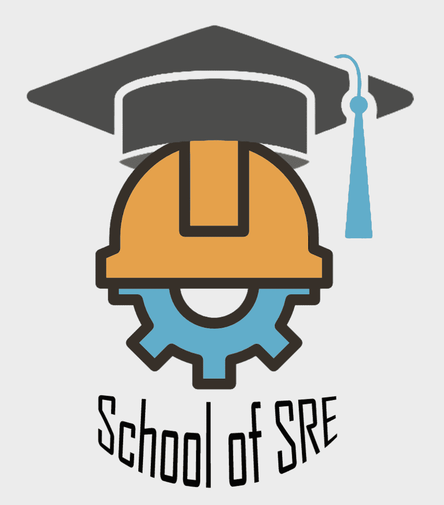

# SRE 学校

> 原文：<https://linkedin.github.io/school-of-sre/>

站点可靠性工程师(SREs)位于软件工程和系统工程的交叉点。虽然基础架构和软件组件如何组合以实现目标可能有无限的排列和组合，但专注于基础技能使 sre 能够处理复杂的系统和软件，无论这些系统是专有的、第三方的、开放的系统，还是运行在云/本地基础架构上的系统，等等。尤其重要的是深入了解系统和基础设施的这些领域是如何相互联系和相互作用的。软件和系统工程技能的结合是罕见的，通常是随着时间的推移，通过接触各种各样的基础设施、系统和软件而建立起来的。

SREs 引入工程实践来维护网站。每个分布式系统都是许多组件的集合。sre 验证业务需求，将它们转换为构成分布式系统的每个组件的 SLA，监控和测量 SLA 的遵守情况，重新构建或扩展以减轻或避免 SLA 违反，将这些学习作为反馈添加到新系统或项目中，从而减少运营负担。因此，从系统设计的第一天起，SREs 就起着至关重要的作用。

2019 年初，我们开始访问印度各地的校园，招募最优秀和最聪明的头脑，以确保 LinkedIn 以及构成其复杂技术堆栈的所有服务始终可供每个人使用。LinkedIn 的这一关键功能属于网站工程团队和网站可靠性工程师(SREs)的职责范围，他们是软件工程师，专门研究可靠性。

随着我们继续这一旅程，我们开始收到来自这些校园的许多问题，关于站点可靠性工程角色到底需要什么？而且，一个人怎样才能学到成为一名成功的现场可靠性工程师所需的技能和纪律呢？几个月过去了，一些校园学生以实习生或全职工程师的身份加入了 LinkedIn，成为网站工程团队的一员；我们也有一些加入我们组织的横向雇员，他们没有传统的 SRE 背景。就在那时，我们几个人聚在一起，开始思考如何让新毕业的工程师加入现场工程团队。

很少有资源可以指导一个人作为 SRE 初学者必须掌握的基本技能。由于缺乏这些资源，我们认为个人很难获得该行业的空缺职位。我们创建了 SRE 学院，作为任何想成为 SRE 人的人的起点。在本课程中，我们将重点培养强大的基础技能。本课程的结构提供了更多真实的例子，以及学习这些主题如何在 SRE 的日常工作职责中发挥重要作用。目前，我们在 SRE 学院下涵盖以下主题:

*   101 级

    *   基础系列
        *   [Linux 基础知识](https://linkedin.github.io/school-of-sre/level101/linux_basics/intro/)
        *   [去](https://linkedin.github.io/school-of-sre/level101/git/git-basics/)
        *   [Linux 联网](https://linkedin.github.io/school-of-sre/level101/linux_networking/intro/)
    *   [Python 和 Web](https://linkedin.github.io/school-of-sre/level101/python_web/intro/)
    *   数据
        *   [关系数据库(MySQL)](https://linkedin.github.io/school-of-sre/level101/databases_sql/intro/)
        *   [NoSQL 概念](https://linkedin.github.io/school-of-sre/level101/databases_nosql/intro/)
        *   [大数据](https://linkedin.github.io/school-of-sre/level101/big_data/intro/)
    *   [系统设计](https://linkedin.github.io/school-of-sre/level101/systems_design/intro/)
    *   [指标和监控](https://linkedin.github.io/school-of-sre/level101/metrics_and_monitoring/introduction/)
    *   [安全](https://linkedin.github.io/school-of-sre/level101/security/intro/)
*   102 级

    *   [Linux 中级](https://linkedin.github.io/school-of-sre/level102/linux_intermediate/introduction/)
    *   Linux 高级
        *   [容器和编排](https://linkedin.github.io/school-of-sre/level102/containerization_and_orchestration/intro/)
        *   [系统调用和信号](https://linkedin.github.io/school-of-sre/level102/system_calls_and_signals/intro/)
    *   [联网](https://linkedin.github.io/school-of-sre/level102/networking/introduction/)
    *   [系统设计](https://linkedin.github.io/school-of-sre/level102/system_design/intro/)
    *   [系统故障排除和性能调优](https://linkedin.github.io/school-of-sre/level102/system_troubleshooting_and_performance/introduction/)
    *   [持续集成和持续交付](https://linkedin.github.io/school-of-sre/level102/continuous_integration_and_continuous_delivery/introduction/)

我们相信持续学习将有助于获得更深层次的知识和能力，以扩展您的技能组合，每个模块都添加了参考资料，可作为进一步学习的指南。我们希望，通过学习这些模块，我们应该能够掌握现场可靠性工程师所需的基本技能。

在 LinkedIn，我们使用这一课程让我们的非传统雇员和新大学毕业生进入 SRE 的角色。我们与新员工进行了多轮成功的入职培训，该课程帮助他们在很短的时间内提高了工作效率。这促使我们开源内容，以帮助其他组织让新工程师进入角色，并为有抱负的个人进入角色提供指导。我们意识到，我们创建的初始内容只是一个起点，我们希望社区能够在完善和扩展内容的过程中提供帮助。查看投稿指南开始吧。