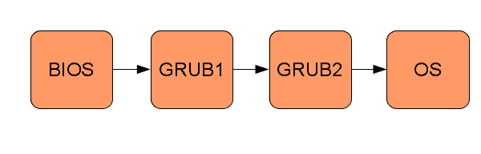
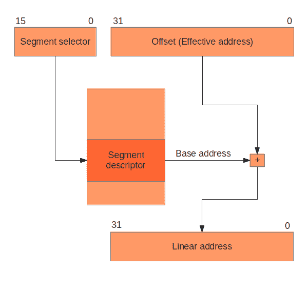
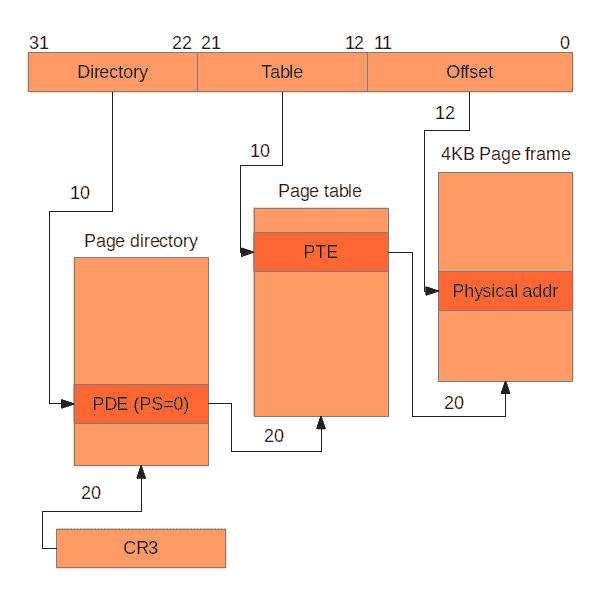

# 操作系统开发的简明指南

> 来源：[`littleosbook.github.io/`](http://littleosbook.github.io/)

# 1 简介

本文是编写您自己的 x86 操作系统的实用指南。它旨在在提供足够的技术细节的同时，不通过示例和代码摘录透露过多。我们试图收集网络上和其他地方大量（且通常很优秀）的材料和教程的部分，并加入我们对遇到和挣扎的问题的见解。

本书不是关于操作系统背后的理论，也不是关于任何特定操作系统（OS）如何工作的。对于操作系统理论，我们推荐安德鲁·坦南鲍姆（Andrew Tanenbaum）的《现代操作系统》（Modern Operating Systems）[1]。有关当前操作系统的列表和详细信息可在互联网上找到。

开头章节相当详细且明确，以便快速进入编码。后面的章节更多地概述了所需内容，因为越来越多的实现和设计取决于读者，此时读者应该对内核开发的世界更加熟悉。在某些章节的末尾，有一些进一步阅读的链接，这些链接可能很有趣，并能对所涵盖的主题有更深入的理解。

在第二章和第三章中，我们设置了我们的开发环境，并在虚拟机中启动了我们的操作系统内核，最终开始用 C 语言编写代码。我们在第四章中继续编写屏幕和串行端口，然后在第五章中深入研究分段，在第六章中探讨中断和输入。

在此之后，我们有一个相当功能但基础薄弱的操作系统内核。在第七章中，我们开始通往用户模式应用程序的道路，通过分页（第八章和第九章）实现虚拟内存，内存分配（第十章），最后在第十一章中运行用户应用程序。

在最后三章中，我们讨论了更高级的主题，包括文件系统（第十二章）、系统调用（第十三章）和多任务处理（第十四章）。

## 1.1 关于本书

操作系统内核和本书是作为瑞典皇家理工学院 [2] 的高级个人课程的一部分产生的。作者之前曾学习过操作系统理论课程，但在操作系统内核开发方面只有很少的实践经验。为了获得更多见解和更深入地理解之前操作系统课程中的理论如何在实践中发挥作用，作者决定创建一门新课程，该课程专注于小型操作系统的开发。该课程的另一个目标是编写一份详尽的教程，介绍如何从头开始基本开发小型操作系统，而这本简短的书就是结果。

x86 架构长期以来一直是最常见的硬件架构之一。选择使用 x86 架构作为操作系统的目标并不困难，因为它拥有庞大的社区、广泛的参考资料和成熟的模拟器。尽管（或许正因为）架构的年龄，我们不得不与之合作的硬件细节的文档和信息并不总是容易找到或理解。

操作系统是在大约六周的全职工作中开发的。实现是通过许多小步骤完成的，并且每完成一步后，操作系统都会手动进行测试。通过这种增量迭代的方式开发，通常更容易找到引入的任何错误，因为自上次已知良好的代码状态以来，只有一小部分代码发生了变化。我们鼓励读者以类似的方式工作。

在六周的开发期间，几乎每一行代码都是由作者共同编写的（这种工作方式也称为 *结对编程*）。我们相信，由于这种开发方式，我们成功地避免了大量错误，但这很难从科学上证明。

## 1.2 读者

本书读者应熟悉 UNIX/Linux、系统编程、C 语言以及计算机系统（例如十六进制表示法 [3]）。这本书可以是开始学习这些内容的一种方式，但会更具挑战性，而开发操作系统本身就是一个挑战。如果你遇到困难，搜索引擎和其他教程通常很有帮助。

## 1.3 学分、感谢和致谢

我们想感谢 OSDev 社区 [4] 他们的优秀维基和有帮助的成员，以及 James Malloy 的杰出内核开发教程 [5]。我们还想感谢我们的导师 Torbjörn Granlund，他的洞察力问题和有趣的讨论。

本书的大部分 CSS 格式化基于 Scott Chacon 为《Pro Git》一书所做的贡献，[`progit.org/`](http://progit.org/)。

## 1.4 贡献者

我们非常感谢人们发送给我们的补丁。以下用户都为本书做出了贡献：

+   [alexschneider](https://github.com/alexschneider)

+   [Avidanborisov](https://github.com/Avidanborisov)

+   [nirs](https://github.com/nirs)

+   [kedarmhaswade](https://github.com/kedarmhaswade)

+   [vamanea](https://github.com/vamanea)

+   [ansjob](https://github.com/ansjob)

## 1.5 变更和修正

本书托管在 Github 上 - 如果您有任何建议、评论或修正，只需将本书 fork，编写您的更改，并向我们发送 pull request。我们将愉快地吸收任何使本书更好的内容。

## 1.6 问题及获取帮助的地方

如果您在阅读本书时遇到问题，请检查 Github 上的问题以获取帮助：[`github.com/littleosbook/littleosbook/issues`](https://github.com/littleosbook/littleosbook/issues)。

## 1.7 许可证

所有内容均受 Creative Commons Attribution Non Commercial Share Alike 3.0 许可协议保护，[`creativecommons.org/licenses/by-nc-sa/3.0/us/`](http://creativecommons.org/licenses/by-nc-sa/3.0/us/)。代码示例属于公有领域 - 您可以随意使用。对本书的引用总是受到热情的欢迎。

# 2 第一步

开发操作系统（OS）绝非易事，在项目过程中，针对不同问题，“我该如何开始解决这个问题？”这个问题可能会多次出现。本章将帮助您设置开发环境并引导一个非常小（且原始）的操作系统。

## 2.1 工具

### 2.1.1 快速设置

我们（作者）已将 Ubuntu [6] 作为操作系统开发的环境，物理和虚拟（使用虚拟机 VirtualBox [7]）运行。快速启动和运行所有内容的方法是使用我们使用的相同设置，因为我们知道这些工具与本书中提供的示例兼容。

安装完 Ubuntu 后，无论是物理安装还是虚拟安装，都应该使用 `apt-get` 安装以下软件包：

```
 sudo apt-get install build-essential nasm genisoimage bochs bochs-sdl
```

### 2.1.2 编程语言

操作系统将使用 C 编程语言 [8][9] 开发，使用 GCC [10]。我们使用 C 是因为开发操作系统需要对生成的代码有非常精确的控制和直接访问内存。也可以使用提供相同功能的其他语言，但本书将仅涵盖 C。

代码将使用 GCC 特定的一种类型属性：

```
 __attribute__((packed))
```

此属性允许我们确保编译器使用与我们在代码中定义的 `struct` 完全相同的内存布局。这将在下一章中详细解释。

由于此属性，示例代码可能难以使用除 GCC 之外的 C 编译器编译。

对于编写汇编代码，我们选择了 NASM [11] 作为汇编器，因为我们更喜欢 NASM 的语法而不是 GNU 汇编器。

本书将使用 Bash [12] 作为脚本语言。

### 2.1.3 主操作系统

所有代码示例都假设代码是在类 UNIX 操作系统上编译的。所有代码示例都已成功使用 Ubuntu [6] 版本 11.04 和 11.10 编译。

### 2.1.4 构建系统

Make [13] 已经被用于构建 Makefile 示例。

### 2.1.5 虚拟机

在开发操作系统时，能够在虚拟机上运行代码而不是在物理计算机上运行，这非常方便，因为将操作系统启动在虚拟机上比将操作系统安装到物理介质上并在物理机器上运行要快得多。Bochs [14] 是一个适用于 x86 (IA-32) 平台的模拟器，由于其调试功能，非常适合操作系统开发。其他流行的选择包括 QEMU [15] 和 VirtualBox [7]。本书使用 Bochs。

通过使用虚拟机，我们无法确保我们的操作系统能在真实的物理硬件上运行。虚拟机模拟的环境被设计得与它们的物理对应物非常相似，只需将可执行文件复制到光盘并找到合适的机器，就可以在虚拟机上测试操作系统。

## 2.2 启动

启动操作系统包括沿着一系列小程序链传递控制权，每个程序都比前一个程序“更强大”，其中操作系统是最后一个“程序”。请参见以下图例，了解启动过程：



启动过程的示例。每个方框都是一个程序。

### 2.2.1 BIOS

当 PC 开机时，计算机将启动一个小程序，该程序遵循 *基本输入输出系统* (BIOS) [16] 标准。这个程序通常存储在 PC 主板上的只读存储芯片中。BIOS 程序的原始作用是为打印到屏幕、读取键盘输入等导出一些库函数。现代操作系统不使用 BIOS 的功能，它们使用直接与硬件交互的驱动程序，绕过 BIOS。今天，BIOS 主要运行一些早期诊断（加电自检）然后将控制权传递给引导加载程序。

### 2.2.2 引导加载程序

BIOS 程序将控制权传递给一个名为 *引导加载程序* 的程序。引导加载程序的任务是将控制权传递给我们，操作系统开发者，以及我们的代码。然而，由于硬件的一些限制¹ 和向后兼容性的原因，引导加载程序通常分为两部分：引导加载程序的第一部分将控制权传递给第二部分，最终将 PC 的控制权交给操作系统。

编写引导加载程序涉及编写大量与 BIOS 交互的低级代码。因此，将使用现有的引导加载程序：GNU GRand Unified Bootloader (GRUB) [17]。

使用 GRUB，操作系统可以被构建为一个普通的 ELF [18] 可执行文件，该文件将由 GRUB 加载到正确的内存位置。内核的编译要求代码在内存中以特定的方式布局（如何编译内核将在本章后面讨论）。

### 2.2.3 操作系统

GRUB 将通过跳转到内存中的某个位置来将控制权传递给操作系统。在跳转之前，GRUB 将寻找一个魔法数字以确保它实际上是在跳转到操作系统而不是一些随机代码。这个魔法数字是 *multiboot 规范* [19] 的一部分，GRUB 遵循这个规范。一旦 GRUB 完成跳转，操作系统将完全控制计算机。

## 2.3 欢迎来到 Cafebabe

本节将描述如何实现可以与 GRUB 一起使用的最小可能的操作系统。操作系统唯一要做的就是将 `0xCAFEBABE` 写入 `eax` 寄存器（大多数人甚至可能不会称这为操作系统）。

### 2.3.1 编译操作系统

由于 C 语言需要栈，而栈不可用（第“如何进入 C”章描述了如何设置栈），这部分操作系统必须用汇编代码编写。将以下代码保存到名为 `loader.s` 的文件中：

```
 global loader                   ; the entry symbol for ELF

    MAGIC_NUMBER equ 0x1BADB002     ; define the magic number constant
    FLAGS        equ 0x0 ; multiboot flags
    CHECKSUM     equ -MAGIC_NUMBER  ; calculate the checksum
                                    ; (magic number + checksum + flags should equal 0)

    section .text:                  ; start of the text (code) section
    align 4                         ; the code must be 4 byte aligned
        dd MAGIC_NUMBER             ; write the magic number to the machine code,
        dd FLAGS                    ; the flags,
        dd CHECKSUM                 ; and the checksum

 loader:                         ; the loader label (defined as entry point in linker script)
        mov eax, 0xCAFEBABE         ; place the number 0xCAFEBABE in the register eax
 .loop:
        jmp .loop                   ; loop forever
```

这个操作系统唯一要做的就是将特定的数字 `0xCAFEBABE` 写入 `eax` 寄存器。如果操作系统没有将这个数字放入 `eax` 寄存器，那么 `0xCAFEBABE` 出现在 `eax` 寄存器中是非常不可能的。

可以使用以下命令将文件 `loader.s` 编译成 32 位 ELF [18] 对象文件：

```
 nasm -f elf32 loader.s
```

### 2.3.2 链接内核

现在必须将代码链接以生成可执行文件，与链接大多数程序相比，这需要更多的思考。我们希望 GRUB 在大于或等于 `0x00100000`（1 兆字节（MB））的内存地址处加载内核，因为低于 1 MB 的地址被 GRUB 本身、BIOS 和内存映射 I/O 使用。因此，需要以下链接脚本（为 GNU LD [20] 编写）：

```
ENTRY(loader)                /* the name of the entry label */

SECTIONS {
    . = 0x00100000;          /* the code should be loaded at 1 MB */

    .text ALIGN (0x1000) :   /* align at 4 KB */
    {
        *(.text)             /* all text sections from all files */
    }

    .rodata ALIGN (0x1000) : /* align at 4 KB */
    {
        *(.rodata*)          /* all read-only data sections from all files */
    }

    .data ALIGN (0x1000) :   /* align at 4 KB */
    {
        *(.data)             /* all data sections from all files */
    }

    .bss ALIGN (0x1000) :    /* align at 4 KB */
    {
        *(COMMON)            /* all COMMON sections from all files */
        *(.bss)              /* all bss sections from all files */
    }
}
```

将链接脚本保存到名为 `link.ld` 的文件中。现在可以使用以下命令将可执行文件链接：

```
 ld -T link.ld -melf_i386 loader.o -o kernel.elf
```

最终的可执行文件将被称为 `kernel.elf`。

### 2.3.3 获取 GRUB

我们将使用 GRUB Legacy 版本，因为这样可以在同时使用 GRUB Legacy 和 GRUB 2 的系统上生成 OS ISO 镜像。更具体地说，将使用 GRUB Legacy 的 `stage2_eltorito` 引导加载程序。此文件可以从 GRUB 0.97 的源代码中构建，通过从 ftp://alpha.gnu.org/gnu/grub/grub-0.97.tar.gz 下载源代码。然而，`configure` 脚本在 Ubuntu [21] 上运行不佳，因此可以从[`littleosbook.github.com/files/stage2_eltorito`](http://littleosbook.github.com/files/stage2_eltorito)下载二进制文件。将文件 `stage2_eltorito` 复制到已包含 `loader.s` 和 `link.ld` 的文件夹中。

### 2.3.4 构建 ISO 镜像

可执行文件必须放置在可以被虚拟机或物理机加载的媒体上。在这本书中，我们将使用 ISO [22] 镜像文件作为媒体，但也可以根据虚拟机或物理机支持的情况使用软盘镜像。

我们将使用 `genisoimage` 程序创建内核 ISO 图像。首先必须创建一个包含 ISO 图像上文件的文件夹。以下命令创建了文件夹并将文件复制到正确的位置：

```
 mkdir -p iso/boot/grub              # create the folder structure
    cp stage2_eltorito iso/boot/grub/   # copy the bootloader
    cp kernel.elf iso/boot/             # copy the kernel
```

必须创建一个用于 GRUB 的配置文件 `menu.lst`。此文件告诉 GRUB 内核的位置并配置一些选项：

```
 default=0
    timeout=0

    title os
    kernel /boot/kernel.elf
```

将文件 `menu.lst` 放入文件夹 `iso/boot/grub/` 中。现在 `iso` 文件夹的内容应该如下所示：

```
 iso
    |-- boot
      |-- grub
      | |-- menu.lst
      | |-- stage2_eltorito
      |-- kernel.elf
```

然后，可以使用以下命令生成 ISO 图像：

```
 genisoimage -R                              \
                -b boot/grub/stage2_eltorito    \
                -no-emul-boot                   \
                -boot-load-size 4               \
                -A os                           \
                -input-charset utf8             \
                -quiet                          \
                -boot-info-table                \
                -o os.iso                       \
                iso
```

有关命令中使用的标志的更多信息，请参阅 `genisoimage` 的手册。

ISO 图像 `os.iso` 现在包含内核可执行文件、GRUB 引导加载程序和配置文件。

### 2.3.5 运行 Bochs

现在，我们可以使用 `os.iso` ISO 图像在 Bochs 模拟器中运行操作系统。Bochs 需要一个配置文件才能启动，下面提供了一个简单配置文件的示例：

```
 megs:            32
    display_library: sdl
    romimage:        file=/usr/share/bochs/BIOS-bochs-latest
    vgaromimage:     file=/usr/share/bochs/VGABIOS-lgpl-latest
    ata0-master:     type=cdrom, path=os.iso, status=inserted
    boot:            cdrom
    log:             bochslog.txt
    clock:           sync=realtime, time0=local
    cpu:             count=1, ips=1000000
```

您可能需要根据您安装 Bochs 的方式更改 `romimage` 和 `vgaromimage` 的路径。有关 Bochs 配置文件的更多信息，可以在 Boch 的网站上找到 [23]。

如果您将配置保存到名为 `bochsrc.txt` 的文件中，则可以使用以下命令运行 Bochs：

```
 bochs -f bochsrc.txt -q
```

标志 `-f` 告诉 Bochs 使用给定的配置文件，而标志 `-q` 告诉 Bochs 跳过交互式启动菜单。现在您应该看到 Bochs 正在启动并显示一个带有 GRUB 信息的控制台。

退出 Bochs 后，显示 Boch 生成的日志：

```
 cat bochslog.txt
```

您现在应该在输出中看到由 Bochs 模拟的 CPU 寄存器的内容。如果您在输出中找到 `RAX=00000000CAFEBABE` 或 `EAX=CAFEBABE`（取决于您是否以 64 位支持运行 Bochs），那么您的操作系统已成功引导！

## 2.4 进一步阅读

+   Gustavo Duertes 撰写了一篇深入的文章，关于 x86 计算机启动时实际发生的事情，[`duartes.org/gustavo/blog/post/how-computers-boot-up`](http://duartes.org/gustavo/blog/post/how-computers-boot-up)

+   Gustavo 继续描述内核在[`duartes.org/gustavo/blog/post/kernel-boot-process`](http://duartes.org/gustavo/blog/post/kernel-boot-process)的非常早期的阶段所做的工作

+   OSDev 维基还包含了一篇关于如何引导 x86 计算机的优秀文章：[`wiki.osdev.org/Boot_Sequence`](http://wiki.osdev.org/Boot_Sequence)

# 3 进入 C 语言

本章将向您展示如何使用 C 语言而不是汇编代码作为操作系统的编程语言。汇编语言非常适合与 CPU 交互，并允许对代码的各个方面进行最大程度的控制。然而，至少对于作者来说，C 语言是一个更方便使用的语言。因此，我们希望尽可能多地使用 C 语言，并且只在有意义的场合使用汇编代码。

## 3.1 设置堆栈

使用 C 的一个先决条件是有一个栈，因为所有非平凡的 C 程序都使用栈。设置栈并不比将`esp`寄存器指向一块正确对齐的空闲内存区域的末尾更难（记住，在 x86 上栈是向低地址增长的）。从性能角度考虑，建议对齐在 4 字节上。

我们可以将`esp`指向内存中的任意区域，因为到目前为止，内存中只有 GRUB、BIOS、操作系统内核和一些内存映射 I/O。这不是一个好主意——我们不知道有多少内存可用，或者`esp`指向的区域是否被其他东西使用。更好的办法是在内核的 ELF 文件中的`.bss`部分预留一块未初始化的内存。使用`.bss`部分而不是`.data`部分来减少操作系统可执行文件的大小更好。因为 GRUB 理解 ELF，所以 GRUB 在加载操作系统时将分配在`.bss`部分预留的任何内存。

NASM 伪指令`resb`[24]可以用来声明未初始化的数据：

```
 KERNEL_STACK_SIZE equ 4096                  ; size of stack in bytes

    section .bss
    align 4                                     ; align at 4 bytes
 kernel_stack:                               ; label points to beginning of memory
        resb KERNEL_STACK_SIZE                  ; reserve stack for the kernel
```

对于栈的使用，无需担心未初始化内存，因为不可能读取尚未写入的栈位置（除非手动操作指针）。一个（正确）的程序不能在没有先向栈中推入元素的情况下从栈中弹出元素。因此，栈的内存位置在读取之前总是会被写入。

然后将栈指针设置为将`esp`指向`kernel_stack`内存的末尾：

```
 mov esp, kernel_stack + KERNEL_STACK_SIZE   ; point esp to the start of the
                                                ; stack (end of memory area)
```

## 3.2 从汇编语言调用 C 代码

下一步是从汇编代码中调用 C 函数。关于如何从汇编代码中调用 C 代码有许多不同的约定[25]。本书使用*cdecl*调用约定，因为这是 GCC 使用的约定。cdecl 调用约定指出，函数的参数应通过栈（在 x86 上）传递。函数的参数应按从右到左的顺序推入栈中，即首先推入最右边的参数。函数的返回值放在`eax`寄存器中。以下代码展示了示例：

```
 /* The C function */
    int sum_of_three(int arg1, int arg2, int arg3)
    {
        return arg1 + arg2 + arg3;
    }
```

```
 ; The assembly code
    external sum_of_three   ; the function sum_of_three is defined elsewhere

    push dword 3            ; arg3
    push dword 2            ; arg2
    push dword 1            ; arg1
    call sum_of_three       ; call the function, the result will be in eax
```

### 3.2.1 打包结构体

在本书的其余部分，你经常会遇到“配置字节”，它们是一系列按特定顺序排列的位。以下是一个 32 位的示例：

```
Bit:     | 31     24 | 23          8 | 7     0 |
Content: | index     | address       | config  |
```

而不是使用无符号整数`unsigned int`来处理此类配置，使用“打包结构”会更方便：

```
 struct example {
        unsigned char config;   /* bit 0 - 7   */
        unsigned short address; /* bit 8 - 23  */
        unsigned char index;    /* bit 24 - 31 */
    };
```

当在前面示例中使用 `struct` 时，无法保证 `struct` 的大小正好是 32 位 - 编译器可能会出于各种原因在元素之间添加一些填充，例如为了加快元素访问速度或由于硬件和/或编译器的要求。当使用 `struct` 来表示配置字节时，非常重要的一点是编译器**不**添加任何填充，因为硬件最终会将 `struct` 作为 32 位无符号整数处理。可以使用 `packed` 属性来强制 GCC **不**添加任何填充：

```
 struct example {
        unsigned char config;   /* bit 0 - 7   */
        unsigned short address; /* bit 8 - 23  */
        unsigned char index;    /* bit 24 - 31 */
    } __attribute__((packed));
```

注意，`__attribute__((packed))` 不是 C 标准的一部分 - 它可能不适用于所有 C 编译器。

## 3.3 编译 C 代码

当编译操作系统的 C 代码时，需要使用很多 GCC 标志。这是因为 C 代码**不应**假设标准库的存在，因为我们的操作系统没有可用的标准库。有关标志的更多信息，请参阅 GCC 手册。

编译 C 代码时使用的标志是：

```
 -m32 -nostdlib -nostdinc -fno-builtin -fno-stack-protector -nostartfiles
    -nodefaultlibs
```

正如编写 C 程序时始终推荐的那样，我们建议打开所有警告并将警告视为错误：

```
 -Wall -Wextra -Werror
```

现在，你可以在名为 `kmain.c` 的文件中创建一个名为 `kmain` 的函数，然后从 `loader.s` 中调用它。在这个阶段，`kmain` 可能不需要任何参数（但在后面的章节中将会需要）。

## 3.4 构建工具

现在可能也是设置一些构建工具的好时机，以便更容易编译和测试运行操作系统。我们建议使用 `make` [13]，但还有许多其他构建系统可供选择。操作系统的一个简单 Makefile 示例可能如下所示：

```
 OBJECTS = loader.o kmain.o
    CC = gcc
    CFLAGS = -m32 -nostdlib -nostdinc -fno-builtin -fno-stack-protector \
             -nostartfiles -nodefaultlibs -Wall -Wextra -Werror -c
    LDFLAGS = -T link.ld -melf_i386
    AS = nasm
    ASFLAGS = -f elf

    all: kernel.elf

    kernel.elf: $(OBJECTS)
        ld $(LDFLAGS) $(OBJECTS) -o kernel.elf

    os.iso: kernel.elf
        cp kernel.elf iso/boot/kernel.elf
        genisoimage -R                              \
                    -b boot/grub/stage2_eltorito \
                    -no-emul-boot \
                    -boot-load-size 4 \
                    -A os \
                    -input-charset utf8 \
                    -quiet \
                    -boot-info-table \
                    -o os.iso \
                    iso

    run: os.iso
        bochs -f bochsrc.txt -q

    %.o: %.c
        $(CC) $(CFLAGS)  $< -o $@

    %.o: %.s
        $(AS) $(ASFLAGS) $< -o $@

    clean:
        rm -rf *.o kernel.elf os.iso
```

你的工作目录内容现在应该看起来像以下图示：

```
 .
    |-- bochsrc.txt
    |-- iso
    |   |-- boot
    |     |-- grub
    |       |-- menu.lst
    |       |-- stage2_eltorito
    |-- kmain.c
    |-- loader.s
    |-- Makefile
```

现在，你应该能够使用简单的命令 `make run` 启动操作系统，该命令将编译内核并在 Bochs 中启动它（如上方的 Makefile 中定义）。

## 3.5 进一步阅读

+   Kernighan 和 Ritchie 的书，*《C 程序设计语言（第二版）》，[8]*，非常适合学习 C 的各个方面。

# 4 输出

本章将介绍如何在控制台上显示文本以及将数据写入串行端口。此外，我们还将创建我们的第一个 *驱动程序*，即作为内核和硬件之间层的代码，提供比直接与硬件通信更高的抽象。本章的第一部分是关于创建一个用于 *framebuffer* [26] 的驱动程序，以便能够在控制台上显示文本。第二部分展示了如何创建串行端口的驱动程序。Bochs 可以将串行端口的输出存储在文件中，从而为操作系统创建一个日志机制。

## 4.1 与硬件交互

与硬件交互通常有两种不同的方式，*内存映射 I/O* 和 *I/O 端口*。

如果硬件使用内存映射 I/O，则可以写入特定的内存地址，硬件将使用新数据更新。一个例子是帧缓冲区，稍后将更详细地讨论。例如，如果将值`0x410F`写入地址`0x000B8000`，你将看到白色背景上的字母 A（有关更多详细信息，请参阅帧缓冲区部分）。

如果硬件使用 I/O 端口，则必须使用汇编代码指令`out`和`in`与硬件通信。指令`out`有两个参数：I/O 端口的地址和要发送的数据。指令`in`有一个参数，即 I/O 端口的地址，并从硬件返回数据。可以将 I/O 端口视为与硬件通信的方式，就像使用套接字与服务器通信一样。帧缓冲区（闪烁的矩形）的光标是 PC 上通过 I/O 端口控制的硬件的一个例子。

## 4.2 帧缓冲区

帧缓冲区是一个能够将内存缓冲区显示在屏幕上的硬件设备 [26]。帧缓冲区有 80 列和 25 行，行和列的索引从 0 开始（因此行被标记为 0 - 24）。

### 4.2.1 写入文本

通过帧缓冲区将文本写入控制台是通过内存映射 I/O 完成的。帧缓冲区内存映射 I/O 的起始地址是`0x000B8000` [27]。内存被划分为 16 位单元，其中 16 位决定了字符、前景色和背景色。最高的 8 位是字符的 ASCII [28]值，位 7 - 4 是背景色，位 3 - 0 是前景色，如下面的图所示：

```
Bit:     | 15 14 13 12 11 10 9 8 | 7 6 5 4 | 3 2 1 0 |
Content: | ASCII                 | FG      | BG      |
```

可用的颜色显示在下表中：

| 颜色 | 值 | 颜色 | 值 | 颜色 | 值 | 颜色 | 值 |
| --: | :-- | --: | :-- | --: | :-- | --: | :-- |
| 黑色 | 0 | 红色 | 4 | 暗灰色 | 8 | 淡红色 | 12 |
| 蓝色 | 1 | 品红色 | 5 | 淡蓝色 | 9 | 淡品红色 | 13 |
| 绿色 | 2 | 棕色 | 6 | 淡绿色 | 10 | 淡棕色 | 14 |
| 青色 | 3 | 淡灰色 | 7 | 淡青色 | 11 | 白色 | 15 |

第一个单元对应于控制台上的第 0 行，第 0 列。使用 ASCII 表，可以看到 A 对应于 65 或`0x41`。因此，要在位置（0,0）使用绿色前景色（2）和深灰色背景色（8）写入字符 A，可以使用以下汇编代码指令：

```
 mov [0x000B8000], 0x4128
```

第二个单元对应于第 0 行，第 1 列，因此其地址是：

```
 0x000B8000 + 16 = 0x000B8010
```

通过将地址`0x000B8000`视为字符指针，`char *fb = (char *) 0x000B8000`，也可以在 C 语言中写入帧缓冲区。然后，使用绿色前景色（2）和深灰色背景色（8）在位置（0,0）写入字符 A，如下所示：

```
 fb[0] = 'A';
    fb[1] = 0x28;
```

以下代码显示了如何将其封装成函数：

```
 /** fb_write_cell:
 *  Writes a character with the given foreground and background to position i
 *  in the framebuffer.
 *
 * @param  i The location in the framebuffer
 * @param  c The character
 * @param  fg The foreground color
 * @param  bg The background color
 */
    void fb_write_cell(unsigned int i, char c, unsigned char fg, unsigned char bg)
    {
        fb[i] = c;
        fb[i + 1] = ((fg & 0x0F) << 4) | (bg & 0x0F)
    }
```

然后可以使用该函数如下：

```
 #define FB_GREEN     2
    #define FB_DARK_GREY 8

    fb_write_cell(0, 'A', FB_GREEN, FB_DARK_GREY);
```

### 4.2.2 移动光标

通过两个不同的 I/O 端口移动帧缓冲区的光标。光标的位置由一个 16 位整数确定：0 表示第一行，第一列；1 表示第一行，第二列；80 表示第二行，第一列，依此类推。由于位置是 16 位大小，而`out`汇编代码指令的参数是 8 位，因此位置必须分两次发送，首先发送 8 位，然后发送下一个 8 位。帧缓冲区有两个 I/O 端口，一个用于接收数据，一个用于描述接收到的数据。端口`0x3D4`[29]是描述数据的端口，端口`0x3D5`[29]是用于数据本身的端口。

要将光标设置在第一行，第一列（位置`80 = 0x0050`），可以使用以下汇编代码指令：

```
 out 0x3D4, 14      ; 14 tells the framebuffer to expect the highest 8 bits of the position
    out 0x3D5, 0x00 ; sending the highest 8 bits of 0x0050
    out 0x3D4, 15      ; 15 tells the framebuffer to expect the lowest 8 bits of the position
    out 0x3D5, 0x50 ; sending the lowest 8 bits of 0x0050
```

`out`汇编代码指令不能直接在 C 语言中执行。因此，将`out`封装在汇编代码中的函数是一个好主意，该函数可以通过 cdecl 调用约定从 C 语言访问[25]：

```
 global outb             ; make the label outb visible outside this file

    ; outb - send a byte to an I/O port
    ; stack: [esp + 8] the data byte
    ;        [esp + 4] the I/O port
    ;        [esp    ] return address
 outb:
        mov al, [esp + 8]    ; move the data to be sent into the al register
        mov dx, [esp + 4]    ; move the address of the I/O port into the dx register
        out dx, al           ; send the data to the I/O port
        ret                  ; return to the calling function
```

通过将此函数存储在名为`io.s`的文件中，并创建一个头文件`io.h`，可以方便地从 C 语言中访问`out`汇编代码指令：

```
 #ifndef INCLUDE_IO_H
    #define INCLUDE_IO_H

    /** outb:
 *  Sends the given data to the given I/O port. Defined in io.s
 *
 * @param  port The I/O port to send the data to
 * @param  data The data to send to the I/O port
 */
    void outb(unsigned short port, unsigned char data);

    #endif /* INCLUDE_IO_H */
```

现在可以将移动光标的功能封装在一个 C 函数中：

```
 #include "io.h"

    /* The I/O ports */
    #define FB_COMMAND_PORT         0x3D4
    #define FB_DATA_PORT            0x3D5

    /* The I/O port commands */
    #define FB_HIGH_BYTE_COMMAND    14
    #define FB_LOW_BYTE_COMMAND     15

    /** fb_move_cursor:
 *  Moves the cursor of the framebuffer to the given position
 *
 * @param  pos The new position of the cursor
 */
    void fb_move_cursor(unsigned short pos)
    {
        outb(FB_COMMAND_PORT, FB_HIGH_BYTE_COMMAND);
        outb(FB_DATA_PORT,    ((pos >> 8) & 0x00FF));
        outb(FB_COMMAND_PORT, FB_LOW_BYTE_COMMAND);
        outb(FB_DATA_PORT,    pos & 0x00FF);
    }
```

### 4.2.3 驱动程序

驱动程序应提供一个接口，供操作系统中的其余代码用于与帧缓冲区交互。接口应提供什么功能没有对错之分，但建议有一个具有以下声明的`write`函数：

```
 int write(char *buf, unsigned int len);
```

`write`函数将长度为`len`的缓冲区`buf`的内容写入屏幕。`write`函数应在写入字符后自动移动光标，并在必要时滚动屏幕。

## 4.3 串行端口

串行端口[30]是硬件设备之间通信的接口，尽管它几乎存在于所有主板上，但现在很少以 DE-9 连接器的形式向用户暴露。串行端口易于使用，更重要的是，它可以用作 Bochs 中的日志工具。如果计算机支持串行端口，那么它通常也支持多个串行端口，但我们将只使用一个端口。这是因为我们只将串行端口用于日志记录。此外，我们只将串行端口用于输出，而不是输入。串行端口完全通过 I/O 端口进行控制。

### 4.3.1 配置串行端口

需要发送到串行端口的第一份数据是配置数据。为了使两个硬件设备能够相互通信，它们必须就一些事项达成一致。这些事项包括：

+   发送数据时使用的速度（位或波特率）

+   是否应对数据进行错误检查（奇偶校验位，停止位）

+   表示数据单元的位数（数据位）

### 4.3.2 配置线路

配置线路意味着配置数据通过线路发送的方式。串行端口有一个 I/O 端口，即*线路命令端口*，用于配置。

首先，将设置发送数据的速度。串行端口有一个内部时钟，以 115200 Hz 的速度运行。设置速度意味着向串行端口发送一个除数，例如发送 2 的结果是速度为 `115200 / 2 = 57600` Hz。

除数是一个 16 位数字，但我们一次只能发送 8 位。因此，我们必须发送一个指令告诉串行端口首先期望最高 8 位，然后是最低 8 位。这是通过向线路命令端口发送 `0x80` 来完成的。以下是一个示例：

```
 #include "io.h" /* io.h is implement in the section "Moving the cursor" */

    /* The I/O ports */

    /* All the I/O ports are calculated relative to the data port. This is because
 * all serial ports (COM1, COM2, COM3, COM4) have their ports in the same
 * order, but they start at different values.
 */

    #define SERIAL_COM1_BASE                0x3F8 /* COM1 base port */

    #define SERIAL_DATA_PORT(base)          (base)
    #define SERIAL_FIFO_COMMAND_PORT(base)  (base + 2)
    #define SERIAL_LINE_COMMAND_PORT(base)  (base + 3)
    #define SERIAL_MODEM_COMMAND_PORT(base) (base + 4)
    #define SERIAL_LINE_STATUS_PORT(base)   (base + 5)

    /* The I/O port commands */

    /* SERIAL_LINE_ENABLE_DLAB:
 * Tells the serial port to expect first the highest 8 bits on the data port,
 * then the lowest 8 bits will follow
 */
    #define SERIAL_LINE_ENABLE_DLAB         0x80

    /** serial_configure_baud_rate:
 *  Sets the speed of the data being sent. The default speed of a serial
 *  port is 115200 bits/s. The argument is a divisor of that number, hence
 *  the resulting speed becomes (115200 / divisor) bits/s.
 *
 * @param  com The COM port to configure
 * @param  divisor The divisor
 */
    void serial_configure_baud_rate(unsigned short com, unsigned short divisor)
    {
        outb(SERIAL_LINE_COMMAND_PORT(com),
             SERIAL_LINE_ENABLE_DLAB);
        outb(SERIAL_DATA_PORT(com),
             (divisor >> 8) & 0x00FF);
        outb(SERIAL_DATA_PORT(com),
             divisor & 0x00FF);
    }
```

数据应如何发送必须进行配置。这也是通过发送一个字节到线路命令端口来完成的。8 位的布局如下所示：

```
Bit:     | 7 | 6 | 5 4 3 | 2 | 1 0 |
Content: | d | b | prty  | s | dl  |
```

每个名称的描述可以在下表找到（并在[31]中）：

| 名称 | 描述 |
| --: | :-- |
| d | 启用（d = 1）或禁用（d = 0）DLAB |
| b | 如果启用断开控制（b = 1）或禁用（b = 0） |
| prty | 要使用的奇偶校验位数 |
| s | 要使用的停止位数（s = 0 等于 1，s = 1 等于 1.5 或 2） |
| dl | 描述数据长度 |

我们将使用大多数标准的值 `0x03` [31]，这意味着 8 位长度，无奇偶校验位，一个停止位，禁用断开控制。这被发送到线路命令端口，如下面的示例所示：

```
 /** serial_configure_line:
 *  Configures the line of the given serial port. The port is set to have a
 *  data length of 8 bits, no parity bits, one stop bit and break control
 *  disabled.
 *
 * @param  com The serial port to configure
 */
    void serial_configure_line(unsigned short com)
    {
        /* Bit:     | 7 | 6 | 5 4 3 | 2 | 1 0 |
 * Content: | d | b | prty  | s | dl  |
 * Value:   | 0 | 0 | 0 0 0 | 0 | 1 1 | = 0x03
 */
        outb(SERIAL_LINE_COMMAND_PORT(com), 0x03);
    }
```

OSDev [31] 上的文章对值有更深入的说明。

### 4.3.3 配置缓冲区

当通过串行端口传输数据时，它会被放置在缓冲区中，无论是接收还是发送数据。这样，如果您以比串行端口通过电线发送数据更快的速度发送数据，它将被缓冲。然而，如果您发送太多数据，并且发送得太快，缓冲区将满，数据将丢失。换句话说，缓冲区是 FIFO 队列。FIFO 队列配置字节看起来如下所示：

```
Bit:     | 7 6 | 5  | 4 | 3   | 2   | 1   | 0 |
Content: | lvl | bs | r | dma | clt | clr | e |
```

每个名称的描述可以在下表找到：

| 名称 | 描述 |
| --: | :-- |
| lvl | 应存储在 FIFO 缓冲区中的字节数 |
| bs | 如果缓冲区应为 16 或 64 字节大小 |
| r | 保留供将来使用 |
| dma | 串行端口数据应如何访问 |
| clt | 清除传输 FIFO 缓冲区 |
| clr | 清除接收器 FIFO 缓冲区 |
| e | 如果 FIFO 缓冲区应启用或禁用 |

我们使用值 `0xC7 = 11000111`，该值：

+   启用 FIFO

+   清除接收器和传输 FIFO 队列

+   使用 14 字节作为队列大小

WikiBook 上的串行编程[32]对值有更深入的说明。

### 4.3.4 配置调制解调器

调制解调器控制寄存器用于通过就绪发送（RTS）和数据终端就绪（DTR）引脚进行非常简单的硬件流控制。当配置串行端口时，我们希望 RTS 和 DTR 为 1，这意味着我们已准备好发送数据。

调制解调器配置字节如下所示：

```
Bit:     | 7 | 6 | 5  | 4  | 3   | 2   | 1   | 0   |
Content: | r | r | af | lb | ao2 | ao1 | rts | dtr |
```

每个名称的描述可以在下表找到：

| 名称 | 描述 |
| --: | :-- |
| r | 保留 |
| af | 启用自动流控制 |
| lb | 环回模式（用于调试串行端口） |
| ao2 | 辅助输出 2，用于接收中断 |
| ao1 | 辅助输出 1 |
| rts | 准备传输 |
| dtr | 数据终端就绪 |

我们不需要启用中断，因为我们不会处理任何接收到的数据。因此，我们使用配置值`0x03 = 00000011`（RTS = 1 和 DTS = 1）。

### 4.3.5 向串行端口写入数据

向串行端口写入数据是通过数据 I/O 端口完成的。然而，在写入之前，必须确保发送 FIFO 队列为空（所有之前的写入都必须完成）。如果线路状态 I/O 端口的第 5 位等于 1，则发送 FIFO 队列为空。

通过`in`汇编代码指令读取 I/O 端口的 内容。无法从 C 中使用`in`汇编代码指令，因此必须将其包装（与`out`汇编代码指令相同的方式）：

```
 global inb

    ; inb - returns a byte from the given I/O port
    ; stack: [esp + 4] The address of the I/O port
    ;        [esp    ] The return address
 inb:
        mov dx, [esp + 4]       ; move the address of the I/O port to the dx register
        in  al, dx              ; read a byte from the I/O port and store it in the al register
        ret                     ; return the read byte
```

```
 /* in file io.h */

    /** inb:
 *  Read a byte from an I/O port.
 *
 * @param  port The address of the I/O port
 * @return The read byte
 */
    unsigned char inb(unsigned short port);
```

可以从 C 中检查发送 FIFO 是否为空：

```
 #include "io.h"

    /** serial_is_transmit_fifo_empty:
 *  Checks whether the transmit FIFO queue is empty or not for the given COM
 *  port.
 *
 * @param  com The COM port
 * @return 0 if the transmit FIFO queue is not empty
 *          1 if the transmit FIFO queue is empty
 */
    int serial_is_transmit_fifo_empty(unsigned int com)
    {
        /* 0x20 = 0010 0000 */
        return inb(SERIAL_LINE_STATUS_PORT(com)) & 0x20;
    }
```

向串行端口写入意味着只要发送 FIFO 队列不为空，就需要持续旋转，然后将数据写入数据 I/O 端口。

### 4.3.6 配置 Bochs

要保存第一个串行端口的输出，必须更新 Bochs 配置文件`bochsrc.txt`。`com1`配置指示 Bochs 如何处理第一个串行端口：

```
 com1: enabled=1, mode=file, dev=com1.out
```

现在串行端口一的输出将存储在文件`com1.out`中。

### 4.3.7 驱动程序

我们建议您为串行端口实现一个类似于驱动程序中`write`函数的`write`函数。为了避免与帧缓冲区的`write`函数名称冲突，将函数命名为`fb_write`和`serial_write`是一个好主意，以区分它们。

我们还建议您尝试编写一个类似于`printf`的函数，参见[8]中的第 7.3 节。`printf`函数可以接受一个额外的参数来决定输出到哪个设备（帧缓冲区或串行）。

最后的建议是，您创建一种方法来区分日志消息的严重性，例如通过在消息前添加`DEBUG`、`INFO`或`ERROR`。

## 4.4 进一步阅读

+   书籍《串行编程》（可在 WikiBooks 上找到）有一个关于串行端口编程的精彩部分，[`en.wikibooks.org/wiki/Serial_Programming/8250_UART_Programming#UART_Registers`](http://en.wikibooks.org/wiki/Serial_Programming/8250_UART_Programming#UART_Registers)

+   OSDev wiki 有一个包含大量关于串行端口信息的页面，[`wiki.osdev.org/Serial_ports`](http://wiki.osdev.org/Serial_ports)

# 5. 分段

在 x86 中，**分段**意味着通过段来访问内存。段是地址空间的一部分，可能是重叠的，由一个基址和一个限制来指定。要定位分段内存中的一个字节，你使用一个 48 位的**逻辑地址**：16 位指定段，32 位指定你想要在该段内的偏移量。这个偏移量加到段的基址上，得到的结果线性地址与段的限制进行比较 - 见下面的图。如果一切正常（包括现在忽略的访问权限检查）的结果是一个**线性地址**。当禁用分页时，线性地址空间 1:1 映射到**物理地址**空间，可以访问物理内存。（参见“分页”章节了解如何启用分页。）



逻辑地址到线性地址的转换。

要启用分段，你需要设置一个描述每个段的表 - 一个**段描述符表**。在 x86 架构中，有两种类型的描述符表：**全局描述符表**（GDT）和**局部描述符表**（LDT）。LDT 由用户空间进程设置和管理，每个进程都有自己的 LDT。如果需要更复杂的分段模型，可以使用 LDT - 我们不会使用它。GDT 是大家共用的 - 它是全局的。

正如我们在虚拟内存和分页章节中讨论的那样，分段在大多数情况下很少被使用，类似于我们下面所做的那样。

## 5.1 访问内存

在访问内存的大多数时候，没有必要显式指定要使用的段。处理器有六个 16 位的段寄存器：`cs`、`ss`、`ds`、`es`、`gs`和`fs`。寄存器`cs`是代码段寄存器，用于获取指令时指定要使用的段。寄存器`ss`在访问堆栈（通过堆栈指针`esp`）时使用，而`ds`用于其他数据访问。操作系统可以自由地使用寄存器`es`、`gs`和`fs`。

下面是一个显示隐式使用段寄存器的示例：

```
 func:
        mov eax, [esp+4]
        mov ebx, [eax]
        add ebx, 8
        mov [eax], ebx
        ret
```

上述示例可以与以下一个显式使用段寄存器的示例进行比较：

```
 func:
        mov eax, [ss:esp+4]
        mov ebx, [ds:eax]
        add ebx, 8
        mov [ds:eax], ebx
        ret
```

你不需要使用`ss`来存储堆栈段选择符，或`ds`来存储数据段选择符。你可以将堆栈段选择符存储在`ds`中，反之亦然。然而，为了使用上面显示的隐式样式，你必须将段选择符存储在其缩进的寄存器中。

段描述符及其字段在英特尔手册[33]的第 3-8 图中有描述。

## 5.2 全局描述符表（GDT）

GDT/LDT 是一个 8 字节段描述符的数组。GDT 中的第一个描述符始终是空描述符，并且永远不能用于访问内存。GDT 至少需要两个段描述符（加上空描述符），因为描述符包含的信息不仅仅是基址和界限字段。对我们来说，最相关的两个字段是*类型*字段和*描述符特权级*（DPL）字段。

Intel 手册[33]第三章的表 3-1 指定了类型字段的值。该表显示类型字段不能同时是可写和可执行的。因此，需要两个段：一个用于执行代码并将其放入`cs`（类型为仅执行或执行-读取）的段，另一个用于读取和写入数据（类型为读/写）并将其放入其他段寄存器。

DPL 指定使用该段所需的*特权级*。x86 允许四个特权级（PL），0 到 3，其中 PL0 是最特权的。在大多数操作系统（例如 Linux 和 Windows）中，仅使用 PL0 和 PL3。然而，一些操作系统（如 MINIX）使用所有级别。内核应该能够做任何事情，因此它使用 DPL 设置为 0 的段（也称为内核模式）。当前特权级（CPL）由`cs`中的段选择符确定。

下表中描述了所需的段。

需要的段描述符。

| 索引 | 偏移量 | 名称 | 地址范围 | 类型 | DPL |
| --: | --: | :-- | :-- | :-- | :-- |
| 0 | `0x00` | 空描述符 |  |  |  |
| 1 | `0x08` | 内核代码段 | `0x00000000 - 0xFFFFFFFF` | RX | PL0 |
| 2 | `0x10` | 内核数据段 | `0x00000000 - 0xFFFFFFFF` | RW | PL0 |

注意，段重叠 - 它们都包含整个线性地址空间。在我们的最小设置中，我们只会使用分段来获取特权级。有关其他描述符字段的详细信息，请参阅 Intel 手册[33]第三章。

## 5.3 加载 GDT

使用`lgdt`汇编代码指令将 GDT 加载到处理器中，该指令接受一个结构体的地址，该结构体指定 GDT 的起始地址和大小。最简单的方法是使用以下示例中的“打包结构”来编码此信息：

```
 struct gdt {
        unsigned int address;
        unsigned short size;
    } __attribute__((packed));
```

如果`eax`寄存器的内容是此类结构的地址，则可以使用以下汇编代码将 GDT 加载：

```
 lgdt [eax]
```

如果您能从 C 中提供此指令，就像对汇编代码指令`in`和`out`所做的那样，可能会更容易。

加载 GDT 后，需要将段寄存器加载为其对应的段选择符。段选择符的内容在下图和下表中描述：

```
Bit:     | 15                                3 | 2  | 1 0 |
Content: | offset (index)                      | ti | rpl |
```

段选择符的布局。

| 名称 | 描述 |
| :-- | :-- |
| rpl | 请求的特权级 - 目前我们希望在 PL0 级别执行。 |
| ti | 表指示符。0 表示指定 GDT 段，1 表示 LDT 段。 |
| 偏移（索引） | 描述符表内的偏移量。 |

段选择符的偏移量加到 GDT 的起始位置，以获得段描述符的地址：第一个描述符为 `0x08`，第二个为 `0x10`，因为每个描述符是 8 字节。请求的特权级（RPL）应该是 `0`，因为操作系统的内核应该在特权级 0 上执行。

加载段选择符寄存器对于数据寄存器来说很容易——只需将正确的偏移量复制到寄存器中：

```
 mov ds, 0x10
    mov ss, 0x10
    mov es, 0x10
    .
    .
    .
```

要加载 `cs`，我们必须执行一个“远跳”：

```
 ; code here uses the previous cs
    jmp 0x08:flush_cs   ; specify cs when jumping to flush_cs

 flush_cs:
        ; now we've changed cs to 0x08
```

远跳是一种显式指定完整 48 位逻辑地址的跳转：要使用的段选择符和要跳转到的绝对地址。它首先将 `cs` 设置为 `0x08`，然后使用其绝对地址跳转到 `flush_cs`。

## 5.4 进一步阅读

+   英特尔手册[33]的第三章充满了关于分段的低级和技术细节。

+   OSDev wiki 有一个关于分段的页面：[`wiki.osdev.org/Segmentation`](http://wiki.osdev.org/Segmentation)

+   Wikipedia 上关于 x86 分段的页面可能值得一看：[`en.wikipedia.org/wiki/X86_memory_segmentation`](http://en.wikipedia.org/wiki/X86_memory_segmentation)

# 6 中断和输入

现在操作系统可以产生 *输出*，如果它也能接收一些 *输入* 会更好。（操作系统必须能够处理 *中断* 以从键盘读取信息）。当硬件设备，如键盘、串行端口或定时器，向 CPU 发出信号，表明设备状态已改变时，就会发生中断。CPU 本身也可以由于程序错误而发送中断，例如当程序引用它没有访问权限的内存时，或者当程序将一个数除以零时。最后，还有 *软件中断*，它们是由 `int` 汇编指令引起的，通常用于系统调用。

## 6.1 中断处理程序

中断通过 *中断描述符表* (IDT) 处理。IDT 描述了每个中断的处理程序。中断被编号（0 - 255），中断 *i* 的处理程序定义在表的 *i* 位置。对于中断有三种不同类型的处理程序：

+   任务处理程序

+   中断处理程序

+   陷阱处理程序

任务处理程序使用特定于英特尔版本的 x86 的功能，因此这里不会涉及（有关更多信息，请参阅英特尔手册[33]，第六章）。中断处理程序和陷阱处理程序之间的唯一区别是，中断处理程序会禁用中断，这意味着在处理中断的同时无法获得中断。在这本书中，当我们需要时，我们将使用陷阱处理程序并手动禁用中断。

## 6.2 在 IDT 中创建条目

中断处理程序在 IDT 中的条目由 64 位组成。最高 32 位如图所示：

```
Bit:     | 31              16 | 15 | 14 13 | 12 | 11 | 10 9 8 | 7 6 5 | 4 3 2 1 0 |
Content: | offset high        | P  | DPL   | 0  | D  | 1  1 0 | 0 0 0 | reserved  |
```

最低 32 位如图所示：

```
Bit:     | 31              16 | 15              0 |
Content: | segment selector   | offset low        |
```

每个名称的描述可以在下面的表中找到：

| 名称 | 描述 |
| --: | :-- |
| 偏移量高 | 段中 32 位地址的 16 位最高位。 |
| 偏移量低 | 段中 32 位地址的 16 位最低位。 |
| p | 如果处理程序存在于内存中或不存在（1 = 存在，0 = 不存在）。 |
| DPL | 描述符特权级，处理程序可以被调用的特权级（0、1、2、3）。 |
| D | 门的尺寸，(1 = 32 位，0 = 16 位)。 |
| 段选择符 | GDT 中的偏移量。 |
| r | 保留。 |

偏移量是指向代码的指针（最好是汇编代码标签）。例如，为了创建一个从`0xDEADBEEF`开始且在特权级 0（因此使用与内核相同的代码段选择符）运行的处理器条目，将使用以下两个字节：

```
 0xDEAD8E00
    0x0008BEEF
```

如果 IDT 表示为`unsigned integer idt[512]`，那么要将上述示例注册为中断 0（除以零）的处理程序，将使用以下代码：

```
 idt[0] = 0xDEAD8E00
    idt[1] = 0x0008BEEF
```

如第“进入 C”章所述，我们建议您使用打包结构（而不是字节或无符号整数）来使代码更易于阅读。

## 6.3 处理中断

当发生中断时，CPU 会将有关中断的一些信息推入堆栈，然后在 IDT 中查找适当的中断处理程序并跳转到它。中断发生时的堆栈将如下所示：

```
 [esp + 12] eflags
    [esp + 8]  cs
    [esp + 4]  eip
    [esp]      error code?
```

错误代码后面的问号的原因是并非所有中断都会创建一个*错误代码*。将错误代码推入堆栈的特定 CPU 中断是 8、10、11、12、13、14 和 17。错误代码可以被中断处理程序用来获取更多关于发生了什么的信息。此外，请注意，中断*编号*并没有推入堆栈。我们只能通过知道正在执行什么代码来确定发生了什么中断——如果注册了中断 17 的处理程序正在执行，那么就发生了中断 17。

一旦中断处理程序完成，它将使用`iret`指令返回。指令`iret`期望堆栈与中断发生时相同（参见上图）。因此，任何由中断处理程序推入堆栈的值都必须弹出。在返回之前，`iret`通过从堆栈中弹出值来恢复`eflags`，然后最终跳转到堆栈上指定的`cs:eip`。

中断处理程序必须用汇编代码编写，因为中断处理程序使用的所有寄存器都必须通过将它们推入堆栈来保存。这是因为被中断的代码不知道中断，因此会期望其寄存器保持不变。将中断处理程序的逻辑全部用汇编代码编写将会很繁琐。在汇编代码中创建一个保存寄存器、调用 C 函数、恢复寄存器并最终执行`iret`的处理器是一个好主意！

C 处理程序应该获取寄存器的状态、堆栈的状态和中断号作为参数。以下定义可以例如使用：

```
 struct cpu_state {
        unsigned int eax;
        unsigned int ebx;
        unsigned int ecx;
        .
        .
        .
        unsigned int esp;
    } __attribute__((packed));

    struct stack_state {
        unsigned int error_code;
        unsigned int eip;
        unsigned int cs;
        unsigned int eflags;
    } __attribute__((packed));

    void interrupt_handler(struct cpu_state cpu, struct stack_state stack, unsigned int interrupt);
```

## 6.4 创建一个通用中断处理程序

由于 CPU 不会将中断号压入堆栈，因此编写一个通用的中断处理程序有点棘手。本节将使用宏来展示如何实现。为每个中断编写一个版本是繁琐的——最好使用 NASM [34]的宏功能。由于并非所有中断都产生错误代码，因此对于没有错误代码的中断，将添加值 0 作为“错误代码”。以下代码展示了如何实现：

```
 %macro no_error_code_interrupt_handler %1
    global interrupt_handler_%1
    interrupt_handler_%1:
        push    dword 0                     ; push 0 as error code
        push    dword %1                    ; push the interrupt number
        jmp     common_interrupt_handler    ; jump to the common handler
    %endmacro

    %macro error_code_interrupt_handler %1
    global interrupt_handler_%1
    interrupt_handler_%1:
        push    dword %1                    ; push the interrupt number
        jmp     common_interrupt_handler    ; jump to the common handler
    %endmacro

 common_interrupt_handler:               ; the common parts of the generic interrupt handler
        ; save the registers
        push    eax
        push    ebx
        .
        .
        .
        push    ebp

        ; call the C function
        call    interrupt_handler

        ; restore the registers
        pop     ebp
        .
        .
        .
        pop     ebx
        pop     eax

        ; restore the esp
        add     esp, 8

        ; return to the code that got interrupted
        iret

    no_error_code_interrupt_handler 0       ; create handler for interrupt 0
    no_error_code_interrupt_handler 1       ; create handler for interrupt 1
    .
    .
    .
    error_code_handler              7       ; create handler for interrupt 7
    .
    .
    .
```

`common_interrupt_handler`执行以下操作：

+   将寄存器推入堆栈。

+   调用 C 函数`interrupt_handler`。

+   从堆栈中弹出寄存器。

+   将 8 加到`esp`（因为之前推入的错误代码和中断号）。

+   执行`iret`以返回到被中断的代码。

由于宏声明了全局标签，因此当创建 IDT 时，可以从 C 或汇编代码中访问中断处理程序的地址。

## 6.5 加载中断描述符表（IDT）

IDT 通过`lidt`汇编代码指令加载，该指令取表中的第一个元素的地址。最简单的方法是将此指令包装起来并从 C 中使用它：

```
 global  load_idt

    ; load_idt - Loads the interrupt descriptor table (IDT).
    ; stack: [esp + 4] the address of the first entry in the IDT
    ;        [esp    ] the return address
 load_idt:
        mov     eax, [esp+4]    ; load the address of the IDT into register eax
        lidt    eax             ; load the IDT
        ret                     ; return to the calling function
```

## 6.6 可编程中断控制器（PIC）

要开始使用硬件中断，您必须首先配置可编程中断控制器（PIC）。PIC 使得将硬件信号映射到中断成为可能。配置 PIC 的原因是：

+   重新映射中断。PIC 默认使用中断 0-15 进行硬件中断，这与 CPU 中断冲突。因此，PIC 中断必须重新映射到另一个区间。

+   选择要接收哪些中断。你可能不希望从所有设备接收中断，因为你无论如何都没有处理这些中断的代码。

+   设置 PIC 的正确模式。

在开始时，只有一个 PIC（PIC 1）和八个中断。随着更多硬件的添加，八个中断就不够了。选择的解决方案是在第一个 PIC（PIC 1）上链式连接另一个 PIC（PIC 2）（参见 PIC 1 上的中断 2）。

下表显示了硬件中断：

| PIC 1 | 硬件 | PIC 2 | 硬件 |
| --: | :-- | --: | :-- |
| 0 | 定时器 | 8 | 实时时钟 |
| 1 | 键盘 | 9 | 通用 I/O |
| 2 | PIC 2 | 10 | 通用 I/O |
| 3 | COM 2 | 11 | 通用 I/O |
| 4 | COM 1 | 12 | 通用 I/O |
| 5 | LPT 2 | 13 | 协处理器 |
| 6 | 软盘 | 14 | IDE 总线 |
| 7 | LPT 1 | 15 | IDE 总线 |

在 SigOPS 网站上可以找到一个关于配置 PIC 的优秀教程[35]。我们不会在这里重复这些信息。

每个来自 PIC 的中断都必须被确认——也就是说，向 PIC 发送消息以确认已处理中断。如果不这样做，PIC 将不会生成任何更多中断。

通过向引发中断的 PIC 发送字节 `0x20` 来确认 PIC 中断。因此，实现 `pic_acknowledge` 函数可以如下进行：

```
 #include "io.h"

    #define PIC1_PORT_A 0x20
    #define PIC2_PORT_A 0xA0

    /* The PIC interrupts have been remapped */
    #define PIC1_START_INTERRUPT 0x20
    #define PIC2_START_INTERRUPT 0x28
    #define PIC2_END_INTERRUPT   PIC2_START_INTERRUPT + 7

    #define PIC_ACK     0x20

    /** pic_acknowledge:
 *  Acknowledges an interrupt from either PIC 1 or PIC 2.
 *
 * @param  num The number of the interrupt
 */
    void pic_acknowledge(unsigned integer interrupt)
    {
        if (interrupt < PIC1_START_INTERRUPT || interrupt > PIC2_END_INTERRUPT) {
          return;
        }

        if (interrupt < PIC2_START_INTERRUPT) {
          outb(PIC1_PORT_A, PIC_ACK);
        } else {
          outb(PIC2_PORT_A, PIC_ACK);
        }
    }
```

## 6.7 从键盘读取输入

键盘不生成 ASCII 字符，它生成扫描码。扫描码代表一个按钮 - 无论是按下还是释放。代表刚刚按下的按钮的扫描码可以从地址为 `0x60` 的键盘数据 I/O 端口读取。以下示例展示了如何做到这一点：

```
 #include "io.h"

    #define KBD_DATA_PORT   0x60

    /** read_scan_code:
 *  Reads a scan code from the keyboard
 *
 * @return The scan code (NOT an ASCII character!)
 */
    unsigned char read_scan_code(void)
    {
        return inb(KBD_DATA_PORT);
    }
```

下一步是编写一个将扫描码转换为相应 ASCII 字符的函数。如果你想要像在美国键盘上那样将扫描码映射到 ASCII 字符，Andries Brouwer 有一个很好的教程 [36]。

记住，由于键盘中断是由 PIC 引起的，你必须在键盘中断处理程序的末尾调用 `pic_acknowledge`。此外，键盘在你不读取扫描码之前不会发送任何更多中断。

## 6.8 进一步阅读

+   OSDev 维基有一个关于中断的优秀页面，[`wiki.osdev.org/Interrupts`](http://wiki.osdev.org/Interrupts)

+   Intel 手册 3a 的第六章节描述了关于中断的所有知识。

# 7 用户模式之路

现在，内核已经启动，打印到屏幕并从键盘读取 - 我们接下来做什么？通常，内核不应该自己执行应用程序逻辑，而是留给应用程序。内核创建适当的抽象（对于内存、文件、设备），使应用程序开发更容易，代表应用程序执行任务（系统调用），并 调度进程。

与内核模式相比，用户模式是用户程序执行的环境。这个环境比内核权限低，将防止（编写不良的）用户程序干扰其他程序或内核。编写不良的内核可以随意破坏它们想要的。

直到本书中创建的操作系统可以以用户模式执行程序，还有很长的路要走，但本章将展示如何轻松地在内核模式下执行一个小程序。

## 7.1 加载外部程序

我们从哪里获取外部程序？我们 somehow 需要将我们想要执行的代码加载到内存中。功能更完整的操作系统通常有驱动程序和文件系统，使它们能够从 CD-ROM 驱动器、硬盘或其他持久介质中加载软件。

我们不会创建所有这些驱动程序和文件系统，我们将使用 GRUB 中的一个功能，称为模块来加载程序。

### 7.1.1 GRUB 模块

GRUB 可以从 ISO 映像中加载任意文件到内存中，这些文件通常被称为 *模块*。要使 GRUB 加载一个模块，编辑文件 `iso/boot/grub/menu.lst` 并在文件末尾添加以下行：

```
 module /modules/program
```

现在创建文件夹 `iso/modules`：

```
 mkdir -p iso/modules
```

应用程序 `program` 将在本章后面创建。

调用`kmain`的代码必须更新，以便将有关模块位置的信息传递给`kmain`。我们还希望告诉 GRUB 在加载模块时应将所有模块对齐到页面边界（有关页面对齐的详细信息，请参阅“分页”章节）。

要指导 GRUB 如何加载我们的模块，内核的“多引导头” - 内核的第一字节 - 必须按以下方式更新：

```
 ; in file `loader.s`

    MAGIC_NUMBER    equ 0x1BADB002      ; define the magic number constant
    ALIGN_MODULES   equ 0x00000001 ; tell GRUB to align modules

    ; calculate the checksum (all options + checksum should equal 0)
    CHECKSUM        equ -(MAGIC_NUMBER + ALIGN_MODULES)

    section .text:                      ; start of the text (code) section
    align 4                             ; the code must be 4 byte aligned
        dd MAGIC_NUMBER                 ; write the magic number
        dd ALIGN_MODULES                ; write the align modules instruction
        dd CHECKSUM                     ; write the checksum
```

GRUB 还会在寄存器`ebx`中存储一个指向`struct`的指针，该指针描述了模块加载的地址。因此，在调用`kmain`之前，你可能想要将`ebx`压入堆栈，使其成为`kmain`的参数。

## 7.2 执行程序

### 7.2.1 一个非常简单的程序

在这个阶段编写的程序只能执行少数几个操作。因此，一个将值写入寄存器的非常短的程序就足以作为测试程序。在一段时间后停止 Bochs，然后通过查看 Bochs 日志来检查该寄存器是否包含正确的数字，以验证程序已运行。这是一个这样的短程序示例：

```
 ; set eax to some distinguishable number, to read from the log afterwards
    mov eax, 0xDEADBEEF

    ; enter infinite loop, nothing more to do
    ; $ means "beginning of line", ie. the same instruction
    jmp $
```

### 7.2.2 编译

由于我们的内核无法解析高级可执行格式，我们需要将代码编译成一个平坦的二进制文件。NASM 可以使用`-f`标志来完成此操作：

```
 nasm -f bin program.s -o program
```

这就是我们需要的全部。现在你必须将文件`program`移动到文件夹`iso/modules`中。

### 7.2.3 在内存中查找程序

在跳转到程序之前，我们必须找到它在内存中的位置。假设`ebx`的内容作为参数传递给`kmain`，我们可以完全从 C 中完成这个操作。

`ebx`中的指针指向一个*多引导*结构[19]。从[`www.gnu.org/software/grub/manual/multiboot/html_node/multiboot.h.html`](http://www.gnu.org/software/grub/manual/multiboot/html_node/multiboot.h.html)下载`multiboot.h`文件，该文件描述了结构。

传递给`kmain`的`ebx`寄存器中的指针可以转换为`multiboot_info_t`指针。第一个模块的地址在`mods_addr`字段中。以下代码显示了一个示例：

```
 int kmain(/* additional arguments */ unsigned int ebx)
    {
        multiboot_info_t *mbinfo = (multiboot_info_t *) ebx;
        unsigned int address_of_module = mbinfo->mods_addr;
    }
```

然而，在盲目跟随指针之前，你应该检查模块是否被 GRUB 正确加载。这可以通过检查`multiboot_info_t`结构的`flags`字段来完成。你还应该检查`mods_count`字段，以确保它正好为 1。有关多引导结构的更多详细信息，请参阅多引导文档[19]。

### 7.2.4 跳转到代码

剩下的唯一事情就是跳转到 GRUB 加载的代码。由于在 C 中解析多引导结构比汇编代码更容易，所以从 C 调用代码更方便（当然，也可以用汇编代码中的`jmp`或`call`来完成）。C 代码可能看起来像这样：

```
 typedef void (*call_module_t)(void);
    /* ... */
    call_module_t start_program = (call_module_t) address_of_module;
    start_program();
    /* we'll never get here, unless the module code returns */
```

如果我们启动内核，等待它运行并进入程序中的无限循环，然后停止 Bochs，我们应该通过 Bochs 日志看到寄存器`eax`中的`0xDEADBEEF`。我们在我们的操作系统中成功启动了一个程序！

## 7.3 用户模式的开始

我们现在编写的程序与内核运行在相同的权限级别上 - 我们只是以某种奇特的方式进入了它。为了使应用程序能够在不同的权限级别上执行，我们除了*分段*之外，还需要做*分页*和*页面帧分配*。

需要处理的工作和详细的技术细节相当多，但在几章之内，你将拥有运行的用户模式程序。

# 8 虚拟内存简述

*虚拟内存*是物理内存的一种抽象。虚拟内存的目的是通常是为了简化应用程序的开发，并让进程能够访问比机器实际物理存在的内存更多的内存。我们也不希望应用程序因为安全原因而干扰内核或其他应用程序的内存。

在 x86 架构中，虚拟内存可以通过两种方式实现：*分段*和*分页*。分页是最常见和最通用的技术，我们将在下一章实现它。尽管如此，分段的一些使用仍然是必要的，以便允许代码在不同的权限级别下执行。

管理内存是操作系统所做的大事之一。分页和页面帧分配处理这个问题。

分段和分页在[33]的第三章和第四章中描述。

## 8.1 通过分段实现虚拟内存？

你可以完全跳过分页，只使用分段来实现虚拟内存。每个用户模式进程都会得到自己的分段，其基址和限制被正确设置。这样，没有进程可以看到另一个进程的内存。这个问题是，进程的物理内存需要是连续的（或者至少如果它是的话，会非常方便）。我们可能需要事先知道程序将需要多少内存（不太可能），或者我们可以将内存段移动到当限制达到时可以扩展的地方（昂贵，导致碎片化 - 即使有足够的内存也可能导致“内存不足”）。分页解决了这两个问题。

有趣的是，在 x86_64（x86 架构的 64 位版本）中，分段几乎被完全移除。

## 8.2 进一步阅读

+   LWN.net 有一篇关于虚拟内存的文章：[`lwn.net/Articles/253361/`](http://lwn.net/Articles/253361/)

+   Gustavo Duarte 也写了一篇关于虚拟内存的文章：[`duartes.org/gustavo/blog/post/memory-translation-and-segmentation`](http://duartes.org/gustavo/blog/post/memory-translation-and-segmentation)

# 9 分页

分段将逻辑地址转换为线性地址。*分页*将这些线性地址转换到物理地址空间，并确定访问权限以及内存应该如何缓存。

## 9.1 为什么需要分页？

分页是 x86 中最常用的技术，用于启用虚拟内存。通过分页实现的虚拟内存意味着每个进程都会有一种印象，即可用的内存范围是`0x00000000` - `0xFFFFFFFF`，尽管实际的内存大小可能要小得多。这也意味着当进程访问内存的一个字节时，它将使用虚拟（线性）地址而不是物理地址。用户进程中的代码不会注意到任何差异（除了执行延迟）。线性地址通过 MMU 和页表转换为物理地址。如果虚拟地址没有映射到物理地址，CPU 将引发页面错误中断。

分页是可选的，某些操作系统并不使用它。但如果我们想标记内存的某些区域，只允许在特定权限级别运行的代码访问（以便能够有不同权限级别运行的过程），分页是做这件事最整洁的方式。

## 9.2 x86 中的分页

x86 中的分页（英特尔手册[33]中的第四章）包括一个*页目录*（PDT），它可以包含对 1024 个*页表*（PT）的引用，每个页表可以指向 1024 个物理内存的部分，称为*页帧*（PF）。每个页帧大小为 4096 字节。在虚拟（线性）地址中，最高的 10 位指定了当前 PDT 中页目录条目（PDE）的偏移量，接下来的 10 位指定了由该 PDE 指向的页表中的页表条目（PTE）的偏移量。地址中的最低 12 位是页帧内要访问的偏移量。

所有的页目录、页表和页帧都需要对齐到 4096 字节地址。这使得仅使用 32 位地址的最高 20 位就可以访问 PDT、PT 或 PF，因为最低的 12 位需要为零。

PDE 和 PTE 结构彼此非常相似：32 位（4 字节），其中最高的 20 位指向 PTE 或 PF，最低的 12 位控制访问权限和其他配置。4 字节乘以 1024 等于 4096 字节，因此页目录和页表本身都可以放入页帧中。

线性地址到物理地址的转换在下面的图中描述。

虽然页通常是 4096 字节，但也可能使用 4MB 页。在这种情况下，PDE 直接指向一个 4MB 的页帧，该页帧需要对齐到 4MB 地址边界。地址转换几乎与图中的相同，只是去掉了页表步骤。可以混合使用 4MB 和 4KB 页。



将虚拟地址（线性地址）转换为物理地址。

指向当前 PDT 的 20 位存储在寄存器`cr3`中。`cr3`的较低 12 位用于配置。

关于分页结构的更多详细信息，请参阅英特尔手册第四章[33]。最有趣的位是*U/S*，它决定了哪些特权级别可以访问此页面（PL0 或 PL3），以及*R/W*，它使页面中的内存为读写或只读。

### 9.2.1 身份分页

最简单的分页类型是将每个虚拟地址映射到相同的物理地址，称为*身份分页*。这可以在编译时通过创建一个页面目录来实现，其中每个条目都指向其对应的 4 MB 帧。在 NASM 中，可以使用宏和命令（`%rep`、`times`和`dd`）来实现。当然，也可以通过使用普通的汇编代码指令在运行时实现。

### 9.2.2 启用分页

通过首先将页面目录的地址写入`cr3`，然后设置`cr0`的 31 位（PG“分页启用”位）为`1`来启用分页。要使用 4 MB 页面，设置`cr4`的 PSE 位（页面大小扩展，位 4）。下面的汇编代码显示了示例：

```
 ; eax has the address of the page directory
    mov cr3, eax

    mov ebx, cr4        ; read current cr4
    or  ebx, 0x00000010 ; set PSE
    mov cr4, ebx        ; update cr4

    mov ebx, cr0        ; read current cr0
    or  ebx, 0x80000000 ; set PG
    mov cr0, ebx        ; update cr0

    ; now paging is enabled
```

### 9.2.3 一些细节

需要注意的是，页面目录、页面表和`cr3`中的所有地址都需要是结构体的物理地址，而不是虚拟地址。这在后面的章节中会更为相关，其中我们将动态更新分页结构（参见章节“用户模式”）。

当更新 PDT 或 PT 时，一个有用的指令是`invlpg`。它使虚拟地址的*转换后备缓冲区*（TLB）条目无效。TLB 是翻译地址的缓存，映射与虚拟地址对应的物理地址。这仅在更改之前映射到其他内容的 PDE 或 PTE 时才需要。如果 PDE 或 PTE 之前已被标记为不存在（位 0 设置为 0），则执行`invlpg`是不必要的。更改`cr3`的值将使 TLB 中的所有条目无效。

下面是一个无效化 TLB 条目的示例：

```
 ; invalidate any TLB references to virtual address 0
    invlpg [0]
```

## 9.3 分页与内核

本节将描述分页如何影响操作系统内核。我们鼓励你在尝试实现更高级的分页设置之前，先使用身份分页运行你的操作系统，因为通过汇编代码设置的分页表故障调试可能很困难。

### 9.3.1 不将内核映射为身份映射的原因

如果内核被放置在虚拟地址空间的开始处——也就是说，虚拟地址空间（`0x00000000`，"内核大小"）映射到内存中内核的位置——在链接用户模式进程代码时将会有问题。通常，在链接过程中，链接器假设代码将被加载到内存位置`0x00000000`。因此，在解析绝对引用时，`0x00000000`将是计算确切位置的基址。但是，如果内核被映射到虚拟地址空间（`0x00000000`，"内核大小"），用户模式进程就不能加载到虚拟地址`0x00000000`——它必须放置在其他位置。因此，链接器关于用户模式进程在内存位置`0x00000000`加载的假设是错误的。这可以通过使用链接脚本来纠正，该脚本告诉链接器假设不同的起始地址，但这对于操作系统的用户来说是一个非常繁琐的解决方案。

这也假设我们希望内核成为用户模式进程地址空间的一部分。正如我们稍后将会看到的，这是一个很好的特性，因为在系统调用期间，我们不需要更改任何分页结构就可以访问内核的代码和数据。内核页面当然需要特权级别 0 才能访问，以防止用户进程读取或写入内核内存。

### 9.3.2 内核的虚拟地址

最好将内核放置在一个非常高的虚拟内存地址，例如`0xC0000000`（3 GB）。用户模式进程不太可能达到 3 GB 的大小，这是现在唯一可能与其冲突的方式。当内核使用 3 GB 以上的虚拟地址时，它被称为*上半部分内核*。`0xC0000000`只是一个例子，内核可以放置在任何高于 0 的地址以获得相同的好处。选择正确的地址取决于应该为内核提供多少虚拟内存（如果所有高于内核虚拟地址的内存都属于内核，那就最容易了）以及应该为进程提供多少虚拟内存。

如果用户模式进程大于 3 GB，内核将需要交换出一些页面。交换页面不是本书的内容。

### 9.3.3 将内核放置在`0xC0000000`

首先，将内核放置在`0xC0100000`而不是`0xC0000000`会更好，因为这样可以使得`0x00000000`到`0x00100000`映射到`0xC0000000`到`0xC0100000`。这样，整个内存范围（`0x00000000`，"内核大小"）就被映射到了`0xC0000000`到`0xC0000000 + "内核大小"`的范围。

将内核放置在`0xC0100000`并不困难，但这确实需要一些思考。这又是一个链接问题。当链接器解析内核中的所有绝对引用时，它将假设我们的内核加载在物理内存位置`0x00100000`，而不是`0x00000000`，因为链接脚本中使用了重定位（参见“链接内核”部分）。然而，我们希望使用`0xC0100000`作为基址来解析跳转，因为否则内核跳转将直接跳入用户模式进程代码（记住用户模式进程是加载在虚拟内存`0x00000000`的）。

然而，我们不能简单地告诉链接器假设内核从`0xC01000000`开始（加载），因为我们希望它在物理地址`0x00100000`加载。内核加载到 1 MB 的原因是因为它不能加载到`0x00000000`，因为 BIOS 和 GRUB 代码已经加载在 1 MB 以下。此外，我们不能假设可以在`0xC0100000`加载内核，因为机器可能没有 3 GB 的物理内存。

这可以通过在链接脚本中使用重定位(`.=0xC0100000`)和`AT`指令来解决。重定位指定非相对内存引用应使用重定位地址作为地址计算的基础。`AT`指定内核应加载到内存中的位置。重定位在链接时间由 GNU ld [37]完成，由`AT`指定的加载地址由 GRUB 在加载内核时处理，并且是 ELF 格式 [18]的一部分。

### 9.3.4 高半部分链接脚本

我们可以修改第一个链接脚本来实现这一点：

```
 ENTRY(loader)           /* the name of the entry symbol */

    . = 0xC0100000          /* the code should be relocated to 3GB + 1MB */

    /* align at 4 KB and load at 1 MB */
    .text ALIGN (0x1000) : AT(ADDR(.text)-0xC0000000)
    {
        *(.text)            /* all text sections from all files */
    }

    /* align at 4 KB and load at 1 MB + . */
    .rodata ALIGN (0x1000) : AT(ADDR(.text)-0xC0000000)
    {
        *(.rodata*)         /* all read-only data sections from all files */
    }

    /* align at 4 KB and load at 1 MB + . */
    .data ALIGN (0x1000) : AT(ADDR(.text)-0xC0000000)
    {
        *(.data)            /* all data sections from all files */
    }

    /* align at 4 KB and load at 1 MB + . */
    .bss ALIGN (0x1000) : AT(ADDR(.text)-0xC0000000)
    {
        *(COMMON)           /* all COMMON sections from all files */
        *(.bss)             /* all bss sections from all files */
    }
```

### 9.3.5 进入高半部分

当 GRUB 跳转到内核代码时，没有页表。因此，所有对`0xC0100000 + X`的引用都不会映射到正确的物理地址，因此在最坏的情况下将导致一般保护异常（GPE），否则（如果计算机有超过 3 GB 的内存），计算机将直接崩溃。

因此，必须使用不使用相对跳转或相对内存寻址的汇编代码来完成以下操作：

+   设置一个页表。

+   为虚拟地址空间的前 4 MB 添加标识映射。

+   为`0xC0100000`添加一个映射到`0x0010000`的条目

如果我们跳过前 4 MB 的标识映射，当启用分页并尝试从内存中获取下一条指令时，CPU 会立即产生页面错误。在创建表之后，可以通过标签跳转到使`eip`指向高半部分虚拟地址的标签：

```
 ; assembly code executing at around 0x00100000
    ; enable paging for both actual location of kernel
    ; and its higher-half virtual location

    lea ebx, [higher_half] ; load the address of the label in ebx
    jmp ebx                ; jump to the label

 higher_half:
        ; code here executes in the higher half kernel
        ; eip is larger than 0xC0000000
        ; can continue kernel initialisation, calling C code, etc.
```

寄存器`eip`现在将指向`0xC0100000`之后的某个内存位置 - 所有代码现在都可以像它位于`0xC0100000`一样执行，即高半部分。现在可以从页表中删除虚拟内存的前 4 MB 到物理内存的前 4 MB 的映射条目，并使用`invlpg [0]`使 TLB 中相应的条目无效。

### 9.3.6 在高半部分运行

在使用高端内核时，我们还需要处理一些细节。在使用特定内存位置的内存映射 I/O 时，我们必须小心。例如，帧缓冲区位于`0x000B8000`，但由于页表中不再有`0x000B8000`地址的条目，因此必须使用地址`0xC00B8000`，因为虚拟地址`0xC0000000`映射到物理地址`0x00000000`。

在多引导结构中对地址的任何明确引用都需要更改以反映新的虚拟地址。

为内核映射 4 MB 页面很简单，但会浪费内存（除非你的内核真的很大）。将高端内核映射为 4 KB 页面可以节省内存，但设置起来更困难。可以在`.data`部分预留页面目录和一张页面表的空间，但需要在运行时配置从虚拟地址到物理地址的映射。内核的大小可以通过从链接器脚本中导出标签来确定[37]，我们稍后编写页面帧分配器时也需要这样做（参见章节“页面帧分配”）。

## 9.4 通过分页实现虚拟内存

分页使得虚拟内存具有两个优点。首先，它允许对内存进行细粒度的访问控制。您可以标记页面为只读、读写、仅对 PL0 等。其次，它创造了连续内存的错觉。用户模式进程和内核可以像访问连续内存一样访问内存，并且连续内存可以扩展，而无需在内存中移动数据。我们还可以允许用户模式程序访问低于 3 GB 的所有内存，但除非它们实际使用它，否则我们不需要为页面分配页面帧。这使得进程可以在`0x00000000`附近定位代码，并将堆栈放置在`0xC0000000`稍下方，而无需超过两个实际页面。

## 9.5 进一步阅读

+   英特尔手册的第四章（以及在一定程度上第三章）是关于分页详细信息的权威来源[33]。

+   维基百科上有一篇关于分页的文章：[`en.wikipedia.org/wiki/Paging`](http://en.wikipedia.org/wiki/Paging)

+   OSDev wiki 有一个关于分页的页面：[`wiki.osdev.org/Paging`](http://wiki.osdev.org/Paging)以及制作高端内核的教程：[`wiki.osdev.org/Higher_Half_bare_bones`](http://wiki.osdev.org/Higher_Half_bare_bones)

+   Gustavo Duarte 关于内核如何管理内存的文章值得一读：[`duartes.org/gustavo/blog/post/anatomy-of-a-program-in-memory`](http://duartes.org/gustavo/blog/post/anatomy-of-a-program-in-memory)

+   关于链接器命令语言的详细信息可以在 Steve Chamberlain 的网站上找到[37]。

+   更多关于 ELF 格式的详细信息可以在这次演示中找到：[`flint.cs.yale.edu/cs422/doc/ELF_Format.pdf`](http://flint.cs.yale.edu/cs422/doc/ELF_Format.pdf)

# 10 页面帧分配

当使用虚拟内存时，操作系统如何知道哪些内存部分是可用的？这就是页面帧分配器的角色。

## 10.1 管理可用内存

### 10.1.1 有多少内存可用？

首先，我们需要知道操作系统运行的计算机上有多少可用内存。最简单的方法是从 GRUB 传递给我们的多引导结构[19]中读取它。GRUB 收集我们需要的关于内存的信息——哪些被保留，哪些是 I/O 映射的，哪些是只读的等。我们还必须确保我们不标记内核使用的内存部分为空闲（因为 GRUB 没有将这部分内存标记为保留）。了解内核使用多少内存的一种方法是在链接脚本中从内核二进制文件的开始和结束处导出标签：

```
 ENTRY(loader)           /* the name of the entry symbol */

    . = 0xC0100000          /* the code should be relocated to 3 GB + 1 MB */

    /* these labels get exported to the code files */
    kernel_virtual_start = .;
    kernel_physical_start = . - 0xC0000000;

    /* align at 4 KB and load at 1 MB */
    .text ALIGN (0x1000) : AT(ADDR(.text)-0xC0000000)
    {
        *(.text)            /* all text sections from all files */
    }

    /* align at 4 KB and load at 1 MB + . */
    .rodata ALIGN (0x1000) : AT(ADDR(.rodata)-0xC0000000)
    {
        *(.rodata*)         /* all read-only data sections from all files */
    }

    /* align at 4 KB and load at 1 MB + . */
    .data ALIGN (0x1000) : AT(ADDR(.data)-0xC0000000)
    {
        *(.data)            /* all data sections from all files */
    }

    /* align at 4 KB and load at 1 MB + . */
    .bss ALIGN (0x1000) : AT(ADDR(.bss)-0xC0000000)
    {
        *(COMMON)           /* all COMMON sections from all files */
        *(.bss)             /* all bss sections from all files */
    }

    kernel_virtual_end = .;
    kernel_physical_end = . - 0xC0000000;
```

这些标签可以直接从汇编代码中读取并推送到堆栈上，以便 C 代码可以使用：

```
 extern kernel_virtual_start
    extern kernel_virtual_end
    extern kernel_physical_start
    extern kernel_physical_end

    ; ...

    push kernel_physical_end
    push kernel_physical_start
    push kernel_virtual_end
    push kernel_virtual_start

    call kmain
```

这样我们就可以将标签作为`kmain`的参数。如果你想用 C 而不是汇编代码，一种方法是将标签声明为函数并获取这些函数的地址：

```
 void kernel_virtual_start(void);

    /* ... */

    unsigned int vaddr = (unsigned int) &kernel_virtual_start;
```

如果你使用 GRUB 模块，你需要确保它们使用的内存也被标记为保留。

注意，可用的内存不需要是连续的。在最初的 1 MB 中，有几个 I/O 映射内存部分，以及 GRUB 和 BIOS 使用的内存。内存的其他部分可能同样不可用。

将内存部分划分为完整的页面帧很方便，因为我们不能将页面的一部分映射到内存中。

### 10.1.2 管理可用内存

我们如何知道哪些页面帧正在使用中？页面帧分配器需要跟踪哪些是空闲的，哪些不是。有几种方法可以做到这一点：位图、链表、树、伙伴系统（Linux 使用）等。有关不同算法的更多信息，请参阅 OSDev[38]上的文章。

位图实现起来相当简单。每个页面帧使用一个位，一个（或多个）页面帧被专门用来存储位图。（注意，这只是其中一种方法，其他设计可能更好，或者更有趣来实现。）

## 10.2 我们如何访问页面帧？

页面帧分配器返回页面帧的物理起始地址。这个页面帧没有被映射——没有页面表指向这个页面帧。我们如何读取和写入帧中的数据？

我们需要通过更新内核使用的 PDT 和/或 PT，将页面帧映射到虚拟内存中。如果所有可用的页面表都满了怎么办？那么我们就无法将页面帧映射到内存中，因为我们需要一个新页面表——它占用了整个页面帧——并且要写入这个页面帧，我们需要映射它的页面帧……这种循环依赖关系必须被打破。

一种解决方案是为内核（或某些其他上半部分页面表）使用的第一个页面表的一部分预留空间，以便临时映射页面帧使其可访问。如果内核映射在 `0xC0000000`（索引为 768 的页面目录条目），并且使用 4 KB 页面帧，那么内核至少有一个页面表。如果我们假设（或限制为）内核大小最多为 4 MB 减去 4 KB，我们可以将这个页面表的最后一个条目（条目 1023）用于临时映射。使用内核 PT 的最后一个条目映射的页面虚拟地址将是：

```
 (768 << 22) | (1023 << 12) | 0x000 = 0xC03FF000
```

在我们临时映射我们想要用作页面表的页面帧，并将其设置为映射我们的第一个页面帧之后，我们可以将其添加到分页目录中，并移除临时映射。

## 10.3 内核堆

到目前为止，我们只能处理固定大小的数据，或者直接与原始内存打交道。现在我们有了页面帧分配器，我们可以实现 `malloc` 和 `free` 以在内核中使用。

Kernighan 和 Ritchie [8] 在他们的书中 [8] 有一个示例实现，我们可以从中获得灵感。我们唯一需要做的修改是将对 `sbrk`/`brk` 的调用替换为对页面帧分配器的调用，当需要更多内存时。我们还必须确保将页面帧分配器返回的页面帧映射到虚拟地址。正确的实现还应该在调用 `free` 时，每当释放足够大的内存块时，将页面帧返回给页面帧分配器。

## 10.4 进一步阅读

+   操作系统开发 wiki 页面关于页面帧分配的页面：[`wiki.osdev.org/Page_Frame_Allocation`](http://wiki.osdev.org/Page_Frame_Allocation)

# 11 用户模式

用户模式现在几乎在我们触手可及，只需再走几步就可以到达那里。尽管这些步骤在本书的呈现方式下可能看起来很简单，但它们的实现可能会很棘手，因为有很多地方小错误会导致难以发现的 bug。

## 11.1 用户模式段

要启用用户模式，我们需要向 GDT 中添加两个额外的段。它们与我们在关于分段的章节中设置 GDT 时添加的内核段非常相似：

用户模式所需的段描述符。

| 索引 | 偏移量 | 名称 | 地址范围 | 类型 | DPL |
| --: | --: | :-- | :-- | :-- | :-- |
| 3 | `0x18` | 用户代码段 | `0x00000000 - 0xFFFFFFFF` | RX | PL3 |
| 4 | `0x20` | 用户数据段 | `0x00000000 - 0xFFFFFFFF` | RW | PL3 |

差别在于 DPL，现在允许代码在 PL3 中执行。这些段仍然可以用来访问整个地址空间，只是使用这些段来执行用户模式代码不会保护内核。为此我们需要分页。

## 11.2 为用户模式设置

每个用户模式进程都需要一些东西：

+   代码、数据和堆栈的页面帧。目前，只需为堆栈分配一个页面帧以及足够容纳程序代码的页面帧即可。在此阶段，不必担心设置可以增长和缩小的堆栈，首先关注实现基本功能。

+   需要将 GRUB 模块的二进制文件复制到用于程序代码的页面帧中。

+   需要一个页面目录和页面表来将上面描述的页面帧映射到内存中。至少需要两个页面表，因为代码和数据应该映射到`0x00000000`及以上的地址，而堆栈应该从内核下方开始，位于`0xBFFFFFFB`，向更低地址增长。必须设置 U/S 标志以允许 PL3 访问。

将此信息存储在表示进程的`struct`中可能很方便。可以使用内核的`malloc`函数动态分配此进程`struct`。

## 11.3 进入用户模式

要执行低于当前特权级（CPL）的代码，唯一的方法是执行`iret`或`lret`指令——分别是中断返回或长返回。

要进入用户模式，我们需要设置堆栈，就像处理器已经引发了一个特权级中断一样。堆栈应该看起来像以下这样：

```
 [esp + 16]  ss      ; the stack segment selector we want for user mode
    [esp + 12]  esp     ; the user mode stack pointer
    [esp +  8]  eflags  ; the control flags we want to use in user mode
    [esp +  4]  cs      ; the code segment selector
    [esp +  0]  eip     ; the instruction pointer of user mode code to execute
```

有关更多信息，请参阅英特尔手册[33]，第 6.2.1 节，图 6-4。

指令`iret`将随后从堆栈中读取这些值并填充相应的寄存器。在我们执行`iret`之前，我们需要切换到为用户模式进程设置的页面目录。重要的是要记住，在切换 PDT 之后继续执行内核代码，内核需要被映射。实现这一目标的一种方法是为内核设置一个单独的 PDT，它将所有数据映射到`0xC0000000`及以上，并在切换时将其与用户 PDT（仅映射到`0xC0000000`以下）合并。记住，设置寄存器`cr3`时必须使用 PDT 的物理地址。

寄存器`eflags`包含一组不同的标志，这些标志在英特尔手册的第 2.3 节中指定[33]。对我们来说最重要的是中断使能（IF）标志。在特权级 3 中不能使用汇编代码指令`sti`来启用中断。如果进入用户模式时中断被禁用，那么一旦进入用户模式，就无法启用中断。在堆栈上的`eflags`条目中设置 IF 标志将在用户模式下启用中断，因为汇编代码指令`iret`将寄存器`eflags`设置为堆栈上的相应值。

目前，我们应该禁用中断，因为要正确地使特权级中断工作需要做更多的工作（参见“系统调用”部分）。

堆栈上的`eip`值应指向用户代码的入口点——在我们的例子中是`0x00000000`。堆栈上的`esp`值应该是堆栈的起始位置——`0xBFFFFFFB`（`0xC0000000 - 4`）。

栈上的 `cs` 和 `ss` 的值应该是用户代码段和数据段的段选择符。正如我们在 分段章节 中看到的，段选择器的最低两位是 RPL - 请求的权限级别。当使用 `iret` 进入 PL3 时，`cs` 和 `ss` 的 RPL 应该是 `0x3`。以下代码展示了示例：

```
 USER_MODE_CODE_SEGMENT_SELECTOR equ 0x18
    USER_MODE_DATA_SEGMENT_SELECTOR equ 0x20
    mov cs, USER_MODE_CODE_SEGMENT_SELECTOR | 0x3
    mov ss, USER_MODE_DATA_SEGMENT_SELECTOR | 0x3
```

寄存器 `ds` 以及其他数据段寄存器应该设置为与 `ss` 相同的段选择符。它们可以通过普通的 `mov` 汇编指令来设置。

现在我们准备执行 `iret`。如果一切设置正确，我们现在应该有一个可以进入用户模式的内核。

## 11.4 使用 C 语言为用户模式程序

当使用 C 语言作为用户模式程序的编程语言时，考虑编译结果文件的结构是很重要的。

我们可以使用 ELF [18] 作为内核可执行文件的文件格式的原因是 GRUB 知道如何解析和解释 ELF 文件格式。如果我们实现了 ELF 解析器，我们也可以将用户模式程序编译成 ELF 可执行文件。我们将这个作为读者的练习。

我们可以做一些事情来简化用户模式程序的开发，那就是允许程序用 C 语言编写，但将它们编译成平面二进制文件而不是 ELF 二进制文件。在 C 语言中，生成的代码布局更不可预测，入口点 `main` 可能不在二进制的偏移量为 0 的位置。一种常见的方法是在偏移量为 0 的位置添加几行汇编代码，调用 `main`：

```
 extern main

    section .text
        ; push argv
        ; push argc
        call main
        ; main has returned, eax is return value
        jmp  $    ; loop forever
```

如果这段代码保存在名为 `start.s` 的文件中，那么下面的代码展示了链接脚本的一个示例，它将这些指令首先放置在可执行文件中（记住 `start.s` 被编译成 `start.o`）：

```
 OUTPUT_FORMAT("binary")    /* output flat binary */

    SECTIONS
    {
        . = 0;                 /* relocate to address 0 */

        .text ALIGN(4):
        {
            start.o(.text)     /* include the .text section of start.o */
            *(.text)           /* include all other .text sections */
        }

        .data ALIGN(4):
        {
            *(.data)
        }

        .rodata ALIGN(4):
        {
            *(.rodata*)
        }
    }
```

*注意*：`*(.text)` 不会再次包含 `start.o` 的 `.text` 部分。

使用这个脚本，我们可以用 C 或汇编（或任何编译成与 `ld` 链接的对象文件的任何其他语言）编写程序，并且对于内核来说，加载和映射都很简单（`.rodata` 将被映射为可写）。

当我们编译用户程序时，我们希望使用以下 GCC 标志：

```
 -m32 -nostdlib -nostdinc -fno-builtin -fno-stack-protector -nostartfiles
    -nodefaultlibs
```

对于链接，应使用以下标志：

```
 -T link.ld -melf_i386  # emulate 32 bits ELF, the binary output is specified
                           # in the linker script
```

选项 `-T` 指示链接器使用链接脚本 `link.ld`。

### 11.4.1 C 语言库

现在可能开始考虑为你的程序编写一个小型的“标准库”了。其中一些功能需要 系统调用 来工作，但一些，例如 `string.h` 中的函数，则不需要。

## 11.5 进一步阅读

+   Gustavo Duarte 撰写了一篇关于权限级别的文章：[`duartes.org/gustavo/blog/post/cpu-rings-privilege-and-protection`](http://duartes.org/gustavo/blog/post/cpu-rings-privilege-and-protection)

# 12 文件系统

我们不需要在我们的操作系统中拥有文件系统，但它是一个非常实用的抽象，它通常在许多操作系统中扮演着核心角色，尤其是在类 UNIX 操作系统中。在我们开始支持多个进程和系统调用的过程之前，我们可能想要考虑实现一个简单的文件系统。

## 12.1 为什么需要文件系统？

我们如何指定在操作系统中运行哪些程序？哪个是第一个运行的程序？程序如何输出数据或读取输入？

在类 UNIX 系统中，由于几乎一切皆文件的传统，这些问题都由文件系统来解决。（也许阅读一些关于 Plan 9 项目的资料也会很有趣，该项目将这一想法推进了一步。）

## 12.2 一个简单的只读文件系统

最简单的文件系统可能是我们已有的——一个仅存在于 RAM 中的文件，由 GRUB 在内核启动前加载。当内核和操作系统增长时，这可能过于限制。

比仅一个文件的位更高级的文件系统是具有元数据的文件。元数据可以描述文件的类型、文件大小等。可以创建一个实用程序，在构建时运行，将此元数据添加到文件中。这样，可以通过将具有元数据的几个文件连接成一个大型文件来构建“文件系统在文件中”。这种技术的结果是一个只读文件系统，它位于内存中（一旦 GRUB 加载了文件）。

构建文件系统的程序可以遍历宿主系统上的目录，并将所有子目录和文件作为目标文件系统的一部分添加。文件系统中的每个对象（目录或文件）可以由一个头和一个主体组成，其中文件的主体是实际的文件，目录的主体是条目列表——其他文件和目录的名称和“地址”。

该文件系统中的每个对象都将连续，因此对于内核来说，它们将很容易从内存中读取。所有对象都将具有固定的大小（除了最后一个，它可以增长），因此很难添加新文件或修改现有文件。

## 12.3 索引节点和可写文件系统

当需要可写文件系统时，研究 inode 的概念是一个好主意。参见“进一步阅读”部分以获取推荐阅读材料。

## 12.4 虚拟文件系统

应该使用什么抽象来读取和写入如屏幕和键盘这样的设备？

虚拟文件系统（VFS）在具体文件系统之上创建了一个抽象。VFS 主要提供路径系统和文件层次结构，它将文件操作委托给底层文件系统。关于 VFS 的原始论文简明扼要，值得一读。参见“进一步阅读”部分以获取参考。

使用 VFS，我们可以在路径`/dev`上挂载一个特殊文件系统。这个文件系统将处理所有设备，如键盘和控制台。然而，也可以采用传统的 UNIX 方法，使用主/次设备号和`mknod`来为设备创建特殊文件。你认为哪种方法最合适，这取决于你，在构建抽象层时没有对错之分（尽管有些抽象最终证明比其他的有用得多）。

## 12.5 进一步阅读

+   值得一看的是 Plan 9 操作系统的理念：[`plan9.bell-labs.com/plan9/index.html`](http://plan9.bell-labs.com/plan9/index.html)

+   Wikipedia 关于 inode 的页面：[`en.wikipedia.org/wiki/Inode`](http://en.wikipedia.org/wiki/Inode) 以及 inode 指针结构：[`en.wikipedia.org/wiki/Inode_pointer_structure`](http://en.wikipedia.org/wiki/Inode_pointer_structure).

+   关于 vnodes 和虚拟文件系统概念的原始论文非常有趣：[`www.arl.wustl.edu/~fredk/Courses/cs523/fall01/Papers/kleiman86vnodes.pdf`](http://www.arl.wustl.edu/~fredk/Courses/cs523/fall01/Papers/kleiman86vnodes.pdf)

+   Poul-Henning Kamp 在[`static.usenix.org/publications/library/proceedings/bsdcon02/full_papers/kamp/kamp_html/index.html`](http://static.usenix.org/publications/library/proceedings/bsdcon02/full_papers/kamp/kamp_html/index.html)讨论了为`/dev`创建特殊文件系统的想法。

# 13 系统调用

*系统调用*是用户模式应用程序与内核交互的方式——请求资源、请求执行操作等。系统调用 API 是内核中最面向用户的部分，因此其设计需要一些思考。

## 13.1 设计系统调用

设计应用程序开发者可以使用的系统调用是我们内核开发者的事情。我们可以从 POSIX 标准中汲取灵感，或者如果觉得工作量太大，也可以看看 Linux 的，然后挑选合适的。请参阅章节末尾的“进一步阅读”部分以获取参考资料。

## 13.2 实现系统调用

系统调用传统上是通过软件中断来调用的。用户应用程序将适当的值放入寄存器或堆栈中，然后启动一个预定义的中断，将执行权转移到内核。所使用的中断号取决于内核，Linux 使用数字`0x80`来标识中断是作为系统调用意图的。

当系统调用执行时，当前权限级别通常从 PL3 变为 PL0（如果应用程序在用户模式下运行）。为了允许这样做，系统调用中断在 IDT 中的条目的 DPL 需要允许 PL3 访问。

当发生跨权限级别的中断时，处理器会将一些重要的寄存器推入堆栈 - 与我们之前进入用户模式时使用的相同的寄存器 之前，参见 Intel 手册第 6-4 图，第 6.12.1 节 [33]。使用哪个堆栈？[33] 中的相同部分指定，如果中断导致以数值较低的权限级别执行代码，则发生堆栈切换。寄存器 `ss` 和 `esp` 的新值从当前的任务状态段 (TSS) 加载。TSS 结构在 Intel 手册 [33] 的第 7-2 图，第 7.2.1 节中指定。

为了启用系统调用，我们需要在进入用户模式之前设置一个 TSS。可以通过在表示 TSS 的“打包结构”中设置 `ss0` 和 `esp0` 字段来完成设置。在将“打包结构”加载到处理器之前，必须将 TSS 描述符添加到 GDT 中。TSS 描述符的结构在 [33] 的第 7.2.2 节中描述。

您通过使用 `ltr` 汇编指令将当前 TSS 段选择器加载到 `tr` 寄存器中来指定当前的 TSS 段选择器。如果 TSS 段描述符的索引为 5，因此偏移量为 `5 * 8 = 40 = 0x28`，则这是应该加载到寄存器 `tr` 中的值。

在本章 “进入用户模式” 中之前进入用户模式时，我们禁用了在 PL3 执行时的中断。由于系统调用是通过中断实现的，因此在用户模式中必须启用中断。通过在堆栈上的 `eflags` 值中设置 IF 标志位，可以使 `iret` 启用中断（因为 `iret` 汇编指令会将堆栈上的 `eflags` 值加载到 `eflags` 寄存器中）。

## 13.3 进一步阅读

+   关于 POSIX 的维基百科页面，包含对规范的链接：[`en.wikipedia.org/wiki/POSIX`](http://en.wikipedia.org/wiki/POSIX)

+   Linux 中使用的系统调用列表：[`bluemaster.iu.hio.no/edu/dark/lin-asm/syscalls.html`](http://bluemaster.iu.hio.no/edu/dark/lin-asm/syscalls.html)

+   关于系统调用的维基百科页面：[`en.wikipedia.org/wiki/System_call`](http://en.wikipedia.org/wiki/System_call)

+   Intel 手册 [33] 中关于中断（第六章）和 TSS（第七章）的部分是您获取所需所有细节的地方。

# 14 多任务处理

如何使多个进程看起来像是在同一时间运行？今天，这个问题有两个答案：

+   随着多核处理器的可用性或系统中有多个处理器的情况下，两个进程实际上可以通过在不同的核心或处理器上运行两个进程来同时运行。

+   欺骗它。也就是说，快速切换（比人类能察觉的更快）到不同的进程。在任何给定时刻只有一个进程正在执行，但快速的切换给人一种它们“同时”运行的印象。

由于本书中创建的操作系统不支持多核处理器或多处理器，唯一的选择是模拟。负责在进程之间快速切换的操作系统部分被称为*调度算法*。

## 14.1 创建新进程

创建新进程通常使用两个不同的系统调用：`fork`和`exec`。`fork`创建当前运行进程的精确副本，而`exec`则用文件系统中程序位置的路径指定的进程替换当前进程。在这两个中，我们建议您首先实现`exec`，因为这个系统调用将几乎与第“用户模式”章中“为用户模式设置”部分所描述的步骤完全相同。

## 14.2 带有 yield 的协作式调度

实现进程之间快速切换的最简单方法是让进程本身负责切换。进程运行一段时间后，通过系统调用通知操作系统（OS）现在可以切换到另一个进程。将 CPU 控制权交给另一个进程称为*yielding*，当进程本身负责调度时，称为*协作式调度*，因为所有进程必须相互协作。

当进程 yield 时，必须保存进程的整个状态（所有寄存器），最好是在内核堆中，在一个表示进程的结构中。当切换到新进程时，必须从保存的值中恢复所有寄存器。

调度可以通过维护一个正在运行的进程列表来实现。然后，系统调用`yield`应该运行列表中的下一个进程，并将当前进程放在最后（其他方案也是可能的，但这是一个简单的方案）。

控制权转移到新进程是通过`iret`汇编代码指令完成的，这与在第“用户模式”章中“进入用户模式”部分所解释的完全相同。

我们**强烈**建议您通过实现协作式调度来开始实现多进程的支持。我们进一步建议在实现抢占式调度之前，您应该有一个针对`exec`、`fork`和`yield`的工作解决方案。由于协作式调度是确定性的，因此它比抢占式调度更容易调试。

## 14.3 带中断的抢占式调度

而不是让进程本身管理何时切换到另一个进程，操作系统可以在短时间内自动切换进程。操作系统可以设置*可编程间隔定时器*（PIT）在短时间内引发中断，例如 20 毫秒。在 PIT 中断的处理程序中，操作系统将切换运行进程到一个新的进程。这样，进程本身就不必担心调度。这种调度称为*抢占式调度*。

### 14.3.1 可编程间隔定时器

要能够进行抢占式调度，PIT 必须首先配置为每 *x* 毫秒引发中断，其中 *x* 应该是可配置的。

PIT 的配置与其他硬件设备的配置非常相似：向一个 I/O 端口发送一个字节。PIT 的命令端口是 `0x43`。要了解所有配置选项，请参阅 OSDev [39] 上的关于 PIT 的文章。我们使用以下选项：

+   引发中断（使用通道 0）

+   将除数作为低字节然后是高字节发送（下一节将进行解释）

+   使用方波

+   使用二进制模式

这将导致配置字节 `00110110`。

设置中断引发的频率间隔是通过 *除数* 来完成的，这与串行端口相同。你发送给 PIT 的不是表示中断应引发频率的值（例如，以毫秒为单位），而是发送除数。PIT 默认以 1193182 Hz 运行。发送除数 10 使得 PIT 以 `1193182 / 10 = 119318` Hz 运行。除数只能是 16 位，因此只能配置定时器的频率在 1193182 Hz 和 `1193182 / 65535 = 18.2` Hz 之间。我们建议你创建一个函数，该函数接受一个以毫秒为单位的间隔并将其转换为正确的除数。

除数发送到 PIT 的通道 0 数据 I/O 端口，但由于一次只能发送一个字节，因此必须首先发送除数的最低 8 位，然后才能发送除数的高 8 位。通道 0 数据 I/O 端口位于 `0x40`。同样，请参阅 OSDev [39] 上的文章以获取更多详细信息。

### 14.3.2 为进程使用单独的内核堆栈

如果所有进程都使用相同的内核堆栈（TSS 暴露的堆栈），那么当进程在内核模式中断时将会有问题。现在被切换的进程将使用相同的内核堆栈，并将覆盖之前进程在堆栈上写入的内容（记住 TSS 数据结构指向堆栈的 *开始*）。

为了解决这个问题，每个进程都应该有自己的内核堆栈，就像每个进程都有自己的用户模式堆栈一样。在切换进程时，TSS 必须更新以指向新进程的内核堆栈。

### 14.3.3 抢占式调度中的困难

当使用抢占式调度时，会出现一个在协作式调度中不存在的难题。在协作式调度中，每次进程让出控制权时，它必须在用户模式（特权级别 3），因为让出是系统调用。在抢占式调度中，进程可以在用户模式或内核模式（特权级别 0）中被中断，因为进程本身不控制何时被中断。

在内核模式下中断一个进程与在用户模式下中断一个进程略有不同，这是因为 CPU 在中断时设置堆栈的方式。如果发生了特权级别变化（进程在用户模式下被中断），CPU 会将进程的`ss`和`esp`寄存器的值推入堆栈。如果没有发生特权级别变化（进程在内核模式下被中断），CPU 不会将`esp`寄存器的值推入堆栈。此外，如果没有特权级别变化，CPU 不会将堆栈切换到 TSS 中定义的堆栈。

通过计算中断前`esp`的值来解决这个问题。由于你知道在没有特权变化发生时 CPU 会在堆栈上推入 3 个东西，你也知道你在堆栈上推入了多少，你可以计算出中断时`esp`的值。这是可能的，因为如果没有特权级别变化，CPU 不会更改堆栈，所以`esp`的内容将与中断时相同。

为了使事情更加复杂，必须考虑如何处理切换到应在内核模式下运行的新进程的情况。由于`iret`在没有特权级别变化的情况下使用，CPU 不会更新堆栈上放置的`esp`值 - 你必须自己更新`esp`。

## 14.4 进一步阅读

+   关于不同的调度算法的更多信息，请参阅[`wiki.osdev.org/Scheduling_Algorithms`](http://wiki.osdev.org/Scheduling_Algorithms)

# 14.4 参考文献

[1] Andrew Tanenbaum，2007 年。*现代操作系统，第 3 版*。Prentice Hall, Inc.，

[2] *皇家理工学院*，[`www.kth.se`](http://www.kth.se),

[3] 维基百科，*十六进制*，[`en.wikipedia.org/wiki/Hexadecimal`](http://en.wikipedia.org/wiki/Hexadecimal),

[4] OSDev，*OSDev*，[`wiki.osdev.org/Main_Page`](http://wiki.osdev.org/Main_Page),

[5] James Molloy，*James m 的内核开发教程*，[`www.jamesmolloy.co.uk/tutorial_html/`](http://www.jamesmolloy.co.uk/tutorial_html/),

[6] Canonical Ltd，*Ubuntu*，[`www.ubuntu.com/`](http://www.ubuntu.com/),

[7] Oracle，*Oracle vM virtualBox*，[`www.virtualbox.org/`](http://www.virtualbox.org/),

[8] Dennis M. Ritchie 和 Brian W. Kernighan，1988 年。*C 程序设计语言，第二版*。Prentice Hall, Inc.，

[9] 维基百科，*C（编程语言）*，[`en.wikipedia.org/wiki/C_(programming_language)`](http://en.wikipedia.org/wiki/C_(programming_language)),

[10] 自由软件基金会，*GCC，GNU 编译器集合*，[`gcc.gnu.org/`](http://gcc.gnu.org/),

[11] NASM，*NASM：网络汇编器*，[`www.nasm.us/`](http://www.nasm.us/),

[12] 维基百科，*Bash（Unix shell）*，[`en.wikipedia.org/wiki/Bash_%28Unix_shell%29`](http://en.wikipedia.org/wiki/Bash_%28Unix_shell%29),

[13] 自由软件基金会，*GNU make*，[`www.gnu.org/software/make/`](http://www.gnu.org/software/make/),

[14] Volker Ruppert，*bochs：开源 iA-32 仿真项目*，[`bochs.sourceforge.net/`](http://bochs.sourceforge.net/),

[15] QEMU，*QEMU*，[`wiki.qemu.org/Main_Page`](http://wiki.qemu.org/Main_Page),

[16] 维基百科，*BIOS*，[`en.wikipedia.org/wiki/BIOS`](https://en.wikipedia.org/wiki/BIOS),

[17] 自由软件基金会，*GNU gRUB*，[`www.gnu.org/software/grub/`](http://www.gnu.org/software/grub/),

[18] 维基百科，*可执行和链接格式*，[`en.wikipedia.org/wiki/Executable_and_Linkable_Format`](http://en.wikipedia.org/wiki/Executable_and_Linkable_Format),

[19] 自由软件基金会，*多引导规范版本 0.6.96*，[`www.gnu.org/software/ grub/manual/multiboot/multiboot.html`](http://www.gnu.org/software/

        grub/manual/multiboot/multiboot.html),

[20] GNU，*GNU binutils*，[`www.gnu.org/software/binutils/`](http://www.gnu.org/software/binutils/),

[21] Lars Nodeen，*错误编号#426419：configure：错误：GRUB 需要一个工作的绝对 objcopy*，[`bugs.launchpad.net/ubuntu/+source/grub/+bug/426419`](https://bugs.launchpad.net/ubuntu/+source/grub/+bug/426419),

[22] 维基百科，*ISO 镜像*，[`en.wikipedia.org/wiki/ISO_image`](http://en.wikipedia.org/wiki/ISO_image),

[23] Bochs，*bochsrc*，[`bochs.sourceforge.net/doc/docbook/user/bochsrc.html`](http://bochs.sourceforge.net/doc/docbook/user/bochsrc.html),

[24] NASM，*RESB 及其相关：声明未初始化数据*，[`www.nasm.us/doc/nasmdoc3.htm`](http://www.nasm.us/doc/nasmdoc3.htm),

[25] 维基百科，*x86 调用约定*，[`en.wikipedia.org/wiki/X86_calling_conventions`](http://en.wikipedia.org/wiki/X86_calling_conventions),

[26] 维基百科，*帧缓冲区*，[`en.wikipedia.org/wiki/Framebuffer`](http://en.wikipedia.org/wiki/Framebuffer),

[27] 维基百科，*VGA 兼容文本模式*，[`en.wikipedia.org/wiki/VGA-compatible_text_mode`](http://en.wikipedia.org/wiki/VGA-compatible_text_mode),

[28] 维基百科，*ASCII*，[`en.wikipedia.org/wiki/Ascii`](https://en.wikipedia.org/wiki/Ascii),

[29] OSDev，*VGA 硬件*，[`wiki.osdev.org/VGA_Hardware`](http://wiki.osdev.org/VGA_Hardware),

[30] 维基百科，*串行端口*，[`en.wikipedia.org/wiki/Serial_port`](http://en.wikipedia.org/wiki/Serial_port),

[31] OSDev，*串行端口*，[`wiki.osdev.org/Serial_ports`](http://wiki.osdev.org/Serial_ports),

[32] WikiBooks，*串行编程/8250 uART 编程*，[`en.wikibooks.org/wiki/Serial_Programming/ 8250_UART_Programming`](http://en.wikibooks.org/wiki/Serial_Programming/

    8250_UART_Programming),

[33] 英特尔，*Intel 64 和 iA-32 架构软件开发商手册第 3A 卷*，[`www.intel.com/content/ www/us/en/architecture-and-technology/64-ia-32-architectures-software-developer-vol-3a-part-1-manual.html/`](http://www.intel.com/content/

www/us/en/architecture-and-technology/64-ia-32-architectures-software-developer-vol-3a-part-1-manual.html/),

[34] NASM, *多行宏*, [`www.nasm.us/doc/nasmdoc4.html#section-4.3`](http://www.nasm.us/doc/nasmdoc4.html#section-4.3),

[35] SIGOPS, *i386 中断处理*, [`www.acm.uiuc.edu/sigops/roll_your_own/i386/irq.html`](http://www.acm.uiuc.edu/sigops/roll_your_own/i386/irq.html),

[36] Andries Brouwer, *键盘扫描码*, [`www.win.tue.nl/`](http://www.win.tue.nl/),

[37] Steve Chamberlain, *使用 ld，gNU 链接器*, [`www.math.utah.edu/docs/info/ld_toc.html`](http://www.math.utah.edu/docs/info/ld_toc.html),

[38] OSDev, *页面帧分配*, [`wiki.osdev.org/Page_Frame_Allocation`](http://wiki.osdev.org/Page_Frame_Allocation),

[39] OSDev, *可编程间隔定时器*, [`wiki.osdev.org/Programmable_Interval_Timer`](http://wiki.osdev.org/Programmable_Interval_Timer),

* * *

1.  引导加载程序必须适应硬盘的 *主引导记录* (MBR) 启动扇区，该扇区大小仅为 512 字节。↩
