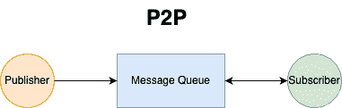
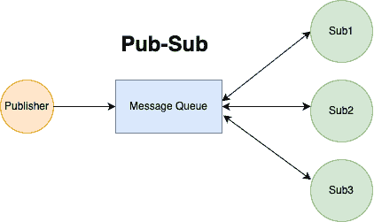

# 点对点（P2P）与发布/订阅（Pub/Sub）在分布式消息队列中的区别

> 原文：[`techbyexample.com/p2p-pub-sub-message-queue/`](https://techbyexample.com/p2p-pub-sub-message-queue/)

# **概述**

分布式消息队列有两种模型

+   点对点

+   发布/订阅

为了理解两者的区别，我们需要先理解一些术语。

+   **生产者** — 生产者是指生成需要由消费者异步消费的消息的人。

+   **消息队列** — 消息队列是生产者推送消息的地方，也是消息在被消费者读取之前保存的地方。

+   **消费者或订阅者** — 消费者是指正在消费已投递的消息的人。谈到消费者时，有一个重要的点需要注意。可能会有多个相同消费者的进程或线程在同一台或不同的机器上运行，以便并行处理消息队列中的消息。尽管“消费者”和“订阅者”可以互换使用，但在本教程中我们将使用“消费者”这一术语。

让我们来看看两者之间的区别

# **点对点**

在点对点模型中，有一个生产者和一个消费者，且是按消息级别进行记账管理的。基本上，消息只有一个目标。例如，假设消费者有两个线程在运行。消息队列中有一条由生产者投递的消息。那么只有消费者的一个线程可以消费这条消息，一旦消费完，消息可以从队列中删除。以下是 P2P 模型的示意图

如果队列中有两条消息，那么一条消息可能会被一个线程取走，另一条消息则可能被另一个线程取走。或者可能会出现两条消息都被同一个线程取走或消费的情况。对于多于两条消息的情况也是如此。

关键点是，一条消息只能被消费者的一个线程或进程消费，消费后该消息会被删除。

也有可能是第二条消息先被处理并从队列中删除，接着第一条消息被处理并删除。因此，分布式消息队列会对已删除和未删除的消息进行无序的记账管理。

# **发布/订阅模型**

在发布/订阅模式中，有一个生产者和多个消费者。同样，对于每个消费者，可能会有多个线程或进程在同一台或不同的机器上运行。基本上，在发布/订阅模型中，可能有多个目标接收相同的消息。下面是发布/订阅模型的示意图

如果消息队列中只有一条消息，那么所有消费者都会消费这条消息。只有在所有消费者都处理完该消息后，这条消息才会从分布式消息队列中删除。

在发布-订阅模型中，一般不会按每条消息每个消费者进行账务处理。相反，分布式消息队列会维护一个偏移量，表示每个消费者已处理的消息位置。基于这个偏移量，分布式消息队列决定删除该消息。

举个例子，假设有 4 个消费者。同时假设队列中有 10 条消息。起初，所有消费者都没有处理任何消息，因此每个消费者的偏移量都是零。

| 消费者名称 | 偏移量 |
| --- | --- |
| C1 | 0 |
| C2 | 0 |
| C3 | 0 |
| C4 | 0 |

之后，所有消费者开始消费消息。假设 C1 能够处理所有 10 条消息，并通知消息队列它已消费并处理了这 10 条消息。同样，C2 能够处理前 5 条消息，并通知消息队列。C3 和 C4 分别能够处理前 8 条和前 4 条消息。以下是每个消费者的偏移量表：

| 消费者名称 | 偏移量 |
| --- | --- |
| C1 | 10 |
| C2 | 5 |
| C3 | 8 |
| C4 | 4 |

消息队列可以安全地删除前四条消息，因为它知道这四条消息已经被所有消费者消费。基本上，消息队列会查看最小的偏移量，然后根据该偏移量决定是否删除。

这里另一个需要注意的点是，消费者只能提交它们已消费的消息的偏移量。所以，如果消费者 C4 已经成功处理了消息 1、2、3、4 和 6，但未能处理消息 5，那么它只会将偏移量 4 提交给发布者，而不会提交 6。

还需要注意的是，在发布-订阅模式下，如果某个消费者的某个线程或进程正在消费某条消息，那么该消息不能被同一消费者的其他线程/进程消费。

# **结论**

这篇文章主要讲述了分布式消息队列中 P2P 模型与发布-订阅（Pub-Sub）模型之间的主要区别。希望你喜欢这篇文章，请在评论中分享反馈。
