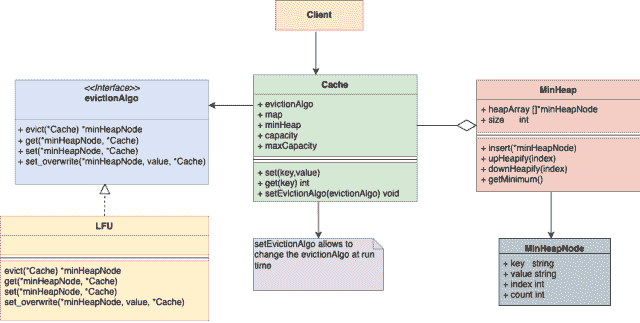

# LFU 缓存设计与实现

> 原文：[`techbyexample.com/lfu-cache-implementation-design/`](https://techbyexample.com/lfu-cache-implementation-design/)

## **概述**

**LFU**代表**最不常用的（Least Frequently Used）**。在 LFU 缓存中，当缓存已满并且需要插入一个新条目时，最不常用的对象会被移除。让我们首先查看需求，然后通过示例更好地理解**LFU**。

## **需求**

以下是需求

+   缓存应支持**Set**和**Get**操作

+   **Set**和**Get**操作的时间复杂度为 O(logn)

+   假设缓存的最大容量是 n。一旦缓存满了并且有新的键需要插入，则必须从缓存中删除现有的一个条目

+   删除应基于驱逐算法——LFU（最不常用）。如果两个缓存条目的使用频率或计数相同，则删除最近最少使用的条目

+   假设缓存中的键和值都是字符串类型

## **LFU 示例**

作为示例，假设缓存大小为 2，其中缓存条目的键和值都是字符串。假设以下是操作

+   **Set (“a”, “1”)** – 向缓存中添加一个元素

+   **Set (“b”, “2”)** – 向缓存中添加第二个元素

+   **Get (“a”)** – 获取键为**“a”**的缓存条目。键为**“a”**的缓存条目现在已被使用了两次，而键为**“b”**的缓存条目只使用了一次

+   **Set (“c”, “3”)** – 需要创建第三个缓存条目。缓存已经满了，因此我们需要通过 LFU 算法驱逐一个缓存条目。键为**“a”**的缓存条目被使用了两次，而键为**“b”**的缓存条目仅使用了一次。因此我们将删除键为**“b”**的缓存条目，因为它是**最不常用的**。一旦**“b”**被删除，我们将插入键为**“c”**的条目

## **使用的数据结构**

根据需求，Set 和 Get 操作的时间复杂度应该是 O(logn)。**最小堆（MinHeap）**似乎是维护最不常用条目的正确数据结构。除此之外，我们还将使用映射（Map）以确保时间复杂度为 O(logn)。总体来说，将使用以下数据结构

### **映射（Map）**

映射只能有一个键和值，其中

+   映射的键将是缓存条目的键

+   映射的值将是指向最小堆节点的指针。

### **最小堆（MinHeap）**

每个最小堆节点将包含四个条目

+   缓存条目的**键（Key）**

+   缓存条目的**值（Value）**

+   **最小堆的索引（Index）**

+   **计数（Count）**表示该条目被使用了多少次

以下是这些操作的示例

+   **Set (“a”, “1”)**

+   **Set (“b”, “2”)**

+   **Get (“a”)**

以下将是这些数据结构中的条目

**映射（Map）**

```go
{
    "a": "bff5a400", #Pointer to "a" minHeap Node
    "b": "bff5a3f6" #Pointer to "a" minHeap Node
}
```

**最小堆（Min Heap）**

```go
[
    {
        Key: "b",    
        Value: "2",
        Index: 0,
        Count: 1    
    },
    {
        Key: "a",    
        Value: "1",
        Index: 1,
        Count: 2    
    }

]
```

两件事

+   **“a”**的计数为 2，因为它被使用了两次，即一次是通过 SET 操作，另一次是通过 GET 操作。**“b”**的计数为 1，因为它只在 SET 操作中使用过一次

+   **“b”**的索引为 0，因为它在**“a”**和**“b”**中具有最低的计数

下面是我们设计中的一些高级内容。

+   我们将有一个**缓存**类，作为与客户端交互的接口。

+   **缓存**类将使用**映射**和**最小堆**的组合来存储所有内容。使用映射和最小堆是为了确保即使在逐出操作时，GET 和 SET 操作仍然是 O(logn)的。如何实现这一点，我们将在本教程后面看到。

+   **映射**将具有类型为字符串的键和指向**最小堆**中节点的指针类型的值，如上所述。

+   最小堆节点将有四个条目，如上所述。

+   将有一个**逐出算法**接口。将有一个**LFU**实现该**逐出算法**接口。

+   缓存类还将嵌入一个**逐出算法**接口的实例。

让我们看看 Get 和 Set 如何在 O(logn)时间内工作。

## **Set 操作（key string，value string）**

对于任何 set 操作，它首先会检查缓存中是否存在给定键的条目。可以通过查看**映射**来检查。如果条目存在，我们将简单地更新 Min Heap 节点中的计数和值。由于计数增加，我们将对该 MinHeap 节点进行下沉堆化（Down Heapify），因为计数已更改。

如果给定键的缓存条目不存在，它将首先创建一个具有以下详细信息的 Min Heap 节点。

+   **键**将是缓存条目的键。

+   **值**将是缓存条目的值。

+   **索引** 作为（MinHeap 大小+1）。

+   **计数**为 1。

一旦创建了 MinHeap 节点，就有两种情况。

+   **缓存未满** – 在这种情况下，它将把控制权交给当前的逐出算法接口。LFU 算法（逐出算法接口的实现者）将把节点插入 Min Heap 的末尾，然后调用上浮堆化（Up Heapify），使该节点达到其在 MinHeap 中的正确位置。整体操作在这里是 O(logn)。

+   **缓存已满** – 在这种情况下，它将将控制权交给 LFU 算法。它将逐出计数最少的节点。一旦该节点被逐出，它将插入新的节点。整个操作在这里是 O(logn)。

## **Get(key string)**

对于任何 Get 操作，它将首先检查**映射**中是否存在给定的键。如果存在，它将获取映射中该键所指向的**最小堆节点**的地址。然后它将从该 MinHeap 节点中获取值。接着，它将把控制权交给当前的 LFU 算法。LFU 算法将把该 MinHeap 节点的计数增加 1，然后调用下沉堆化（Down Heapify），使该节点达到其在 MinHeap 中的正确位置。

现在让我们看一下 UML 图。

## **UML 图**



## **低级设计**

下面是用 GO 编程语言表达的低级设计。稍后我们将看到一个 UML 图以及一个工作示例。

**缓存类**

```go
type Cache struct {
	minHeap      *minheap
	storage      map[string]*minHeapNode
	evictionAlgo evictionAlgo
	capacity     int
	maxCapacity  int
}

func initCache(evictionAlgo evictionAlgo, maxCapacity int) Cache {}

func (this *Cache) setEvictionAlgo(e evictionAlgo) {}

func (this *Cache) set(key, value string) {}

func (this *Cache) get(key string) string {}

func (this *Cache) evict() string {}

func (this *Cache) print() {}
```

**最小堆类**

```go
type minheap struct {
	heapArray []*minHeapNode
	size      int
}

type minHeapNode struct {
	key   string
	value string
	index int
	count int
}

func newMinHeap() *minheap {}

func (this *minheap) insert(node *minHeapNode) error {}

func (this *minheap) upHeapify(index int) {}

func (this *minheap) downHeapify(current int) {}

func (this *minheap) remove() *minHeapNode {}

func (this *minheap) print() {}
```

**逐出算法接口**

```go
type evictionAlgo interface {
	evict(c *Cache) *minHeapNode
	get(node *minHeapNode, c *Cache)
	set(node *minHeapNode, c *Cache)
	set_overwrite(node *minHeapNode, value string, c *Cache)
}
```

**LFU 算法** – 它实现了驱逐算法接口

```go
type lfu struct {
}

func (l *lfu) evict(c *Cache) *minHeapNode {}

func (l *lfu) get(node *minHeapNode, c *Cache) {}

func (l *lfu) set(node *minHeapNode, c *Cache) {}

func (l *lfu) set_overwrite(node *minHeapNode, value string, c *Cache) {}
```

## **完整的工作代码**

如果有人对 GO 编程语言感兴趣，这里是完整的工作代码

**minHeap.go**

```go
package main

import "fmt"

type minheap struct {
	heapArray []*minHeapNode
	size      int
}

type minHeapNode struct {
	key   string
	value string
	index int
	count int
}

func newMinHeap() *minheap {
	minheap := &minheap{
		heapArray: []*minHeapNode{},
		size:      0,
	}
	return minheap
}

func (this *minheap) leaf(index int) bool {
	if index >= (this.size/2) && index <= this.size {
		return true
	}
	return false
}

func (this *minheap) parent(index int) *minHeapNode {
	parentIndex := (index - 1) / 2
	return this.heapArray[parentIndex]
}

func (this *minheap) leftchild(index int) *minHeapNode {
	leftChildIndex := 2*index + 1
	if leftChildIndex > this.size-1 {
		return nil
	}
	return this.heapArray[leftChildIndex]
}

func (this *minheap) rightchild(index int) *minHeapNode {
	rightChildIndex := 2*index + 2
	if rightChildIndex > this.size-1 {
		return nil
	}
	return this.heapArray[rightChildIndex]
}

func (this *minheap) insert(node *minHeapNode) error {
	this.heapArray = append(this.heapArray, node)
	this.size++
	node.index = this.size - 1
	this.upHeapify(this.size - 1)
	return nil
}

func (this *minheap) swap(first, second *minHeapNode) {
	this.heapArray[first.index] = second
	this.heapArray[second.index] = first
	temp := first.index
	first.index = second.index
	second.index = temp
}

func (this *minheap) upHeapify(index int) {
	parentNode := this.parent(index)
	for this.heapArray[index].count < parentNode.count {
		this.swap(this.heapArray[index], this.parent(index))
	}
}

func (this *minheap) downHeapify(current int) {
	if this.leaf(current) {
		return
	}
	currNode := this.heapArray[current]
	smallest := currNode
	smallestIndex := currNode.index
	leftChildNode := this.leftchild(current)
	rightChildNode := this.rightchild(current)
	//If current is smallest then return
	if leftChildNode != nil && leftChildNode.count < smallest.count {
		smallest = leftChildNode
		smallestIndex = leftChildNode.index
	}
	if rightChildNode != nil && rightChildNode.count < smallest.count {
		smallest = rightChildNode
		smallestIndex = rightChildNode.index
	}
	if smallest != currNode {
		this.swap(currNode, smallest)
		this.downHeapify(smallestIndex)
	}
	return
}
func (this *minheap) buildMinHeap() {
	for index := ((this.size / 2) - 1); index >= 0; index-- {
		this.downHeapify(index)
	}
}

func (this *minheap) getMinimum() *minHeapNode {
	top := this.heapArray[0]
	this.heapArray[0] = this.heapArray[this.size-1]
	this.heapArray[0].index = 0
	this.heapArray = this.heapArray[:(this.size)-1]
	this.size--
	this.downHeapify(0)
	return top
}

func (this *minheap) print() {
	fmt.Println("Printing MinHeap:")
	for _, v := range this.heapArray {
		fmt.Printf("%+v\n", *v)
	}
}
```

**evictionAlgorithm.go**

```go
package main

type evictionAlgo interface {
	evict(c *Cache) *minHeapNode
	get(node *minHeapNode, c *Cache)
	set(node *minHeapNode, c *Cache)
	set_overwrite(node *minHeapNode, value string, c *Cache)
}

func createEvictioAlgo(algoType string) evictionAlgo {
	if algoType == "lfu" {
		return &lfu{}
	}

	return nil
}
```

**lfu.go**

```go
package main

import "fmt"

type lfu struct {
}

func (l *lfu) evict(c *Cache) *minHeapNode {
	node := c.minHeap.getMinimum()
	fmt.Printf("Evicting by lfu strtegy. Evicted Node Key: %s", node.key)
	return node
}

func (l *lfu) get(node *minHeapNode, c *Cache) {
	fmt.Printf("Shuffling node with key:%s in the minHeap due to get operation\n", node.key)
	node.count++
	c.minHeap.downHeapify(node.index)
}

func (l *lfu) set(node *minHeapNode, c *Cache) {
	fmt.Printf("Adding a new node with key:%s to minHeap due to set operation\n", node.key)
	node.count++
	c.minHeap.insert(node)
}

func (l *lfu) set_overwrite(node *minHeapNode, value string, c *Cache) {
	fmt.Printf("Shuffling node with key:%s in the minHeap due to set_overwrite operation\n", node.key)
	node.value = value
	node.count++
	c.minHeap.downHeapify(node.index)
}
```

**cache.go**

```go
package main

import "fmt"

type Cache struct {
	minHeap      *minheap
	storage      map[string]*minHeapNode
	evictionAlgo evictionAlgo
	capacity     int
	maxCapacity  int
}

func initCache(evictionAlgo evictionAlgo, maxCapacity int) Cache {
	storage := make(map[string]*minHeapNode)
	return Cache{
		minHeap:      newMinHeap(),
		storage:      storage,
		evictionAlgo: evictionAlgo,
		capacity:     0,
		maxCapacity:  maxCapacity,
	}
}

func (this *Cache) setEvictionAlgo(e evictionAlgo) {
	this.evictionAlgo = e
}

func (this *Cache) set(key, value string) {
	node_ptr, ok := this.storage[key]
	if ok {
		this.evictionAlgo.set_overwrite(node_ptr, value, this)
		return
	}
	if this.capacity == this.maxCapacity {
		evictedKey := this.evict()
		delete(this.storage, evictedKey)
	}
	node := &minHeapNode{key: key, value: value}
	this.storage[key] = node
	this.evictionAlgo.set(node, this)
	this.capacity++
}

func (this *Cache) get(key string) string {
	node_ptr, ok := this.storage[key]
	if ok {
		this.evictionAlgo.get(node_ptr, this)
		return (*node_ptr).value
	}
	return ""
}

func (this *Cache) evict() string {
	minHeapNode := this.evictionAlgo.evict(this)
	this.capacity--
	return minHeapNode.key
}

func (this *Cache) print() {
	fmt.Println("Printing Entire Cache:")
	fmt.Println("Printing Map:")
	for k, v := range this.storage {
		fmt.Printf("key :%s value: %s\n", k, (*v).value)
	}
	this.minHeap.print()
	fmt.Println()
}
```

**main.go**

```go
package main

import "fmt"

func main() {
	lfu := createEvictioAlgo("lfu")
	cache := initCache(lfu, 3)
	cache.set("a", "1")
	cache.print()

	cache.set("b", "2")
	cache.print()

	cache.set("c", "3")
	cache.print()

	value := cache.get("a")
	fmt.Printf("key: a, value: %s\n", value)
	cache.print()

	value = cache.get("b")
	fmt.Printf("key: a, value: %s\n", value)
	cache.print()

	value = cache.get("c")
	fmt.Printf("key: a, value: %s\n", value)
	cache.print()

	cache.set("d", "4")
	cache.print()

	cache.set("e", "5")
	cache.print()
}
```

**输出**

```go
Adding a new node with key:a to minHeap due to set operation
Printing Entire Cache:
Printing Map:
key :a value: 1
Printing MinHeap:
{key:a value:1 index:0 count:1}

Adding a new node with key:b to minHeap due to set operation
Printing Entire Cache:
Printing Map:
key :a value: 1
key :b value: 2
Printing MinHeap:
{key:a value:1 index:0 count:1}
{key:b value:2 index:1 count:1}

Adding a new node with key:c to minHeap due to set operation
Printing Entire Cache:
Printing Map:
key :a value: 1
key :b value: 2
key :c value: 3
Printing MinHeap:
{key:a value:1 index:0 count:1}
{key:b value:2 index:1 count:1}
{key:c value:3 index:2 count:1}

Shuffling node with key:a in the minHeap due to get operation
key: a, value: 1
Printing Entire Cache:
Printing Map:
key :a value: 1
key :b value: 2
key :c value: 3
Printing MinHeap:
{key:b value:2 index:0 count:1}
{key:a value:1 index:1 count:2}
{key:c value:3 index:2 count:1}

Shuffling node with key:b in the minHeap due to get operation
key: a, value: 2
Printing Entire Cache:
Printing Map:
key :b value: 2
key :c value: 3
key :a value: 1
Printing MinHeap:
{key:c value:3 index:0 count:1}
{key:a value:1 index:1 count:2}
{key:b value:2 index:2 count:2}

Shuffling node with key:c in the minHeap due to get operation
key: a, value: 3
Printing Entire Cache:
Printing Map:
key :a value: 1
key :b value: 2
key :c value: 3
Printing MinHeap:
{key:c value:3 index:0 count:2}
{key:a value:1 index:1 count:2}
{key:b value:2 index:2 count:2}

Evicting by lfu strtegy. Evicted Node Key: cAdding a new node with key:d to minHeap due to set operation
Printing Entire Cache:
Printing Map:
key :a value: 1
key :b value: 2
key :d value: 4
Printing MinHeap:
{key:d value:4 index:0 count:1}
{key:a value:1 index:1 count:2}
{key:b value:2 index:2 count:2}

Evicting by lfu strtegy. Evicted Node Key: dAdding a new node with key:e to minHeap due to set operation
Printing Entire Cache:
Printing Map:
key :a value: 1
key :b value: 2
key :e value: 5
Printing MinHeap:
{key:e value:5 index:0 count:1}
{key:a value:1 index:1 count:2}
{key:b value:2 index:2 count:2}
```

## **完整的工作代码，放在一个文件中**

这里是完整的工作代码，放在一个文件中

```go
package main

import "fmt"

type minheap struct {
	heapArray []*minHeapNode
	size      int
}

type minHeapNode struct {
	key   string
	value string
	index int
	count int
}

func newMinHeap() *minheap {
	minheap := &minheap{
		heapArray: []*minHeapNode{},
		size:      0,
	}
	return minheap
}

func (this *minheap) leaf(index int) bool {
	if index >= (this.size/2) && index <= this.size {
		return true
	}
	return false
}

func (this *minheap) parent(index int) *minHeapNode {
	parentIndex := (index - 1) / 2
	return this.heapArray[parentIndex]
}

func (this *minheap) leftchild(index int) *minHeapNode {
	leftChildIndex := 2*index + 1
	if leftChildIndex > this.size-1 {
		return nil
	}
	return this.heapArray[leftChildIndex]
}

func (this *minheap) rightchild(index int) *minHeapNode {
	rightChildIndex := 2*index + 2
	if rightChildIndex > this.size-1 {
		return nil
	}
	return this.heapArray[rightChildIndex]
}

func (this *minheap) insert(node *minHeapNode) error {
	this.heapArray = append(this.heapArray, node)
	this.size++
	node.index = this.size - 1
	this.upHeapify(this.size - 1)
	return nil
}

func (this *minheap) swap(first, second *minHeapNode) {
	this.heapArray[first.index] = second
	this.heapArray[second.index] = first
	temp := first.index
	first.index = second.index
	second.index = temp
}

func (this *minheap) upHeapify(index int) {
	parentNode := this.parent(index)
	for this.heapArray[index].count < parentNode.count {
		this.swap(this.heapArray[index], this.parent(index))
	}
}

func (this *minheap) downHeapify(current int) {
	if this.leaf(current) {
		return
	}
	currNode := this.heapArray[current]
	smallest := currNode
	smallestIndex := currNode.index
	leftChildNode := this.leftchild(current)
	rightChildNode := this.rightchild(current)
	//If current is smallest then return
	if leftChildNode != nil && leftChildNode.count < smallest.count {
		smallest = leftChildNode
		smallestIndex = leftChildNode.index
	}
	if rightChildNode != nil && rightChildNode.count < smallest.count {
		smallest = rightChildNode
		smallestIndex = rightChildNode.index
	}
	if smallest != currNode {
		this.swap(currNode, smallest)
		this.downHeapify(smallestIndex)
	}
	return
}
func (this *minheap) buildMinHeap() {
	for index := ((this.size / 2) - 1); index >= 0; index-- {
		this.downHeapify(index)
	}
}

func (this *minheap) getMinimum() *minHeapNode {
	top := this.heapArray[0]
	this.heapArray[0] = this.heapArray[this.size-1]
	this.heapArray[0].index = 0
	this.heapArray = this.heapArray[:(this.size)-1]
	this.size--
	this.downHeapify(0)
	return top
}

func (this *minheap) print() {
	fmt.Println("Printing MinHeap:")
	for _, v := range this.heapArray {
		fmt.Printf("%+v\n", *v)
	}
}

type evictionAlgo interface {
	evict(c *Cache) *minHeapNode
	get(node *minHeapNode, c *Cache)
	set(node *minHeapNode, c *Cache)
	set_overwrite(node *minHeapNode, value string, c *Cache)
}

func createEvictioAlgo(algoType string) evictionAlgo {
	if algoType == "lfu" {
		return &lfu{}
	}

	return nil
}

type lfu struct {
}

func (l *lfu) evict(c *Cache) *minHeapNode {
	node := c.minHeap.getMinimum()
	fmt.Printf("Evicting by lfu strtegy. Evicted Node Key: %s", node.key)
	return node
}

func (l *lfu) get(node *minHeapNode, c *Cache) {
	fmt.Printf("Shuffling node with key:%s in the minHeap due to get operation\n", node.key)
	node.count++
	c.minHeap.downHeapify(node.index)
}

func (l *lfu) set(node *minHeapNode, c *Cache) {
	fmt.Printf("Adding a new node with key:%s to minHeap due to set operation\n", node.key)
	node.count++
	c.minHeap.insert(node)
}

func (l *lfu) set_overwrite(node *minHeapNode, value string, c *Cache) {
	fmt.Printf("Shuffling node with key:%s in the minHeap due to set_overwrite operation\n", node.key)
	node.value = value
	node.count++
	c.minHeap.downHeapify(node.index)
}

type Cache struct {
	minHeap      *minheap
	storage      map[string]*minHeapNode
	evictionAlgo evictionAlgo
	capacity     int
	maxCapacity  int
}

func initCache(evictionAlgo evictionAlgo, maxCapacity int) Cache {
	storage := make(map[string]*minHeapNode)
	return Cache{
		minHeap:      newMinHeap(),
		storage:      storage,
		evictionAlgo: evictionAlgo,
		capacity:     0,
		maxCapacity:  maxCapacity,
	}
}

func (this *Cache) setEvictionAlgo(e evictionAlgo) {
	this.evictionAlgo = e
}

func (this *Cache) set(key, value string) {
	node_ptr, ok := this.storage[key]
	if ok {
		this.evictionAlgo.set_overwrite(node_ptr, value, this)
		return
	}
	if this.capacity == this.maxCapacity {
		evictedKey := this.evict()
		delete(this.storage, evictedKey)
	}
	node := &minHeapNode{key: key, value: value}
	this.storage[key] = node
	this.evictionAlgo.set(node, this)
	this.capacity++
}

func (this *Cache) get(key string) string {
	node_ptr, ok := this.storage[key]
	if ok {
		this.evictionAlgo.get(node_ptr, this)
		return (*node_ptr).value
	}
	return ""
}

func (this *Cache) evict() string {
	minHeapNode := this.evictionAlgo.evict(this)
	this.capacity--
	return minHeapNode.key
}

func (this *Cache) print() {
	fmt.Println("Printing Entire Cache:")
	fmt.Println("Printing Map:")
	for k, v := range this.storage {
		fmt.Printf("key :%s value: %s\n", k, (*v).value)
	}
	this.minHeap.print()
	fmt.Println()
}

func main() {
	lfu := createEvictioAlgo("lfu")
	cache := initCache(lfu, 3)
	cache.set("a", "1")
	cache.print()

	cache.set("b", "2")
	cache.print()

	cache.set("c", "3")
	cache.print()

	value := cache.get("a")
	fmt.Printf("key: a, value: %s\n", value)
	cache.print()

	value = cache.get("b")
	fmt.Printf("key: a, value: %s\n", value)
	cache.print()

	value = cache.get("c")
	fmt.Printf("key: a, value: %s\n", value)
	cache.print()

	cache.set("d", "4")
	cache.print()

	cache.set("e", "5")
	cache.print()
}
```

**输出**

```go
Adding a new node with key:a to minHeap due to set operation
Printing Entire Cache:
Printing Map:
key :a value: 1
Printing MinHeap:
{key:a value:1 index:0 count:1}

Adding a new node with key:b to minHeap due to set operation
Printing Entire Cache:
Printing Map:
key :b value: 2
key :a value: 1
Printing MinHeap:
{key:a value:1 index:0 count:1}
{key:b value:2 index:1 count:1}

Adding a new node with key:c to minHeap due to set operation
Printing Entire Cache:
Printing Map:
key :a value: 1
key :b value: 2
key :c value: 3
Printing MinHeap:
{key:a value:1 index:0 count:1}
{key:b value:2 index:1 count:1}
{key:c value:3 index:2 count:1}

Shuffling node with key:a in the minHeap due to get operation
key: a, value: 1
Printing Entire Cache:
Printing Map:
key :c value: 3
key :a value: 1
key :b value: 2
Printing MinHeap:
{key:b value:2 index:0 count:1}
{key:a value:1 index:1 count:2}
{key:c value:3 index:2 count:1}

Shuffling node with key:b in the minHeap due to get operation
key: a, value: 2
Printing Entire Cache:
Printing Map:
key :a value: 1
key :b value: 2
key :c value: 3
Printing MinHeap:
{key:c value:3 index:0 count:1}
{key:a value:1 index:1 count:2}
{key:b value:2 index:2 count:2}

Shuffling node with key:c in the minHeap due to get operation
key: a, value: 3
Printing Entire Cache:
Printing Map:
key :b value: 2
key :c value: 3
key :a value: 1
Printing MinHeap:
{key:c value:3 index:0 count:2}
{key:a value:1 index:1 count:2}
{key:b value:2 index:2 count:2}

Evicting by lfu strtegy. Evicted Node Key: cAdding a new node with key:d to minHeap due to set operation
Printing Entire Cache:
Printing Map:
key :d value: 4
key :a value: 1
key :b value: 2
Printing MinHeap:
{key:d value:4 index:0 count:1}
{key:a value:1 index:1 count:2}
{key:b value:2 index:2 count:2}

Evicting by lfu strtegy. Evicted Node Key: dAdding a new node with key:e to minHeap due to set operation
Printing Entire Cache:
Printing Map:
key :a value: 1
key :b value: 2
key :e value: 5
Printing MinHeap:
{key:e value:5 index:0 count:1}
{key:a value:1 index:1 count:2}
{key:b value:2 index:2 count:2}
```

## **结论**

这就是关于设计基于 LFU 的内存缓存的全部内容。希望你喜欢这篇文章。请在评论中分享反馈。

**注意：** 请查看我们的系统设计教程系列 [系统设计问题](https://techbyexample.com/system-design-questions/)
