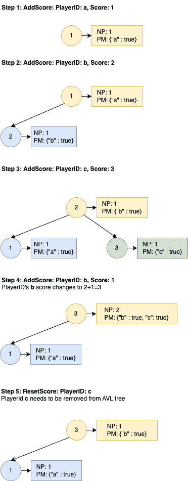

# 设计一个排行榜或排行榜的低级设计

> 原文：[`techbyexample.com/leaderboard-system-design/`](https://techbyexample.com/leaderboard-system-design/)

目录

+   概述

+   平衡二叉搜索树 + 哈希映射解决方案

+   与最小堆的比较

+   实现

    +   添加得分

    +   重置得分

    +   从排行榜中检索前 k 个和

    +   从排行榜中检索前 k 个玩家。

+   低级设计

+   完整工作代码

+   结论

# **概述**

在本教程中，我们将设计一个排行榜，并查看其完整的工作代码。以下是我们将要设计的排行榜的一些要求

+   **AddScore(id, score)** – 为玩家 id 为 id 的玩家添加得分。如果没有此玩家，则创建一个。

+   **RestScore(id)** – 重置玩家 id 为 id 的玩家得分为零

+   **Top K 和 Sum** – 应该能够从排行榜中检索前 k 个和。

+   **Top K 玩家** – 应该能够从排行榜中检索前 k 个玩家。

看着这个问题，第一个想到的解决方案是使用**最小堆 + 哈希映射**。但是，如果 Top K 和 Top K 玩家调用的频率过高，最小堆就不是一个最佳解决方案，因为排行榜是用来展示领先者的。但为什么它不是一个最佳解决方案，最优的解决方案是什么呢？我们将在本教程中进行探讨。首先，让我们看看如何使用最小堆 + 哈希映射解决方案来解决这个问题

需要两个数据结构

+   **最小堆**– 最小堆只会在调用 Top K 和 Sum 或 Top K 玩家方法时创建

+   **哈希映射** – 除了最小堆外，我们还将维护一个哈希映射，该映射将包含每个玩家及其得分的条目。因此，对于这个哈希映射

    +   关键将是 playerID

    +   值将是玩家的得分

让我们来看一下 Min Heap + 哈希映射解决方案中每个操作的时间复杂度

**添加得分：**

添加到哈希映射中。时间复杂度是 O(1)

**重置得分**

将哈希映射中的值设置为零。时间复杂度是 O(1)

**Top K 和 Sum：**

创建一个包含 k 个元素的最小堆。遍历哈希映射并将元素添加到最小堆中，如果得分大于最小堆的顶部元素。此操作的时间复杂度将是 O(Nlogk)，其中 N 是玩家的数量

**Top K 玩家：**

与 Top K 和 Sum 相同。时间复杂度是 O(NlogK)，其中 N 是玩家的数量

在这里我们可以看到，前 K 名得分和前 K 名玩家的时间复杂度是 O(Nlogk)，这是相对较高的。我们可以通过使用平衡二叉搜索树 + 哈希表解决方案来优化它。对于平衡二叉搜索树 + 哈希表解决方案，下面是每个操作的时间复杂度

+   添加得分：O(logN)

+   重置得分：O(logN)

+   前 K 名得分：O(K)

+   排名前 K 的玩家：O(K)

**添加得分** 和 **重置得分** 的时间复杂度增加了，这代价是 **前 K 名得分** 和 **前 K 名玩家** 操作时间复杂度的降低。让我们看看如何实现它，并在教程后续部分与最小堆解决方案进行比较。

# **平衡二叉搜索树 + 哈希表解决方案**

平衡二叉搜索树解决方案。我们将维护两种数据结构

+   平衡二叉搜索树—我们将使用 AVL 树。在 AVL 树中的每个节点将存储以下内容

    +   得分

    +   使用该得分的玩家 ID，我们将其存储在一个映射中。为什么选择映射而不是数组？因为这样我们可以在玩家得分变化时，轻松地将玩家从节点中移除。

    +   该得分的玩家数量将等于玩家映射中条目的数量

+   哈希表—除了平衡二叉搜索树外，我们还将维护一个哈希表，其中包含每个玩家及其得分的条目。对于这个哈希表

    +   键将是 playerID

    +   值将是玩家的得分

# **与最小堆的比较**

以下表格比较了（平衡二叉搜索树 + 哈希表）与（最小堆 + 哈希表）的区别

假设：N 是玩家的数量

| **操作** | 平衡二叉搜索树 + 哈希表 | 最小堆 + 哈希表 |
| --- | --- | --- |
| 添加得分 | O(logN) | O(1) |
| 重置得分 | O(logN) | O(1) |
| 前 K 名得分 | O(k) | O(Nlogk) |
| 排名前 K 的玩家 | O(k) | O(Nlogk) |

排行榜的目的是始终展示得分最高的玩家，并且每当任何玩家的得分发生变化时，榜单需要刷新。因此，我们希望进一步优化 **前 K 名得分** 和 **前 K 名玩家** 的方法。鉴于此，平衡二叉搜索树 + 哈希表更适合设计排行榜。

# **实现**

让我们来看一下平衡二叉搜索树（Balanced BST）+ 哈希表（Hashmap）解决方案的实现和设计。

这里是一个示例，展示如何在 AVL 树中存储数据



下面是每个操作将如何工作的示例

## **添加得分**

对于这种情况，我们有两种情况

+   **玩家已经存在于排行榜上**

对于此操作，我们将玩家同时添加到哈希表和 AVL 树中。

+   **玩家尚未出现在排行榜上**

在这种情况下，意味着玩家的得分正在发生变化。所以在这种情况下，我们将做两件事。让我们通过一个示例来理解这两件事。假设玩家的原始得分是 5，现在他的得分增加了 3。那么 5 是原始得分，5+3=8 是新得分。所以我们将简单地

+   从 AVL 树中的节点中移除该玩家，其得分为 5。

+   将该玩家添加到 AVL 树中得分为 8 的节点。如果得分为 8 的节点不存在，则创建该节点。

AddScore 的时间复杂度为**O(logN)**，其中 N 是玩家的数量。

## **重置得分**

在这种情况下，我们也有两种情况

+   **玩家已在排行榜中，得分为 x**

为此，我们只需从得分为 x 的 AVL 树节点中删除该玩家。检查该玩家是否存在于排行榜的映射中。如果存在，则执行上述操作。

+   **玩家尚未在排行榜中存在**

在这种情况下，我们不需要做任何操作。

ResetScore 的时间复杂度为**O(logN)**，其中 N 是玩家的数量。

## **从排行榜中获取前 k 名总分**

为此，我们只需要从分数最高的节点开始遍历 AVL 树，然后将该**分数*num_players**添加到输出总和。如果该 AVL 节点的 NumPlayers 大于 k，则将**分数*k**添加到输出总和。继续重复此过程，依次遍历第二高分和第三高分的节点，直到所有 k 个分数都被添加。

这个操作的时间复杂度是**O(K)**，因为它与在平衡的二叉搜索树中遍历 K 个节点是一样的。

## **从排行榜中获取前 k 名玩家。**

为此，我们只需要从分数最高的节点开始遍历 AVL 树，然后将该分数的所有玩家添加到输出中。如果该 AVL 节点的玩家数量大于 k，则只添加 k 个玩家。

继续重复此过程，依次遍历第二高分和第三高分的节点，直到所有 k 个玩家被添加。

这个操作的时间复杂度是**O(K)**，因为它与在平衡的二叉搜索树中遍历 K 个节点是一样的。

# **低级设计**

在这个设计中，我们将使用两个类

+   第一个是排行榜类。排行榜类将暴露所有方法。

    +   **AddScore(playerId string, scoreToAdd int)**

    +   **Reset(playerId string)**

    +   **TopPlayers(k int)**

    +   **TopSum(k int)**

排行榜类将内部使用 AVL 来返回所有结果。

+   第二个是 AVL 类。这个类将包含以下两个类，并封装实现 AVL 树的所有逻辑。

    +   AVL 树类

    +   AVLNode 类

# **完整工作代码**

Golang 中的 AVL 树代码灵感来自于[`github.com/karask/go-avltree`](https://github.com/karask/go-avltree)

这里是使用 Go 编程语言实现的相应代码。

**lederboard.go**

```go
package main

type leaderboard struct {
	avl       *AVLTree
	leaderMap map[string]int
}

func initLeaderboard() *leaderboard {
	return &leaderboard{
		avl:       &AVLTree{},
		leaderMap: make(map[string]int),
	}
}

func (this *leaderboard) AddScore(playerId string, scoreToAdd int) {
	oldScore, ok := this.leaderMap[playerId]
	newScore := oldScore + scoreToAdd
	if ok && oldScore != 0 {
		this.avl.Remove_Player_From_Score(oldScore, playerId)
		this.avl.Add(newScore, playerId)
	} else {
		this.avl.Add(scoreToAdd, playerId)
	}
	this.leaderMap[playerId] = newScore
}

func (this *leaderboard) Reset(playerId string) {
	oldScore, ok := this.leaderMap[playerId]
	if ok && oldScore != 0 {
		this.avl.Remove_Player_From_Score(oldScore, playerId)
	}
	this.leaderMap[playerId] = 0
}

func (this *leaderboard) TopPlayers(k int) []AVLItem {
	return this.avl.TopPlayers(k)

}

func (this *leaderboard) TopSum(k int) int {
	sum := this.avl.TopSum(k)
	return sum
}
```

**avl.go**

```go
package main

type AVLTree struct {
	root *AVLNode
}

func (t *AVLTree) Add(key int, value string) {
	t.root = t.root.add(key, value)
}

func (t *AVLTree) Remove(key int) {
	t.root = t.root.remove(key)
}

func (t *AVLTree) Search(key int) (node *AVLNode) {
	return t.root.search(key)
}

func (t *AVLTree) TopPlayers(k int) []AVLItem {
	curr := 0
	output, _ := t.root.topPlayers(&curr, k)
	return output
}

func (t *AVLTree) TopSum(k int) int {
	curr := 0
	sum, _ := t.root.topSum(&curr, k)
	return sum
}

func (t *AVLTree) Remove_Player_From_Score(oldScore int, playerId string) {
	//Get AVL Node for old Score
	node := t.root.search(oldScore)
	if node.NumPlayers == 1 {
		t.root.remove(oldScore)
	} else {
		t.root.remove_player_from_score(oldScore, playerId)
	}
}

// AVLNode structure
type AVLNode struct {
	Score        int
	PlayerIDsMap map[string]bool
	NumPlayers   int

	// height counts nodes (not edges)
	height int
	left   *AVLNode
	right  *AVLNode
}

type AVLItem struct {
	Score     int
	PlayerIDs []string
}

func (n *AVLNode) topPlayers(curr *int, k int) ([]AVLItem, bool) {
	output := make([]AVLItem, 0)
	if n.right != nil {
		o, br := n.right.topPlayers(curr, k)
		output = append(output, o...)
		if br {
			return output, true
		}
	}

	i := 0
	playerIds := make([]string, 0)
	for playerId, _ := range n.PlayerIDsMap {
		if *curr < k && i < n.NumPlayers {
			playerIds = append(playerIds, playerId)
			*curr = *curr + 1
			i++
		} else {
			break
		}
	}

	output = append(output, AVLItem{n.Score, playerIds})

	if *curr == k {
		return output, true
	}

	if n.left != nil {
		o, br := n.left.topPlayers(curr, k)
		output = append(output, o...)
		if br {
			return output, true
		}
	}

	return output, false
}

func (n *AVLNode) topSum(curr *int, k int) (int, bool) {
	sum := 0
	if n.right != nil {
		s, br := n.right.topSum(curr, k)
		sum = sum + s
		if br {
			return sum, true
		}
	}

	less := 0

	if k-*curr < n.NumPlayers {
		less = k - *curr
	} else {
		less = n.NumPlayers
	}

	sum = sum + n.Score*less
	*curr = *curr + less

	if *curr == k {
		return sum, true
	}

	if n.left != nil {
		s, br := n.left.topSum(curr, k)
		sum = sum + s
		if br {
			return sum, true
		}
	}

	return sum, false
}

// Adds a new node
func (n *AVLNode) add(score int, playerID string) *AVLNode {
	if n == nil {
		m := make(map[string]bool)
		m[playerID] = true
		return &AVLNode{score, m, 1, 1, nil, nil}
	}

	if score < n.Score {
		n.left = n.left.add(score, playerID)
	} else if score > n.Score {
		n.right = n.right.add(score, playerID)
	} else {
		// if same key exists update value
		n.NumPlayers = n.NumPlayers + 1
		n.PlayerIDsMap[playerID] = true
	}
	return n.rebalanceTree()
}

// Removes a node
func (n *AVLNode) remove(score int) *AVLNode {
	if n == nil {
		return nil
	}
	if score < n.Score {
		n.left = n.left.remove(score)
	} else if score > n.Score {
		n.right = n.right.remove(score)
	} else {
		if n.left != nil && n.right != nil {
			// node to delete found with both children;
			// replace values with smallest node of the right sub-tree
			rightMinNode := n.right.findSmallest()
			n.Score = rightMinNode.Score
			n.PlayerIDsMap = rightMinNode.PlayerIDsMap
			n.NumPlayers = rightMinNode.NumPlayers
			// delete smallest node that we replaced
			n.right = n.right.remove(rightMinNode.Score)
		} else if n.left != nil {
			// node only has left child
			n = n.left
		} else if n.right != nil {
			// node only has right child
			n = n.right
		} else {
			// node has no children
			n = nil
			return n
		}

	}
	return n.rebalanceTree()
}

// Remove player from score
func (n *AVLNode) remove_player_from_score(score int, playerId string) {
	if n == nil {
		return
	}
	if score < n.Score {
		n.left.remove_player_from_score(score, playerId)
	} else if score > n.Score {
		n.right.remove_player_from_score(score, playerId)
	} else {
		n.NumPlayers = n.NumPlayers - 1
		delete(n.PlayerIDsMap, playerId)
	}
	return
}

// Searches for a node
func (n *AVLNode) search(score int) *AVLNode {
	if n == nil {
		return nil
	}
	if score < n.Score {
		return n.left.search(score)
	} else if score > n.Score {
		return n.right.search(score)
	} else {
		return n
	}
}

func (n *AVLNode) getHeight() int {
	if n == nil {
		return 0
	}
	return n.height
}

func (n *AVLNode) recalculateHeight() {
	n.height = 1 + max(n.left.getHeight(), n.right.getHeight())
}

// Checks if node is balanced and rebalance
func (n *AVLNode) rebalanceTree() *AVLNode {
	if n == nil {
		return n
	}
	n.recalculateHeight()

	// check balance factor and rotateLeft if right-heavy and rotateRight if left-heavy
	balanceFactor := n.left.getHeight() - n.right.getHeight()
	if balanceFactor == -2 {
		// check if child is left-heavy and rotateRight first
		if n.right.left.getHeight() > n.right.right.getHeight() {
			n.right = n.right.rotateRight()
		}
		return n.rotateLeft()
	} else if balanceFactor == 2 {
		// check if child is right-heavy and rotateLeft first
		if n.left.right.getHeight() > n.left.left.getHeight() {
			n.left = n.left.rotateLeft()
		}
		return n.rotateRight()
	}
	return n
}

// Rotate nodes left to balance node
func (n *AVLNode) rotateLeft() *AVLNode {
	newRoot := n.right
	n.right = newRoot.left
	newRoot.left = n

	n.recalculateHeight()
	newRoot.recalculateHeight()
	return newRoot
}

// Rotate nodes right to balance node
func (n *AVLNode) rotateRight() *AVLNode {
	newRoot := n.left
	n.left = newRoot.right
	newRoot.right = n

	n.recalculateHeight()
	newRoot.recalculateHeight()
	return newRoot
}

// Finds the smallest child (based on the key) for the current node
func (n *AVLNode) findSmallest() *AVLNode {
	if n.left != nil {
		return n.left.findSmallest()
	} else {
		return n
	}
}

// Returns max number - TODO: std lib seemed to only have a method for floats!
func max(a int, b int) int {
	if a > b {
		return a
	}
	return b
}
```

**main.go**

```go
package main

import "fmt"

func main() {
	leaderboard := initLeaderboard()

	leaderboard.AddScore("a", 1)
	leaderboard.AddScore("b", 2)
	leaderboard.AddScore("c", 3)
	leaderboard.AddScore("d", 4)
	leaderboard.AddScore("e", 4)

	leaderboard.AddScore("f", 10)

	k := 4
	output := leaderboard.TopPlayers(k)
	for i := 0; i < len(output); i++ {
		fmt.Printf("PlayerIDs: %v, Score: %d\n", output[i].PlayerIDs, output[i].Score)
	}
	topSum := leaderboard.TopSum(k)
	fmt.Printf("Sum: %d", topSum)

	leaderboard.AddScore("f", 15)

	fmt.Println("\n")
	k = 7
	output = leaderboard.TopPlayers(k)
	for i := 0; i < len(output); i++ {
		fmt.Printf("PlayerIDs: %v, Score: %d\n", output[i].PlayerIDs, output[i].Score)
	}
	topSum = leaderboard.TopSum(k)
	fmt.Printf("Sum: %d", topSum)

}
```

**输出**

```go
PlayerIDs: [f], Score: 10
PlayerIDs: [d e], Score: 4
PlayerIDs: [c], Score: 3
Sum: 21

PlayerIDs: [f], Score: 25
PlayerIDs: [e d], Score: 4
PlayerIDs: [c], Score: 3
PlayerIDs: [b], Score: 2
PlayerIDs: [a], Score: 1
Sum: 39
```

# **结论**

这篇文章主要讲解了如何设计和实现一个排行榜。希望你喜欢这篇文章，请在评论中分享反馈。

**注意：** 请查看我们的系统设计教程系列[系统设计问题](https://techbyexample.com/system-design-questions/)
