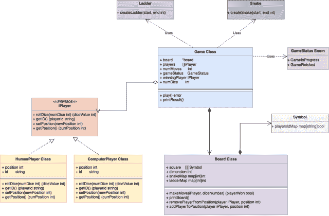

# 蛇与梯子游戏的系统设计

> 原文：[`techbyexample.com/snake-ladder-game-oops-design/`](https://techbyexample.com/snake-ladder-game-oops-design/)

目录

+   概览

+   蛇与梯子游戏中的所有角色

+   需求分析

+   UML 图

+   低级设计

+   完整工作代码

+   单文件中的完整工作代码

+   结论

## **概览**

设计蛇与梯子游戏是一个低级设计问题，应该以这种方式解决。在这个问题中，面试官希望测试你的面向对象技能。

你可以在这里了解更多关于蛇与梯子游戏的信息 – [`en.wikipedia.org/wiki/Snakes_and_ladders`](https://en.wikipedia.org/wiki/Snakes_and_ladders)

在本教程中，我们将讨论蛇与梯子游戏的低级设计。同时，我们还将查看蛇与梯子游戏的完整工作代码。以下是本教程的目录

+   蛇与梯子游戏中的所有角色

+   需求分析

+   UML 图

+   用 Go 编程语言表示的低级设计

+   Go 语言中的完整工作代码

+   单文件中的完整工作代码

## **蛇与梯子游戏中的所有角色**

让我们确定设计中存在的所有主要角色

+   **棋盘** – 棋盘将从 1 到 100 编号，简单地表示游戏中的棋盘。

+   **游戏** – 它是控制游戏整体流程的主要类。

+   **玩家** – 它是一个表示玩家的接口。将有两个具体类实现这个接口。

    +   人类玩家

    +   计算机玩家

+   **蛇** – 它表示一条蛇

+   **梯子** – 它表示一把梯子

## **需求分析**

除了这里提到的蛇与梯子游戏规则 [`en.wikipedia.org/wiki/Snakes_and_ladders`](https://en.wikipedia.org/wiki/Snakes_and_ladders)，我们还将以可扩展的方式进行设计，其中 –

+   游戏可以由任意数量的玩家进行

+   系统应支持任意数量的梯子和蛇。

+   游戏应该支持任何数量的骰子掷投

## **UML 图**

以下是蛇与梯子游戏的 UML 图。



蛇与梯子游戏的 UML 图

让我们理解这个 UML 图

上述 UML 图中最简单的组件是 iPlayer 接口。它定义了以下功能

+   **掷骰子** – 玩家将掷骰子并返回骰子点数。它将骰子的数量作为参数

+   **设置位置** – 通过这种方法设置玩家的位置。玩家的位置将从 1 到 n*n，其中 n 是棋盘的维度

+   **获取位置** – 一个用于获取位置的工具方法

+   **获取 ID** – 一个简单的函数，用于获取玩家的 ID

该接口由两个类实现

+   人类玩家

+   计算机玩家

接下来是**蛇**和**梯子**类。这些类仅用于创建和验证蛇和梯子。通过验证，我们的意思是，对于蛇，我们将验证蛇的起始点是否大于蛇的终点。对于梯子，我们将验证梯子的起始点是否小于梯子的终点。

创建的蛇和梯子将依次传递到棋盘的创建中，棋盘内部实现了蛇和梯子作为一个映射。

接下来是棋盘类本身。它将包含以下字段

+   一个 n*n 的**方格**，其中每个方格都是符号类类型。符号类只包含玩家 ID 映射。例如，假设有两个玩家在玩游戏。在游戏过程中，两个玩家可能都在方格 5 中。玩家在位置 5 的位置由符号类中的玩家 ID 映射表示。

+   **维度** – 棋盘的维度

+   **蛇图** – 表示棋盘上的蛇。地图中的**键**是蛇的起始点，**值**是蛇的终点

+   **梯子图** – 表示棋盘上的梯子。地图中的**键**是梯子的起始点，**值**是梯子的终点

有一个游戏状态枚举类，定义了游戏的不同状态。游戏可以处于**进行中**或**游戏结束**状态。

接下来是游戏类，它是驱动类。它包含以下组件

+   **棋盘** – 棋盘本身

+   **玩家** – 玩游戏的玩家列表

+   **已移动次数** – 到目前为止已经发生的移动次数

+   **游戏状态** – 此时的游戏状态是什么

+   **获胜玩家** – 最终获胜的玩家是谁

+   **骰子数量** – 游戏使用的骰子数量

现在让我们看看低级设计，以下是用 Go 编程语言表示的

## **低级设计**

以下是用 Go 编程语言表示的低级设计

**iPlayer 接口**

```go
type iPlayer interface {
	rollDice(numDice int) (diceValue int)
	getID() (playerId string)
	setPosition(newPosition int)
	getPosition() (currPosition int)
}
```

**人类玩家类**

```go
type humanPlayer struct {
	position int
	id       string
}

func (h *humanPlayer) rollDice(numDice int) int {}

func (h *humanPlayer) getID() string {}

func (h *humanPlayer) setPosition(newPosition int) {}

func (h *humanPlayer) getPosition() int {}
```

**计算机玩家类**

```go
type computerPlayer struct {
	position int
	id       string
}

func (h *computerPlayer) rollDice(numDice int) int {}

func (h *computerPlayer) getID() string {}

func (h *computerPlayer) setPosition(newPosition int) {}

func (h *computerPlayer) getPosition() int {}
```

**游戏状态枚举**

```go
type GameStatus uint8

const (
	GameInProgress GameStatus = iota
	GameFinished
)
```

**蛇类（仅用于创建和验证蛇）**

```go
type snake struct {
	start int
	end   int
}

func createSnake(start, end int) (snake, error) {}
```

**梯子类（仅用于创建和验证梯子）**

```go
type ladder struct {
	start int
	end   int
}

func createLadder(start, end int) (ladder, error) {}
```

**符号类**

```go
type Symbol struct {
	playersIdMap map[string]bool
}

func (s Symbol) getRepresentation(x, y, dimension int) string {}
```

**棋盘类**

```go
type board struct {
	square    [][]Symbol
	dimension int
	snakeMap  map[int]int
	ladderMap map[int]int
}

func (b *board) makeMove(player iPlayer, diceNum int) (playerWon bool) {}

func (b *board) removePlayerFromPosition(player iPlayer, position int) {}

func (b *board) addPlayerToPosition(player iPlayer, position int) {}

func (b *board) printBoard() {
	line := "-------------------------------------------------------------"
	fmt.Println(line)
	for i := b.dimension - 1; i >= 0; i-- {
		fmt.Print("|")
		for j := b.dimension - 1; j >= 0; j-- {
			fmt.Print(b.square[i][j].getRepresentation(i, j, b.dimension))
		}
		fmt.Println()
	}
	fmt.Println(line)
	fmt.Println()
}
```

**游戏类**

```go
type game struct {
	board         *board
	players       []iPlayer
	numMoves      int
	gameStatus    GameStatus
	winningPlayer iPlayer
	numDice       int
}

func initGame(b *board, players []iPlayer, numDice int) *game {
	game := &game{
		board:      b,
		players:    players,
		gameStatus: GameInProgress,
		numDice:    numDice,
		numMoves:   0,
	}
	return game
}

func (g *game) play() error {}

func (g *game) printResult() {}
```

## **完整工作代码**

这里是完整的工作代码

**iPlayer.go**

```go
package main

type iPlayer interface {
	rollDice(numDice int) (diceValue int)
	getID() (playerId string)
	setPosition(newPosition int)
	getPosition() (currPosition int)
}
```

**humanPlayer.go**

```go
package main

import (
	"math/rand"
	"time"
)

type humanPlayer struct {
	position int
	id       string
}

func (h *humanPlayer) rollDice(numDice int) int {
	diceValue := 0

	for i := 0; i < numDice; i++ {
		rand.Seed(time.Now().UnixNano())
		diceValue += rand.Intn(6) + 1
	}
	return diceValue
}

func (h *humanPlayer) getID() string {
	return h.id
}

func (h *humanPlayer) setPosition(newPosition int) {
	h.position = newPosition
}

func (h *humanPlayer) getPosition() int {
	return h.position
}
```

**computerPlayer.go**

```go
package main

import (
	"math/rand"
	"time"
)

type computerPlayer struct {
	position int
	id       string
}

func (h *computerPlayer) rollDice(numDice int) int {
	diceValue := 0

	for i := 0; i < numDice; i++ {
		rand.Seed(time.Now().UnixNano())
		diceValue += rand.Intn(6) + 1
	}
	return diceValue
}

func (h *computerPlayer) getID() string {
	return h.id
}

func (h *computerPlayer) setPosition(newPosition int) {
	h.position = newPosition
}

func (h *computerPlayer) getPosition() int {
	return h.position
}
```

**gameStatus.go**

```go
package main

type GameStatus uint8

const (
	GameInProgress GameStatus = iota
	GameFinished
)
```

**symbol.go**

```go
package main

import (
	"strconv"
	"strings"
)

type Symbol struct {
	playersIdMap map[string]bool
}

func (s Symbol) getRepresentation(x, y, dimension int) string {
	val := ""
	playerIds := make([]string, 0)
	for k, v := range s.playersIdMap {
		if v {
			playerIds = append(playerIds, k)
		}
	}
	if len(playerIds) > 0 {
		val = strings.Join(playerIds, ",")
	} else {
		val = "."
	}
	num := x*dimension + y + 1
	strr := strconv.Itoa(num)
	rem := 3 - len(strr)
	for i := 0; i < rem; i++ {
		strr = strr + " "
	}
	strr = strr + " " + val + "|"
	return strr
}
```

**snake.go**

```go
package main

import "fmt"

type snake struct {
	start int
	end   int
}

func createSnake(start, end int) (snake, error) {
	if end >= start {
		return snake{}, fmt.Errorf("End cannot be greater than Start for a snake")
	}

	snake := snake{
		start: start,
		end:   end,
	}

	return snake, nil
}
```

**ladder.go**

```go
package main

import "fmt"

type ladder struct {
	start int
	end   int
}

func createLadder(start, end int) (ladder, error) {
	if start >= end {
		return ladder{}, fmt.Errorf("Start cannot be greater than End for a ladder")
	}

	ladder := ladder{
		start: start,
		end:   end,
	}

	return ladder, nil
}
```

**board.go**

```go
package main

import (
	"fmt"
	"strconv"
	"strings"
)

type board struct {
	square    [][]Symbol
	dimension int
	snakeMap  map[int]int
	ladderMap map[int]int
}

func createBoard(snakes []snake, ladders []ladder, dimension int, players []iPlayer) *board {
	snakeMap := make(map[int]int)
	ladderMap := make(map[int]int)

	for i := 0; i < len(snakes); i++ {
		snakeMap[snakes[i].start] = snakes[i].end
	}

	for i := 0; i < len(ladders); i++ {
		ladderMap[ladders[i].start] = ladders[i].end
	}

	square := make([][]Symbol, dimension)
	for i := 0; i < dimension; i++ {
		square[i] = make([]Symbol, dimension)
	}

	for i := 0; i < dimension; i++ {
		for j := 0; j < dimension; j++ {
			square[i][j] = Symbol{
				playersIdMap: make(map[string]bool),
			}
		}
	}

	playersIdMap := make(map[string]bool)
	for i := 0; i < len(players); i++ {
		player := players[i]
		playersIdMap[player.getID()] = true
	}
	square[0][0] = Symbol{
		playersIdMap: playersIdMap,
	}

	return &board{
		square:    square,
		dimension: dimension,
		snakeMap:  snakeMap,
		ladderMap: ladderMap,
	}
}

func (b *board) markPosition(player iPlayer, currPosition, newPosition int) {
	player.setPosition(newPosition)
	b.removePlayerFromPosition(player, currPosition)
	b.addPlayerToPosition(player, newPosition)
}

func (b *board) removePlayerFromPosition(player iPlayer, position int) {
	x := (position - 1) / b.dimension
	y := (position - 1) % b.dimension
	currSymbol := b.square[x][y]
	delete(currSymbol.playersIdMap, player.getID())
	b.square[x][y] = currSymbol
}

func (b *board) addPlayerToPosition(player iPlayer, position int) {
	x := (position - 1) / b.dimension
	y := (position - 1) % b.dimension
	currSymbol := b.square[x][y]
	currSymbol.playersIdMap[player.getID()] = true
	b.square[x][y] = currSymbol
}

func (b *board) makeMove(player iPlayer, diceNum int) (playerWon bool) {
	currPosition := player.getPosition()
	newPosition := currPosition + diceNum

	if newPosition == b.dimension*b.dimension {
		b.printMoveNormal(player, currPosition, newPosition, diceNum)
		b.markPosition(player, currPosition, newPosition)
		playerWon = true
		return playerWon
	}

	if newPosition > b.dimension*b.dimension {
		newPosition = currPosition
		b.printMoveNormal(player, currPosition, newPosition, diceNum)
		b.markPosition(player, currPosition, newPosition)
		return false
	}

	end, ok := b.snakeMap[newPosition]

	if ok {
		snakeBitPosition := newPosition
		newPosition = end
		b.markPosition(player, currPosition, newPosition)
		b.printMoveSnake(player, currPosition, snakeBitPosition, diceNum, snakeBitPosition, b.snakeMap[snakeBitPosition])
		return false
	}

	end, ok = b.ladderMap[newPosition]

	if ok {
		ladderClimbPosition := newPosition
		newPosition = end
		b.markPosition(player, currPosition, newPosition)
		b.printMoveLadder(player, currPosition, ladderClimbPosition, diceNum, ladderClimbPosition, b.ladderMap[ladderClimbPosition])
		return false
	}

	b.printMoveNormal(player, currPosition, newPosition, diceNum)
	b.markPosition(player, currPosition, newPosition)
	player.setPosition(newPosition)
	return false
}

func (g *board) printMoveNormal(player iPlayer, currPosition, newPosition, diceNum int) {
	fmt.Printf("Player with Id:%s moved from position:%d to position:%d after rolling dice with num:%d\n", player.getID(), currPosition, newPosition, diceNum)
}

func (g *board) printMoveSnake(player iPlayer, currPosition, snakeBitPosition, diceNum, snakeStart, snakeEnd int) {
	fmt.Printf("Player with Id:%s moved from position:%d to position:%d after rolling dice with num:%d and then to position:%d. Bit by snake, snakeStart:%d snakeEnd:%d\n", player.getID(), currPosition, snakeBitPosition, diceNum, snakeEnd, snakeStart, snakeEnd)
}

func (g *board) printMoveLadder(player iPlayer, currPosition, ladderClimbPosition, diceNum, ladderStart, ladderEnd int) {
	fmt.Printf("Player with Id:%s moved from position:%d to position:%d after rolling dice with num:%d and then to position:%d. Climbed by ladder, ladderStart:%d ladderEnd:%d\n", player.getID(), currPosition, ladderClimbPosition, diceNum, ladderEnd, ladderStart, ladderEnd)
}

func (b *board) printBoard() {
	line := "-------------------------------------------------------------"
	fmt.Println(line)
	for i := b.dimension - 1; i >= 0; i-- {
		fmt.Print("|")
		for j := b.dimension - 1; j >= 0; j-- {
			fmt.Print(b.square[i][j].getRepresentation(i, j, b.dimension))
		}
		fmt.Println()
	}
	fmt.Println(line)
	fmt.Println()
}

func IntArrayToString(a []int) string {
	b := make([]string, len(a))
	for i, v := range a {
		b[i] = strconv.Itoa(v)
	}

	return strings.Join(b, ",")
}
```

**game.go**

```go
package main

import "fmt"

type game struct {
	board         *board
	players       []iPlayer
	numMoves      int
	gameStatus    GameStatus
	winningPlayer iPlayer
	numDice       int
}

func initGame(b *board, players []iPlayer, numDice int) *game {
	game := &game{
		board:      b,
		players:    players,
		gameStatus: GameInProgress,
		numDice:    numDice,
		numMoves:   0,
	}
	return game
}

func (g *game) play() error {
	fmt.Println("Initial Board")
	g.board.printBoard()
	for {
		for i := 0; i < len(g.players); i++ {
			currPlayer := g.players[i]
			diceNum := currPlayer.rollDice(g.numDice)
			playerWon := g.board.makeMove(currPlayer, diceNum)
			if playerWon {
				g.winningPlayer = currPlayer
				g.gameStatus = GameFinished
				break
			}
			g.board.printBoard()
		}

		g.numMoves = g.numMoves + 1
		if g.gameStatus != GameInProgress {
			break
		}
	}
	return nil
}

func (g *game) printResult() {
	switch g.gameStatus {
	case GameInProgress:
		fmt.Println("Game in Progress")
	case GameFinished:
		fmt.Println("Game Finished")
		fmt.Printf("Players with ID:%s won\n", g.winningPlayer.getID())
	default:
		fmt.Println("Invalid Game Status")
	}
	g.board.printBoard()
}
```

**main.go**

```go
package main

import "fmt"

func main() {

	//Create 4 ladder

	snakes, err := createSnakes()
	if err != nil {
		fmt.Println(err)
	}

	ladders, err := createLadders()
	if err != nil {
		fmt.Println(err)
	}

	player1 := &humanPlayer{
		position: 1,
		id:       "a",
	}

	player2 := &computerPlayer{
		position: 1,
		id:       "b",
	}

	board := createBoard(snakes, ladders, 10, []iPlayer{player1, player2})

	game := initGame(board, []iPlayer{player1, player2}, 1)

	game.play()
	game.printResult()

}

func createSnakes() ([]snake, error) {
	// Create 4 snakes
	s1, err := createSnake(35, 25)
	if err != nil {
		fmt.Println(err)
		return nil, err
	}
	s2, err := createSnake(56, 36)
	if err != nil {
		fmt.Println(err)
		return nil, err
	}
	s3, err := createSnake(77, 57)
	if err != nil {
		fmt.Println(err)
		return nil, err
	}
	s4, err := createSnake(98, 78)
	if err != nil {
		fmt.Println(err)
		return nil, err
	}
	snakes := []snake{s1, s2, s3, s4}
	return snakes, nil
}

func createLadders() ([]ladder, error) {
	// Create 4 snakes
	s1, err := createLadder(26, 36)
	if err != nil {
		fmt.Println(err)
		return nil, err
	}
	s2, err := createLadder(37, 57)
	if err != nil {
		fmt.Println(err)
		return nil, err
	}
	s3, err := createLadder(58, 78)
	if err != nil {
		fmt.Println(err)
		return nil, err
	}
	s4, err := createLadder(74, 94)
	if err != nil {
		fmt.Println(err)
		return nil, err
	}
	ladders := []ladder{s1, s2, s3, s4}
	return ladders, nil
}
```

让我们运行这个程序

请注意，每次运行此程序时，输出都会有所不同

**输出**

```go
Initial Board
-------------------------------------------------------------
|100 .|99  .|98  .|97  .|96  .|95  .|94  .|93  .|92  .|91  .|
|90  .|89  .|88  .|87  .|86  .|85  .|84  .|83  .|82  .|81  .|
|80  .|79  .|78  .|77  .|76  .|75  .|74  .|73  .|72  .|71  .|
|70  .|69  .|68  .|67  .|66  .|65  .|64  .|63  .|62  .|61  .|
|60  .|59  .|58  .|57  .|56  .|55  .|54  .|53  .|52  .|51  .|
|50  .|49  .|48  .|47  .|46  .|45  .|44  .|43  .|42  .|41  .|
|40  .|39  .|38  .|37  .|36  .|35  .|34  .|33  .|32  .|31  .|
|30  .|29  .|28  .|27  .|26  .|25  .|24  .|23  .|22  .|21  .|
|20  .|19  .|18  .|17  .|16  .|15  .|14  .|13  .|12  .|11  .|
|10  .|9   .|8   .|7   .|6   .|5   .|4   .|3   .|2   .|1   a,b|
-------------------------------------------------------------

Player with Id:a moved from position:1 to position:6 after rolling dice with num:5
-------------------------------------------------------------
|100 .|99  .|98  .|97  .|96  .|95  .|94  .|93  .|92  .|91  .|
|90  .|89  .|88  .|87  .|86  .|85  .|84  .|83  .|82  .|81  .|
|80  .|79  .|78  .|77  .|76  .|75  .|74  .|73  .|72  .|71  .|
|70  .|69  .|68  .|67  .|66  .|65  .|64  .|63  .|62  .|61  .|
|60  .|59  .|58  .|57  .|56  .|55  .|54  .|53  .|52  .|51  .|
|50  .|49  .|48  .|47  .|46  .|45  .|44  .|43  .|42  .|41  .|
|40  .|39  .|38  .|37  .|36  .|35  .|34  .|33  .|32  .|31  .|
|30  .|29  .|28  .|27  .|26  .|25  .|24  .|23  .|22  .|21  .|
|20  .|19  .|18  .|17  .|16  .|15  .|14  .|13  .|12  .|11  .|
|10  .|9   .|8   .|7   .|6   a|5   .|4   .|3   .|2   .|1   b|
-------------------------------------------------------------

Player with Id:b moved from position:1 to position:3 after rolling dice with num:2
-------------------------------------------------------------
|100 .|99  .|98  .|97  .|96  .|95  .|94  .|93  .|92  .|91  .|
|90  .|89  .|88  .|87  .|86  .|85  .|84  .|83  .|82  .|81  .|
|80  .|79  .|78  .|77  .|76  .|75  .|74  .|73  .|72  .|71  .|
|70  .|69  .|68  .|67  .|66  .|65  .|64  .|63  .|62  .|61  .|
|60  .|59  .|58  .|57  .|56  .|55  .|54  .|53  .|52  .|51  .|
|50  .|49  .|48  .|47  .|46  .|45  .|44  .|43  .|42  .|41  .|
|40  .|39  .|38  .|37  .|36  .|35  .|34  .|33  .|32  .|31  .|
|30  .|29  .|28  .|27  .|26  .|25  .|24  .|23  .|22  .|21  .|
|20  .|19  .|18  .|17  .|16  .|15  .|14  .|13  .|12  .|11  .|
|10  .|9   .|8   .|7   .|6   a|5   .|4   .|3   b|2   .|1   .|
-------------------------------------------------------------

Player with Id:a moved from position:6 to position:8 after rolling dice with num:2
-------------------------------------------------------------
|100 .|99  .|98  .|97  .|96  .|95  .|94  .|93  .|92  .|91  .|
|90  .|89  .|88  .|87  .|86  .|85  .|84  .|83  .|82  .|81  .|
|80  .|79  .|78  .|77  .|76  .|75  .|74  .|73  .|72  .|71  .|
|70  .|69  .|68  .|67  .|66  .|65  .|64  .|63  .|62  .|61  .|
|60  .|59  .|58  .|57  .|56  .|55  .|54  .|53  .|52  .|51  .|
|50  .|49  .|48  .|47  .|46  .|45  .|44  .|43  .|42  .|41  .|
|40  .|39  .|38  .|37  .|36  .|35  .|34  .|33  .|32  .|31  .|
|30  .|29  .|28  .|27  .|26  .|25  .|24  .|23  .|22  .|21  .|
|20  .|19  .|18  .|17  .|16  .|15  .|14  .|13  .|12  .|11  .|
|10  .|9   .|8   a|7   .|6   .|5   .|4   .|3   b|2   .|1   .|
-------------------------------------------------------------

Player with Id:b moved from position:3 to position:5 after rolling dice with num:2
-------------------------------------------------------------
|100 .|99  .|98  .|97  .|96  .|95  .|94  .|93  .|92  .|91  .|
|90  .|89  .|88  .|87  .|86  .|85  .|84  .|83  .|82  .|81  .|
|80  .|79  .|78  .|77  .|76  .|75  .|74  .|73  .|72  .|71  .|
|70  .|69  .|68  .|67  .|66  .|65  .|64  .|63  .|62  .|61  .|
|60  .|59  .|58  .|57  .|56  .|55  .|54  .|53  .|52  .|51  .|
|50  .|49  .|48  .|47  .|46  .|45  .|44  .|43  .|42  .|41  .|
|40  .|39  .|38  .|37  .|36  .|35  .|34  .|33  .|32  .|31  .|
|30  .|29  .|28  .|27  .|26  .|25  .|24  .|23  .|22  .|21  .|
|20  .|19  .|18  .|17  .|16  .|15  .|14  .|13  .|12  .|11  .|
|10  .|9   .|8   a|7   .|6   .|5   b|4   .|3   .|2   .|1   .|
-------------------------------------------------------------

Player with Id:a moved from position:8 to position:10 after rolling dice with num:2
-------------------------------------------------------------
|100 .|99  .|98  .|97  .|96  .|95  .|94  .|93  .|92  .|91  .|
|90  .|89  .|88  .|87  .|86  .|85  .|84  .|83  .|82  .|81  .|
|80  .|79  .|78  .|77  .|76  .|75  .|74  .|73  .|72  .|71  .|
|70  .|69  .|68  .|67  .|66  .|65  .|64  .|63  .|62  .|61  .|
|60  .|59  .|58  .|57  .|56  .|55  .|54  .|53  .|52  .|51  .|
|50  .|49  .|48  .|47  .|46  .|45  .|44  .|43  .|42  .|41  .|
|40  .|39  .|38  .|37  .|36  .|35  .|34  .|33  .|32  .|31  .|
|30  .|29  .|28  .|27  .|26  .|25  .|24  .|23  .|22  .|21  .|
|20  .|19  .|18  .|17  .|16  .|15  .|14  .|13  .|12  .|11  .|
|10  a|9   .|8   .|7   .|6   .|5   b|4   .|3   .|2   .|1   .|
-------------------------------------------------------------

Player with Id:b moved from position:5 to position:10 after rolling dice with num:5
-------------------------------------------------------------
|100 .|99  .|98  .|97  .|96  .|95  .|94  .|93  .|92  .|91  .|
|90  .|89  .|88  .|87  .|86  .|85  .|84  .|83  .|82  .|81  .|
|80  .|79  .|78  .|77  .|76  .|75  .|74  .|73  .|72  .|71  .|
|70  .|69  .|68  .|67  .|66  .|65  .|64  .|63  .|62  .|61  .|
|60  .|59  .|58  .|57  .|56  .|55  .|54  .|53  .|52  .|51  .|
|50  .|49  .|48  .|47  .|46  .|45  .|44  .|43  .|42  .|41  .|
|40  .|39  .|38  .|37  .|36  .|35  .|34  .|33  .|32  .|31  .|
|30  .|29  .|28  .|27  .|26  .|25  .|24  .|23  .|22  .|21  .|
|20  .|19  .|18  .|17  .|16  .|15  .|14  .|13  .|12  .|11  .|
|10  a,b|9   .|8   .|7   .|6   .|5   .|4   .|3   .|2   .|1   .|
-------------------------------------------------------------

Player with Id:a moved from position:10 to position:13 after rolling dice with num:3
-------------------------------------------------------------
|100 .|99  .|98  .|97  .|96  .|95  .|94  .|93  .|92  .|91  .|
|90  .|89  .|88  .|87  .|86  .|85  .|84  .|83  .|82  .|81  .|
|80  .|79  .|78  .|77  .|76  .|75  .|74  .|73  .|72  .|71  .|
|70  .|69  .|68  .|67  .|66  .|65  .|64  .|63  .|62  .|61  .|
|60  .|59  .|58  .|57  .|56  .|55  .|54  .|53  .|52  .|51  .|
|50  .|49  .|48  .|47  .|46  .|45  .|44  .|43  .|42  .|41  .|
|40  .|39  .|38  .|37  .|36  .|35  .|34  .|33  .|32  .|31  .|
|30  .|29  .|28  .|27  .|26  .|25  .|24  .|23  .|22  .|21  .|
|20  .|19  .|18  .|17  .|16  .|15  .|14  .|13  a|12  .|11  .|
|10  b|9   .|8   .|7   .|6   .|5   .|4   .|3   .|2   .|1   .|
-------------------------------------------------------------

Player with Id:b moved from position:10 to position:14 after rolling dice with num:4
-------------------------------------------------------------
|100 .|99  .|98  .|97  .|96  .|95  .|94  .|93  .|92  .|91  .|
|90  .|89  .|88  .|87  .|86  .|85  .|84  .|83  .|82  .|81  .|
|80  .|79  .|78  .|77  .|76  .|75  .|74  .|73  .|72  .|71  .|
|70  .|69  .|68  .|67  .|66  .|65  .|64  .|63  .|62  .|61  .|
|60  .|59  .|58  .|57  .|56  .|55  .|54  .|53  .|52  .|51  .|
|50  .|49  .|48  .|47  .|46  .|45  .|44  .|43  .|42  .|41  .|
|40  .|39  .|38  .|37  .|36  .|35  .|34  .|33  .|32  .|31  .|
|30  .|29  .|28  .|27  .|26  .|25  .|24  .|23  .|22  .|21  .|
|20  .|19  .|18  .|17  .|16  .|15  .|14  b|13  a|12  .|11  .|
|10  .|9   .|8   .|7   .|6   .|5   .|4   .|3   .|2   .|1   .|
-------------------------------------------------------------

Player with Id:a moved from position:13 to position:16 after rolling dice with num:3
-------------------------------------------------------------
|100 .|99  .|98  .|97  .|96  .|95  .|94  .|93  .|92  .|91  .|
|90  .|89  .|88  .|87  .|86  .|85  .|84  .|83  .|82  .|81  .|
|80  .|79  .|78  .|77  .|76  .|75  .|74  .|73  .|72  .|71  .|
|70  .|69  .|68  .|67  .|66  .|65  .|64  .|63  .|62  .|61  .|
|60  .|59  .|58  .|57  .|56  .|55  .|54  .|53  .|52  .|51  .|
|50  .|49  .|48  .|47  .|46  .|45  .|44  .|43  .|42  .|41  .|
|40  .|39  .|38  .|37  .|36  .|35  .|34  .|33  .|32  .|31  .|
|30  .|29  .|28  .|27  .|26  .|25  .|24  .|23  .|22  .|21  .|
|20  .|19  .|18  .|17  .|16  a|15  .|14  b|13  .|12  .|11  .|
|10  .|9   .|8   .|7   .|6   .|5   .|4   .|3   .|2   .|1   .|
-------------------------------------------------------------

Player with Id:b moved from position:14 to position:15 after rolling dice with num:1
-------------------------------------------------------------
|100 .|99  .|98  .|97  .|96  .|95  .|94  .|93  .|92  .|91  .|
|90  .|89  .|88  .|87  .|86  .|85  .|84  .|83  .|82  .|81  .|
|80  .|79  .|78  .|77  .|76  .|75  .|74  .|73  .|72  .|71  .|
|70  .|69  .|68  .|67  .|66  .|65  .|64  .|63  .|62  .|61  .|
|60  .|59  .|58  .|57  .|56  .|55  .|54  .|53  .|52  .|51  .|
|50  .|49  .|48  .|47  .|46  .|45  .|44  .|43  .|42  .|41  .|
|40  .|39  .|38  .|37  .|36  .|35  .|34  .|33  .|32  .|31  .|
|30  .|29  .|28  .|27  .|26  .|25  .|24  .|23  .|22  .|21  .|
|20  .|19  .|18  .|17  .|16  a|15  b|14  .|13  .|12  .|11  .|
|10  .|9   .|8   .|7   .|6   .|5   .|4   .|3   .|2   .|1   .|
-------------------------------------------------------------

Player with Id:a moved from position:16 to position:20 after rolling dice with num:4
-------------------------------------------------------------
|100 .|99  .|98  .|97  .|96  .|95  .|94  .|93  .|92  .|91  .|
|90  .|89  .|88  .|87  .|86  .|85  .|84  .|83  .|82  .|81  .|
|80  .|79  .|78  .|77  .|76  .|75  .|74  .|73  .|72  .|71  .|
|70  .|69  .|68  .|67  .|66  .|65  .|64  .|63  .|62  .|61  .|
|60  .|59  .|58  .|57  .|56  .|55  .|54  .|53  .|52  .|51  .|
|50  .|49  .|48  .|47  .|46  .|45  .|44  .|43  .|42  .|41  .|
|40  .|39  .|38  .|37  .|36  .|35  .|34  .|33  .|32  .|31  .|
|30  .|29  .|28  .|27  .|26  .|25  .|24  .|23  .|22  .|21  .|
|20  a|19  .|18  .|17  .|16  .|15  b|14  .|13  .|12  .|11  .|
|10  .|9   .|8   .|7   .|6   .|5   .|4   .|3   .|2   .|1   .|
-------------------------------------------------------------

Player with Id:b moved from position:15 to position:20 after rolling dice with num:5
-------------------------------------------------------------
|100 .|99  .|98  .|97  .|96  .|95  .|94  .|93  .|92  .|91  .|
|90  .|89  .|88  .|87  .|86  .|85  .|84  .|83  .|82  .|81  .|
|80  .|79  .|78  .|77  .|76  .|75  .|74  .|73  .|72  .|71  .|
|70  .|69  .|68  .|67  .|66  .|65  .|64  .|63  .|62  .|61  .|
|60  .|59  .|58  .|57  .|56  .|55  .|54  .|53  .|52  .|51  .|
|50  .|49  .|48  .|47  .|46  .|45  .|44  .|43  .|42  .|41  .|
|40  .|39  .|38  .|37  .|36  .|35  .|34  .|33  .|32  .|31  .|
|30  .|29  .|28  .|27  .|26  .|25  .|24  .|23  .|22  .|21  .|
|20  b,a|19  .|18  .|17  .|16  .|15  .|14  .|13  .|12  .|11  .|
|10  .|9   .|8   .|7   .|6   .|5   .|4   .|3   .|2   .|1   .|
-------------------------------------------------------------

Player with Id:a moved from position:20 to position:23 after rolling dice with num:3
-------------------------------------------------------------
|100 .|99  .|98  .|97  .|96  .|95  .|94  .|93  .|92  .|91  .|
|90  .|89  .|88  .|87  .|86  .|85  .|84  .|83  .|82  .|81  .|
|80  .|79  .|78  .|77  .|76  .|75  .|74  .|73  .|72  .|71  .|
|70  .|69  .|68  .|67  .|66  .|65  .|64  .|63  .|62  .|61  .|
|60  .|59  .|58  .|57  .|56  .|55  .|54  .|53  .|52  .|51  .|
|50  .|49  .|48  .|47  .|46  .|45  .|44  .|43  .|42  .|41  .|
|40  .|39  .|38  .|37  .|36  .|35  .|34  .|33  .|32  .|31  .|
|30  .|29  .|28  .|27  .|26  .|25  .|24  .|23  a|22  .|21  .|
|20  b|19  .|18  .|17  .|16  .|15  .|14  .|13  .|12  .|11  .|
|10  .|9   .|8   .|7   .|6   .|5   .|4   .|3   .|2   .|1   .|
-------------------------------------------------------------

Player with Id:b moved from position:20 to position:22 after rolling dice with num:2
-------------------------------------------------------------
|100 .|99  .|98  .|97  .|96  .|95  .|94  .|93  .|92  .|91  .|
|90  .|89  .|88  .|87  .|86  .|85  .|84  .|83  .|82  .|81  .|
|80  .|79  .|78  .|77  .|76  .|75  .|74  .|73  .|72  .|71  .|
|70  .|69  .|68  .|67  .|66  .|65  .|64  .|63  .|62  .|61  .|
|60  .|59  .|58  .|57  .|56  .|55  .|54  .|53  .|52  .|51  .|
|50  .|49  .|48  .|47  .|46  .|45  .|44  .|43  .|42  .|41  .|
|40  .|39  .|38  .|37  .|36  .|35  .|34  .|33  .|32  .|31  .|
|30  .|29  .|28  .|27  .|26  .|25  .|24  .|23  a|22  b|21  .|
|20  .|19  .|18  .|17  .|16  .|15  .|14  .|13  .|12  .|11  .|
|10  .|9   .|8   .|7   .|6   .|5   .|4   .|3   .|2   .|1   .|
-------------------------------------------------------------

Player with Id:a moved from position:23 to position:28 after rolling dice with num:5
-------------------------------------------------------------
|100 .|99  .|98  .|97  .|96  .|95  .|94  .|93  .|92  .|91  .|
|90  .|89  .|88  .|87  .|86  .|85  .|84  .|83  .|82  .|81  .|
|80  .|79  .|78  .|77  .|76  .|75  .|74  .|73  .|72  .|71  .|
|70  .|69  .|68  .|67  .|66  .|65  .|64  .|63  .|62  .|61  .|
|60  .|59  .|58  .|57  .|56  .|55  .|54  .|53  .|52  .|51  .|
|50  .|49  .|48  .|47  .|46  .|45  .|44  .|43  .|42  .|41  .|
|40  .|39  .|38  .|37  .|36  .|35  .|34  .|33  .|32  .|31  .|
|30  .|29  .|28  a|27  .|26  .|25  .|24  .|23  .|22  b|21  .|
|20  .|19  .|18  .|17  .|16  .|15  .|14  .|13  .|12  .|11  .|
|10  .|9   .|8   .|7   .|6   .|5   .|4   .|3   .|2   .|1   .|
-------------------------------------------------------------

Player with Id:b moved from position:22 to position:27 after rolling dice with num:5
-------------------------------------------------------------
|100 .|99  .|98  .|97  .|96  .|95  .|94  .|93  .|92  .|91  .|
|90  .|89  .|88  .|87  .|86  .|85  .|84  .|83  .|82  .|81  .|
|80  .|79  .|78  .|77  .|76  .|75  .|74  .|73  .|72  .|71  .|
|70  .|69  .|68  .|67  .|66  .|65  .|64  .|63  .|62  .|61  .|
|60  .|59  .|58  .|57  .|56  .|55  .|54  .|53  .|52  .|51  .|
|50  .|49  .|48  .|47  .|46  .|45  .|44  .|43  .|42  .|41  .|
|40  .|39  .|38  .|37  .|36  .|35  .|34  .|33  .|32  .|31  .|
|30  .|29  .|28  a|27  b|26  .|25  .|24  .|23  .|22  .|21  .|
|20  .|19  .|18  .|17  .|16  .|15  .|14  .|13  .|12  .|11  .|
|10  .|9   .|8   .|7   .|6   .|5   .|4   .|3   .|2   .|1   .|
-------------------------------------------------------------

Player with Id:a moved from position:28 to position:32 after rolling dice with num:4
-------------------------------------------------------------
|100 .|99  .|98  .|97  .|96  .|95  .|94  .|93  .|92  .|91  .|
|90  .|89  .|88  .|87  .|86  .|85  .|84  .|83  .|82  .|81  .|
|80  .|79  .|78  .|77  .|76  .|75  .|74  .|73  .|72  .|71  .|
|70  .|69  .|68  .|67  .|66  .|65  .|64  .|63  .|62  .|61  .|
|60  .|59  .|58  .|57  .|56  .|55  .|54  .|53  .|52  .|51  .|
|50  .|49  .|48  .|47  .|46  .|45  .|44  .|43  .|42  .|41  .|
|40  .|39  .|38  .|37  .|36  .|35  .|34  .|33  .|32  a|31  .|
|30  .|29  .|28  .|27  b|26  .|25  .|24  .|23  .|22  .|21  .|
|20  .|19  .|18  .|17  .|16  .|15  .|14  .|13  .|12  .|11  .|
|10  .|9   .|8   .|7   .|6   .|5   .|4   .|3   .|2   .|1   .|
-------------------------------------------------------------

Player with Id:b moved from position:27 to position:33 after rolling dice with num:6
-------------------------------------------------------------
|100 .|99  .|98  .|97  .|96  .|95  .|94  .|93  .|92  .|91  .|
|90  .|89  .|88  .|87  .|86  .|85  .|84  .|83  .|82  .|81  .|
|80  .|79  .|78  .|77  .|76  .|75  .|74  .|73  .|72  .|71  .|
|70  .|69  .|68  .|67  .|66  .|65  .|64  .|63  .|62  .|61  .|
|60  .|59  .|58  .|57  .|56  .|55  .|54  .|53  .|52  .|51  .|
|50  .|49  .|48  .|47  .|46  .|45  .|44  .|43  .|42  .|41  .|
|40  .|39  .|38  .|37  .|36  .|35  .|34  .|33  b|32  a|31  .|
|30  .|29  .|28  .|27  .|26  .|25  .|24  .|23  .|22  .|21  .|
|20  .|19  .|18  .|17  .|16  .|15  .|14  .|13  .|12  .|11  .|
|10  .|9   .|8   .|7   .|6   .|5   .|4   .|3   .|2   .|1   .|
-------------------------------------------------------------

Player with Id:a moved from position:32 to position:35 after rolling dice with num:3 and then to position:25\. Bit by snake, snakeStart:35 snakeEnd:25
-------------------------------------------------------------
|100 .|99  .|98  .|97  .|96  .|95  .|94  .|93  .|92  .|91  .|
|90  .|89  .|88  .|87  .|86  .|85  .|84  .|83  .|82  .|81  .|
|80  .|79  .|78  .|77  .|76  .|75  .|74  .|73  .|72  .|71  .|
|70  .|69  .|68  .|67  .|66  .|65  .|64  .|63  .|62  .|61  .|
|60  .|59  .|58  .|57  .|56  .|55  .|54  .|53  .|52  .|51  .|
|50  .|49  .|48  .|47  .|46  .|45  .|44  .|43  .|42  .|41  .|
|40  .|39  .|38  .|37  .|36  .|35  .|34  .|33  b|32  .|31  .|
|30  .|29  .|28  .|27  .|26  .|25  a|24  .|23  .|22  .|21  .|
|20  .|19  .|18  .|17  .|16  .|15  .|14  .|13  .|12  .|11  .|
|10  .|9   .|8   .|7   .|6   .|5   .|4   .|3   .|2   .|1   .|
-------------------------------------------------------------

Player with Id:b moved from position:33 to position:37 after rolling dice with num:4 and then to position:57\. Climbed by ladder, ladderStart:37 ladderEnd:57
-------------------------------------------------------------
|100 .|99  .|98  .|97  .|96  .|95  .|94  .|93  .|92  .|91  .|
|90  .|89  .|88  .|87  .|86  .|85  .|84  .|83  .|82  .|81  .|
|80  .|79  .|78  .|77  .|76  .|75  .|74  .|73  .|72  .|71  .|
|70  .|69  .|68  .|67  .|66  .|65  .|64  .|63  .|62  .|61  .|
|60  .|59  .|58  .|57  b|56  .|55  .|54  .|53  .|52  .|51  .|
|50  .|49  .|48  .|47  .|46  .|45  .|44  .|43  .|42  .|41  .|
|40  .|39  .|38  .|37  .|36  .|35  .|34  .|33  .|32  .|31  .|
|30  .|29  .|28  .|27  .|26  .|25  a|24  .|23  .|22  .|21  .|
|20  .|19  .|18  .|17  .|16  .|15  .|14  .|13  .|12  .|11  .|
|10  .|9   .|8   .|7   .|6   .|5   .|4   .|3   .|2   .|1   .|
-------------------------------------------------------------

Player with Id:a moved from position:25 to position:29 after rolling dice with num:4
-------------------------------------------------------------
|100 .|99  .|98  .|97  .|96  .|95  .|94  .|93  .|92  .|91  .|
|90  .|89  .|88  .|87  .|86  .|85  .|84  .|83  .|82  .|81  .|
|80  .|79  .|78  .|77  .|76  .|75  .|74  .|73  .|72  .|71  .|
|70  .|69  .|68  .|67  .|66  .|65  .|64  .|63  .|62  .|61  .|
|60  .|59  .|58  .|57  b|56  .|55  .|54  .|53  .|52  .|51  .|
|50  .|49  .|48  .|47  .|46  .|45  .|44  .|43  .|42  .|41  .|
|40  .|39  .|38  .|37  .|36  .|35  .|34  .|33  .|32  .|31  .|
|30  .|29  a|28  .|27  .|26  .|25  .|24  .|23  .|22  .|21  .|
|20  .|19  .|18  .|17  .|16  .|15  .|14  .|13  .|12  .|11  .|
|10  .|9   .|8   .|7   .|6   .|5   .|4   .|3   .|2   .|1   .|
-------------------------------------------------------------

Player with Id:b moved from position:57 to position:61 after rolling dice with num:4
-------------------------------------------------------------
|100 .|99  .|98  .|97  .|96  .|95  .|94  .|93  .|92  .|91  .|
|90  .|89  .|88  .|87  .|86  .|85  .|84  .|83  .|82  .|81  .|
|80  .|79  .|78  .|77  .|76  .|75  .|74  .|73  .|72  .|71  .|
|70  .|69  .|68  .|67  .|66  .|65  .|64  .|63  .|62  .|61  b|
|60  .|59  .|58  .|57  .|56  .|55  .|54  .|53  .|52  .|51  .|
|50  .|49  .|48  .|47  .|46  .|45  .|44  .|43  .|42  .|41  .|
|40  .|39  .|38  .|37  .|36  .|35  .|34  .|33  .|32  .|31  .|
|30  .|29  a|28  .|27  .|26  .|25  .|24  .|23  .|22  .|21  .|
|20  .|19  .|18  .|17  .|16  .|15  .|14  .|13  .|12  .|11  .|
|10  .|9   .|8   .|7   .|6   .|5   .|4   .|3   .|2   .|1   .|
-------------------------------------------------------------

Player with Id:a moved from position:29 to position:34 after rolling dice with num:5
-------------------------------------------------------------
|100 .|99  .|98  .|97  .|96  .|95  .|94  .|93  .|92  .|91  .|
|90  .|89  .|88  .|87  .|86  .|85  .|84  .|83  .|82  .|81  .|
|80  .|79  .|78  .|77  .|76  .|75  .|74  .|73  .|72  .|71  .|
|70  .|69  .|68  .|67  .|66  .|65  .|64  .|63  .|62  .|61  b|
|60  .|59  .|58  .|57  .|56  .|55  .|54  .|53  .|52  .|51  .|
|50  .|49  .|48  .|47  .|46  .|45  .|44  .|43  .|42  .|41  .|
|40  .|39  .|38  .|37  .|36  .|35  .|34  a|33  .|32  .|31  .|
|30  .|29  .|28  .|27  .|26  .|25  .|24  .|23  .|22  .|21  .|
|20  .|19  .|18  .|17  .|16  .|15  .|14  .|13  .|12  .|11  .|
|10  .|9   .|8   .|7   .|6   .|5   .|4   .|3   .|2   .|1   .|
-------------------------------------------------------------

Player with Id:b moved from position:61 to position:63 after rolling dice with num:2
-------------------------------------------------------------
|100 .|99  .|98  .|97  .|96  .|95  .|94  .|93  .|92  .|91  .|
|90  .|89  .|88  .|87  .|86  .|85  .|84  .|83  .|82  .|81  .|
|80  .|79  .|78  .|77  .|76  .|75  .|74  .|73  .|72  .|71  .|
|70  .|69  .|68  .|67  .|66  .|65  .|64  .|63  b|62  .|61  .|
|60  .|59  .|58  .|57  .|56  .|55  .|54  .|53  .|52  .|51  .|
|50  .|49  .|48  .|47  .|46  .|45  .|44  .|43  .|42  .|41  .|
|40  .|39  .|38  .|37  .|36  .|35  .|34  a|33  .|32  .|31  .|
|30  .|29  .|28  .|27  .|26  .|25  .|24  .|23  .|22  .|21  .|
|20  .|19  .|18  .|17  .|16  .|15  .|14  .|13  .|12  .|11  .|
|10  .|9   .|8   .|7   .|6   .|5   .|4   .|3   .|2   .|1   .|
-------------------------------------------------------------

Player with Id:a moved from position:34 to position:39 after rolling dice with num:5
-------------------------------------------------------------
|100 .|99  .|98  .|97  .|96  .|95  .|94  .|93  .|92  .|91  .|
|90  .|89  .|88  .|87  .|86  .|85  .|84  .|83  .|82  .|81  .|
|80  .|79  .|78  .|77  .|76  .|75  .|74  .|73  .|72  .|71  .|
|70  .|69  .|68  .|67  .|66  .|65  .|64  .|63  b|62  .|61  .|
|60  .|59  .|58  .|57  .|56  .|55  .|54  .|53  .|52  .|51  .|
|50  .|49  .|48  .|47  .|46  .|45  .|44  .|43  .|42  .|41  .|
|40  .|39  a|38  .|37  .|36  .|35  .|34  .|33  .|32  .|31  .|
|30  .|29  .|28  .|27  .|26  .|25  .|24  .|23  .|22  .|21  .|
|20  .|19  .|18  .|17  .|16  .|15  .|14  .|13  .|12  .|11  .|
|10  .|9   .|8   .|7   .|6   .|5   .|4   .|3   .|2   .|1   .|
-------------------------------------------------------------

Player with Id:b moved from position:63 to position:64 after rolling dice with num:1
-------------------------------------------------------------
|100 .|99  .|98  .|97  .|96  .|95  .|94  .|93  .|92  .|91  .|
|90  .|89  .|88  .|87  .|86  .|85  .|84  .|83  .|82  .|81  .|
|80  .|79  .|78  .|77  .|76  .|75  .|74  .|73  .|72  .|71  .|
|70  .|69  .|68  .|67  .|66  .|65  .|64  b|63  .|62  .|61  .|
|60  .|59  .|58  .|57  .|56  .|55  .|54  .|53  .|52  .|51  .|
|50  .|49  .|48  .|47  .|46  .|45  .|44  .|43  .|42  .|41  .|
|40  .|39  a|38  .|37  .|36  .|35  .|34  .|33  .|32  .|31  .|
|30  .|29  .|28  .|27  .|26  .|25  .|24  .|23  .|22  .|21  .|
|20  .|19  .|18  .|17  .|16  .|15  .|14  .|13  .|12  .|11  .|
|10  .|9   .|8   .|7   .|6   .|5   .|4   .|3   .|2   .|1   .|
-------------------------------------------------------------

Player with Id:a moved from position:39 to position:44 after rolling dice with num:5
-------------------------------------------------------------
|100 .|99  .|98  .|97  .|96  .|95  .|94  .|93  .|92  .|91  .|
|90  .|89  .|88  .|87  .|86  .|85  .|84  .|83  .|82  .|81  .|
|80  .|79  .|78  .|77  .|76  .|75  .|74  .|73  .|72  .|71  .|
|70  .|69  .|68  .|67  .|66  .|65  .|64  b|63  .|62  .|61  .|
|60  .|59  .|58  .|57  .|56  .|55  .|54  .|53  .|52  .|51  .|
|50  .|49  .|48  .|47  .|46  .|45  .|44  a|43  .|42  .|41  .|
|40  .|39  .|38  .|37  .|36  .|35  .|34  .|33  .|32  .|31  .|
|30  .|29  .|28  .|27  .|26  .|25  .|24  .|23  .|22  .|21  .|
|20  .|19  .|18  .|17  .|16  .|15  .|14  .|13  .|12  .|11  .|
|10  .|9   .|8   .|7   .|6   .|5   .|4   .|3   .|2   .|1   .|
-------------------------------------------------------------

Player with Id:b moved from position:64 to position:69 after rolling dice with num:5
-------------------------------------------------------------
|100 .|99  .|98  .|97  .|96  .|95  .|94  .|93  .|92  .|91  .|
|90  .|89  .|88  .|87  .|86  .|85  .|84  .|83  .|82  .|81  .|
|80  .|79  .|78  .|77  .|76  .|75  .|74  .|73  .|72  .|71  .|
|70  .|69  b|68  .|67  .|66  .|65  .|64  .|63  .|62  .|61  .|
|60  .|59  .|58  .|57  .|56  .|55  .|54  .|53  .|52  .|51  .|
|50  .|49  .|48  .|47  .|46  .|45  .|44  a|43  .|42  .|41  .|
|40  .|39  .|38  .|37  .|36  .|35  .|34  .|33  .|32  .|31  .|
|30  .|29  .|28  .|27  .|26  .|25  .|24  .|23  .|22  .|21  .|
|20  .|19  .|18  .|17  .|16  .|15  .|14  .|13  .|12  .|11  .|
|10  .|9   .|8   .|7   .|6   .|5   .|4   .|3   .|2   .|1   .|
-------------------------------------------------------------

Player with Id:a moved from position:44 to position:46 after rolling dice with num:2
-------------------------------------------------------------
|100 .|99  .|98  .|97  .|96  .|95  .|94  .|93  .|92  .|91  .|
|90  .|89  .|88  .|87  .|86  .|85  .|84  .|83  .|82  .|81  .|
|80  .|79  .|78  .|77  .|76  .|75  .|74  .|73  .|72  .|71  .|
|70  .|69  b|68  .|67  .|66  .|65  .|64  .|63  .|62  .|61  .|
|60  .|59  .|58  .|57  .|56  .|55  .|54  .|53  .|52  .|51  .|
|50  .|49  .|48  .|47  .|46  a|45  .|44  .|43  .|42  .|41  .|
|40  .|39  .|38  .|37  .|36  .|35  .|34  .|33  .|32  .|31  .|
|30  .|29  .|28  .|27  .|26  .|25  .|24  .|23  .|22  .|21  .|
|20  .|19  .|18  .|17  .|16  .|15  .|14  .|13  .|12  .|11  .|
|10  .|9   .|8   .|7   .|6   .|5   .|4   .|3   .|2   .|1   .|
-------------------------------------------------------------

Player with Id:b moved from position:69 to position:70 after rolling dice with num:1
-------------------------------------------------------------
|100 .|99  .|98  .|97  .|96  .|95  .|94  .|93  .|92  .|91  .|
|90  .|89  .|88  .|87  .|86  .|85  .|84  .|83  .|82  .|81  .|
|80  .|79  .|78  .|77  .|76  .|75  .|74  .|73  .|72  .|71  .|
|70  b|69  .|68  .|67  .|66  .|65  .|64  .|63  .|62  .|61  .|
|60  .|59  .|58  .|57  .|56  .|55  .|54  .|53  .|52  .|51  .|
|50  .|49  .|48  .|47  .|46  a|45  .|44  .|43  .|42  .|41  .|
|40  .|39  .|38  .|37  .|36  .|35  .|34  .|33  .|32  .|31  .|
|30  .|29  .|28  .|27  .|26  .|25  .|24  .|23  .|22  .|21  .|
|20  .|19  .|18  .|17  .|16  .|15  .|14  .|13  .|12  .|11  .|
|10  .|9   .|8   .|7   .|6   .|5   .|4   .|3   .|2   .|1   .|
-------------------------------------------------------------

Player with Id:a moved from position:46 to position:48 after rolling dice with num:2
-------------------------------------------------------------
|100 .|99  .|98  .|97  .|96  .|95  .|94  .|93  .|92  .|91  .|
|90  .|89  .|88  .|87  .|86  .|85  .|84  .|83  .|82  .|81  .|
|80  .|79  .|78  .|77  .|76  .|75  .|74  .|73  .|72  .|71  .|
|70  b|69  .|68  .|67  .|66  .|65  .|64  .|63  .|62  .|61  .|
|60  .|59  .|58  .|57  .|56  .|55  .|54  .|53  .|52  .|51  .|
|50  .|49  .|48  a|47  .|46  .|45  .|44  .|43  .|42  .|41  .|
|40  .|39  .|38  .|37  .|36  .|35  .|34  .|33  .|32  .|31  .|
|30  .|29  .|28  .|27  .|26  .|25  .|24  .|23  .|22  .|21  .|
|20  .|19  .|18  .|17  .|16  .|15  .|14  .|13  .|12  .|11  .|
|10  .|9   .|8   .|7   .|6   .|5   .|4   .|3   .|2   .|1   .|
-------------------------------------------------------------

Player with Id:b moved from position:70 to position:71 after rolling dice with num:1
-------------------------------------------------------------
|100 .|99  .|98  .|97  .|96  .|95  .|94  .|93  .|92  .|91  .|
|90  .|89  .|88  .|87  .|86  .|85  .|84  .|83  .|82  .|81  .|
|80  .|79  .|78  .|77  .|76  .|75  .|74  .|73  .|72  .|71  b|
|70  .|69  .|68  .|67  .|66  .|65  .|64  .|63  .|62  .|61  .|
|60  .|59  .|58  .|57  .|56  .|55  .|54  .|53  .|52  .|51  .|
|50  .|49  .|48  a|47  .|46  .|45  .|44  .|43  .|42  .|41  .|
|40  .|39  .|38  .|37  .|36  .|35  .|34  .|33  .|32  .|31  .|
|30  .|29  .|28  .|27  .|26  .|25  .|24  .|23  .|22  .|21  .|
|20  .|19  .|18  .|17  .|16  .|15  .|14  .|13  .|12  .|11  .|
|10  .|9   .|8   .|7   .|6   .|5   .|4   .|3   .|2   .|1   .|
-------------------------------------------------------------

Player with Id:a moved from position:48 to position:50 after rolling dice with num:2
-------------------------------------------------------------
|100 .|99  .|98  .|97  .|96  .|95  .|94  .|93  .|92  .|91  .|
|90  .|89  .|88  .|87  .|86  .|85  .|84  .|83  .|82  .|81  .|
|80  .|79  .|78  .|77  .|76  .|75  .|74  .|73  .|72  .|71  b|
|70  .|69  .|68  .|67  .|66  .|65  .|64  .|63  .|62  .|61  .|
|60  .|59  .|58  .|57  .|56  .|55  .|54  .|53  .|52  .|51  .|
|50  a|49  .|48  .|47  .|46  .|45  .|44  .|43  .|42  .|41  .|
|40  .|39  .|38  .|37  .|36  .|35  .|34  .|33  .|32  .|31  .|
|30  .|29  .|28  .|27  .|26  .|25  .|24  .|23  .|22  .|21  .|
|20  .|19  .|18  .|17  .|16  .|15  .|14  .|13  .|12  .|11  .|
|10  .|9   .|8   .|7   .|6   .|5   .|4   .|3   .|2   .|1   .|
-------------------------------------------------------------

Player with Id:b moved from position:71 to position:75 after rolling dice with num:4
-------------------------------------------------------------
|100 .|99  .|98  .|97  .|96  .|95  .|94  .|93  .|92  .|91  .|
|90  .|89  .|88  .|87  .|86  .|85  .|84  .|83  .|82  .|81  .|
|80  .|79  .|78  .|77  .|76  .|75  b|74  .|73  .|72  .|71  .|
|70  .|69  .|68  .|67  .|66  .|65  .|64  .|63  .|62  .|61  .|
|60  .|59  .|58  .|57  .|56  .|55  .|54  .|53  .|52  .|51  .|
|50  a|49  .|48  .|47  .|46  .|45  .|44  .|43  .|42  .|41  .|
|40  .|39  .|38  .|37  .|36  .|35  .|34  .|33  .|32  .|31  .|
|30  .|29  .|28  .|27  .|26  .|25  .|24  .|23  .|22  .|21  .|
|20  .|19  .|18  .|17  .|16  .|15  .|14  .|13  .|12  .|11  .|
|10  .|9   .|8   .|7   .|6   .|5   .|4   .|3   .|2   .|1   .|
-------------------------------------------------------------

Player with Id:a moved from position:50 to position:55 after rolling dice with num:5
-------------------------------------------------------------
|100 .|99  .|98  .|97  .|96  .|95  .|94  .|93  .|92  .|91  .|
|90  .|89  .|88  .|87  .|86  .|85  .|84  .|83  .|82  .|81  .|
|80  .|79  .|78  .|77  .|76  .|75  b|74  .|73  .|72  .|71  .|
|70  .|69  .|68  .|67  .|66  .|65  .|64  .|63  .|62  .|61  .|
|60  .|59  .|58  .|57  .|56  .|55  a|54  .|53  .|52  .|51  .|
|50  .|49  .|48  .|47  .|46  .|45  .|44  .|43  .|42  .|41  .|
|40  .|39  .|38  .|37  .|36  .|35  .|34  .|33  .|32  .|31  .|
|30  .|29  .|28  .|27  .|26  .|25  .|24  .|23  .|22  .|21  .|
|20  .|19  .|18  .|17  .|16  .|15  .|14  .|13  .|12  .|11  .|
|10  .|9   .|8   .|7   .|6   .|5   .|4   .|3   .|2   .|1   .|
-------------------------------------------------------------

Player with Id:b moved from position:75 to position:79 after rolling dice with num:4
-------------------------------------------------------------
|100 .|99  .|98  .|97  .|96  .|95  .|94  .|93  .|92  .|91  .|
|90  .|89  .|88  .|87  .|86  .|85  .|84  .|83  .|82  .|81  .|
|80  .|79  b|78  .|77  .|76  .|75  .|74  .|73  .|72  .|71  .|
|70  .|69  .|68  .|67  .|66  .|65  .|64  .|63  .|62  .|61  .|
|60  .|59  .|58  .|57  .|56  .|55  a|54  .|53  .|52  .|51  .|
|50  .|49  .|48  .|47  .|46  .|45  .|44  .|43  .|42  .|41  .|
|40  .|39  .|38  .|37  .|36  .|35  .|34  .|33  .|32  .|31  .|
|30  .|29  .|28  .|27  .|26  .|25  .|24  .|23  .|22  .|21  .|
|20  .|19  .|18  .|17  .|16  .|15  .|14  .|13  .|12  .|11  .|
|10  .|9   .|8   .|7   .|6   .|5   .|4   .|3   .|2   .|1   .|
-------------------------------------------------------------

Player with Id:a moved from position:55 to position:60 after rolling dice with num:5
-------------------------------------------------------------
|100 .|99  .|98  .|97  .|96  .|95  .|94  .|93  .|92  .|91  .|
|90  .|89  .|88  .|87  .|86  .|85  .|84  .|83  .|82  .|81  .|
|80  .|79  b|78  .|77  .|76  .|75  .|74  .|73  .|72  .|71  .|
|70  .|69  .|68  .|67  .|66  .|65  .|64  .|63  .|62  .|61  .|
|60  a|59  .|58  .|57  .|56  .|55  .|54  .|53  .|52  .|51  .|
|50  .|49  .|48  .|47  .|46  .|45  .|44  .|43  .|42  .|41  .|
|40  .|39  .|38  .|37  .|36  .|35  .|34  .|33  .|32  .|31  .|
|30  .|29  .|28  .|27  .|26  .|25  .|24  .|23  .|22  .|21  .|
|20  .|19  .|18  .|17  .|16  .|15  .|14  .|13  .|12  .|11  .|
|10  .|9   .|8   .|7   .|6   .|5   .|4   .|3   .|2   .|1   .|
-------------------------------------------------------------

Player with Id:b moved from position:79 to position:83 after rolling dice with num:4
-------------------------------------------------------------
|100 .|99  .|98  .|97  .|96  .|95  .|94  .|93  .|92  .|91  .|
|90  .|89  .|88  .|87  .|86  .|85  .|84  .|83  b|82  .|81  .|
|80  .|79  .|78  .|77  .|76  .|75  .|74  .|73  .|72  .|71  .|
|70  .|69  .|68  .|67  .|66  .|65  .|64  .|63  .|62  .|61  .|
|60  a|59  .|58  .|57  .|56  .|55  .|54  .|53  .|52  .|51  .|
|50  .|49  .|48  .|47  .|46  .|45  .|44  .|43  .|42  .|41  .|
|40  .|39  .|38  .|37  .|36  .|35  .|34  .|33  .|32  .|31  .|
|30  .|29  .|28  .|27  .|26  .|25  .|24  .|23  .|22  .|21  .|
|20  .|19  .|18  .|17  .|16  .|15  .|14  .|13  .|12  .|11  .|
|10  .|9   .|8   .|7   .|6   .|5   .|4   .|3   .|2   .|1   .|
-------------------------------------------------------------

Player with Id:a moved from position:60 to position:64 after rolling dice with num:4
-------------------------------------------------------------
|100 .|99  .|98  .|97  .|96  .|95  .|94  .|93  .|92  .|91  .|
|90  .|89  .|88  .|87  .|86  .|85  .|84  .|83  b|82  .|81  .|
|80  .|79  .|78  .|77  .|76  .|75  .|74  .|73  .|72  .|71  .|
|70  .|69  .|68  .|67  .|66  .|65  .|64  a|63  .|62  .|61  .|
|60  .|59  .|58  .|57  .|56  .|55  .|54  .|53  .|52  .|51  .|
|50  .|49  .|48  .|47  .|46  .|45  .|44  .|43  .|42  .|41  .|
|40  .|39  .|38  .|37  .|36  .|35  .|34  .|33  .|32  .|31  .|
|30  .|29  .|28  .|27  .|26  .|25  .|24  .|23  .|22  .|21  .|
|20  .|19  .|18  .|17  .|16  .|15  .|14  .|13  .|12  .|11  .|
|10  .|9   .|8   .|7   .|6   .|5   .|4   .|3   .|2   .|1   .|
-------------------------------------------------------------

Player with Id:b moved from position:83 to position:86 after rolling dice with num:3
-------------------------------------------------------------
|100 .|99  .|98  .|97  .|96  .|95  .|94  .|93  .|92  .|91  .|
|90  .|89  .|88  .|87  .|86  b|85  .|84  .|83  .|82  .|81  .|
|80  .|79  .|78  .|77  .|76  .|75  .|74  .|73  .|72  .|71  .|
|70  .|69  .|68  .|67  .|66  .|65  .|64  a|63  .|62  .|61  .|
|60  .|59  .|58  .|57  .|56  .|55  .|54  .|53  .|52  .|51  .|
|50  .|49  .|48  .|47  .|46  .|45  .|44  .|43  .|42  .|41  .|
|40  .|39  .|38  .|37  .|36  .|35  .|34  .|33  .|32  .|31  .|
|30  .|29  .|28  .|27  .|26  .|25  .|24  .|23  .|22  .|21  .|
|20  .|19  .|18  .|17  .|16  .|15  .|14  .|13  .|12  .|11  .|
|10  .|9   .|8   .|7   .|6   .|5   .|4   .|3   .|2   .|1   .|
-------------------------------------------------------------

Player with Id:a moved from position:64 to position:66 after rolling dice with num:2
-------------------------------------------------------------
|100 .|99  .|98  .|97  .|96  .|95  .|94  .|93  .|92  .|91  .|
|90  .|89  .|88  .|87  .|86  b|85  .|84  .|83  .|82  .|81  .|
|80  .|79  .|78  .|77  .|76  .|75  .|74  .|73  .|72  .|71  .|
|70  .|69  .|68  .|67  .|66  a|65  .|64  .|63  .|62  .|61  .|
|60  .|59  .|58  .|57  .|56  .|55  .|54  .|53  .|52  .|51  .|
|50  .|49  .|48  .|47  .|46  .|45  .|44  .|43  .|42  .|41  .|
|40  .|39  .|38  .|37  .|36  .|35  .|34  .|33  .|32  .|31  .|
|30  .|29  .|28  .|27  .|26  .|25  .|24  .|23  .|22  .|21  .|
|20  .|19  .|18  .|17  .|16  .|15  .|14  .|13  .|12  .|11  .|
|10  .|9   .|8   .|7   .|6   .|5   .|4   .|3   .|2   .|1   .|
-------------------------------------------------------------

Player with Id:b moved from position:86 to position:88 after rolling dice with num:2
-------------------------------------------------------------
|100 .|99  .|98  .|97  .|96  .|95  .|94  .|93  .|92  .|91  .|
|90  .|89  .|88  b|87  .|86  .|85  .|84  .|83  .|82  .|81  .|
|80  .|79  .|78  .|77  .|76  .|75  .|74  .|73  .|72  .|71  .|
|70  .|69  .|68  .|67  .|66  a|65  .|64  .|63  .|62  .|61  .|
|60  .|59  .|58  .|57  .|56  .|55  .|54  .|53  .|52  .|51  .|
|50  .|49  .|48  .|47  .|46  .|45  .|44  .|43  .|42  .|41  .|
|40  .|39  .|38  .|37  .|36  .|35  .|34  .|33  .|32  .|31  .|
|30  .|29  .|28  .|27  .|26  .|25  .|24  .|23  .|22  .|21  .|
|20  .|19  .|18  .|17  .|16  .|15  .|14  .|13  .|12  .|11  .|
|10  .|9   .|8   .|7   .|6   .|5   .|4   .|3   .|2   .|1   .|
-------------------------------------------------------------

Player with Id:a moved from position:66 to position:72 after rolling dice with num:6
-------------------------------------------------------------
|100 .|99  .|98  .|97  .|96  .|95  .|94  .|93  .|92  .|91  .|
|90  .|89  .|88  b|87  .|86  .|85  .|84  .|83  .|82  .|81  .|
|80  .|79  .|78  .|77  .|76  .|75  .|74  .|73  .|72  a|71  .|
|70  .|69  .|68  .|67  .|66  .|65  .|64  .|63  .|62  .|61  .|
|60  .|59  .|58  .|57  .|56  .|55  .|54  .|53  .|52  .|51  .|
|50  .|49  .|48  .|47  .|46  .|45  .|44  .|43  .|42  .|41  .|
|40  .|39  .|38  .|37  .|36  .|35  .|34  .|33  .|32  .|31  .|
|30  .|29  .|28  .|27  .|26  .|25  .|24  .|23  .|22  .|21  .|
|20  .|19  .|18  .|17  .|16  .|15  .|14  .|13  .|12  .|11  .|
|10  .|9   .|8   .|7   .|6   .|5   .|4   .|3   .|2   .|1   .|
-------------------------------------------------------------

Player with Id:b moved from position:88 to position:90 after rolling dice with num:2
-------------------------------------------------------------
|100 .|99  .|98  .|97  .|96  .|95  .|94  .|93  .|92  .|91  .|
|90  b|89  .|88  .|87  .|86  .|85  .|84  .|83  .|82  .|81  .|
|80  .|79  .|78  .|77  .|76  .|75  .|74  .|73  .|72  a|71  .|
|70  .|69  .|68  .|67  .|66  .|65  .|64  .|63  .|62  .|61  .|
|60  .|59  .|58  .|57  .|56  .|55  .|54  .|53  .|52  .|51  .|
|50  .|49  .|48  .|47  .|46  .|45  .|44  .|43  .|42  .|41  .|
|40  .|39  .|38  .|37  .|36  .|35  .|34  .|33  .|32  .|31  .|
|30  .|29  .|28  .|27  .|26  .|25  .|24  .|23  .|22  .|21  .|
|20  .|19  .|18  .|17  .|16  .|15  .|14  .|13  .|12  .|11  .|
|10  .|9   .|8   .|7   .|6   .|5   .|4   .|3   .|2   .|1   .|
-------------------------------------------------------------

Player with Id:a moved from position:72 to position:76 after rolling dice with num:4
-------------------------------------------------------------
|100 .|99  .|98  .|97  .|96  .|95  .|94  .|93  .|92  .|91  .|
|90  b|89  .|88  .|87  .|86  .|85  .|84  .|83  .|82  .|81  .|
|80  .|79  .|78  .|77  .|76  a|75  .|74  .|73  .|72  .|71  .|
|70  .|69  .|68  .|67  .|66  .|65  .|64  .|63  .|62  .|61  .|
|60  .|59  .|58  .|57  .|56  .|55  .|54  .|53  .|52  .|51  .|
|50  .|49  .|48  .|47  .|46  .|45  .|44  .|43  .|42  .|41  .|
|40  .|39  .|38  .|37  .|36  .|35  .|34  .|33  .|32  .|31  .|
|30  .|29  .|28  .|27  .|26  .|25  .|24  .|23  .|22  .|21  .|
|20  .|19  .|18  .|17  .|16  .|15  .|14  .|13  .|12  .|11  .|
|10  .|9   .|8   .|7   .|6   .|5   .|4   .|3   .|2   .|1   .|
-------------------------------------------------------------

Player with Id:b moved from position:90 to position:93 after rolling dice with num:3
-------------------------------------------------------------
|100 .|99  .|98  .|97  .|96  .|95  .|94  .|93  b|92  .|91  .|
|90  .|89  .|88  .|87  .|86  .|85  .|84  .|83  .|82  .|81  .|
|80  .|79  .|78  .|77  .|76  a|75  .|74  .|73  .|72  .|71  .|
|70  .|69  .|68  .|67  .|66  .|65  .|64  .|63  .|62  .|61  .|
|60  .|59  .|58  .|57  .|56  .|55  .|54  .|53  .|52  .|51  .|
|50  .|49  .|48  .|47  .|46  .|45  .|44  .|43  .|42  .|41  .|
|40  .|39  .|38  .|37  .|36  .|35  .|34  .|33  .|32  .|31  .|
|30  .|29  .|28  .|27  .|26  .|25  .|24  .|23  .|22  .|21  .|
|20  .|19  .|18  .|17  .|16  .|15  .|14  .|13  .|12  .|11  .|
|10  .|9   .|8   .|7   .|6   .|5   .|4   .|3   .|2   .|1   .|
-------------------------------------------------------------

Player with Id:a moved from position:76 to position:80 after rolling dice with num:4
-------------------------------------------------------------
|100 .|99  .|98  .|97  .|96  .|95  .|94  .|93  b|92  .|91  .|
|90  .|89  .|88  .|87  .|86  .|85  .|84  .|83  .|82  .|81  .|
|80  a|79  .|78  .|77  .|76  .|75  .|74  .|73  .|72  .|71  .|
|70  .|69  .|68  .|67  .|66  .|65  .|64  .|63  .|62  .|61  .|
|60  .|59  .|58  .|57  .|56  .|55  .|54  .|53  .|52  .|51  .|
|50  .|49  .|48  .|47  .|46  .|45  .|44  .|43  .|42  .|41  .|
|40  .|39  .|38  .|37  .|36  .|35  .|34  .|33  .|32  .|31  .|
|30  .|29  .|28  .|27  .|26  .|25  .|24  .|23  .|22  .|21  .|
|20  .|19  .|18  .|17  .|16  .|15  .|14  .|13  .|12  .|11  .|
|10  .|9   .|8   .|7   .|6   .|5   .|4   .|3   .|2   .|1   .|
-------------------------------------------------------------

Player with Id:b moved from position:93 to position:97 after rolling dice with num:4
-------------------------------------------------------------
|100 .|99  .|98  .|97  b|96  .|95  .|94  .|93  .|92  .|91  .|
|90  .|89  .|88  .|87  .|86  .|85  .|84  .|83  .|82  .|81  .|
|80  a|79  .|78  .|77  .|76  .|75  .|74  .|73  .|72  .|71  .|
|70  .|69  .|68  .|67  .|66  .|65  .|64  .|63  .|62  .|61  .|
|60  .|59  .|58  .|57  .|56  .|55  .|54  .|53  .|52  .|51  .|
|50  .|49  .|48  .|47  .|46  .|45  .|44  .|43  .|42  .|41  .|
|40  .|39  .|38  .|37  .|36  .|35  .|34  .|33  .|32  .|31  .|
|30  .|29  .|28  .|27  .|26  .|25  .|24  .|23  .|22  .|21  .|
|20  .|19  .|18  .|17  .|16  .|15  .|14  .|13  .|12  .|11  .|
|10  .|9   .|8   .|7   .|6   .|5   .|4   .|3   .|2   .|1   .|
-------------------------------------------------------------

Player with Id:a moved from position:80 to position:86 after rolling dice with num:6
-------------------------------------------------------------
|100 .|99  .|98  .|97  b|96  .|95  .|94  .|93  .|92  .|91  .|
|90  .|89  .|88  .|87  .|86  a|85  .|84  .|83  .|82  .|81  .|
|80  .|79  .|78  .|77  .|76  .|75  .|74  .|73  .|72  .|71  .|
|70  .|69  .|68  .|67  .|66  .|65  .|64  .|63  .|62  .|61  .|
|60  .|59  .|58  .|57  .|56  .|55  .|54  .|53  .|52  .|51  .|
|50  .|49  .|48  .|47  .|46  .|45  .|44  .|43  .|42  .|41  .|
|40  .|39  .|38  .|37  .|36  .|35  .|34  .|33  .|32  .|31  .|
|30  .|29  .|28  .|27  .|26  .|25  .|24  .|23  .|22  .|21  .|
|20  .|19  .|18  .|17  .|16  .|15  .|14  .|13  .|12  .|11  .|
|10  .|9   .|8   .|7   .|6   .|5   .|4   .|3   .|2   .|1   .|
-------------------------------------------------------------

Player with Id:b moved from position:97 to position:99 after rolling dice with num:2
-------------------------------------------------------------
|100 .|99  b|98  .|97  .|96  .|95  .|94  .|93  .|92  .|91  .|
|90  .|89  .|88  .|87  .|86  a|85  .|84  .|83  .|82  .|81  .|
|80  .|79  .|78  .|77  .|76  .|75  .|74  .|73  .|72  .|71  .|
|70  .|69  .|68  .|67  .|66  .|65  .|64  .|63  .|62  .|61  .|
|60  .|59  .|58  .|57  .|56  .|55  .|54  .|53  .|52  .|51  .|
|50  .|49  .|48  .|47  .|46  .|45  .|44  .|43  .|42  .|41  .|
|40  .|39  .|38  .|37  .|36  .|35  .|34  .|33  .|32  .|31  .|
|30  .|29  .|28  .|27  .|26  .|25  .|24  .|23  .|22  .|21  .|
|20  .|19  .|18  .|17  .|16  .|15  .|14  .|13  .|12  .|11  .|
|10  .|9   .|8   .|7   .|6   .|5   .|4   .|3   .|2   .|1   .|
-------------------------------------------------------------

Player with Id:a moved from position:86 to position:87 after rolling dice with num:1
-------------------------------------------------------------
|100 .|99  b|98  .|97  .|96  .|95  .|94  .|93  .|92  .|91  .|
|90  .|89  .|88  .|87  a|86  .|85  .|84  .|83  .|82  .|81  .|
|80  .|79  .|78  .|77  .|76  .|75  .|74  .|73  .|72  .|71  .|
|70  .|69  .|68  .|67  .|66  .|65  .|64  .|63  .|62  .|61  .|
|60  .|59  .|58  .|57  .|56  .|55  .|54  .|53  .|52  .|51  .|
|50  .|49  .|48  .|47  .|46  .|45  .|44  .|43  .|42  .|41  .|
|40  .|39  .|38  .|37  .|36  .|35  .|34  .|33  .|32  .|31  .|
|30  .|29  .|28  .|27  .|26  .|25  .|24  .|23  .|22  .|21  .|
|20  .|19  .|18  .|17  .|16  .|15  .|14  .|13  .|12  .|11  .|
|10  .|9   .|8   .|7   .|6   .|5   .|4   .|3   .|2   .|1   .|
-------------------------------------------------------------

Player with Id:b moved from position:99 to position:100 after rolling dice with num:1
Game Finished
Players with ID:b won
-------------------------------------------------------------
|100 b|99  .|98  .|97  .|96  .|95  .|94  .|93  .|92  .|91  .|
|90  .|89  .|88  .|87  a|86  .|85  .|84  .|83  .|82  .|81  .|
|80  .|79  .|78  .|77  .|76  .|75  .|74  .|73  .|72  .|71  .|
|70  .|69  .|68  .|67  .|66  .|65  .|64  .|63  .|62  .|61  .|
|60  .|59  .|58  .|57  .|56  .|55  .|54  .|53  .|52  .|51  .|
|50  .|49  .|48  .|47  .|46  .|45  .|44  .|43  .|42  .|41  .|
|40  .|39  .|38  .|37  .|36  .|35  .|34  .|33  .|32  .|31  .|
|30  .|29  .|28  .|27  .|26  .|25  .|24  .|23  .|22  .|21  .|
|20  .|19  .|18  .|17  .|16  .|15  .|14  .|13  .|12  .|11  .|
|10  .|9   .|8   .|7   .|6   .|5   .|4   .|3   .|2   .|1   .|
-------------------------------------------------------------
```

## **完整工作代码在一个文件中**

这里是完整的工作代码，全部在一个文件中

```go
package main

import (
	"fmt"
	"math/rand"
	"strconv"
	"strings"
	"time"
)

type iPlayer interface {
	rollDice(numDice int) (diceValue int)
	getID() (playerId string)
	setPosition(newPosition int)
	getPosition() (currPosition int)
}

type humanPlayer struct {
	position int
	id       string
}

func (h *humanPlayer) rollDice(numDice int) int {
	diceValue := 0

	for i := 0; i < numDice; i++ {
		rand.Seed(time.Now().UnixNano())
		diceValue += rand.Intn(6) + 1
	}
	return diceValue
}

func (h *humanPlayer) getID() string {
	return h.id
}

func (h *humanPlayer) setPosition(newPosition int) {
	h.position = newPosition
}

func (h *humanPlayer) getPosition() int {
	return h.position
}

type computerPlayer struct {
	position int
	id       string
}

func (h *computerPlayer) rollDice(numDice int) int {
	diceValue := 0

	for i := 0; i < numDice; i++ {
		rand.Seed(time.Now().UnixNano())
		diceValue += rand.Intn(6) + 1
	}
	return diceValue
}

func (h *computerPlayer) getID() string {
	return h.id
}

func (h *computerPlayer) setPosition(newPosition int) {
	h.position = newPosition
}

func (h *computerPlayer) getPosition() int {
	return h.position
}

type GameStatus uint8

const (
	GameInProgress GameStatus = iota
	GameFinished
)

type Symbol struct {
	playersIdMap map[string]bool
}

func (s Symbol) getRepresentation(x, y, dimension int) string {
	val := ""
	playerIds := make([]string, 0)
	for k, v := range s.playersIdMap {
		if v {
			playerIds = append(playerIds, k)
		}
	}
	if len(playerIds) > 0 {
		val = strings.Join(playerIds, ",")
	} else {
		val = "."
	}
	num := x*dimension + y + 1
	strr := strconv.Itoa(num)
	rem := 3 - len(strr)
	for i := 0; i < rem; i++ {
		strr = strr + " "
	}
	strr = strr + " " + val + "|"
	return strr
}

type snake struct {
	start int
	end   int
}

func createSnake(start, end int) (snake, error) {
	if end >= start {
		return snake{}, fmt.Errorf("End cannot be greater than Start for a snake")
	}

	snake := snake{
		start: start,
		end:   end,
	}

	return snake, nil
}

type ladder struct {
	start int
	end   int
}

func createLadder(start, end int) (ladder, error) {
	if start >= end {
		return ladder{}, fmt.Errorf("Start cannot be greater than End for a ladder")
	}

	ladder := ladder{
		start: start,
		end:   end,
	}

	return ladder, nil
}

type board struct {
	square    [][]Symbol
	dimension int
	snakeMap  map[int]int
	ladderMap map[int]int
}

func createBoard(snakes []snake, ladders []ladder, dimension int, players []iPlayer) *board {
	snakeMap := make(map[int]int)
	ladderMap := make(map[int]int)

	for i := 0; i < len(snakes); i++ {
		snakeMap[snakes[i].start] = snakes[i].end
	}

	for i := 0; i < len(ladders); i++ {
		ladderMap[ladders[i].start] = ladders[i].end
	}

	square := make([][]Symbol, dimension)
	for i := 0; i < dimension; i++ {
		square[i] = make([]Symbol, dimension)
	}

	for i := 0; i < dimension; i++ {
		for j := 0; j < dimension; j++ {
			square[i][j] = Symbol{
				playersIdMap: make(map[string]bool),
			}
		}
	}

	playersIdMap := make(map[string]bool)
	for i := 0; i < len(players); i++ {
		player := players[i]
		playersIdMap[player.getID()] = true
	}
	square[0][0] = Symbol{
		playersIdMap: playersIdMap,
	}

	return &board{
		square:    square,
		dimension: dimension,
		snakeMap:  snakeMap,
		ladderMap: ladderMap,
	}
}

func (b *board) markPosition(player iPlayer, currPosition, newPosition int) {
	player.setPosition(newPosition)
	b.removePlayerFromPosition(player, currPosition)
	b.addPlayerToPosition(player, newPosition)
}

func (b *board) removePlayerFromPosition(player iPlayer, position int) {
	x := (position - 1) / b.dimension
	y := (position - 1) % b.dimension
	currSymbol := b.square[x][y]
	delete(currSymbol.playersIdMap, player.getID())
	b.square[x][y] = currSymbol
}

func (b *board) addPlayerToPosition(player iPlayer, position int) {
	x := (position - 1) / b.dimension
	y := (position - 1) % b.dimension
	currSymbol := b.square[x][y]
	currSymbol.playersIdMap[player.getID()] = true
	b.square[x][y] = currSymbol
}

func (b *board) makeMove(player iPlayer, diceNum int) (playerWon bool) {
	currPosition := player.getPosition()
	newPosition := currPosition + diceNum

	if newPosition == b.dimension*b.dimension {
		b.printMoveNormal(player, currPosition, newPosition, diceNum)
		b.markPosition(player, currPosition, newPosition)
		playerWon = true
		return playerWon
	}

	if newPosition > b.dimension*b.dimension {
		newPosition = currPosition
		b.printMoveNormal(player, currPosition, newPosition, diceNum)
		b.markPosition(player, currPosition, newPosition)
		return false
	}

	end, ok := b.snakeMap[newPosition]

	if ok {
		snakeBitPosition := newPosition
		newPosition = end
		b.markPosition(player, currPosition, newPosition)
		b.printMoveSnake(player, currPosition, snakeBitPosition, diceNum, snakeBitPosition, b.snakeMap[snakeBitPosition])
		return false
	}

	end, ok = b.ladderMap[newPosition]

	if ok {
		ladderClimbPosition := newPosition
		newPosition = end
		b.markPosition(player, currPosition, newPosition)
		b.printMoveLadder(player, currPosition, ladderClimbPosition, diceNum, ladderClimbPosition, b.ladderMap[ladderClimbPosition])
		return false
	}

	b.printMoveNormal(player, currPosition, newPosition, diceNum)
	b.markPosition(player, currPosition, newPosition)
	player.setPosition(newPosition)
	return false
}

func (g *board) printMoveNormal(player iPlayer, currPosition, newPosition, diceNum int) {
	fmt.Printf("Player with Id:%s moved from position:%d to position:%d after rolling dice with num:%d\n", player.getID(), currPosition, newPosition, diceNum)
}

func (g *board) printMoveSnake(player iPlayer, currPosition, snakeBitPosition, diceNum, snakeStart, snakeEnd int) {
	fmt.Printf("Player with Id:%s moved from position:%d to position:%d after rolling dice with num:%d and then to position:%d. Bit by snake, snakeStart:%d snakeEnd:%d\n", player.getID(), currPosition, snakeBitPosition, diceNum, snakeEnd, snakeStart, snakeEnd)
}

func (g *board) printMoveLadder(player iPlayer, currPosition, ladderClimbPosition, diceNum, ladderStart, ladderEnd int) {
	fmt.Printf("Player with Id:%s moved from position:%d to position:%d after rolling dice with num:%d and then to position:%d. Climbed by ladder, ladderStart:%d ladderEnd:%d\n", player.getID(), currPosition, ladderClimbPosition, diceNum, ladderEnd, ladderStart, ladderEnd)
}

func (b *board) printBoard() {
	line := "-------------------------------------------------------------"
	fmt.Println(line)
	for i := b.dimension - 1; i >= 0; i-- {
		fmt.Print("|")
		for j := b.dimension - 1; j >= 0; j-- {
			fmt.Print(b.square[i][j].getRepresentation(i, j, b.dimension))
		}
		fmt.Println()
	}
	fmt.Println(line)
	fmt.Println()
}

func IntArrayToString(a []int) string {
	b := make([]string, len(a))
	for i, v := range a {
		b[i] = strconv.Itoa(v)
	}

	return strings.Join(b, ",")
}

type game struct {
	board         *board
	players       []iPlayer
	numMoves      int
	gameStatus    GameStatus
	winningPlayer iPlayer
	numDice       int
}

func initGame(b *board, players []iPlayer, numDice int) *game {
	game := &game{
		board:      b,
		players:    players,
		gameStatus: GameInProgress,
		numDice:    numDice,
		numMoves:   0,
	}
	return game
}

func (g *game) play() error {
	fmt.Println("Initial Board")
	g.board.printBoard()
	for {
		for i := 0; i < len(g.players); i++ {
			currPlayer := g.players[i]
			diceNum := currPlayer.rollDice(g.numDice)
			playerWon := g.board.makeMove(currPlayer, diceNum)
			if playerWon {
				g.winningPlayer = currPlayer
				g.gameStatus = GameFinished
				break
			}
			g.board.printBoard()
		}

		g.numMoves = g.numMoves + 1
		if g.gameStatus != GameInProgress {
			break
		}
	}
	return nil
}

func (g *game) printResult() {
	switch g.gameStatus {
	case GameInProgress:
		fmt.Println("Game in Progress")
	case GameFinished:
		fmt.Println("Game Finished")
		fmt.Printf("Players with ID:%s won\n", g.winningPlayer.getID())
	default:
		fmt.Println("Invalid Game Status")
	}
	g.board.printBoard()
}

func main() {

	//Create 4 ladder

	snakes, err := createSnakes()
	if err != nil {
		fmt.Println(err)
	}

	ladders, err := createLadders()
	if err != nil {
		fmt.Println(err)
	}

	player1 := &humanPlayer{
		position: 1,
		id:       "a",
	}

	player2 := &computerPlayer{
		position: 1,
		id:       "b",
	}

	board := createBoard(snakes, ladders, 10, []iPlayer{player1, player2})

	game := initGame(board, []iPlayer{player1, player2}, 1)

	game.play()
	game.printResult()

}

func createSnakes() ([]snake, error) {
	// Create 4 snakes
	s1, err := createSnake(35, 25)
	if err != nil {
		fmt.Println(err)
		return nil, err
	}
	s2, err := createSnake(56, 36)
	if err != nil {
		fmt.Println(err)
		return nil, err
	}
	s3, err := createSnake(77, 57)
	if err != nil {
		fmt.Println(err)
		return nil, err
	}
	s4, err := createSnake(98, 78)
	if err != nil {
		fmt.Println(err)
		return nil, err
	}
	snakes := []snake{s1, s2, s3, s4}
	return snakes, nil
}

func createLadders() ([]ladder, error) {
	// Create 4 snakes
	s1, err := createLadder(26, 36)
	if err != nil {
		fmt.Println(err)
		return nil, err
	}
	s2, err := createLadder(37, 57)
	if err != nil {
		fmt.Println(err)
		return nil, err
	}
	s3, err := createLadder(58, 78)
	if err != nil {
		fmt.Println(err)
		return nil, err
	}
	s4, err := createLadder(74, 94)
	if err != nil {
		fmt.Println(err)
		return nil, err
	}
	ladders := []ladder{s1, s2, s3, s4}
	return ladders, nil
}
```

让我们运行这个程序

请注意，每次运行此程序时，输出都会有所不同

**输出**

```go
Initial Board
-------------------------------------------------------------
|100 .|99  .|98  .|97  .|96  .|95  .|94  .|93  .|92  .|91  .|
|90  .|89  .|88  .|87  .|86  .|85  .|84  .|83  .|82  .|81  .|
|80  .|79  .|78  .|77  .|76  .|75  .|74  .|73  .|72  .|71  .|
|70  .|69  .|68  .|67  .|66  .|65  .|64  .|63  .|62  .|61  .|
|60  .|59  .|58  .|57  .|56  .|55  .|54  .|53  .|52  .|51  .|
|50  .|49  .|48  .|47  .|46  .|45  .|44  .|43  .|42  .|41  .|
|40  .|39  .|38  .|37  .|36  .|35  .|34  .|33  .|32  .|31  .|
|30  .|29  .|28  .|27  .|26  .|25  .|24  .|23  .|22  .|21  .|
|20  .|19  .|18  .|17  .|16  .|15  .|14  .|13  .|12  .|11  .|
|10  .|9   .|8   .|7   .|6   .|5   .|4   .|3   .|2   .|1   a,b|
-------------------------------------------------------------

Player with Id:a moved from position:1 to position:2 after rolling dice with num:1
-------------------------------------------------------------
|100 .|99  .|98  .|97  .|96  .|95  .|94  .|93  .|92  .|91  .|
|90  .|89  .|88  .|87  .|86  .|85  .|84  .|83  .|82  .|81  .|
|80  .|79  .|78  .|77  .|76  .|75  .|74  .|73  .|72  .|71  .|
|70  .|69  .|68  .|67  .|66  .|65  .|64  .|63  .|62  .|61  .|
|60  .|59  .|58  .|57  .|56  .|55  .|54  .|53  .|52  .|51  .|
|50  .|49  .|48  .|47  .|46  .|45  .|44  .|43  .|42  .|41  .|
|40  .|39  .|38  .|37  .|36  .|35  .|34  .|33  .|32  .|31  .|
|30  .|29  .|28  .|27  .|26  .|25  .|24  .|23  .|22  .|21  .|
|20  .|19  .|18  .|17  .|16  .|15  .|14  .|13  .|12  .|11  .|
|10  .|9   .|8   .|7   .|6   .|5   .|4   .|3   .|2   a|1   b|
-------------------------------------------------------------

Player with Id:b moved from position:1 to position:6 after rolling dice with num:5
-------------------------------------------------------------
|100 .|99  .|98  .|97  .|96  .|95  .|94  .|93  .|92  .|91  .|
|90  .|89  .|88  .|87  .|86  .|85  .|84  .|83  .|82  .|81  .|
|80  .|79  .|78  .|77  .|76  .|75  .|74  .|73  .|72  .|71  .|
|70  .|69  .|68  .|67  .|66  .|65  .|64  .|63  .|62  .|61  .|
|60  .|59  .|58  .|57  .|56  .|55  .|54  .|53  .|52  .|51  .|
|50  .|49  .|48  .|47  .|46  .|45  .|44  .|43  .|42  .|41  .|
|40  .|39  .|38  .|37  .|36  .|35  .|34  .|33  .|32  .|31  .|
|30  .|29  .|28  .|27  .|26  .|25  .|24  .|23  .|22  .|21  .|
|20  .|19  .|18  .|17  .|16  .|15  .|14  .|13  .|12  .|11  .|
|10  .|9   .|8   .|7   .|6   b|5   .|4   .|3   .|2   a|1   .|
-------------------------------------------------------------

Player with Id:a moved from position:2 to position:5 after rolling dice with num:3
-------------------------------------------------------------
|100 .|99  .|98  .|97  .|96  .|95  .|94  .|93  .|92  .|91  .|
|90  .|89  .|88  .|87  .|86  .|85  .|84  .|83  .|82  .|81  .|
|80  .|79  .|78  .|77  .|76  .|75  .|74  .|73  .|72  .|71  .|
|70  .|69  .|68  .|67  .|66  .|65  .|64  .|63  .|62  .|61  .|
|60  .|59  .|58  .|57  .|56  .|55  .|54  .|53  .|52  .|51  .|
|50  .|49  .|48  .|47  .|46  .|45  .|44  .|43  .|42  .|41  .|
|40  .|39  .|38  .|37  .|36  .|35  .|34  .|33  .|32  .|31  .|
|30  .|29  .|28  .|27  .|26  .|25  .|24  .|23  .|22  .|21  .|
|20  .|19  .|18  .|17  .|16  .|15  .|14  .|13  .|12  .|11  .|
|10  .|9   .|8   .|7   .|6   b|5   a|4   .|3   .|2   .|1   .|
-------------------------------------------------------------

Player with Id:b moved from position:6 to position:11 after rolling dice with num:5
-------------------------------------------------------------
|100 .|99  .|98  .|97  .|96  .|95  .|94  .|93  .|92  .|91  .|
|90  .|89  .|88  .|87  .|86  .|85  .|84  .|83  .|82  .|81  .|
|80  .|79  .|78  .|77  .|76  .|75  .|74  .|73  .|72  .|71  .|
|70  .|69  .|68  .|67  .|66  .|65  .|64  .|63  .|62  .|61  .|
|60  .|59  .|58  .|57  .|56  .|55  .|54  .|53  .|52  .|51  .|
|50  .|49  .|48  .|47  .|46  .|45  .|44  .|43  .|42  .|41  .|
|40  .|39  .|38  .|37  .|36  .|35  .|34  .|33  .|32  .|31  .|
|30  .|29  .|28  .|27  .|26  .|25  .|24  .|23  .|22  .|21  .|
|20  .|19  .|18  .|17  .|16  .|15  .|14  .|13  .|12  .|11  b|
|10  .|9   .|8   .|7   .|6   .|5   a|4   .|3   .|2   .|1   .|
-------------------------------------------------------------

Player with Id:a moved from position:5 to position:10 after rolling dice with num:5
-------------------------------------------------------------
|100 .|99  .|98  .|97  .|96  .|95  .|94  .|93  .|92  .|91  .|
|90  .|89  .|88  .|87  .|86  .|85  .|84  .|83  .|82  .|81  .|
|80  .|79  .|78  .|77  .|76  .|75  .|74  .|73  .|72  .|71  .|
|70  .|69  .|68  .|67  .|66  .|65  .|64  .|63  .|62  .|61  .|
|60  .|59  .|58  .|57  .|56  .|55  .|54  .|53  .|52  .|51  .|
|50  .|49  .|48  .|47  .|46  .|45  .|44  .|43  .|42  .|41  .|
|40  .|39  .|38  .|37  .|36  .|35  .|34  .|33  .|32  .|31  .|
|30  .|29  .|28  .|27  .|26  .|25  .|24  .|23  .|22  .|21  .|
|20  .|19  .|18  .|17  .|16  .|15  .|14  .|13  .|12  .|11  b|
|10  a|9   .|8   .|7   .|6   .|5   .|4   .|3   .|2   .|1   .|
-------------------------------------------------------------

Player with Id:b moved from position:11 to position:15 after rolling dice with num:4
-------------------------------------------------------------
|100 .|99  .|98  .|97  .|96  .|95  .|94  .|93  .|92  .|91  .|
|90  .|89  .|88  .|87  .|86  .|85  .|84  .|83  .|82  .|81  .|
|80  .|79  .|78  .|77  .|76  .|75  .|74  .|73  .|72  .|71  .|
|70  .|69  .|68  .|67  .|66  .|65  .|64  .|63  .|62  .|61  .|
|60  .|59  .|58  .|57  .|56  .|55  .|54  .|53  .|52  .|51  .|
|50  .|49  .|48  .|47  .|46  .|45  .|44  .|43  .|42  .|41  .|
|40  .|39  .|38  .|37  .|36  .|35  .|34  .|33  .|32  .|31  .|
|30  .|29  .|28  .|27  .|26  .|25  .|24  .|23  .|22  .|21  .|
|20  .|19  .|18  .|17  .|16  .|15  b|14  .|13  .|12  .|11  .|
|10  a|9   .|8   .|7   .|6   .|5   .|4   .|3   .|2   .|1   .|
-------------------------------------------------------------

Player with Id:a moved from position:10 to position:14 after rolling dice with num:4
-------------------------------------------------------------
|100 .|99  .|98  .|97  .|96  .|95  .|94  .|93  .|92  .|91  .|
|90  .|89  .|88  .|87  .|86  .|85  .|84  .|83  .|82  .|81  .|
|80  .|79  .|78  .|77  .|76  .|75  .|74  .|73  .|72  .|71  .|
|70  .|69  .|68  .|67  .|66  .|65  .|64  .|63  .|62  .|61  .|
|60  .|59  .|58  .|57  .|56  .|55  .|54  .|53  .|52  .|51  .|
|50  .|49  .|48  .|47  .|46  .|45  .|44  .|43  .|42  .|41  .|
|40  .|39  .|38  .|37  .|36  .|35  .|34  .|33  .|32  .|31  .|
|30  .|29  .|28  .|27  .|26  .|25  .|24  .|23  .|22  .|21  .|
|20  .|19  .|18  .|17  .|16  .|15  b|14  a|13  .|12  .|11  .|
|10  .|9   .|8   .|7   .|6   .|5   .|4   .|3   .|2   .|1   .|
-------------------------------------------------------------

Player with Id:b moved from position:15 to position:21 after rolling dice with num:6
-------------------------------------------------------------
|100 .|99  .|98  .|97  .|96  .|95  .|94  .|93  .|92  .|91  .|
|90  .|89  .|88  .|87  .|86  .|85  .|84  .|83  .|82  .|81  .|
|80  .|79  .|78  .|77  .|76  .|75  .|74  .|73  .|72  .|71  .|
|70  .|69  .|68  .|67  .|66  .|65  .|64  .|63  .|62  .|61  .|
|60  .|59  .|58  .|57  .|56  .|55  .|54  .|53  .|52  .|51  .|
|50  .|49  .|48  .|47  .|46  .|45  .|44  .|43  .|42  .|41  .|
|40  .|39  .|38  .|37  .|36  .|35  .|34  .|33  .|32  .|31  .|
|30  .|29  .|28  .|27  .|26  .|25  .|24  .|23  .|22  .|21  b|
|20  .|19  .|18  .|17  .|16  .|15  .|14  a|13  .|12  .|11  .|
|10  .|9   .|8   .|7   .|6   .|5   .|4   .|3   .|2   .|1   .|
-------------------------------------------------------------

Player with Id:a moved from position:14 to position:20 after rolling dice with num:6
-------------------------------------------------------------
|100 .|99  .|98  .|97  .|96  .|95  .|94  .|93  .|92  .|91  .|
|90  .|89  .|88  .|87  .|86  .|85  .|84  .|83  .|82  .|81  .|
|80  .|79  .|78  .|77  .|76  .|75  .|74  .|73  .|72  .|71  .|
|70  .|69  .|68  .|67  .|66  .|65  .|64  .|63  .|62  .|61  .|
|60  .|59  .|58  .|57  .|56  .|55  .|54  .|53  .|52  .|51  .|
|50  .|49  .|48  .|47  .|46  .|45  .|44  .|43  .|42  .|41  .|
|40  .|39  .|38  .|37  .|36  .|35  .|34  .|33  .|32  .|31  .|
|30  .|29  .|28  .|27  .|26  .|25  .|24  .|23  .|22  .|21  b|
|20  a|19  .|18  .|17  .|16  .|15  .|14  .|13  .|12  .|11  .|
|10  .|9   .|8   .|7   .|6   .|5   .|4   .|3   .|2   .|1   .|
-------------------------------------------------------------

Player with Id:b moved from position:21 to position:24 after rolling dice with num:3
-------------------------------------------------------------
|100 .|99  .|98  .|97  .|96  .|95  .|94  .|93  .|92  .|91  .|
|90  .|89  .|88  .|87  .|86  .|85  .|84  .|83  .|82  .|81  .|
|80  .|79  .|78  .|77  .|76  .|75  .|74  .|73  .|72  .|71  .|
|70  .|69  .|68  .|67  .|66  .|65  .|64  .|63  .|62  .|61  .|
|60  .|59  .|58  .|57  .|56  .|55  .|54  .|53  .|52  .|51  .|
|50  .|49  .|48  .|47  .|46  .|45  .|44  .|43  .|42  .|41  .|
|40  .|39  .|38  .|37  .|36  .|35  .|34  .|33  .|32  .|31  .|
|30  .|29  .|28  .|27  .|26  .|25  .|24  b|23  .|22  .|21  .|
|20  a|19  .|18  .|17  .|16  .|15  .|14  .|13  .|12  .|11  .|
|10  .|9   .|8   .|7   .|6   .|5   .|4   .|3   .|2   .|1   .|
-------------------------------------------------------------

Player with Id:a moved from position:20 to position:25 after rolling dice with num:5
-------------------------------------------------------------
|100 .|99  .|98  .|97  .|96  .|95  .|94  .|93  .|92  .|91  .|
|90  .|89  .|88  .|87  .|86  .|85  .|84  .|83  .|82  .|81  .|
|80  .|79  .|78  .|77  .|76  .|75  .|74  .|73  .|72  .|71  .|
|70  .|69  .|68  .|67  .|66  .|65  .|64  .|63  .|62  .|61  .|
|60  .|59  .|58  .|57  .|56  .|55  .|54  .|53  .|52  .|51  .|
|50  .|49  .|48  .|47  .|46  .|45  .|44  .|43  .|42  .|41  .|
|40  .|39  .|38  .|37  .|36  .|35  .|34  .|33  .|32  .|31  .|
|30  .|29  .|28  .|27  .|26  .|25  a|24  b|23  .|22  .|21  .|
|20  .|19  .|18  .|17  .|16  .|15  .|14  .|13  .|12  .|11  .|
|10  .|9   .|8   .|7   .|6   .|5   .|4   .|3   .|2   .|1   .|
-------------------------------------------------------------

Player with Id:b moved from position:24 to position:26 after rolling dice with num:2 and then to position:36\. Climbed by ladder, ladderStart:26 ladderEnd:36
-------------------------------------------------------------
|100 .|99  .|98  .|97  .|96  .|95  .|94  .|93  .|92  .|91  .|
|90  .|89  .|88  .|87  .|86  .|85  .|84  .|83  .|82  .|81  .|
|80  .|79  .|78  .|77  .|76  .|75  .|74  .|73  .|72  .|71  .|
|70  .|69  .|68  .|67  .|66  .|65  .|64  .|63  .|62  .|61  .|
|60  .|59  .|58  .|57  .|56  .|55  .|54  .|53  .|52  .|51  .|
|50  .|49  .|48  .|47  .|46  .|45  .|44  .|43  .|42  .|41  .|
|40  .|39  .|38  .|37  .|36  b|35  .|34  .|33  .|32  .|31  .|
|30  .|29  .|28  .|27  .|26  .|25  a|24  .|23  .|22  .|21  .|
|20  .|19  .|18  .|17  .|16  .|15  .|14  .|13  .|12  .|11  .|
|10  .|9   .|8   .|7   .|6   .|5   .|4   .|3   .|2   .|1   .|
-------------------------------------------------------------

Player with Id:a moved from position:25 to position:27 after rolling dice with num:2
-------------------------------------------------------------
|100 .|99  .|98  .|97  .|96  .|95  .|94  .|93  .|92  .|91  .|
|90  .|89  .|88  .|87  .|86  .|85  .|84  .|83  .|82  .|81  .|
|80  .|79  .|78  .|77  .|76  .|75  .|74  .|73  .|72  .|71  .|
|70  .|69  .|68  .|67  .|66  .|65  .|64  .|63  .|62  .|61  .|
|60  .|59  .|58  .|57  .|56  .|55  .|54  .|53  .|52  .|51  .|
|50  .|49  .|48  .|47  .|46  .|45  .|44  .|43  .|42  .|41  .|
|40  .|39  .|38  .|37  .|36  b|35  .|34  .|33  .|32  .|31  .|
|30  .|29  .|28  .|27  a|26  .|25  .|24  .|23  .|22  .|21  .|
|20  .|19  .|18  .|17  .|16  .|15  .|14  .|13  .|12  .|11  .|
|10  .|9   .|8   .|7   .|6   .|5   .|4   .|3   .|2   .|1   .|
-------------------------------------------------------------

Player with Id:b moved from position:36 to position:37 after rolling dice with num:1 and then to position:57\. Climbed by ladder, ladderStart:37 ladderEnd:57
-------------------------------------------------------------
|100 .|99  .|98  .|97  .|96  .|95  .|94  .|93  .|92  .|91  .|
|90  .|89  .|88  .|87  .|86  .|85  .|84  .|83  .|82  .|81  .|
|80  .|79  .|78  .|77  .|76  .|75  .|74  .|73  .|72  .|71  .|
|70  .|69  .|68  .|67  .|66  .|65  .|64  .|63  .|62  .|61  .|
|60  .|59  .|58  .|57  b|56  .|55  .|54  .|53  .|52  .|51  .|
|50  .|49  .|48  .|47  .|46  .|45  .|44  .|43  .|42  .|41  .|
|40  .|39  .|38  .|37  .|36  .|35  .|34  .|33  .|32  .|31  .|
|30  .|29  .|28  .|27  a|26  .|25  .|24  .|23  .|22  .|21  .|
|20  .|19  .|18  .|17  .|16  .|15  .|14  .|13  .|12  .|11  .|
|10  .|9   .|8   .|7   .|6   .|5   .|4   .|3   .|2   .|1   .|
-------------------------------------------------------------

Player with Id:a moved from position:27 to position:28 after rolling dice with num:1
-------------------------------------------------------------
|100 .|99  .|98  .|97  .|96  .|95  .|94  .|93  .|92  .|91  .|
|90  .|89  .|88  .|87  .|86  .|85  .|84  .|83  .|82  .|81  .|
|80  .|79  .|78  .|77  .|76  .|75  .|74  .|73  .|72  .|71  .|
|70  .|69  .|68  .|67  .|66  .|65  .|64  .|63  .|62  .|61  .|
|60  .|59  .|58  .|57  b|56  .|55  .|54  .|53  .|52  .|51  .|
|50  .|49  .|48  .|47  .|46  .|45  .|44  .|43  .|42  .|41  .|
|40  .|39  .|38  .|37  .|36  .|35  .|34  .|33  .|32  .|31  .|
|30  .|29  .|28  a|27  .|26  .|25  .|24  .|23  .|22  .|21  .|
|20  .|19  .|18  .|17  .|16  .|15  .|14  .|13  .|12  .|11  .|
|10  .|9   .|8   .|7   .|6   .|5   .|4   .|3   .|2   .|1   .|
-------------------------------------------------------------

Player with Id:b moved from position:57 to position:62 after rolling dice with num:5
-------------------------------------------------------------
|100 .|99  .|98  .|97  .|96  .|95  .|94  .|93  .|92  .|91  .|
|90  .|89  .|88  .|87  .|86  .|85  .|84  .|83  .|82  .|81  .|
|80  .|79  .|78  .|77  .|76  .|75  .|74  .|73  .|72  .|71  .|
|70  .|69  .|68  .|67  .|66  .|65  .|64  .|63  .|62  b|61  .|
|60  .|59  .|58  .|57  .|56  .|55  .|54  .|53  .|52  .|51  .|
|50  .|49  .|48  .|47  .|46  .|45  .|44  .|43  .|42  .|41  .|
|40  .|39  .|38  .|37  .|36  .|35  .|34  .|33  .|32  .|31  .|
|30  .|29  .|28  a|27  .|26  .|25  .|24  .|23  .|22  .|21  .|
|20  .|19  .|18  .|17  .|16  .|15  .|14  .|13  .|12  .|11  .|
|10  .|9   .|8   .|7   .|6   .|5   .|4   .|3   .|2   .|1   .|
-------------------------------------------------------------

Player with Id:a moved from position:28 to position:31 after rolling dice with num:3
-------------------------------------------------------------
|100 .|99  .|98  .|97  .|96  .|95  .|94  .|93  .|92  .|91  .|
|90  .|89  .|88  .|87  .|86  .|85  .|84  .|83  .|82  .|81  .|
|80  .|79  .|78  .|77  .|76  .|75  .|74  .|73  .|72  .|71  .|
|70  .|69  .|68  .|67  .|66  .|65  .|64  .|63  .|62  b|61  .|
|60  .|59  .|58  .|57  .|56  .|55  .|54  .|53  .|52  .|51  .|
|50  .|49  .|48  .|47  .|46  .|45  .|44  .|43  .|42  .|41  .|
|40  .|39  .|38  .|37  .|36  .|35  .|34  .|33  .|32  .|31  a|
|30  .|29  .|28  .|27  .|26  .|25  .|24  .|23  .|22  .|21  .|
|20  .|19  .|18  .|17  .|16  .|15  .|14  .|13  .|12  .|11  .|
|10  .|9   .|8   .|7   .|6   .|5   .|4   .|3   .|2   .|1   .|
-------------------------------------------------------------

Player with Id:b moved from position:62 to position:63 after rolling dice with num:1
-------------------------------------------------------------
|100 .|99  .|98  .|97  .|96  .|95  .|94  .|93  .|92  .|91  .|
|90  .|89  .|88  .|87  .|86  .|85  .|84  .|83  .|82  .|81  .|
|80  .|79  .|78  .|77  .|76  .|75  .|74  .|73  .|72  .|71  .|
|70  .|69  .|68  .|67  .|66  .|65  .|64  .|63  b|62  .|61  .|
|60  .|59  .|58  .|57  .|56  .|55  .|54  .|53  .|52  .|51  .|
|50  .|49  .|48  .|47  .|46  .|45  .|44  .|43  .|42  .|41  .|
|40  .|39  .|38  .|37  .|36  .|35  .|34  .|33  .|32  .|31  a|
|30  .|29  .|28  .|27  .|26  .|25  .|24  .|23  .|22  .|21  .|
|20  .|19  .|18  .|17  .|16  .|15  .|14  .|13  .|12  .|11  .|
|10  .|9   .|8   .|7   .|6   .|5   .|4   .|3   .|2   .|1   .|
-------------------------------------------------------------

Player with Id:a moved from position:31 to position:34 after rolling dice with num:3
-------------------------------------------------------------
|100 .|99  .|98  .|97  .|96  .|95  .|94  .|93  .|92  .|91  .|
|90  .|89  .|88  .|87  .|86  .|85  .|84  .|83  .|82  .|81  .|
|80  .|79  .|78  .|77  .|76  .|75  .|74  .|73  .|72  .|71  .|
|70  .|69  .|68  .|67  .|66  .|65  .|64  .|63  b|62  .|61  .|
|60  .|59  .|58  .|57  .|56  .|55  .|54  .|53  .|52  .|51  .|
|50  .|49  .|48  .|47  .|46  .|45  .|44  .|43  .|42  .|41  .|
|40  .|39  .|38  .|37  .|36  .|35  .|34  a|33  .|32  .|31  .|
|30  .|29  .|28  .|27  .|26  .|25  .|24  .|23  .|22  .|21  .|
|20  .|19  .|18  .|17  .|16  .|15  .|14  .|13  .|12  .|11  .|
|10  .|9   .|8   .|7   .|6   .|5   .|4   .|3   .|2   .|1   .|
-------------------------------------------------------------

Player with Id:b moved from position:63 to position:68 after rolling dice with num:5
-------------------------------------------------------------
|100 .|99  .|98  .|97  .|96  .|95  .|94  .|93  .|92  .|91  .|
|90  .|89  .|88  .|87  .|86  .|85  .|84  .|83  .|82  .|81  .|
|80  .|79  .|78  .|77  .|76  .|75  .|74  .|73  .|72  .|71  .|
|70  .|69  .|68  b|67  .|66  .|65  .|64  .|63  .|62  .|61  .|
|60  .|59  .|58  .|57  .|56  .|55  .|54  .|53  .|52  .|51  .|
|50  .|49  .|48  .|47  .|46  .|45  .|44  .|43  .|42  .|41  .|
|40  .|39  .|38  .|37  .|36  .|35  .|34  a|33  .|32  .|31  .|
|30  .|29  .|28  .|27  .|26  .|25  .|24  .|23  .|22  .|21  .|
|20  .|19  .|18  .|17  .|16  .|15  .|14  .|13  .|12  .|11  .|
|10  .|9   .|8   .|7   .|6   .|5   .|4   .|3   .|2   .|1   .|
-------------------------------------------------------------

Player with Id:a moved from position:34 to position:35 after rolling dice with num:1 and then to position:25\. Bit by snake, snakeStart:35 snakeEnd:25
-------------------------------------------------------------
|100 .|99  .|98  .|97  .|96  .|95  .|94  .|93  .|92  .|91  .|
|90  .|89  .|88  .|87  .|86  .|85  .|84  .|83  .|82  .|81  .|
|80  .|79  .|78  .|77  .|76  .|75  .|74  .|73  .|72  .|71  .|
|70  .|69  .|68  b|67  .|66  .|65  .|64  .|63  .|62  .|61  .|
|60  .|59  .|58  .|57  .|56  .|55  .|54  .|53  .|52  .|51  .|
|50  .|49  .|48  .|47  .|46  .|45  .|44  .|43  .|42  .|41  .|
|40  .|39  .|38  .|37  .|36  .|35  .|34  .|33  .|32  .|31  .|
|30  .|29  .|28  .|27  .|26  .|25  a|24  .|23  .|22  .|21  .|
|20  .|19  .|18  .|17  .|16  .|15  .|14  .|13  .|12  .|11  .|
|10  .|9   .|8   .|7   .|6   .|5   .|4   .|3   .|2   .|1   .|
-------------------------------------------------------------

Player with Id:b moved from position:68 to position:72 after rolling dice with num:4
-------------------------------------------------------------
|100 .|99  .|98  .|97  .|96  .|95  .|94  .|93  .|92  .|91  .|
|90  .|89  .|88  .|87  .|86  .|85  .|84  .|83  .|82  .|81  .|
|80  .|79  .|78  .|77  .|76  .|75  .|74  .|73  .|72  b|71  .|
|70  .|69  .|68  .|67  .|66  .|65  .|64  .|63  .|62  .|61  .|
|60  .|59  .|58  .|57  .|56  .|55  .|54  .|53  .|52  .|51  .|
|50  .|49  .|48  .|47  .|46  .|45  .|44  .|43  .|42  .|41  .|
|40  .|39  .|38  .|37  .|36  .|35  .|34  .|33  .|32  .|31  .|
|30  .|29  .|28  .|27  .|26  .|25  a|24  .|23  .|22  .|21  .|
|20  .|19  .|18  .|17  .|16  .|15  .|14  .|13  .|12  .|11  .|
|10  .|9   .|8   .|7   .|6   .|5   .|4   .|3   .|2   .|1   .|
-------------------------------------------------------------

Player with Id:a moved from position:25 to position:30 after rolling dice with num:5
-------------------------------------------------------------
|100 .|99  .|98  .|97  .|96  .|95  .|94  .|93  .|92  .|91  .|
|90  .|89  .|88  .|87  .|86  .|85  .|84  .|83  .|82  .|81  .|
|80  .|79  .|78  .|77  .|76  .|75  .|74  .|73  .|72  b|71  .|
|70  .|69  .|68  .|67  .|66  .|65  .|64  .|63  .|62  .|61  .|
|60  .|59  .|58  .|57  .|56  .|55  .|54  .|53  .|52  .|51  .|
|50  .|49  .|48  .|47  .|46  .|45  .|44  .|43  .|42  .|41  .|
|40  .|39  .|38  .|37  .|36  .|35  .|34  .|33  .|32  .|31  .|
|30  a|29  .|28  .|27  .|26  .|25  .|24  .|23  .|22  .|21  .|
|20  .|19  .|18  .|17  .|16  .|15  .|14  .|13  .|12  .|11  .|
|10  .|9   .|8   .|7   .|6   .|5   .|4   .|3   .|2   .|1   .|
-------------------------------------------------------------

Player with Id:b moved from position:72 to position:75 after rolling dice with num:3
-------------------------------------------------------------
|100 .|99  .|98  .|97  .|96  .|95  .|94  .|93  .|92  .|91  .|
|90  .|89  .|88  .|87  .|86  .|85  .|84  .|83  .|82  .|81  .|
|80  .|79  .|78  .|77  .|76  .|75  b|74  .|73  .|72  .|71  .|
|70  .|69  .|68  .|67  .|66  .|65  .|64  .|63  .|62  .|61  .|
|60  .|59  .|58  .|57  .|56  .|55  .|54  .|53  .|52  .|51  .|
|50  .|49  .|48  .|47  .|46  .|45  .|44  .|43  .|42  .|41  .|
|40  .|39  .|38  .|37  .|36  .|35  .|34  .|33  .|32  .|31  .|
|30  a|29  .|28  .|27  .|26  .|25  .|24  .|23  .|22  .|21  .|
|20  .|19  .|18  .|17  .|16  .|15  .|14  .|13  .|12  .|11  .|
|10  .|9   .|8   .|7   .|6   .|5   .|4   .|3   .|2   .|1   .|
-------------------------------------------------------------

Player with Id:a moved from position:30 to position:36 after rolling dice with num:6
-------------------------------------------------------------
|100 .|99  .|98  .|97  .|96  .|95  .|94  .|93  .|92  .|91  .|
|90  .|89  .|88  .|87  .|86  .|85  .|84  .|83  .|82  .|81  .|
|80  .|79  .|78  .|77  .|76  .|75  b|74  .|73  .|72  .|71  .|
|70  .|69  .|68  .|67  .|66  .|65  .|64  .|63  .|62  .|61  .|
|60  .|59  .|58  .|57  .|56  .|55  .|54  .|53  .|52  .|51  .|
|50  .|49  .|48  .|47  .|46  .|45  .|44  .|43  .|42  .|41  .|
|40  .|39  .|38  .|37  .|36  a|35  .|34  .|33  .|32  .|31  .|
|30  .|29  .|28  .|27  .|26  .|25  .|24  .|23  .|22  .|21  .|
|20  .|19  .|18  .|17  .|16  .|15  .|14  .|13  .|12  .|11  .|
|10  .|9   .|8   .|7   .|6   .|5   .|4   .|3   .|2   .|1   .|
-------------------------------------------------------------

Player with Id:b moved from position:75 to position:76 after rolling dice with num:1
-------------------------------------------------------------
|100 .|99  .|98  .|97  .|96  .|95  .|94  .|93  .|92  .|91  .|
|90  .|89  .|88  .|87  .|86  .|85  .|84  .|83  .|82  .|81  .|
|80  .|79  .|78  .|77  .|76  b|75  .|74  .|73  .|72  .|71  .|
|70  .|69  .|68  .|67  .|66  .|65  .|64  .|63  .|62  .|61  .|
|60  .|59  .|58  .|57  .|56  .|55  .|54  .|53  .|52  .|51  .|
|50  .|49  .|48  .|47  .|46  .|45  .|44  .|43  .|42  .|41  .|
|40  .|39  .|38  .|37  .|36  a|35  .|34  .|33  .|32  .|31  .|
|30  .|29  .|28  .|27  .|26  .|25  .|24  .|23  .|22  .|21  .|
|20  .|19  .|18  .|17  .|16  .|15  .|14  .|13  .|12  .|11  .|
|10  .|9   .|8   .|7   .|6   .|5   .|4   .|3   .|2   .|1   .|
-------------------------------------------------------------

Player with Id:a moved from position:36 to position:37 after rolling dice with num:1 and then to position:57\. Climbed by ladder, ladderStart:37 ladderEnd:57
-------------------------------------------------------------
|100 .|99  .|98  .|97  .|96  .|95  .|94  .|93  .|92  .|91  .|
|90  .|89  .|88  .|87  .|86  .|85  .|84  .|83  .|82  .|81  .|
|80  .|79  .|78  .|77  .|76  b|75  .|74  .|73  .|72  .|71  .|
|70  .|69  .|68  .|67  .|66  .|65  .|64  .|63  .|62  .|61  .|
|60  .|59  .|58  .|57  a|56  .|55  .|54  .|53  .|52  .|51  .|
|50  .|49  .|48  .|47  .|46  .|45  .|44  .|43  .|42  .|41  .|
|40  .|39  .|38  .|37  .|36  .|35  .|34  .|33  .|32  .|31  .|
|30  .|29  .|28  .|27  .|26  .|25  .|24  .|23  .|22  .|21  .|
|20  .|19  .|18  .|17  .|16  .|15  .|14  .|13  .|12  .|11  .|
|10  .|9   .|8   .|7   .|6   .|5   .|4   .|3   .|2   .|1   .|
-------------------------------------------------------------

Player with Id:b moved from position:76 to position:80 after rolling dice with num:4
-------------------------------------------------------------
|100 .|99  .|98  .|97  .|96  .|95  .|94  .|93  .|92  .|91  .|
|90  .|89  .|88  .|87  .|86  .|85  .|84  .|83  .|82  .|81  .|
|80  b|79  .|78  .|77  .|76  .|75  .|74  .|73  .|72  .|71  .|
|70  .|69  .|68  .|67  .|66  .|65  .|64  .|63  .|62  .|61  .|
|60  .|59  .|58  .|57  a|56  .|55  .|54  .|53  .|52  .|51  .|
|50  .|49  .|48  .|47  .|46  .|45  .|44  .|43  .|42  .|41  .|
|40  .|39  .|38  .|37  .|36  .|35  .|34  .|33  .|32  .|31  .|
|30  .|29  .|28  .|27  .|26  .|25  .|24  .|23  .|22  .|21  .|
|20  .|19  .|18  .|17  .|16  .|15  .|14  .|13  .|12  .|11  .|
|10  .|9   .|8   .|7   .|6   .|5   .|4   .|3   .|2   .|1   .|
-------------------------------------------------------------

Player with Id:a moved from position:57 to position:59 after rolling dice with num:2
-------------------------------------------------------------
|100 .|99  .|98  .|97  .|96  .|95  .|94  .|93  .|92  .|91  .|
|90  .|89  .|88  .|87  .|86  .|85  .|84  .|83  .|82  .|81  .|
|80  b|79  .|78  .|77  .|76  .|75  .|74  .|73  .|72  .|71  .|
|70  .|69  .|68  .|67  .|66  .|65  .|64  .|63  .|62  .|61  .|
|60  .|59  a|58  .|57  .|56  .|55  .|54  .|53  .|52  .|51  .|
|50  .|49  .|48  .|47  .|46  .|45  .|44  .|43  .|42  .|41  .|
|40  .|39  .|38  .|37  .|36  .|35  .|34  .|33  .|32  .|31  .|
|30  .|29  .|28  .|27  .|26  .|25  .|24  .|23  .|22  .|21  .|
|20  .|19  .|18  .|17  .|16  .|15  .|14  .|13  .|12  .|11  .|
|10  .|9   .|8   .|7   .|6   .|5   .|4   .|3   .|2   .|1   .|
-------------------------------------------------------------

Player with Id:b moved from position:80 to position:86 after rolling dice with num:6
-------------------------------------------------------------
|100 .|99  .|98  .|97  .|96  .|95  .|94  .|93  .|92  .|91  .|
|90  .|89  .|88  .|87  .|86  b|85  .|84  .|83  .|82  .|81  .|
|80  .|79  .|78  .|77  .|76  .|75  .|74  .|73  .|72  .|71  .|
|70  .|69  .|68  .|67  .|66  .|65  .|64  .|63  .|62  .|61  .|
|60  .|59  a|58  .|57  .|56  .|55  .|54  .|53  .|52  .|51  .|
|50  .|49  .|48  .|47  .|46  .|45  .|44  .|43  .|42  .|41  .|
|40  .|39  .|38  .|37  .|36  .|35  .|34  .|33  .|32  .|31  .|
|30  .|29  .|28  .|27  .|26  .|25  .|24  .|23  .|22  .|21  .|
|20  .|19  .|18  .|17  .|16  .|15  .|14  .|13  .|12  .|11  .|
|10  .|9   .|8   .|7   .|6   .|5   .|4   .|3   .|2   .|1   .|
-------------------------------------------------------------

Player with Id:a moved from position:59 to position:62 after rolling dice with num:3
-------------------------------------------------------------
|100 .|99  .|98  .|97  .|96  .|95  .|94  .|93  .|92  .|91  .|
|90  .|89  .|88  .|87  .|86  b|85  .|84  .|83  .|82  .|81  .|
|80  .|79  .|78  .|77  .|76  .|75  .|74  .|73  .|72  .|71  .|
|70  .|69  .|68  .|67  .|66  .|65  .|64  .|63  .|62  a|61  .|
|60  .|59  .|58  .|57  .|56  .|55  .|54  .|53  .|52  .|51  .|
|50  .|49  .|48  .|47  .|46  .|45  .|44  .|43  .|42  .|41  .|
|40  .|39  .|38  .|37  .|36  .|35  .|34  .|33  .|32  .|31  .|
|30  .|29  .|28  .|27  .|26  .|25  .|24  .|23  .|22  .|21  .|
|20  .|19  .|18  .|17  .|16  .|15  .|14  .|13  .|12  .|11  .|
|10  .|9   .|8   .|7   .|6   .|5   .|4   .|3   .|2   .|1   .|
-------------------------------------------------------------

Player with Id:b moved from position:86 to position:92 after rolling dice with num:6
-------------------------------------------------------------
|100 .|99  .|98  .|97  .|96  .|95  .|94  .|93  .|92  b|91  .|
|90  .|89  .|88  .|87  .|86  .|85  .|84  .|83  .|82  .|81  .|
|80  .|79  .|78  .|77  .|76  .|75  .|74  .|73  .|72  .|71  .|
|70  .|69  .|68  .|67  .|66  .|65  .|64  .|63  .|62  a|61  .|
|60  .|59  .|58  .|57  .|56  .|55  .|54  .|53  .|52  .|51  .|
|50  .|49  .|48  .|47  .|46  .|45  .|44  .|43  .|42  .|41  .|
|40  .|39  .|38  .|37  .|36  .|35  .|34  .|33  .|32  .|31  .|
|30  .|29  .|28  .|27  .|26  .|25  .|24  .|23  .|22  .|21  .|
|20  .|19  .|18  .|17  .|16  .|15  .|14  .|13  .|12  .|11  .|
|10  .|9   .|8   .|7   .|6   .|5   .|4   .|3   .|2   .|1   .|
-------------------------------------------------------------

Player with Id:a moved from position:62 to position:63 after rolling dice with num:1
-------------------------------------------------------------
|100 .|99  .|98  .|97  .|96  .|95  .|94  .|93  .|92  b|91  .|
|90  .|89  .|88  .|87  .|86  .|85  .|84  .|83  .|82  .|81  .|
|80  .|79  .|78  .|77  .|76  .|75  .|74  .|73  .|72  .|71  .|
|70  .|69  .|68  .|67  .|66  .|65  .|64  .|63  a|62  .|61  .|
|60  .|59  .|58  .|57  .|56  .|55  .|54  .|53  .|52  .|51  .|
|50  .|49  .|48  .|47  .|46  .|45  .|44  .|43  .|42  .|41  .|
|40  .|39  .|38  .|37  .|36  .|35  .|34  .|33  .|32  .|31  .|
|30  .|29  .|28  .|27  .|26  .|25  .|24  .|23  .|22  .|21  .|
|20  .|19  .|18  .|17  .|16  .|15  .|14  .|13  .|12  .|11  .|
|10  .|9   .|8   .|7   .|6   .|5   .|4   .|3   .|2   .|1   .|
-------------------------------------------------------------

Player with Id:b moved from position:92 to position:95 after rolling dice with num:3
-------------------------------------------------------------
|100 .|99  .|98  .|97  .|96  .|95  b|94  .|93  .|92  .|91  .|
|90  .|89  .|88  .|87  .|86  .|85  .|84  .|83  .|82  .|81  .|
|80  .|79  .|78  .|77  .|76  .|75  .|74  .|73  .|72  .|71  .|
|70  .|69  .|68  .|67  .|66  .|65  .|64  .|63  a|62  .|61  .|
|60  .|59  .|58  .|57  .|56  .|55  .|54  .|53  .|52  .|51  .|
|50  .|49  .|48  .|47  .|46  .|45  .|44  .|43  .|42  .|41  .|
|40  .|39  .|38  .|37  .|36  .|35  .|34  .|33  .|32  .|31  .|
|30  .|29  .|28  .|27  .|26  .|25  .|24  .|23  .|22  .|21  .|
|20  .|19  .|18  .|17  .|16  .|15  .|14  .|13  .|12  .|11  .|
|10  .|9   .|8   .|7   .|6   .|5   .|4   .|3   .|2   .|1   .|
-------------------------------------------------------------

Player with Id:a moved from position:63 to position:69 after rolling dice with num:6
-------------------------------------------------------------
|100 .|99  .|98  .|97  .|96  .|95  b|94  .|93  .|92  .|91  .|
|90  .|89  .|88  .|87  .|86  .|85  .|84  .|83  .|82  .|81  .|
|80  .|79  .|78  .|77  .|76  .|75  .|74  .|73  .|72  .|71  .|
|70  .|69  a|68  .|67  .|66  .|65  .|64  .|63  .|62  .|61  .|
|60  .|59  .|58  .|57  .|56  .|55  .|54  .|53  .|52  .|51  .|
|50  .|49  .|48  .|47  .|46  .|45  .|44  .|43  .|42  .|41  .|
|40  .|39  .|38  .|37  .|36  .|35  .|34  .|33  .|32  .|31  .|
|30  .|29  .|28  .|27  .|26  .|25  .|24  .|23  .|22  .|21  .|
|20  .|19  .|18  .|17  .|16  .|15  .|14  .|13  .|12  .|11  .|
|10  .|9   .|8   .|7   .|6   .|5   .|4   .|3   .|2   .|1   .|
-------------------------------------------------------------

Player with Id:b moved from position:95 to position:95 after rolling dice with num:6
-------------------------------------------------------------
|100 .|99  .|98  .|97  .|96  .|95  b|94  .|93  .|92  .|91  .|
|90  .|89  .|88  .|87  .|86  .|85  .|84  .|83  .|82  .|81  .|
|80  .|79  .|78  .|77  .|76  .|75  .|74  .|73  .|72  .|71  .|
|70  .|69  a|68  .|67  .|66  .|65  .|64  .|63  .|62  .|61  .|
|60  .|59  .|58  .|57  .|56  .|55  .|54  .|53  .|52  .|51  .|
|50  .|49  .|48  .|47  .|46  .|45  .|44  .|43  .|42  .|41  .|
|40  .|39  .|38  .|37  .|36  .|35  .|34  .|33  .|32  .|31  .|
|30  .|29  .|28  .|27  .|26  .|25  .|24  .|23  .|22  .|21  .|
|20  .|19  .|18  .|17  .|16  .|15  .|14  .|13  .|12  .|11  .|
|10  .|9   .|8   .|7   .|6   .|5   .|4   .|3   .|2   .|1   .|
-------------------------------------------------------------

Player with Id:a moved from position:69 to position:70 after rolling dice with num:1
-------------------------------------------------------------
|100 .|99  .|98  .|97  .|96  .|95  b|94  .|93  .|92  .|91  .|
|90  .|89  .|88  .|87  .|86  .|85  .|84  .|83  .|82  .|81  .|
|80  .|79  .|78  .|77  .|76  .|75  .|74  .|73  .|72  .|71  .|
|70  a|69  .|68  .|67  .|66  .|65  .|64  .|63  .|62  .|61  .|
|60  .|59  .|58  .|57  .|56  .|55  .|54  .|53  .|52  .|51  .|
|50  .|49  .|48  .|47  .|46  .|45  .|44  .|43  .|42  .|41  .|
|40  .|39  .|38  .|37  .|36  .|35  .|34  .|33  .|32  .|31  .|
|30  .|29  .|28  .|27  .|26  .|25  .|24  .|23  .|22  .|21  .|
|20  .|19  .|18  .|17  .|16  .|15  .|14  .|13  .|12  .|11  .|
|10  .|9   .|8   .|7   .|6   .|5   .|4   .|3   .|2   .|1   .|
-------------------------------------------------------------

Player with Id:b moved from position:95 to position:100 after rolling dice with num:5
Game Finished
Players with ID:b won
-------------------------------------------------------------
|100 b|99  .|98  .|97  .|96  .|95  .|94  .|93  .|92  .|91  .|
|90  .|89  .|88  .|87  .|86  .|85  .|84  .|83  .|82  .|81  .|
|80  .|79  .|78  .|77  .|76  .|75  .|74  .|73  .|72  .|71  .|
|70  a|69  .|68  .|67  .|66  .|65  .|64  .|63  .|62  .|61  .|
|60  .|59  .|58  .|57  .|56  .|55  .|54  .|53  .|52  .|51  .|
|50  .|49  .|48  .|47  .|46  .|45  .|44  .|43  .|42  .|41  .|
|40  .|39  .|38  .|37  .|36  .|35  .|34  .|33  .|32  .|31  .|
|30  .|29  .|28  .|27  .|26  .|25  .|24  .|23  .|22  .|21  .|
|20  .|19  .|18  .|17  .|16  .|15  .|14  .|13  .|12  .|11  .|
|10  .|9   .|8   .|7   .|6   .|5   .|4   .|3   .|2   .|1   .|
-------------------------------------------------------------
```

## **结论**

这篇文章主要讲解了“蛇与梯子”程序的低级设计。希望你喜欢这篇文章。请在评论中分享你的反馈。

**注意：** 查看我们的系统设计教程系列 [System Design Questions](https://techbyexample.com/system-design-questions/)
