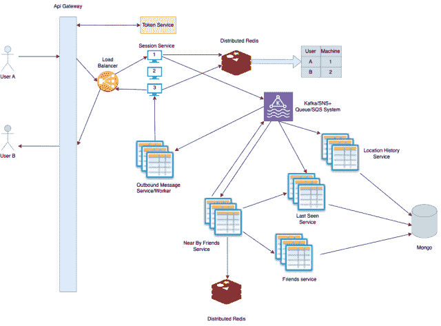
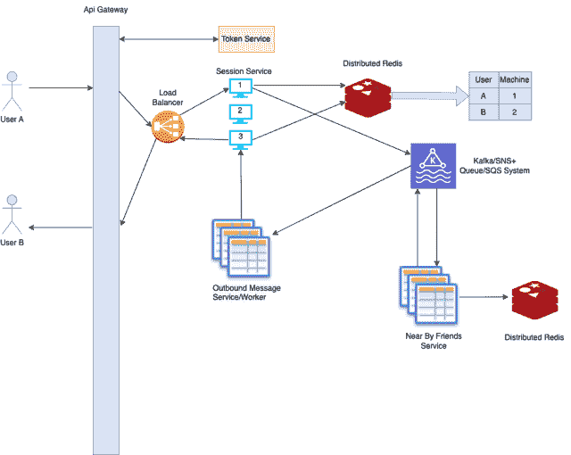

# 附近朋友系统设计

> 原文：[`techbyexample.com/nearby-friends-system-design/`](https://techbyexample.com/nearby-friends-system-design/)

目录

+   概述

+   功能需求

+   非功能性需求

+   数据存储

+   位置更新需求

+   高层设计

+   API 设计

    +   位置更新 API

    +   开启或关闭位置偏好设置

+   位置共享的工作原理

+   第一种方法 – 使用分布式 Redis

    +   用户首次上线

    +   当用户已经在线时

    +   当用户离线或关闭在线状态时

+   第二种方法 – 使用 Redis 发布/订阅

    +   当用户首次上线时

    +   当用户已经在线时

    +   当用户离线或关闭在线状态时

+   非功能性需求

    +   扩展性

+   Redis 发布/订阅服务器的扩展性

    +   频道数量

    +   Redis 发布/订阅集群中使用的实例类型

    +   集群中的实例数量或集群的横向扩展性

    +   发布到频道的消息的平均大小

    +   集群的复制

+   结论

## **概述**

目标是设计附近朋友功能。当我们提到“附近”时，意味着朋友的位置在不断变化。位置变化时，他们的位置会不断更新，并与他们的附近朋友共享。

让我们首先列出系统的功能需求

## **功能需求**

+   用户在线时，应能查看所有朋友的当前位置信息，反之亦然。

+   每当朋友的位置发生变化时，应当反映在用户的视图中，反之亦然。

+   我们应该能够存储用户的位置信息历史，随着位置的变化进行更新。

+   用户应能够控制是否希望自己显示为附近的朋友。换句话说，他们有能力关闭该功能。

## **非功能需求**

+   系统的延迟应尽可能小。

+   显示给用户的朋友位置将是最终一致的。

关于位置共享更新，系统应最终一致。这意味着用户的位置将以最终一致的方式传达给他的朋友，虽然用户的位置可能会暂时不正确地显示给朋友，但最终会显示正确的位置。

在设计附近朋友功能时，第一个问题是朋友的位置信息如何更新到客户端应用中。为此，我们有几种选择。

+   **HTTP 长轮询** – 在这种情况下，客户端不断轮询附近朋友的位置。这种方法效率较低，因为轮询很可能会返回空结果多次。换句话说，可能会有很多空接收，这会浪费网络带宽。此外，在 HTTP 轮询的情况下，只有客户端可以轮询服务器，服务器无法主动将更新推送给客户端。

+   **Web Sockets** – 另一种选择是 Web Sockets。在这种情况下，客户端应用将始终与服务器连接，并且通信是双向的。客户端可以与服务器进行通信，服务器也可以将更新推送给客户端。这种方法的效率较高，因为服务器只会在用户的朋友有位置更新时才与客户端进行通信。

总体来说，Web Sockets 最适合我们的场景。Web Sockets 还有一个额外的优点，就是它们具有粘性会话。如果某个用户必须与特定的服务器实例建立连接，并且连接到服务器端的某个实例，那么他将始终连接到该实例。该用户的所有请求都将只发送到这个特定实例。因此，这使得 Web Sockets 成为点对点通信的一个好选择。

在本教程中，我们将讨论以下内容

+   数据存储

+   位置更新要求

+   高级设计

+   API 设计

+   位置共享的工作原理

+   第一种方法 – 使用分布式 Redis

+   第二种方法 – 使用 Redis Pub/Sub

+   非功能需求

+   Redis Pub/Sub 服务器的可扩展性

+   结论

## **数据存储**

现在让我们分析需要存储的数据。

+   **用户档案**：我们需要存储用户的个人资料信息，包括姓名、头像等。同时，我们需要保存与启用或禁用附近朋友相关的偏好设置。

+   **好友列表**：系统应该能够存储所有用户的好友列表。该好友列表最终将用于显示附近的朋友。

+   **位置跟踪与存储**：系统应能够跟踪用户的位置信息。同时，它们还应该能够存储位置历史记录。

+   附近的朋友仅对在线用户可见。因此，系统应能够存储在线状态。

## **位置更新需求**

关于附近朋友位置更新的工作原理，以下是一些需求

+   当用户首次上线时，他应该能够看到所有在线的朋友

    +   在线用户

    +   且其当前位置在用户当前地点的 x 英里范围内

+   当用户在线时，如果任何在线朋友的新位置在用户当前位置的**x**英里范围内，它将开始显示在附近的朋友列表中，反之亦然

+   当用户下线时，他应该显示为离线状态，且其位置将不再共享。

因此，我们需要在设计中考虑三种场景。

+   当用户首次上线时

+   当用户在线时

+   当用户下线时

## **高层设计**

从高层次上讲，让我们讨论一下更高的流程以及所有需要存在的服务。

+   将会有一个**API 网关**，所有来自用户的请求都将通过该网关。

+   将会有一个**会话服务**。**会话服务**将包含一组实例，用户将通过 WebSocket 连接到这些实例。由于每台机器可以打开的 WebSocket 数量有限，因此根据负载，用户的数量决定了需要多少台机器。

+   该**会话服务**将连接到一个**分布式 Redis**集群，该集群将包含哪些用户连接到哪个机器的信息。由于这些信息是临时的，直到用户断开连接，因此可以使用**分布式 Redis**来存储。这将由会话服务负责维护用户 ID 和机器 ID 的映射。此服务将

    +   如果有用户连接到任何一台机器，将插入记录。

    +   当用户断开连接时

+   除此之外，会话将是一个“傻”服务，意思是它只接受连接，并将任何请求转发到一个**SNS/Kafka**主题。

+   **会话服务**将在接收到任何用户活动时，向 SNS 主题或 Kafka 发布消息。

+   将会有一个**位置历史**服务，用于保存用户的位置信息历史。将会有一个单独的表来存储位置历史，只有位置历史服务会连接到这个表。

+   将会有一个**用户最后一次查看**服务，用于维护用户的最后查看时间和最后已知位置。

+   将会有一个**好友**服务，用于维护所有用户的好友列表。将会有一个单独的表来存储好友列表，只有**好友**服务会连接到这个表。

+   将会有一个**用户档案服务**，用于维护用户档案。它将有自己的一组表格来管理用户档案。

+   将会有一个**附近好友**服务，负责管理附近的好友。它将处理用户在线、用户下线等情况。我们将在本教程中详细讨论此服务。

+   将会有一个**消息输出服务**，它是一个工作服务，负责将外发消息发送给用户。该服务不会包含任何业务逻辑。它只会接收一条消息，消息中包含了需要发送的内容、发送对象以及用户连接的机器信息。这个服务非常简单，只处理消息，不包含任何业务逻辑。

+   将会有一个**令牌服务**，用于管理用户的不同类型令牌。

## **API 设计**

以下是所需的 API 列表：

+   位置更新 API

+   开启或关闭位置偏好设置

### **位置更新 API**

当用户的位置发生变化时，客户端将调用位置更新 API。

**请求体：**

+   经度

+   纬度

+   时间戳

### **开启或关闭位置偏好设置**

当用户设置其位置偏好为开启或关闭时，将由客户端应用调用此接口。

**请求体：**

+   用户 ID

+   开/关

+   时间戳

## **位置共享如何工作**

关于位置共享，有两种方式。

+   用户客户端应用将在定时间隔内拉取位置更新。

+   好友的位置更新将推送到用户的客户端应用。

所以基本上就是**拉取**与**推送**的区别。如我们之前所见，**拉取**模型的缺点是，它可能会浪费网络资源，因为很多时候接收到的可能是空数据。

**Push**的第二种方法在两个方面更好。

+   只有当好友的实际位置发生变化时，更新才会被推送。

+   **推送**方法将能更及时地反映正确的状态。因为**拉取**方法只能在固定时间间隔内执行，而时间间隔通常是以秒为单位。

我们将讨论两种实现**推送**位置更新的方法。

+   在第一种方法中，我们将设计一个非常基础的方式。在此方法中，我们将使用分布式缓存。

+   在第二种方法中，我们将使用 Redis 的发布/订阅（pub/sub）模式，并且我们将查看如何扩展这一方案

## **第一种方法 – 使用分布式 Redis**

首先，让我们详细讨论一下为满足需求所需要的某些服务

**位置历史** 服务

将会有一个位置历史服务，它将连接到 **location_history_db**。这个数据库将存储用户的位置信息历史。以下是该数据库中的字段。我们可以使用任何 NoSQL 数据库，例如 MongoDB

+   id

+   user_id

+   location

+   创建时间

+   更新

**用户最后一次出现** 服务

这个服务将维护两项内容

+   用户的 last_seen 时间

+   用户的最后位置（如果适用）。

它将把这两项内容存储在 **user_last_seen_db** 中。以下是 **user_last_seen_db** 中的字段。我们也可以在这种情况下使用任何 NoSQL 数据库，例如 MongoDB

+   id

+   user_id

+   last_seen – 这是用户最后一次出现的时间戳

+   location – 只有在用户开启位置共享偏好 **ON** 时，这个字段才会被填充。

+   创建时间

+   更新

将会有一个新服务，负责管理附近的朋友。我们将这个服务命名为 **nearby_friends** 服务。

为了维护附近的朋友，我们将使用分布式缓存。这个分布式缓存也可以是 Redis 缓存。该缓存将维护所有打开位置偏好的用户的订阅列表。

举个例子，假设有两个用户 A、B 和 C。以下是朋友列表

+   A 和 B

+   A 和 C

+   A 和 D

以下键将在 Redis 中存在，其中

+   **key** 将是用户的 **user_id**

+   **值** 将是一个 **Set**。您可以在这里阅读有关 Redis 中 Set 的内容 – [`redis.com/ebook/part-1-getting-started/chapter-1-getting-to-know-redis/1-2-what-redis-data-structures-look-like/1-2-3-sets-in-redis/`](https://redis.com/ebook/part-1-getting-started/chapter-1-getting-to-know-redis/1-2-what-redis-data-structures-look-like/1-2-3-sets-in-redis/)

示例：

用户 **A** 的订阅列表

```go
A : {
    B: 1,
    C: 1,
    D: 1
}
```

用户 **B** 的订阅列表

```go
B : {
    A: 1
}
```

用户 **C** 的订阅列表

```go
C : {
    A: 1
}
```

用户 **D** 的订阅列表

```go
D : {
    A: 1
}
```

假设有三种场景，其中所有上述数据将被维护，并且整个附近朋友功能将如何工作。

+   用户首次上线

+   当用户已经在线时

+   用户下线

我们将详细讨论这三种情况。但在深入细节之前，我们先假设

+   用户 A 连接到节点 1

+   用户 B 连接到节点 2

+   用户 C 连接到节点 3

+   用户 D 连接到节点 4

### **用户首次上线**

我们将从用户 **A** 的角度描述这个场景。以下是用户首次上线时的情况图。假设用户 **A** 上线并连接到会话服务的节点 1。



附近朋友高层设计

然后节点 1 将把消息发布到 Kafka/SNS+ SQS 系统，消息包含当前位置和用户 ID。该消息将被三种不同的服务处理。

+   **location_history** 服务。

+   **user_last_seen** 服务。

+   **nearby_friends 服务**

**location_history** 服务将会更新 **location_history_database** 中用户 A 的当前位置。

**user_last_seen** 服务将更新 **user_last_seen_db** 中用户的最后一次见面时间。

**nearby_friends** 服务将执行以下操作。

+   它将会获取所有启用了位置共享的用户 **A** 的朋友。假设用户 **A** 有三位启用了位置共享的朋友：**B**、**C** 和 **D**。

+   它将针对每个朋友 **B**、**C** 和 **D** 使用不同的 **message_type** 分发消息。

让我们跟踪发布给用户 B 的消息流程。

+   用户 **B** 的消息将再次被 **nearby_friends** 服务处理。**nearby_friends** 服务将首先检查用户 **B** 是否在线，查询 **user_last_seen** 服务。如果 **B** 在线，**user_last_seen** 服务还将返回用户的当前位置。

+   接着，附近朋友服务将计算用户 **B** 与用户 **A** 之间的距离。如果距离小于阈值，则将 **B** 添加为 **A** 的订阅者。它将创建如下的 Redis 条目。基本上，它将把用户 **B** 添加为 **A** 的订阅者。

```go
A : {
    B: 1
}
```

+   它还将把用户 **A** 添加为用户 **B** 的订阅者。以下 Redis 条目也将被创建。

```go
B : {
    A: 1
}
```

+   然后它将向 **Kafka/SNS +SQS** 系统发布两条消息，一条用于通知用户 **A**，一条用于通知用户 **B**。

    +   第一条消息将由 **message_outbound** 服务处理，该服务将确定用户 **B** 连接的节点是节点 2。消息外发服务将调用节点 2，节点 2 将通知用户 **B** 的客户端应用程序用户 **A** 已上线。客户端应用程序将开始向用户 **B** 显示用户 **A**。

    +   第二条消息也将由 **message_outbound** 服务处理，该服务将确定用户 **A** 连接的节点是节点 1。消息外发服务将调用节点 1，节点 1 将通知用户 **A** 的客户端应用程序用户 **B** 在阈值距离内。客户端应用程序将开始向用户 **A** 显示用户 **B**。

对于用户 C 和 D 也会发生相同的事情。假设用户 C 的距离在 x 公里以内，而用户 D 的距离不在此范围内。在处理完用户 C 的消息后，将创建以下 Redis 条目。

用户 **A** 的订阅者列表。

```go
A : {
    B: 1,
    C: 1
}
```

用户 **B** 的订阅者列表。

```go
B : {
    A: 1
}
```

用户 **C** 的订阅者列表。

```go
C : {
    A: 1
}
```

### **当用户已经在线时**

用户 A 已经在线，但用户 A 的位置发生了变化。此时，新的位置信息将传递给节点 1。然后节点 1 将会将消息发布到 Kafka/SNS+ SQS 系统中，包含用户的当前位置。这个消息将会被三个不同的服务再次接收。

+   location_history 服务

+   user_last_seen 服务

+   nearby_friends 服务

**location_history**和**user_last_seen**服务将分别更新用户的位置历史和最后一次见到的时间。

**nearby_friends**服务将会

+   获取**A**的订阅者列表，这里是**B**和**C**。然后，它将以不同的**message_type**将消息发送给**B**和**C**。注意，它只会再次将消息发送给用户**B**和**C**。

+   该消息将再次由**nearby_friends**服务接收，如果距离在阈值范围内，它将通知用户**B**和**C**关于用户**A**的新位置，采用与用户首次上线时相同的方法，通过**message_outbound**工作者发送。

+   如果位置不在阈值范围内，那么该用户将被从订阅者列表中移除，反之亦然。例如，假设**A**和**B**的地点相距超过 x 公里。那么用户**B**对用户**A**的订阅以及用户**A**对用户**B**的订阅将被移除。

+   用户**A**和用户**B**将通过**message_outbound**工作者被通知，表示对方不在范围内。

那么，如果假设朋友**D**已经在线，并且由于用户**A**的位置信息变化，朋友**D**现在位于 x 公里范围内，怎么办呢？那么朋友**D**应该开始在朋友**A**的列表中显示，反之亦然。

为了处理这种情况，我们将在每隔一段时间，比如 5 分钟（甚至更长时间），从用户**A**收到位置更新时，重新获取所有朋友的信息，并重新计算距离，以检查现有的在线朋友是否进入了范围。它将重复用户首次上线时提到的相同步骤。

假设这次用户**D**与用户**A**的距离小于 x 公里。那么以下的 redis 条目将被更新，用户**A**和用户**D**将被通知彼此的存在。

用户**A**的订阅者列表

```go
A : {
    B: 1,
    C: 1,
    D: 1
}
```

用户**B**的订阅者列表

```go
B : {
    A: 1
}
```

用户**C**的订阅者列表

```go
C : {
    A: 1
}
```

用户**D**的订阅者列表

```go
D : {
    A: 1
}
```

我们可以通过维护一个在（x + 10）公里范围内的朋友订阅列表来进一步优化上述场景，从而防止频繁移除和插入订阅者列表。

当然，订阅者列表会维护在（x + 10）公里的范围内，但只有当朋友之一位于 x 公里的阈值范围内时，才会发送通知。

### **当用户下线或关闭在线状态时**

当用户下线或关闭在线状态时，他的在线状态应该停止向所有朋友显示。让我们逐一讨论这两种情况。

**当用户下线时**

以下图表展示了用户下线时的流程。



附近朋友下线情况

假设用户**A**下线。用户**A**的朋友**B**、**C**和**D**在用户**A**下线时仍然在线。

以下是即将发生的步骤顺序：

+   用户**A**连接到会话服务的节点 1。一旦 WebSocket 连接被终止，连接终止所在的节点或机器将向 Kafka/SNS + SQS 系统发布一条消息。

+   **nearby_friends** 服务将接收消息。

+   首先，该服务将从 Redis 分布式缓存中获取用户**A**的所有当前订阅者。返回的当前订阅者将是**B**、**C**和**D**。

+   然后它将为用户**B**、**C**和**D**分别发送三条消息。这些消息将被发布到 Kafka/SNS + SQS 系统。

+   会有不同的消息，每条消息都会被**nearby_friends**服务接收。它将从用户**B**、**C**和**D**的相应广播消息中移除用户**A**的订阅。然后它将发布到**message_outbound** 服务。

+   **message_outbound** 服务将把消息转发给用户**B**、**C**和**D**，通知他们用户**A**已经下线。

**当用户关闭在线状态时**

这与用户下线时的情况相同。

## **第二种方法 – 使用 Redis Pub/Sub**

现在我们将详细讨论 Redis Pub/Sub 方法。首先，什么是 Redis Pub/Sub？Redis Pub/Sub 允许

+   命名频道的创建

+   发布者可以向该命名频道发布消息。

+   任何数量的订阅者都可以从该频道收听此消息。发布者发布的任何消息都将提供给所有订阅者。

您可以在这里阅读更多关于 Redis Pub/Sub 的内容 – [`redis.io/docs/manual/pubsub/`](https://redis.io/docs/manual/pubsub/)

所以在这种方法中，我们将为每个用户维护一个单独的命名频道。所有在阈值距离内的在线朋友都将订阅该命名频道。

为了简单起见，假设特定用户的命名频道将使用该用户的 user_id 创建。

让我们再次考虑之前讨论的三种情况。

### **当用户第一次上线时**

假设用户**A**上线并连接到会话服务的节点 1。

节点 1 首先将在 Redis 分布式缓存中为用户 A 创建一个命名频道（如果尚不存在）。然后，节点 1 将发布包含用户当前位置的消息到 Kafka/SNS + SQS 系统。节点 1 还将缓存 A 的最新位置。此消息将被三个不同的服务获取。

+   location_history 服务

+   user_last_seen 服务

+   nearby_friends 服务

**location_history**服务将更新用户 A 在 location_history_database 中的当前位置。

**user_last_seen**服务将更新用户在 last_seen 数据库中的最后一次看到时间。

**nearby_friends**服务将执行以下操作：

+   它将从**friends**服务中获取所有启用了位置共享偏好的用户**A**的朋友。假设用户 A 有三位朋友**B**、**C** 和**D**，他们都启用了位置共享。

+   对于每个朋友，它将以不同的消息类型分发消息。因此，将分别为用户**B**、**C**和**D**发布三条不同的消息。

让我们跟踪发布给用户 B 的消息流程。

+   用户 B 的消息将由**nearby_friends**服务再次获取。**nearby_friends**服务将首先检查用户 B 是否在线，通过**user_last_seen**服务。如果在线，**user_last_seen**服务还将返回用户的当前位置。

+   然后，**nearby_friends**服务将计算自己与用户**A**的距离。如果距离小于阈值，它将向 Kafka/SNS + SQS 系统发布两条消息。

    +   这条首条消息将由**message_outbound**服务获取，后者将确定用户**B**连接的节点，即节点 2。消息外发服务将调用节点 2。节点 2 将用户**B**订阅到用户**A**的命名频道并开始监听。同时，节点 2 将通知用户**B**的客户端应用程序，A 已上线。客户端应用程序将开始将用户**A**展示给用户**B**。此外

    +   第二条消息也会由**message_outbound**服务获取，后者将确定用户 A 连接的节点，即节点 1。消息外发服务将调用节点 1。节点 1 会通知用户 A 的客户端应用程序，B 在阈值距离内。同时，节点 1 将用户**A**订阅到用户**B**的命名频道并开始监听。客户端应用程序将开始将用户**B**展示给用户**A**。

用户**C**和用户**D**也会发生同样的事情，但假设用户**D**距离用户**A**的阈值 x 公里之外，因此用户**D**不会显示给用户**A**。

总体来说

+   用户**A**连接的节点 1 已订阅用户**B**和**C**的命名频道。

+   用户**B**连接的节点 2 已订阅用户**A**的命名频道。

+   用户**C**连接的节点 3 已订阅了用户**A**的命名频道。

### **当用户已经在线时**

用户**A**的位置发生变化。调用会到达节点 1，节点 1 将把新位置发布到用户**A**的命名频道。

新位置将被节点 2 和节点 3 分别接收到，并通知用户 B 和 C。两者都会重新计算距离，并

+   如果距离小于 x 公里，则会通知**B**和**C**用户**A**的新位置。

+   如果距离超过 x 公里，则首先会从用户**A**的命名频道中移除**B**和**C**的订阅。同时，系统会通知**B**和**C**，用户**A**不在范围内。

节点 1 还会将新位置发布到 SNS/Kafka + SQS 系统，消息会被

+   location_history 服务

+   last_seen 服务

+   nearby_friends - 它将获取所有朋友并重新计算距离，以应对这种情况，即两位用户曾经在线，现在他们的位置已在 x 公里范围内。

**location_history**和**user_last_seen**服务将会做与之前相同的操作。

### **当用户下线或关闭在线状态时**

当用户下线或关闭在线状态时，他的在线状态应停止显示给所有朋友。我们将逐一讨论这两种情况。

**当用户下线时**

假设用户**A**下线。当用户**A**下线时，用户**A**的朋友**B**和**C**正在线。以下是将要发生的步骤顺序：

调用会到达与用户**A**连接的节点 1。当节点 1 上的 WebSocket 连接被终止时，连接结束的节点或机器会在用户**A**的命名频道上发送一条消息，消息如下，表示用户已下线。

```go
location:nil
```

节点 2 和节点 3，分别对应用户**B**和**C**，会监听到这个消息，并立即通知**B**和**C**用户**A**已下线。**B**和**C**的客户端应用会立刻停止显示用户**A**。

除此之外，还会将**B**和**C**从用户**A**的命名频道中移除作为订阅者。

优化：通过**nearby_friends**服务以同步方式异步地移除**B**和**C**的订阅也可以实现。

**当用户关闭在线状态时**

这与用户下线时的情况相同。

**两种方法的比较**

第二种方法显然稍微更快，因为会话服务中的所有节点或机器直接监听 redis 中的 pub/sub 频道，一旦消息发布，订阅者会立即收到通知。

但是也有一个缺点。如果用户数量如此庞大，则可能会有数百万或数十亿个命名频道。此外，对于如此数量的频道，可能会有 n 次订阅，其中 n 是每次在线的平均好友数。

所有这些订阅需要在会话服务的节点上维护，这可能会导致扩展困难。稍后，我们将进行容量估算，并讨论发布/订阅模型的扩展挑战。

## **非功能性需求**

### **可扩展性**

在上述设计中，首先需要考虑的是可扩展性因素。系统中每个组件的可扩展性非常重要。以下是你可能面临的可扩展性挑战及其可能的解决方案

+   会话服务中的每台机器只能容纳有限数量的连接。因此，基于当前在线用户的数量，可以设置机器数量和实例数量。例如，一台机器大约有 65000 个端口。

+   对于第二种方法，会话服务中的每台机器也可能会有数百万个对 Redis 发布/订阅的订阅。例如，如果一台机器通过 WebSocket 连接了 1000 个用户，而每个用户有 200 个在线好友。那么该机器将有 1000 * 200 = 200K 个订阅。这些订阅将会对内存和 CPU 产生影响。扩展会话服务时，必须考虑这一影响。

+   对于分布式缓存的可扩展性，我们应该启用水平扩展。稍后在本教程中，我们将详细讨论 Redis 发布/订阅的分布式缓存扩展。

+   你的 Kafka 系统可能无法承载如此大的负载。我们可以进行水平扩展，但有其限制。如果成为瓶颈，那么根据地理位置或用户 ID，我们可以部署两个或更多这样的系统。可以使用服务发现来确定请求应该发送到哪个 Kafka 系统。

+   对其他服务也可以采取类似的方法。

+   另一个可扩展性的重要因素是我们已经设计了系统，以确保没有任何服务被过多任务拖累。系统之间有清晰的责任分离，对于那些负担过重的服务，我们进行了拆分。

## **Redis 发布/订阅服务器的可扩展性**

正如我们之前提到的，Redis 发布/订阅频道创建成本很低。Redis 发布/订阅能够处理大量频道，因此可以支持大量发布者和订阅者。

Redis 发布/订阅的可扩展性因素有哪些？

+   频道数量

+   Redis 发布/订阅集群中使用的实例类型

    +   内存

    +   CPU

+   集群中的实例数量或集群的水平扩展性。

+   发布到频道的消息的平均大小

+   集群的复制

### **频道数量**

我们来做一些基于用户估算的数学假设。假设有 10 亿个用户，其中 20%的用户始终在线，并启用了位置偏好设置。也就是说，200 百万用户。假设每个用户平均有 20 个朋友同时在线。所以总体上我们将需要

+   需要创建 2 亿个频道

+   每个频道将有 20 个订阅者

### **Redis 发布/订阅集群中使用的实例类型**

Redis 发布/订阅运行所在的硬件是一个重要因素，主要是机器的内存和 CPU。机器的内存和 CPU 越多，可以创建的频道就越多。

**内存**

每个用户的 UUID 为 16 字节。每个频道将有 200 个订阅者。Redis 发布/订阅频道是通过哈希表和双向链表在内部实现的。

总体大小大约为

+   16 字节 UUID * 1 个发布者 = 16 字节

+   16 字节的 UUID * 200 个订阅者 = 3200 字节

+   8 字节指针 * 21 = 180 字节

所以每个频道大约需要 3400 字节。我们可以假设每个频道平均占用 4000 字节或 4KB。

2 亿个频道 * 4 KB = 800 GB

如果每台服务器的内存平均为 20 GB，我们大约需要 800/20=40 台服务器作为最小配置。同时，还需要考虑到这一点。

**CPU**

**集群的 CPU 需求必须通过负载测试来计算。根据负载测试的结果，可能需要增加或减少服务器数量。**

**### 集群中的实例数量或集群的水平可扩展性**

集群必须具备水平可扩展性，这意味着如果需要，可以添加新服务器；如果不需要，可以删除现有服务器。我们可以使用一致性哈希来实现这一点。使用一致性哈希时，新增或删除服务器时，键的分布会最小化。

### **发布到频道的消息的平均大小**

这是考虑可扩展性时需要注意的一个重要因素，因为当消息发布到频道时，Redis 发布/订阅将会一直保存消息，直到所有订阅者接收到该消息。

### **集群的复制**

集群还将启用复制。集群中的每个实例也会有副本。

上述可扩展性考虑同样适用于我们将在方法 1 中使用的分布式缓存。

## **结论**

这就是关于设计附近朋友的内容。希望你喜欢这篇文章。请在评论中分享反馈。

**备注：** 查看我们的系统设计教程系列 [系统设计问题](https://techbyexample.com/system-design-questions/)**
