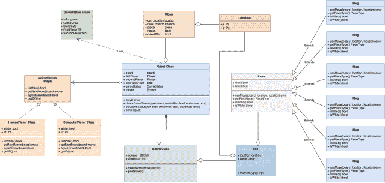

# 国际象棋游戏系统设计

> 原文：[`techbyexample.com/chess-low-level-design/`](https://techbyexample.com/chess-low-level-design/)

目录

+   概述

+   需求

+   游戏中的所有参与者

+   UML 图

    +   棋子

    +   格子

    +   移动

    +   玩家

    +   棋盘

    +   游戏类

+   低级图

+   代码

+   结论

# **概述**

在本教程中，我们将设计一款国际象棋游戏。国际象棋是一种在两名玩家之间进行的棋盘游戏。关于国际象棋的更多信息可以在此处找到

[`en.wikipedia.org/wiki/Chess`](https://en.wikipedia.org/wiki/Chess)

在开始之前，请注意这是一个低级设计问题。我们将使用面向对象原则设计一款国际象棋游戏。

设计一款国际象棋游戏是一个非常常见的系统设计面试问题，和其他任何系统设计面试一样，面试官关注的是：

+   你对面向对象设计的理解

+   你如何在设计中框架设计模式

另外，请注意此问题不是分布式系统设计。

在本教程中，我们将讨论国际象棋游戏的低级设计。与此同时，我们还将查看国际象棋游戏的工作代码。以下是目录：

+   需求

+   设计中的参与者

+   UML 图

+   用 Go 编程语言表示的低级设计

+   工作代码

# **需求**

本教程的需求是根据国际象棋规则，使用面向对象设计原则设计一款国际象棋游戏。

这篇文章可以参考了解更多关于国际象棋规则的信息

[`en.wikipedia.org/wiki/Rules_of_chess`](https://en.wikipedia.org/wiki/Rules_of_chess)

下一步是识别国际象棋游戏中的所有参与者

# **游戏中的所有参与者**

+   棋盘

+   兵

+   玩家

    +   人类玩家

    +   计算机玩家

+   移动

+   棋子

    +   国王

    +   后宫

    +   主教

    +   车

    +   马

    +   兵

+   游戏

+   移动

让我们来看一下这些参与者

+   **棋盘** – 在国际象棋游戏中，我们有一个 8*8 的棋盘。所以总共有 64 个格子。

+   **格子** – 一个格子表示 8*8 = 64 个格子中的一个

+   **玩家** – 它表示正在进行游戏的两名玩家之一。一个玩家可以是：

    +   人类玩家 –

    +   计算机玩家

+   **移动** – 它表示玩家之一所做的移动

+   **棋子** – 国际象棋游戏中有不同类型的棋子，分别是：

    +   国王

    +   后宫

    +   主教

    +   车

    +   马

    +   兵

+   **游戏** – 游戏类控制着整个国际象棋游戏的流程。它决定了当前是哪个玩家的回合，游戏的总体结果等等。

+   **移动** – 它简单地表示游戏中的一次移动。

除了上述的参与者外，我们还有 **游戏状态** 枚举，其中包含以下类型：

+   第一玩家胜

+   第二玩家胜

+   游戏进行中

+   和棋

+   和棋

# **UML 图**

以下是国际象棋游戏的 UML 图



让我们通过查看不同的组件以及每个组件如何与其他组件集成，来理解这个 UML 图。

## **棋子**

上述设计中最简单的组件是**棋子**。如上所述，棋子有七种类型，分别是国王、皇后、车、象、骑士和兵。棋子类是一个抽象类，包含以下信息

+   **白色** – 如果棋子是白色，则设置为真，否则为假

+   **已被捕获** – 棋子是否被吃掉。

此外，它还提供了一个函数**canMove()**，如果给定的棋子可以从当前棋盘位置移动到新位置，则返回真。该函数的签名如下

+   **canMove(board, location, location)**

## **棋子**

下一个最简单的组件是**格子**。格子代表棋盘上的一个格子。一个格子将具有以下组件

+   **位置** – 它表示棋盘上格子的**x**和**y**坐标

+   **棋子** – 当前在指定格子上的棋子。如果该格子没有棋子，则为 nil

## **移动**

它代表棋局中的一次移动。国际象棋中有三种不同的移动方式。

+   认输

+   和棋提议

+   将棋子从当前位置移动到新的格子

它包含以下组件，代表上述三种类型的移动。

+   **当前所在位置** – 棋子当前的位置

+   **新位置** – 棋子移动到的新位置

+   **棋子** – 被移动的棋子

+   **认输** – 这步是认输还是不是

+   **和棋提议** – 玩家是否提出和棋提议。

## **玩家**

有两种不同类型的玩家

+   人类玩家

+   计算机玩家

玩家将拥有以下字段或组件

+   **isWhite** – 玩家是否执白棋

+   **getNextMove** – 获取玩家的下一步

+   **agreeDraw** – 玩家是否同意和棋提议

## **棋盘**

接下来是**棋盘**类。它代表游戏的棋盘。它包含以下组件

+   **方格** – 二维数组**格子**

+   **维度** – 棋盘的维度，始终为 8

## **游戏类**

接下来是系统中最重要的类——**游戏**类。它包含以下组件

+   **棋盘** – 它代表棋盘

+   **先手玩家** – 先手玩家

+   **第二玩家** – 第二个玩家

+   **先手玩家回合** – 如果当前是先手玩家的回合则为真，否则为假

+   **游戏状态** – 当前游戏的状态

+   **已移动** – 迄今为止所有已做出的移动

# **低级**–**级别图**

下面是 Go 编程语言中的低级图

**游戏**

```go
type game struct {
	board           *board
	firstPlayer     iPlayer
	secondPlayer    iPlayer
	firstPlayerTurn bool
	gameStatus      GameStatus
	moves           []move
}

func (this *game) play() error {}

func (g *game) setGameStatus(win bool, whiteWon bool, stalemate bool) {}

func (g *game) printResult() {}
```

**游戏状态**

```go
type GameStatus uint8

const (
    GameInProgress GameStatus = iota
    GameDraw
    Stalemate
    FirstPlayerWin
    SecondPlayerWin
)
```

**棋盘**

```go
type board struct {
	square    [][]cell
	dimension int
}

func (this *board) printBoard() {}

func (this *board) makeMove(move move) error {}
```

**格子**

```go
type cell struct {
	location location
	piece    piece
}
```

**移动**

```go
type move struct {
    currLocation location
    newLocation  location
    piece        piece
    resign       bool
    drawOffer    bool
}
```

**iPlayer 接口**

```go
type iPlayer interface {
    isWhite() bool
    getNextMove(board) move
    agreeDraw(board) bool
    getID() int
}
```

**人类玩家**

```go
type humanPlayer struct {
    white bool
    id    int
}

func (this humanPlayer) getID() int {}

func (this humanPlayer) isWhite() bool {}

func (this humanPlayer) getNextMove(board board) move {}

func (this humanPlayer) agreeDraw(board board) bool {}
```

**计算机玩家**

```go
type computerPlayer struct {
	white bool
	id    int
}

func (this computerPlayer) isWhite() bool {}

func (this computerPlayer) getID() int {}

func (this computerPlayer) getNextMove(board board) move {}

func (this computerPlayer) agreeDraw(board board) bool {}
```

**棋子**

```go
type piece interface {
	canMove(board, location, location) error
	getPieceType() PieceType
	isKilled() bool
	isWhite() bool
}
```

**棋子类型**

```go
type PieceType uint8

const (
	King PieceType = iota
	Queen
	Rook
	Bishop
	Knight
	Pawn
)
```

**国王棋子**

```go
type king struct {
	white  bool
	killed bool
}

func (this *king) canMove(board board, currLocation, newLocation location) error {}

func (this *king) getPieceType() PieceType {}

func (this *king) isKilled() bool {}

func (this *king) isWhite() bool {}
```

**皇后棋子**

```go
type queen struct {
	white  bool
	killed bool
}

func (this *queen) canMove(board board, currLocation, newLocation location) error {}

func (this *queen) getPieceType() PieceType {}

func (this *queen) isKilled() bool {}

func (this *queen) isWhite() bool {}
```

**车棋子**

```go
type rook struct {
	white  bool
	killed bool
}

func (this *rook) canMove(board board, currLocation, newLocation location) error {}

func (this *rook) getPieceType() PieceType {}

func (this *rook) isKilled() bool {}

func (this *rook) isWhite() bool {}
```

**象棋子**

```go
type bishop struct {
	white  bool
	killed bool
}

func (this *bishop) canMove(board board, currLocation, newLocation location) error {}

func (this *bishop) getPieceType() PieceType {}

func (this *bishop) isKilled() bool {}

func (this *bishop) isWhite() bool {}
```

**骑士棋子**

```go
type knight struct {
	white  bool
	killed bool
}

func (this *knight) canMove(board board, currLocation, newLocation location) error {}

func (this *knight) getPieceType() PieceType {}

func (this *knight) isKilled() bool {}

func (this *knight) isWhite() bool {}
```

**兵棋子**

```go
type pawn struct {
	white  bool
	killed bool
}

func (this *pawn) canMove(board board, currLocation, newLocation location) error {}

func (this *pawn) getPieceType() PieceType {}

func (this *pawn) isKilled() bool {}

func (this *pawn) isWhite() bool {}
```

**位置**

```go
type location struct {
	i int
	j int
}
```

# **代码**

让我们来看看代码。下面的代码并不是根据国际象棋算法和规则完全可用的功能性代码，但它可以给你一个大致的概念。

**game.go**

```go
package main

import "fmt"

type game struct {
	board           *board
	firstPlayer     iPlayer
	secondPlayer    iPlayer
	firstPlayerTurn bool
	gameStatus      GameStatus
	moves           []move
}

func initGame(b *board, p1, p2 iPlayer) *game {
	game := &game{
		board:           b,
		firstPlayer:     p1,
		secondPlayer:    p2,
		firstPlayerTurn: true,
		gameStatus:      GameInProgress,
	}
	return game
}

func (this *game) play() error {
	var move move
	var err error
	for {
		if this.firstPlayerTurn {
			move = this.firstPlayer.getNextMove(*this.board)
			if move.resign {
				this.setGameStatus(true, true, false)
			}
			if move.drawOffer {
				if this.secondPlayer.agreeDraw(*this.board) {
					this.setGameStatus(false, true, false)
					break
				}
			}
			err := this.board.makeMove(move)
			if err != nil {
				return err
			}
		} else {
			move = this.firstPlayer.getNextMove(*this.board)
			if move.resign {
				this.setGameStatus(true, true, false)
			}
			if move.drawOffer {
				if this.secondPlayer.agreeDraw(*this.board) {
					this.setGameStatus(false, true, false)
					break
				}
			}
			err = this.board.makeMove(move)
			if err != nil {
				return err
			}
		}
		this.moves = append(this.moves, move)
		win, draw, stalemate := this.checkGameStatus()
		this.setGameStatus(win, draw, stalemate)
		if this.gameStatus != GameInProgress {
			break
		}
	}
	return nil
}

func (this *game) checkGameStatus() (win bool, whiteWon bool, stalemate bool) {

	return true, true, true

}

func (g *game) setGameStatus(win bool, whiteWon bool, stalemate bool) {
	if win {
		if whiteWon {
			if g.firstPlayer.isWhite() {
				g.gameStatus = FirstPlayerWin
				return
			} else {
				g.gameStatus = SecondPlayerWin
				return
			}
		}
	}
	if stalemate {
		g.gameStatus = Stalemate
	}
	g.gameStatus = GameDraw
	return
}

func (g *game) printResult() {
	switch g.gameStatus {
	case GameInProgress:
		fmt.Println("Game in Progress")
	case GameDraw:
		fmt.Println("Game Drawn")
	case Stalemate:
		fmt.Println("Stalemate")
	case FirstPlayerWin:
		fmt.Println("First Player Win")
	case SecondPlayerWin:
		fmt.Println("Second Player Win")
	default:
		fmt.Println("Invalid Game Status")
	}
	g.board.printBoard()
}
```

**gamestatus.go**

```go
package main

type GameStatus uint8

const (
	GameInProgress GameStatus = iota
	GameDraw
	Stalemate
	FirstPlayerWin
	SecondPlayerWin
)
```

**board.go**

```go
package main

type board struct {
	square    [][]cell
	dimension int
}

func (this *board) printBoard() {

}

func (this *board) makeMove(move move) error {
	err := move.piece.canMove(*this, move.currLocation, move.newLocation)
	if err != nil {
		return err
	}

	//Mark the piece at new location as as the current piece
	this.square[move.newLocation.i][move.newLocation.j].piece = move.piece

	//Mark the piece at current location as nil
	this.square[move.currLocation.i][move.currLocation.j].piece = nil
	return nil
}
```

**cell.go**

```go
package main

type cell struct {
	location location
	piece    piece
}
```

**move.go**

```go
package main

type move struct {
	currLocation location
	newLocation  location
	piece        piece
	resign       bool
	drawOffer    bool
}
```

**iPlayer.go**

```go
package main

type iPlayer interface {
	isWhite() bool
	getNextMove(board) move
	agreeDraw(board) bool
	getID() int
}
```

**humanPlayer.go**

```go
package main

type humanPlayer struct {
	white bool
	id    int
}

func (this humanPlayer) getID() int {
	return this.id
}

func (this humanPlayer) isWhite() bool {
	return this.white
}

func (this humanPlayer) getNextMove(board board) move {
	currLocation := location{
		i: 1,
		j: 0,
	}

	newLocation := location{
		i: 2,
		j: 0,
	}
	return move{
		currLocation: currLocation,
		piece:        board.square[1][0].piece,
		newLocation:  newLocation,
	}
}

func (this humanPlayer) agreeDraw(board board) bool {
	return false
}
```

**computerPlayer.go**

```go
package main

type computerPlayer struct {
	white bool
	id    int
}

func (this computerPlayer) isWhite() bool {
	return this.white
}
func (this computerPlayer) getID() int {
	return this.id
}

func (this computerPlayer) getNextMove(board board) move {
	currLocation := location{
		i: 1,
		j: 0,
	}

	newLocation := location{
		i: 2,
		j: 0,
	}
	return move{
		currLocation: currLocation,
		piece:        board.square[1][0].piece,
		newLocation:  newLocation,
	}
}

func (this computerPlayer) agreeDraw(board board) bool {
	return false
}
```

**piece.go**

```go
package main

type piece interface {
	canMove(board, location, location) error
	getPieceType() PieceType
	isKilled() bool
	isWhite() bool
}
```

**pieceType.go**

```go
package main

type PieceType uint8

const (
	King PieceType = iota
	Queen
	Rook
	Bishop
	Knight
	Pawn
)
```

**king.go**

```go
package main

type king struct {
	white  bool
	killed bool
}

func (this *king) canMove(board board, currLocation, newLocation location) error {
	return nil
}

func (this *king) getPieceType() PieceType {
	return King
}

func (this *king) isKilled() bool {
	return this.killed
}

func (this *king) isWhite() bool {
	return this.white
}
```

**queen.go**

```go
package main

type queen struct {
	white  bool
	killed bool
}

func (this *queen) canMove(board board, currLocation, newLocation location) error {
	return nil
}

func (this *queen) getPieceType() PieceType {
	return Queen
}

func (this *queen) isKilled() bool {
	return this.killed
}

func (this *queen) isWhite() bool {
	return this.white
}
```

**rook.go**

```go
package main

type rook struct {
	white  bool
	killed bool
}

func (this *rook) canMove(board board, currLocation, newLocation location) error {
	return nil
}

func (this *rook) getPieceType() PieceType {
	return Pawn
}

func (this *rook) isKilled() bool {
	return this.killed
}

func (this *rook) isWhite() bool {
	return this.white
}
```

**bishop.go**

```go
package main

type bishop struct {
	white  bool
	killed bool
}

func (this *bishop) canMove(board board, currLocation, newLocation location) error {
	return nil
}

func (this *bishop) getPieceType() PieceType {
	return Pawn
}

func (this *bishop) isKilled() bool {
	return this.killed
}

func (this *bishop) isWhite() bool {
	return this.white
}
```

**knight.go**

```go
package main

type knight struct {
	white  bool
	killed bool
}

func (this *knight) canMove(board board, currLocation, newLocation location) error {
	return nil
}

func (this *knight) getPieceType() PieceType {
	return Knight
}

func (this *knight) isKilled() bool {
	return this.killed
}

func (this *knight) isWhite() bool {
	return this.white
}
```

**pawn.go**

```go
package main

type pawn struct {
	white  bool
	killed bool
}

func (this *pawn) canMove(board board, currLocation, newLocation location) error {
	return nil
}

func (this *pawn) getPieceType() PieceType {
	return Pawn
}

func (this *pawn) isKilled() bool {
	return this.killed
}

func (this *pawn) isWhite() bool {
	return this.white
}
```

**location.go**

```go
package main

type location struct {
	i int
	j int
}
```

**main.go**

```go
package main

func main() {

	whiteKing, whiteQueen, whiteRooks, whiteBishops, whiteKnights, whitePawns := makePieces(true)
	blackKing, blackQueen, blackRooks, blackBishops, blackKnights, blackPawns := makePieces(true)

	cells := make([][]cell, 8)

	for i := 0; i < 8; i++ {
		cells[i] = make([]cell, 8)
	}

	//Fill White Pieces in the first row
	cells[0][0] = cell{location: location{i: 0, j: 0}, piece: whiteRooks[0]}
	cells[0][1] = cell{location: location{i: 0, j: 1}, piece: whiteKnights[0]}
	cells[0][2] = cell{location: location{i: 0, j: 2}, piece: whiteBishops[0]}
	cells[0][3] = cell{location: location{i: 0, j: 3}, piece: whiteKing}
	cells[0][4] = cell{location: location{i: 0, j: 4}, piece: whiteQueen}
	cells[0][5] = cell{location: location{i: 0, j: 5}, piece: whiteBishops[1]}
	cells[0][6] = cell{location: location{i: 0, j: 6}, piece: whiteKnights[1]}
	cells[0][7] = cell{location: location{i: 0, j: 7}, piece: whiteRooks[1]}
	//Fill White Pawns in the second row
	for i := 0; i < 8; i++ {
		cells[1][i] = cell{location: location{i: 0, j: 7}, piece: whitePawns[i]}
	}

	//Fill Black Pieces in the first row
	cells[7][0] = cell{location: location{i: 7, j: 0}, piece: blackRooks[0]}
	cells[7][1] = cell{location: location{i: 7, j: 1}, piece: blackKnights[0]}
	cells[7][2] = cell{location: location{i: 7, j: 2}, piece: blackBishops[0]}
	cells[7][3] = cell{location: location{i: 7, j: 3}, piece: blackKing}
	cells[7][4] = cell{location: location{i: 7, j: 4}, piece: blackQueen}
	cells[7][5] = cell{location: location{i: 7, j: 5}, piece: blackBishops[1]}
	cells[7][6] = cell{location: location{i: 7, j: 6}, piece: blackKnights[1]}
	cells[7][7] = cell{location: location{i: 7, j: 7}, piece: blackRooks[1]}
	//Fill Black Pawns in the second row
	for i := 0; i < 8; i++ {
		cells[6][i] = cell{location: location{i: 0, j: 7}, piece: blackPawns[i]}
	}

	board := &board{
		square:    cells,
		dimension: 8,
	}

	player1 := humanPlayer{
		white: true,
		id:    1,
	}

	player2 := computerPlayer{
		white: false,
		id:    1,
	}

	game := initGame(board, player1, player2)
	game.play()
	game.printResult()
}

func makePieces(isWhite bool) (*king, *queen, [2]*rook, [2]*bishop, [2]*knight, [8]*pawn) {

	king := &king{
		white: isWhite,
	}

	queen := &queen{
		white: isWhite,
	}

	rooks := [2]*rook{}
	for i := 0; i < 2; i++ {
		r := &rook{
			white: true,
		}
		rooks[i] = r
	}

	bishops := [2]*bishop{}
	for i := 0; i < 2; i++ {
		b := &bishop{
			white: true,
		}
		bishops[i] = b
	}

	knights := [2]*knight{}
	for i := 0; i < 2; i++ {
		k := &knight{
			white: true,
		}
		knights[i] = k
	}

	pawns := [8]*pawn{}
	for i := 0; i < 8; i++ {
		p := &pawn{
			white: isWhite,
		}
		pawns[i] = p
	}

	return king, queen, rooks, bishops, knights, pawns
}
```

# **结论**

这就是关于国际象棋游戏的低级设计。我们希望你喜欢这篇文章。请在评论中分享反馈。
