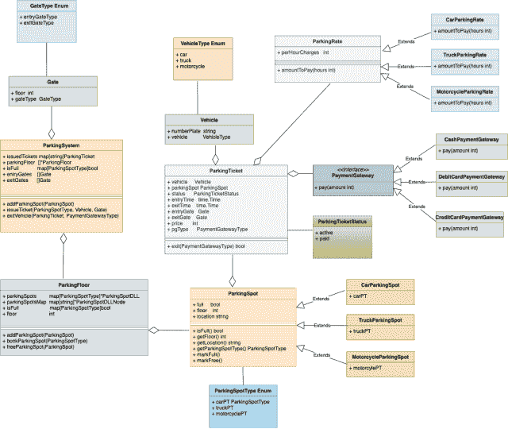

# 停车场系统设计

> 原文：[`techbyexample.com/parking-lot-system-design/`](https://techbyexample.com/parking-lot-system-design/)

目录

+   概述

+   需求

+   停车系统设计中的所有角色

    +   停车位

    +   停车门

    +   停车票

    +   支付网关类型

    +   车辆

    +   停车费

    +   停车楼层

    +   停车系统

+   UML 图

+   低级设计

+   程序

+   完整工作代码在一个文件中

+   结论

# **概述**

在回答任何系统设计问题时，重要的是要记住系统设计问题可能非常广泛。因此，切勿直接跳到解决方案。与面试官讨论用例是很好的，这样可以理解他在寻找什么。决定在你的系统设计中包含哪些功能。

这也是面试官在考察的一个方面。他们可能在寻找

+   你如何进行需求分析

+   你能否列出所有的需求

+   你在问什么问题？

设计一个停车场是一个非常常见的系统设计面试问题，和其他任何系统设计面试一样，面试官在寻找的就是这些

+   你对面向对象设计的理解

+   你如何在设计模式的框架下进行设计

另外，请注意，这个问题不是分布式系统设计问题。

在本教程中，我们将讨论停车场的低级设计。除此之外，我们还将展示停车场的完整工作代码。以下是目录

+   需求

+   设计中的角色

+   UML 图

+   用 Go 编程语言表示的低级设计

+   完整的工作代码

+   完整工作代码在一个文件中

# **需求**

设计任何东西时，了解系统的一些高级需求是至关重要的。

+   系统可能有多个入口

+   停车场中可能会有多个

+   将有不同类型的停车位

+   每小时停车将收取费用。费用将根据不同类型的停车位和不同的车辆类型进行收费

+   系统应该能够适应任何类型的变化

+   停车场可以是多层的

# **停车系统设计中的所有角色**

+   停车系统

+   停车楼层

+   停车位 – 不同类型的停车位

    +   停车位

    +   卡车停车位

    +   摩托车停车位

+   停车票

+   入口和出口门

+   支付网关

+   车辆

让我们来看看这些角色中的每一个

## **停车位**

现在，停车位可以是不同类型的。它可以是：

+   汽车停车位

+   大型车辆停车位

+   摩托车停车位

## **停车闸口**

可能会有进出口闸口。不同楼层可能会有不同的闸口。

## **停车票**

每辆进场的车辆都会发放停车票。车辆将根据类型分配停车位。例如，汽车将被分配到汽车停车位类型，摩托车将被分配到摩托车停车位，等等。

## **支付网关类型**

客户可以通过以下方式支付：

+   现金

+   借记卡

+   信用卡

## **车辆**

停车场为以下车辆类型提供停车位

+   汽车

+   卡车

+   摩托车

## **停车费**

停车一辆车、卡车或摩托车的费用是不同的。这些将被封装在停车费用类别中。

## **停车楼层**

停车楼层维护该楼层所有停车位的列表。停车楼层将负责预定和释放该楼层不同类型的停车位。

## **停车系统**

它是系统的主要组件，是我们设计中的驱动类。

这些角色如何相互通信将通过 UML 图和后续的解释来清楚展示。

# **UML 图**

以下是停车场的 UML 图



让我们通过查看不同的组件，理解这个 UML 图以及每个组件是如何与其他组件集成的。

上述 UML 系统中最简单的组件是停车位。一个停车位包含三个信息：

+   满位 – 表示停车位是否已满

+   楼层 – 停车位所在的楼层

+   位置 – 停车位的具体位置编号

下一个组件是停车票。停车票将包含以下信息：

+   **车辆** – 该停车票是为哪种类型的车辆发放的。车辆还会有车牌号码。

+   **停车位** – 车辆停放的具体停车位。你可能会想为什么停车票中需要包含这一信息。这个信息存在于停车票中是为了我们能够找回停车位。你可能会争辩说，一旦停车票发出，停车就可以停在任何位置。但在本教程中，我们正在构建一个更复杂的系统，在这个系统中，我们可以确切知道车辆停放的位置。如果你想构建一个系统，在其中针对某张停车票停车可以分配到任何停车位，那是比较简单的，方法是我们只需为每个停车位维护一个计数。事实上，这就是本教程中设计的简化版本。

+   除此之外，停车票还会包含入场时间、出场时间、价格、闸口信息、PG 信息等。

下一个组件是**停车楼层**。停车楼层维护该楼层所有停车位的列表。它包含以下信息：

+   **停车位** – 每种类型的停车位都会有一个双向链表。例如，车位类型停车位会有一个单独的 DLL，而卡车类型停车位则会有不同的 DLL。为什么使用 DLL？使用 DLL 可以轻松在 O(1)时间内找到下一个空闲停车位。而且当一个停车位变为空闲时，我们可以简单地将其移到链表前面，表示它是空的。

+   **楼层编号 –** 楼层编号仅仅是

+   **isFull –** 表示是否已满

然后，主要组件是**ParkingSystem**。它将包含以下信息

+   一个停车楼层的数组

+   它已经发出的停车票列表

+   除此之外，它还会包含关于出入口门的信息，**isFull** 变量用于表示整个停车场是否已满。

除了这些主要组件，我们还有

+   车辆组件

+   支付网关组件

+   出入口门

+   停车费

+   等等

**此设计中使用的设计模式**

+   使用工厂模式创建不同类型停车位的实例

+   使用享元设计模式创建固定的停车费和支付网关实例。

# **低**–**级设计**

以下是用 Go 编程语言表示的低级设计，稍后我们还会看到一个实际的示例

**停车系统**

```go
type ParkingSystem struct {
	issuedTickets map[string]ParkingTicket
	parkingFloor  []*ParkingFloor
	isFull        map[ParkingSpotType]bool
	entryGates    []Gate
	exitGates     []Gate
}

func (this *ParkingSystem) addParkingSpot(parkingSpot ParkingSpot) {}

func (this *ParkingSystem) bookParkingSpot(pSpotType ParkingSpotType) (ParkingSpot, error) {}

func (this *ParkingSystem) issueTicket(pSpotType ParkingSpotType, vehicle Vehicle, entryGate Gate) (*ParkingTicket, error) {}

func (this *ParkingSystem) exitVehicle(ticket *ParkingTicket, pGType PaymentGatewayType) {}
```

**停车楼层**

```go
type ParkingFloor struct {
	parkingSpots    map[ParkingSpotType]*ParkingSpotDLL
	parkingSpotsMap map[string]*ParkingSpotDLLNode
	isFull          map[ParkingSpotType]bool
	floor           int
}

func (this *ParkingFloor) addParkingSpot(pSpot ParkingSpot) {}

func (this *ParkingFloor) bookParkingSpot(pSpotType ParkingSpotType) (ParkingSpot, error) {}

func (this *ParkingFloor) freeParkingSpot(pSpot ParkingSpot) {}
```

**停车票**

```go
type ParkingTicket struct {
	vehicle     Vehicle
	parkingSpot ParkingSpot
	status      ParkingTicketStatus
	entryTime   time.Time
	exitTime    time.Time
	entryGate   Gate
	exitGate    Gate
	price       int
	pgType      PaymentGatewayType
}

func (this *ParkingTicket) exit(pgType PaymentGatewayType) {}
```

**停车票状态枚举**

```go
type ParkingTicketStatus uint8
const (
    active ParkingTicketStatus = iota
    paid
)
```

**停车位接口**

```go
type ParkingSpot interface {
	isFull() bool
	getFloor() int
	getLocation() string
	getParkingSpotType() ParkingSpotType
	markFull()
	markFree()
}
```

**停车位类型枚举**

```go
type ParkingSpotType uint8
const (
    carPT ParkingSpotType = iota
    truckPT
    motorcyclePT
)
```

**汽车停车位**

```go
type CarParkingSpot struct {
	full     bool
	floor    int
	location string
}

func (this *CarParkingSpot) isFull() bool {}

func (this *CarParkingSpot) getFloor() int {}

func (this *CarParkingSpot) getLocation() string {}

func (this *CarParkingSpot) getParkingSpotType() ParkingSpotType {}

func (this *CarParkingSpot) markFull() {}

func (this *CarParkingSpot) markFree() {}
```

**卡车停车位**

```go
type TruckParkingSpot struct {
	full     bool
	floor    int
	location string
}

func (this *TruckParkingSpot) isFull() bool {}

func (this *TruckParkingSpot) getFloor() int {}

func (this *TruckParkingSpot) getLocation() string {}

func (this *TruckParkingSpot) getParkingSpotType() ParkingSpotType {}

func (this *TruckParkingSpot) markFull() {}

func (this *TruckParkingSpot) markFree() {}
```

**摩托车停车位**

```go
type MotorCycleParkingSpot struct {
	full     bool
	floor    int
	location string
}

func (this *MotorCycleParkingSpot) isFull() bool {}

func (this *MotorCycleParkingSpot) getFloor() int {}

func (this *MotorCycleParkingSpot) getLocation() string {}

func (this *MotorCycleParkingSpot) getParkingSpotType() ParkingSpotType {}

func (this *MotorCycleParkingSpot) markFull() {}

func (this *MotorCycleParkingSpot) markFree() {}
```

**停车费工厂与停车费及子停车费**

```go
type ParkingRateFactory struct {
	parkingRateMap map[VehicleType]ParkingRate
}

func (this *ParkingRateFactory) getParkingRateInstanceByVehicleType(vType VehicleType) ParkingRate {}

type ParkingRateBase struct {
	perHourCharges int
}

type ParkingRate interface {
	amountToPay(int) int
}

type CarParkingRate struct {
	ParkingRateBase
}

func (this *CarParkingRate) amountToPay(hours int) int {}

type TruckParkingRate struct {
	ParkingRateBase
}

func (this *TruckParkingRate) amountToPay(hours int) int {}

type MotorCycleParkingRate struct {
	ParkingRateBase
}

func (this *MotorCycleParkingRate) amountToPay(hours int) int {}
```

**支付网关类与子支付网关类**

```go
type PaymentGatewayType uint8

const (
	cash PaymentGatewayType = iota
	creditCard
	debitCard
)

type PaymentGatewayFactory struct {
	paymentGatewayMap map[PaymentGatewayType]PaymentGateway
}

func (this *PaymentGatewayFactory) getPaymentGatewayInstanceByPGType(pgType PaymentGatewayType) PaymentGateway {}

type PaymentGateway interface {
	pay(int)
}

type CashPaymentGateway struct {
}

func (this CashPaymentGateway) pay(price int) {}

type CreditCardPaymentGateway struct {
}

func (this CreditCardPaymentGateway) pay(price int) {}

type DebitCardPaymentGateway struct {
}

func (this DebitCardPaymentGateway) pay(price int) {}
```

# **程序**

下面是完整的工作代码，如果有人对 Go 编程语言感兴趣的话。在下面的示例中，我们将查看两个示例

+   第一个是一个小型停车场，只有一层和两个汽车停车位

+   另一个是一个大停车场，拥有两层，每层都有两个汽车停车位、两个摩托车停车位和一个卡车停车位。

我们使用了双向链表来存储停车位列表，这样

+   我们可以在 O(1)时间内找到一个空闲停车位

+   我们应该能够在 O(1)时间内重新获取一个停车位

**parkingSystem.go**

```go
package main

import "fmt"

type ParkingSystem struct {
	issuedTickets map[string]ParkingTicket
	parkingFloor  []*ParkingFloor
	isFull        map[ParkingSpotType]bool
	entryGates    []Gate
	exitGates     []Gate
}

func (this *ParkingSystem) addParkingSpot(parkingSpot ParkingSpot) {
	this.parkingFloor[parkingSpot.getFloor()-1].addParkingSpot(parkingSpot)
}

func (this *ParkingSystem) bookParkingSpot(pSpotType ParkingSpotType) (ParkingSpot, error) {
	for _, pFloor := range this.parkingFloor {
		pSpot, err := pFloor.bookParkingSpot(pSpotType)
		if err == nil {
			return pSpot, nil
		}
	}

	return nil, fmt.Errorf("Cannot issue ticket. All %s parking spot type are full\n", pSpotType.toString())
}

func (this *ParkingSystem) issueTicket(pSpotType ParkingSpotType, vehicle Vehicle, entryGate Gate) (*ParkingTicket, error) {
	fmt.Printf("\nGoing to issue ticket for vehicle number %s\n", vehicle.numberPlate)
	pSpot, err := this.bookParkingSpot(pSpotType)
	if err != nil {
		return nil, err
	}

	ticket := initParkingTicket(vehicle, pSpot, entryGate)
	return ticket, nil
}

func (this *ParkingSystem) printStatus() {
	fmt.Println("\nPrinting Status of Parking Spot")
	for _, pFloor := range this.parkingFloor {
		pFloor.printStatus()
	}
}

func (this *ParkingSystem) exitVehicle(ticket *ParkingTicket, pGType PaymentGatewayType) {
	this.parkingFloor[ticket.parkingSpot.getFloor()-1].freeParkingSpot(ticket.parkingSpot)
	ticket.exit(pGType)
}
```

**parkingFloor.go**

```go
package main

import "fmt"

type ParkingFloor struct {
	parkingSpots    map[ParkingSpotType]*ParkingSpotDLL
	parkingSpotsMap map[string]*ParkingSpotDLLNode
	isFull          map[ParkingSpotType]bool
	floor           int
}

func initParkingFloor(floor int) *ParkingFloor {
	return &ParkingFloor{
		floor:           floor,
		parkingSpots:    make(map[ParkingSpotType]*ParkingSpotDLL),
		parkingSpotsMap: make(map[string]*ParkingSpotDLLNode),
		isFull:          make(map[ParkingSpotType]bool),
	}
}

func (this *ParkingFloor) addParkingSpot(pSpot ParkingSpot) {
	dll, ok := this.parkingSpots[pSpot.getParkingSpotType()]
	if ok {
		newNode := &ParkingSpotDLLNode{
			pSpot: pSpot,
		}
		dll.AddToFront(newNode)
		this.parkingSpotsMap[pSpot.getLocation()] = newNode
		return
	}

	dll = &ParkingSpotDLL{}
	this.parkingSpots[pSpot.getParkingSpotType()] = dll
	newNode := &ParkingSpotDLLNode{
		pSpot: pSpot,
	}
	this.parkingSpots[pSpot.getParkingSpotType()].AddToFront(newNode)
	this.parkingSpotsMap[pSpot.getLocation()] = newNode
}

func (this *ParkingFloor) bookParkingSpot(pSpotType ParkingSpotType) (ParkingSpot, error) {
	if this.isFull[pSpotType] {
		return nil, fmt.Errorf("%s Parking Spot is full on %d floor", pSpotType.toString(), this.floor)
	}

	nextPSpot := this.parkingSpots[pSpotType].Front()
	nextPSpot.pSpot.markFull()
	this.parkingSpots[pSpotType].MoveNodeToEnd(nextPSpot)
	if this.parkingSpots[pSpotType].Front().pSpot.isFull() {
		this.isFull[pSpotType] = true
	}
	return nextPSpot.pSpot, nil
}

func (this *ParkingFloor) printStatus() {
	for pSpotType, dll := range this.parkingSpots {
		fmt.Printf("Details of parking spots of type %s on floor %d\n", pSpotType.toString(), this.floor)
		dll.TraverseForward()
	}
}

func (this *ParkingFloor) freeParkingSpot(pSpot ParkingSpot) {
	node := this.parkingSpotsMap[pSpot.getLocation()]
	node.pSpot.markFree()
	this.isFull[pSpot.getParkingSpotType()] = false
	this.parkingSpots[pSpot.getParkingSpotType()].MoveNodeToFront(node)
}
```

**parkingSpot.go**

```go
package main

type ParkingSpot interface {
	isFull() bool
	getFloor() int
	getLocation() string
	getParkingSpotType() ParkingSpotType
	markFull()
	markFree()
}
```

**parkingSpotType.go**

```go
package main

type ParkingSpotType uint8

const (
	carPT ParkingSpotType = iota
	truckPT
	motorcyclePT
)

func (s ParkingSpotType) toString() string {
	switch s {
	case carPT:
		return "Car Parking Type"
	case truckPT:
		return "Truck Parking Type"
	case motorcyclePT:
		return "Motorcylce Parking Type"
	}
	return ""
}

func initParkingSpot(floor int, partkingSpotType ParkingSpotType, location string) ParkingSpot {
	switch partkingSpotType {
	case carPT:
		return &CarParkingSpot{full: false,
			floor:    floor,
			location: location,
		}
	case truckPT:
		return &TruckParkingSpot{full: false,
			floor:    floor,
			location: location,
		}
	case motorcyclePT:
		return &MotorCycleParkingSpot{full: false,
			floor:    floor,
			location: location,
		}
	}
	return nil
}
```

**carParkingSpot.go**

```go
package main

type CarParkingSpot struct {
	full     bool
	floor    int
	location string
}

func (this *CarParkingSpot) isFull() bool {
	return this.full
}

func (this *CarParkingSpot) getFloor() int {
	return this.floor
}

func (this *CarParkingSpot) getLocation() string {
	return this.location
}

func (this *CarParkingSpot) getParkingSpotType() ParkingSpotType {
	return carPT
}

func (this *CarParkingSpot) markFull() {
	this.full = true
}

func (this *CarParkingSpot) markFree() {
	this.full = true
}
```

**truckParkingSpot.go**

```go
package main

type TruckParkingSpot struct {
	full     bool
	floor    int
	location string
}

func (this *TruckParkingSpot) isFull() bool {
	return this.full
}

func (this *TruckParkingSpot) getFloor() int {
	return this.floor
}

func (this *TruckParkingSpot) getLocation() string {
	return this.location
}

func (this *TruckParkingSpot) getParkingSpotType() ParkingSpotType {
	return truckPT
}

func (this *TruckParkingSpot) markFull() {
	this.full = true
}

func (this *TruckParkingSpot) markFree() {
	this.full = true
}
```

**motorcycleParkingSpot.go**

```go
package main

type MotorCycleParkingSpot struct {
	full     bool
	floor    int
	location string
}

func (this *MotorCycleParkingSpot) isFull() bool {
	return this.full
}

func (this *MotorCycleParkingSpot) getFloor() int {
	return this.floor
}

func (this *MotorCycleParkingSpot) getLocation() string {
	return this.location
}

func (this *MotorCycleParkingSpot) getParkingSpotType() ParkingSpotType {
	return motorcyclePT
}

func (this *MotorCycleParkingSpot) markFull() {
	this.full = true
}

func (this *MotorCycleParkingSpot) markFree() {
	this.full = true
}
```

**parkingTicket.go**

```go
package main

import (
	"fmt"
	"time"
)

type ParkingTicket struct {
	vehicle     Vehicle
	parkingSpot ParkingSpot
	status      ParkingTicketStatus
	entryTime   time.Time
	exitTime    time.Time
	entryGate   Gate
	exitGate    Gate
	price       int
	pgType      PaymentGatewayType
}

func initParkingTicket(vehicle Vehicle, pSpot ParkingSpot, entryGate Gate) *ParkingTicket {
	return &ParkingTicket{
		vehicle:     vehicle,
		parkingSpot: pSpot,
		status:      active,
		entryTime:   time.Now(),
		entryGate:   entryGate,
	}
}

func (this *ParkingTicket) exit(pgType PaymentGatewayType) {
	fmt.Printf("Vehicle with number %s exiting from Parking Lot\n", this.vehicle.numberPlate)
	this.exitTime = time.Now()
	pRateInstance := pRateFactorySingleInstance.getParkingRateInstanceByVehicleType(this.vehicle.vehicleType)
	totalDurationInHours := int(this.exitTime.Sub(this.entryTime).Hours())
	this.price = pRateInstance.amountToPay(totalDurationInHours) + 1
	this.pgType = pgType
	pgInstance := pgFactorySingleInstance.getPaymentGatewayInstanceByPGType(pgType)
	pgInstance.pay(this.price)
	this.status = paid
}

func (this *ParkingTicket) print() {
	fmt.Printf("Issued ticket for vehicle number %s at parking spot %s\n ", this.vehicle.numberPlate, this.parkingSpot.getLocation())
	//fmt.Printf("\nPrinting Ticket\n")
	//fmt.Printf("Status: %s, \nEntryTime: %s, \nEntryGate: %d, \nVehicle: %s, \nParking Spot: \n\n", this.status.toString(), this.entryTime.String(), this.entryGate, this.vehicle.toString())
}
```

**parkingTicketStatus.go**

```go
package main

type ParkingTicketStatus uint8

const (
	active ParkingTicketStatus = iota
	paid
)

func (s ParkingTicketStatus) toString() string {
	switch s {
	case active:
		return "Active"
	case paid:
		return "Paid"
	}
	return ""
}
```

**dll.go**

```go
package main

import "fmt"

type ParkingSpotDLLNode struct {
	pSpot ParkingSpot
	prev  *ParkingSpotDLLNode
	next  *ParkingSpotDLLNode
}

type ParkingSpotDLL struct {
	len  int
	tail *ParkingSpotDLLNode
	head *ParkingSpotDLLNode
}

func initDoublyList() *ParkingSpotDLL {
	return &ParkingSpotDLL{}
}

func (d *ParkingSpotDLL) AddToFront(node *ParkingSpotDLLNode) {

	if d.head == nil {
		d.head = node
		d.tail = node
	} else {
		node.next = d.head
		d.head.prev = node
		d.head = node
	}
	d.len++
	return
}

func (d *ParkingSpotDLL) RemoveFromFront() {
	if d.head == nil {
		return
	} else if d.head == d.tail {
		d.head = nil
		d.tail = nil
	} else {
		d.head = d.head.next
	}
	d.len--
}

func (d *ParkingSpotDLL) AddToEnd(node *ParkingSpotDLLNode) {
	newNode := node
	if d.head == nil {
		d.head = newNode
		d.tail = newNode
	} else {
		currentNode := d.head
		for currentNode.next != nil {
			currentNode = currentNode.next
		}
		newNode.prev = currentNode
		currentNode.next = newNode
		d.tail = newNode
	}
	d.len++
}
func (d *ParkingSpotDLL) Front() *ParkingSpotDLLNode {
	return d.head
}

func (d *ParkingSpotDLL) MoveNodeToEnd(node *ParkingSpotDLLNode) {
	prev := node.prev
	next := node.next

	if prev != nil {
		prev.next = next
	}

	if next != nil {
		next.prev = prev
	}
	if d.tail == node {
		d.tail = prev
	}
	if d.head == node {
		d.head = next
	}
	node.next = nil
	node.prev = nil
	d.len--
	d.AddToEnd(node)
}

func (d *ParkingSpotDLL) MoveNodeToFront(node *ParkingSpotDLLNode) {
	prev := node.prev
	next := node.next

	if prev != nil {
		prev.next = next
	}

	if next != nil {
		next.prev = prev
	}
	if d.tail == node {
		d.tail = prev
	}
	if d.head == node {
		d.head = next
	}
	node.next = nil
	node.prev = nil
	d.len--
	d.AddToFront(node)
}

func (d *ParkingSpotDLL) TraverseForward() error {
	if d.head == nil {
		return fmt.Errorf("TraverseError: List is empty")
	}
	temp := d.head
	for temp != nil {
		fmt.Printf("Location = %v, parkingType = %s, floor = %d full =%t\n", temp.pSpot.getLocation(), temp.pSpot.getParkingSpotType().toString(), temp.pSpot.getFloor(), temp.pSpot.isFull())
		temp = temp.next
	}
	fmt.Println()
	return nil
}

func (d *ParkingSpotDLL) Size() int {
	return d.len
}
```

**gate.go**

```go
package main

type Gate struct {
	floor    int
	gateType GateType
}

func initGate(floor int, gateType GateType) Gate {
	return Gate{
		floor:    floor,
		gateType: gateType,
	}
}
```

**gateType.go**

```go
package main

type GateType uint8

const (
	entryGateType GateType = iota
	exitGateType  GateType = iota
)
```

**vehicle.go**

```go
package main

import "fmt"

type Vehicle struct {
	numberPlate string
	vehicleType VehicleType
}

func (v Vehicle) toString() string {
	return fmt.Sprintf("{NumberPlate: %s, VehicleType: %s}", v.numberPlate, v.vehicleType.toString())
}
```

**vehicleType.go**

```go
package main

type VehicleType uint8

const (
	car VehicleType = iota
	truck
	motorcycle
)

func (s VehicleType) toString() string {
	switch s {
	case car:
		return "Car"
	case truck:
		return "Truck"
	case motorcycle:
		return "Motorcylce"
	}
	return ""
}
```

**parkingRate.go**

```go
package main

type ParkingRateFactory struct {
	parkingRateMap map[VehicleType]ParkingRate
}

func (this *ParkingRateFactory) getParkingRateInstanceByVehicleType(vType VehicleType) ParkingRate {
	if this.parkingRateMap[vType] != nil {
		return this.parkingRateMap[vType]
	}
	if vType == car {
		this.parkingRateMap[vType] = &CarParkingRate{
			ParkingRateBase{perHourCharges: 2},
		}
		return this.parkingRateMap[vType]
	}
	if vType == truck {
		this.parkingRateMap[vType] = &TruckParkingRate{
			ParkingRateBase{perHourCharges: 3},
		}
		return this.parkingRateMap[vType]
	}
	if vType == motorcycle {
		this.parkingRateMap[vType] = &MotorCycleParkingRate{
			ParkingRateBase{perHourCharges: 1},
		}
		return this.parkingRateMap[vType]
	}
	return nil
}

type ParkingRateBase struct {
	perHourCharges int
}

type ParkingRate interface {
	amountToPay(int) int
}

type CarParkingRate struct {
	ParkingRateBase
}

func (this *CarParkingRate) amountToPay(hours int) int {
	return this.perHourCharges * hours
}

type TruckParkingRate struct {
	ParkingRateBase
}

func (this *TruckParkingRate) amountToPay(hours int) int {
	return this.perHourCharges * hours
}

type MotorCycleParkingRate struct {
	ParkingRateBase
}

func (this *MotorCycleParkingRate) amountToPay(hours int) int {
	return this.perHourCharges * hours
}
```

**paymentGateway.go**

```go
package main

import "fmt"

type PaymentGatewayType uint8

const (
	cash PaymentGatewayType = iota
	creditCard
	debitCard
)

type PaymentGatewayFactory struct {
	paymentGatewayMap map[PaymentGatewayType]PaymentGateway
}

func (this *PaymentGatewayFactory) getPaymentGatewayInstanceByPGType(pgType PaymentGatewayType) PaymentGateway {
	if this.paymentGatewayMap[pgType] != nil {
		return this.paymentGatewayMap[pgType]
	}
	if pgType == cash {
		this.paymentGatewayMap[pgType] = &CashPaymentGateway{}
		return this.paymentGatewayMap[pgType]
	}
	if pgType == creditCard {
		this.paymentGatewayMap[pgType] = &CreditCardPaymentGateway{}
		return this.paymentGatewayMap[pgType]
	}
	if pgType == debitCard {
		this.paymentGatewayMap[pgType] = &DebitCardPaymentGateway{}
		return this.paymentGatewayMap[pgType]
	}
	return nil
}

type PaymentGateway interface {
	pay(int)
}

type CashPaymentGateway struct {
}

func (this CashPaymentGateway) pay(price int) {
	fmt.Printf("Paying price of %d$ through cash payment\n", price)
}

type CreditCardPaymentGateway struct {
}

func (this CreditCardPaymentGateway) pay(price int) {
	fmt.Printf("Paying price of %d$ through credit card payment\n", price)
}

type DebitCardPaymentGateway struct {
}

func (this DebitCardPaymentGateway) pay(price int) {
	fmt.Printf("Paying price of %d$ through debit card payment\n", price)
}
```

**main.go**

```go
package main

import (
	"fmt"
)

var (
	pRateFactorySingleInstance = &ParkingRateFactory{
		parkingRateMap: make(map[VehicleType]ParkingRate),
	}
	pgFactorySingleInstance = &PaymentGatewayFactory{
		paymentGatewayMap: make(map[PaymentGatewayType]PaymentGateway),
	}
)

func main() {

	testSmallParkingLot()

	testLargeParkingLot()

}

func testSmallParkingLot() {
	firstParkingFloor := initParkingFloor(1)
	firstFloorEntryGate1 := initGate(1, entryGateType)
	firstFloorExitGate := initGate(1, exitGateType)
	firstFloorCarParkingSpot1 := initParkingSpot(1, carPT, "A1")
	firstFloorCarParkingSpot2 := initParkingSpot(1, carPT, "A2")

	parkingSystem := ParkingSystem{
		parkingFloor:  []*ParkingFloor{firstParkingFloor},
		entryGates:    []Gate{firstFloorEntryGate1},
		exitGates:     []Gate{firstFloorExitGate},
		issuedTickets: make(map[string]ParkingTicket),
	}
	//Add first floor parkings
	parkingSystem.addParkingSpot(firstFloorCarParkingSpot1)
	parkingSystem.addParkingSpot(firstFloorCarParkingSpot2)

	carVehicle1 := Vehicle{
		numberPlate: "C1",
		vehicleType: car,
	}
	carVehicle2 := Vehicle{
		numberPlate: "C2",
		vehicleType: car,
	}

	parkingSystem.printStatus()
	carVehicleTicket1, err := parkingSystem.issueTicket(carPT, carVehicle1, firstFloorEntryGate1)
	if err != nil {
		fmt.Println(err)
	}
	carVehicleTicket1.print()

	carVehicleTicket2, err := parkingSystem.issueTicket(carPT, carVehicle2, firstFloorEntryGate1)
	if err != nil {
		fmt.Println(err)
	}
	carVehicleTicket2.print()

	carVehicle3 := Vehicle{
		numberPlate: "C3",
		vehicleType: car,
	}
	carVehicleTicket3, err := parkingSystem.issueTicket(carPT, carVehicle3, firstFloorEntryGate1)
	if err != nil {
		fmt.Println(err)
	}
	parkingSystem.printStatus()

	parkingSystem.exitVehicle(carVehicleTicket1, cash)
	parkingSystem.printStatus()

	carVehicleTicket3, err = parkingSystem.issueTicket(carPT, carVehicle3, firstFloorEntryGate1)
	if err != nil {
		fmt.Println(err)
	}
	carVehicleTicket3.print()
	parkingSystem.printStatus()

}

func testLargeParkingLot() {
	//We have two parking floor
	firstParkingFloor := initParkingFloor(1)
	secondParkingFloor := initParkingFloor(2)

	//We have two entry gates in firstParkingFloor
	firstFloorEntryGate1 := initGate(1, entryGateType)
	firstFloorEntryGate2 := initGate(1, entryGateType)

	//We have one exit gate on firstParkingFloor
	firstFloorExitGate := initGate(1, exitGateType)

	parkingSystem := ParkingSystem{
		parkingFloor:  []*ParkingFloor{firstParkingFloor, secondParkingFloor},
		entryGates:    []Gate{firstFloorEntryGate1, firstFloorEntryGate2},
		exitGates:     []Gate{firstFloorExitGate},
		issuedTickets: make(map[string]ParkingTicket),
	}

	//We have two car parking spots, two motorcyle parking spots, 1 truck paring spot on each of the floor
	firstFloorCarParkingSpot1 := initParkingSpot(1, carPT, "A1")
	firstFloorCarParkingSpot2 := initParkingSpot(1, carPT, "A2")
	firstFloorMotorCycleParkingSpot1 := initParkingSpot(1, motorcyclePT, "A3")
	firstFloorMotorCycleParkingSpot2 := initParkingSpot(1, motorcyclePT, "A4")
	firstFloorTruckParkingSpot := initParkingSpot(1, truckPT, "A5")

	//We have two car parking spots, two motorcyle parking spots, 1 truck paring spot on each of the floor
	secondFloorCarParkingSpot1 := initParkingSpot(2, carPT, "B1")
	secondFloorCarParkingSpot2 := initParkingSpot(2, carPT, "B2")
	secondFloorMotorCycleParkingSpot1 := initParkingSpot(2, motorcyclePT, "B3")
	secondFloorMotorCycleParkingSpot2 := initParkingSpot(2, motorcyclePT, "B4")
	secondFloorTruckParkingSpot := initParkingSpot(2, truckPT, "B5")

	//Add first floor parkings
	parkingSystem.addParkingSpot(firstFloorCarParkingSpot1)
	parkingSystem.addParkingSpot(firstFloorCarParkingSpot2)
	parkingSystem.addParkingSpot(firstFloorMotorCycleParkingSpot1)
	parkingSystem.addParkingSpot(firstFloorMotorCycleParkingSpot2)
	parkingSystem.addParkingSpot(firstFloorTruckParkingSpot)

	//Add second floor parkings
	parkingSystem.addParkingSpot(secondFloorCarParkingSpot1)
	parkingSystem.addParkingSpot(secondFloorCarParkingSpot2)
	parkingSystem.addParkingSpot(secondFloorMotorCycleParkingSpot1)
	parkingSystem.addParkingSpot(secondFloorMotorCycleParkingSpot2)
	parkingSystem.addParkingSpot(secondFloorTruckParkingSpot)

	carVehicle1 := Vehicle{
		numberPlate: "C1",
		vehicleType: car,
	}
	carVehicle2 := Vehicle{
		numberPlate: "C2",
		vehicleType: car,
	}
	motorCycleVehicle1 := Vehicle{
		numberPlate: "M1",
		vehicleType: motorcycle,
	}
	motorCycleVehicle2 := Vehicle{
		numberPlate: "M2",
		vehicleType: motorcycle,
	}

	truckVehicle1 := Vehicle{
		numberPlate: "T1",
		vehicleType: motorcycle,
	}

	parkingSystem.printStatus()
	carVehicleTicket1, err := parkingSystem.issueTicket(carPT, carVehicle1, firstFloorEntryGate1)
	if err != nil {
		fmt.Println(err)
	}
	carVehicleTicket1.print()
	carVehicleTicket2, err := parkingSystem.issueTicket(carPT, carVehicle2, firstFloorEntryGate1)
	if err != nil {
		fmt.Println(err)
	}
	carVehicleTicket2.print()
	motorCycleVehicleTicket1, err := parkingSystem.issueTicket(motorcyclePT, motorCycleVehicle1, firstFloorEntryGate1)
	if err != nil {
		fmt.Println(err)
	}
	motorCycleVehicleTicket1.print()
	motorCycleVehicleTicket2, err := parkingSystem.issueTicket(motorcyclePT, motorCycleVehicle2, firstFloorEntryGate1)
	if err != nil {
		fmt.Println(err)
	}
	motorCycleVehicleTicket2.print()
	truckVehicleTicket1, err := parkingSystem.issueTicket(truckPT, truckVehicle1, firstFloorEntryGate1)
	if err != nil {
		fmt.Println(err)
	}
	truckVehicleTicket1.print()
	parkingSystem.printStatus()

	carVehicle3 := Vehicle{
		numberPlate: "C3",
		vehicleType: car,
	}
	carVehicle4 := Vehicle{
		numberPlate: "C4",
		vehicleType: car,
	}
	motorCycleVehicle3 := Vehicle{
		numberPlate: "M3",
		vehicleType: motorcycle,
	}
	motorCycleVehicle4 := Vehicle{
		numberPlate: "M4",
		vehicleType: motorcycle,
	}

	truckVehicle2 := Vehicle{
		numberPlate: "T2",
		vehicleType: motorcycle,
	}
	carVehicleTicket3, err := parkingSystem.issueTicket(carPT, carVehicle3, firstFloorEntryGate1)
	if err != nil {
		fmt.Println(err)
	}
	carVehicleTicket3.print()
	carVehicleTicket4, err := parkingSystem.issueTicket(carPT, carVehicle4, firstFloorEntryGate1)
	if err != nil {
		fmt.Println(err)
	}
	carVehicleTicket4.print()
	motorCycleVehicleTicket3, err := parkingSystem.issueTicket(motorcyclePT, motorCycleVehicle3, firstFloorEntryGate1)
	if err != nil {
		fmt.Println(err)
	}
	motorCycleVehicleTicket3.print()
	motorCycleVehicleTicket4, err := parkingSystem.issueTicket(motorcyclePT, motorCycleVehicle4, firstFloorEntryGate1)
	if err != nil {
		fmt.Println(err)
	}
	motorCycleVehicleTicket4.print()
	truckVehicleTicket2, err := parkingSystem.issueTicket(truckPT, truckVehicle2, firstFloorEntryGate1)
	if err != nil {
		fmt.Println(err)
	}
	truckVehicleTicket2.print()
	parkingSystem.printStatus()

	carVehicle5 := Vehicle{
		numberPlate: "C5",
		vehicleType: car,
	}
	carVehicleTicket5, err := parkingSystem.issueTicket(carPT, carVehicle5, firstFloorEntryGate1)
	if err != nil {
		fmt.Println(err)
	}

	parkingSystem.printStatus()

	parkingSystem.exitVehicle(carVehicleTicket1, cash)
	parkingSystem.printStatus()

	carVehicleTicket5, err = parkingSystem.issueTicket(carPT, carVehicle5, firstFloorEntryGate1)
	if err != nil {
		fmt.Println(err)
	}
	carVehicleTicket5.print()
	parkingSystem.printStatus()
}
```

**输出**

```go
Printing Status of Parking Spot
Details of parking spots of type Car Parking Type on floor 1
Location = A2, parkingType = Car Parking Type, floor = 1 full =false
Location = A1, parkingType = Car Parking Type, floor = 1 full =false

Going to issue ticket for vehicle number C1
Issued ticket for vehicle number C1 at parking spot A2
Going to issue ticket for vehicle number C2
Issued ticket for vehicle number C2 at parking spot A1
Going to issue ticket for vehicle number C3
Cannot issue ticket. All Car Parking Type parking spot type are full

Printing Status of Parking Spot
Details of parking spots of type Car Parking Type on floor 1
Location = A2, parkingType = Car Parking Type, floor = 1 full =true
Location = A1, parkingType = Car Parking Type, floor = 1 full =true

Vehicle with number C1 exiting from Parking Lot
Paying price of 1$ through cash payment

Printing Status of Parking Spot
Details of parking spots of type Car Parking Type on floor 1
Location = A2, parkingType = Car Parking Type, floor = 1 full =true
Location = A1, parkingType = Car Parking Type, floor = 1 full =true

Going to issue ticket for vehicle number C3
Issued ticket for vehicle number C3 at parking spot A2
Printing Status of Parking Spot
Details of parking spots of type Car Parking Type on floor 1
Location = A1, parkingType = Car Parking Type, floor = 1 full =true
Location = A2, parkingType = Car Parking Type, floor = 1 full =true
```

# **单文件完整工作代码**

这里是完整的工作代码

```go
package main

import (
	"fmt"
	"time"
)

type CarParkingSpot struct {
	full     bool
	floor    int
	location string
}

func (this *CarParkingSpot) isFull() bool {
	return this.full
}

func (this *CarParkingSpot) getFloor() int {
	return this.floor
}

func (this *CarParkingSpot) getLocation() string {
	return this.location
}

func (this *CarParkingSpot) getParkingSpotType() ParkingSpotType {
	return carPT
}

func (this *CarParkingSpot) markFull() {
	this.full = true
}

func (this *CarParkingSpot) markFree() {
	this.full = true
}

type ParkingSpotDLLNode struct {
	pSpot ParkingSpot
	prev  *ParkingSpotDLLNode
	next  *ParkingSpotDLLNode
}

type ParkingSpotDLL struct {
	len  int
	tail *ParkingSpotDLLNode
	head *ParkingSpotDLLNode
}

func initDoublyList() *ParkingSpotDLL {
	return &ParkingSpotDLL{}
}

func (d *ParkingSpotDLL) AddToFront(node *ParkingSpotDLLNode) {

	if d.head == nil {
		d.head = node
		d.tail = node
	} else {
		node.next = d.head
		d.head.prev = node
		d.head = node
	}
	d.len++
	return
}

func (d *ParkingSpotDLL) RemoveFromFront() {
	if d.head == nil {
		return
	} else if d.head == d.tail {
		d.head = nil
		d.tail = nil
	} else {
		d.head = d.head.next
	}
	d.len--
}

func (d *ParkingSpotDLL) AddToEnd(node *ParkingSpotDLLNode) {
	newNode := node
	if d.head == nil {
		d.head = newNode
		d.tail = newNode
	} else {
		currentNode := d.head
		for currentNode.next != nil {
			currentNode = currentNode.next
		}
		newNode.prev = currentNode
		currentNode.next = newNode
		d.tail = newNode
	}
	d.len++
}
func (d *ParkingSpotDLL) Front() *ParkingSpotDLLNode {
	return d.head
}

func (d *ParkingSpotDLL) MoveNodeToEnd(node *ParkingSpotDLLNode) {
	prev := node.prev
	next := node.next

	if prev != nil {
		prev.next = next
	}

	if next != nil {
		next.prev = prev
	}
	if d.tail == node {
		d.tail = prev
	}
	if d.head == node {
		d.head = next
	}
	node.next = nil
	node.prev = nil
	d.len--
	d.AddToEnd(node)
}

func (d *ParkingSpotDLL) MoveNodeToFront(node *ParkingSpotDLLNode) {
	prev := node.prev
	next := node.next

	if prev != nil {
		prev.next = next
	}

	if next != nil {
		next.prev = prev
	}
	if d.tail == node {
		d.tail = prev
	}
	if d.head == node {
		d.head = next
	}
	node.next = nil
	node.prev = nil
	d.len--
	d.AddToFront(node)
}

func (d *ParkingSpotDLL) TraverseForward() error {
	if d.head == nil {
		return fmt.Errorf("TraverseError: List is empty")
	}
	temp := d.head
	for temp != nil {
		fmt.Printf("Location = %v, parkingType = %s, floor = %d full =%t\n", temp.pSpot.getLocation(), temp.pSpot.getParkingSpotType().toString(), temp.pSpot.getFloor(), temp.pSpot.isFull())
		temp = temp.next
	}
	fmt.Println()
	return nil
}

func (d *ParkingSpotDLL) Size() int {
	return d.len
}

type Gate struct {
	floor    int
	gateType GateType
}

func initGate(floor int, gateType GateType) Gate {
	return Gate{
		floor:    floor,
		gateType: gateType,
	}
}

type GateType uint8

const (
	entryGateType GateType = iota
	exitGateType  GateType = iota
)

var (
	pRateFactorySingleInstance = &ParkingRateFactory{
		parkingRateMap: make(map[VehicleType]ParkingRate),
	}
	pgFactorySingleInstance = &PaymentGatewayFactory{
		paymentGatewayMap: make(map[PaymentGatewayType]PaymentGateway),
	}
)

type MotorCycleParkingSpot struct {
	full     bool
	floor    int
	location string
}

func (this *MotorCycleParkingSpot) isFull() bool {
	return this.full
}

func (this *MotorCycleParkingSpot) getFloor() int {
	return this.floor
}

func (this *MotorCycleParkingSpot) getLocation() string {
	return this.location
}

func (this *MotorCycleParkingSpot) getParkingSpotType() ParkingSpotType {
	return motorcyclePT
}

func (this *MotorCycleParkingSpot) markFull() {
	this.full = true
}

func (this *MotorCycleParkingSpot) markFree() {
	this.full = true
}

type ParkingFloor struct {
	parkingSpots    map[ParkingSpotType]*ParkingSpotDLL
	parkingSpotsMap map[string]*ParkingSpotDLLNode
	isFull          map[ParkingSpotType]bool
	floor           int
}

func initParkingFloor(floor int) *ParkingFloor {
	return &ParkingFloor{
		floor:           floor,
		parkingSpots:    make(map[ParkingSpotType]*ParkingSpotDLL),
		parkingSpotsMap: make(map[string]*ParkingSpotDLLNode),
		isFull:          make(map[ParkingSpotType]bool),
	}
}

func (this *ParkingFloor) addParkingSpot(pSpot ParkingSpot) {
	dll, ok := this.parkingSpots[pSpot.getParkingSpotType()]
	if ok {
		newNode := &ParkingSpotDLLNode{
			pSpot: pSpot,
		}
		dll.AddToFront(newNode)
		this.parkingSpotsMap[pSpot.getLocation()] = newNode
		return
	}

	dll = &ParkingSpotDLL{}
	this.parkingSpots[pSpot.getParkingSpotType()] = dll
	newNode := &ParkingSpotDLLNode{
		pSpot: pSpot,
	}
	this.parkingSpots[pSpot.getParkingSpotType()].AddToFront(newNode)
	this.parkingSpotsMap[pSpot.getLocation()] = newNode
}

func (this *ParkingFloor) bookParkingSpot(pSpotType ParkingSpotType) (ParkingSpot, error) {
	if this.isFull[pSpotType] {
		return nil, fmt.Errorf("%s Parking Spot is full on %d floor", pSpotType.toString(), this.floor)
	}

	nextPSpot := this.parkingSpots[pSpotType].Front()
	nextPSpot.pSpot.markFull()
	this.parkingSpots[pSpotType].MoveNodeToEnd(nextPSpot)
	if this.parkingSpots[pSpotType].Front().pSpot.isFull() {
		this.isFull[pSpotType] = true
	}
	return nextPSpot.pSpot, nil
}

func (this *ParkingFloor) printStatus() {
	for pSpotType, dll := range this.parkingSpots {
		fmt.Printf("Details of parking spots of type %s on floor %d\n", pSpotType.toString(), this.floor)
		dll.TraverseForward()
	}
}

func (this *ParkingFloor) freeParkingSpot(pSpot ParkingSpot) {
	node := this.parkingSpotsMap[pSpot.getLocation()]
	node.pSpot.markFree()
	this.isFull[pSpot.getParkingSpotType()] = false
	this.parkingSpots[pSpot.getParkingSpotType()].MoveNodeToFront(node)
}

type ParkingRateFactory struct {
	parkingRateMap map[VehicleType]ParkingRate
}

func (this *ParkingRateFactory) getParkingRateInstanceByVehicleType(vType VehicleType) ParkingRate {
	if this.parkingRateMap[vType] != nil {
		return this.parkingRateMap[vType]
	}
	if vType == car {
		this.parkingRateMap[vType] = &CarParkingRate{
			ParkingRateBase{perHourCharges: 2},
		}
		return this.parkingRateMap[vType]
	}
	if vType == truck {
		this.parkingRateMap[vType] = &TruckParkingRate{
			ParkingRateBase{perHourCharges: 3},
		}
		return this.parkingRateMap[vType]
	}
	if vType == motorcycle {
		this.parkingRateMap[vType] = &MotorCycleParkingRate{
			ParkingRateBase{perHourCharges: 1},
		}
		return this.parkingRateMap[vType]
	}
	return nil
}

type ParkingRateBase struct {
	perHourCharges int
}

type ParkingRate interface {
	amountToPay(int) int
}

type CarParkingRate struct {
	ParkingRateBase
}

func (this *CarParkingRate) amountToPay(hours int) int {
	return this.perHourCharges * hours
}

type TruckParkingRate struct {
	ParkingRateBase
}

func (this *TruckParkingRate) amountToPay(hours int) int {
	return this.perHourCharges * hours
}

type MotorCycleParkingRate struct {
	ParkingRateBase
}

func (this *MotorCycleParkingRate) amountToPay(hours int) int {
	return this.perHourCharges * hours
}

type ParkingSpot interface {
	isFull() bool
	getFloor() int
	getLocation() string
	getParkingSpotType() ParkingSpotType
	markFull()
	markFree()
}

type ParkingSpotType uint8

const (
	carPT ParkingSpotType = iota
	truckPT
	motorcyclePT
)

func (s ParkingSpotType) toString() string {
	switch s {
	case carPT:
		return "Car Parking Type"
	case truckPT:
		return "Truck Parking Type"
	case motorcyclePT:
		return "Motorcylce Parking Type"
	}
	return ""
}

func initParkingSpot(floor int, partkingSpotType ParkingSpotType, location string) ParkingSpot {
	switch partkingSpotType {
	case carPT:
		return &CarParkingSpot{full: false,
			floor:    floor,
			location: location,
		}
	case truckPT:
		return &TruckParkingSpot{full: false,
			floor:    floor,
			location: location,
		}
	case motorcyclePT:
		return &MotorCycleParkingSpot{full: false,
			floor:    floor,
			location: location,
		}
	}
	return nil
}

type ParkingSystem struct {
	issuedTickets map[string]ParkingTicket
	parkingFloor  []*ParkingFloor
	isFull        map[ParkingSpotType]bool
	entryGates    []Gate
	exitGates     []Gate
}

func (this *ParkingSystem) addParkingSpot(parkingSpot ParkingSpot) {
	this.parkingFloor[parkingSpot.getFloor()-1].addParkingSpot(parkingSpot)
}

func (this *ParkingSystem) bookParkingSpot(pSpotType ParkingSpotType) (ParkingSpot, error) {
	for _, pFloor := range this.parkingFloor {
		pSpot, err := pFloor.bookParkingSpot(pSpotType)
		if err == nil {
			return pSpot, nil
		}
	}

	return nil, fmt.Errorf("Cannot issue ticket. All %s parking spot type are full\n", pSpotType.toString())
}

func (this *ParkingSystem) issueTicket(pSpotType ParkingSpotType, vehicle Vehicle, entryGate Gate) (*ParkingTicket, error) {
	fmt.Printf("\nGoing to issue ticket for vehicle number %s\n", vehicle.numberPlate)
	pSpot, err := this.bookParkingSpot(pSpotType)
	if err != nil {
		return nil, err
	}

	ticket := initParkingTicket(vehicle, pSpot, entryGate)
	return ticket, nil
}

func (this *ParkingSystem) printStatus() {
	fmt.Println("\nPrinting Status of Parking Spot")
	for _, pFloor := range this.parkingFloor {
		pFloor.printStatus()
	}
}

func (this *ParkingSystem) exitVehicle(ticket *ParkingTicket, pGType PaymentGatewayType) {
	this.parkingFloor[ticket.parkingSpot.getFloor()-1].freeParkingSpot(ticket.parkingSpot)
	ticket.exit(pGType)
}

type ParkingTicket struct {
	vehicle     Vehicle
	parkingSpot ParkingSpot
	status      ParkingTicketStatus
	entryTime   time.Time
	exitTime    time.Time
	entryGate   Gate
	exitGate    Gate
	price       int
	pgType      PaymentGatewayType
}

func initParkingTicket(vehicle Vehicle, pSpot ParkingSpot, entryGate Gate) *ParkingTicket {
	return &ParkingTicket{
		vehicle:     vehicle,
		parkingSpot: pSpot,
		status:      active,
		entryTime:   time.Now(),
		entryGate:   entryGate,
	}
}

func (this *ParkingTicket) exit(pgType PaymentGatewayType) {
	fmt.Printf("Vehicle with number %s exiting from Parking Lot\n", this.vehicle.numberPlate)
	this.exitTime = time.Now()
	pRateInstance := pRateFactorySingleInstance.getParkingRateInstanceByVehicleType(this.vehicle.vehicleType)
	totalDurationInHours := int(this.exitTime.Sub(this.entryTime).Hours())
	this.price = pRateInstance.amountToPay(totalDurationInHours) + 1
	this.pgType = pgType
	pgInstance := pgFactorySingleInstance.getPaymentGatewayInstanceByPGType(pgType)
	pgInstance.pay(this.price)
	this.status = paid
}

func (this *ParkingTicket) print() {
	fmt.Printf("Issued ticket for vehicle number %s at parking spot %s\n ", this.vehicle.numberPlate, this.parkingSpot.getLocation())
	//fmt.Printf("\nPrinting Ticket\n")
	//fmt.Printf("Status: %s, \nEntryTime: %s, \nEntryGate: %d, \nVehicle: %s, \nParking Spot: \n\n", this.status.toString(), this.entryTime.String(), this.entryGate, this.vehicle.toString())
}

type ParkingTicketStatus uint8

const (
	active ParkingTicketStatus = iota
	paid
)

func (s ParkingTicketStatus) toString() string {
	switch s {
	case active:
		return "Active"
	case paid:
		return "Paid"
	}
	return ""
}

type PaymentGatewayType uint8

const (
	cash PaymentGatewayType = iota
	creditCard
	debitCard
)

type PaymentGatewayFactory struct {
	paymentGatewayMap map[PaymentGatewayType]PaymentGateway
}

func (this *PaymentGatewayFactory) getPaymentGatewayInstanceByPGType(pgType PaymentGatewayType) PaymentGateway {
	if this.paymentGatewayMap[pgType] != nil {
		return this.paymentGatewayMap[pgType]
	}
	if pgType == cash {
		this.paymentGatewayMap[pgType] = &CashPaymentGateway{}
		return this.paymentGatewayMap[pgType]
	}
	if pgType == creditCard {
		this.paymentGatewayMap[pgType] = &CreditCardPaymentGateway{}
		return this.paymentGatewayMap[pgType]
	}
	if pgType == debitCard {
		this.paymentGatewayMap[pgType] = &DebitCardPaymentGateway{}
		return this.paymentGatewayMap[pgType]
	}
	return nil
}

type PaymentGateway interface {
	pay(int)
}

type CashPaymentGateway struct {
}

func (this CashPaymentGateway) pay(price int) {
	fmt.Printf("Paying price of %d$ through cash payment\n", price)
}

type CreditCardPaymentGateway struct {
}

func (this CreditCardPaymentGateway) pay(price int) {
	fmt.Printf("Paying price of %d$ through credit card payment\n", price)
}

type DebitCardPaymentGateway struct {
}

func (this DebitCardPaymentGateway) pay(price int) {
	fmt.Printf("Paying price of %d$ through debit card payment\n", price)
}

type TruckParkingSpot struct {
	full     bool
	floor    int
	location string
}

func (this *TruckParkingSpot) isFull() bool {
	return this.full
}

func (this *TruckParkingSpot) getFloor() int {
	return this.floor
}

func (this *TruckParkingSpot) getLocation() string {
	return this.location
}

func (this *TruckParkingSpot) getParkingSpotType() ParkingSpotType {
	return truckPT
}

func (this *TruckParkingSpot) markFull() {
	this.full = true
}

func (this *TruckParkingSpot) markFree() {
	this.full = true
}

type Vehicle struct {
	numberPlate string
	vehicleType VehicleType
}

func (v Vehicle) toString() string {
	return fmt.Sprintf("{NumberPlate: %s, VehicleType: %s}", v.numberPlate, v.vehicleType.toString())
}

type VehicleType uint8

const (
	car VehicleType = iota
	truck
	motorcycle
)

func (s VehicleType) toString() string {
	switch s {
	case car:
		return "Car"
	case truck:
		return "Truck"
	case motorcycle:
		return "Motorcylce"
	}
	return ""
}

func main() {

	testSmallParkingLot()

	//testLargeParkingLot()

}

func testSmallParkingLot() {
	firstParkingFloor := initParkingFloor(1)
	firstFloorEntryGate1 := initGate(1, entryGateType)
	firstFloorExitGate := initGate(1, exitGateType)
	firstFloorCarParkingSpot1 := initParkingSpot(1, carPT, "A1")
	firstFloorCarParkingSpot2 := initParkingSpot(1, carPT, "A2")

	parkingSystem := ParkingSystem{
		parkingFloor:  []*ParkingFloor{firstParkingFloor},
		entryGates:    []Gate{firstFloorEntryGate1},
		exitGates:     []Gate{firstFloorExitGate},
		issuedTickets: make(map[string]ParkingTicket),
	}
	//Add first floor parkings
	parkingSystem.addParkingSpot(firstFloorCarParkingSpot1)
	parkingSystem.addParkingSpot(firstFloorCarParkingSpot2)

	carVehicle1 := Vehicle{
		numberPlate: "C1",
		vehicleType: car,
	}
	carVehicle2 := Vehicle{
		numberPlate: "C2",
		vehicleType: car,
	}

	parkingSystem.printStatus()
	carVehicleTicket1, err := parkingSystem.issueTicket(carPT, carVehicle1, firstFloorEntryGate1)
	if err != nil {
		fmt.Println(err)
	}
	carVehicleTicket1.print()

	carVehicleTicket2, err := parkingSystem.issueTicket(carPT, carVehicle2, firstFloorEntryGate1)
	if err != nil {
		fmt.Println(err)
	}
	carVehicleTicket2.print()

	carVehicle3 := Vehicle{
		numberPlate: "C3",
		vehicleType: car,
	}
	carVehicleTicket3, err := parkingSystem.issueTicket(carPT, carVehicle3, firstFloorEntryGate1)
	if err != nil {
		fmt.Println(err)
	}
	parkingSystem.printStatus()

	parkingSystem.exitVehicle(carVehicleTicket1, cash)
	parkingSystem.printStatus()

	carVehicleTicket3, err = parkingSystem.issueTicket(carPT, carVehicle3, firstFloorEntryGate1)
	if err != nil {
		fmt.Println(err)
	}
	carVehicleTicket3.print()
	parkingSystem.printStatus()

}

func testLargeParkingLot() {
	//We have two parking floor
	firstParkingFloor := initParkingFloor(1)
	secondParkingFloor := initParkingFloor(2)

	//We have two entry gates in firstParkingFloor
	firstFloorEntryGate1 := initGate(1, entryGateType)
	firstFloorEntryGate2 := initGate(1, entryGateType)

	//We have one exit gate on firstParkingFloor
	firstFloorExitGate := initGate(1, exitGateType)

	parkingSystem := ParkingSystem{
		parkingFloor:  []*ParkingFloor{firstParkingFloor, secondParkingFloor},
		entryGates:    []Gate{firstFloorEntryGate1, firstFloorEntryGate2},
		exitGates:     []Gate{firstFloorExitGate},
		issuedTickets: make(map[string]ParkingTicket),
	}

	//We have two car parking spots, two motorcyle parking spots, 1 truck paring spot on each of the floor
	firstFloorCarParkingSpot1 := initParkingSpot(1, carPT, "A1")
	firstFloorCarParkingSpot2 := initParkingSpot(1, carPT, "A2")
	firstFloorMotorCycleParkingSpot1 := initParkingSpot(1, motorcyclePT, "A3")
	firstFloorMotorCycleParkingSpot2 := initParkingSpot(1, motorcyclePT, "A4")
	firstFloorTruckParkingSpot := initParkingSpot(1, truckPT, "A5")

	//We have two car parking spots, two motorcyle parking spots, 1 truck paring spot on each of the floor
	secondFloorCarParkingSpot1 := initParkingSpot(2, carPT, "B1")
	secondFloorCarParkingSpot2 := initParkingSpot(2, carPT, "B2")
	secondFloorMotorCycleParkingSpot1 := initParkingSpot(2, motorcyclePT, "B3")
	secondFloorMotorCycleParkingSpot2 := initParkingSpot(2, motorcyclePT, "B4")
	secondFloorTruckParkingSpot := initParkingSpot(2, truckPT, "B5")

	//Add first floor parkings
	parkingSystem.addParkingSpot(firstFloorCarParkingSpot1)
	parkingSystem.addParkingSpot(firstFloorCarParkingSpot2)
	parkingSystem.addParkingSpot(firstFloorMotorCycleParkingSpot1)
	parkingSystem.addParkingSpot(firstFloorMotorCycleParkingSpot2)
	parkingSystem.addParkingSpot(firstFloorTruckParkingSpot)

	//Add second floor parkings
	parkingSystem.addParkingSpot(secondFloorCarParkingSpot1)
	parkingSystem.addParkingSpot(secondFloorCarParkingSpot2)
	parkingSystem.addParkingSpot(secondFloorMotorCycleParkingSpot1)
	parkingSystem.addParkingSpot(secondFloorMotorCycleParkingSpot2)
	parkingSystem.addParkingSpot(secondFloorTruckParkingSpot)

	carVehicle1 := Vehicle{
		numberPlate: "C1",
		vehicleType: car,
	}
	carVehicle2 := Vehicle{
		numberPlate: "C2",
		vehicleType: car,
	}
	motorCycleVehicle1 := Vehicle{
		numberPlate: "M1",
		vehicleType: motorcycle,
	}
	motorCycleVehicle2 := Vehicle{
		numberPlate: "M2",
		vehicleType: motorcycle,
	}

	truckVehicle1 := Vehicle{
		numberPlate: "T1",
		vehicleType: motorcycle,
	}

	parkingSystem.printStatus()
	carVehicleTicket1, err := parkingSystem.issueTicket(carPT, carVehicle1, firstFloorEntryGate1)
	if err != nil {
		fmt.Println(err)
	}
	carVehicleTicket1.print()
	carVehicleTicket2, err := parkingSystem.issueTicket(carPT, carVehicle2, firstFloorEntryGate1)
	if err != nil {
		fmt.Println(err)
	}
	carVehicleTicket2.print()
	motorCycleVehicleTicket1, err := parkingSystem.issueTicket(motorcyclePT, motorCycleVehicle1, firstFloorEntryGate1)
	if err != nil {
		fmt.Println(err)
	}
	motorCycleVehicleTicket1.print()
	motorCycleVehicleTicket2, err := parkingSystem.issueTicket(motorcyclePT, motorCycleVehicle2, firstFloorEntryGate1)
	if err != nil {
		fmt.Println(err)
	}
	motorCycleVehicleTicket2.print()
	truckVehicleTicket1, err := parkingSystem.issueTicket(truckPT, truckVehicle1, firstFloorEntryGate1)
	if err != nil {
		fmt.Println(err)
	}
	truckVehicleTicket1.print()
	parkingSystem.printStatus()

	carVehicle3 := Vehicle{
		numberPlate: "C3",
		vehicleType: car,
	}
	carVehicle4 := Vehicle{
		numberPlate: "C4",
		vehicleType: car,
	}
	motorCycleVehicle3 := Vehicle{
		numberPlate: "M3",
		vehicleType: motorcycle,
	}
	motorCycleVehicle4 := Vehicle{
		numberPlate: "M4",
		vehicleType: motorcycle,
	}

	truckVehicle2 := Vehicle{
		numberPlate: "T2",
		vehicleType: motorcycle,
	}
	carVehicleTicket3, err := parkingSystem.issueTicket(carPT, carVehicle3, firstFloorEntryGate1)
	if err != nil {
		fmt.Println(err)
	}
	carVehicleTicket3.print()
	carVehicleTicket4, err := parkingSystem.issueTicket(carPT, carVehicle4, firstFloorEntryGate1)
	if err != nil {
		fmt.Println(err)
	}
	carVehicleTicket4.print()
	motorCycleVehicleTicket3, err := parkingSystem.issueTicket(motorcyclePT, motorCycleVehicle3, firstFloorEntryGate1)
	if err != nil {
		fmt.Println(err)
	}
	motorCycleVehicleTicket3.print()
	motorCycleVehicleTicket4, err := parkingSystem.issueTicket(motorcyclePT, motorCycleVehicle4, firstFloorEntryGate1)
	if err != nil {
		fmt.Println(err)
	}
	motorCycleVehicleTicket4.print()
	truckVehicleTicket2, err := parkingSystem.issueTicket(truckPT, truckVehicle2, firstFloorEntryGate1)
	if err != nil {
		fmt.Println(err)
	}
	truckVehicleTicket2.print()
	parkingSystem.printStatus()

	carVehicle5 := Vehicle{
		numberPlate: "C5",
		vehicleType: car,
	}
	carVehicleTicket5, err := parkingSystem.issueTicket(carPT, carVehicle5, firstFloorEntryGate1)
	if err != nil {
		fmt.Println(err)
	}

	parkingSystem.printStatus()

	parkingSystem.exitVehicle(carVehicleTicket1, cash)
	parkingSystem.printStatus()

	carVehicleTicket5, err = parkingSystem.issueTicket(carPT, carVehicle5, firstFloorEntryGate1)
	if err != nil {
		fmt.Println(err)
	}
	carVehicleTicket5.print()
	parkingSystem.printStatus()
}
```

**输出**

```go
Printing Status of Parking Spot
Details of parking spots of type Car Parking Type on floor 1
Location = A2, parkingType = Car Parking Type, floor = 1 full =false
Location = A1, parkingType = Car Parking Type, floor = 1 full =false

Going to issue ticket for vehicle number C1
Issued ticket for vehicle number C1 at parking spot A2
Going to issue ticket for vehicle number C2
Issued ticket for vehicle number C2 at parking spot A1
Going to issue ticket for vehicle number C3
Cannot issue ticket. All Car Parking Type parking spot type are full

Printing Status of Parking Spot
Details of parking spots of type Car Parking Type on floor 1
Location = A2, parkingType = Car Parking Type, floor = 1 full =true
Location = A1, parkingType = Car Parking Type, floor = 1 full =true

Vehicle with number C1 exiting from Parking Lot
Paying price of 1$ through cash payment

Printing Status of Parking Spot
Details of parking spots of type Car Parking Type on floor 1
Location = A2, parkingType = Car Parking Type, floor = 1 full =true
Location = A1, parkingType = Car Parking Type, floor = 1 full =true

Going to issue ticket for vehicle number C3
Issued ticket for vehicle number C3 at parking spot A2
Printing Status of Parking Spot
Details of parking spots of type Car Parking Type on floor 1
Location = A1, parkingType = Car Parking Type, floor = 1 full =true
Location = A2, parkingType = Car Parking Type, floor = 1 full =true
```

# **结论**

这篇文章的内容是关于设计一个停车场的，希望你喜欢这篇文章。如果有任何反馈，请在评论中分享。
