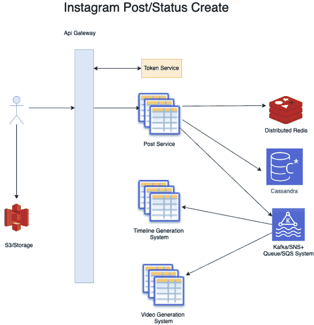
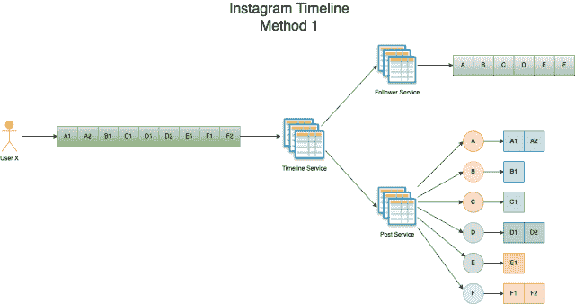
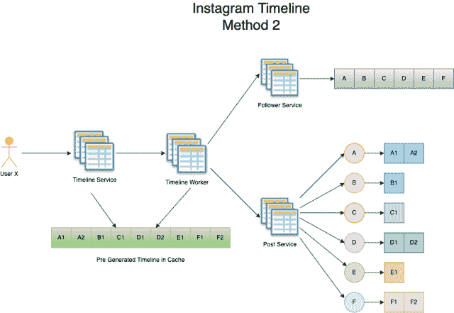
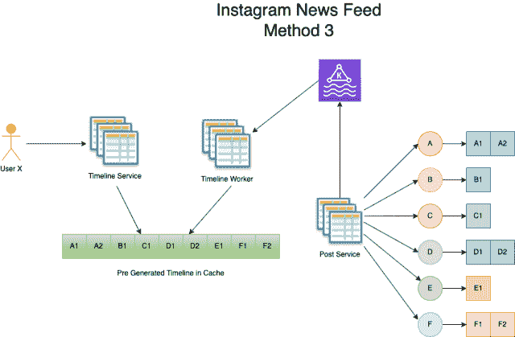
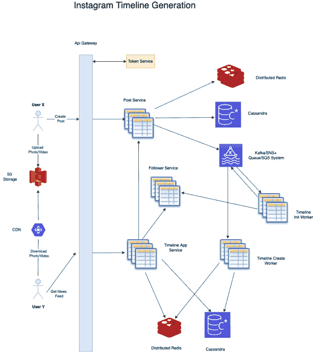

# Instagram 系统设计

> 原文：[`techbyexample.com/instagram-system-design/`](https://techbyexample.com/instagram-system-design/)

目录

+   概述

+   功能需求

+   非功能需求

+   用户 API

+   数据存储

+   使用什么数据库

    +   如何上传照片和视频

    +   如何存储点赞和评论

+   发布状态更新

+   如何生成时间线

    +   不同的时间线生成方法

    +   第一种方法 – 在运行时获取更新

    +   第二种方法 – 使用拉取方式生成时间线（从数据库获取）

    +   第三种方法 – 使用推送方式生成时间线

    +   第四种方法 – 在更新可用时将其推送到客户端

+   其他常见组件

+   非功能需求

    +   可扩展性

    +   低延迟

    +   可用性

    +   警报和监控

    +   向用户位置靠近

    +   避免单点故障

+   结论

## **概述**

Instagram 是最受欢迎的社交媒体分享应用之一，允许用户与其他用户分享他们的照片和视频。用户可以点赞和评论其他用户的照片和视频。用户可以互相关注，并查看他们关注的用户的新闻动态。

## **功能需求**

Instagram 设计的一些功能需求包括：

+   用户可以发布带有图片或视频的状态更新

+   为用户生成时间轴，其中将包含该用户的新闻提要

+   用户将能够点赞或评论帖子

+   允许一层评论嵌套

+   用户应能够互相关注或取消关注

## **非功能性需求**

系统的一些非功能性需求包括

+   在像 Instagram 这样的系统中，人们查看照片和新闻提要的频率远高于上传照片。因此，这是一个读重的系统。我们需要以最小延迟设计系统。读写比为 80:20

+   系统应具备高度可用性，能够服务 5 亿用户

+   系统应该是持久的。任何上传到系统的图片、视频或帖子都必须始终存在，除非用户自己删除它们

+   系统需要最终一致性。这意味着一旦用户上传了任何照片，过一段时间后，它将在其关注者的时间轴中可见

## **用户 API**

以下是所需的 API

+   创建一个带照片或视频的帖子

+   评论一个帖子

+   对评论本身进行评论

+   点赞帖子

+   点赞评论

+   获取时间轴

## **数据存储**

对于数据存储，我们需要存储以下内容

+   图像和视频

+   帖子

+   评论和点赞

+   关注者

+   新闻提要

## **选择什么数据库**

+   对于 Instagram，我们不需要满足 ACID 要求，且数据量将非常庞大，因此我们需要使用 No SQL 数据库

+   系统将是读重的。

我们可以使用 Cassandra 数据库，因为它是一个 No SQL 数据库，可以存储大量数据，同时也能处理高读写量。

现在，让我们看一下每个元素存储的数据模型

### **照片和视频如何上传**

存储图像和视频需要便宜的存储空间，可以使用文件系统。我们可以使用 Amazon S3 或 HDFS。进一步可以使用 CDN 来缓存图像和视频。

### **点赞和评论如何存储**

首先，让我们列出所有与点赞和评论相关的需求

+   帖子可以有任意数量的点赞

+   帖子可以有任意数量的评论

+   你可以点赞帖子，也可以点赞评论

+   允许一层评论嵌套

为了简化，我们将有

+   有两个点赞表，一个是**post_like**，另一个是**comment_like**

+   一个帖子表，

+   一个评论表。

以下是所有的表格。

**帖子表**

以下是**帖子表**中的字段。此表将根据**user_id**进行分区。

+   **post_id**

+   **标题**

+   **描述**

+   **tags –** 该字段将是哈希值

+   **缩略图**

+   **user_id**

+   **创建时间**

+   **更新**

+   **image_id**

该表将根据 **user_id** 进行分片，以便我们能从单个分片中访问用户的所有帖子**评论表**

以下是**评论表**中的字段。此表将根据**post_id**进行分区。这样做是为了确保与某个帖子的所有评论都在同一个分片中

+   **comment_id**

+   **评论 –** 这是一个文本字段

+   **post_id**

+   **user_id**

+   **创建时间**

+   **更新**

+   **parent_id –** 这个字段用于处理评论的嵌套结构。

这个表应该根据 post_id 进行分片，以便我们能够从一个分片中获取属于某个帖子的所有评论。

**post_like 表**

Instagram 会显示你是否已点赞某个帖子，同时也会显示哪些用户点赞了某个特定的帖子。所有这些信息都会存储在这个表中。这个表将根据 post_id 进行分片，以便你可以通过单一分片获取与某个帖子相关的所有点赞。

以下是**Post_Like 表**中的字段。

**Post_Like 表**

+   **id**

+   **user_id**

+   **post_id**

+   **created**

+   **updated**

这个表应该根据 post_id 进行分片，以便我们能够从一个分片中获取属于某个帖子的所有点赞。如何获取某个帖子的点赞数，我们可以直接查询这个表来获取该信息。该统计信息也可以存储在缓存中。每当对帖子进行**点赞**时，缓存就会被更新。另一种方式是每次有**点赞**时就刷新缓存。

你可以拥有一个独立的服务，这可以是一个监听特定主题的工作者，当**点赞**事件发生时，它会被发布到该主题。该工作者将更新或失效缓存。**comment_like 表**

以下是 Comment_Like 表中的字段。这个表也会根据 post_id 进行分区。这样做是为了确保与某个帖子的评论相关的所有点赞都能存储在一个分片中。

+   **id**

+   **user_id**

+   **post_id**

+   **comment_id**

+   **created**

+   **updated**

这个表应该根据 comment_id 进行分片，以便我们能够从一个分片中获取属于某个评论的所有点赞。

如何获取某个评论的点赞数。我们可以直接查询这个表来获取相关信息。与**post_like**表类似，我们也可以将这些信息存储在某种缓存中。

**粉丝和相关数据将如何存储。**

为此，将会有一个**Follow**表。以下是**Follow**表中的字段。

+   user_id

+   follower_user_id

+   created

+   updated

**新闻推送将如何存储**

当我们讨论如何生成新闻推送时，会讨论新闻推送的存储方式。

**高级设计**

从高层次上讨论一下更高的流程以及会存在的所有服务。

+   将会有一个**API 网关**，所有用户的请求都会先到达这个网关。

+   将会有一个**User** **service**，它将存储用户的个人信息。

+   将会有一个**Token** **service**，它将生成并验证令牌。基本上，它会处理与令牌管理相关的所有事务。

+   将会有一个**Post Service**，所有与帖子相关的请求都会被接收。

+   **Post** **service** 首先会在数据库中为帖子在帖子表中创建一条记录。

+   帖子在数据库中创建后，会将消息发送到**Kafka + SNS/SQS 系统**。

+   这条消息将被**时间线初始化服务（Timeline_Init Service）**处理，这个工人将向**关注者服务（Follower Service）**发起调用，以获取该帖子所有者的所有关注者。然后它将把消息分发到每个关注者的**Kafka + SNS/SQS 系统**。

+   每个分发消息将由另一个工人处理，这个工人将是**时间线创建工人（Timeline_Create Worker）**。它将为用户创建时间线。稍后在本教程中，我们将研究生成动态的不同方式和场景。

+   将会有一个**关注者服务（Follower Service）**。当任何用户关注某个用户时，调用将进入该服务。该服务将会在数据库中创建一条记录，并将消息推送到**Kafka + SNS/SQS 系统**。

+   这条消息将被**通知服务（Notification Service）**处理，该服务将是一个工人。这个**通知工人（Notification Worker）**将向被关注的用户发送通知。

+   还将有一个**反馈服务（Feedback Service）**，该服务将处理所有与点赞帖子或评论、评论帖子或评论本身相关的 API 调用。同样，一旦接收到此类活动，它将发布一条消息到 Kafka + SNS 系统。

+   这条消息将被**通知服务（Notification Service）**处理，作为一个工人，它将向帖子所有者或评论所有者（根据适用情况）发送通知。

+   这条消息也会被另一个工人处理，名为**反馈计数器工人（Feedback_Counter）**。该工人将增加评论或帖子（取决于情况）上的点赞数。计数将会在缓存中增加。

让我们详细讨论每个流程，并为每个流程绘制一个图示。

## **发布状态更新**

如前所述，当有人创建帖子时，帖子服务将介入。帖子可能包含要上传的照片或视频。让我们看看这些图片和视频是如何上传的。对于图片和视频的上传，我们可以假设不会上传原始大小的图片或视频。客户端将创建一个低分辨率版本，然后上传。即使是任何图像和视频的低分辨率版本也只有几 KB。它们可以直接上传到存储提供商。例如，如果存储提供商是 AWS S3，那么以下就是流程：

+   假设用户 A 在其 Instagram 客户端上想要发布一个包含图片或视频的状态。客户端将向服务器发送请求，获取一个预签名的 URL，以便客户端可以上传图片或视频。

+   服务器将响应一个预签名的 URL，其有效期可能是几个小时。你可以阅读这篇文章来了解预签名 URL 的概念。请参考这份文档了解更多关于预签名 URL 的信息——[`docs.aws.amazon.com/AmazonS3/latest/userguide/ShareObjectPreSignedURL.html`](https://docs.aws.amazon.com/AmazonS3/latest/userguide/ShareObjectPreSignedURL.html)。基本上，它是一个已经用令牌签名的 URL，因此可以直接上传到存储提供者 S3，而无需进一步的身份验证。这也叫做直接上传。服务器还会返回此处的 image_id。

+   客户端将把图像上传到该 URL。它将直接存储在 S3 中。

+   现在客户端将请求创建包含在前面步骤中上传的图像或视频的 POST 请求。它还会发送上传视频和照片的 ID。

+   该请求将被**Post 服务**接收，Post 服务将在数据库中的帖子表中创建一个条目。

+   然后它将消息发送到**Kafka + SNS/SQS 系统**。

+   该消息将由**时间轴服务**处理，包括**timeline_Init**和**timeline_create**工作器。它们将创建时间轴。

+   **Post 服务**还将把新创建的帖子缓存到分布式 Redis 中

一条帖子也可能包含视频。我们可以对视频流进行一个优化。对于视频流，我们有两个要求。

+   上传的视频应适合在多种设备上查看。

+   世界各地的人们网络速度不同。因此，自适应比特率流意味着根据网络速度选择不同的分辨率，以避免缓冲。

为了满足上述两个要求，我们可以做以下几件事

+   将视频转码为不同格式

+   将每个转码视频转换为不同的分辨率。不同的分辨率可以是 144p、480p、1080p。

可能会有与视频管理相关的独立服务来执行上述操作。

以下是该过程的高层次图示

## **时间轴将如何生成**

让我们来看一下用户时间轴是如何生成的。用户的时间轴将提前在缓存中更新。我们已经看到有人发布状态时发生了什么。现在让我们看看之后会发生什么，以便生成用户时间轴。

首先，让我们探索时间轴生成的不同方法。

### **时间轴生成的不同方法**

生成时间轴的主要方法有四种

+   在运行时获取更新（客户端到服务器）

+   使用拉取方法生成时间轴预生成（从数据库提取并从客户端到服务器）

+   使用推送方法生成时间轴预生成（事件驱动和客户端到服务器）

+   当有更新时推送（服务器到客户端）

我们将结合这些方法来最终生成用户的时间线，具体取决于

+   用户是活跃用户还是非活跃用户

+   用户关注其他名人，这些名人可能有数百万粉丝。

所有这些方法都将依赖于一个时间戳值，用来获取每个用户的时间线。这个时间戳将用于构建时间线，以基于用户已经看到的更新。如果用户的时间戳是 2022 年 2 月 23 日 11:15 GMT，那么意味着他已经看到所有在这个时间戳之前的更新。当请求到达服务器时，它只会返回该时间戳之后的时间线或更新。

现在我们来讨论这四种方法。但在讨论这些方法之前，先让我们了解一下用户场景。

用户 X 关注以下用户。

+   **A**

+   **B**

+   **C**

+   **D**

+   **E**

+   **F**

**下面是更多数据**

***A、B、C、D**是拥有数百个粉丝的普通用户

+   **E**是一个拥有数百万粉丝的名人

+   **F**是一个商业账户，也有数百万粉丝。

### **第一种方法 – 运行时获取更新**

在第一种方法中，客户端应用程序将向服务器发起请求。服务将在运行时获取客户的所有更新。

向服务器发起拉取请求将获取当前用户的时间戳。假设这个时间戳为**t1**。然后，它将调用 POST 服务，获取在**t1**之后创建的 A、B、C、D、E 和 F 用户的更新数据。获取到这些数据后，它会将其发送给客户端。下面是相应的示意图。

这种方法存在多个问题—

+   首先，这是一种耗时的方法。为什么呢？因为它将获取

+   第二，它将从所有用户那里获取更新，我们已经提到过，帖子表是基于 user_id 共享的。因此，这个查询将涉及多个分片，从而带来性能开销。

+   这种方法不可扩展

### **第二种方法 – 使用拉取方法生成时间线（从数据库获取）**

在第二种方法中，将有一个额外的**timeline_create**服务，该服务会提前创建用户的时间线。这个任务会定期为每个用户调用。它会获取当前用户的时间戳。假设这个时间戳为**t1**。然后，它将调用数据库，获取在**t1**之后创建的 A、B、C、D、E 和 F 用户的更新数据。获取到更新后，它将把这些数据插入某种数据库或缓存中。我们将其称为时间线数据库或时间线缓存。下面是该数据库的模式。

+   user_id

+   post_id

+   创建

+   更新

**下面是相应的示意图。**

**这种方法的一些问题**

+   可能用户没有新的更新。因此，即使我们尝试查找该用户的新帖子，但有几次结果为空。

+   我们定期获取并更新用户的时间线。很可能用户根本不活跃，我们可能仍在生成该用户的时间线。

### **第三种方法——使用推送方法生成时间线**

在这种方法中

+   用户发布任何状态更新时，会在 SNS/Kafka 上发布一条消息。

+   该消息由 **timeline_init** 服务处理，它是一个工作者。

+   **timeline_init** 服务会获取前 100 批粉丝。对于每个粉丝，它会再次将消息分发给 **timeline_create** 服务，它也是一个工作者。此过程会对所有粉丝重复进行。

+   **timeline_create** 服务接收到消息后，会使用该 post_id 更新粉丝的时间线。

以下是相同方法的示意图。

**这种方法的问题**

+   名人或商业账户可能会有大量粉丝。当这些账户发布状态时，需要更新所有百万级粉丝的时间线。这种做法效率低下。

+   同样，类似于方法 2，我们可能会更新一个不活跃用户的时间线。

### **第四种方法——在更新可用时推送到客户端**

这是服务器到客户端的通信。它也是事件驱动的。只不过，一旦更新可用，它会从服务器推送到客户端。所以用户没有预先生成的时间线，因为更新是直接从服务器推送到客户端的。这种服务器到客户端的通信需要不同类型的协议，如 WebSockets。

以下是此方法的示意图。

**这种方法的问题**

*** 服务器到客户端的通信需要套接字或任何其他类似的技术。这些技术在资源消耗方面很昂贵，并且需要保持持久的连接。

+   如果客户端处于离线状态怎么办？在这种情况下，当服务器推送更新时，如果发现客户端离线，服务器可以将更新保存到数据库并进行缓存。

+   WebSockets 对于一些实时性要求很高的应用（例如 WhatsApp）非常有用，但可能不太适合 Instagram。因此，如果 Instagram 使用 WebSockets，可以采用这种方法。

**推荐方法**

如上所示，每种方法都有一些缺点。因此，用户的时间线生成将取决于天气。

+   用户是活跃用户

+   用户是非活跃用户

**用户是活跃用户**

在这种情况下，我们可以结合使用方法 1 和方法 3。

+   使用方法 3，我们可以为该用户生成时间线，只针对那些拥有数百个粉丝的账户。

+   然后在运行时，我们可以从所有名人和商业账户获取更新，并将其与步骤 1 中生成的时间线合并。

让我们通过一个示例来理解上面的内容。正如我们之前提到的，用户 X 关注了以下用户

+   **A – A1->A2**

+   **B – B1**

+   **C – C1**

+   **D – D1->D2**

+   **E – E1**

+   **F – F1->F2**

+   **A、B、C、D** 是普通用户，他们的粉丝数为数百

+   **E** 是一位拥有数百万粉丝的名人

+   **F** 是一个商业账户，也有数百万的粉丝

所以，当用户是活跃用户时，下面是时间线生成的方式。

+   **A、B、C、D** 是普通用户，他们的粉丝数为数百。因此，用户 X 的时间线将使用方法 3 生成，包含这些用户的帖子。所以用户 X 的时间线将如下生成并保存在缓存中

A1->A2->B2->C1->D1-D2

+   用户**X**的时间线不会包含来自用户**E**和用户**F**的帖子

+   当用户调用获取时间线时，运行时会从用户 E 和 F 获取更新/帖子，然后将其与来自**A、B、C、D**用户已生成的时间线合并并返回。

**用户不是活跃用户**

在这种情况下，我们只能使用方法 1。由于用户根本不是活跃用户，只是每周打开一次应用程序，因此事先为该用户生成时间线没有意义，因为这会浪费存储空间。所以在这种情况下，当用户调用获取时间线时，运行时将从**A、B、C、D、E、F**用户获取更新/帖子。

但如果一个用户有大量粉丝，这样做似乎并不高效。这时，方法 2 就派上了用场。当用户上线时，我们可以使用方法 1 从其部分粉丝处获取更新。然后它可以触发后台任务，使用方法 2 为用户生成剩余的时间线。以下是一个示例来帮助理解

+   当用户调用获取时间线时，运行时会从**A、B、C**用户获取更新/帖子

+   会触发一个后台任务，使用方法 2 为用户生成剩余的时间线，获取来自**D、E、F**的更新/帖子。当用户观看第一组更新时，第二组更新可以从生成的时间线中提取。

所以总体来说，方法 2 可以在运行时用来为用户生成时间线。当方法 1 非常昂贵时，也可以优先使用方法 2。**下面是时间线生成的高层次示意图。假设有两个用户 X 和 Y，Y 是 X 的粉丝，Y 还关注其他名人用户。在下面的高层次图中，我们结合了方法 1 和方法 3。**

***   使用方法 1，它从用户 Y 关注的名人用户获取更新

+   使用方法 3，它会预先为用户 Y 创建时间线。此时间线是通过用户 Y 关注的非名人用户的帖子生成的。

以下是高层次流程

**对于用户 A**

+   用户 A 想要发布带有图片的帖子。它调用 POST 服务来获取签名的 URL。然后它使用签名的 URL 直接上传到 tS3。

+   然后，它直接调用 POST 服务来创建帖子。该帖子会同时保存在数据库和缓存中。

+   在帖子创建到数据库后，系统会将消息发送到 **Kafka + SNS/SQS 系统**。

+   这条消息将被 **Timeline_Init** **Service** 拾取，这个服务是一个工作者，它将调用 **Follower Service** 来获取发布者的所有粉丝。然后它会将消息广播到每个粉丝，并发送到 **Kafka + SNS/SQS 系统**。

+   每个广播的消息将由另一个工作者处理，这个工作者将是 **Timeline_Create Worker**。它将为用户 B 创建新闻推送。这就是时间线生成的第三种方法发挥作用的地方。

**对于用户 B**

+   用户 B 想要获取他的时间线。

+   Instagram 调用 Timeline App 服务。Timeline App 服务做两件事。

+   首先，它调用关注者服务来获取用户 Y 关注的名人用户。然后，它从 POST 服务中获取这些名人用户的更新。此时方法 1 就开始发挥作用。

+   其次，它从缓存和数据库中获取用户 Y 的预先创建的时间线。

+   它将两者的结果合并，并返回给 Instagram 客户端，以供用户 Y 使用。

+   Instagram 然后使用返回的时间线中的 URL 直接从 S3 下载图片/视频。我们也可以将照片/视频缓存到 CDN 上，这样可以更快地检索媒体内容。

这就是 Instagram 中时间线生成的全部内容。

## **其他常见组件**

其他常见的组件可能包括：

+   用户服务 – 存储用户的个人信息。

+   令牌/认证服务 – 管理用户令牌。

+   短信服务 – 用于向用户发送任何类型的消息。例如 – OTP（一次性密码）。

+   分析服务 – 这个服务可以用来追踪任何类型的分析数据。

## **非功能性需求**

现在我们来讨论一些非功能性需求。

### **可扩展性**

在上述设计中，首先要考虑的是可扩展性因素。系统中每个组件的可扩展性都非常重要。以下是你可能遇到的可扩展性挑战及其可能的解决方案：

+   每台 **Post Service**、**Timeline Service** 等机器只能处理有限数量的请求。因此，每个服务应该配置合适的自动扩展，以便根据请求数量动态增加实例并在需要时进行自动扩展。

+   你的 Kafka/SNS 系统可能无法承受如此大的负载。我们可以横向扩展，但也有一定的限制。如果它成为瓶颈，那么根据地理位置或用户 ID，我们可以拥有两个或更多这样的系统。可以使用服务发现来确定请求应该发送到哪个 Kafka 系统。

+   可扩展性的另一个重要因素是我们设计系统的方式，确保没有服务被过多任务拖慢。我们进行关注点分离，且在某个服务承担过多责任时，我们会将其拆解。

+   可扩展性的另一个因素是分片。需要存储大量数据，而显然这些数据无法存储在单一机器上。最好将数据分区存储在不同的机器上，从而保证整体架构的可扩展性。我们需要根据存储预估选择分片的数量，并且要智能地选择分片键或分区键，以确保没有查询会跨多个分片。

### **低延迟**

+   我们可以缓存新创建的帖子，并设置一定的过期时间。当然，每当一个帖子被创建时，它更有可能出现在其他用户的时间线中。这将减少许多读取请求的延迟。

+   我们在这里做的另一个延迟优化是将用户的时间线缓存，而不是直接保存到数据库。通过缓存，时间线可以更快速地返回。

+   我们可以将照片和视频缓存到 CDN 中，这将加速媒体的检索。

+   进一步提高延迟的一个领域是优化视频流。

### **可用性**

为了使系统具有高可用性，几乎所有系统组件都需要具备冗余和备份。以下是一些需要完成的任务。

+   对于我们的数据库，我们需要启用复制。每个主分片节点应该有多个从节点。

+   对于 Redis，我们还需要进行复制。

+   为了确保数据冗余，我们也可以采用多区域架构。如果某个区域出现故障，这可能是其中的一个好处。

+   也可以设置灾难恢复

### **告警与监控**

告警与监控是一个非常重要的非功能需求。我们应该监控每个服务并设置适当的警报。可以监控的一些内容包括：

+   API 响应时间

+   内存消耗

+   CPU 消耗

+   磁盘空间消耗

+   队列长度

+   ….

### **靠近用户位置**

这里有几种架构可以遵循，其中一种是单元架构。你可以在这里了解更多关于单元架构的信息 – [`github.com/wso2/reference-architecture/blob/master/reference-architecture-cell-based.md`](https://github.com/wso2/reference-architecture/blob/master/reference-architecture-cell-based.md)

### **避免单点故障**

单点故障指的是系统中的某个部分，一旦停止工作，将导致整个系统崩溃。我们应尽量避免设计中的单点故障。通过冗余和采用多区域架构，我们可以防止这种情况发生。

## **结论**

这篇文章主要讨论了 Instagram 的系统设计。希望你喜欢这篇文章。请在评论中分享你的反馈******
