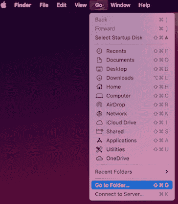
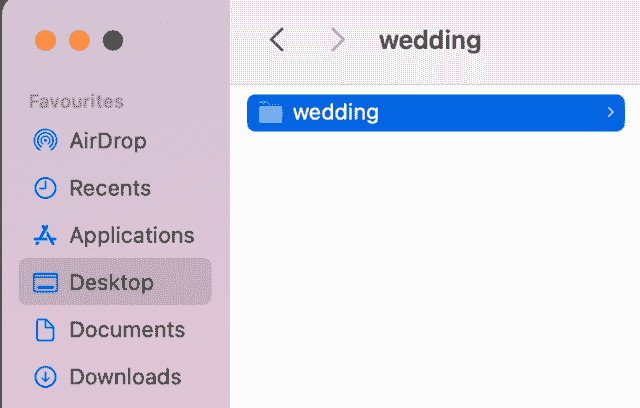
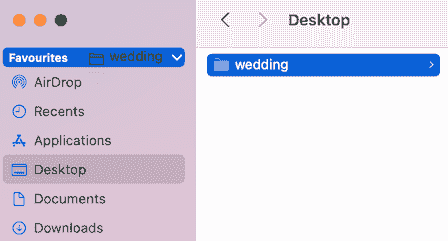

# 如何在 MAC OS 中将文件夹设为收藏夹

> 原文：[`techbyexample.com/folder-favorite/`](https://techbyexample.com/folder-favorite/)

# **概述**

只需将该文件夹拖动到收藏夹中。以下是步骤

+   进入该文件夹。假设该文件夹名为 **wedding**，位于 **~/Desktop** 位置。

    +   点击 Dock 中的 Finder

    +   进入菜单 **Go->Go To Folder**，然后输入 **~/Desktop**

+   现在将**wedding**文件夹拖到收藏夹中。如下图所示，两张图片。

就是这样。你完成了

**注意：** 请查看我们的系统设计教程系列 [系统设计问题](https://techbyexample.com/system-design-questions/)
