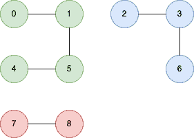

# 计算无向图中无法互通的节点对数量

> 原文：[`techbyexample.com/count-unreachable-pair-nodes/`](https://techbyexample.com/count-unreachable-pair-nodes/)

# **概述**

给定一个整数 n，表示节点的数量，节点编号从 0 到 n-1。还给定了一个二维整数数组 **edges**，其中 **edges[i] = [ai, bi]** 表示从 ai 到 bi 之间存在一条无向边。

目标是找出彼此无法互通的节点对的数量

**示例 1**

```go
n=3
edges=[{0,1}]
```

**图**


**输出**

2

我们有两对节点是未连接的

```go
[{0,2}, {1,2}]
```

**示例 2**

```go
n=9
edges=[{0,1},{0,4},{0,5},{2,3},{2,6},{7,8}]
```

**图**



**输出：**

**26**

我们有 26 对节点是未连接的

```go
[{0,2}, {0,3}, {0,6}, {0,7}, {0,8},
{1,2}, {1,3}, {1,6}, {1,7}, {1,8},
{4,2}, {4,3}, {4,6}, {4,7}, {4,8},
{5,2}, {5,3}, {5,6}, {5,7}, {5,8},
{7,2}, {7,3}, {7,6},
{8,2}, {8,3}, {8,6}]
```

这个思路是从每个未访问的节点开始进行深度优先搜索（DFS），以识别断开图中每个连接图的节点数量。例如，上图中，每个连接图的节点数量是

```go
4
3
2
```

然后我们只需找到每个已连接图中节点对的数量

# **程序**

下面是实现此逻辑的程序

```go
package main

import "fmt"

func countPairs(n int, edges [][]int) int64 {
	nodeMap := make(map[int][]int)

	for i := 0; i < len(edges); i++ {
		nodeMap[edges[i][0]] = append(nodeMap[edges[i][0]], edges[i][1])
		nodeMap[edges[i][1]] = append(nodeMap[edges[i][1]], edges[i][0])
	}

	visited := make(map[int]bool)

	var output int64
	var totalNodesVisited int64
	for i := 0; i < n; i++ {
		if !visited[i] {
			nodeVisited := visit(i, nodeMap, &visited)
			if totalNodesVisited != 0 {
				output += totalNodesVisited * nodeVisited
			}
			totalNodesVisited += nodeVisited
		}
	}
	return output
}

func visit(source_node int, nodeMap map[int][]int, visited *map[int]bool) int64 {
	(*visited)[source_node] = true

	var totalNodeVisited int64
	totalNodeVisited = 1
	neighbours, ok := nodeMap[source_node]
	if ok {
		for _, neighbour := range neighbours {
			if !(*visited)[neighbour] {
				nodeVisited := visit(neighbour, nodeMap, visited)
				totalNodeVisited += nodeVisited
			}
		}
	}

	return totalNodeVisited
}

func main() {

	n := 3
	edges := [][]int{{0, 1}}
	output := countPairs(n, edges)
	fmt.Println(output)

	n = 9
	edges = [][]int{{0, 1}, {0, 4}, {0, 5}, {2, 3}, {2, 6}, {7, 8}}
	output = countPairs(n, edges)
	fmt.Println(output)
}
```

**输出：**

```go
2
26
```

**注意：** 查看我们的 Golang 高级教程。本系列教程内容详尽，涵盖了所有概念，并附有示例。这篇教程适合那些希望深入学习 Golang，提升专业技能并获得扎实理解的读者 – [Golang 高级教程](https://golangbyexample.com/golang-comprehensive-tutorial/)

如果你有兴趣了解如何在 Golang 中实现所有设计模式。如果是的话，那么这篇文章适合你 – [所有设计模式 Golang](https://golangbyexample.com/all-design-patterns-golang/)

同时，也可以查看我们的系统设计教程系列 – [系统设计教程系列](https://techbyexample.com/system-design-questions/)
